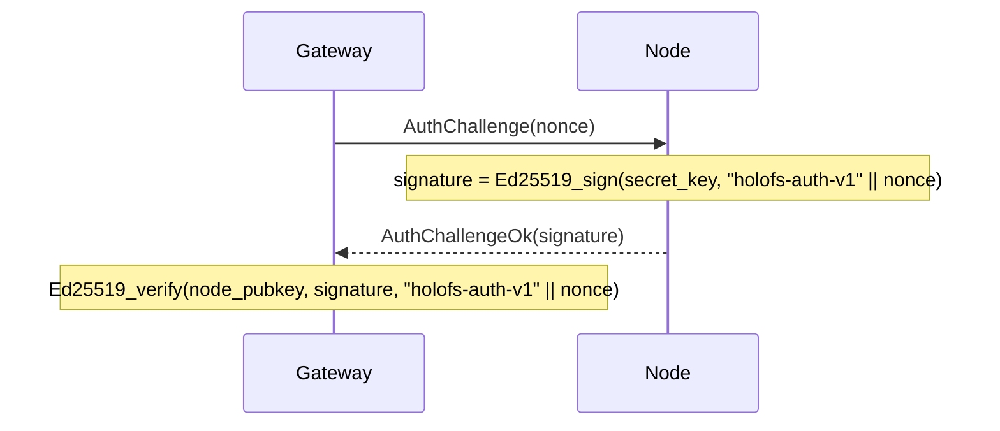

# API Reference

Three external interfaces: **HTTP gateway**, **node wire protocol**, and
**on-disk file formats** (manifest, catalog, shard, whitelist, holoshare).

## Contents

1. [HTTP gateway](#1-http-gateway)
2. [Wire protocol (TCP)](#2-wire-protocol-tcp)
3. [On-disk formats](#3-on-disk-formats)
4. [Response header conventions](#4-response-header-conventions)

---

## 1. HTTP gateway

Base URL: `http://<addr>:8787/` (HTTPS via the gateway's own TLS scaffold
from Stage 6 — `HOLOFS_TLS=1`, mTLS via `HOLOFS_MTLS=1`).

> **Stage 9 update.** Paths are slash-separated and addressable as
> wildcards (`/photos/2026/img.jpg`). The reserved top-level segments —
> `api`, `health`, `escrow`, `preview`, `inspect`, `similar`, `diff`,
> `admin`, `metrics`, `pkg`, `help`, `inspect-zoom` — cannot be used as
> the first segment of an object path because they shadow real routes.

> **Stage 11 update.** `GET /<path>` and `GET /preview/<path>` honour
> the `Range:` request header per RFC 9110 §14.2. A single satisfiable
> byte range returns `206 Partial Content` with `Content-Range`. The
> object is decoded in full server-side and the response is a slice of
> the resulting buffer (progressive layer streaming is not implemented).
> Multi-range requests fall back to a `200` with the full body; malformed
> headers are ignored. `Range: bytes=A-B` past EOF answers `416` with
> `Content-Range: bytes */<total>`.

### Catalog CRUD

| Method   | Path                       | Description                                 | Body / params |
|----------|----------------------------|---------------------------------------------|---------------|
| `GET`    | `/`                        | HTML catalog; reads `?p=<prefix>` for the directory to list | —             |
| `GET`    | `/<path>`                  | Download object in canonical form. Honours `Range` (Stage 11) — `206` on partial, `416` on unsatisfiable. | Range supported |
| `GET`    | `/preview/<path>`          | Coarse preview (L0 only). Range honoured against the preview-sized body. | Range supported |
| `PUT`    | `/<path>`                  | Upload raw bytes, kind auto-detected. Parent directory must exist (via `mkdir`) | body = file |
| `DELETE` | `/<path>`                  | Remove object + Purge on all nodes. Refuses directory entries (use `rmdir`) | —             |

### Directory operations (Stage 9)

Two flavours of each catalog mutation: a wildcard JSON variant for
programmatic / `curl` callers, and a form-urlencoded POST that the UI's
HTML forms can hit without JavaScript. The form variants 303-redirect to
`/?p=<parent>` so the browser navigates back to the directory the user
was viewing.

| Method   | Path                       | Description                                                 | Body / params                |
|----------|----------------------------|-------------------------------------------------------------|------------------------------|
| `POST`   | `/api/mkdir/<path>`        | Create a `Directory` marker. Parent must exist.             | — (JSON response)            |
| `POST`   | `/api/mkdir`               | Form-friendly mkdir; redirects to `/?p=<parent>`            | `parent=…&name=…`            |
| `DELETE` | `/api/rmdir/<path>`        | Remove empty directory. 409 if it has children.             | — (JSON response)            |
| `POST`   | `/api/rmdir`               | Form-friendly rmdir; redirects on success                   | `path=…`                     |
| `POST`   | `/api/mv`                  | Rename / move; directories carry every descendant along     | `from=…&to=…`                |
| `POST`   | `/api/list_dir`            | Leptos server fn: immediate children of `prefix` (JSON-RPC) | `{"prefix":"…"}`             |

Status-code mapping for the dir ops:

| Outcome                                  | Status | `GatewayError`           |
|------------------------------------------|--------|--------------------------|
| OK                                       | 200 / 201 / 303 | —               |
| Target already exists                    | 409    | `AlreadyExists`          |
| Path exists but is not a directory       | 409    | `NotADirectory`          |
| `rmdir` on a non-empty directory         | 409    | `DirectoryNotEmpty`      |
| `GET`/`DELETE` of a `Directory` entry    | 409    | `IsDirectory`            |
| Malformed path (`..`, `//`, leading `/`) | 400    | `BadRequest`             |
| Parent dir missing                       | 400    | `BadRequest`             |
| Unknown entry                            | 404    | `NotFound`               |

#### Response per kind

| Kind      | `GET /<path>` returns                                       |
|-----------|-------------------------------------------------------------|
| image     | `image/png` (re-encoded from f32 channels)                  |
| audio     | `audio/wav` (16-bit PCM, mono/stereo as stored)             |
| text      | text content-type per extension, body includes hole markers if shards short |
| opaque    | original content-type + `Content-Disposition: attachment`   |
| directory | `409 Conflict` — directories have no payload (Stage 9)      |

### Cluster health

| Method | Path                  | Description                                  |
|--------|-----------------------|----------------------------------------------|
| `GET`  | `/health`             | Per-node table, kill/revive buttons          |
| `GET`  | `/health/<name>`      | Margin per (channel, layer), Monte-Carlo loss simulation, zone-failure table |
| `GET`  | `/api/stats`          | JSON: object counts by kind, shards, dedup % |
| `POST` | `/admin/node` (`i=N`) | Toggle node N (admin-side excluded/restored) |

`/api/stats` returns:

```json
{
  "nodes_total": 40,
  "nodes_live": 38,
  "objects_total": 14,
  "objects_by_kind": {"image": 7, "audio": 3, "text": 1, "opaque": 1, "directory": 2},
  "shards_total": 5328,
  "shards_unique": 5326,
  "dedup_savings_pct": 0.04,
  "bytes_total": 50266112
}
```

`objects_total = sum(objects_by_kind)`; `directory` markers are counted
but contribute nothing to `shards_total` / `bytes_total`.

### Search and analytics

| Method | Path                          | Description                                  |
|--------|-------------------------------|----------------------------------------------|
| `GET`  | `/similar/<path>`             | Top-10 similar objects + cross-object overlap |
| `GET`  | `/diff?a=<a>&b=<b>`           | Per-chunk diff visualisation. Two object paths don't fit a single route, so Stage 9 moved them into the query string |
| `GET`  | `/api/fingerprint/<path>`     | JSON: 16-byte perceptual hash (image/audio) or first 16 of CID (text/opaque) |

`/api/fingerprint/<name>` returns:

```json
{
  "name": "photo.png",
  "fingerprint": "a3f08c7d12...",
  "kind": "image"
}
```

### Shard inspection

The `c_l_idx` triple identifies one shard within an object as
`<channel>_<layer>_<idx>`. Stage 9 reordered the URL so the fixed triple
sits in front of the wildcard object path.

| Method | Path                                                     | Description |
|--------|----------------------------------------------------------|-------------|
| `GET`  | `/inspect/<path>`                                        | Grid of all shard thumbnails (color-coded sys vs RLNC) |
| `GET`  | `/api/shard/<c_l_idx>.png/<path>`                        | 32×32 grayscale PNG of one shard's payload |
| `GET`  | `/inspect-zoom/<c_l_idx>/<path>`                         | Large render + hex coeffs + payload + node info |

### Holographic key escrow

| Method | Path                            | Description |
|--------|---------------------------------|-------------|
| `GET`  | `/escrow`                       | UI with split + recover forms |
| `POST` | `/escrow/split`                 | `file=…` + `k=…` + `n=…` → split into `n` `.holoshare` files |
| `GET`  | `/escrow/download/<id>_<idx>.holoshare` | Download one share (held in gateway memory) |
| `POST` | `/escrow/recover`               | `shares=…` (multiple) → recover original file |

`.holoshare` files are **not stored on the cluster** — the gateway computes
them on demand and keeps them in memory until restart or until the user
downloads them.

---

## 2. Wire protocol (TCP)

Nodes listen on a TCP socket. Each message is one frame:

```
+--------+--------------------+
| u32 BE | payload (≤ 64 MiB) |
+--------+--------------------+
```

The 64 MiB cap (`holofs_wire::MAX_FRAME`) is enforced at decode time;
nodes drop oversized frames and close the connection.

### Request types

| Op   | Name              | Payload                                       |
|------|-------------------|-----------------------------------------------|
| 0x00 | `Ping`            | (empty)                                       |
| 0x01 | `Put`             | object\_id, channel, layer, Shard             |
| 0x02 | `Get`             | object\_id, channel, layer                    |
| 0x03 | `Purge`           | object\_id                                    |
| 0x04 | `Stat`            | (empty)                                       |
| 0x05 | `Audit`           | object\_id, channel, layer, shard\_hash       |
| 0x06 | `AuthChallenge`   | nonce[32]                                     |

### Response types

| Op   | Name                  | Payload                                       |
|------|-----------------------|-----------------------------------------------|
| 0x00 | `Pong`                | (empty)                                       |
| 0x01 | `Ack`                 | (empty)                                       |
| 0x02 | `Shards`              | count: u32 BE + N × Shard                     |
| 0x03 | `StatResp`            | total\_shards: u32 BE                         |
| 0x04 | `AuditResp`           | tag: u8 (0=None, 1=Some) + optional Shard     |
| 0x05 | `AuthChallengeOk`     | signature[64]                                 |
| 0xff | `Error`               | len: u32 BE + UTF-8 message                   |

### Shard wire format

```
+---------------+-----------+----------------+---------+
| u16 BE coeffs_len | coeffs | u32 BE payload_len | payload |
+---------------+-----------+----------------+---------+
```

(Note: `coeffs_len` is conceptually equal to `K` of the manifest.)

### Authentication handshake

The gateway can challenge any node before trusting its responses:



`node_pubkey` comes from the signed whitelist (see §3 below).

---

## 3. On-disk formats

All multi-byte integers are **big-endian** unless noted. Files are
identified by an 8-byte magic at offset 0.

### 3.1. Manifest (`HOLOFSM7`, legacy `HOLOFSM6` accepted on read)

Stage 9 bumped the magic to `HOLOFSM7` to signal that an entry may carry
the `ObjectKind::Directory` discriminant (tag `4`). The wire layout is
byte-for-byte identical to `HOLOFSM6`; only the legal set of `kind`
values grew. Old `HOLOFSM6` files decode cleanly under the new code.

Directory markers have every numeric field zeroed and every `Vec` field
empty; their sole carrier is `object_id` (SHA-256-derived from the path,
domain tag `holofs-dir-v1\0`) and a fixed `content_type` of
`inode/directory`.

A serialised `Manifest` describing one object's encoding.

```
magic           8  bytes = "HOLOFSM7" (legacy "HOLOFSM6" also accepted)
object_id       8  bytes BE
k               2  bytes BE
nlayers         1  byte
channels        1  byte
width           4  bytes BE
height          4  bytes BE
levels          1  byte
placement       1  byte (0=RoundRobin, 1=Rendezvous, 2=RendezvousZoneAware)

n_per_layer     nlayers × u32 BE
sym_len         nlayers × u32 BE
layer_positions for each layer:
                    n_positions: u32 BE
                    positions:   n_positions × u32 BE

nodes_count     u32 BE
for each node:
    addr_len    u16 BE
    addr        addr_len bytes UTF-8

zones           nodes_count bytes (one byte per node)

data_cid        32 bytes (SHA-256)
merkle_root     32 bytes (SHA-256)

shard_hashes    channels × nlayers × variable:
                    count: u32 BE
                    hashes: count × 32 bytes

kind            1  byte (0=Image, 1=Text, 2=Audio, 3=Opaque, 4=Directory)
content_type    1 byte length + length bytes UTF-8

chunk_lens      u32 BE count + count × u32 BE
                (for text: per-chunk lengths; for opaque: real file length;
                 for image/audio: usually empty)

audio_sample_rate  u32 BE  (0 for non-audio)

text_minhash    u32 BE count + count × u32 BE
                (for text: bottom-K MinHash; empty otherwise)
```

### 3.2. Directory (catalog, `HOLOFSD1`)

```
magic           8 bytes = "HOLOFSD1"
n_entries       u32 BE
for each entry:
    name_len    u16 BE
    name        UTF-8
    manifest_len u32 BE
    manifest    serialised Manifest (§3.1)
```

Written atomically (write to `.tmp`, fsync, rename).

### 3.3. Shard file (`HOLOFSS1`)

```
magic        8  bytes = "HOLOFSS1"
object_id    8  bytes BE
channel      1  byte
layer        1  byte
coeffs_len   4  bytes BE
payload_len  4  bytes BE
coeffs       coeffs_len bytes
payload      payload_len bytes
```

Filename: `<2 hex chars>/<remaining 62>.shard` where the full hex is
`sha256(coeffs || payload)`.

### 3.4. Whitelist (`HOLOFSW1`)

```
magic         8  bytes = "HOLOFSW1"
n_entries     u32 BE
for each entry:
    addr_len  u16 BE
    addr      UTF-8
    pubkey    32 bytes (Ed25519)
    zone      1 byte
admin_pubkey  32 bytes
signature     64 bytes Ed25519
              signs ("holofs-whitelist-v1" || everything-above-the-signature)
```

### 3.5. Holoshare (`HOLOSHAR1`)

One escrow share. The escrow is **not stored on the cluster**; this file
is intended for distribution to humans / devices.

```
magic           9 bytes = "HOLOSHAR1"
escrow_id       16 bytes (first 16 of SHA-256 over the source data)
shard_idx       u16 BE
total_n         u16 BE
total_k         u16 BE
real_len        u64 BE (length of the original file in bytes)
content_type_n  1 byte
content_type    content_type_n bytes UTF-8
filename_n      1 byte
filename        filename_n bytes UTF-8
coeffs_len      u16 BE = total_k
coeffs          coeffs_len bytes
payload_len     u32 BE = sym_len
payload         payload_len bytes
```

A complete escrow group has identical `escrow_id`, `total_n`, `total_k`,
`real_len`, `content_type`, `filename`. Recovery requires any `total_k`
distinct `shard_idx` values from the same `escrow_id`.

---

## 4. Response header conventions

Custom `X-Holofs-*` headers on object responses:

| Header                       | Type      | Description |
|------------------------------|-----------|-------------|
| `X-Holofs-Kind`              | image / audio / text / opaque | object kind |
| `X-Holofs-Layers`            | `0-<max>` | for image / audio: layers actually decoded |
| `X-Holofs-Bytes-Downloaded`  | u64       | bytes pulled from nodes for this response |
| `X-Holofs-Decode-Ms`         | u128      | time spent decoding (excludes network RTT) |
| `X-Holofs-Sample-Rate`       | u32       | audio: sample rate in Hz |
| `X-Holofs-Channels`          | u8        | audio: 1 or 2 |
| `X-Holofs-Chunks-Total`      | usize     | text: total chunk count |
| `X-Holofs-Chunks-Missing`    | usize     | text: chunks replaced by hole markers |
| `X-Holofs-Escrow-Shares-Used`| usize     | escrow recover: number of shares consumed |
