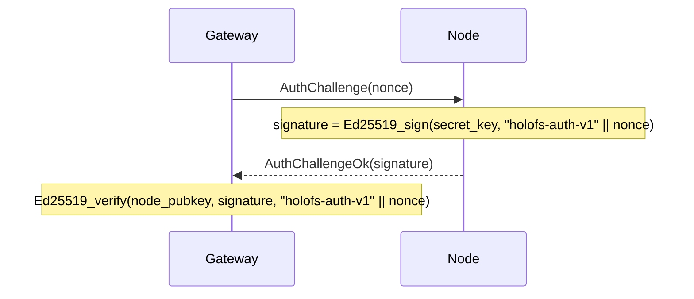

# API Reference

Three external interfaces: **HTTP gateway**, **node wire protocol**, and
**on-disk file formats** (manifest, catalog, shard, whitelist, holoshare).

## Contents

1. [HTTP gateway](#1-http-gateway)
2. [Wire protocol (TCP)](#2-wire-protocol-tcp)
3. [On-disk formats](#3-on-disk-formats)
4. [Response header conventions](#4-response-header-conventions)
5. [MCP server (Stage 12)](#5-mcp-server-stage-12)
6. [Wavelet operations (Stage 12.5)](#6-wavelet-operations-stage-125)

---

## 1. HTTP gateway

Base URL: `http://<addr>:8787/` (HTTPS via the gateway's own TLS scaffold
from Stage 6 — `HOLOFS_TLS=1`, mTLS via `HOLOFS_MTLS=1`).

> **Stage 9 update.** Paths are slash-separated and addressable as
> wildcards (`/photos/2026/img.jpg`). The reserved top-level segments —
> `api`, `health`, `escrow`, `preview`, `inspect`, `similar`, `diff`,
> `admin`, `metrics`, `pkg`, `help`, `inspect-zoom` — cannot be used as
> the first segment of an object path because they shadow real routes.

> **Stage 11 update.** `GET /<path>` and `GET /preview/<path>` honour
> the `Range:` request header per RFC 9110 §14.2. A single satisfiable
> byte range returns `206 Partial Content` with `Content-Range`. The
> object is decoded in full server-side and the response is a slice of
> the resulting buffer (progressive layer streaming is not implemented).
> Multi-range requests fall back to a `200` with the full body; malformed
> headers are ignored. `Range: bytes=A-B` past EOF answers `416` with
> `Content-Range: bytes */<total>`.

### Catalog CRUD

| Method   | Path                       | Description                                 | Body / params |
|----------|----------------------------|---------------------------------------------|---------------|
| `GET`    | `/`                        | HTML catalog; reads `?p=<prefix>` for the directory to list | —             |
| `GET`    | `/<path>`                  | Download object in canonical form. Honours `Range` (Stage 11) — `206` on partial, `416` on unsatisfiable. | Range supported |
| `GET`    | `/preview/<path>`          | Coarse preview (L0 only). Range honoured against the preview-sized body. | Range supported |
| `PUT`    | `/<path>`                  | Upload raw bytes, kind auto-detected. Parent directory must exist (via `mkdir`) | body = file |
| `DELETE` | `/<path>`                  | Remove object + Purge on all nodes. Refuses directory entries (use `rmdir`) | —             |

### Directory operations (Stage 9)

Two flavours of each catalog mutation: a wildcard JSON variant for
programmatic / `curl` callers, and a form-urlencoded POST that the UI's
HTML forms can hit without JavaScript. The form variants 303-redirect to
`/?p=<parent>` so the browser navigates back to the directory the user
was viewing.

| Method   | Path                       | Description                                                 | Body / params                |
|----------|----------------------------|-------------------------------------------------------------|------------------------------|
| `POST`   | `/api/mkdir/<path>`        | Create a `Directory` marker. Parent must exist.             | — (JSON response)            |
| `POST`   | `/api/mkdir`               | Form-friendly mkdir; redirects to `/?p=<parent>`            | `parent=…&name=…`            |
| `DELETE` | `/api/rmdir/<path>`        | Remove empty directory. 409 if it has children.             | — (JSON response)            |
| `POST`   | `/api/rmdir`               | Form-friendly rmdir; redirects on success                   | `path=…`                     |
| `POST`   | `/api/mv`                  | Rename / move; directories carry every descendant along     | `from=…&to=…`                |
| `POST`   | `/api/list_dir`            | Leptos server fn: immediate children of `prefix` (JSON-RPC) | `{"prefix":"…"}`             |

Status-code mapping for the dir ops:

| Outcome                                  | Status | `GatewayError`           |
|------------------------------------------|--------|--------------------------|
| OK                                       | 200 / 201 / 303 | —               |
| Target already exists                    | 409    | `AlreadyExists`          |
| Path exists but is not a directory       | 409    | `NotADirectory`          |
| `rmdir` on a non-empty directory         | 409    | `DirectoryNotEmpty`      |
| `GET`/`DELETE` of a `Directory` entry    | 409    | `IsDirectory`            |
| Malformed path (`..`, `//`, leading `/`) | 400    | `BadRequest`             |
| Parent dir missing                       | 400    | `BadRequest`             |
| Unknown entry                            | 404    | `NotFound`               |

#### Response per kind

| Kind      | `GET /<path>` returns                                       |
|-----------|-------------------------------------------------------------|
| image     | `image/png` (re-encoded from f32 channels)                  |
| audio     | `audio/wav` (16-bit PCM, mono/stereo as stored)             |
| text      | text content-type per extension, body includes hole markers if shards short |
| opaque    | original content-type + `Content-Disposition: attachment`   |
| directory | `409 Conflict` — directories have no payload (Stage 9)      |

### Cluster health

| Method | Path                  | Description                                  |
|--------|-----------------------|----------------------------------------------|
| `GET`  | `/health`             | Per-node table, kill/revive buttons          |
| `GET`  | `/health/<name>`      | Margin per (channel, layer), Monte-Carlo loss simulation, zone-failure table |
| `GET`  | `/api/stats`          | JSON: object counts by kind, shards, dedup % |
| `POST` | `/admin/node` (`i=N`) | Toggle node N (admin-side excluded/restored) |

`/api/stats` returns:

```json
{
  "nodes_total": 40,
  "nodes_live": 38,
  "objects_total": 14,
  "objects_by_kind": {"image": 7, "audio": 3, "text": 1, "opaque": 1, "directory": 2},
  "shards_total": 5328,
  "shards_unique": 5326,
  "dedup_savings_pct": 0.04,
  "bytes_total": 50266112
}
```

`objects_total = sum(objects_by_kind)`; `directory` markers are counted
but contribute nothing to `shards_total` / `bytes_total`.

### Search and analytics

| Method | Path                          | Description                                  |
|--------|-------------------------------|----------------------------------------------|
| `GET`  | `/similar/<path>`             | Top-10 similar objects + cross-object overlap |
| `GET`  | `/diff?a=<a>&b=<b>`           | Per-chunk diff visualisation. Two object paths don't fit a single route, so Stage 9 moved them into the query string |
| `GET`  | `/api/fingerprint/<path>`     | JSON: 16-byte perceptual hash (image/audio) or first 16 of CID (text/opaque) |

`/api/fingerprint/<name>` returns:

```json
{
  "name": "photo.png",
  "fingerprint": "a3f08c7d12...",
  "kind": "image"
}
```

### Shard inspection

The `c_l_idx` triple identifies one shard within an object as
`<channel>_<layer>_<idx>`. Stage 9 reordered the URL so the fixed triple
sits in front of the wildcard object path.

| Method | Path                                                     | Description |
|--------|----------------------------------------------------------|-------------|
| `GET`  | `/inspect/<path>`                                        | Grid of all shard thumbnails (color-coded sys vs RLNC) |
| `GET`  | `/api/shard/<c_l_idx>.png/<path>`                        | 32×32 grayscale PNG of one shard's payload |
| `GET`  | `/inspect-zoom/<c_l_idx>/<path>`                         | Large render + hex coeffs + payload + node info |

### Holographic key escrow

| Method | Path                            | Description |
|--------|---------------------------------|-------------|
| `GET`  | `/escrow`                       | UI with split + recover forms |
| `POST` | `/escrow/split`                 | `file=…` + `k=…` + `n=…` → split into `n` `.holoshare` files |
| `GET`  | `/escrow/download/<id>_<idx>.holoshare` | Download one share (held in gateway memory) |
| `POST` | `/escrow/recover`               | `shares=…` (multiple) → recover original file |

`.holoshare` files are **not stored on the cluster** — the gateway computes
them on demand and keeps them in memory until restart or until the user
downloads them.

---

## 2. Wire protocol (TCP)

Nodes listen on a TCP socket. Each message is one frame:

```
+--------+--------------------+
| u32 BE | payload (≤ 64 MiB) |
+--------+--------------------+
```

The 64 MiB cap (`holofs_wire::MAX_FRAME`) is enforced at decode time;
nodes drop oversized frames and close the connection.

### Request types

| Op   | Name              | Payload                                       |
|------|-------------------|-----------------------------------------------|
| 0x00 | `Ping`            | (empty)                                       |
| 0x01 | `Put`             | object\_id, channel, layer, Shard             |
| 0x02 | `Get`             | object\_id, channel, layer                    |
| 0x03 | `Purge`           | object\_id                                    |
| 0x04 | `Stat`            | (empty)                                       |
| 0x05 | `Audit`           | object\_id, channel, layer, shard\_hash       |
| 0x06 | `AuthChallenge`   | nonce[32]                                     |

### Response types

| Op   | Name                  | Payload                                       |
|------|-----------------------|-----------------------------------------------|
| 0x00 | `Pong`                | (empty)                                       |
| 0x01 | `Ack`                 | (empty)                                       |
| 0x02 | `Shards`              | count: u32 BE + N × Shard                     |
| 0x03 | `StatResp`            | total\_shards: u32 BE                         |
| 0x04 | `AuditResp`           | tag: u8 (0=None, 1=Some) + optional Shard     |
| 0x05 | `AuthChallengeOk`     | signature[64]                                 |
| 0xff | `Error`               | len: u32 BE + UTF-8 message                   |

### Shard wire format

```
+---------------+-----------+----------------+---------+
| u16 BE coeffs_len | coeffs | u32 BE payload_len | payload |
+---------------+-----------+----------------+---------+
```

(Note: `coeffs_len` is conceptually equal to `K` of the manifest.)

### Authentication handshake

The gateway can challenge any node before trusting its responses:



`node_pubkey` comes from the signed whitelist (see §3 below).

---

## 3. On-disk formats

All multi-byte integers are **big-endian** unless noted. Files are
identified by an 8-byte magic at offset 0.

### 3.1. Manifest (`HOLOFSM7`, legacy `HOLOFSM6` accepted on read)

Stage 9 bumped the magic to `HOLOFSM7` to signal that an entry may carry
the `ObjectKind::Directory` discriminant (tag `4`). The wire layout is
byte-for-byte identical to `HOLOFSM6`; only the legal set of `kind`
values grew. Old `HOLOFSM6` files decode cleanly under the new code.

Directory markers have every numeric field zeroed and every `Vec` field
empty; their sole carrier is `object_id` (SHA-256-derived from the path,
domain tag `holofs-dir-v1\0`) and a fixed `content_type` of
`inode/directory`.

A serialised `Manifest` describing one object's encoding.

```
magic           8  bytes = "HOLOFSM7" (legacy "HOLOFSM6" also accepted)
object_id       8  bytes BE
k               2  bytes BE
nlayers         1  byte
channels        1  byte
width           4  bytes BE
height          4  bytes BE
levels          1  byte
placement       1  byte (0=RoundRobin, 1=Rendezvous, 2=RendezvousZoneAware)

n_per_layer     nlayers × u32 BE
sym_len         nlayers × u32 BE
layer_positions for each layer:
                    n_positions: u32 BE
                    positions:   n_positions × u32 BE

nodes_count     u32 BE
for each node:
    addr_len    u16 BE
    addr        addr_len bytes UTF-8

zones           nodes_count bytes (one byte per node)

data_cid        32 bytes (SHA-256)
merkle_root     32 bytes (SHA-256)

shard_hashes    channels × nlayers × variable:
                    count: u32 BE
                    hashes: count × 32 bytes

kind            1  byte (0=Image, 1=Text, 2=Audio, 3=Opaque, 4=Directory)
content_type    1 byte length + length bytes UTF-8

chunk_lens      u32 BE count + count × u32 BE
                (for text: per-chunk lengths; for opaque: real file length;
                 for image/audio: usually empty)

audio_sample_rate  u32 BE  (0 for non-audio)

text_minhash    u32 BE count + count × u32 BE
                (for text: bottom-K MinHash; empty otherwise)
```

### 3.2. Directory (catalog, `HOLOFSD1`)

```
magic           8 bytes = "HOLOFSD1"
n_entries       u32 BE
for each entry:
    name_len    u16 BE
    name        UTF-8
    manifest_len u32 BE
    manifest    serialised Manifest (§3.1)
```

Written atomically (write to `.tmp`, fsync, rename).

### 3.3. Shard file (`HOLOFSS1`)

```
magic        8  bytes = "HOLOFSS1"
object_id    8  bytes BE
channel      1  byte
layer        1  byte
coeffs_len   4  bytes BE
payload_len  4  bytes BE
coeffs       coeffs_len bytes
payload      payload_len bytes
```

Filename: `<2 hex chars>/<remaining 62>.shard` where the full hex is
`sha256(coeffs || payload)`.

### 3.4. Whitelist (`HOLOFSW1`)

```
magic         8  bytes = "HOLOFSW1"
n_entries     u32 BE
for each entry:
    addr_len  u16 BE
    addr      UTF-8
    pubkey    32 bytes (Ed25519)
    zone      1 byte
admin_pubkey  32 bytes
signature     64 bytes Ed25519
              signs ("holofs-whitelist-v1" || everything-above-the-signature)
```

### 3.5. Holoshare (`HOLOSHAR1`)

One escrow share. The escrow is **not stored on the cluster**; this file
is intended for distribution to humans / devices.

```
magic           9 bytes = "HOLOSHAR1"
escrow_id       16 bytes (first 16 of SHA-256 over the source data)
shard_idx       u16 BE
total_n         u16 BE
total_k         u16 BE
real_len        u64 BE (length of the original file in bytes)
content_type_n  1 byte
content_type    content_type_n bytes UTF-8
filename_n      1 byte
filename        filename_n bytes UTF-8
coeffs_len      u16 BE = total_k
coeffs          coeffs_len bytes
payload_len     u32 BE = sym_len
payload         payload_len bytes
```

A complete escrow group has identical `escrow_id`, `total_n`, `total_k`,
`real_len`, `content_type`, `filename`. Recovery requires any `total_k`
distinct `shard_idx` values from the same `escrow_id`.

---

## 4. Response header conventions

Custom `X-Holofs-*` headers on object responses:

| Header                       | Type      | Description |
|------------------------------|-----------|-------------|
| `X-Holofs-Kind`              | image / audio / text / opaque | object kind |
| `X-Holofs-Layers`            | `0-<max>` | for image / audio: layers actually decoded |
| `X-Holofs-Bytes-Downloaded`  | u64       | bytes pulled from nodes for this response |
| `X-Holofs-Decode-Ms`         | u128      | time spent decoding (excludes network RTT) |
| `X-Holofs-Sample-Rate`       | u32       | audio: sample rate in Hz |
| `X-Holofs-Channels`          | u8        | audio: 1 or 2 |
| `X-Holofs-Chunks-Total`      | usize     | text: total chunk count |
| `X-Holofs-Chunks-Missing`    | usize     | text: chunks replaced by hole markers |
| `X-Holofs-Escrow-Shares-Used`| usize     | escrow recover: number of shares consumed |

---

## 5. MCP server (Stage 12)

The gateway exposes a **Model Context Protocol** endpoint at `POST /mcp`
using the Streamable HTTP transport (spec rev `2025-03-26`). MCP clients
like Claude Desktop or Claude Code can call it directly with no scraping
of the web UI; the same `Arc<Gateway>` backs both surfaces, so reads and
writes stay coherent.

### 5.1 Transport

`/mcp` answers POST (client → server messages), GET (optional
server → client SSE stream) and DELETE (session teardown). Sessions
carry an `Mcp-Session-Id` header issued on the initial `initialize`
call. The endpoint sits behind the rest of the axum router on the same
port (default `127.0.0.1:8787`).

### 5.2 Authentication

Auth is controlled by a single env var on the server:

| `HOLOFS_MCP_TOKEN`  | Behaviour                                              |
|---------------------|--------------------------------------------------------|
| unset / empty       | `/mcp` is open but **read-only** — write tools refuse |
| any non-empty value | requires `Authorization: Bearer <token>` on every request |

When a token is set, write tools (`put_object_text`, `mkdir`, `rmdir`,
`mv_object`) are enabled. Without a token they return an
`invalid_request` error pointing the caller at the env var. The token is
read once at startup and never logged — rotating it requires a restart.

Claude Code wiring:

```sh
# read-only
claude mcp add --transport http holofs http://127.0.0.1:8787/mcp

# with auth
claude mcp add --transport http holofs http://127.0.0.1:8787/mcp \
  --header "Authorization: Bearer $HOLOFS_MCP_TOKEN"
```

### 5.3 Tools

Twelve tools, organised by capability:

**Read (always available)**

| Tool                  | Inputs                                  | Returns |
|-----------------------|-----------------------------------------|---------|
| `list_catalog`        | `prefix?`, `recursive?`                 | catalog rows under prefix |
| `read_object_text`    | `path`                                  | UTF-8 body, capped at 256 KiB |
| `find_similar`        | `path`, `scope?` (`all`/`folder`/`tree`)| top-10 neighbours + method |
| `get_cluster_health`  | —                                       | nodes + catalog snapshot |
| `get_object_health`   | `path`                                  | decode-readiness summary |

**Inspect (always available)**

| Tool             | Inputs                                                | Returns |
|------------------|-------------------------------------------------------|---------|
| `diff_objects`   | `a`, `b`, `include_cells?`                            | per-layer chunk overlap |
| `inspect_object` | `path`                                                | per-(channel, layer) layout |
| `inspect_shard`  | `path`, `channel`, `layer`, `idx`, `include_payload?` | shard metadata + optional bytes |

**Write (gated by `HOLOFS_MCP_TOKEN`)**

| Tool              | Inputs                                | Returns |
|-------------------|---------------------------------------|---------|
| `put_object_text` | `path`, `content`, `content_type?`    | `{path, action="wrote", note}` |
| `mkdir`           | `path`                                | `{path, action="created"}` |
| `rmdir`           | `path` (must be empty)                | `{path, action="removed"}` |
| `mv_object`       | `from`, `to`                          | `{path, action="renamed", note}` |

### 5.4 Resources

Every non-directory catalog entry is also exposed via the MCP
`resources/` surface at `holofs:///<catalog-path>`. `resources/list`
returns a row per file with `mimeType` from the manifest and a short
description; `resources/read` decodes the object server-side and
returns:

- **text-kind** → `TextResourceContents` with UTF-8 body
- **image / audio / opaque** → `BlobResourceContents` with base64-encoded payload

Reads are capped at 1 MiB per fetch to keep one resource pull from
saturating an LLM context window.

### 5.5 Wire example (curl)

The initialize → `tools/list` → `tools/call` flow over the Streamable HTTP transport:

```sh
SID=$(curl -si -X POST http://127.0.0.1:8787/mcp \
  -H 'Content-Type: application/json' \
  -H 'Accept: application/json, text/event-stream' \
  -d '{"jsonrpc":"2.0","id":1,"method":"initialize","params":{
    "protocolVersion":"2025-06-18","capabilities":{},
    "clientInfo":{"name":"curl","version":"1"}}}' \
  | grep -i 'mcp-session-id:' | awk '{print $2}' | tr -d '\r')

# required after initialize
curl -s -X POST http://127.0.0.1:8787/mcp \
  -H "Mcp-Session-Id: $SID" -H 'Content-Type: application/json' \
  -H 'Accept: application/json, text/event-stream' \
  -d '{"jsonrpc":"2.0","method":"notifications/initialized"}' > /dev/null

# list every tool
curl -s -X POST http://127.0.0.1:8787/mcp \
  -H "Mcp-Session-Id: $SID" -H 'Content-Type: application/json' \
  -H 'Accept: application/json, text/event-stream' \
  -d '{"jsonrpc":"2.0","id":2,"method":"tools/list"}'

# find similar files of a given object, restricted to its folder
curl -s -X POST http://127.0.0.1:8787/mcp \
  -H "Mcp-Session-Id: $SID" -H 'Content-Type: application/json' \
  -H 'Accept: application/json, text/event-stream' \
  -d '{"jsonrpc":"2.0","id":3,"method":"tools/call","params":{
    "name":"find_similar","arguments":{
      "path":"photos/2026/mandala.png","scope":"folder"}}}'
```

---

## 6. Wavelet operations (Stage 12.5)

These two operations take advantage of the fact that holofs stores
each image/audio object in the wavelet (DWT) domain split across
`(channel, layer)` shard buckets. Manipulating shards at the layer
granularity lets us *transform* an object without ever decoding,
re-encoding, or storing a second copy of the source data.

Both operations are exposed only through MCP today (Stage 12.5) —
HTTP routes can be added later, but `claude mcp` + curl already cover
the same use cases.

### 6.1 Wavelet mix

Builds a hybrid image by partitioning DWT layers between two
compatible source images: layers `0..=split` come from source A,
layers `>split` come from source B. The same IDWT that decodes a
normal object runs on the hybrid coefficient plane, so the result is
a real PNG indistinguishable on the wire from a regular GET.

Compatibility requirements (else `BadRequest`): both objects must be
`Image` kind, share `width / height / channels / k / nlayers /
levels`, and have identical per-layer `sym_len` and `layer_positions`
tables. In practice that means: ingested with the same cluster's
DWT configuration.

MCP tool — `wavelet_mix`:

| Param      | Type             | Notes |
|------------|------------------|-------|
| `a`        | string           | catalog path, owner of layers `0..=split` |
| `b`        | string           | catalog path, owner of layers `>split` |
| `split`    | u8               | DWT split. `0` = only L0 from A, rest from B; `nlayers-1` = entirely A |
| `save_as?` | string           | catalog path to ingest the result at; requires `HOLOFS_MCP_TOKEN`. Omit to get inline bytes. |

Returns `{a, b, split, width, height, channels, bytes_downloaded,
decode_ms, saved_as, bytes_len, content_type, blob_base64}`.
`blob_base64` is empty when `save_as` was used.

Visual rule of thumb: low layers carry coarse structure (silhouette,
shading), high layers carry fine detail (edges, texture). A small
`split` ⇒ "skeleton of A clothed in B"; a large `split` ⇒ "A with
B's grain texture only".

### 6.2 Audio layer filter

Renders an audio object with only the listed layers contributing —
everything else is zero-filled before the inverse Haar. Each layer
roughly maps to a frequency band (L0 = bass envelope, ascending), so
the tool gives you single-band cuts and selective EQ without
rebuilding the file.

MCP tool — `audio_filter`:

| Param          | Type      | Notes |
|----------------|-----------|-------|
| `path`         | string    | catalog path, must be `Audio` |
| `keep_layers`  | `u8[]`    | layer indices to keep (e.g. `[0]` = bass only) |
| `save_as?`     | string    | catalog path to ingest as new audio; requires token |

Returns `{source, kept_layers, nlayers, sample_rate, channels,
bytes_downloaded, decode_ms, saved_as, bytes_len, content_type,
blob_base64}`.

Errors: empty `keep_layers` or all-false mask ⇒ `BadRequest` (the
output would be silence). Non-audio object ⇒ `BadRequest`.

### 6.3 Why this is interesting

Both operations work *in the frequency domain*, on shards. Compared
with the obvious approach (download source, decode, transform,
re-encode):

* **No second copy by default** — the result streams back inline; the
  source's shards on the cluster are untouched.
* **Saved hybrids are first-class objects** — when `save_as` is set,
  the result goes through the normal ingest path (RLNC, dedup, DWT
  decomposition, manifest), so it gets graceful degradation + similar
  search + everything else.
* **Cheap to explore** — the LLM can sweep `split` from 0..nlayers-1
  to find the most visually interesting hybrid, only paying for the
  shard fetches needed for each layer.

---

## 7. UI pages added in Stages 12.6 – 15.0

The surface area below grew well past the original five pages
(catalog, health, similar, inspect, diff). Every route here is server-
rendered through Leptos SSR and accepts a `?lang=` query for locale
override.

### 7.1 `/mix` — wavelet-mix composer (Stage 12.6 / 12.6.1)

GET `/mix?a=<image>&b=<image>&split=<u8>`. The leptos page wraps the
Stage 12.5 MCP tool: a B-picker with native `<datalist>` search, a
split-layer number input, a live preview ``,
and a "save as…" form posting to `POST /api/mix-save`. Save lands the
output through the normal `ingest_bytes` pipeline so the hybrid
becomes a first-class catalog entry.

### 7.2 `/about` — pitch page (Stage 12.7)

GET `/about`. Server-rendered marketing surface: hero, four
architectural cards (per-layer addressable storage, content-addressed
dedup, RLNC k-of-n, shard transforms), business-outcome bullet list,
six use-case cards, CTA back to the catalog. Pure i18n strings, no
backing data. Linked from every page through the topbar's
"why holofs" entry.

### 7.3 `/health/<name>` — extended metrics (Stage 12.7)

Existing margin / Monte-Carlo / zone-failure tables get a new
"Unique metrics" block below them:

* Storage / dedup — unique / total shards in this file; intra-file
  dedup %; this file's contribution to catalog-wide unique set.
* Originality — % of this file's distinct hashes that don't appear in
  any other catalog entry, with a per-layer breakdown bar chart.
* Layer energy distribution — for image / audio only, the share of
  `Σ coef²` per layer. Computed by decoding every layer once via
  `Gateway::file_metrics` (one network round-trip per layer).
* Audio band split — bass / mid / treble grouping of layer energies
  for `ObjectKind::Audio` only.
* Top-N shard reuse neighbours — table with per-layer breakdown bars
  so the kind of overlap (coarse structure vs fine detail) is
  legible at a glance.

Data path: `GET /api/file_metrics?name=<path>` returns the
`FileMetricsView` JSON consumed by the page. Useful as a curl probe.

### 7.4 `/search` — semantic search UI (Stage 12.9 + 13.3)

GET `/search?q=<text>&band=<any|coarse|mid|full>&lang=<code>`. Pure
SSR page with an autofocus input, a band-picker pill row, and a
responsive card grid. Each result card initially renders the coarse-
layer preview (`/preview/<name>`) and cross-fades to the full-res
image so the gallery visibly "sharpens" as detail arrives — no
JavaScript involved. Each card carries a tinted band badge so the
user can tell which abstraction level produced the win.

### 7.5 `/holo/<name>` — streaming hologram (Stage 13.1)

GET `/holo/<name>`. One full-bleed `` whose `src` points at
`/preview/stream/<name>` (see section 8.1). The browser swaps the
rendered pixels as each multipart part arrives so the image visibly
focuses over the response lifetime. Accompanied by a short
narrative explaining what's happening on the wire.

Caveat: subsequent visits hit the per-(name, layer) PNG cache and
feel instant. Force-reload (Cmd+Shift+R) to see the focus animation
again.

### 7.6 `/spotlight` — ROI composite (Stage 13.2 + 14.1)

GET `/spotlight?a=<image>&x=N&y=N&w=N&h=N&mode=<spatial|coeff>`.
Pages a preset-row + custom-ROI form + the rendered PNG. Two render
modes:

* `spatial` (default) — gateway decodes coarse L0 + full quality
  separately and composites per pixel by ROI mask. Outside ROI
  stays blurry-visible.
* `coeff` (Stage 14.1) — gateway uses the Haar reverse-map to find
  which DWT coefficient positions touch the ROI and zeros every
  other coefficient before the inverse Haar. Outside ROI collapses
  to black with the sharper Haar-block boundary.

Same backing endpoint for both: `GET /api/spotlight.png` returns
`image/png` with these response headers:

| Header                          | Meaning |
|---------------------------------|---------|
| `x-holofs-roi-px: x,y,w,h`      | pixel-space ROI after clamping |
| `x-holofs-decode-ms`            | server-side decode + composite time |
| `x-holofs-bytes-downloaded`     | shard bytes pulled (informational; doesn't reflect a real bandwidth saving until per-block encoding ships in Stage 15.1) |

### 7.7 `/versions/<name>` — per-object history (Stage 13.4)

GET `/versions/<name>`. Lists every archived prior manifest for the
named catalog entry, newest first. Each row has a one-click
`restore` form that POSTs to `/api/restore` and 303-redirects back.

Requires the gateway to be started with `--enable-versions`. The
page shows an explanatory banner when versioning is off.

### 7.8 Topbar nav

Every Leptos page renders the same `<crate::ui::Topbar>` component,
which carries `rel="external"` on every link so click navigation
always does a full-page reload (Stage 11.29 introduced this for
per-file action links; `c33f553` extended it to the topbar nav to
work around a Leptos SPA-router hijack that was leaving the previous
page's DOM in place).

---

## 8. New HTTP endpoints

Listed in alphabetical order; everything mounted by `holofs-web/src/main.rs`.

### 8.1 `GET /preview/stream/<name>` (Stage 13.1)

Streaming hologram. Returns
`Content-Type: multipart/x-mixed-replace; boundary=hololayer-2026-06-25`
with one PNG part per cumulative DWT layer (L0 → L0-L1 → … → full).
Each part carries `Content-Type: image/png`,
`Content-Length: <bytes>`, and `X-Holofs-Layer: <N>`. Browsers swap
the rendered `` content as each part arrives.

Cache: PNG cache per `(name, max_layer)` is shared with the regular
`/preview/<name>` and `/<name>` endpoints, so a second visitor of a
recently-decoded image gets instant frames.

### 8.2 `GET /api/file_metrics?name=<path>` (Stage 12.7)

Server-function endpoint behind `/health/<name>`. Returns the
`FileMetricsView` JSON: storage / dedup, originality + per-layer
breakdown, top-N reuse neighbours with per-layer shared counts,
layer-energy distribution (image/audio only), audio band split
(audio only). All percentages are pre-formatted as `f32`.

### 8.3 `GET /api/search?q=<text>&limit=<N>&band=<coarse|mid|full|any>` (Stage 12.8 → 13.3)

CLIP-backed semantic search. Returns
`{"hits": [{"name": "<path>", "score": <f32>, "band": "<coarse|mid|full|any>"}, …]}`.
`limit` defaults to 50, capped at 200. `band=any` (default) returns
the best-scoring band per name; explicit bands filter to that
abstraction level.

Requires `--enable-embed`. On the first call after process start
the gateway downloads ~155 MiB of CLIP weights from HuggingFace
into `~/.cache/huggingface/hub/` — subsequent restarts read from
cache.

### 8.4 `POST /api/embed_all` (Stage 12.8)

Synchronous bulk-index endpoint. Walks every `ObjectKind::Image`
catalog entry; for each `(data_cid, band)` pair not already in
`embeddings.bin` it decodes the appropriate band, runs CLIP, and
appends. Returns
`{"new": <N>, "skipped": <M>}`.

### 8.5 `POST /api/gc` (Stage 14.0 + 14.3 + 14.4)

Sweep orphan shards from every live cluster node AND tombstone
stale embeddings. Synchronous; sub-second on dev catalogs.

Returns:

```json
{
  "live_hashes":         <distinct hashes referenced by catalog + version archives>,
  "manifests_scanned":   <count>,
  "held_total":          <sum across nodes of held shards>,
  "purged_total":        <sum across nodes of purged shards>,
  "embeddings_kept":     <records remaining in embeddings.bin>,    // null when embed is off
  "embeddings_dropped":  <records purged from embeddings.bin>,     // null when embed is off
  "duration_ms":         <wall clock>,
  "nodes": [
    { "idx": 0, "addr": "127.0.0.1:9100", "held": 117, "orphaned": 0, "ok": true },
    …
  ]
}
```

Concurrency: the pass takes an exclusive write guard on the
gateway's `gc_barrier` RwLock. PUTs, restores, and embedding-append
operations hold the read guard, so GC waits for in-flight writers
to drain AND blocks new ones until it finishes. Trade-off
documented inline: PUTs queue behind GC for the duration of one
pass (~40 ms on dev catalogs).

### 8.6 `POST /api/restore` (Stage 13.4)

Form-friendly version restore. Body:
`name=<path>&id=<version_id>&return_to=<url>`. Loads the archived
manifest for `id`, archives the current manifest (so restore is
reversible), swaps the catalog entry. Returns 303 to `return_to`
on success (defaults to `/versions/<name>`).

### 8.7 `GET /api/spotlight.png?name=<path>&x=N&y=N&w=N&h=N&mode=<spatial|coeff>` (Stage 13.2 + 14.1)

Returns `image/png` of the ROI composite. See section 7.6 for mode
semantics and the response headers list.

### 8.8 `GET /api/versions_list?name=<path>` (Stage 13.4)

Server function backing `/versions/<name>`. Returns
`{"name", "versions": [{"id", "created_at_ms", "cid_short",
"width", "height", "kind"}], "enabled": <bool>}`. Empty list when
versioning is off (the page renders a friendly banner instead of
pretending no versions exist).

---

## 9. Wire protocol additions (Stages 14.0, 15.0)

The TCP wire format described in section 2 gained three new ops:

| OP byte | Request                         | Response       | Purpose |
|---------|---------------------------------|----------------|---------|
| `0x07`  | `ListHashes`                    | `Hashes`       | Enumerate every shard hash a node currently holds. Used by `Gateway::gc_orphaned_shards` to compute orphans (held − live). |
| `0x08`  | `PurgeByHash { hashes: Vec<H> }`| `Ack`          | Idempotent: delete every shard whose hash is in `hashes` from the node's in-memory store + on-disk shard dir. |
| `0x09`  | `PutBatch { object_id, channel, layer, shards: Vec<Shard> }` | `Ack` | Batched PUT: store every shard in `shards` under the same `(object_id, channel, layer)` bucket. Useful for any high-volume PUT path; the Stage 15.0 scaffolding sends one PutBatch per (node, channel, layer) instead of one Put per shard. |

Response side gains:

| Tag    | Response                  |
|--------|---------------------------|
| `0x06` | `Hashes(Vec<Hash>)`       |

Frame layout for the new ops:

```
OP_LIST_HASHES: 0x07                              (no payload)
OP_PURGE_BY_HASH: 0x08 | u32 count | hash[count]
OP_PUT_BATCH:     0x09 | u64 object_id | u8 channel | u8 layer
                       | u32 count | shard[count]
RSP_HASHES:       0x06 | u32 count | hash[count]
```

Same `MAX_FRAME = 64 MiB` limit as the rest of the protocol.

---

## 10. Manifest format additions

### 10.1 `HOLOFSM9` magic (Stage 15.0)

The on-disk manifest gained one more trailing field — a one-byte
`encoding` discriminant plus a variant-specific tail.

| Byte | Variant                     | Tail |
|------|-----------------------------|------|
| `0`  | `ObjectEncoding::Rlnc`      | (empty) — default for everything produced today |
| `1`  | `ObjectEncoding::Replicated { replication: u8 }` | one trailing `u8` |

Backwards compatibility: legacy magic bytes `HOLOFSM6`, `HOLOFSM7`,
and `HOLOFSM8` are still decodable. `HOLOFSM8` records get
`encoding = Rlnc` on read; `HOLOFSM7` / `HOLOFSM6` additionally fill
`created_at_unix = 0`.

**Invariant**: every manifest produced by this codebase today has
`encoding == Rlnc`. The `Replicated` variant exists as Stage 15.1
scaffolding so the discriminant byte is locked; the producer ships
in a later stage with a `block_size` parameter once the storage
layer's per-shard file count is brought under control.

---

## 11. CLI / operator flags

| Flag                      | Default | Purpose |
|---------------------------|---------|---------|
| `--enable-embed`          | off     | Stage 12.8 CLIP semantic search. First-call cost: ~155 MiB weights download. |
| `--enable-versions`       | off     | Stage 13.4 per-object versioning. Storage grows monotonically while on; run `/api/gc` to reclaim. |

Both have matching env vars (`HOLOFS_ENABLE_EMBED`,
`HOLOFS_ENABLE_VERSIONS`). They're additive — turning one on
doesn't affect the other.

---

## 12. Static asset workaround (Stage 13.5)

`cargo-leptos` 0.3.6 saves the WASM bundle as
`target/site/pkg/holofs.wasm`, but the JS glue emitted by
`wasm-bindgen 0.2.100+` hard-codes
`new URL('holofs_bg.wasm', import.meta.url)`. Without intervention
the browser 404s on the wasm fetch and hydrate silently never runs
(symptom: lazy folder rows stay stuck on "loading catalog…").

The gateway papers over this with a dedicated route at
`/pkg/holofs_bg.wasm` that serves the bytes from
`target/site/pkg/holofs.wasm` directly. Cache-Control on the whole
`/pkg/` prefix is set to `no-cache` so soft-reloads always
revalidate against the freshly-built bundle.

Both pieces are pure axum + tower-http; nothing to configure.

---

## 13. Wire connection pool (Stage 15.1)

Client→node RPCs now share a per-address LIFO pool of post-handshake
[`TransportStream`]s. Without it, every PUT/Audit/Gather opened a fresh
TCP (plus TLS handshake when enabled), and a full sample-tree seed
exhausted macOS's ephemeral-port pool by the 28th request — see
`feedback_workflow.md` rule 7 for the historical workaround. With the
pool, a 44-file seed at zero throttle and default background-scan
intervals completes cleanly.

The pool sits in `holofs_client::pool`. The server side already loops
over frames per connection, so no protocol change was needed.

| Env var | Default | Purpose |
|---|---|---|
| `HOLOFS_POOL_PER_NODE` | `8` | Max idle connections kept per node address. |
| `HOLOFS_POOL_IDLE_SECS` | `30` | Drop idle entries older than this on next acquire (handles peer-side idle timeouts). |
| `HOLOFS_POOL_DISABLE` | unset | Set to `1` to force a fresh dial on every RPC (escape hatch / A-B testing). |

`rpc()` retries once on a freshly-dialed socket if the first IO on a
pooled stream surfaces `UnexpectedEof / BrokenPipe / ConnectionReset /
ConnectionAborted / NotConnected`. Every wire op is idempotent at the
application layer (PUT/Audit/Gather/Purge/PutBatch all key on shard
hash), so the retry is safe and silently masks the rare "peer closed
while we were idle" race.

