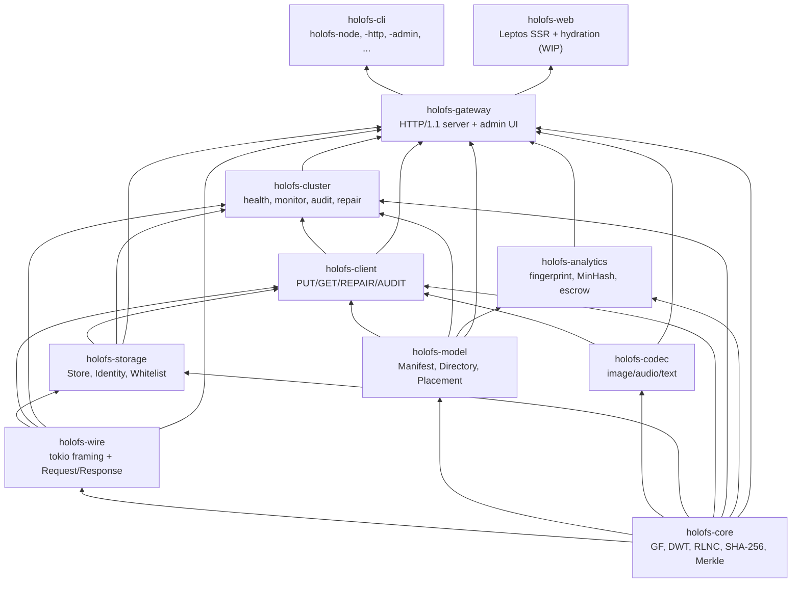
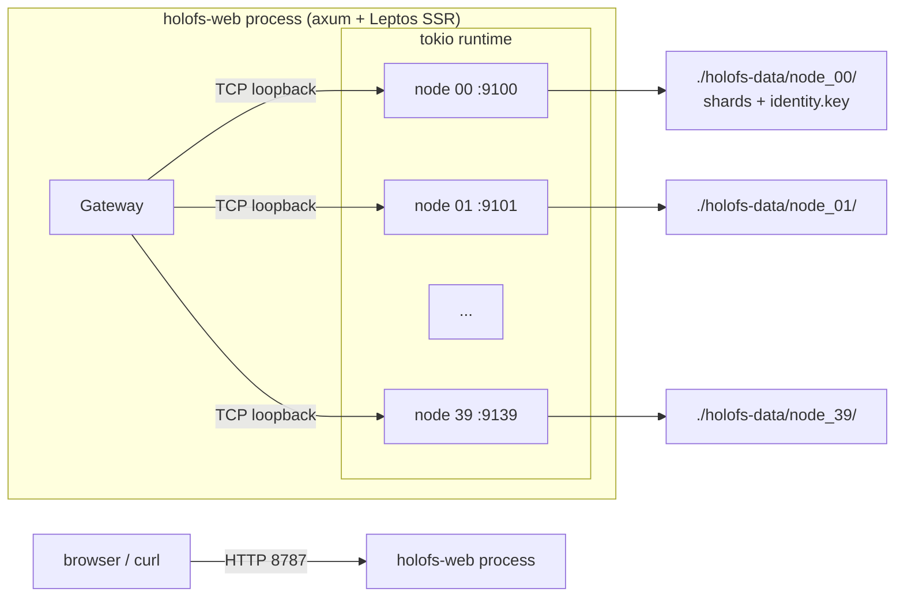
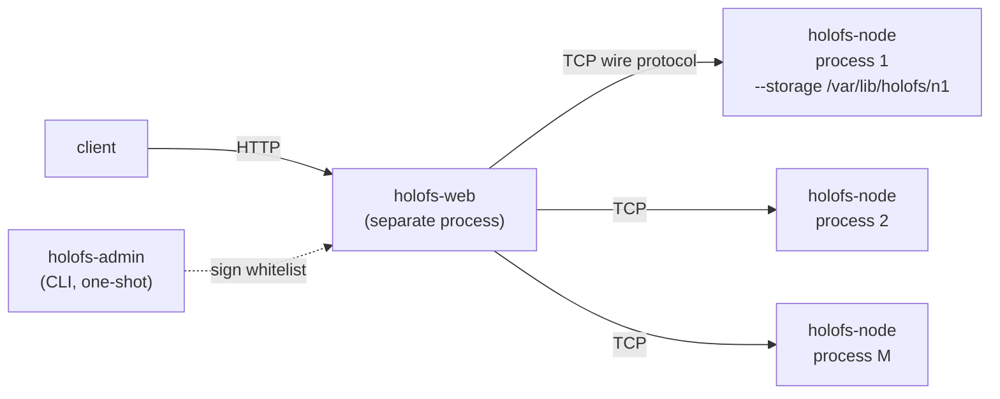
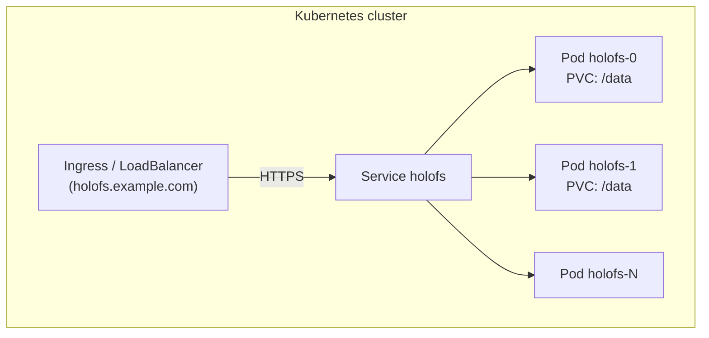
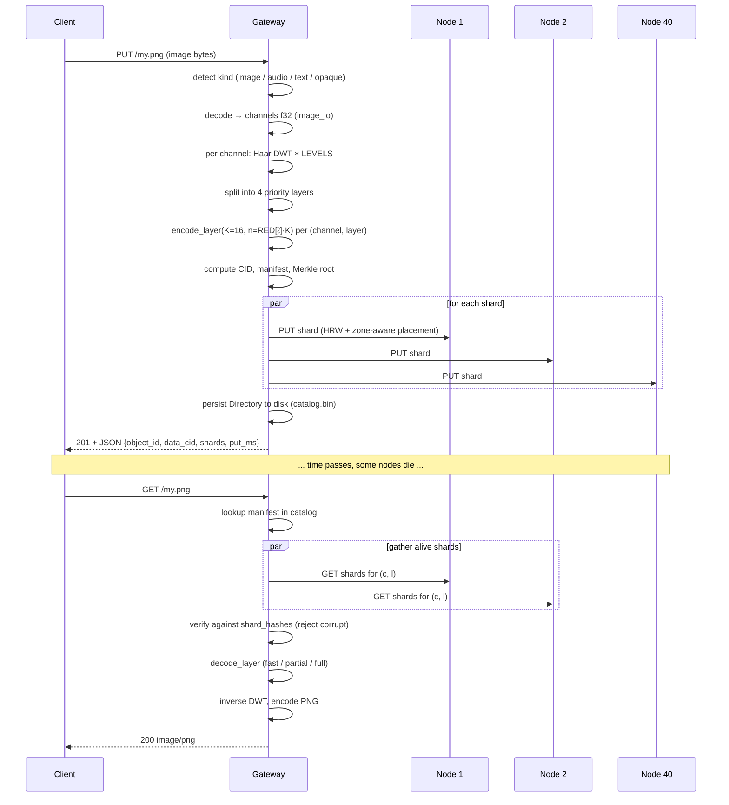

# Architecture

System-level structure of holofs, intended for maintainers and reviewers.
For mathematical foundations see [theory.md](./theory.md); for HTTP / wire
protocol details see [api.md](./api.md).

## Contents

1. [Crate dependency graph](#1-crate-dependency-graph)
2. [Process / deployment topologies](#2-process--deployment-topologies)
3. [Object lifecycle (PUT → GET)](#3-object-lifecycle-put--get)
4. [Persistence model](#4-persistence-model)
5. [Trust model](#5-trust-model)
6. [Concurrency model](#6-concurrency-model)
7. [Failure modes](#7-failure-modes)

---

## 1. Crate dependency graph

Strict topological order — never let arrows point upward.



**Rule of thumb.** A pull request that adds an upward edge in this graph
needs a separate discussion — it almost always means a type or function is
in the wrong crate.

---

## 2. Process / deployment topologies

### A. Embedded single-process (development / small clusters)



Used for demos, dev, single-machine bare-metal. The gateway and nodes
share a tokio runtime but communicate over real TCP — easy to migrate to
multi-process later.

### B. Multi-process bare-metal cluster



Each node is an independent OS process with its own persistent storage
directory and Ed25519 identity. The gateway is configured with a signed
whitelist of `(addr, pubkey, zone)` triples. Failure isolation is real:
killing one node process doesn't take down anything else.

Scripted variant: `./scripts/spawn-cluster.sh N BASE_PORT GATEWAY_ADDR`
brings up the whole topology with one command.

### C. Kubernetes (StatefulSet)



`deploy/helm/holofs` provides StatefulSet + PersistentVolumeClaim
templates. Each pod runs the multi-stage Docker image, which
auto-spawns embedded nodes against its own `/data` PVC. For very large
clusters split into N gateway pods + M dedicated node pods (Helm chart
supports `nodeCount` and `gatewayCount` separately).

---

## 3. Object lifecycle (PUT → GET)



### Per-kind divergence

| Kind     | PUT path                                              | GET response       |
|----------|-------------------------------------------------------|--------------------|
| image    | DWT 2D × 3 channels × 4 layers × RLNC                 | re-encoded PNG     |
| audio    | DWT 1D × 1–2 channels × 4 layers × RLNC               | WAV 16-bit PCM     |
| text     | UTF-8-boundary chunks × 1 layer × systematic RLNC     | text/plain + holes |
| opaque   | one byte stream × 1 layer × RLNC (no DWT)             | original bytes     |

---

## 4. Persistence model

Every node owns a directory. Three kinds of files live there:

```
<storage>/
├── identity.key                # 32-byte Ed25519 seed (mode 0600)
├── <hex>/<hex>.shard           # one file per stored shard
└── <hex>/<hex>.shard
```

The gateway additionally owns:

```
<storage>/catalog.bin            # serialised Directory (Manifest map)
                                 # Header magic: "HOLOFSD1"
```

### Shard file layout

```
magic        8  bytes  = "HOLOFSS1"
object_id    8  bytes  big-endian
channel      1  byte
layer        1  byte
coeffs_len   4  bytes  big-endian
payload_len  4  bytes  big-endian
coeffs       coeffs_len bytes
payload      payload_len bytes
```

Filename is `hex(sha256(shard))` split as `<2 hex chars>/<remaining 62>.shard`
(git-style fanout to avoid huge directories).

### Write atomicity

```
write to <name>.shard.tmp
fsync
rename <name>.shard.tmp → <name>.shard
```

A crash leaves either nothing or a complete shard — never a torn file.

### Index recovery

On `Store::open(dir)` the node walks its tree and rebuilds the in-memory
`HashMap<(object_id, channel, layer), HashMap<Hash, Shard>>` index by
re-hashing each shard. This is the only allowed source of truth — there
is no separate `.idx` file that could go stale.

### Dedup

Shard filenames are content-addressed. A duplicate PUT (same coefficients
+ payload) is detected by `fs::write(... .tmp)` → `rename` over an existing
file (overwrites identically). The in-memory index check earlier still
returns `false` from `put()` so the caller knows no new shard appeared.

---

## 5. Trust model

| Component       | Trust assumption                                      |
|-----------------|-------------------------------------------------------|
| Admin           | absolute — signs the whitelist, generates keypairs    |
| Gateway         | trusts the admin signature on the whitelist           |
| Node            | trusts its own `identity.key` (filesystem)            |
| Inter-node      | doesn't talk peer-to-peer; only gateway ↔ node        |
| Client          | trusts the gateway (TLS recommended for prod)         |

We are explicitly **not** a permissionless system: there is no
proof-of-replication, no Sybil-resistance. holofs sits in the same
trust class as Backblaze B2 or AWS S3, not Filecoin or Storj. See
[threat-model.md](./threat-model.md) for a structured analysis.

### Cryptographic primitives in use

| Purpose                          | Primitive                       | Crate                |
|----------------------------------|---------------------------------|----------------------|
| Shard / object integrity         | SHA-256 (FIPS 180-4, hand-rolled) | holofs-core         |
| Node identity                    | Ed25519                         | ed25519-dalek (RFC 8032) |
| Admin whitelist signature        | Ed25519                         | ed25519-dalek       |
| Handshake challenge              | random 32-byte nonce + Ed25519  | holofs-storage      |
| Key escrow / Shamir-style        | RLNC over GF(2⁸) with custom K  | holofs-analytics    |
| Domain separation                | string prefix (`holofs-XXX-vN`) before hash / sign input |

---

## 6. Concurrency model

- **Tokio multi-threaded runtime** at the top of every binary
  (`#[tokio::main(flavor = "multi_thread")]`).
- **One task per connection** in the gateway and in each node.
- **`tokio::sync::Mutex`** for shared state (catalog, store, reputation,
  admin\_kills). We never hold a mutex across an `.await` boundary on a
  hot path — snapshot patterns instead.
- **Channels** not used yet (the system is request/response); future
  streaming responses will use `tokio::sync::mpsc`.

### Background tasks in the gateway

| Task               | Cadence | Crate           |
|--------------------|---------|------------------|
| Health monitor     | `HOLOFS_MONITOR_INTERVAL` (15 s default) | holofs-cluster |
| PoR auditor        | `HOLOFS_AUDIT_INTERVAL` (30 s default)   | holofs-cluster |
| Catalog autosave   | on every catalog mutation (inline)       | holofs-gateway |

Both background tasks are aborted on SIGINT via `tokio::select!`.

---

## 7. Failure modes

| Failure                                     | Detected by                  | Recovery                          |
|---------------------------------------------|------------------------------|-----------------------------------|
| Node process dies                           | health monitor (`Ping`)      | margin recomputed; if `LowMargin`, repair queued |
| Node OS reboots, comes back same identity   | health monitor `revived` event | `repair_node` re-fills HRW share |
| Node returns wrong bytes (silent corruption) | PoR audit (hash mismatch)   | reputation drops; node excluded from `live` |
| Node lies "I have it" without storing       | PoR audit (`MissingShard`)   | reputation drops |
| Whole rack / zone goes dark                 | health monitor + zone-aware  | object stays decodable up to L_{n-1}/L_{n-2} |
| Gateway crashes mid-PUT                     | client retry                  | shards already on nodes are dedup'd by hash on retry |
| Gateway crashes mid-DELETE                  | inconsistent: some nodes purged, some not | next health pass detects orphan shards (TODO: gc) |
| Disk corruption on one shard file           | hash verify on read           | shard discarded → margin drops → repair |
| Network partition between gateway and node  | RPC timeout                   | health monitor → exclude → repair if margin drops |
| Whitelist signature invalid                 | gateway startup check        | refuses to start (fail-fast) |

### What we don't protect against

- **Byzantine gateway**: the gateway is trusted. A malicious gateway can
  corrupt all data.
- **Coordinated node collusion**: K malicious nodes (K-of-N threshold) can
  reconstruct any object. Reputation is reactive, not preventive.
- **Side-channel attacks on shard transit**: TLS will mitigate eavesdropping;
  it doesn't prevent timing attacks against the GF(2⁸) table lookups (which
  are public anyway in holofs's threat model).
