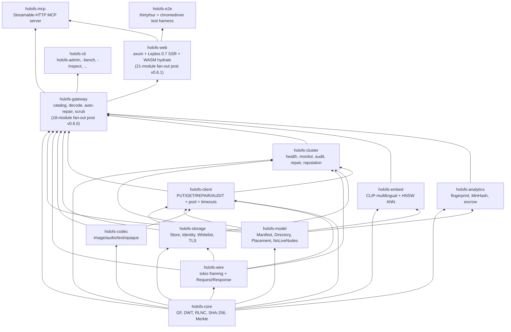
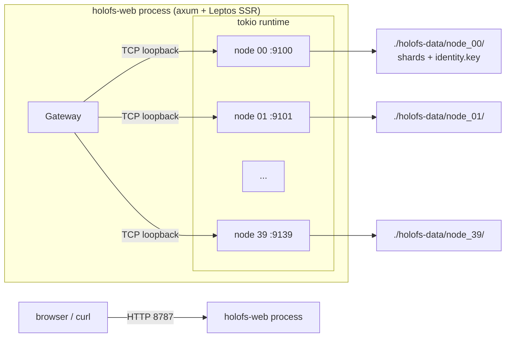
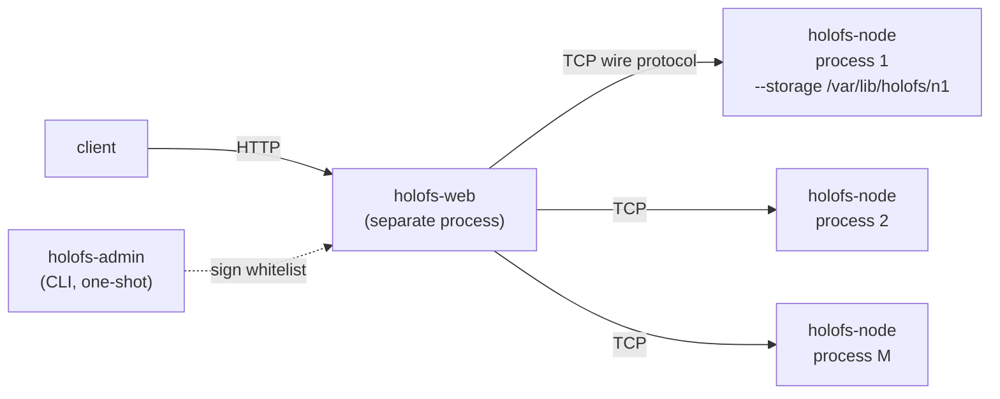
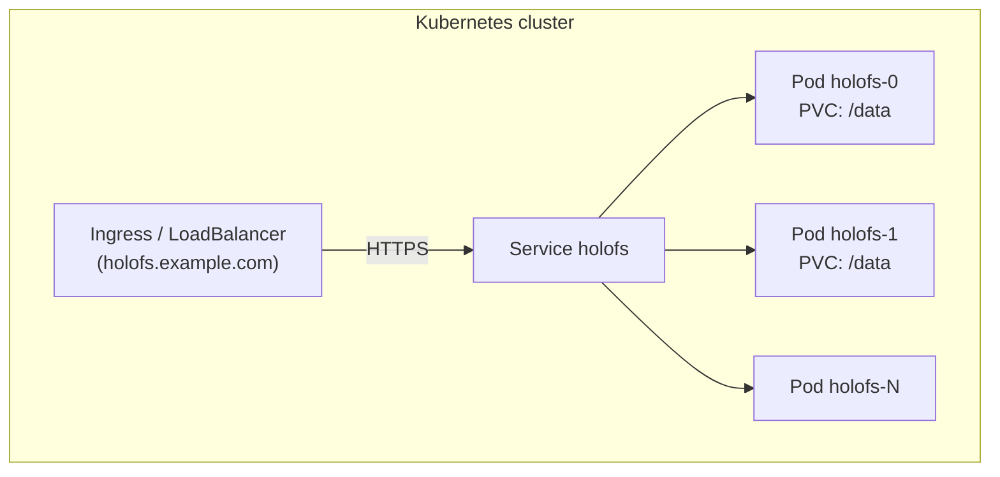
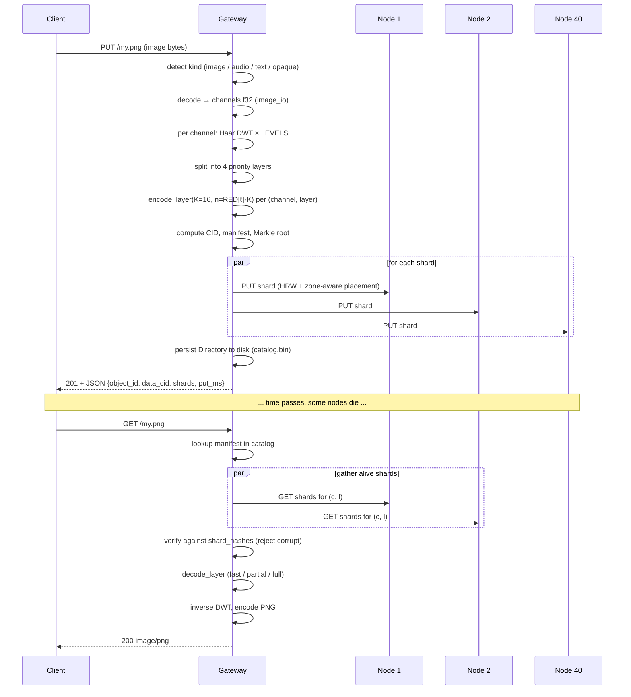

# Architecture

System-level structure of holofs, intended for maintainers and reviewers.
For mathematical foundations see [theory.md](./theory.md); for HTTP / wire
protocol details see [api.md](./api.md).

## Contents

1. [Crate dependency graph](#1-crate-dependency-graph)
2. [Process / deployment topologies](#2-process--deployment-topologies)
3. [Object lifecycle (PUT → GET)](#3-object-lifecycle-put--get)
4. [Persistence model](#4-persistence-model)
5. [Trust model](#5-trust-model)
6. [Concurrency model](#6-concurrency-model)
7. [Failure modes](#7-failure-modes)

---

## 1. Crate dependency graph

Strict topological order — never let arrows point upward.



**Rule of thumb.** A pull request that adds an upward edge in this graph
needs a separate discussion — it almost always means a type or function is
in the wrong crate.

### 1.1. Gateway module layout (post v0.6.0)

The `holofs-gateway` crate ships one type — `Gateway` — but its
implementation is split across 18 sibling modules, each owning one
`impl Gateway { ... }` block. Everything remaining in
`http_gateway.rs` (288 lines) is state + accessors + the two shared
helpers `persist_catalog` and `invalidate_cache`. Public API is
preserved via crate-root `pub use`; consumers still write
`holofs_gateway::GatewayError`, `holofs_gateway::SimilarReport`,
etc. without touching the module path.

| Module | Purpose |
|---|---|
| `http_gateway` | `Gateway` struct, constructors, accessors, `persist_catalog`, `invalidate_cache`. |
| `error` | `GatewayError` enum + `Display` + `From<NoLiveNodes>`. |
| `util` | Small helpers: `now_unix`, `directory_object_id`, content-type sniffers, `encode_png`. |
| `decode` | HTTP-facing decode dispatch — `decode_object`, `get_or_decode` (PNG cache). |
| `ingest` | Universal PUT — `ingest_bytes`, `put_any`, per-kind blank-manifest helpers. |
| `repair` | `decode_with_autorepair`, `repair_object_inplace`, `purge_orphans_of`. |
| `dirops` | `remove_object`, `mkdir`, `rmdir`, `rename`, `list_dir`. |
| `versions` | Per-object version history: archive / list / restore / delete + retention. |
| `search` | CLIP-multilingual embed pipeline + HNSW-backed semantic search. |
| `similarity` | `SimilarScope` / `SimilarMatch` / `ShardOverlap` types + scope helpers. |
| `fingerprint` | Perceptual FP + `similar_to`. |
| `mix` | Wavelet mix + audio band filter. |
| `diff` | Byte-perfect chunk-diff analyzer. |
| `spotlight` | Stage 13.2 + 14.1 ROI composites. |
| `inspect` | `/inspect` view-model + shard payload extraction. |
| `metrics` | `file_metrics` — storage/dedup + originality + layer energy in one pass. |
| `health` | Cluster stats, admin toggles, `scrub_tick`, `object_health`. |
| `escrow` | Shamir-style RLNC key escrow. |
| `gc` | Orphan-shard garbage collector. |

**Rule of thumb.** New `Gateway` methods belong to the module whose
concern they extend, not to `http_gateway.rs`. If a new module is
needed, it goes alongside the others and gets its own `impl Gateway`
block; nothing in `http_gateway.rs` should grow again.

### 1.2. Reliability layer (v0.6.0 — N1-N8)

The reliability primitives live in `holofs-web` because they
compose the HTTP surface, not the gateway state. See
[operations.md § 5.6](operations.md#56-reliability-layer-v060--n1-n8)
for the env-var reference and [CHANGELOG.md](../CHANGELOG.md#060---2026-07-02)
for the full behaviour matrix.

| Module | Purpose |
|---|---|
| `holofs_web::supervised` | `supervised_spawn(name, shutdown, counter, f)` — panic-catching + exp-backoff restart wrapper around `tokio::spawn`. Powers **N2**. |
| `holofs_web::timeout` | `run_with_deadline` middleware + `SHORT`/`MEDIUM`/`LONG` duration buckets. Powers **N7**. |
| `holofs_web::backpressure` | `with_permit` middleware — `Arc<Semaphore>::try_acquire_owned` per bucket, 503 on saturation. Powers **N3**. |
| `holofs_web::admin_auth` | `AdminAuth::from_env` + `require_admin_token` middleware — bearer-token gate for `/admin/*` + `/api/gc`. Powers **N6**. |
| `holofs_web::bootstrap` | Reads env, wires the shared `CancellationToken` into every long-running task (**N1**), builds the `Bootstrap` handle main.rs joins on shutdown, plumbs the reputation-persist supervised task (**N5**). |

**Fail-loud persistence (N4)** is a gateway-side change, not a
holofs-web one: `Gateway::persist_catalog` returns
`Result<(), GatewayError::Persist>` and every writer path (`ingest`,
`dirops`, `versions`) propagates via `?`.

### 1.3. Web crate module layout (post v0.6.1 — Phase R2)

`holofs-web` was originally two god-files:
`src/lib.rs` (2487 lines — Leptos SSR components + server_fns + filter)
and `src/handlers.rs` (1857 lines — 25 axum handlers + ~30 helpers).
Phase R2 split both into single-purpose sibling modules.

**Post-R2a: `lib.rs` (253 lines)** — module registry + crate-root
`pub use` re-exports + [`Shell`] / [`App`] / [`RoutedApp`] top-level
components + `url_encode` utility + WASM `hydrate` entry.
Everything else moved to:

| Module | Purpose |
|---|---|
| `catalog_types` | `CatalogEntry` view-model shared across SSR + hydrate boundaries. `from_manifest` (SSR-only). |
| `filter` | Stage 11.17 catalog filter — `CatalogFilter`, `apply_filter`, `compile_glob`, `parse_date_to_unix`, `ymd_to_unix` + seven unit tests. SSR-only. |
| `server_fns` | The three `#[server]` functions (`get_catalog`, `list_dir`, `list_dir_page`) + `ListDirPage` + `TreeSort` + `compare_entries`. |
| `catalog_ui` | Fifteen Leptos components — `CatalogPage`, `CatalogFocusView`, `FilterBar`, `TreeZoomButtons`, `Breadcrumb`, `CatalogTreeView` + eager/lazy variants, `LazyLevel`, `LazyDirNode`, `CatalogTreeBody`, `TreeNodeView`, `MkdirForm`, `UploadForm`, `ObjectCard`. |

**Post-R2b: `handlers.rs` (64 lines)** — pure module-registration
front-door + `pub use` re-exports. Every handler lives in a
domain submodule under `handlers/`:

| Module | Handlers |
|---|---|
| `handlers/objects` | GET / PUT / DELETE `/*path`, `/preview/*`, `/preview/stream/*`, `/api/shard/…`, wasm alias. |
| `handlers/dirops` | mkdir, rmdir, rm, mv (JSON + form flavours). |
| `handlers/uploads` | multipart `/api/upload`. |
| `handlers/versions` | `/api/restore`, `/api/versions/delete`. |
| `handlers/analytics` | `/api/fingerprint/*`, `/api/mix.png`, `/api/mix-save`, `/api/spotlight.png`. |
| `handlers/search` | `/api/embed_all`, `/api/search`. |
| `handlers/health` | `/api/stats`, `/metrics`, `/api/gc`, `/admin/node`, `/api/health/events` SSE. |
| `handlers/escrow` | `/escrow/split`, `/escrow/download`, `/escrow/recover`. |
| `handlers/util` | Pure helpers — path validation, form parsing, HTML/JSON escape, header shortcuts, `error_to_response`. |
| `handlers/response` | Response builders — `serve_with_range`, ingest / remove / mkdir / rmdir / rename → HTTP, stats + fingerprint → JSON. |

Public API is preserved via `pub use handlers::foo` at the
`handlers.rs` root, so `main.rs`'s existing
`handlers::mkdir` / `handlers::spotlight_png` / etc. references
resolve unchanged.

Reliability primitives from § 1.2 (`supervised`, `timeout`,
`backpressure`, `admin_auth`, `bootstrap`) are unaffected — they
already lived in their own modules.

**Rule of thumb.** New Leptos components go into `catalog_ui.rs`
(catalog-related) or a fresh sibling module (page-scale like
`/health`, `/search`, `/versions`). New axum handlers go into the
domain module whose concern they extend
(`handlers/dirops.rs` for a new mkdir variant, etc.). Nothing new
should grow the top-level `lib.rs` or `handlers.rs` file.

---

## 2. Process / deployment topologies

### A. Embedded single-process (development / small clusters)



Used for demos, dev, single-machine bare-metal. The gateway and nodes
share a tokio runtime but communicate over real TCP — easy to migrate to
multi-process later.

### B. Multi-process bare-metal cluster



Each node is an independent OS process with its own persistent storage
directory and Ed25519 identity. The gateway is configured with a signed
whitelist of `(addr, pubkey, zone)` triples. Failure isolation is real:
killing one node process doesn't take down anything else.

Scripted variant: `./scripts/spawn-cluster.sh N BASE_PORT GATEWAY_ADDR`
brings up the whole topology with one command.

### C. Kubernetes (StatefulSet)



`deploy/helm/holofs` provides StatefulSet + PersistentVolumeClaim
templates. Each pod runs the multi-stage Docker image, which
auto-spawns embedded nodes against its own `/data` PVC. For very large
clusters split into N gateway pods + M dedicated node pods (Helm chart
supports `nodeCount` and `gatewayCount` separately).

---

## 3. Object lifecycle (PUT → GET)



### Per-kind divergence

| Kind     | PUT path                                              | GET response       |
|----------|-------------------------------------------------------|--------------------|
| image    | DWT 2D × 3 channels × 4 layers × RLNC                 | re-encoded PNG     |
| audio    | DWT 1D × 1–2 channels × 4 layers × RLNC               | WAV 16-bit PCM     |
| text     | UTF-8-boundary chunks × 1 layer × systematic RLNC     | text/plain + holes |
| opaque   | one byte stream × 1 layer × RLNC (no DWT)             | original bytes     |

---

## 4. Persistence model

Every node owns a directory. Three kinds of files live there:

```
<storage>/
├── identity.key                # 32-byte Ed25519 seed (mode 0600)
├── <hex>/<hex>.shard           # one file per stored shard
└── <hex>/<hex>.shard
```

The gateway additionally owns:

```
<storage>/catalog.bin            # serialised Directory (Manifest map)
                                 # Header magic: "HOLOFSD1"
```

### Shard file layout

```
magic        8  bytes  = "HOLOFSS1"
object_id    8  bytes  big-endian
channel      1  byte
layer        1  byte
coeffs_len   4  bytes  big-endian
payload_len  4  bytes  big-endian
coeffs       coeffs_len bytes
payload      payload_len bytes
```

Filename is `hex(sha256(shard))` split as `<2 hex chars>/<remaining 62>.shard`
(git-style fanout to avoid huge directories).

### Write atomicity

```
write to <name>.shard.tmp
fsync
rename <name>.shard.tmp → <name>.shard
```

A crash leaves either nothing or a complete shard — never a torn file.

### Index recovery

On `Store::open(dir)` the node walks its tree and rebuilds the in-memory
`HashMap<(object_id, channel, layer), HashMap<Hash, Shard>>` index by
re-hashing each shard. This is the only allowed source of truth — there
is no separate `.idx` file that could go stale.

### Dedup

Shard filenames are content-addressed. A duplicate PUT (same coefficients
+ payload) is detected by `fs::write(... .tmp)` → `rename` over an existing
file (overwrites identically). The in-memory index check earlier still
returns `false` from `put()` so the caller knows no new shard appeared.

---

## 5. Trust model

| Component       | Trust assumption                                      |
|-----------------|-------------------------------------------------------|
| Admin           | absolute — signs the whitelist, generates keypairs    |
| Gateway         | trusts the admin signature on the whitelist           |
| Node            | trusts its own `identity.key` (filesystem)            |
| Inter-node      | doesn't talk peer-to-peer; only gateway ↔ node        |
| Client          | trusts the gateway (TLS recommended for prod)         |

We are explicitly **not** a permissionless system: there is no
proof-of-replication, no Sybil-resistance. holofs sits in the same
trust class as Backblaze B2 or AWS S3, not Filecoin or Storj. See
[threat-model.md](./threat-model.md) for a structured analysis.

### Cryptographic primitives in use

| Purpose                          | Primitive                       | Crate                |
|----------------------------------|---------------------------------|----------------------|
| Shard / object integrity         | SHA-256 (FIPS 180-4, hand-rolled) | holofs-core         |
| Node identity                    | Ed25519                         | ed25519-dalek (RFC 8032) |
| Admin whitelist signature        | Ed25519                         | ed25519-dalek       |
| Handshake challenge              | random 32-byte nonce + Ed25519  | holofs-storage      |
| Key escrow / Shamir-style        | RLNC over GF(2⁸) with custom K  | holofs-analytics    |
| Domain separation                | string prefix (`holofs-XXX-vN`) before hash / sign input |

---

## 6. Concurrency model

- **Tokio multi-threaded runtime** at the top of every binary
  (`#[tokio::main(flavor = "multi_thread")]`).
- **One task per connection** in the gateway and in each node.
- **`tokio::sync::Mutex`** for shared state (catalog, store, reputation,
  admin\_kills). We never hold a mutex across an `.await` boundary on a
  hot path — snapshot patterns instead.
- **Channels** not used yet (the system is request/response); future
  streaming responses will use `tokio::sync::mpsc`.

### Background tasks in the gateway

| Task                 | Cadence | Crate           |
|----------------------|---------|------------------|
| Health monitor       | `HOLOFS_MONITOR_INTERVAL` (15 s default) | holofs-cluster |
| PoR auditor          | `HOLOFS_AUDIT_INTERVAL` (30 s default)   | holofs-cluster |
| Shard scrub          | `HOLOFS_SCRUB_INTERVAL` (600 s default)  | holofs-gateway |
| Reputation persist   | `HOLOFS_REPUTATION_PERSIST_INTERVAL` (30 s default; **N5**) | holofs-web |
| Catalog autosave     | on every catalog mutation (inline)       | holofs-gateway |

All four background loops run under
[`holofs_web::supervised::supervised_spawn`](#12-reliability-layer-v060--n1-n8):
a panic → ERROR log + exponential-backoff (1 → 30 s cap) + restart.
They also honour a shared `tokio_util::sync::CancellationToken` and
drain cleanly on SIGTERM / SIGINT (see **N1**).

### Auto-repair-on-read + scrub (Stage 14.3 + 15.x)

The GET path is wrapped in `decode_with_autorepair`: on
`ClientError::LayerLost` it bumps `auto_repairs_total`, runs
`repair_object_inplace` (per-node surgical repair via
`list_node_hashes` + `repair_node`), persists the mutated manifest,
and retries the decode once. A second failure bumps
`auto_repair_failures_total` and surfaces the original error.

The scrub does the same work *proactively*: walks the catalog
between user requests, diffs `list_node_hashes` against
`place_shard` per object, and surgically repairs the mismatches
before any reader hits a `LayerLost`. Tracked via
`scrub_runs_total` + `scrub_repairs_total` counters.

### `gc_barrier` writer/scrub rendezvous

Three operations can mutate shard state: `ingest_bytes` (PUT),
`gc_orphaned_shards` (manual GC), and the background scrub. They
coordinate through a single `tokio::sync::RwLock<()>`:

- PUT / restore_version / scrub take **read** guards — they don't
  conflict with each other, but they block GC.
- GC takes a **write** guard — exclusive, blocks every concurrent
  shard write until it finishes.

Without this, the GC pass could enumerate hashes, decide a shard is
orphaned, and PurgeByHash it *just* as a fresh PUT was about to
land a manifest pointing at that hash — observed as silent shard
loss on the §25 concurrency scenario.

### RPC timeouts + retries (Stage 15.x)

Every wire op (`rpc_attempt`) runs inside `tokio::time::timeout`
with `HOLOFS_RPC_TIMEOUT_MS` as the budget (default 8 s). On
expiry the pooled stream is poisoned and the error surfaces as
`io::ErrorKind::TimedOut`; `is_likely_transient` keys on the kind
to drive a single automatic retry against a freshly-dialled
connection. Combined with the per-addr keepalive pool, a flapping
node now caps user-visible latency at 8 s + one retry instead of
the OS-level 60-75 s TCP timeout.

---

## 7. Failure modes

| Failure                                     | Detected by                  | Recovery                          |
|---------------------------------------------|------------------------------|-----------------------------------|
| Node process dies                           | health monitor (`Ping`)      | margin recomputed; if `LowMargin`, repair queued |
| Node OS reboots, comes back same identity   | health monitor `revived` event | `repair_node` re-fills HRW share |
| Node returns wrong bytes (silent corruption) | PoR audit (hash mismatch)   | reputation drops; node excluded from `live` |
| Node lies "I have it" without storing       | PoR audit (`MissingShard`)   | reputation drops |
| Whole rack / zone goes dark                 | health monitor + zone-aware  | object stays decodable up to L_{n-1}/L_{n-2} |
| Gateway crashes mid-PUT                     | client retry                  | shards already on nodes are dedup'd by hash on retry |
| Gateway crashes mid-DELETE                  | inconsistent: some nodes purged, some not | `POST /api/gc` (Stage 14.0) scoops up orphan shards on demand; the background scrub catches them between runs |
| Disk corruption on one shard file           | hash verify on read           | shard discarded → margin drops → auto-repair-on-read (Stage 14.3) re-encodes from donors |
| Network partition between gateway and node  | `HOLOFS_RPC_TIMEOUT_MS` budget (Stage 15.x) | timed-out RPC retries once on a fresh socket; health monitor → exclude → repair if margin drops |
| All nodes simultaneously dark               | `place_shard` returns `NoLiveNodes` (Stage 15.x) | gateway 503s with `ClusterDegraded` instead of asserting; client retries when nodes return |
| Whitelist signature invalid                 | gateway startup check        | refuses to start (fail-fast) |

### What we don't protect against

- **Byzantine gateway**: the gateway is trusted. A malicious gateway can
  corrupt all data.
- **Coordinated node collusion**: K malicious nodes (K-of-N threshold) can
  reconstruct any object. Reputation is reactive, not preventive.
- **Side-channel attacks on shard transit**: TLS will mitigate eavesdropping;
  it doesn't prevent timing attacks against the GF(2⁸) table lookups (which
  are public anyway in holofs's threat model).
