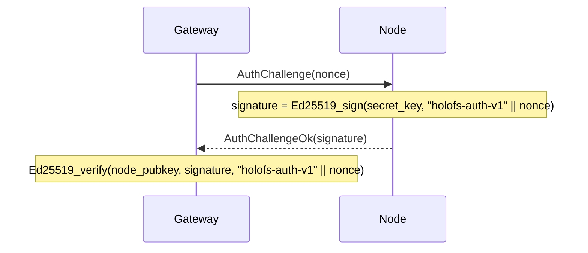

# API-Referenz

Drei externe Schnittstellen: **HTTP-Gateway**, **Node-Wire-Protokoll**
und **On-Disk-Dateiformate** (Manifest, Katalog, Shard, Whitelist,
Holoshare).

## Inhalt

1. [HTTP-Gateway](#1-http-gateway)
2. [Wire-Protokoll (TCP)](#2-wire-protokoll-tcp)
3. [On-Disk-Formate](#3-on-disk-formate)
4. [Response-Header-Konventionen](#4-response-header-konventionen)
5. [MCP-Server](#5-mcp-server)
6. [Wavelet-Operationen](#6-wavelet-operationen)
7. [UI-Seiten](#7-ui-seiten)
8. [Neue HTTP-Endpunkte](#8-neue-http-endpunkte)
9. [Wire-Protokoll-Ergänzungen](#9-wire-protokoll-ergänzungen)
10. [Manifest-Format-Ergänzungen](#10-manifest-format-ergänzungen)
11. [CLI- / Operator-Flags](#11-cli--operator-flags)
12. [Statisches-Asset-Workaround](#12-statisches-asset-workaround)
13. [Wire-Verbindungspool](#13-wire-verbindungspool)

---

## 1. HTTP-Gateway

Base-URL: `http://<addr>:8787/` (HTTPS über das eigene TLS-Gerüst des
Gateways aus `HOLOFS_TLS=1`, mTLS via `HOLOFS_MTLS=1`).

> Pfade sind slash-separiert und als Wildcards adressierbar
> (`/photos/2026/img.jpg`). Die reservierten Top-Level-Segmente —
> `api`, `health`, `escrow`, `preview`, `inspect`, `similar`, `diff`,
> `admin`, `metrics`, `pkg`, `help`, `inspect-zoom` — können nicht als
> erstes Segment eines Objektpfads verwendet werden, weil sie echte
> Routen überdecken.

> `GET /<path>` und `GET /preview/<path>` respektieren den
> `Range:`-Request-Header gemäß RFC 9110 §14.2. Ein einzelner erfüllbarer
> Byte-Range liefert `206 Partial Content` mit `Content-Range`. Das
> Objekt wird serverseitig vollständig decodiert und die Antwort ist ein
> Slice des resultierenden Buffers (Progressive-Layer-Streaming ist
> nicht implementiert). Multi-Range-Requests fallen auf ein `200` mit
> vollem Body zurück; missgebildete Header werden ignoriert.
> `Range: bytes=A-B` jenseits EOF antwortet mit `416` und
> `Content-Range: bytes */<total>`.

### Katalog-CRUD

| Methode  | Pfad                       | Beschreibung                                          | Body / Params  |
|----------|----------------------------|-------------------------------------------------------|----------------|
| `GET`    | `/`                        | HTML-Katalog; liest `?p=<prefix>` für das zu listende Verzeichnis | —      |
| `GET`    | `/<path>`                  | Objekt in kanonischer Form herunterladen. Respektiert `Range` — `206` bei Teil, `416` bei nicht erfüllbar. | Range unterstützt |
| `GET`    | `/preview/<path>`          | Grobe Vorschau (nur L0). Range respektiert gegen den vorschau-großen Body. | Range unterstützt |
| `PUT`    | `/<path>`                  | Raw-Bytes hochladen, Art automatisch erkannt. Elternverzeichnis muss existieren (via `mkdir`) | body = file |
| `DELETE` | `/<path>`                  | Objekt entfernen + Purge auf allen Nodes. Verzeichniseinträge werden verweigert (nutze `rmdir`) | — |

### Verzeichnisoperationen

Zwei Varianten jeder Katalog-Mutation: eine Wildcard-JSON-Variante für
programmatische / `curl`-Aufrufer und ein form-urlencodiertes POST, das
die HTML-Formulare der UI ohne JavaScript ansprechen können. Die
Form-Varianten leiten mit 303 nach `/?p=<parent>` weiter, damit der
Browser zurück in das Verzeichnis navigiert, das der Nutzer betrachtete.

| Methode  | Pfad                       | Beschreibung                                                       | Body / Params                |
|----------|----------------------------|--------------------------------------------------------------------|------------------------------|
| `POST`   | `/api/mkdir/<path>`        | Einen `Directory`-Marker erzeugen. Elternteil muss existieren.     | — (JSON-Antwort)             |
| `POST`   | `/api/mkdir`               | Form-freundliches mkdir; leitet zu `/?p=<parent>` weiter           | `parent=…&name=…`            |
| `DELETE` | `/api/rmdir/<path>`        | Leeres Verzeichnis entfernen. 409, wenn es Kinder hat.             | — (JSON-Antwort)             |
| `POST`   | `/api/rmdir`               | Form-freundliches rmdir; leitet bei Erfolg weiter                  | `path=…`                     |
| `POST`   | `/api/mv`                  | Umbenennen / Verschieben; Verzeichnisse nehmen jeden Nachkommen mit | `from=…&to=…`                |
| `POST`   | `/api/list_dir`            | Leptos-Server-Fn: direkte Kinder von `prefix` (JSON-RPC)           | `{"prefix":"…"}`             |

Status-Code-Mapping für die Dir-Ops:

| Ausgang                                       | Status         | `GatewayError`           |
|-----------------------------------------------|----------------|--------------------------|
| OK                                            | 200 / 201 / 303 | —                       |
| Ziel existiert bereits                        | 409            | `AlreadyExists`          |
| Pfad existiert, ist aber kein Verzeichnis     | 409            | `NotADirectory`          |
| `rmdir` auf ein nicht-leeres Verzeichnis      | 409            | `DirectoryNotEmpty`      |
| `GET`/`DELETE` eines `Directory`-Eintrags     | 409            | `IsDirectory`            |
| Missgebildeter Pfad (`..`, `//`, führendes `/`) | 400          | `BadRequest`             |
| Elternverzeichnis fehlt                       | 400            | `BadRequest`             |
| Unbekannter Eintrag                           | 404            | `NotFound`               |

#### Antwort pro Art

| Art       | `GET /<path>` liefert                                        |
|-----------|--------------------------------------------------------------|
| image     | `image/png` (aus f32-Kanälen neu codiert)                    |
| audio     | `audio/wav` (16-Bit-PCM, mono/stereo wie gespeichert)        |
| text      | Text-Content-Type je Endung, Body enthält Hole-Marker, falls Shards zu wenig sind |
| opaque    | Original-Content-Type + `Content-Disposition: attachment`    |
| directory | `409 Conflict` — Verzeichnisse haben keinen Payload          |

### Cluster-Gesundheit

| Methode | Pfad                  | Beschreibung                                 |
|---------|-----------------------|----------------------------------------------|
| `GET`   | `/health`             | Per-Node-Tabelle, Kill/Revive-Buttons        |
| `GET`   | `/health/<name>`      | Marge pro (channel, layer), Monte-Carlo-Verlust-Simulation, Zonen-Ausfall-Tabelle |
| `GET`   | `/api/stats`          | JSON: Objektzahlen nach Art, Shards, Dedup % |
| `POST`  | `/admin/node` (`i=N`) | Node N umschalten (admin-seitig ausgeschlossen/wiederhergestellt). **Admin-auth-gated** — erfordert `Authorization: Bearer $HOLOFS_ADMIN_TOKEN`, wenn die Env-Var gesetzt ist. |

`/api/stats` gibt zurück:

```json
{
  "nodes_total": 40,
  "nodes_live": 38,
  "objects_total": 14,
  "objects_by_kind": {"image": 7, "audio": 3, "text": 1, "opaque": 1, "directory": 2},
  "shards_total": 5328,
  "shards_unique": 5326,
  "dedup_savings_pct": 0.04,
  "bytes_total": 50266112,
  "auto_repairs_total": 0,
  "auto_repair_failures_total": 0,
  "scrub_runs_total": 8,
  "scrub_repairs_total": 0
}
```

`objects_total = sum(objects_by_kind)`; `directory`-Marker werden
gezählt, tragen aber nichts zu `shards_total` / `bytes_total` bei.

Die vier abschließenden Zähler exponieren Self-Healing-Aktivität:

- `auto_repairs_total` — GETs, die den Retry-Arm von
  `decode_with_autorepair` ausgelöst haben (LayerLost beim ersten Decode
  → repair_object_inplace → zweiter Decode).
- `auto_repair_failures_total` — Auto-Repair-Pass, der selbst
  fehlschlug (zu wenige Donors, zweiter Decode weiterhin LayerLost
  usw.).
- `scrub_runs_total` — abgeschlossene Hintergrund-Scrub-Ticks
  (`HOLOFS_SCRUB_INTERVAL`, Default 600 s).
- `scrub_repairs_total` — Objekte, die der Scrub reparierte, *bevor*
  ein Nutzer sie traf.

Ein gesunder Cluster hält alle vier auf null oder nahe null; eine
anhaltende Nicht-Null-Rate auf `auto_repair_failures_total` ist das
Operator-Alarmsignal.

#### `GET /metrics` — Prometheus-Exposition

`text/plain; version=0.0.4`-Body — jede Gauge / jeder Counter emittiert
`# HELP` + `# TYPE`-Zeilen. Siehe
[`docs/operations.md § 6.1`](./operations.md#61-metrik-endpunkt) für
den vollständigen Metrikkatalog, Labels und Interpretation.
Reliability-Zähler, die es hervorzuheben lohnt:

- `holofs_catalog_persist_failures_total` — Disk-Write-Fehler beim
  atomaren Katalog-Save.
- `holofs_handler_timeouts_total{bucket="short|medium|long"}` —
  504-Antworten.
- `holofs_backpressure_rejected_total{bucket="medium|long"}` —
  503-Antworten bei Semaphor-Sättigung.
- `holofs_backpressure_permits_available{bucket="medium|long"}` —
  Gauge der noch freien Permits.
- `holofs_supervised_task_restarts_total{task="monitor|auditor|scrub"}`
  — Supervised-Loop-Restarts bei Panic.
- `holofs_admin_auth_failures_total{outcome="missing|bad|disabled"}` —
  Admin-Bearer-Token-Ablehnungen aufgeschlüsselt nach Grund.

`/metrics` liegt im SHORT-Route-Bucket und erbt die 10-s-Deadline; eine
langsame `/metrics`-Antwort ist selbst ein Alarmsignal.

### Suche und Analytik

| Methode | Pfad                          | Beschreibung                                     |
|---------|-------------------------------|--------------------------------------------------|
| `GET`   | `/similar/<path>`             | Top-10 ähnliche Objekte + Cross-Objekt-Overlap   |
| `GET`   | `/diff?a=<a>&b=<b>`           | Per-Chunk-Diff-Visualisierung. Zwei Objektpfade passen nicht in eine einzige Route, deshalb in den Query-String verschoben |
| `GET`   | `/api/fingerprint/<path>`     | JSON: 16-Byte-perzeptueller Hash (image/audio) oder erste 16 der CID (text/opaque) |

`/api/fingerprint/<name>` gibt zurück:

```json
{
  "name": "photo.png",
  "fingerprint": "a3f08c7d12...",
  "kind": "image"
}
```

### Shard-Inspektion

Das `c_l_idx`-Tripel identifiziert einen Shard innerhalb eines Objekts
als `<channel>_<layer>_<idx>`. Die URL setzt das feste Tripel vor den
Wildcard-Objektpfad.

| Methode | Pfad                                                     | Beschreibung |
|---------|----------------------------------------------------------|--------------|
| `GET`   | `/inspect/<path>`                                        | Raster aller Shard-Thumbnails (farbcodiert sys vs. RLNC) |
| `GET`   | `/api/shard/<c_l_idx>.png/<path>`                        | 32×32-Graustufen-PNG des Payloads eines Shards |
| `GET`   | `/inspect-zoom/<c_l_idx>/<path>`                         | Große Darstellung + Hex-Coeffs + Payload + Node-Info |

### Holografische Schlüsselhinterlegung

| Methode | Pfad                            | Beschreibung |
|---------|---------------------------------|--------------|
| `GET`   | `/escrow`                       | UI mit Split- + Recover-Formularen |
| `POST`  | `/escrow/split`                 | `file=…` + `k=…` + `n=…` → in `n` `.holoshare`-Dateien aufteilen |
| `GET`   | `/escrow/download/<id>_<idx>.holoshare` | Einen Anteil herunterladen (im Gateway-Speicher gehalten) |
| `POST`  | `/escrow/recover`               | `shares=…` (mehrfach) → Originaldatei wiederherstellen |

`.holoshare`-Dateien werden **nicht auf dem Cluster gespeichert** — das
Gateway berechnet sie auf Abruf und hält sie im Speicher, bis zum
Neustart oder bis der Nutzer sie herunterlädt.

### Versionen, Suche, Streaming

Hinter Opt-in-Flags (`--enable-versions`, `--enable-embed`) exponiert
das Gateway Per-Objekt-Historie, semantische Suche und progressive
HTTP-Streams. Diese Endpunkte sind standardmäßig aktiv, sobald das
Feature an ist; keine Per-Request-Auth.

#### Versionshistorie

| Methode | Pfad                              | Beschreibung |
|---------|-----------------------------------|--------------|
| `GET`   | `/versions/<name>`                | SSR-Seite: Zeitleiste archivierter Manifests mit Restore- + Delete-Buttons |
| `POST`  | `/api/versions_list`              | Leptos-Server-Fn (form-encoded `name=…`). JSON `{versions:[{id, created_at_ms, cid_short, width, height, kind}]}` |
| `POST`  | `/api/restore`                    | Form-freundlicher Restore. `name=…&id=…&return_to=…` → 303-Redirect bei Erfolg. |
| `POST`  | `/api/versions/delete`            | Form-freundliches Delete. `name=…&id=…&return_to=…` → 303 bei Erfolg. Verwirft das `.bin`-Archiv und GCed jeden Shard, den es exklusiv hielt. |

`HOLOFS_VERSIONS_KEEP_LAST=N` (Env-Knopf) beschneidet die ältesten
Archive bei jedem PUT, sodass die Historie jedes Namens auf `N`
begrenzt bleibt. Nicht gesetzt / `0` hält die Historie unbeschränkt
(manuelles `/api/versions/delete` ist dann der einzige Weg, Shards
freizugeben).

#### Semantische Suche

| Methode | Pfad                                          | Beschreibung |
|---------|-----------------------------------------------|--------------|
| `GET`   | `/search`                                     | SSR-Seite mit Ergebniskarten |
| `GET`   | `/api/search?q=…&limit=…&band=…`              | JSON `{hits:[{name, score, band}]}` absteigend nach Cosinus sortiert |
| `POST`  | `/api/embed_all`                              | Bulk-Embed jedes Bildes im Katalog, das noch nicht in `embeddings.bin` steht (synchron, gibt `(new, skipped)`-Zahlen aus) |

`band` ist einer aus `coarse` / `mid` / `full` / `any` (Default `any` —
über alle drei suchen und den besten Score pro Name behalten). Leeres
`q=` liefert 400 zurück, bevor die CLIP-Encode-Kosten anfallen.
Deaktiviertes Gateway (kein `--enable-embed`) → 503 + Hinweis auf das
fehlende Flag.

#### Streaming + ROI

| Methode | Pfad                          | Beschreibung |
|---------|-------------------------------|--------------|
| `GET`   | `/holo/<name>`                | Progressive Enthüllung: schichtweise Seite, die für jede DWT-Schicht L0 → L_max ein neues Bild streamt |
| `GET`   | `/preview/stream/<name>`      | `multipart/x-mixed-replace`-Body; jeder Teil ist dasselbe Objekt, eine Schicht tiefer decodiert |
| `GET`   | `/api/spotlight.png?a=…&x=…&y=…&w=…&h=…` | Holografisches Spotlight: scharf innerhalb der ROI, weich außen. Sowohl Pixel-Koordinaten (`x_px`/`y_px`/…) als auch normalisierte (`x`/`y`/…) akzeptiert |
| `GET`   | `/spotlight?a=…`              | SSR-Seite mit ROI-Picker |

### Garbage Collection + Uploads

| Methode | Pfad                          | Beschreibung |
|---------|-------------------------------|--------------|
| `POST`  | `/api/gc`                     | Sammler für verwaiste Shards. Geht Katalog + Versionsarchive durch, listet die Hashes jedes Nodes, bittet jeden, den Rest per `PurgeByHash` zu löschen. **Admin-auth-gated** — siehe unten. |
| `POST`  | `/api/upload` (multipart)     | Form-freundlicher Upload. Felder: `parent` (String, darf leer sein), `file` (Binär), optionales `name`-Umbenennen, `return_to` |
| `POST`  | `/api/mv`                     | Umbenennen / Verschieben. Form-Felder `from=…&to=…`. 4xx bei Clobber-Versuchen. |

`/api/gc` gibt zurück:

```json
{
  "live_hashes": 5326,
  "manifests_scanned": 14,
  "held_total": 5326,
  "purged_total": 0,
  "embeddings_kept": 11,
  "embeddings_dropped": 0,
  "duration_ms": 47,
  "nodes": [
    {"idx": 0, "addr": "127.0.0.1:9100", "held": 134, "orphaned": 0, "ok": true},
    {"idx": 1, "addr": "127.0.0.1:9101", "held": 132, "orphaned": 0, "ok": true},
    ...
  ]
}
```

Idempotent — zweimaliges Laufen auf einem gesunden Cluster meldet
null auf dem zweiten Pass. `embeddings_kept` / `embeddings_dropped`
sind `null`, wenn `--enable-embed` aus ist.

### Reliability-Env-Knöpfe

| Variable                              | Default   | Effekt                                                   |
|---------------------------------------|-----------|----------------------------------------------------------|
| `HOLOFS_RPC_TIMEOUT_MS`               | `8000`    | Per-RPC-Timeout (`tokio::time::timeout`-Wrapper). `0` deaktiviert. |
| `HOLOFS_SCRUB_INTERVAL`               | `600`     | Hintergrund-Scrub-Intervall in Sekunden. `0` deaktiviert. |
| `HOLOFS_VERSIONS_KEEP_LAST`           | `0`       | Per-Name-Historien-Cap. Verwirft älteste bei jedem PUT. `0` = unbegrenzt. |
| `HOLOFS_NO_SEED`                      | `false`   | Den Demo-PNG-Seed des eingebetteten Modus auf einem leeren Katalog überspringen. |
| `HOLOFS_POOL_PER_NODE`                | `8`       | Max. Idle-gepoolte Verbindungen pro Node-Adresse.        |
| `HOLOFS_POOL_IDLE_SECS`               | `60`      | Gepoolte Einträge, die länger als dies idle sind, bei `acquire` verwerfen. |
| `HOLOFS_POOL_DISABLE`                 | `false`   | Keepalive-Pool umgehen — jeder RPC wählt frisch.         |
| `HOLOFS_MEDIUM_CONCURRENCY`           | `64`      | MEDIUM-Bucket-Permits (Decodes, PUT, Dir-Ops).           |
| `HOLOFS_LONG_CONCURRENCY`             | `8`       | LONG-Bucket-Permits (Search, Spotlight, GC).             |
| `HOLOFS_REPUTATION_PERSIST_INTERVAL`  | `30`      | Wie oft der gemeinsame `Reputation`-Zustand nach `<storage>/reputation.bin` gesnapshottet wird. |
| `HOLOFS_ADMIN_TOKEN`                  | _(unset)_ | Bearer-Token für `/admin/*` + `/api/gc`. Wenn gesetzt, ist der Header `Authorization: Bearer $TOKEN` verpflichtend. |
| `HOLOFS_ADMIN_UNAUTHENTICATED`        | _(unset)_ | Dev-Override: auf `1` setzen, um die Admin-Oberfläche offen zu lassen, wenn kein Token konfiguriert ist (loggt ein WARN). |

#### Cluster-Degraded-Fehler

Wenn jeder Node admin-gekillt oder unerreichbar ist, sprudelt der
typisierte `NoLiveNodes`-Fehler nach oben:

- PUT gegen einen komplett ausgefallenen Cluster → `503 Service
  Unavailable` mit Body-Text, der den Cluster erwähnt.
- GET auf den Decode-Pfad → `503` aus dem zweiten Versuch von
  `decode_with_autorepair`.
- Auditor- / Monitor-Tick → stiller No-Op (das `live`-Set ist per
  Definition leer, sodass kein Per-Objekt-Scan feuert).

`/admin/node?i=N` (Form-POST) schaltet Node `N` zwischen
admin-deaktiviert und admin-wiederhergestellt um. `nodes_live` in
`/api/stats` reflektiert das effektive Set sofort.

#### Admin-Auth

`/admin/node` und `/api/gc` sind durch die folgende Matrix gated,
einmal beim Prozessstart aufgelöst:

| `HOLOFS_ADMIN_TOKEN` | `HOLOFS_ADMIN_UNAUTHENTICATED` | Header-Prüfung | Ablehnungs-Status |
|----------------------|--------------------------------|----------------|-------------------|
| gesetzt              | beliebig                       | `Authorization: Bearer $TOKEN` erforderlich | 401 (missing / bad) |
| nicht gesetzt        | `"1"`                          | übersprungen (Dev-Override, WARN beim Start) | — |
| nicht gesetzt        | nicht gesetzt                  | übersprungen  | 403 Forbidden — die Oberfläche ist **deaktiviert**, nicht offen |

Jede Ablehnung inkrementiert
`holofs_admin_auth_failures_total{outcome=missing|bad|disabled}`.
Missing = kein `Authorization`-Header überhaupt; bad = falsches
Token; disabled = kein Token konfiguriert und kein Dev-Override.

Beispielaufrufe mit einem konfigurierten Token:

```sh
export HOLOFS_ADMIN_TOKEN=$(openssl rand -hex 32)
curl -H "Authorization: Bearer $HOLOFS_ADMIN_TOKEN" \
     -X POST 'http://127.0.0.1:8787/admin/node?i=5'
curl -H "Authorization: Bearer $HOLOFS_ADMIN_TOKEN" \
     -X POST http://127.0.0.1:8787/api/gc
```

---

## 2. Wire-Protokoll (TCP)

Nodes lauschen auf einem TCP-Socket. Jede Nachricht ist ein Frame:

```
+--------+--------------------+
| u32 BE | payload (≤ 64 MiB) |
+--------+--------------------+
```

Das 64-MiB-Cap (`holofs_wire::MAX_FRAME`) wird zur Decode-Zeit
erzwungen; Nodes verwerfen überdimensionierte Frames und schließen die
Verbindung.

### Request-Typen

| Op   | Name              | Payload                                        |
|------|-------------------|------------------------------------------------|
| 0x00 | `Ping`            | (leer)                                         |
| 0x01 | `Put`             | object\_id, channel, layer, Shard              |
| 0x02 | `Get`             | object\_id, channel, layer                     |
| 0x03 | `Purge`           | object\_id                                     |
| 0x04 | `Stat`            | (leer)                                         |
| 0x05 | `Audit`           | object\_id, channel, layer, shard\_hash        |
| 0x06 | `AuthChallenge`   | nonce[32]                                      |

### Response-Typen

| Op   | Name                  | Payload                                        |
|------|-----------------------|------------------------------------------------|
| 0x00 | `Pong`                | (leer)                                         |
| 0x01 | `Ack`                 | (leer)                                         |
| 0x02 | `Shards`              | count: u32 BE + N × Shard                      |
| 0x03 | `StatResp`            | total\_shards: u32 BE                          |
| 0x04 | `AuditResp`           | tag: u8 (0=None, 1=Some) + optionaler Shard    |
| 0x05 | `AuthChallengeOk`     | signature[64]                                  |
| 0xff | `Error`               | len: u32 BE + UTF-8-Nachricht                  |

### Shard-Wire-Format

```
+---------------+-----------+----------------+---------+
| u16 BE coeffs_len | coeffs | u32 BE payload_len | payload |
+---------------+-----------+----------------+---------+
```

(Hinweis: `coeffs_len` ist konzeptionell gleich dem `K` des Manifests.)

### Authentifizierungs-Handshake

Das Gateway kann jeden Node herausfordern, bevor es dessen Antworten
vertraut:



`node_pubkey` kommt aus der signierten Whitelist (siehe §3 unten).

---

## 3. On-Disk-Formate

Alle Mehr-Byte-Ganzzahlen sind **Big-Endian**, sofern nicht anders
notiert. Dateien werden durch ein 8-Byte-Magic bei Offset 0
identifiziert.

### 3.1. Manifest (`HOLOFSMA`, Legacy `HOLOFSM6/M7/M8/M9` beim Lesen akzeptiert)

Das Manifest trägt einen `ObjectKind`-Diskriminator (`4 = Directory`),
einen abschließenden `encoding`-Selektor (`0 = Rlnc`, `1 =
Replicated`) und einen anschließenden `state`-Selektor (`0 = Ready`,
`1 = Encoding`, `2 = Failed`) — Letzterer wurde in `HOLOFSMA` für den
Async-Ingest hinzugefügt. Alte `HOLOFSM6/M7/M8/M9`-Dateien decodieren
sauber unter dem neuen Code — fehlende Felder fallen auf historische
Defaults zurück (`state = Ready`, `encoding = Rlnc`,
`created_at_unix = 0`).

Directory-Marker haben jedes numerische Feld auf null und jedes
`Vec`-Feld leer; ihr einziger Träger ist `object_id`
(SHA-256-abgeleitet aus dem Pfad, Domain-Tag `holofs-dir-v1\0`) und
ein fester `content_type` von `inode/directory`.

Ein serialisiertes `Manifest`, das die Codierung eines Objekts
beschreibt.

```
magic           8  bytes = "HOLOFSMA" (legacy "HOLOFSM6/M7/M8/M9" also accepted)
object_id       8  bytes BE
k               2  bytes BE
nlayers         1  byte
channels        1  byte
width           4  bytes BE
height          4  bytes BE
levels          1  byte
placement       1  byte (0=RoundRobin, 1=Rendezvous, 2=RendezvousZoneAware)

n_per_layer     nlayers × u32 BE
sym_len         nlayers × u32 BE
layer_positions for each layer:
                    n_positions: u32 BE
                    positions:   n_positions × u32 BE

nodes_count     u32 BE
for each node:
    addr_len    u16 BE
    addr        addr_len bytes UTF-8

zones           nodes_count bytes (one byte per node)

data_cid        32 bytes (SHA-256)
merkle_root     32 bytes (SHA-256)

shard_hashes    channels × nlayers × variable:
                    count: u32 BE
                    hashes: count × 32 bytes

kind            1  byte (0=Image, 1=Text, 2=Audio, 3=Opaque, 4=Directory)
content_type    1 byte length + length bytes UTF-8

chunk_lens      u32 BE count + count × u32 BE
                (for text: per-chunk lengths; for opaque: real file length;
                 for image/audio: usually empty)

audio_sample_rate  u32 BE  (0 for non-audio)

text_minhash    u32 BE count + count × u32 BE
                (for text: bottom-K MinHash; empty otherwise)
```

### 3.2. Directory (Katalog, `HOLOFSD1`)

```
magic           8 bytes = "HOLOFSD1"
n_entries       u32 BE
for each entry:
    name_len    u16 BE
    name        UTF-8
    manifest_len u32 BE
    manifest    serialised Manifest (§3.1)
```

Atomar geschrieben (Schreiben nach `.tmp`, fsync, rename).

### 3.3. Shard-Datei (`HOLOFSS1`)

```
magic        8  bytes = "HOLOFSS1"
object_id    8  bytes BE
channel      1  byte
layer        1  byte
coeffs_len   4  bytes BE
payload_len  4  bytes BE
coeffs       coeffs_len bytes
payload      payload_len bytes
```

Dateiname: `<2 hex chars>/<remaining 62>.shard`, wobei die volle Hex
`sha256(coeffs || payload)` ist.

### 3.4. Whitelist (`HOLOFSW1`)

```
magic         8  bytes = "HOLOFSW1"
n_entries     u32 BE
for each entry:
    addr_len  u16 BE
    addr      UTF-8
    pubkey    32 bytes (Ed25519)
    zone      1 byte
admin_pubkey  32 bytes
signature     64 bytes Ed25519
              signs ("holofs-whitelist-v1" || everything-above-the-signature)
```

### 3.5. Holoshare (`HOLOSHAR2`)

Ein Escrow-Anteil. Der Escrow wird **nicht auf dem Cluster gespeichert**;
diese Datei ist zur Verteilung an Menschen / Geräte bestimmt. `HOLOSHAR2`
verbreitert die Längenpräfixe für `content_type` und `filename` von
`u8` auf `u16 BE`, damit lange MIME-Strings und Dateinamen bei ≥256 Byte
nicht mehr stillschweigend abgeschnitten werden.

```
magic           9 bytes = "HOLOSHAR2"
escrow_id       16 bytes (first 16 of SHA-256 over the source data)
shard_idx       u16 BE
total_n         u16 BE
total_k         u16 BE
real_len        u64 BE (length of the original file in bytes)
content_type_n  u16 BE
content_type    content_type_n bytes UTF-8
filename_n      u16 BE
filename        filename_n bytes UTF-8
coeffs_len      u16 BE = total_k
coeffs          coeffs_len bytes
payload_len     u32 BE = sym_len
payload         payload_len bytes
```

Eine vollständige Escrow-Gruppe hat identische `escrow_id`, `total_n`,
`total_k`, `real_len`, `content_type`, `filename`. Die
Wiederherstellung erfordert beliebige `total_k` verschiedene
`shard_idx`-Werte aus derselben `escrow_id`.

---

## 4. Response-Header-Konventionen

Benutzerdefinierte `X-Holofs-*`-Header auf Objekt-Antworten:

| Header                       | Typ                            | Beschreibung |
|------------------------------|--------------------------------|--------------|
| `X-Holofs-Kind`              | image / audio / text / opaque  | Objektart |
| `X-Holofs-Layers`            | `0-<max>`                      | für image / audio: tatsächlich decodierte Schichten |
| `X-Holofs-Bytes-Downloaded`  | u64                            | Bytes, die für diese Antwort von Nodes gezogen wurden |
| `X-Holofs-Decode-Ms`         | u128                           | Zeit für Decodierung (ohne Netzwerk-RTT) |
| `X-Holofs-Sample-Rate`       | u32                            | audio: Sample-Rate in Hz |
| `X-Holofs-Channels`          | u8                             | audio: 1 oder 2 |
| `X-Holofs-Chunks-Total`      | usize                          | text: gesamte Chunk-Zahl |
| `X-Holofs-Chunks-Missing`    | usize                          | text: durch Hole-Marker ersetzte Chunks |
| `X-Holofs-Escrow-Shares-Used`| usize                          | Escrow-Recover: Anzahl der genutzten Anteile |

---

## 5. MCP-Server

Das Gateway exponiert einen **Model-Context-Protocol**-Endpunkt unter
`POST /mcp` mit dem Streamable-HTTP-Transport (Spec-Rev
`2025-03-26`). MCP-Clients wie Claude Desktop oder Claude Code können
ihn direkt aufrufen, ohne die Web-UI zu scrapen; dasselbe
`Arc<Gateway>` untermauert beide Oberflächen, sodass Lese- und
Schreibvorgänge kohärent bleiben.

### 5.1 Transport

`/mcp` beantwortet POST (Client → Server-Nachrichten), GET (optionaler
Server → Client-SSE-Stream) und DELETE (Session-Teardown). Sessions
tragen einen `Mcp-Session-Id`-Header, ausgegeben beim initialen
`initialize`-Aufruf. Der Endpunkt sitzt hinter dem restlichen
axum-Router auf demselben Port (Default `127.0.0.1:8787`).

### 5.2 Authentifizierung

Auth wird durch eine einzelne Env-Var auf dem Server gesteuert:

| `HOLOFS_MCP_TOKEN`  | Verhalten                                                 |
|---------------------|-----------------------------------------------------------|
| unset / leer        | `/mcp` ist offen, aber **read-only** — Write-Tools verweigern |
| beliebiger nicht-leerer Wert | erfordert `Authorization: Bearer <token>` bei jedem Request |

Wenn ein Token gesetzt ist, sind Write-Tools (`put_object_text`,
`mkdir`, `rmdir`, `mv_object`) aktiviert. Ohne Token geben sie einen
`invalid_request`-Fehler zurück, der den Aufrufer auf die Env-Var
verweist. Das Token wird beim Start einmal gelesen und nie geloggt —
das Rotieren erfordert einen Neustart.

Claude-Code-Verdrahtung:

```sh
# read-only
claude mcp add --transport http holofs http://127.0.0.1:8787/mcp

# with auth
claude mcp add --transport http holofs http://127.0.0.1:8787/mcp \
  --header "Authorization: Bearer $HOLOFS_MCP_TOKEN"
```

### 5.3 Tools

Zwölf Tools, nach Fähigkeit organisiert:

**Read (immer verfügbar)**

| Tool                  | Eingaben                                  | Rückgabe |
|-----------------------|-------------------------------------------|----------|
| `list_catalog`        | `prefix?`, `recursive?`                   | Katalog-Zeilen unter Prefix |
| `read_object_text`    | `path`                                    | UTF-8-Body, gedeckelt bei 256 KiB |
| `find_similar`        | `path`, `scope?` (`all`/`folder`/`tree`)  | Top-10-Nachbarn + Methode |
| `get_cluster_health`  | —                                         | Nodes + Katalog-Snapshot |
| `get_object_health`   | `path`                                    | Decode-Readiness-Zusammenfassung |

**Inspect (immer verfügbar)**

| Tool             | Eingaben                                                | Rückgabe |
|------------------|---------------------------------------------------------|----------|
| `diff_objects`   | `a`, `b`, `include_cells?`                              | Per-Schicht-Chunk-Overlap |
| `inspect_object` | `path`                                                  | Layout pro (channel, layer) |
| `inspect_shard`  | `path`, `channel`, `layer`, `idx`, `include_payload?`   | Shard-Metadaten + optionale Bytes |

**Write (gated durch `HOLOFS_MCP_TOKEN`)**

| Tool              | Eingaben                              | Rückgabe |
|-------------------|---------------------------------------|----------|
| `put_object_text` | `path`, `content`, `content_type?`    | `{path, action="wrote", note}` |
| `mkdir`           | `path`                                | `{path, action="created"}` |
| `rmdir`           | `path` (muss leer sein)               | `{path, action="removed"}` |
| `mv_object`       | `from`, `to`                          | `{path, action="renamed", note}` |

### 5.4 Ressourcen

Jeder Nicht-Directory-Katalog-Eintrag wird auch über die MCP-
`resources/`-Oberfläche unter `holofs:///<catalog-path>` exponiert.
`resources/list` gibt eine Zeile pro Datei mit `mimeType` aus dem
Manifest und einer kurzen Beschreibung zurück; `resources/read`
decodiert das Objekt serverseitig und gibt zurück:

- **text-kind** → `TextResourceContents` mit UTF-8-Body
- **image / audio / opaque** → `BlobResourceContents` mit
  base64-encodiertem Payload

Reads sind auf 1 MiB pro Fetch gedeckelt, damit ein einzelner
Ressourcen-Pull kein LLM-Kontextfenster sättigt.

### 5.5 Wire-Beispiel (curl)

Der initialize → `tools/list` → `tools/call`-Fluss über den
Streamable-HTTP-Transport:

```sh
SID=$(curl -si -X POST http://127.0.0.1:8787/mcp \
  -H 'Content-Type: application/json' \
  -H 'Accept: application/json, text/event-stream' \
  -d '{"jsonrpc":"2.0","id":1,"method":"initialize","params":{
    "protocolVersion":"2025-06-18","capabilities":{},
    "clientInfo":{"name":"curl","version":"1"}}}' \
  | grep -i 'mcp-session-id:' | awk '{print $2}' | tr -d '\r')

# required after initialize
curl -s -X POST http://127.0.0.1:8787/mcp \
  -H "Mcp-Session-Id: $SID" -H 'Content-Type: application/json' \
  -H 'Accept: application/json, text/event-stream' \
  -d '{"jsonrpc":"2.0","method":"notifications/initialized"}' > /dev/null

# list every tool
curl -s -X POST http://127.0.0.1:8787/mcp \
  -H "Mcp-Session-Id: $SID" -H 'Content-Type: application/json' \
  -H 'Accept: application/json, text/event-stream' \
  -d '{"jsonrpc":"2.0","id":2,"method":"tools/list"}'

# find similar files of a given object, restricted to its folder
curl -s -X POST http://127.0.0.1:8787/mcp \
  -H "Mcp-Session-Id: $SID" -H 'Content-Type: application/json' \
  -H 'Accept: application/json, text/event-stream' \
  -d '{"jsonrpc":"2.0","id":3,"method":"tools/call","params":{
    "name":"find_similar","arguments":{
      "path":"photos/2026/mandala.png","scope":"folder"}}}'
```

---

## 6. Wavelet-Operationen

Diese beiden Operationen nutzen die Tatsache aus, dass holofs jedes
Image-/Audio-Objekt in der Wavelet-Domain (DWT) speichert, auf
`(channel, layer)`-Shard-Buckets aufgeteilt. Das Manipulieren von
Shards auf Layer-Granularität erlaubt es uns, ein Objekt zu
*transformieren*, ohne die Quelldaten je zu decodieren, neu zu
codieren oder eine zweite Kopie zu speichern.

Beide Operationen sind heute nur über MCP exponiert — HTTP-Routen
können später hinzugefügt werden, aber `claude mcp` + curl decken
bereits dieselben Anwendungsfälle ab.

### 6.1 Wavelet-Mix

Baut ein hybrides Bild, indem DWT-Schichten zwischen zwei kompatiblen
Quellbildern partitioniert werden: Schichten `0..=split` kommen aus
Quelle A, Schichten `>split` aus Quelle B. Dieselbe IDWT, die ein
normales Objekt decodiert, läuft auf der hybriden Koeffizientenebene,
sodass das Ergebnis ein echtes PNG ist, das auf dem Draht nicht von
einem regulären GET unterscheidbar ist.

Kompatibilitäts-Anforderungen (sonst `BadRequest`): beide Objekte
müssen `Image`-Art sein, `width / height / channels / k / nlayers /
levels` teilen und identische Per-Layer-`sym_len`- und
`layer_positions`-Tabellen besitzen. Praktisch bedeutet das: mit
derselben DWT-Konfiguration desselben Clusters ingested.

MCP-Tool — `wavelet_mix`:

| Param      | Typ              | Notizen |
|------------|------------------|---------|
| `a`        | string           | Katalog-Pfad, Besitzer der Schichten `0..=split` |
| `b`        | string           | Katalog-Pfad, Besitzer der Schichten `>split` |
| `split`    | u8               | DWT-Split. `0` = nur L0 aus A, Rest aus B; `nlayers-1` = vollständig A |
| `save_as?` | string           | Katalog-Pfad zum Ingest des Ergebnisses; erfordert `HOLOFS_MCP_TOKEN`. Weglassen, um Inline-Bytes zu bekommen. |

Gibt zurück: `{a, b, split, width, height, channels,
bytes_downloaded, decode_ms, saved_as, bytes_len, content_type,
blob_base64}`. `blob_base64` ist leer, wenn `save_as` verwendet
wurde.

Visuelle Faustregel: niedrige Schichten tragen grobe Struktur
(Silhouette, Schattierung), hohe Schichten feine Details (Kanten,
Textur). Kleines `split` ⇒ „Skelett von A, in B gekleidet"; großes
`split` ⇒ „A nur mit B's Körnungs-Textur".

### 6.2 Audio-Layer-Filter

Rendert ein Audio-Objekt, wobei nur die aufgeführten Schichten
beitragen — alles andere wird vor der inversen Haar mit Nullen
gefüllt. Jede Schicht entspricht grob einem Frequenzband (L0 =
Bass-Envelope, aufsteigend), sodass das Tool Single-Band-Cuts und
selektiven EQ liefert, ohne die Datei neu zu bauen.

MCP-Tool — `audio_filter`:

| Param          | Typ       | Notizen |
|----------------|-----------|---------|
| `path`         | string    | Katalog-Pfad, muss `Audio` sein |
| `keep_layers`  | `u8[]`    | Zu behaltende Layer-Indices (z. B. `[0]` = nur Bass) |
| `save_as?`     | string    | Katalog-Pfad zum Ingest als neues Audio; erfordert Token |

Gibt zurück: `{source, kept_layers, nlayers, sample_rate, channels,
bytes_downloaded, decode_ms, saved_as, bytes_len, content_type,
blob_base64}`.

Fehler: leeres `keep_layers` oder Alles-Falsch-Maske ⇒ `BadRequest`
(die Ausgabe wäre Stille). Nicht-Audio-Objekt ⇒ `BadRequest`.

### 6.3 Warum das interessant ist

Beide Operationen arbeiten *in der Frequenzdomain*, auf Shards.
Verglichen mit dem naheliegenden Ansatz (Quelle herunterladen,
decodieren, transformieren, neu codieren):

* **Keine zweite Kopie standardmäßig** — das Ergebnis streamt inline
  zurück; die Shards der Quelle auf dem Cluster bleiben unberührt.
* **Gespeicherte Hybride sind First-Class-Objekte** — wenn `save_as`
  gesetzt ist, geht das Ergebnis durch den normalen Ingest-Pfad
  (RLNC, Dedup, DWT-Zerlegung, Manifest) und erhält so graziöse
  Degradation + Similar-Search + alles andere.
* **Günstig zu erkunden** — das LLM kann `split` von 0..nlayers-1
  durchfegen, um den visuell interessantesten Hybrid zu finden, und
  zahlt nur für die Shard-Fetches, die pro Schicht nötig sind.

---

## 7. UI-Seiten

Der unten stehende Oberflächenbereich deckt jede serverseitig
gerenderte Leptos-Seite ab. Jede Route akzeptiert eine
`?lang=`-Query für Locale-Override.

### 7.1 `/mix` — Wavelet-Mix-Komponist

GET `/mix?a=<image>&b=<image>&split=<u8>`. Die Leptos-Seite verpackt
das `wavelet_mix`-MCP-Tool: ein B-Picker mit nativer
`<datalist>`-Suche, ein Split-Layer-Nummerneingabefeld, eine
Live-Vorschau `` und ein
„Save-as…"-Formular, das an `POST /api/mix-save` postet. Speichern
landet die Ausgabe durch die normale `ingest_bytes`-Pipeline, sodass
der Hybrid ein First-Class-Katalog-Eintrag wird.

### 7.2 `/about` — Pitch-Seite

GET `/about`. Serverseitig gerenderte Marketing-Oberfläche: Hero,
vier Architektur-Karten (per-Layer adressierbare Speicherung,
inhaltsadressiertes Dedup, RLNC k-of-n, Shard-Transformationen),
Business-Outcome-Aufzählung, sechs Use-Case-Karten, CTA zurück zum
Katalog. Reine i18n-Strings, keine unterstützenden Daten. Von jeder
Seite über den Topbar-Eintrag „why holofs" verlinkt.

### 7.3 `/health/<name>` — erweiterte Metriken

Bestehende Marge- / Monte-Carlo- / Zonen-Ausfall-Tabellen erhalten
darunter einen neuen „Unique-Metrics"-Block:

* Speicher / Dedup — unique / total Shards in dieser Datei;
  Intra-File-Dedup-%; Beitrag dieser Datei zum katalogweiten
  Unique-Set.
* Originalität — % der eindeutigen Hashes dieser Datei, die in
  keinem anderen Katalog-Eintrag vorkommen, mit einem
  per-Schicht-Aufschlüsselungs-Balkendiagramm.
* Layer-Energie-Verteilung — nur für image / audio, der Anteil von
  `Σ coef²` pro Schicht. Berechnet durch einmaliges Decodieren jeder
  Schicht via `Gateway::file_metrics` (ein Netzwerk-Roundtrip pro
  Schicht).
* Audio-Band-Split — Bass- / Mid- / Treble-Gruppierung der
  Layer-Energien nur für `ObjectKind::Audio`.
* Top-N-Shard-Reuse-Nachbarn — Tabelle mit Per-Layer-Aufschlüsselungs-
  Balken, damit die Art des Overlaps (grobe Struktur vs. feines
  Detail) auf einen Blick lesbar ist.

Datenpfad: `GET /api/file_metrics?name=<path>` gibt das
`FileMetricsView`-JSON zurück, das von der Seite konsumiert wird.
Nützlich als curl-Sonde.

### 7.4 `/search` — semantische Suche-UI

GET `/search?q=<text>&band=<any|coarse|mid|full>&lang=<code>`. Reine
SSR-Seite mit Autofocus-Input, einer Band-Picker-Pillenreihe und
einem responsiven Card-Grid. Jede Ergebnis-Karte rendert zunächst
die Coarse-Layer-Vorschau (`/preview/<name>`) und blendet über in
das Vollauflösungs-Bild, sodass die Galerie sichtbar „schärfer"
wird, wenn Details ankommen — kein JavaScript beteiligt. Jede Karte
trägt ein getöntes Band-Badge, damit der Nutzer sehen kann, welches
Abstraktionsniveau den Treffer erzeugt hat.

### 7.5 `/holo/<name>` — Streaming-Hologramm

GET `/holo/<name>`. Ein full-bleed ``, dessen `src` auf
`/preview/stream/<name>` zeigt (siehe Abschnitt 8.1). Der Browser
tauscht die gerenderten Pixel aus, wenn jeder Multipart-Teil
ankommt, sodass das Bild sichtbar über die Response-Lebensdauer
fokussiert. Begleitet von einer kurzen Erzählung, die erklärt, was
auf dem Draht passiert.

Vorbehalt: nachfolgende Besuche treffen den Per-(name, layer)-PNG-
Cache und fühlen sich sofort an. Force-Reload (Cmd+Shift+R), um die
Fokus-Animation erneut zu sehen.

### 7.6 `/spotlight` — ROI-Composite

GET `/spotlight?a=<image>&x=N&y=N&w=N&h=N&mode=<spatial|coeff>`.
Paginiert eine Preset-Zeile + Custom-ROI-Formular + das gerenderte
PNG. Zwei Render-Modi:

* `spatial` (Default) — Gateway decodiert Coarse-L0 + volle Qualität
  separat und composet per Pixel via ROI-Maske. Außerhalb der ROI
  bleibt es blurry-visible.
* `coeff` — Gateway nutzt die Haar-Reverse-Map, um zu finden, welche
  DWT-Koeffizienten-Positionen die ROI berühren, und setzt jeden
  anderen Koeffizienten vor der inversen Haar auf null. Außerhalb
  der ROI kollabiert es zu Schwarz mit schärferer
  Haar-Block-Grenze.

Dasselbe Backend-Endpunkt für beide: `GET /api/spotlight.png` gibt
`image/png` mit diesen Response-Headern zurück:

| Header                          | Bedeutung |
|---------------------------------|-----------|
| `x-holofs-roi-px: x,y,w,h`      | Pixel-Space-ROI nach Clamping |
| `x-holofs-decode-ms`            | Server-seitige Decode- + Composite-Zeit |
| `x-holofs-bytes-downloaded`     | Aus dem Cluster gezogene Shard-Bytes. Unter dem Per-Block-Replicated-Encoding skaliert das linear mit der ROI-Fläche. |

### 7.7 `/versions/<name>` — Per-Objekt-Historie

GET `/versions/<name>`. Listet jedes archivierte frühere Manifest
für den benannten Katalog-Eintrag auf, neueste zuerst. Jede Zeile
hat ein Ein-Klick-`restore`-Formular, das an `/api/restore` postet
und mit 303 zurück umleitet.

Erfordert, dass das Gateway mit `--enable-versions` gestartet wurde.
Die Seite zeigt ein erklärendes Banner, wenn Versionierung aus ist.

### 7.8 Topbar-Nav

Jede Leptos-Seite rendert dieselbe `<crate::ui::Topbar>`-Komponente,
die `rel="external"` auf jedem Link trägt, sodass die Klicknavigation
immer einen vollen Seiten-Reload durchführt. Das umgeht einen
Leptos-SPA-Router-Hijack, der sonst das DOM der vorherigen Seite an
Ort und Stelle ließe.

---

## 8. Neue HTTP-Endpunkte

In alphabetischer Reihenfolge aufgeführt; alles von
`holofs-web/src/main.rs` gemountet.

### 8.1 `GET /preview/stream/<name>`

Streaming-Hologramm. Gibt
`Content-Type: multipart/x-mixed-replace; boundary=hololayer-2026-06-25`
zurück, mit einem PNG-Teil pro kumulierter DWT-Schicht (L0 → L0-L1 →
… → full). Jeder Teil trägt `Content-Type: image/png`,
`Content-Length: <bytes>` und `X-Holofs-Layer: <N>`. Browser tauschen
den gerenderten ``-Inhalt aus, wenn jeder Teil ankommt.

Cache: PNG-Cache pro `(name, max_layer)` wird mit den regulären
`/preview/<name>`- und `/<name>`-Endpunkten geteilt, sodass ein
zweiter Besucher eines kürzlich decodierten Bildes sofortige Frames
bekommt.

### 8.2 `GET /api/file_metrics?name=<path>`

Server-Function-Endpunkt hinter `/health/<name>`. Gibt das
`FileMetricsView`-JSON zurück: Storage / Dedup, Originalität +
Per-Schicht-Aufschlüsselung, Top-N-Reuse-Nachbarn mit
Per-Schicht-geteilten Zählungen, Layer-Energie-Verteilung
(image/audio nur), Audio-Band-Split (audio nur). Alle Prozentzahlen
sind als `f32` vorformatiert.

### 8.3 `GET /api/search?q=<text>&limit=<N>&band=<coarse|mid|full|any>`

CLIP-gestützte semantische Suche. Gibt
`{"hits": [{"name": "<path>", "score": <f32>, "band": "<coarse|mid|full|any>"}, …]}`
zurück. `limit` ist standardmäßig 50, gedeckelt bei 200. `band=any`
(Default) gibt das beste bewertete Band pro Name zurück; explizite
Bänder filtern auf dieses Abstraktionsniveau.

Erfordert `--enable-embed`. Beim ersten Aufruf nach Prozessstart
lädt das Gateway ~155 MiB CLIP-Bildgewichte (für den
ViT-B/32-Vision-Tower) + ~538 MiB multilingualen Text-Encoder
(distilbert-base-multilingual-cased + eine 768→512-Projektion aus
`sentence-transformers/clip-ViT-B-32-multilingual-v1`) von
HuggingFace nach `~/.cache/huggingface/hub/` — nachfolgende Neustarts
lesen aus dem Cache.

### 8.4 `POST /api/embed_all`

Synchroner Bulk-Index-Endpunkt. Geht jeden
`ObjectKind::Image`-Katalog-Eintrag durch; für jedes noch nicht in
`embeddings.bin` befindliche `(data_cid, band)`-Paar decodiert er das
passende Band, führt CLIP aus und hängt an. Gibt
`{"new": <N>, "skipped": <M>}` zurück.

### 8.5 `POST /api/gc`

Fegt verwaiste Shards von jedem lebendigen Cluster-Node UND
setzt alte Embeddings auf Tombstone. Synchron; sub-Sekunde auf
Dev-Katalogen.

Gibt zurück:

```json
{
  "live_hashes":         <distinct hashes referenced by catalog + version archives>,
  "manifests_scanned":   <count>,
  "held_total":          <sum across nodes of held shards>,
  "purged_total":        <sum across nodes of purged shards>,
  "embeddings_kept":     <records remaining in embeddings.bin>,    // null when embed is off
  "embeddings_dropped":  <records purged from embeddings.bin>,     // null when embed is off
  "duration_ms":         <wall clock>,
  "nodes": [
    { "idx": 0, "addr": "127.0.0.1:9100", "held": 117, "orphaned": 0, "ok": true },
    …
  ]
}
```

Nebenläufigkeit: die Shard-Seite des Passes läuft ohne globales
Writer-Lock. Jedes `Store::put` zeichnet eine Wallclock-Schreib-
Epoche auf; der Pass snapshottet die Epoche zuerst, geht dann die
Katalog- / Node-Hashlisten durch und gated jedes Per-Node-Purge mit
`PurgeByHashUpTo(snapshot)`. Ein PUT, der mit dem Pass um die Wette
läuft, trägt eine Epoche strikt größer als der Cutoff, und der Node
verweigert es zu löschen. Der eine verbleibende
Serialisierungspunkt ist das embed.bin-Neuschreiben am Ende der GC.

### 8.6 `POST /api/restore`

Form-freundlicher Versions-Restore. Body:
`name=<path>&id=<version_id>&return_to=<url>`. Lädt das archivierte
Manifest für `id`, archiviert das aktuelle Manifest (damit Restore
reversibel ist), tauscht den Katalog-Eintrag. Gibt 303 zu
`return_to` bei Erfolg zurück (Default `/versions/<name>`).

### 8.7 `GET /api/spotlight.png?name=<path>&x=N&y=N&w=N&h=N&mode=<spatial|coeff>`

Gibt `image/png` des ROI-Composites zurück. Siehe Abschnitt 7.6 für
die Modus-Semantik und die Response-Header-Liste.

### 8.8 `GET /api/versions_list?name=<path>`

Server-Function, die `/versions/<name>` untermauert. Gibt
`{"name", "versions": [{"id", "created_at_ms", "cid_short",
"width", "height", "kind"}], "enabled": <bool>}` zurück. Leere
Liste, wenn Versionierung aus ist (die Seite rendert stattdessen
ein freundliches Banner, statt vorzugeben, dass keine Versionen
existieren).

---

## 9. Wire-Protokoll-Ergänzungen

Das in Abschnitt 2 beschriebene TCP-Wire-Format hat fünf zusätzliche
Ops gewonnen, die Garbage Collection, gebündeltes PUT und
epochen-basierte GC-Nebenläufigkeit abdecken:

| OP-Byte | Request                         | Response       | Zweck |
|---------|---------------------------------|----------------|-------|
| `0x07`  | `ListHashes`                    | `Hashes`       | Zählt jeden Shard-Hash auf, den ein Node aktuell hält. Wird von `Gateway::gc_orphaned_shards` verwendet, um Waisen zu berechnen (held − live). |
| `0x08`  | `PurgeByHash { hashes: Vec<H> }`| `Ack`          | Idempotent: löscht jeden Shard, dessen Hash in `hashes` steht, aus dem In-Memory-Store des Nodes + dem On-Disk-Shard-Verzeichnis. |
| `0x09`  | `PutBatch { object_id, channel, layer, shards: Vec<Shard> }` | `Ack` | Gebündelter PUT: speichert jeden Shard in `shards` unter demselben `(object_id, channel, layer)`-Bucket. Reduziert die RPC-Zahl des Per-Block-Replicated-PUT von einem pro Shard auf einen pro (node, channel, layer). |
| `0x0a`  | `CurrentEpoch`                  | `Epoch`        | Gibt die aktuelle Wallclock-Schreib-Epoche des Nodes zurück (ms seit UNIX_EPOCH). Vom GC-Pass gesnapshottet, um Purges von Shards zu gaten, die nach dem Snapshot geschrieben wurden. |
| `0x0b`  | `PurgeByHashUpTo { hashes, max_epoch }` | `Ack`  | Idempotenter Purge, der nur Shards löscht, deren gespeicherte Epoche ≤ `max_epoch` ist. Erlaubt es GC, nebenläufig mit frischen PUTs zu laufen — ein Race, das einen Shard nach dem Snapshot landet, ist geschützt, weil seine Epoche strikt größer als der Cutoff ist. |

Zugewinne auf der Response-Seite:

| Tag    | Response                  |
|--------|---------------------------|
| `0x06` | `Hashes(Vec<Hash>)`       |
| `0x07` | `Epoch { epoch: u64 }`    |

Frame-Layout für die neuen Ops:

```
OP_LIST_HASHES:           0x07                              (no payload)
OP_PURGE_BY_HASH:         0x08 | u32 count | hash[count]
OP_PUT_BATCH:             0x09 | u64 object_id | u8 channel | u8 layer
                               | u32 count | shard[count]
OP_CURRENT_EPOCH:         0x0a                              (no payload)
OP_PURGE_BY_HASH_UP_TO:   0x0b | u64 max_epoch | u32 count | hash[count]
RSP_HASHES:               0x06 | u32 count | hash[count]
RSP_EPOCH:                0x07 | u64 epoch
```

Dasselbe `MAX_FRAME = 64 MiB`-Limit wie beim Rest des Protokolls.

---

## 10. Manifest-Format-Ergänzungen

### 10.1 `HOLOFSMA`-Magic — `encoding`- und `state`-Selektoren

Das On-Disk-Manifest trägt einen Ein-Byte-`encoding`-Diskriminator plus
einen varianten-spezifischen Schwanz, gefolgt vom `state`-Byte, das
in `HOLOFSMA` eingeführt wurde:

| Byte | Variante                                                            | Schwanz |
|------|---------------------------------------------------------------------|---------|
| `0`  | `ObjectEncoding::Rlnc`                                              | (leer) — der Default |
| `1`  | `ObjectEncoding::Replicated { replication: u8, block_size: u32 }`   | ein `u8` + ein `u32` BE |

Die `Replicated`-Variante gruppiert die DWT-Koeffizienten jeder
Schicht in `block_size`-breite Blöcke und repliziert jeden Block
über `replication`-Cluster-Nodes, ausgewählt per HRW. Payload eines
Shards = `block_size * 4` Bytes (rohe `f32`-Koeffizienten). Das
Block-Layout ist das, was `/api/spotlight.png` erlaubt, nur die
Blöcke zu holen, deren Koeffizienten die angeforderte ROI
überlappen.

`state`-Byte (nur in `HOLOFSMA` vorhanden): `0=Ready`, `1=Encoding`,
`2=Failed`. Async-Ingest-PUTs (`HOLOFS_ASYNC_ENCODE=1`) legen einen
Platzhalter mit `state=Encoding` an; der Hintergrund-Worker
schaltet ihn auf `Ready` (Erfolg) oder `Failed` (Encode-/Persist-
Fehler).

Rückwärtskompatibilität: Legacy-Magic-Bytes `HOLOFSM6`, `HOLOFSM7`,
`HOLOFSM8` und `HOLOFSM9` sind weiterhin decodierbar.
`HOLOFSM9`-Records bekommen `state = Ready` beim Lesen; `HOLOFSM8`
zusätzlich `encoding = Rlnc`; `HOLOFSM7` / `HOLOFSM6` füllen
zusätzlich `created_at_unix = 0`.

---

## 11. CLI- / Operator-Flags

| Flag                      | Default | Zweck |
|---------------------------|---------|-------|
| `--enable-embed`          | aus     | Semantische Suche aktivieren. ViT-B/32-Bildencoder + multilingualer DistilBERT-Text-Encoder (50+ Sprachen: ru / en / de / fr / es / zh / ja / …). First-Call-Kosten: ~700 MiB Gewichts-Download (155 MiB CLIP-Bild + 540 MiB DistilBERT-Text + 1,5 MiB Projektion). Gecacht unter `~/.cache/huggingface/hub/`. |
| `--enable-versions`       | aus     | Per-Objekt-Versionierung aktivieren. Speicher wächst monoton, solange aktiv; führe `/api/gc` aus, um zurückzugewinnen. |

Beide haben passende Env-Vars (`HOLOFS_ENABLE_EMBED`,
`HOLOFS_ENABLE_VERSIONS`). Sie sind additiv — das Einschalten des
einen beeinflusst das andere nicht.

---

## 12. Statisches-Asset-Workaround

`cargo-leptos` 0.3.6 speichert das WASM-Bundle als
`target/site/pkg/holofs.wasm`, aber der von `wasm-bindgen 0.2.100+`
emittierte JS-Glue hart-codiert
`new URL('holofs_bg.wasm', import.meta.url)`. Ohne Intervention gibt
der Browser einen 404 auf das Wasm-Fetch aus und Hydrate läuft still
nie an (Symptom: Lazy-Folder-Zeilen bleiben auf „Katalog wird
geladen…" hängen).

Das Gateway papert das mit einer dedizierten Route unter
`/pkg/holofs_bg.wasm` weg, die die Bytes direkt aus
`target/site/pkg/holofs.wasm` ausliefert. Cache-Control auf dem
gesamten `/pkg/`-Prefix ist auf `no-cache` gesetzt, damit
Soft-Reloads immer gegen das frisch gebaute Bundle revalidieren.

Beide Teile sind reines axum + tower-http; nichts zu konfigurieren.

---

## 13. Wire-Verbindungspool

Client→Node-RPCs teilen sich einen Per-Adresse-LIFO-Pool von
Post-Handshake-[`TransportStream`]s. Ohne ihn öffnet jeder
PUT/Audit/Gather eine frische TCP-Verbindung (plus TLS-Handshake, falls
aktiviert), was schnell den Ephemeral-Port-Pool des OS unter
Bulk-Ingest-Workloads erschöpft. Mit dem Pool schließt ein voller
Sample-Tree-Seed ohne Throttle und mit Default-Hintergrund-Scan-
Intervallen sauber ab.

Der Pool sitzt in `holofs_client::pool`. Die Server-Seite schleift
bereits Frames pro Verbindung, sodass keine Protokolländerung nötig
war.

| Env-Var | Default | Zweck |
|---|---|---|
| `HOLOFS_POOL_PER_NODE` | `8` | Max. Idle-Verbindungen, die pro Node-Adresse gehalten werden. |
| `HOLOFS_POOL_IDLE_SECS` | `30` | Beim nächsten Acquire Idle-Einträge älter als dies verwerfen (behandelt Peer-seitige Idle-Timeouts). |
| `HOLOFS_POOL_DISABLE` | unset | Auf `1` setzen, um bei jedem RPC ein frisches Wählen zu erzwingen (Notausgang / A-B-Testing). |

`rpc()` wiederholt einmal auf einem frisch gewählten Socket, wenn die
erste I/O auf einem gepoolten Stream `UnexpectedEof / BrokenPipe /
ConnectionReset / ConnectionAborted / NotConnected` liefert. Jede
Wire-Op ist auf der Anwendungsschicht idempotent (PUT/Audit/Gather/
Purge/PutBatch keyen alle auf Shard-Hash), sodass der Retry sicher ist
und die seltene „Peer schloss, während wir idle waren"-Race stillschweigend
maskiert.
