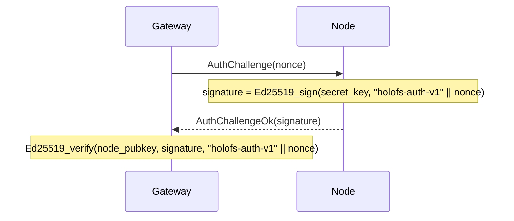

# API-Referenz

Drei externe Schnittstellen: **HTTP-gateway**, **node-Wire-Protokoll** und
**On-Disk-Dateiformate** (manifest, Katalog, shard, whitelist, holoshare).

## Inhalt

1. [HTTP-gateway](#1-http-gateway)
2. [Wire-Protokoll (TCP)](#2-wire-protocol-tcp)
3. [On-Disk-Formate](#3-on-disk-formats)
4. [Konventionen der Antwortheader](#4-response-header-conventions)
5. [MCP-Server (Stage 12)](#5-mcp-server-stage-12)

---

## 1. HTTP-gateway

Basis-URL: `http://<addr>:8787/` (HTTPS über das eigene TLS-Gerüst des gateways
aus Stage 6 — `HOLOFS_TLS=1`, mTLS via `HOLOFS_MTLS=1`).

> **Stage-9-Aktualisierung.** Pfade werden durch Schrägstriche getrennt und
> sind als Wildcards adressierbar (`/photos/2026/img.jpg`). Die reservierten
> Top-Level-Segmente — `api`, `health`, `escrow`, `preview`, `inspect`,
> `similar`, `diff`, `admin`, `metrics`, `pkg` — dürfen nicht als erstes
> Segment eines Objektpfads verwendet werden, weil sie reale Routen
> überschatten.

### Katalog-CRUD

| Methode  | Pfad                       | Beschreibung                                | Body / Parameter |
|----------|----------------------------|---------------------------------------------|------------------|
| `GET`    | `/`                        | HTML-Katalog; liest `?p=<prefix>` für das aufzulistende Verzeichnis | —             |
| `GET`    | `/<path>`                  | Objekt in kanonischer Form herunterladen    | Range unterstützt |
| `GET`    | `/preview/<path>`          | Grobe Vorschau (nur L0)                     | Range unterstützt |
| `PUT`    | `/<path>`                  | Rohbytes hochladen, Art automatisch erkannt. Übergeordnetes Verzeichnis muss existieren (via `mkdir`) | body = Datei |
| `DELETE` | `/<path>`                  | Objekt entfernen + Purge auf allen nodes. Verweigert Verzeichniseinträge (`rmdir` verwenden) | —             |

### Verzeichnisoperationen (Stage 9)

Zwei Varianten jeder Katalogmutation: eine Wildcard-JSON-Variante für
programmatische / `curl`-Aufrufer und ein form-urlencoded-POST, das die
HTML-Formulare der UI ohne JavaScript ansprechen können. Die Formularvarianten
führen einen 303-Redirect auf `/?p=<parent>` aus, sodass der Browser zurück
zum Verzeichnis navigiert, in dem sich die Anwendung befand.

| Methode  | Pfad                       | Beschreibung                                                | Body / Parameter             |
|----------|----------------------------|-------------------------------------------------------------|------------------------------|
| `POST`   | `/api/mkdir/<path>`        | Einen `Directory`-Marker erstellen. Übergeordnetes Verzeichnis muss existieren. | — (JSON-Antwort) |
| `POST`   | `/api/mkdir`               | Formularfreundliches mkdir; leitet auf `/?p=<parent>` um    | `parent=…&name=…`            |
| `DELETE` | `/api/rmdir/<path>`        | Leeres Verzeichnis entfernen. 409, wenn Kinder vorhanden.   | — (JSON-Antwort)             |
| `POST`   | `/api/rmdir`               | Formularfreundliches rmdir; leitet bei Erfolg um            | `path=…`                     |
| `POST`   | `/api/mv`                  | Umbenennen / verschieben; Verzeichnisse nehmen alle Nachkommen mit | `from=…&to=…`         |
| `POST`   | `/api/list_dir`            | Leptos-Serverfunktion: unmittelbare Kinder von `prefix` (JSON-RPC) | `{"prefix":"…"}`       |

Statuscode-Zuordnung für die Verzeichnisoperationen:

| Ergebnis                                 | Status | `GatewayError`           |
|------------------------------------------|--------|--------------------------|
| OK                                       | 200 / 201 / 303 | —               |
| Ziel existiert bereits                   | 409    | `AlreadyExists`          |
| Pfad existiert, ist aber kein Verzeichnis | 409   | `NotADirectory`          |
| `rmdir` auf einem nicht leeren Verzeichnis | 409  | `DirectoryNotEmpty`      |
| `GET`/`DELETE` eines `Directory`-Eintrags | 409   | `IsDirectory`            |
| Fehlerhafter Pfad (`..`, `//`, führendes `/`) | 400 | `BadRequest`            |
| Übergeordnetes Verzeichnis fehlt         | 400    | `BadRequest`             |
| Unbekannter Eintrag                      | 404    | `NotFound`               |

#### Antwort je Art

| Art       | `GET /<path>` liefert                                       |
|-----------|-------------------------------------------------------------|
| image     | `image/png` (neu codiert aus f32-Kanälen)                   |
| audio     | `audio/wav` (16-Bit-PCM, mono/stereo wie gespeichert)       |
| text      | Text-Content-Type je nach Erweiterung, Body enthält Lückenmarker, wenn shards unvollständig sind |
| opaque    | originaler Content-Type + `Content-Disposition: attachment` |
| directory | `409 Conflict` — Verzeichnisse haben keinen Payload (Stage 9) |

### Clusterzustand

| Methode | Pfad                  | Beschreibung                                 |
|---------|-----------------------|----------------------------------------------|
| `GET`   | `/health`             | Pro-node-Tabelle, Kill-/Revive-Schaltflächen |
| `GET`   | `/health/<name>`      | Marge pro (Kanal, Schicht), Monte-Carlo-Verlustsimulation, Zonenausfalltabelle |
| `GET`   | `/api/stats`          | JSON: Objektanzahl nach Art, shards, dedup % |
| `POST`  | `/admin/node` (`i=N`) | node N umschalten (admin-seitig ausgeschlossen/wiederhergestellt) |

`/api/stats` liefert:

```json
{
  "nodes_total": 40,
  "nodes_live": 38,
  "objects_total": 14,
  "objects_by_kind": {"image": 7, "audio": 3, "text": 1, "opaque": 1, "directory": 2},
  "shards_total": 5328,
  "shards_unique": 5326,
  "dedup_savings_pct": 0.04,
  "bytes_total": 50266112
}
```

`objects_total = sum(objects_by_kind)`; `directory`-Marker werden gezählt,
tragen jedoch nichts zu `shards_total` / `bytes_total` bei.

### Suche und Analysen

| Methode | Pfad                          | Beschreibung                                 |
|---------|-------------------------------|----------------------------------------------|
| `GET`   | `/similar/<path>`             | Top-10 ähnlicher Objekte + objektübergreifende Überlappung |
| `GET`   | `/diff?a=<a>&b=<b>`           | Per-Chunk-Diff-Visualisierung. Zwei Objektpfade passen nicht in eine einzige Route, daher hat Stage 9 sie in den Query-String verschoben |
| `GET`   | `/api/fingerprint/<path>`     | JSON: 16-Byte-perzeptueller Hash (image/audio) oder erste 16 Byte der CID (text/opaque) |

`/api/fingerprint/<name>` liefert:

```json
{
  "name": "photo.png",
  "fingerprint": "a3f08c7d12...",
  "kind": "image"
}
```

### Shard-Inspektion

Das Tripel `c_l_idx` identifiziert einen shard innerhalb eines Objekts als
`<channel>_<layer>_<idx>`. Stage 9 hat die URL umgeordnet, sodass das feste
Tripel vor dem Wildcard-Objektpfad steht.

| Methode | Pfad                                                     | Beschreibung |
|---------|----------------------------------------------------------|--------------|
| `GET`   | `/inspect/<path>`                                        | Gitter aller Shard-Thumbnails (farblich nach sys vs RLNC codiert) |
| `GET`   | `/api/shard/<c_l_idx>.png/<path>`                        | 32×32 Graustufen-PNG des Payloads eines shards |
| `GET`   | `/inspect-zoom/<c_l_idx>/<path>`                         | Große Darstellung + Hex-Koeffizienten + Payload + node-Informationen |

### Holographisches Schlüssel-Escrow

| Methode | Pfad                            | Beschreibung |
|---------|---------------------------------|--------------|
| `GET`   | `/escrow`                       | UI mit Split- + Recover-Formularen |
| `POST`  | `/escrow/split`                 | `file=…` + `k=…` + `n=…` → Aufteilung in `n` `.holoshare`-Dateien |
| `GET`   | `/escrow/download/<id>_<idx>.holoshare` | Einen Anteil herunterladen (im gateway-Speicher gehalten) |
| `POST`  | `/escrow/recover`               | `shares=…` (mehrfach) → Originaldatei wiederherstellen |

`.holoshare`-Dateien werden **nicht im Cluster gespeichert** — das gateway
berechnet sie auf Anforderung und hält sie im Speicher bis zum Neustart oder
bis die Anwendung sie herunterlädt.

---

## 2. Wire-Protokoll (TCP)

nodes lauschen auf einem TCP-Socket. Jede Nachricht ist ein Frame:

```
+--------+--------------------+
| u32 BE | payload (≤ 64 MiB) |
+--------+--------------------+
```

Die Obergrenze von 64 MiB (`holofs_wire::MAX_FRAME`) wird zur Decodierzeit
erzwungen; nodes verwerfen übergroße Frames und schließen die Verbindung.

### Anforderungstypen

| Op   | Name              | Payload                                       |
|------|-------------------|-----------------------------------------------|
| 0x00 | `Ping`            | (leer)                                        |
| 0x01 | `Put`             | object\_id, channel, layer, Shard             |
| 0x02 | `Get`             | object\_id, channel, layer                    |
| 0x03 | `Purge`           | object\_id                                    |
| 0x04 | `Stat`            | (leer)                                        |
| 0x05 | `Audit`           | object\_id, channel, layer, shard\_hash       |
| 0x06 | `AuthChallenge`   | nonce[32]                                     |

### Antworttypen

| Op   | Name                  | Payload                                       |
|------|-----------------------|-----------------------------------------------|
| 0x00 | `Pong`                | (leer)                                        |
| 0x01 | `Ack`                 | (leer)                                        |
| 0x02 | `Shards`              | count: u32 BE + N × Shard                     |
| 0x03 | `StatResp`            | total\_shards: u32 BE                         |
| 0x04 | `AuditResp`           | tag: u8 (0=None, 1=Some) + optionaler Shard   |
| 0x05 | `AuthChallengeOk`     | signature[64]                                 |
| 0xff | `Error`               | len: u32 BE + UTF-8-Nachricht                 |

### Wire-Format eines shards

```
+---------------+-----------+----------------+---------+
| u16 BE coeffs_len | coeffs | u32 BE payload_len | payload |
+---------------+-----------+----------------+---------+
```

(Hinweis: `coeffs_len` ist konzeptionell gleich `K` des manifests.)

### Authentifizierungs-Handshake

Das gateway kann jeden node herausfordern, bevor es dessen Antworten vertraut:



`node_pubkey` stammt aus der signierten whitelist (siehe §3 unten).

---

## 3. On-Disk-Formate

Alle Mehrbyte-Ganzzahlen sind **big-endian**, sofern nicht anders angegeben.
Dateien werden durch eine 8-Byte-Magic an Offset 0 identifiziert.

### 3.1. Manifest (`HOLOFSM7`, legacy `HOLOFSM6` beim Lesen akzeptiert)

Stage 9 hat die Magic auf `HOLOFSM7` angehoben, um zu signalisieren, dass ein
Eintrag den Diskriminator `ObjectKind::Directory` (Tag `4`) tragen kann. Das
Wire-Layout ist byte-für-byte identisch zu `HOLOFSM6`; lediglich die Menge der
zulässigen `kind`-Werte ist gewachsen. Alte `HOLOFSM6`-Dateien lassen sich
unter dem neuen Code sauber decodieren.

Verzeichnismarker haben alle numerischen Felder genullt und alle `Vec`-Felder
leer; ihr einziger Träger ist `object_id` (SHA-256-abgeleitet aus dem Pfad,
Domain-Tag `holofs-dir-v1\0`) und ein fester `content_type` von
`inode/directory`.

Ein serialisiertes `Manifest`, das die Codierung eines Objekts beschreibt.

```
magic           8  bytes = "HOLOFSM7" (legacy "HOLOFSM6" also accepted)
object_id       8  bytes BE
k               2  bytes BE
nlayers         1  byte
channels        1  byte
width           4  bytes BE
height          4  bytes BE
levels          1  byte
placement       1  byte (0=RoundRobin, 1=Rendezvous, 2=RendezvousZoneAware)

n_per_layer     nlayers × u32 BE
sym_len         nlayers × u32 BE
layer_positions for each layer:
                    n_positions: u32 BE
                    positions:   n_positions × u32 BE

nodes_count     u32 BE
for each node:
    addr_len    u16 BE
    addr        addr_len bytes UTF-8

zones           nodes_count bytes (one byte per node)

data_cid        32 bytes (SHA-256)
merkle_root     32 bytes (SHA-256)

shard_hashes    channels × nlayers × variable:
                    count: u32 BE
                    hashes: count × 32 bytes

kind            1  byte (0=Image, 1=Text, 2=Audio, 3=Opaque, 4=Directory)
content_type    1 byte length + length bytes UTF-8

chunk_lens      u32 BE count + count × u32 BE
                (for text: per-chunk lengths; for opaque: real file length;
                 for image/audio: usually empty)

audio_sample_rate  u32 BE  (0 for non-audio)

text_minhash    u32 BE count + count × u32 BE
                (for text: bottom-K MinHash; empty otherwise)
```

### 3.2. Verzeichnis (Katalog, `HOLOFSD1`)

```
magic           8 bytes = "HOLOFSD1"
n_entries       u32 BE
for each entry:
    name_len    u16 BE
    name        UTF-8
    manifest_len u32 BE
    manifest    serialised Manifest (§3.1)
```

Atomar geschrieben (Schreiben in `.tmp`, fsync, rename).

### 3.3. Shard-Datei (`HOLOFSS1`)

```
magic        8  bytes = "HOLOFSS1"
object_id    8  bytes BE
channel      1  byte
layer        1  byte
coeffs_len   4  bytes BE
payload_len  4  bytes BE
coeffs       coeffs_len bytes
payload      payload_len bytes
```

Dateiname: `<2 hex chars>/<remaining 62>.shard`, wobei der vollständige Hex
`sha256(coeffs || payload)` ist.

### 3.4. Whitelist (`HOLOFSW1`)

```
magic         8  bytes = "HOLOFSW1"
n_entries     u32 BE
for each entry:
    addr_len  u16 BE
    addr      UTF-8
    pubkey    32 bytes (Ed25519)
    zone      1 byte
admin_pubkey  32 bytes
signature     64 bytes Ed25519
              signs ("holofs-whitelist-v1" || everything-above-the-signature)
```

### 3.5. Holoshare (`HOLOSHAR1`)

Ein Escrow-Anteil. Das Escrow wird **nicht im Cluster gespeichert**; diese
Datei ist zur Verteilung an Personen / Geräte gedacht.

```
magic           9 bytes = "HOLOSHAR1"
escrow_id       16 bytes (first 16 of SHA-256 over the source data)
shard_idx       u16 BE
total_n         u16 BE
total_k         u16 BE
real_len        u64 BE (length of the original file in bytes)
content_type_n  1 byte
content_type    content_type_n bytes UTF-8
filename_n      1 byte
filename        filename_n bytes UTF-8
coeffs_len      u16 BE = total_k
coeffs          coeffs_len bytes
payload_len     u32 BE = sym_len
payload         payload_len bytes
```

Eine vollständige Escrow-Gruppe besitzt identische `escrow_id`, `total_n`,
`total_k`, `real_len`, `content_type`, `filename`. Die Wiederherstellung
erfordert beliebige `total_k` verschiedene `shard_idx`-Werte aus derselben
`escrow_id`.

---

## 4. Konventionen der Antwortheader

Eigene `X-Holofs-*`-Header bei Objektantworten:

| Header                       | Typ       | Beschreibung |
|------------------------------|-----------|--------------|
| `X-Holofs-Kind`              | image / audio / text / opaque | Objektart |
| `X-Holofs-Layers`            | `0-<max>` | für image / audio: tatsächlich decodierte Schichten |
| `X-Holofs-Bytes-Downloaded`  | u64       | Bytes, die für diese Antwort von nodes geholt wurden |
| `X-Holofs-Decode-Ms`         | u128      | Zeit für die Decodierung (ohne Netzwerk-RTT) |
| `X-Holofs-Sample-Rate`       | u32       | audio: Abtastrate in Hz |
| `X-Holofs-Channels`          | u8        | audio: 1 oder 2 |
| `X-Holofs-Chunks-Total`      | usize     | text: Gesamtanzahl der Chunks |
| `X-Holofs-Chunks-Missing`    | usize     | text: durch Lückenmarker ersetzte Chunks |
| `X-Holofs-Escrow-Shares-Used`| usize     | Escrow-Recover: Anzahl der verbrauchten Anteile |


---

## 5. MCP-Server (Stage 12)

Das Gateway stellt einen **Model-Context-Protocol**-Endpunkt unter
`POST /mcp` per Streamable-HTTP-Transport (Spezifikation Rev.
`2025-03-26`) bereit. MCP-Clients wie Claude Desktop oder Claude Code
sprechen direkt damit, ohne das Web-UI zu scrapen; beide Oberflächen
nutzen denselben `Arc<Gateway>`, daher bleiben Lesen und Schreiben
kohärent.

### 5.1 Transport

`/mcp` antwortet auf POST (Client → Server), GET (optionaler
Server → Client-SSE-Stream) und DELETE (Sitzungsabbau). Eine Sitzung
trägt den Header `Mcp-Session-Id`, ausgestellt beim ersten
`initialize`. Der Endpunkt sitzt hinter demselben axum-Router wie der
Rest (Standard `127.0.0.1:8787`).

### 5.2 Authentifizierung

Gesteuert über eine einzige Env-Variable auf dem Server:

| `HOLOFS_MCP_TOKEN`     | Verhalten                                              |
|------------------------|--------------------------------------------------------|
| nicht gesetzt / leer   | `/mcp` ist offen, aber **nur lesend** — Schreibwerkzeuge verweigern |
| ein Wert ungleich leer | erfordert `Authorization: Bearer <token>` bei jeder Anfrage |

Mit gesetztem Token werden Schreibwerkzeuge (`put_object_text`, `mkdir`,
`rmdir`, `mv_object`) aktiviert. Ohne Token liefern sie
`invalid_request` mit Hinweis auf die Env-Variable. Der Token wird beim
Start einmal gelesen und nie geloggt — Rotation erfordert Neustart.

Einbindung in Claude Code:

```sh
# nur lesen
claude mcp add --transport http holofs http://127.0.0.1:8787/mcp

# mit Auth
claude mcp add --transport http holofs http://127.0.0.1:8787/mcp \
  --header "Authorization: Bearer $HOLOFS_MCP_TOKEN"
```

### 5.3 Werkzeuge

Zwölf Werkzeuge nach Fähigkeit gruppiert:

**Lesen (immer verfügbar)**

| Tool                  | Eingaben                                | Liefert |
|-----------------------|-----------------------------------------|---------|
| `list_catalog`        | `prefix?`, `recursive?`                 | Katalogzeilen unter Prefix |
| `read_object_text`    | `path`                                  | UTF-8-Inhalt, Limit 256 KiB |
| `find_similar`        | `path`, `scope?` (`all`/`folder`/`tree`)| Top-10-Nachbarn + Methode |
| `get_cluster_health`  | —                                       | Nodes + Katalog-Snapshot |
| `get_object_health`   | `path`                                  | Decode-Bereitschaftsübersicht |

**Inspektion (immer verfügbar)**

| Tool             | Eingaben                                              | Liefert |
|------------------|-------------------------------------------------------|---------|
| `diff_objects`   | `a`, `b`, `include_cells?`                            | Chunk-Überlappung pro Layer |
| `inspect_object` | `path`                                                | Layout pro (Kanal, Layer) |
| `inspect_shard`  | `path`, `channel`, `layer`, `idx`, `include_payload?` | Shard-Metadaten + optionaler Payload |

**Schreiben (per `HOLOFS_MCP_TOKEN` freigeschaltet)**

| Tool              | Eingaben                              | Liefert |
|-------------------|---------------------------------------|---------|
| `put_object_text` | `path`, `content`, `content_type?`    | `{path, action="wrote", note}` |
| `mkdir`           | `path`                                | `{path, action="created"}` |
| `rmdir`           | `path` (muss leer sein)               | `{path, action="removed"}` |
| `mv_object`       | `from`, `to`                          | `{path, action="renamed", note}` |

### 5.4 Ressourcen

Jeder Katalogeintrag, der keine Directory ist, ist auch über die
MCP-`resources/`-Oberfläche unter `holofs:///<catalog-path>` erreichbar.
`resources/list` liefert eine Zeile pro Datei mit `mimeType` aus dem
Manifest und kurzer Beschreibung; `resources/read` dekodiert das Objekt
serverseitig und liefert:

- **text-kind** → `TextResourceContents` mit UTF-8-Inhalt
- **image / audio / opaque** → `BlobResourceContents` mit base64-Payload

Lesungen sind auf 1 MiB pro Abruf begrenzt, damit ein einzelnes Resource
nicht das LLM-Kontextfenster sprengt.

### 5.5 Beispiel auf Protokollebene (curl)

Flow initialize → `tools/list` → `tools/call` über Streamable HTTP:

```sh
SID=$(curl -si -X POST http://127.0.0.1:8787/mcp \
  -H 'Content-Type: application/json' \
  -H 'Accept: application/json, text/event-stream' \
  -d '{"jsonrpc":"2.0","id":1,"method":"initialize","params":{
    "protocolVersion":"2025-06-18","capabilities":{},
    "clientInfo":{"name":"curl","version":"1"}}}' \
  | grep -i 'mcp-session-id:' | awk '{print $2}' | tr -d '\r')

# nach initialize erforderlich
curl -s -X POST http://127.0.0.1:8787/mcp \
  -H "Mcp-Session-Id: $SID" -H 'Content-Type: application/json' \
  -H 'Accept: application/json, text/event-stream' \
  -d '{"jsonrpc":"2.0","method":"notifications/initialized"}' > /dev/null

# alle Werkzeuge auflisten
curl -s -X POST http://127.0.0.1:8787/mcp \
  -H "Mcp-Session-Id: $SID" -H 'Content-Type: application/json' \
  -H 'Accept: application/json, text/event-stream' \
  -d '{"jsonrpc":"2.0","id":2,"method":"tools/list"}'

# ähnliche Dateien zu einem Objekt, beschränkt auf dessen Ordner
curl -s -X POST http://127.0.0.1:8787/mcp \
  -H "Mcp-Session-Id: $SID" -H 'Content-Type: application/json' \
  -H 'Accept: application/json, text/event-stream' \
  -d '{"jsonrpc":"2.0","id":3,"method":"tools/call","params":{
    "name":"find_similar","arguments":{
      "path":"photos/2026/mandala.png","scope":"folder"}}}'
```
