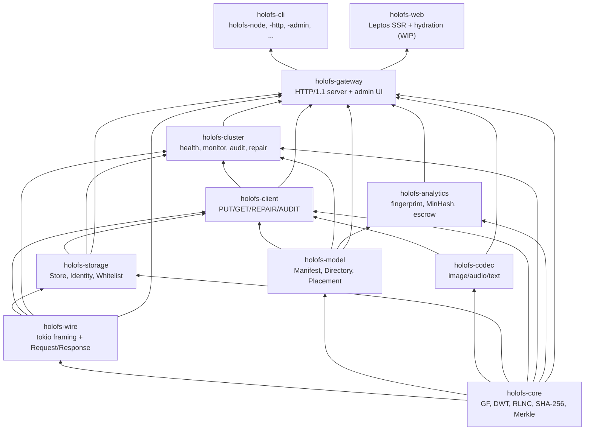
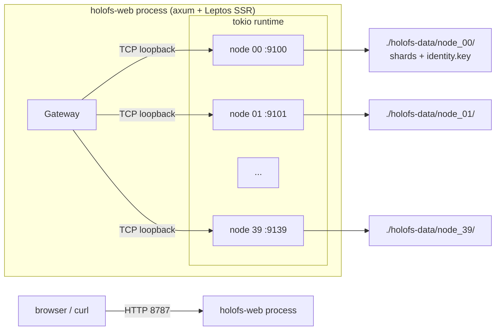
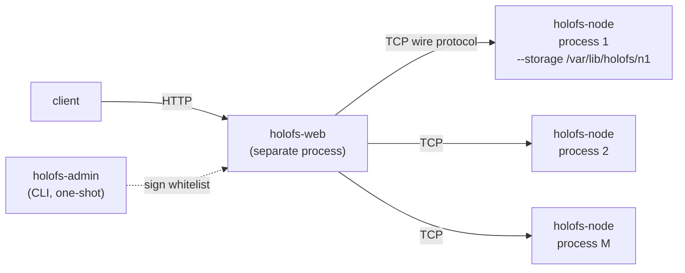
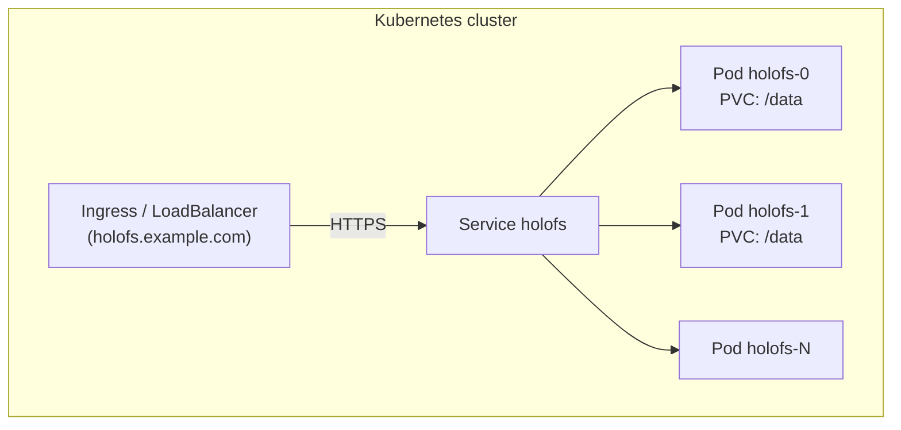
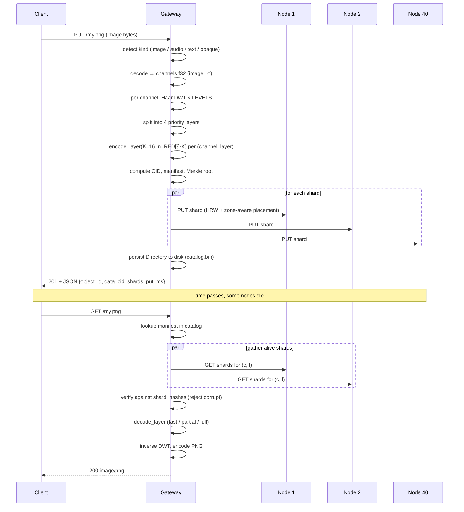

# Architektur

Strukturelle Übersicht von holofs auf Systemebene, gedacht für Maintainer und
Reviewer. Mathematische Grundlagen siehe [theory.md](./theory.md); HTTP- /
Wire-Protokoll-Details siehe [api.md](./api.md).

## Inhalt

1. [Crate-Abhängigkeitsgraph](#1-crate-dependency-graph)
2. [Prozess- / Deployment-Topologien](#2-process--deployment-topologies)
3. [Objektlebenszyklus (PUT → GET)](#3-object-lifecycle-put--get)
4. [Persistenzmodell](#4-persistence-model)
5. [Vertrauensmodell](#5-trust-model)
6. [Nebenläufigkeitsmodell](#6-concurrency-model)
7. [Fehlermodi](#7-failure-modes)

---

## 1. Crate-Abhängigkeitsgraph

Strikte topologische Reihenfolge — Pfeile dürfen niemals nach oben zeigen.



**Faustregel.** Ein Pull Request, der eine aufwärts gerichtete Kante in
diesem Graphen hinzufügt, bedarf einer separaten Diskussion — fast immer
bedeutet das, dass ein Typ oder eine Funktion im falschen Crate liegt.

---

## 2. Prozess- / Deployment-Topologien

### A. Eingebettet, Einzelprozess (Entwicklung / kleine Cluster)



Wird für Demos, Entwicklung und Einzelmaschinen-Bare-Metal verwendet. Das
gateway und die nodes teilen sich eine tokio-Runtime, kommunizieren jedoch
über echtes TCP — eine spätere Migration zu Mehrprozess ist einfach.

### B. Multi-Prozess-Bare-Metal-Cluster



Jeder node ist ein unabhängiger Betriebssystemprozess mit eigenem persistentem
Speicherverzeichnis und eigener Ed25519-Identität. Das gateway ist mit einer
signierten whitelist von `(addr, pubkey, zone)`-Tripeln konfiguriert. Die
Fehlerisolation ist real: das Beenden eines node-Prozesses reißt nichts
anderes mit.

Skript-Variante: `./scripts/spawn-cluster.sh N BASE_PORT GATEWAY_ADDR` bringt
die gesamte Topologie mit einem Befehl hoch.

### C. Kubernetes (StatefulSet)



`deploy/helm/holofs` stellt StatefulSet- + PersistentVolumeClaim-Templates
bereit. Jeder Pod führt das mehrstufige Docker-Image aus, das eingebettete
nodes gegen sein eigenes `/data` PVC automatisch startet. Für sehr große
Cluster wird in N gateway-Pods + M dedizierte node-Pods aufgeteilt (Helm-Chart
unterstützt `nodeCount` und `gatewayCount` separat).

---

## 3. Objektlebenszyklus (PUT → GET)



### Divergenz nach Art

| Art      | PUT-Pfad                                              | GET-Antwort        |
|----------|-------------------------------------------------------|--------------------|
| image    | DWT 2D × 3 Kanäle × 4 Schichten × RLNC                | neu codiertes PNG  |
| audio    | DWT 1D × 1–2 Kanäle × 4 Schichten × RLNC              | WAV 16-Bit-PCM     |
| text     | UTF-8-grenzentreue Chunks × 1 Schicht × systematisches RLNC | text/plain + Lücken |
| opaque   | ein Byte-Strom × 1 Schicht × RLNC (kein DWT)          | Originalbytes      |

---

## 4. Persistenzmodell

Jeder node besitzt ein Verzeichnis. Drei Arten von Dateien liegen dort:

```
<storage>/
├── identity.key                # 32-byte Ed25519 seed (mode 0600)
├── <hex>/<hex>.shard           # one file per stored shard
└── <hex>/<hex>.shard
```

Das gateway besitzt zusätzlich:

```
<storage>/catalog.bin            # serialised Directory (Manifest map)
                                 # Header magic: "HOLOFSD1"
```

### Layout einer Shard-Datei

```
magic        8  bytes  = "HOLOFSS1"
object_id    8  bytes  big-endian
channel      1  byte
layer        1  byte
coeffs_len   4  bytes  big-endian
payload_len  4  bytes  big-endian
coeffs       coeffs_len bytes
payload      payload_len bytes
```

Der Dateiname ist `hex(sha256(shard))`, aufgeteilt als
`<2 hex chars>/<remaining 62>.shard` (Git-Stil-Fanout, um riesige Verzeichnisse
zu vermeiden).

### Schreib-Atomarität

```
write to <name>.shard.tmp
fsync
rename <name>.shard.tmp → <name>.shard
```

Ein Absturz hinterlässt entweder nichts oder einen vollständigen shard —
niemals eine zerrissene Datei.

### Index-Wiederherstellung

Bei `Store::open(dir)` läuft der node durch seinen Baum und rekonstruiert
den In-Memory-Index `HashMap<(object_id, channel, layer), HashMap<Hash, Shard>>`
durch erneutes Hashen jedes shards. Dies ist die einzige zulässige Wahrheitsquelle
— es gibt keine separate `.idx`-Datei, die veralten könnte.

### Dedup

Shard-Dateinamen sind inhaltsadressiert. Ein doppeltes PUT (gleiche
Koeffizienten + Payload) wird durch `fs::write(... .tmp)` → `rename` über
einer bestehenden Datei erkannt (überschreibt identisch). Die frühere
In-Memory-Index-Prüfung gibt weiterhin `false` von `put()` zurück, sodass der
Aufrufer weiß, dass kein neuer shard erschienen ist.

---

## 5. Vertrauensmodell

| Komponente      | Vertrauensannahme                                      |
|-----------------|--------------------------------------------------------|
| Admin           | absolut — signiert die whitelist, erzeugt Keypaare     |
| Gateway         | vertraut der Admin-Signatur auf der whitelist          |
| Node            | vertraut seinem eigenen `identity.key` (Dateisystem)   |
| Inter-node      | spricht nicht Peer-zu-Peer; nur gateway ↔ node         |
| Client          | vertraut dem gateway (TLS für Produktion empfohlen)    |

Wir sind ausdrücklich **kein** erlaubnisfreies System: es gibt keinen
Proof-of-Replication, keine Sybil-Resistenz. holofs sitzt in derselben
Vertrauensklasse wie Backblaze B2 oder AWS S3, nicht Filecoin oder Storj.
Siehe [threat-model.md](./threat-model.md) für eine strukturierte Analyse.

### Verwendete kryptografische Primitiven

| Zweck                            | Primitive                       | Crate                |
|----------------------------------|---------------------------------|----------------------|
| Shard- / Objektintegrität        | SHA-256 (FIPS 180-4, handgerollt) | holofs-core         |
| Node-Identität                   | Ed25519                         | ed25519-dalek (RFC 8032) |
| Admin-whitelist-Signatur         | Ed25519                         | ed25519-dalek       |
| Handshake-Challenge              | zufällige 32-Byte-nonce + Ed25519 | holofs-storage    |
| Key Escrow / Shamir-Stil         | RLNC über GF(2⁸) mit benutzerdefiniertem K | holofs-analytics |
| Domain-Trennung                  | String-Präfix (`holofs-XXX-vN`) vor Hash- / Sign-Eingabe |

---

## 6. Nebenläufigkeitsmodell

- **Tokio Multi-Thread-Runtime** an der Spitze jedes Binaries
  (`#[tokio::main(flavor = "multi_thread")]`).
- **Eine Task pro Verbindung** im gateway und in jedem node.
- **`tokio::sync::Mutex`** für gemeinsamen Zustand (Katalog, Store, Reputation,
  admin\_kills). Wir halten niemals einen Mutex über eine `.await`-Grenze
  hinweg auf einem heißen Pfad — stattdessen Snapshot-Muster.
- **Kanäle** werden noch nicht verwendet (das System ist Request/Response);
  zukünftige Streaming-Antworten werden `tokio::sync::mpsc` nutzen.

### Hintergrund-Tasks im gateway

| Task               | Takt    | Crate           |
|--------------------|---------|------------------|
| Health-Monitor     | `HOLOFS_MONITOR_INTERVAL` (15 s Standard) | holofs-cluster |
| PoR-Auditor        | `HOLOFS_AUDIT_INTERVAL` (30 s Standard)   | holofs-cluster |
| Katalog-Autosave   | bei jeder Katalogmutation (inline)        | holofs-gateway |

Beide Hintergrund-Tasks werden bei SIGINT über `tokio::select!` abgebrochen.

---

## 7. Fehlermodi

| Fehler                                      | Erkannt durch                | Wiederherstellung                 |
|---------------------------------------------|------------------------------|-----------------------------------|
| Node-Prozess stirbt                         | Health-Monitor (`Ping`)      | Marge neu berechnet; bei `LowMargin` wird Reparatur in die Warteschlange gestellt |
| Node-Betriebssystem startet neu, kommt mit gleicher Identität zurück | Health-Monitor-`revived`-Event | `repair_node` füllt HRW-Anteil neu auf |
| Node liefert falsche Bytes (stille Korruption) | PoR-Audit (Hash-Mismatch)  | Reputation sinkt; node aus `live` ausgeschlossen |
| Node lügt "ich habe es", ohne zu speichern  | PoR-Audit (`MissingShard`)   | Reputation sinkt |
| Ganzes Rack / ganze Zone fällt aus          | Health-Monitor + zone-aware  | Objekt bleibt decodierbar bis L_{n-1}/L_{n-2} |
| Gateway stürzt während PUT ab               | Client-Retry                 | bereits auf nodes vorhandene shards werden beim Retry per Hash dedupliziert |
| Gateway stürzt während DELETE ab            | inkonsistent: einige nodes purged, andere nicht | nächster Health-Durchgang erkennt verwaiste shards (TODO: gc) |
| Plattenkorruption an einer Shard-Datei      | Hash-Verifikation beim Lesen | shard verworfen → Marge sinkt → Reparatur |
| Netzwerkpartition zwischen gateway und node | RPC-Timeout                  | Health-Monitor → ausschließen → reparieren, falls Marge sinkt |
| Whitelist-Signatur ungültig                 | Gateway-Startup-Check        | verweigert den Start (Fail-Fast) |

### Wogegen wir nicht schützen

- **Byzantinisches gateway**: dem gateway wird vertraut. Ein bösartiges
  gateway kann alle Daten korrumpieren.
- **Koordinierte Node-Kollusion**: K bösartige nodes (K-of-N-Schwelle) können
  jedes Objekt rekonstruieren. Reputation ist reaktiv, nicht präventiv.
- **Seitenkanalangriffe auf shard-Transit**: TLS mildert Lauschangriffe; es
  verhindert keine Timing-Angriffe gegen die GF(2⁸)-Tabellen-Lookups (die
  im Bedrohungsmodell von holofs ohnehin öffentlich sind).
