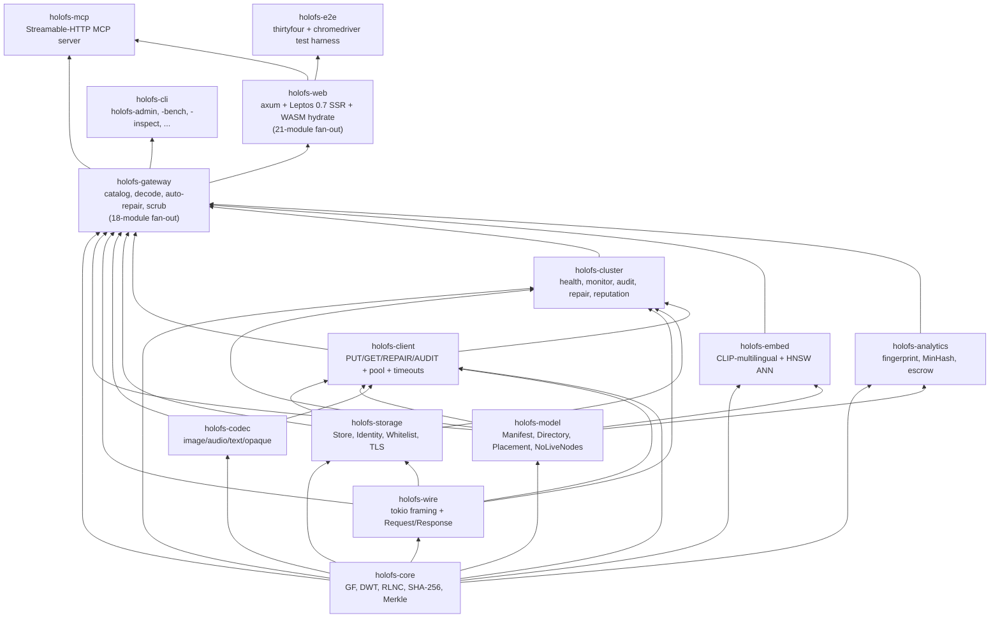
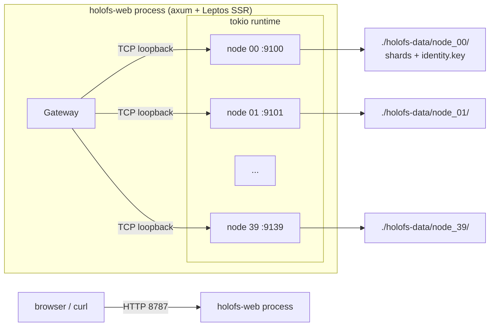
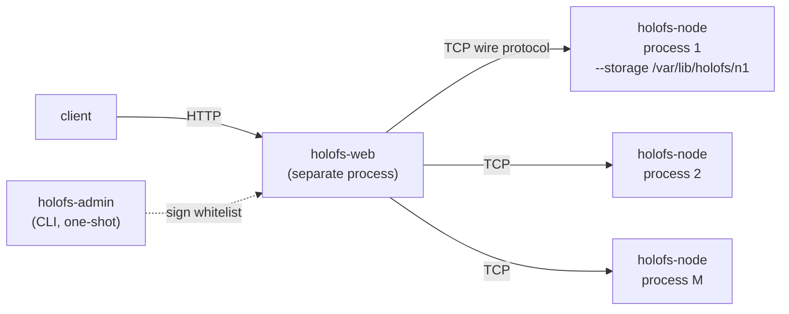
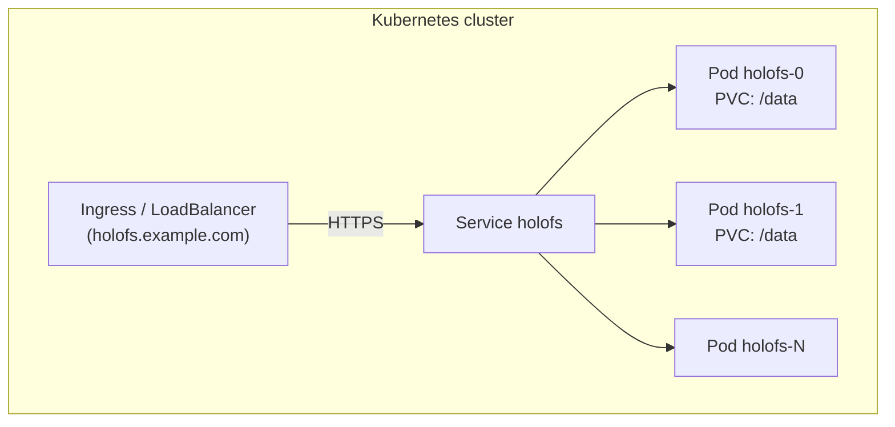
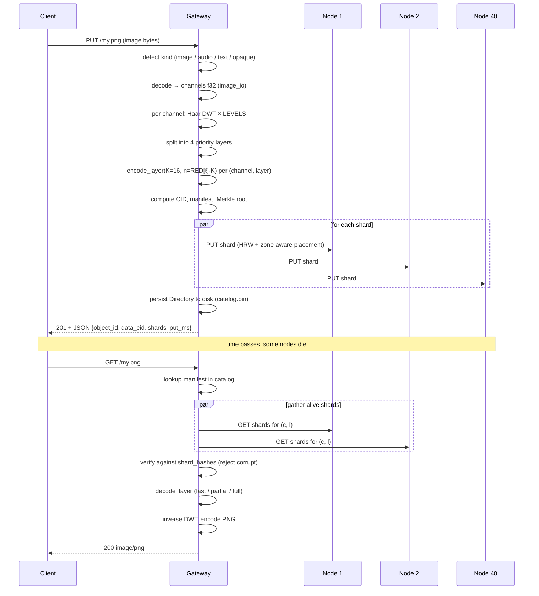

# Architektur

Strukturelle Übersicht von holofs auf Systemebene, gedacht für Maintainer
und Reviewer. Mathematische Grundlagen siehe [theory.md](./theory.md);
HTTP- / Wire-Protokoll-Details siehe [api.md](./api.md).

## Inhalt

1. [Crate-Abhängigkeitsgraph](#1-crate-abhängigkeitsgraph)
2. [Prozess- / Deployment-Topologien](#2-prozess---deployment-topologien)
3. [Objektlebenszyklus (PUT → GET)](#3-objektlebenszyklus-put--get)
4. [Persistenzmodell](#4-persistenzmodell)
5. [Vertrauensmodell](#5-vertrauensmodell)
6. [Nebenläufigkeitsmodell](#6-nebenläufigkeitsmodell)
7. [Fehlermodi](#7-fehlermodi)

---

## 1. Crate-Abhängigkeitsgraph

Strikte topologische Reihenfolge — Pfeile dürfen niemals nach oben zeigen.



**Faustregel.** Ein Pull Request, der eine aufwärts gerichtete Kante in
diesem Graphen hinzufügt, bedarf einer separaten Diskussion — fast immer
bedeutet das, dass ein Typ oder eine Funktion im falschen Crate liegt.

### 1.1. Modul-Layout des Gateways

Der Crate `holofs-gateway` liefert einen Typ — `Gateway` — aber seine
Implementierung ist auf 18 Geschwistermodule verteilt, jedes besitzt
einen `impl Gateway { ... }`-Block. Alles, was in `http_gateway.rs`
verbleibt (288 Zeilen), ist Zustand + Accessoren + die beiden
gemeinsam genutzten Helfer `persist_catalog` und `invalidate_cache`.
Die öffentliche API wird via `pub use` am Crate-Wurzelverzeichnis
erhalten; Konsumenten schreiben nach wie vor
`holofs_gateway::GatewayError`, `holofs_gateway::SimilarReport` usw.,
ohne den Modulpfad zu berühren.

| Modul | Zweck |
|---|---|
| `http_gateway` | `Gateway`-Struct, Konstruktoren, Accessoren, `persist_catalog`, `invalidate_cache`. |
| `error` | `GatewayError`-Enum + `Display` + `From<NoLiveNodes>`. |
| `util` | Kleine Helfer: `now_unix`, `directory_object_id`, Content-Type-Sniffer, `encode_png`. |
| `decode` | HTTP-seitige Decode-Dispatch — `decode_object`, `get_or_decode` (PNG-Cache). |
| `ingest` | Universeller PUT — `ingest_bytes`, `put_any`, kind-spezifische Blank-Manifest-Helfer. |
| `repair` | `decode_with_autorepair`, `repair_object_inplace`, `purge_orphans_of`. |
| `dirops` | `remove_object`, `mkdir`, `rmdir`, `rename`, `list_dir`. |
| `versions` | Per-Objekt-Versionshistorie: archive / list / restore / delete + Retention. |
| `search` | CLIP-multilingual Embed-Pipeline + HNSW-gestützte semantische Suche. |
| `similarity` | `SimilarScope` / `SimilarMatch` / `ShardOverlap`-Typen + Scope-Helfer. |
| `fingerprint` | Perzeptueller FP + `similar_to`. |
| `mix` | Wavelet-Mix + Audio-Band-Filter. |
| `diff` | Byte-perfekter Chunk-Diff-Analyzer. |
| `spotlight` | Sharp-Inside / Blurred-Outside ROI-Composites. |
| `inspect` | `/inspect`-View-Model + Shard-Payload-Extraktion. |
| `metrics` | `file_metrics` — Storage/Dedup + Originality + Layer-Energie in einem Durchgang. |
| `health` | Cluster-Stats, Admin-Toggles, `scrub_tick`, `object_health`. |
| `escrow` | Threshold-RLNC-Schlüsselhinterlegung (Verfügbarkeits-Primitiv, nicht ITS; siehe theory.md §8). |
| `gc` | Garbage Collector für verwaiste Shards. |

**Faustregel.** Neue `Gateway`-Methoden gehören zu dem Modul, dessen
Belang sie erweitern, nicht zu `http_gateway.rs`. Wird ein neues
Modul benötigt, kommt es neben die anderen und bekommt seinen eigenen
`impl Gateway`-Block; nichts in `http_gateway.rs` soll erneut wachsen.

### 1.2. Reliability-Schicht

Die Reliability-Primitive leben in `holofs-web`, weil sie die
HTTP-Oberfläche komponieren, nicht den Gateway-Zustand. Siehe
[operations.md § 5.6](./operations.md#56-reliability-schicht) für die
Env-Var-Referenz.

| Modul | Zweck |
|---|---|
| `holofs_web::supervised` | `supervised_spawn(name, shutdown, counter, f)` — Panic-fangender + Exp-Backoff-Restart-Wrapper um `tokio::spawn`. |
| `holofs_web::timeout` | `run_with_deadline`-Middleware + `SHORT`/`MEDIUM`/`LONG`-Duration-Buckets. |
| `holofs_web::backpressure` | `with_permit`-Middleware — `Arc<Semaphore>::try_acquire_owned` pro Bucket, 503 bei Sättigung. |
| `holofs_web::admin_auth` | `AdminAuth::from_env` + `require_admin_token`-Middleware — Bearer-Token-Gate für `/admin/*` + `/api/gc`. |
| `holofs_web::bootstrap` | Liest Env, verdrahtet den gemeinsamen `CancellationToken` in jede langlaufende Task, baut das `Bootstrap`-Handle, auf das `main.rs` beim Shutdown joint, verdrahtet die supervisierte Reputation-Persist-Task. |

**Fail-loud-Persistenz** ist eine Gateway-seitige Änderung, keine
holofs-web-seitige: `Gateway::persist_catalog` gibt
`Result<(), GatewayError::Persist>` zurück, und jeder Writer-Pfad
(`ingest`, `dirops`, `versions`) propagiert via `?`.

### 1.3. Modul-Layout des Web-Crates

`holofs-web` ist in einzweckige Geschwistermodule aufgeteilt — nichts
darin übersteigt einige hundert Zeilen.

**`lib.rs`** — Modulregister + `pub use`-Re-Exporte am Crate-Wurzel +
[`Shell`] / [`App`] / [`RoutedApp`] Top-Level-Komponenten +
`url_encode`-Utility + WASM-`hydrate`-Entry. Alles Weitere lebt in
Geschwistern:

| Modul | Zweck |
|---|---|
| `catalog_types` | `CatalogEntry`-View-Model, das über SSR- und Hydrate-Grenzen hinweg geteilt wird. `from_manifest` (nur SSR). |
| `filter` | Katalog-Filter — `CatalogFilter`, `apply_filter`, `compile_glob`, `parse_date_to_unix`, `ymd_to_unix` + sieben Unit-Tests. Nur SSR. |
| `server_fns` | Die drei `#[server]`-Funktionen (`get_catalog`, `list_dir`, `list_dir_page`) + `ListDirPage` + `TreeSort` + `compare_entries`. |
| `catalog_ui` | Fünfzehn Leptos-Komponenten — `CatalogPage`, `CatalogFocusView`, `FilterBar`, `TreeZoomButtons`, `Breadcrumb`, `CatalogTreeView` + eager/lazy-Varianten, `LazyLevel`, `LazyDirNode`, `CatalogTreeBody`, `TreeNodeView`, `MkdirForm`, `UploadForm`, `ObjectCard`. |

**`handlers.rs`** — reine Modulregistrierungs-Vorderseite + `pub use`-
Re-Exporte. Jeder Handler lebt in einem Domain-Submodul unter
`handlers/`:

| Modul | Handler |
|---|---|
| `handlers/objects` | GET / PUT / DELETE `/*path`, `/preview/*`, `/preview/stream/*`, `/api/shard/…`, wasm-Alias. |
| `handlers/dirops` | mkdir, rmdir, rm, mv (JSON- + Form-Varianten). |
| `handlers/uploads` | Multipart `/api/upload`. |
| `handlers/versions` | `/api/restore`, `/api/versions/delete`. |
| `handlers/analytics` | `/api/fingerprint/*`, `/api/mix.png`, `/api/mix-save`, `/api/spotlight.png`. |
| `handlers/search` | `/api/embed_all`, `/api/search`. |
| `handlers/health` | `/api/stats`, `/metrics`, `/api/gc`, `/admin/node`, `/api/health/events` SSE. |
| `handlers/escrow` | `/escrow/split`, `/escrow/download`, `/escrow/recover`. |
| `handlers/util` | Reine Helfer — Pfadvalidierung, Form-Parsing, HTML/JSON-Escape, Header-Shortcuts, `error_to_response`. |
| `handlers/response` | Response-Builder — `serve_with_range`, ingest / remove / mkdir / rmdir / rename → HTTP, stats + fingerprint → JSON. |

Die öffentliche API wird via `pub use handlers::foo` am Wurzelknoten
von `handlers.rs` erhalten, sodass die bestehenden Referenzen von
`main.rs` (`handlers::mkdir` / `handlers::spotlight_png` / usw.)
unverändert auflösen.

Die Reliability-Primitive aus § 1.2 (`supervised`, `timeout`,
`backpressure`, `admin_auth`, `bootstrap`) sind davon nicht betroffen —
sie lebten bereits in ihren eigenen Modulen.

**Faustregel.** Neue Leptos-Komponenten kommen in `catalog_ui.rs`
(katalogbezogen) oder in ein frisches Geschwistermodul (seitengroß
wie `/health`, `/search`, `/versions`). Neue axum-Handler kommen in
das Domain-Modul, dessen Belang sie erweitern (`handlers/dirops.rs`
für eine neue mkdir-Variante usw.). Nichts Neues soll die
Top-Level-Dateien `lib.rs` oder `handlers.rs` vergrößern.

---

## 2. Prozess- / Deployment-Topologien

### A. Eingebettet, Einzelprozess (Entwicklung / kleine Cluster)



Wird für Demos, Entwicklung und Einzelmaschinen-Bare-Metal verwendet.
Gateway und Nodes teilen sich eine tokio-Runtime, kommunizieren jedoch
über echtes TCP — eine spätere Migration zu einem Mehrprozess-Setup ist
einfach.

### B. Multi-Prozess-Bare-Metal-Cluster



Jeder Node ist ein unabhängiger Betriebssystemprozess mit eigenem
persistentem Speicherverzeichnis und eigener Ed25519-Identität. Das
Gateway ist mit einer signierten Whitelist von
`(addr, pubkey, zone)`-Tripeln konfiguriert. Die Fehlerisolation ist
real: das Beenden eines Node-Prozesses reißt nichts anderes mit.

Skript-Variante: `./scripts/spawn-cluster.sh N BASE_PORT GATEWAY_ADDR`
bringt die gesamte Topologie mit einem Befehl hoch.

### C. Kubernetes (StatefulSet)



`deploy/helm/holofs` stellt StatefulSet- + PersistentVolumeClaim-
Templates bereit. Jeder Pod führt das mehrstufige Docker-Image aus, das
eingebettete Nodes gegen sein eigenes `/data` PVC automatisch startet.
Für sehr große Cluster wird in N Gateway-Pods + M dedizierte Node-Pods
aufgeteilt (Helm-Chart unterstützt `nodeCount` und `gatewayCount`
getrennt).

---

## 3. Objektlebenszyklus (PUT → GET)



### Divergenz nach Art

| Art      | PUT-Pfad                                              | GET-Antwort         |
|----------|-------------------------------------------------------|---------------------|
| image    | DWT 2D × 3 Kanäle × 4 Schichten × RLNC                | neu codiertes PNG   |
| audio    | DWT 1D × 1–2 Kanäle × 4 Schichten × RLNC              | WAV 16-Bit-PCM      |
| text     | UTF-8-grenzentreue Chunks × 1 Schicht × systematisches RLNC | text/plain + Lücken |
| opaque   | ein Byte-Strom × 1 Schicht × RLNC (kein DWT)          | Originalbytes       |

---

## 4. Persistenzmodell

Jeder Node besitzt ein Verzeichnis. Drei Arten von Dateien liegen dort:

```
<storage>/
├── identity.key                # 32-byte Ed25519 seed (mode 0600)
├── <hex>/<hex>.shard           # one file per stored shard
└── <hex>/<hex>.shard
```

Das Gateway besitzt zusätzlich:

```
<storage>/catalog.bin            # serialised Directory (Manifest map)
                                 # Header magic: "HOLOFSD1"
```

### Layout einer Shard-Datei

```
magic        8  bytes  = "HOLOFSS1"
object_id    8  bytes  big-endian
channel      1  byte
layer        1  byte
coeffs_len   4  bytes  big-endian
payload_len  4  bytes  big-endian
coeffs       coeffs_len bytes
payload      payload_len bytes
```

Der Dateiname ist `hex(sha256(shard))`, aufgeteilt als
`<2 hex chars>/<remaining 62>.shard` (Git-Stil-Fanout, um riesige
Verzeichnisse zu vermeiden).

### Schreib-Atomarität

```
write to <name>.shard.tmp
fsync
rename <name>.shard.tmp → <name>.shard
```

Ein Absturz hinterlässt entweder nichts oder einen vollständigen Shard —
niemals eine zerrissene Datei.

### WAL + Group-Commit

Jeder `Store::put_appended` (aufgerufen vom Node-Service-Handler für
`Request::Put` / `Request::PutBatch`) schreibt einen
length-prefixed Record mit SHA-256-Digest in ein append-only
WAL-Segment (`wal-<N>.log`, Magic `HOLOFSW1`). Ein Hintergrund-
Flusher wacht alle `HOLOFS_NODE_FLUSH_INTERVAL_MS` auf (Default
5 ms, still geklemmt auf ≥ 1 ms nach dem B3-Fix), flusht den
`BufWriter`, gibt den Store-Lock frei und ruft `fsync` auf die
darunterliegende Datei via `spawn_blocking`. Wenn fsync zurückkehrt,
wird `wal_synced_seq` inkrementiert und jeder Waiter für eine
Sequenz ≤ diesem Wert benachrichtigt. Unter einem 24-Encoder-Burst
verwandelt das 24 × 12 ≈ 288 gleichzeitige Per-Shard-fsyncs in
~200 gebündelte fsync/s, wobei jeder Batch N pending Appends
amortisiert. Der Handler gibt `Ack` erst zurück, wenn sein
zugewiesener WAL-Seq auf der Platte gelandet ist — die
Durabilitätsgrenze bleibt gegenüber der pre-WAL-Ära unverändert.

### At-Rest-Verschlüsselung (AES-256-GCM)

`HOLOFS_AT_REST_ENC=1` auf dem Node setzen — der Schalter ist
boolean, kein Hex-Key. Der 32-Byte-Schlüssel wird HKDF-SHA256-
abgeleitet aus dem eigenen Ed25519-Identity-Seed des Nodes
(dieselbe `identity.key`, die für den Wire-Handshake benutzt wird),
mit `salt = "holofs-shard-salt-v1"` und
`info = "holofs-shard-key-v1"`. Bei Aktivierung wechselt der
Node-Service das Shard-File-Magic von `HOLOFSS1` auf `HOLOFSS2` und
versiegelt den `coeffs || payload`-Blob mit AES-256-GCM; die
12-Byte-Nonce wird direkt nach dem AAD-Header inline abgelegt.
Shard-Hashes werden auf dem *Plaintext*-Payload berechnet, Hash-
Inventar und Content-Addressing bleiben also unverändert — ein Node,
der das Flag mid-life umschaltet, gibt beim nächsten Scan dieselbe
Hash-Liste aus. Siehe
`crates/holofs-storage/src/crypto.rs::derive_shard_key` für die
Ableitung und das On-Disk-Format.

**Bedrohungsdeckung.** Schützt vor Filesystem-Level-Reads auf dem
Node-Host (Insider-Read, Backup-Tape-Leak). Schützt **nicht** vor
dem Node-Prozess selbst, der K Shards eines Objekts hält — der
Plaintext wird bei jedem Read entschlüsselt. Und weil der Schlüssel
am Identity-Seed hängt, bedeutet ein verlorener Identity-Key
unrettbare Shards; die `identity.key` vor Aktivierung offline
sichern.

### Index-Wiederherstellung

Bei `Store::open(dir)` läuft der Node durch seinen Baum und
rekonstruiert den In-Memory-Index
`HashMap<(object_id, channel, layer), HashMap<Hash, Shard>>` durch
erneutes Hashen jedes Shards. Dies ist die einzige zulässige
Wahrheitsquelle — es gibt keine separate `.idx`-Datei, die veralten
könnte.

### Dedup

Shard-Dateinamen sind inhaltsadressiert. Ein doppeltes PUT (gleiche
Koeffizienten + Payload) wird durch `fs::write(... .tmp)` → `rename`
über einer bestehenden Datei erkannt (überschreibt identisch). Die
frühere In-Memory-Index-Prüfung gibt weiterhin `false` von `put()`
zurück, sodass der Aufrufer weiß, dass kein neuer Shard erschienen
ist.

---

## 5. Vertrauensmodell

| Komponente      | Vertrauensannahme                                      |
|-----------------|--------------------------------------------------------|
| Admin           | absolut — signiert die Whitelist, erzeugt Keypaare     |
| Gateway         | vertraut der Admin-Signatur auf der Whitelist          |
| Node            | vertraut seinem eigenen `identity.key` (Dateisystem)   |
| Inter-Node      | spricht nicht Peer-zu-Peer; nur Gateway ↔ Node         |
| Client          | vertraut dem Gateway (TLS für Produktion empfohlen)    |

Wir sind ausdrücklich **kein** erlaubnisfreies System: es gibt keinen
Proof-of-Replication, keine Sybil-Resistenz. holofs sitzt in derselben
Vertrauensklasse wie Backblaze B2 oder AWS S3, nicht Filecoin oder
Storj. Siehe [threat-model.md](./threat-model.md) für eine
strukturierte Analyse.

### Verwendete kryptografische Primitiven

| Zweck                            | Primitive                       | Crate                |
|----------------------------------|---------------------------------|----------------------|
| Shard- / Objektintegrität        | SHA-256 (FIPS 180-4, handgerollt) | holofs-core         |
| Node-Identität                   | Ed25519                         | ed25519-dalek (RFC 8032) |
| Admin-Whitelist-Signatur         | Ed25519                         | ed25519-dalek        |
| Handshake-Challenge              | zufällige 32-Byte-Nonce + Ed25519 | holofs-storage     |
| Key Escrow (Threshold-RLNC)      | RLNC über GF(2⁸) mit benutzerdefiniertem K | holofs-analytics |
| Domain-Trennung                  | String-Präfix (`holofs-XXX-vN`) vor Hash- / Sign-Eingabe |

---

## 6. Nebenläufigkeitsmodell

- **Tokio Multi-Thread-Runtime** an der Spitze jedes Binaries
  (`#[tokio::main(flavor = "multi_thread")]`).
- **Eine Task pro Verbindung** im Gateway und in jedem Node.
- **`tokio::sync::Mutex`** für gemeinsamen Zustand (Katalog, Store,
  Reputation, admin\_kills). Wir halten niemals einen Mutex über eine
  `.await`-Grenze hinweg auf einem heißen Pfad — stattdessen
  Snapshot-Muster.
- **Kanäle** werden noch nicht verwendet (das System ist
  Request/Response); zukünftige Streaming-Antworten werden
  `tokio::sync::mpsc` nutzen.

### Hintergrund-Tasks im Gateway

| Task                 | Takt    | Crate           |
|----------------------|---------|-----------------|
| Health-Monitor       | `HOLOFS_MONITOR_INTERVAL` (15 s Standard) | holofs-cluster |
| PoR-Auditor          | `HOLOFS_AUDIT_INTERVAL` (30 s Standard)   | holofs-cluster |
| Shard-Scrub          | `HOLOFS_SCRUB_INTERVAL` (600 s Standard)  | holofs-gateway |
| Reputation-Persist   | `HOLOFS_REPUTATION_PERSIST_INTERVAL` (30 s Standard) | holofs-web |
| Katalog-Autosave     | bei jeder Katalogmutation (inline)        | holofs-gateway |

Alle vier Hintergrundschleifen laufen unter
[`holofs_web::supervised::supervised_spawn`](#12-reliability-schicht):
eine Panic → ERROR-Log + Exponential-Backoff (1 → 30 s Cap) +
Restart. Sie beachten außerdem einen gemeinsamen
`tokio_util::sync::CancellationToken` und leeren sich sauber bei
SIGTERM / SIGINT.

### Auto-Repair-on-Read + Scrub

Der GET-Pfad ist in `decode_with_autorepair` verpackt: bei
`ClientError::LayerLost` wird `auto_repairs_total` inkrementiert,
`repair_object_inplace` ausgeführt (per-Node-chirurgische Reparatur
via `list_node_hashes` + `repair_node`), das mutierte Manifest
persistiert und der Decode einmal wiederholt. Ein zweiter Fehler
inkrementiert `auto_repair_failures_total` und meldet den
ursprünglichen Fehler.

Der Scrub erledigt dieselbe Arbeit *proaktiv*: geht den Katalog
zwischen Nutzeranfragen durch, vergleicht `list_node_hashes` mit
`place_shard` je Objekt und repariert die Mismatches chirurgisch,
bevor ein Reader auf einen `LayerLost` trifft. Verfolgt über
`scrub_runs_total` + `scrub_repairs_total`-Zähler.

### Epoch-basierte GC-Nebenläufigkeit

Der GC-Pass läuft ohne globales Writer-Lock nebenläufig zu PUT /
`restore_version` / Scrub. Jeder Shard, den der Store hält, trägt
eine Wallclock-Write-Epoche (ms seit UNIX_EPOCH). Am Anfang eines
GC-Passes nimmt das Gateway einen Epochen-Snapshot; das
node-seitige `PurgeByHashUpTo` verweigert das Löschen jedes Shards,
dessen gespeicherte Epoche den Snapshot übersteigt — ein frisches
PUT, das mit dem Pass um die Wette läuft, ist geschützt, weil seine
Epoche strikt größer als der Cutoff ist.

Der eine verbleibende Serialisierungspunkt ist das Neuschreiben von
`embeddings.bin` am Ende der GC — dieser Schritt hält weiterhin
`gc_barrier` gegen das Anhängen von `search::embed_object`, da die
Datei selbst kein Epochen-Analogon besitzt.

### RPC-Timeouts + Retries

Jede Wire-Operation (`rpc_attempt`) läuft innerhalb von
`tokio::time::timeout` mit `HOLOFS_RPC_TIMEOUT_MS` als Budget
(Default 8 s). Bei Ablauf wird der gepoolte Stream vergiftet und der
Fehler taucht als `io::ErrorKind::TimedOut` auf;
`is_likely_transient` verwendet die Kind als Schlüssel, um einen
einzelnen automatischen Retry auf einer frisch aufgebauten
Verbindung anzustoßen. Kombiniert mit dem Per-Adresse-Keepalive-Pool
begrenzt ein flatternder Node nun die vom Nutzer sichtbare Latenz
auf 8 s + einen Retry statt des OS-Level-TCP-Timeouts von 60–75 s.

---

## 7. Fehlermodi

| Fehler                                      | Erkannt durch                     | Wiederherstellung                 |
|---------------------------------------------|-----------------------------------|-----------------------------------|
| Node-Prozess stirbt                         | Health-Monitor (`Ping`)           | Marge neu berechnet; bei `LowMargin` wird Reparatur in die Warteschlange gestellt |
| Node-OS startet neu, kommt mit gleicher Identität zurück | Health-Monitor-`revived`-Event | `repair_node` füllt HRW-Anteil neu auf |
| Node liefert falsche Bytes (stille Korruption) | PoR-Audit (Hash-Mismatch)      | Reputation sinkt; Node aus `live` ausgeschlossen |
| Node lügt „ich habe es", ohne zu speichern  | PoR-Audit (`MissingShard`)        | Reputation sinkt |
| Ganzes Rack / ganze Zone fällt aus          | Health-Monitor + zone-aware       | Objekt bleibt decodierbar bis L_{n-1}/L_{n-2} |
| Gateway stürzt während PUT ab               | Client-Retry                      | bereits auf Nodes vorhandene Shards werden beim Retry per Hash dedupliziert |
| Gateway stürzt während DELETE ab            | inkonsistent: einige Nodes purged, andere nicht | `POST /api/gc` fängt verwaiste Shards auf Abruf ein; der Hintergrund-Scrub fängt sie zwischen Läufen ab |
| Plattenkorruption an einer Shard-Datei      | Hash-Verifikation beim Lesen      | Shard verworfen → Marge sinkt → Auto-Repair-on-Read codiert aus Donors neu |
| Netzwerkpartition zwischen Gateway und Node | `HOLOFS_RPC_TIMEOUT_MS`-Budget    | RPC mit Timeout wird einmal auf einem frischen Socket erneut versucht; Health-Monitor → ausschließen → reparieren, falls Marge sinkt |
| Alle Nodes gleichzeitig dunkel              | `place_shard` gibt `NoLiveNodes` zurück | Gateway liefert 503 mit `ClusterDegraded` statt zu asserten; Client wiederholt, wenn Nodes zurückkommen |
| Whitelist-Signatur ungültig                 | Gateway-Startup-Check             | verweigert den Start (Fail-Fast) |

### Wogegen wir nicht schützen

- **Byzantinisches Gateway**: dem Gateway wird vertraut. Ein bösartiges
  Gateway kann alle Daten korrumpieren.
- **Koordinierte Node-Kollusion**: K bösartige Nodes
  (K-of-N-Schwelle) können jedes Objekt rekonstruieren. Reputation
  ist reaktiv, nicht präventiv.
- **Seitenkanalangriffe auf Shard-Transit**: TLS mildert Lauschangriffe;
  es verhindert keine Timing-Angriffe gegen die
  GF(2⁸)-Tabellen-Lookups (die im Bedrohungsmodell von holofs ohnehin
  öffentlich sind).
