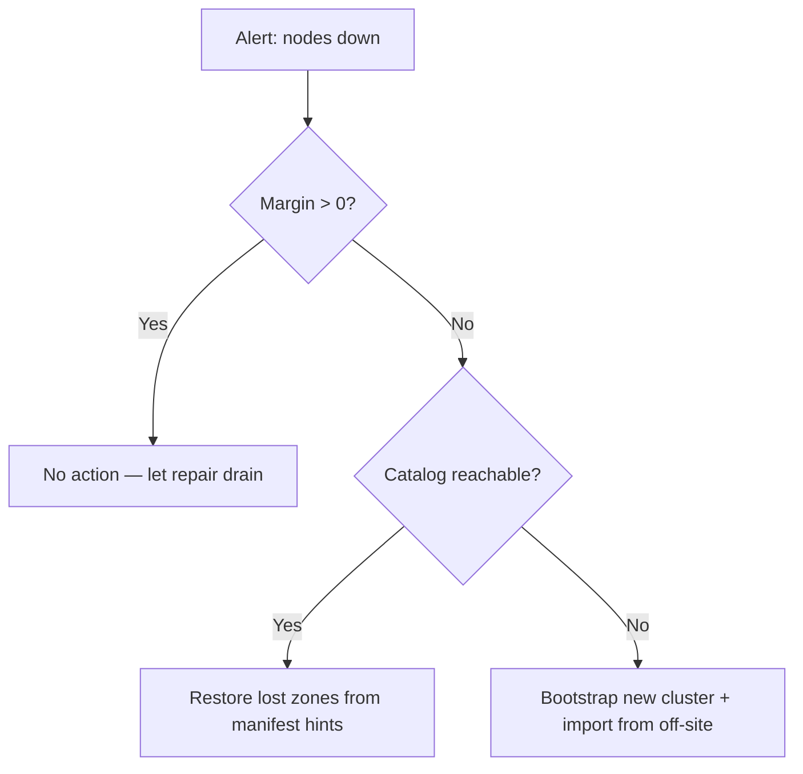

# Betriebshandbuch

Dieses Handbuch beschreibt, wie ein holofs-Cluster in der Produktion
**deployt**, **überwacht**, **gesichert**, **wiederhergestellt** und in
seiner **Kapazität geplant** wird.

## Inhalt

1. [Deployment-Topologien](#1-deployment-topologien)
2. [Bare-Metal-Installation](#2-bare-metal-installation)
3. [Docker / Compose](#3-docker--compose)
4. [Kubernetes via Helm](#4-kubernetes-via-helm)
5. [Konfigurationsreferenz](#5-konfigurationsreferenz)
6. [Monitoring & Alerting](#6-monitoring--alerting)
7. [Kapazitätsplanung](#7-kapazitätsplanung)
8. [Backup & Wiederherstellung](#8-backup--wiederherstellung)
9. [Disaster Recovery](#9-disaster-recovery)
10. [Day-2-Prozeduren](#10-day-2-prozeduren)

---

## 1. Deployment-Topologien

| Topologie        | Anwendungsfall                                          | Vorteile                              | Nachteile                              |
|------------------|---------------------------------------------------------|---------------------------------------|----------------------------------------|
| Eingebettet      | Dev, Demo, Einzelhost-Evaluierung                       | Ein Binary, keine Orchestrierung      | Keine maschinen-basierte Fehlertoleranz |
| Multi-Prozess    | Einzelhost, isolierte Prozessgrenzen                    | Nodes unabhängig neu starten          | Immer noch Single Point of Failure (Host) |
| Multi-Host       | Produktion: 40 Nodes über 5 Zonen × 8 Hosts             | Echte Dauerhaftigkeit, Zonen-Failover | Erfordert Netzwerk, Monitoring, Ops   |
| Kubernetes       | Cloud / On-Prem mit k8s                                 | Helm-basiert, deklarativ              | StatefulSets sind schwerer als Stateless |

**Empfohlenes Produktionsziel:** ≥ 5 Zonen × ≥ 4 Hosts × 1–2 Nodes pro
Host. Das überlebt **einen beliebigen kompletten Zonenausfall** plus
gleichzeitige Einzelnode-Ausfälle in den übrigen Zonen (siehe
[theory.md §3](./theory.md#4-prioritätsschichten-und-holografische-degradation)).

---

## 2. Bare-Metal-Installation

### 2.1. Voraussetzungen

- Linux (Kernel ≥ 5.10), macOS oder Windows Server.
- Minimum 2 GB RAM und 10 GB Disk pro Node; 8 GB / 100 GB empfohlen.
- Offene TCP-Ports: Gateway (`8787`) und Node-Ports (standardmäßig
  9100–9139).
- Ein Benutzerkonto (z. B. `holofs`) mit Schreibzugriff auf das
  Datenverzeichnis.

### 2.2. Aus dem Quellcode bauen

```sh
# Pinned MSRV: 1.81
rustup install 1.81.0
cargo build --release --workspace
```

Erzeugte Binaries unter `target/release/`:

| Binary           | Zweck                                          |
|------------------|------------------------------------------------|
| `holofs`         | Haupt-Multi-Command-CLI                        |
| `holofs-node`    | Einzelner Node-Daemon                          |
| `holofs-web`     | HTTP-Gateway (axum + Leptos SSR)               |
| `holofs-admin`   | Cluster-Admin-Operationen (Whitelist, Ban)     |
| `holofs-bench`   | Benchmarks                                     |
| `holofs-inspect` | Manifest- / Shard-Inspektion                   |
| `holofs-cluster` | Alles-in-einem (eingebettete N Nodes + Gateway) |
| `holofs-fs`      | Lokale Dateisystem-Helfer                      |

### 2.3. Whitelist (in der Produktion erforderlich)

```sh
# 1. Generate an admin keypair (kept offline; only the pubkey is distributed).
holofs-admin gen-key admin.key
holofs-admin pubkey admin.key   # prints ADMIN_PUBKEY_HEX

# 2. Boot each node once so it materialises its own identity.key and
#    prints its pubkey — collect these hex strings.
holofs-node 10.0.1.10:9100 --storage /var/lib/holofs/node00
# → holofs-node addr=10.0.1.10:9100 pubkey=NODE0_PUBKEY_HEX

# 3. Sign the whitelist. Each --node is ADDR=PUBKEY_HEX:ZONE.
holofs-admin sign-whitelist \
    --admin admin.key \
    --node 10.0.1.10:9100=NODE0_PUBKEY_HEX:0 \
    --node 10.0.1.11:9100=NODE1_PUBKEY_HEX:0 \
    --node 10.0.2.10:9100=NODE2_PUBKEY_HEX:1 \
    --out whitelist.holofs

# 4. Distribute whitelist.holofs to every node + gateway. Verify with:
holofs-admin verify-whitelist whitelist.holofs --admin-pubkey ADMIN_PUBKEY_HEX
holofs-admin show-whitelist   whitelist.holofs
```

Wire-Format: `HOLOFSW1` (siehe [api.md §3.4](./api.md#34-whitelist-holofsw1)).

### 2.4. TLS für das Wire-Protokoll (`--tls`, `--mtls`)

Das binäre Gateway↔Node-Protokoll kann mit rustls verschlüsselt werden.
Zwei Opt-in-Flags steuern das Verhalten:

| Flag       | Effekt |
|------------|--------|
| `--tls`    | Wire-Frames verschlüsseln. Server-Zertifikat wird vom Client verifiziert. |
| `--mtls`   | Impliziert `--tls`. Server verlangt und verifiziert zusätzlich ein Client-Zertifikat. |

**Eingebetteter Modus (ohne `--whitelist`):** das Binary generiert beim
Start eine selbstsignierte CA + Leaf-Zertifikate. Nützlich für Dev,
Demos, Einzelhost-Cluster. Die CA lebt nur im RAM und wird bei jedem
Neustart neu erzeugt — Clients, die Zertifikate cachen, sehen bei jedem
Boot frische Aussteller.

**Verteilter Modus (`--whitelist`):** vorab ausgestellte PEMs auf der
Kommandozeile mitgeben. Erzeuge sie mit `openssl` oder deiner
bestehenden PKI:

```sh
# Issue one CA + one cert per host (script omitted — use your PKI).
holofs-web \
  --whitelist cluster.wl \
  --admin-pubkey "$(holofs-admin pubkey admin.key)" \
  --tls --mtls \
  --tls-ca-cert /etc/holofs/ca.crt \
  --tls-cert   /etc/holofs/gateway.crt \
  --tls-key    /etc/holofs/gateway.key
```

Das entsprechende Node-Kommando greift sein eigenes Leaf auf — siehe die
systemd-Unit in §2.5 für die Env-Var-Form.

Die Zertifikatsdateien müssen erfüllen:
- Leaf-Cert-SANs müssen jeden `addr:port`-Host abdecken, mit dem sich
  das Gateway verbinden wird (DNS-Name oder IP-Literal).
- Das CA-Zertifikat ist auf beiden Seiten der Vertrauensanker —
  dieselbe Datei auf jedem Node und auf jedem Gateway.
- Unter `--mtls` präsentieren beide Seiten dieselbe Art Leaf, signiert
  von dieser CA. Füge ein separates „Gateway"-Zertifikat hinzu, wenn du
  eigene CN-Werte möchtest.

### 2.5. systemd-Service

`/etc/systemd/system/holofs-node@.service`:

```ini
[Unit]
Description=holofs node %i
After=network.target

[Service]
Type=simple
User=holofs
Group=holofs
Environment=HOLOFS_STORAGE_DIR=/var/lib/holofs/node%i
ExecStart=/usr/local/bin/holofs-node 0.0.0.0:91%i --storage /var/lib/holofs/node%i
Restart=on-failure
RestartSec=5s
LimitNOFILE=65536

[Install]
WantedBy=multi-user.target
```

Dann `systemctl enable --now holofs-node@00 holofs-node@01 …`.

---

## 3. Docker / Compose

### 3.1. Image ziehen

```sh
docker pull ghcr.io/holofs/holofs:1.0.0
```

Die Dockerfile ist mehrstufig: rust:1.81-slim-bookworm → debian:bookworm-slim.
Das Runtime-Image läuft als **non-root uid 10001**, mit `tini` als PID
1.

### 3.2. Einzelhost-Cluster (eingebettet)

```sh
docker run -d \
  --name holofs \
  -p 8787:8787 \
  -v /srv/holofs:/data \
  ghcr.io/holofs/holofs:1.0.0
```

### 3.3. Multi-Prozess via Compose

```yaml
services:
  holofs:
    image: ghcr.io/holofs/holofs:1.0.0
    volumes: ["/srv/holofs:/data"]
    environment:
      HOLOFS_LOG_FORMAT: json
      HOLOFS_ENABLE_EMBED: "1"
      HOLOFS_ENABLE_VERSIONS: "1"
    ports: ["8787:8787"]
```

---

## 4. Kubernetes via Helm

Das Helm-Chart liegt unter `deploy/helm/holofs/`.

```sh
helm install holofs ./deploy/helm/holofs \
  --set nodeCount=40 \
  --set persistence.size=50Gi \
  --set ingress.enabled=true \
  --set ingress.hosts[0].host=holofs.example.com
```

**Schlüsselressourcen** (siehe `deploy/helm/holofs/templates/`):

- `StatefulSet` für Nodes — stabile Netzwerk-IDs, PVC pro Replica.
- `Service` (`ClusterIP`) für das Gateway.
- `Ingress` (optional) für externes HTTPS.

**Zone-Awareness:** `values.yaml` exponiert `nodeAffinity` und
`topologySpreadConstraints`. Bilde dein k8s-Zonen-Label (z. B.
`topology.kubernetes.io/zone`) via
`HOLOFS_ZONE_FROM_LABEL=topology.kubernetes.io/zone` auf holofs-Zonen ab
(automatisch aus der `Downward API` abgeleitet).

**Probes:**

```yaml
livenessProbe:  { httpGet: { path: /,        port: http }, periodSeconds: 30 }
readinessProbe: { httpGet: { path: /health,  port: http }, periodSeconds: 10 }
```

**Security Context:** läuft als `uid 10001`,
`readOnlyRootFilesystem: true`, `capabilities.drop: [ALL]`.

---

## 5. Konfigurationsreferenz

Alle Konfigurationen erfolgen per Env-Var (CLI-Flags werden ebenfalls
akzeptiert; Flags gewinnen).

### 5.1. Gateway (`holofs-web`)

| Variable                    | Default                   | Beschreibung                                     |
|-----------------------------|---------------------------|--------------------------------------------------|
| `HOLOFS_STORAGE_DIR`        | `./holofs-data`           | Storage-Wurzel für Shards, Katalog, Manifests.   |
| `HOLOFS_CATALOG`            | `<storage>/catalog.bin`   | Katalogdatei-Pfad überschreiben.                 |
| `HOLOFS_CONFIG`             | (unset)                   | Pfad zu einer TOML-Konfig (§5.7).                |
| `HOLOFS_LOG`                | `info,holofs_web=debug`   | `tracing`-Filter-Spec.                           |
| `HOLOFS_LOG_FORMAT`         | `text`                    | `text` \| `json` (Produktion: `json`).           |
| `LEPTOS_SITE_ADDR`          | `127.0.0.1:8787`          | HTTP-Listen-Adresse (`--addr`).                  |
| `HOLOFS_METRICS_LISTEN`     | (unset)                   | Optionale separate Prometheus-Listen-Adresse.    |
| `HOLOFS_SEED_PHOTO`         | (unset)                   | Pfad zu einer PNG, die `photo.png` beim ersten Start seedet. |
| `HOLOFS_NO_SEED`            | `false`                   | Den Zwei-PNG-Demo-Seed auf leerem Katalog überspringen. |

Jede Variable in dieser Tabelle hat ein passendes CLI-Flag
(`--storage`, `--log`, `--addr` usw.) — `holofs-web --help` liefert die
kanonische Liste. Flags haben Vorrang vor Env-Vars.

### 5.2. Standalone `holofs-node`

Der Standalone-Node-Daemon nimmt nur positionale Argumente und liest
**keine** `HOLOFS_*` Env-Vars — bewusst minimal gehalten, damit
dasselbe Binary unter systemd, Docker oder von Hand gestartet
funktioniert.

```text
holofs-node [ADDR] [--storage DIR]
```

`ADDR` defaultet auf `127.0.0.1:5000`. `--storage DIR` schaltet auf
persistente Identity + Shards; ohne läuft der Node im Speicher und
erzeugt seinen Pubkey bei jedem Start neu (nur Dev/Demo).

### 5.3. Verteiltes Gateway (Whitelist + TLS)

| Variable                    | Default        | Beschreibung                                     |
|-----------------------------|----------------|--------------------------------------------------|
| `HOLOFS_WHITELIST`          | —              | Pfad zur signierten Whitelist (§2.3). Schaltet das Binary in den verteilten Modus. |
| `HOLOFS_ADMIN_PUBKEY`       | —              | 64-Zeichen-Hex des Admin-Pubkey, der die Whitelist signiert hat. |
| `HOLOFS_TLS`                | (aus)          | Wire-Protokoll (Gateway↔Nodes) mit rustls verschlüsseln. Eingebetteter Modus erzeugt automatisch eine selbstsignierte CA. |
| `HOLOFS_MTLS`               | (aus)          | Impliziert `HOLOFS_TLS=1`. Server verlangt und verifiziert außerdem ein Client-Zertifikat. |
| `HOLOFS_TLS_CERT`           | —              | Verteilter Modus: PEM-Leaf-Zertifikatspfad.      |
| `HOLOFS_TLS_KEY`            | —              | Verteilter Modus: passender PEM-Key-Pfad.        |
| `HOLOFS_TLS_CA_CERT`        | —              | Verteilter Modus: PEM-CA-Vertrauensanker-Pfad.   |

### 5.4. Eingebetteter Cluster

Größen der eingebetteten Topologie (`holofs-web` ohne `--whitelist`)
sind Compile-Time-Konstanten: `N_NODES = 40`, `NLAYERS = 4`, `K = 16`,
`LEVELS = 3`. Nur der Basisport und das Seed-Verhalten sind zur
Laufzeit einstellbar.

| Variable                    | Default | Beschreibung                                     |
|-----------------------------|---------|--------------------------------------------------|
| `HOLOFS_EMBED_BASE_PORT`    | `9100`  | Stabiler Basisport für die In-Prozess-Nodes; jeder Node bindet `base + idx`. Setzen, um Ephemeral-Port-Churn zu vermeiden. |
| `HOLOFS_NO_SEED`            | `false` | Den Zwei-PNG-Demo-Seed auf einem leeren Katalog überspringen. Setze auf `true`, wenn du aus einem bekannten Beispielbaum neu hochlädst, damit der Seed nicht mit deinen Daten kollidiert. |
| `HOLOFS_W` / `HOLOFS_H`     | `512`   | Frame-Dimensionen (beide müssen positive Vielfache von `2^LEVELS = 8` sein). |

### 5.5. Reliability

| Variable                    | Default | Beschreibung                                             |
|-----------------------------|---------|----------------------------------------------------------|
| `HOLOFS_RPC_TIMEOUT_MS`     | `8000`  | Per-RPC-Gesamt-Budget (`tokio::time::timeout`). `0` deaktiviert den Cap; das OS-Level-TCP-Timeout (60–75 s) ist dann der einzige Stopp. |
| `HOLOFS_SCRUB_INTERVAL`     | `600`   | Hintergrund-Shard-Scrub-Periode (Sekunden). `0` deaktiviert. Scrubs gehen den Katalog durch, vergleichen `list_node_hashes` mit `place_shard` und reparieren die Mismatches, bevor Nutzer sie treffen. |
| `HOLOFS_VERSIONS_KEEP_LAST` | `0`     | Per-Name-Versionshistorien-Cap. Verwirft älteste Archive bei jedem PUT. `0` = unbegrenzt (manuelles `/api/versions/delete` ist dann der einzige Weg, Shards zurückzugewinnen). Erfordert `--enable-versions`. |
| `HOLOFS_POOL_PER_NODE`      | `8`     | Max. Idle-gepoolte Wire-Verbindungen pro Node-Adresse.   |
| `HOLOFS_POOL_IDLE_SECS`     | `60`    | Gepoolte Einträge, die länger als dies idle sind, bei `acquire` verwerfen. |
| `HOLOFS_POOL_DISABLE`       | `false` | Keepalive-Pool umgehen — jeder RPC wählt frisch. Nützlich beim Jagen von Wire-Level-Bugs. |

### 5.5.c. Per-IP-Rate-Limit

Ergänzt die globalen Backpressure-Caps: die Caps verhindern, dass der
Prozess bei irgendeinem Burst explodiert — diese Schicht verhindert,
dass ein einzelner sich fehlverhaltender Client jeden anderen Aufrufer
aushungert. Beide gelten für die MEDIUM- (Decode / PUT / Dir-Ops) und
LONG- (Search / Spotlight / GC) Buckets; SHORT- und Streaming-Endpunkte
bleiben unbegrenzt.

| Variable                        | Default   | Beschreibung                                             |
|---------------------------------|-----------|----------------------------------------------------------|
| `HOLOFS_RATE_LIMIT_RPS_PER_IP`  | `0`       | Token-Bucket-Refill-Rate pro Client-IP. Null deaktiviert die Schicht vollständig. |
| `HOLOFS_RATE_LIMIT_BURST`       | `2 × rps` | Max. Tokens, die ein Bucket hält. Bei leerem Bucket antwortet der Request mit 429 und `Retry-After: 1`. |
| `HOLOFS_RATE_LIMIT_IDLE_SECS`   | `300`     | Idle-Eviction-Schwelle für die Per-IP-Map (beschränkter Speicher bei stark rotierenden Client-Populationen). |

**Client-IP-Quelle.** Hinter einem Reverse Proxy liest die Middleware
den ersten Hop von `X-Forwarded-For`. Direkte Verbindungen nutzen
`ConnectInfo<SocketAddr>` aus `into_make_service_with_connect_info`.
Keins vorhanden → gemeinsamer `0.0.0.0`-Bucket, damit laute Hosts
keinen Per-Verbindungs-Freipass bekommen.

**Metrik.** `holofs_rate_limit_rejected_total` zählt jede 429-Antwort.
Andauernde Nicht-Null-Rate deutet entweder auf einen missbräuchlichen
Client (untersuchen) oder auf einen unter-provisionierten Cap
(`rate_limit_rps_per_ip` erhöhen).

### 5.5.b. Streaming-PUT

| Variable                    | Default   | Beschreibung                                             |
|-----------------------------|-----------|----------------------------------------------------------|
| `HOLOFS_UPLOAD_MAX_SIZE`    | `1 GiB`   | Per-Request-Body-Cap für `PUT /*path`. Der Body streamt direkt nach `<storage>/uploads/upload-<pid>-<counter>.tmp` (konstanter RAM unabhängig von Client-Geschwindigkeit / Body-Größe) und wird kurz vor `Gateway::ingest_bytes` in einen `Vec<u8>` zurückgelesen. Bodys, die den Cap überschreiten, geben 413 Payload Too Large zurück; das Tempfile wird auf jedem Exit-Pfad gelöscht. |

Streaming hält das Gateway-RSS-Delta durch den Copy-Buffer (~64 KiB)
begrenzt statt durch die Upload-Rate des Clients — ein langsamer Client
auf einem 200-MiB-Upload pinnt nicht länger 200 MiB Gateway-Speicher
für die Dauer fest. Das RSS steigt beim Ingest immer noch kurz auf
Body-Größe, weil der RLNC-/DWT-Codec `&[u8]` erwartet; ein vollständig
streamender Ingest ist außer Reichweite, bis der Codec ihn unterstützt.

### 5.6. Reliability-Schicht

Jeder Knopf unten hat einen sicheren Default; das Gateway bootet
erfolgreich, ohne dass einer davon gesetzt ist.

| Variable                              | Default   | Beschreibung                                             |
|---------------------------------------|-----------|----------------------------------------------------------|
| `HOLOFS_MEDIUM_CONCURRENCY`           | `64`      | Permits für den MEDIUM-Route-Bucket (Decodes, PUT, Dir-Ops). Bei Sättigung liefert die Handler-Middleware 503 mit diagnostischem Body zurück, statt axum-Tasks aufzustapeln. Tune gegen `holofs_backpressure_permits_available{bucket="medium"}`. |
| `HOLOFS_LONG_CONCURRENCY`             | `8`       | Permits für den LONG-Bucket (semantische Suche, Spotlight, `/api/gc`, `/api/embed_all`, Fingerabdruck-Scans). |
| `HOLOFS_REPUTATION_PERSIST_INTERVAL`  | `30`      | Wie oft der gemeinsame `Reputation`-Zustand nach `<storage>/reputation.bin` gesnapshottet wird. Der Bootstrap lädt ihn beim nächsten Start zurück; ein `n_nodes`-Mismatch oder eine korrupte Datei fällt still auf eine frische Tabelle zurück. Ein finaler Snapshot wird auch bei SIGTERM geschrieben. |
| `HOLOFS_ADMIN_TOKEN`                  | _(unset)_ | Wenn gesetzt, erfordern `POST /admin/node` und `POST /api/gc` `Authorization: Bearer <token>`. Fehlend/falsch → 401. |
| `HOLOFS_ADMIN_UNAUTHENTICATED`        | _(unset)_ | Dev-Override: auf `1` setzen, um die Admin-Oberfläche offen zu lassen, wenn `HOLOFS_ADMIN_TOKEN` nicht gesetzt ist. Loggt beim Start ein WARN. Ist keine der beiden Vars gesetzt, ist die Admin-Oberfläche deaktiviert (403). |

Timeouts sind bewusst pro Bucket hart kodiert (SHORT 10 s, MEDIUM
60 s, LONG 300 s); Streaming-Endpunkte (SSE, multipart/x-mixed-replace)
+ `/mcp` sind bewusst ohne Budget. Abgelaufene Handler tauchen als
`504 Gateway Timeout` auf und inkrementieren
`holofs_handler_timeouts_total{bucket=…}`.

### 5.7. Optionale Features

| Variable                    | Default | Beschreibung                                             |
|-----------------------------|---------|----------------------------------------------------------|
| `HOLOFS_ENABLE_VERSIONS`    | `false` | Spiegel von `--enable-versions`. Archiviert jedes PUT-Replace als Seitendatei unter `<storage>/versions/<sanitized>/v…bin`. |
| `HOLOFS_ENABLE_EMBED`       | `false` | Spiegel von `--enable-embed`. Lädt das CLIP-multilingual-Modell beim ersten PUT oder ersten `/api/search`, pflegt anschließend `embeddings.bin`. |
| `HOLOFS_MCP_TOKEN`          | —       | Wenn gesetzt, erfordert der `/mcp`-Endpunkt `Authorization: Bearer <token>` UND aktiviert die Write-Tools. Ohne die Variable bleibt der Endpunkt offen und read-only. |

### 5.8. TOML-Konfigurationsdatei

Jede oben genannte Env-Var (`HOLOFS_*` und `LEPTOS_SITE_ADDR`) ist auch
über eine einzelne TOML-Config-Datei einstellbar, die per
`--config /path/to/holofs.toml` oder der Env-Var `HOLOFS_CONFIG`
übergeben wird. Eine kommentierte Referenz-Config liegt unter
[`deploy/holofs.example.toml`](../../deploy/holofs.example.toml).

Prioritätsleiter (höchste gewinnt):

1. CLI-Flag (`--medium-concurrency 128`)
2. Env-Var (`HOLOFS_MEDIUM_CONCURRENCY=128`)
3. Wert aus der TOML-Datei (`[reliability] medium_concurrency = 128`)
4. Kompilierzeit-Default

**Beispiel**:

```toml
[server]
addr = "0.0.0.0:8787"
storage = "/var/lib/holofs"
log_format = "json"

[tls]
enabled = true
mtls = true
cert = "/etc/holofs/node.crt"
key = "/etc/holofs/node.key"
ca_cert = "/etc/holofs/ca.crt"

[reliability]
medium_concurrency = 128
long_concurrency = 16
scrub_interval_secs = 300

[admin]
# Inline token OR reference a file (recommended for secrets).
token_file = "/etc/holofs/admin.token"
```

**Secrets.** `[admin] token` und `[mcp] token` akzeptieren entweder
einen Inline-String oder einen `token_file`-Pfad, der auf eine Datei
zeigt, deren erste nicht-leere Zeile das Token ist. Für die Produktion
`token_file` mit Modus `0400` und Root-Ownership bevorzugen, damit das
Token nicht in der Git-Historie / im gebündelten Helm-Chart sichtbar
ist.

**Unbekannte Felder**. TOML nutzt `deny_unknown_fields` zur Parse-Zeit
— ein Tippfehler in `medium_concurency` (fehlendes „r") schlägt beim
Start lautstark fehl, mit dem exakten Schlüsselnamen im Fehler. Das ist
Absicht; ein stiller Fallback würde den Zweck der Datei zunichte
machen.

### 5.9. At-Rest-Shard-Verschlüsselung

Mit `HOLOFS_AT_REST_ENC=1` aktivieren (oder `[security]
at_rest_encryption = true` im TOML). Ist sie an, wird jede auf Disk
geschriebene Shard-Datei mit AES-256-GCM versiegelt. Der Header bleibt
im Klartext (damit `Store::open` weiterhin ohne Schlüssel indizieren
kann), aber die Koeffizienten + der codierte Chunk-Payload sind
Ciphertext.

**Key-Management.** Der 32-Byte-AES-Key wird beim Start aus dem
Identity-Seed des Nodes via HKDF-SHA256 abgeleitet
(`salt = "holofs-shard-salt-v1"`, `info = "holofs-shard-key-v1"`).
Kein neues Geheimnis zum Rotieren — der Verlust von `identity.key`
verliert bereits die Identität des Nodes. Der Schlüssel bleibt für die
Lebensdauer des Prozesses im RAM; Root auf einem laufenden Node kann
über einen legitimen Audit-Pfad Klartext lesen.

**Wire-Format.** Zwei Shard-Magics koexistieren:

| Magic       | Bedeutung                                                    |
|-------------|--------------------------------------------------------------|
| `HOLOFSS1`  | Klartext. Von jeder Version gelesen.                         |
| `HOLOFSS2`  | Versiegelt. `[8 B magic][18 B header][12 B nonce][ct+tag]`.  |

Der 18-Byte-Header ist AAD zum GCM-Tag, sodass jede nachträgliche
Header-Umschreibung (object_id, channel, layer, Längen) den Shard beim
Entschlüsseln invalidiert. Lesevorgänge schnüffeln die ersten 8 Bytes
und dispatchen — gemischte v1- + v2-Verzeichnisse werden unterstützt,
sodass das Aktivieren auf einem bestehenden Store nur *neue*
Schreibvorgänge versiegelt. Ein vollständiger Neu-Verschlüsselungs-Pass
liegt außerhalb des Umfangs; die empfohlene Migration ist, einen
frischen Node mit frischer Identität zu starten und den
Auto-Repair-Pass Shards auf ihn rebalancen zu lassen.

**Bedrohungsmodell.** Im Umfang: ein Angreifer schnappt sich die
Shard-Dateien von einem heruntergefahrenen Node (Backup-Leak,
außer Betrieb genommener Datenträger, RAID-Rebuild hat das alte
Laufwerk lesbar gelassen). Außer Umfang: Root auf einem laufenden
Node — sobald der abgeleitete Schlüssel im RAM ist, produziert
`read_shard_file` Klartext für legitime Audits.

---

## 6. Monitoring & Alerting

### 6.1. Metrik-Endpunkt

Das Gateway exponiert `GET /metrics` im Prometheus-Text-Expositions-
Format (`text/plain; version=0.0.4`). Pull-basierte Gauges, gespeist
aus `Gateway::api_stats` + Admin-Kill-Snapshot plus
Reliability-Zähler.

| Metrik                                       | Typ     | Labels                          | Bedeutung |
|----------------------------------------------|---------|---------------------------------|-----------|
| `holofs_nodes_total`                         | gauge   | —                               | Nodes in der Topologie |
| `holofs_nodes_live`                          | gauge   | —                               | Nodes, die nicht admin-deaktiviert sind |
| `holofs_objects_total`                       | gauge   | `kind` (image/audio/text/opaque/directory) | Katalog-Größe nach Art |
| `holofs_shards_total`                        | gauge   | —                               | Geplante Shards über den Katalog |
| `holofs_shards_unique`                       | gauge   | —                               | Verschiedene Shard-Hashes |
| `holofs_dedup_savings_pct`                   | gauge   | —                               | `(1 − unique/total) × 100` |
| `holofs_bytes_total`                         | gauge   | —                               | Ungefähre gespeicherte Bytes |
| `holofs_node_admin_killed`                   | gauge   | `node`, `addr`, `zone`          | Per-Node-Admin-Kill-Flag |
| `holofs_auto_repairs_total`                  | counter | —                               | GETs, die den Retry-Arm von `decode_with_autorepair` ausgelöst haben |
| `holofs_auto_repair_failures_total`          | counter | —                               | Auto-Repair-Pässe, die selbst fehlschlugen |
| `holofs_scrub_runs_total`                    | counter | —                               | Abgeschlossene Hintergrund-Scrub-Ticks (`HOLOFS_SCRUB_INTERVAL`) |
| `holofs_scrub_repairs_total`                 | counter | —                               | Objekte, die der Scrub reparierte, *bevor* ein Nutzer sie traf |
| `holofs_catalog_persist_failures_total`      | counter | —                               | Atomare Katalog-Save-auf-Disk-Fehler. Nicht-Null = On-Disk-Zustand ist hinter dem Speicher; nächster Neustart verliert Schreibvorgänge. Sofort alarmieren. |
| `holofs_handler_timeouts_total`              | counter | `bucket` (short/medium/long)    | 504-Antworten, verursacht durch die Per-Bucket-Deadline. |
| `holofs_backpressure_rejected_total`         | counter | `bucket` (medium/long)          | 503-Antworten, verursacht durch das voll ausgelastete Semaphor. |
| `holofs_backpressure_permits_available`      | gauge   | `bucket` (medium/long)          | Noch freie Permits. Ständig auf 0 = unter-provisionierter Bucket; ständig auf Max = idle. |
| `holofs_supervised_task_restarts_total`      | counter | `task` (monitor/auditor/scrub)  | Supervised-Loop-Panics + unerwartete Exits. Jeder Nicht-Null-Wert markiert einen wiederholten Crash, den der Operator untersuchen sollte. |
| `holofs_admin_auth_failures_total`           | counter | `outcome` (missing/bad/disabled) | Admin-Bearer-Token-Ablehnungen aufgeschlüsselt nach Grund. `disabled` = Oberfläche abgelehnt, weil weder `HOLOFS_ADMIN_TOKEN` noch `HOLOFS_ADMIN_UNAUTHENTICATED` gesetzt ist. |

Ein gesunder Cluster hält die Self-Healing-Zähler auf null oder nahe
null; eine anhaltende Nicht-Null-Rate auf `auto_repair_failures_total`
ist das Operator-Alarmsignal, dass Placement- / Disk-Verluste über das
hinausgegangen sind, was die K-Schwelle absorbieren kann.

Die Reliability-Zähler (Persist-Fehler, Handler-Timeouts,
Backpressure-Ablehnungen, Supervised-Restarts, Admin-Auth-Fehler)
bilden zusammen das „Reliability-Alert-Dashboard" — jeder davon sollte
auf einem gut provisionierten Cluster mit konfiguriertem Token flach
bei null liegen. Siehe die Referenz-Alert-Regeln unten.

Zukünftige Releases werden Histogramme für Wire-RTT, Decode-Latenz und
Per-Objekt-Reputation hinzufügen (aktuell nur via `tracing`
protokolliert).

### 6.2. Referenz-Alert-Regeln

```yaml
groups:
- name: holofs
  rules:
  - alert: HolofsNodeDown
    expr: holofs_node_up == 0
    for: 5m
    annotations:
      summary: "holofs node {{ $labels.node }} is down"

  - alert: HolofsZoneDegraded
    expr: count by (zone) (holofs_node_up == 0) >= 2
    for: 10m
    annotations:
      summary: "zone {{ $labels.zone }} has ≥2 dead nodes (margin loss)"

  - alert: HolofsDiskFillingFast
    expr: predict_linear(holofs_bytes_stored_total[1h], 24*3600) > node_filesystem_size_bytes
    for: 30m
    annotations:
      summary: "node {{ $labels.node }} will fill within 24h"

  - alert: HolofsRepairFailing
    expr: rate(holofs_repair_jobs_total{result="failed"}[15m]) > 0.1
    for: 30m

  - alert: HolofsLowReputation
    expr: holofs_node_reputation < 0.5
    for: 1h
    annotations:
      summary: "node {{ $labels.node }} reputation collapsed (audit mismatches)"

  # N-series reliability alerts.

  - alert: HolofsCatalogPersistFailing
    expr: rate(holofs_catalog_persist_failures_total[10m]) > 0
    for: 5m
    annotations:
      summary: "gateway is failing to persist the catalog to disk"
      description: |
        holofs_catalog_persist_failures_total is climbing.
        Every increment = one 500 on a PUT/mkdir/rmdir/rename and one
        write that in-memory succeeded but on-disk didn't. Next
        restart will drop those changes. Check disk space + FS mount
        options on the gateway host.

  - alert: HolofsHandlerTimeouts
    expr: rate(holofs_handler_timeouts_total[15m]) > 0.05
    for: 15m
    annotations:
      summary: "handler bucket {{ $labels.bucket }} exceeding deadline"
      description: |
        More than one 504 every ~20 seconds. Slow cluster, slow disk,
        or the deadline is too tight for the traffic pattern.

  - alert: HolofsBackpressureSaturated
    expr: holofs_backpressure_permits_available == 0
    for: 5m
    annotations:
      summary: "bucket {{ $labels.bucket }} has zero permits available"
      description: |
        The MEDIUM/LONG semaphore is at 0 for 5 minutes straight.
        Either the cluster is genuinely overloaded (scale up nodes)
        or the cap is too low for the workload — bump the matching
        HOLOFS_*_CONCURRENCY env var.

  - alert: HolofsSupervisedTaskRestarting
    expr: rate(holofs_supervised_task_restarts_total[30m]) > 0
    for: 15m
    annotations:
      summary: "{{ $labels.task }} is crashing repeatedly"
      description: |
        The supervised background loop is panicking + being restarted
        by supervised_spawn. Read the gateway logs for the panic
        payload and file a bug.

  - alert: HolofsAdminAuthAttempts
    expr: rate(holofs_admin_auth_failures_total{outcome=~"missing|bad"}[10m]) > 0.1
    for: 10m
    annotations:
      summary: "admin surface seeing sustained 401s (possible probe)"
      description: |
        Someone is hitting /admin/node or /api/gc without a valid
        bearer. Missing = no Authorization header at all; bad = wrong
        token. If unexpected, treat as a probe.
```

### 6.3. Tracing

Wenn `HOLOFS_TELEMETRY_OTLP` gesetzt ist, exportiert das Gateway
OTLP/HTTP-Spans:

| Span-Name              | Nützliche Attribute                          |
|------------------------|----------------------------------------------|
| `gateway.put`          | `object.kind`, `bytes.in`, `shards.out`      |
| `gateway.get`          | `object.kind`, `layers`, `bytes.out`, `nodes_contacted` |
| `gateway.repair`       | `object_id`, `channel`, `layer`, `shards_recovered` |
| `wire.send`            | `op`, `target.node`, `bytes`                 |

### 6.4. Dashboards

Ein Referenz-Grafana-Dashboard-JSON liegt unter
`deploy/grafana/holofs.json`. Top-Panels: Ingest-Rate, Decode-P99 nach
Art, Dedup-%, Repair-Throughput, Per-Zone-Node-Availability-Heatmap.

---

## 7. Kapazitätsplanung

### 7.1. Storage-Overhead

Die Speicherkosten werden von der RLNC-Redundanz über die
Prioritätsschichten dominiert. Für ein Objekt der Payload-Größe `S`:

$$
\text{stored bytes} \approx S \cdot \sum_{\ell} R_\ell \cdot \frac{N_\ell}{K_\ell}
$$

Für die Default-Layer-Verhältnisse `R = [4.0, 2.5, 1.6, 1.15]` beträgt
der durchschnittliche Overhead ungefähr **9,25×** (unter
Berücksichtigung von Metadaten ~9,4×).

| Objektgröße | Auf dem Cluster gespeichert | Pro Node (40 Nodes) |
|-------------|-----------------------------|---------------------|
| 1 MB        | ~9,4 MB                     | ~235 KB             |
| 1 GB        | ~9,4 GB                     | ~235 MB             |
| 1 TB        | ~9,4 TB                     | ~235 GB             |

**Tune für günstigeren Speicher:** senke `R_0`
(Katastrophal-Verlust-Redundanz) auf `2.0` und `R_1..3` auf
`[1.5, 1.2, 1.05]` — Overhead fällt auf ~5,75×. Siehe
[theory.md §3](./theory.md#4-prioritätsschichten-und-holografische-degradation)
für den Survival-Margin-Trade-Off.

### 7.2. CPU-Planung

| Operation              | Kosten (relativ zu memcpy) | Bottleneck    |
|------------------------|----------------------------|---------------|
| GF(2⁸)-Multiplikation  | 4× memcpy (LUT)            | L1-Cache      |
| Haar 2D Forward        | 3× memcpy                  | RAM-Bandbreite |
| RLNC-Encode K=16, Payload 1024 B | 60× memcpy       | CPU           |
| SHA-256 über 1 MB      | 2× memcpy (mit SIMD)       | CPU           |

Ein moderner x86_64-Core hält ~150 MB/s RLNC-Encode für K=16. Multi-Core
skaliert linear, bis Disk-IO zum Bottleneck wird (~500 MB/s auf NVMe).

### 7.3. Netzwerkplanung

Wire-Bandbreite im schlimmsten Fall pro Put:

```
egress = payload × redundancy_factor × layer_count
       ≈ payload × 9.25
```

Für einen 100-MB-Upload emittiert das Gateway ~925 MB zum Node-Pool.
Plane **mindestens 1 Gbit/s** zwischen Gateway und Nodes.

### 7.4. Cluster richtig dimensionieren

| Eigenschaft               | Wähle nach                                    |
|---------------------------|-----------------------------------------------|
| `N_nodes`                 | ≥ 4 × `K`, damit RLNC Platzierungs-Slack hat  |
| `N_zones`                 | ≥ 3; 5 empfohlen für Beliebig-Eine-Zone-Verlust |
| `K`                       | 16 (Default) — Sweet Spot von CPU vs. Margin  |
| `redundancy_per_layer`    | passt zur gewünschten ≥ 5σ-Überlebensmarge    |

---

## 8. Backup & Wiederherstellung

### 8.1. Was auf Disk lebt

Pro Node (`HOLOFS_DATA_DIR`):

```
manifests/         per-object manifests (HOLOFSM6)
catalog/HOLOFSD1   the directory index (atomic write)
shards/aa/bb……    .shard files, content-addressed
identity/secret    Ed25519 private key
whitelist.holofs   admin-signed peer list
```

### 8.2. Backup-Modell

**holofs ist sein eigenes Backup** für jedes *einzelne* Objekt — der
Verlust eines Nodes löst RLNC-Reparatur von Geschwistern aus. Backup
zählt für:

1. **Katastrophaler Cluster-Verlust** (z. B. alle Zonen offline).
2. **Logische Korruption / versehentliches Löschen** (`Purge` ist
   irreversibel).
3. **Identitätsmaterial** (Ed25519-Keys + signierte Whitelist) — ohne
   diese können Ersatz-Nodes einem vertrauenswürdigen Cluster nicht
   wieder beitreten.

### 8.3. Empfohlener Backup-Plan

| Daten                | Frequenz            | Werkzeug                     | Wohin              |
|----------------------|---------------------|------------------------------|--------------------|
| Identität + Whitelist | Bei jeder Änderung | `restic`, `aws s3 sync`      | Verschlüsselt off-site |
| Katalog-Snapshot     | Stündlich           | `cp catalog/HOLOFSD1 → …`    | S3 / NFS / Band    |
| Shard-Dir            | Optional            | `restic` oder zfs-Snapshots  | Cold Storage       |

Ein periodisches `holofs-admin export <name>` rekonstruiert ein Objekt
in eine einzelne kanonische Datei und schreibt es in einen externen
Bucket. Dies ist der empfohlene Weg, um **spezifische hochwertige
Objekte** zu sichern.

### 8.4. Wiederherstellungs-Prozeduren

| Szenario                              | Prozedur |
|---------------------------------------|----------|
| Einzelne Node-Disk verloren           | Disk wischen; Node neu starten; Cluster repariert Shards automatisch. |
| Mehrere Nodes verloren, < Marge       | Keine Aktion nötig — RLNC-Decode toleriert es. |
| Katalog auf Gateway korrupt           | `catalog/HOLOFSD1` von einem Peer-Gateway oder dem neuesten stündlichen Backup kopieren; neu starten. |
| Ganzer Cluster verloren               | Neuen Cluster provisionieren; `holofs-admin import` je Off-Site-Export. |
| Whitelist-Key-Kompromittierung        | Neuen Admin-Key generieren; Whitelist neu signieren; Hot-Reload (siehe [§10.4](#104-whitelist-hot-reload)). |

---

## 9. Disaster Recovery

### 9.1. RTO- / RPO-Ziele

| Fehler                        | RTO       | RPO      | Auslöser                             |
|-------------------------------|-----------|----------|--------------------------------------|
| Einzelner Node                | < 1 min   | 0        | Auto (Monitor + Repair)              |
| Einzelne Zone (≤ ⅕ der Nodes) | < 5 min   | 0        | Auto (Marge weiterhin positiv)       |
| Zwei Zonen gleichzeitig       | < 1 h     | Stunden  | Manuell: neu provisionieren + importieren |
| Ganzer Cluster                | < 8 h     | ≤ 1 h    | Manuell: volle Wiederherstellung aus S3-Backups |

### 9.2. Entscheidungsbaum



### 9.3. Übungen

Quartalsweise durchführen. Vorgeschlagene Szenarien:

1. **Zonen-Kill-Übung** — `kubectl drain` aller Pods in einem Zonen-Label;
   sicherstellen, dass kein Objekt unerreichbar wird und die Reparatur
   in < 10 min abschließt.
2. **Cold-Restore-Übung** — auf einem frischen k8s-Cluster `<storage>/`
   aus dem Backup-Bucket wiederherstellen (`restic restore` / `rclone
   copy`), Gateway starten, `/api/stats` und einen Stichproben-GET
   prüfen; RTO messen.
3. **Key-Rotation-Übung** — neue Whitelist mit Admin-Key signieren,
   Hot-Reload ohne Downtime.

---

## 10. Day-2-Prozeduren

### 10.1. Einen Node hinzufügen

```sh
# 1. Neuen Node einmal starten, damit er seine identity anlegt und die
#    pubkey ausgibt. Storage-Verzeichnis muss leer sein.
holofs-node 10.0.3.10:9100 --storage /var/lib/holofs/node41
# → holofs-node addr=10.0.3.10:9100 pubkey=NEW_PUBKEY_HEX

# 2. Whitelist mit dem *vollständigen* neuen Node-Set neu signieren
#    (sign-whitelist erzeugt die Datei jedes Mal von Grund auf neu).
holofs-admin sign-whitelist \
  --admin admin.key \
  --node 10.0.1.10:9100=NODE0_PUBKEY_HEX:0 \
  ... \
  --node 10.0.3.10:9100=NEW_PUBKEY_HEX:4 \
  --out whitelist.holofs

# 3. whitelist.holofs an jeden Node + Gateway verteilen; SIGHUP schicken.
```

Der Katalog bleibt unverändert; künftige Platzierungen können den neuen
Node via HRW auswählen. Bestehende Objekte werden **nicht** automatisch
rebalanciert — der Hintergrund-Scrub (`HOLOFS_SCRUB_INTERVAL`) und die
Auto-Reparatur beim Lesen migrieren Shards nach und nach.

### 10.2. Einen Node entfernen (außer Betrieb nehmen)

Es gibt kein dediziertes `drain`-Kommando — außer Betrieb nehmen heißt:
Whitelist bearbeiten + Daemon stoppen; die Repair-Schleife des Clusters
holt die verlorenen Shards zurück.

```sh
# 1. Whitelist ohne den abgehenden Node neu signieren.
holofs-admin sign-whitelist \
  --admin admin.key \
  --node 10.0.1.11:9100=NODE1_PUBKEY_HEX:0 \
  ... \
  --out whitelist.holofs

# 2. An alle verbleibenden Nodes + Gateway verteilen + SIGHUP.
# 3. Beobachten, wie `holofs_repair_completed_total` steigt: der Scrub
#    verlegt die Shards des ausgeschiedenen Nodes auf die überlebenden.
# 4. Sobald /api/stats die Objekte vollständig repariert zeigt, den
#    alten Daemon herunterfahren.
systemctl stop holofs-node@10
```

### 10.3. Eine ausgefallene Disk ersetzen

1. `systemctl stop holofs-node@N`
2. Disk ersetzen, frisches Dateisystem an `HOLOFS_DATA_DIR` mounten.
3. Identitätsdateien (`identity/secret`, `whitelist.holofs`) aus dem
   Off-Site-Backup wiederherstellen — sie sind an die Adresse des
   Nodes gebunden, nicht an die Disk.
4. `systemctl start holofs-node@N` — der Cluster füllt die Disk via
   Audit-getriebene Reparatur innerhalb von Minuten bis Stunden, je
   nach Größe, wieder auf.

### 10.4. Whitelist-Hot-Reload

```sh
# Drop new whitelist file into place
cp whitelist.holofs.new /etc/holofs/whitelist.holofs

# Signal all daemons
killall -SIGHUP holofs-node holofs-web
```

Daemons verifizieren die Admin-Signatur, bevor sie die neue Liste
einwechseln. Eine schlechte Signatur wird geloggt und die alte Liste
beibehalten.

### 10.5. Rolling Upgrade

Holofs garantiert Wire-Protokoll-Kompatibilität innerhalb einer
Minor-Version (`1.x → 1.x+1` ist sicher). Für k8s:

```sh
helm upgrade holofs ./deploy/helm/holofs --set image.tag=1.0.0
```

Das StatefulSet rollt einen Pod nach dem anderen, wartet auf Readiness
und fährt fort. Während des Rollouts operiert der Cluster genau um
einen Node degradiert — deutlich innerhalb der Marge für jedes
Default-Sizing.

### 10.6. Health-Kommando-Cheatsheet

```sh
# Cluster-wide overview
curl -s http://gw:8787/api/stats | jq

# Per-node health (HTML in browser; JSON via accept header)
curl -s -H "accept: application/json" http://gw:8787/health

# Margin per (channel, layer) for one object
curl -s http://gw:8787/health/photo.png

# Inspect shard distribution
curl -s http://gw:8787/inspect/photo.png
```

Siehe [api.md](./api.md) für das vollständige Routen-Inventar.
