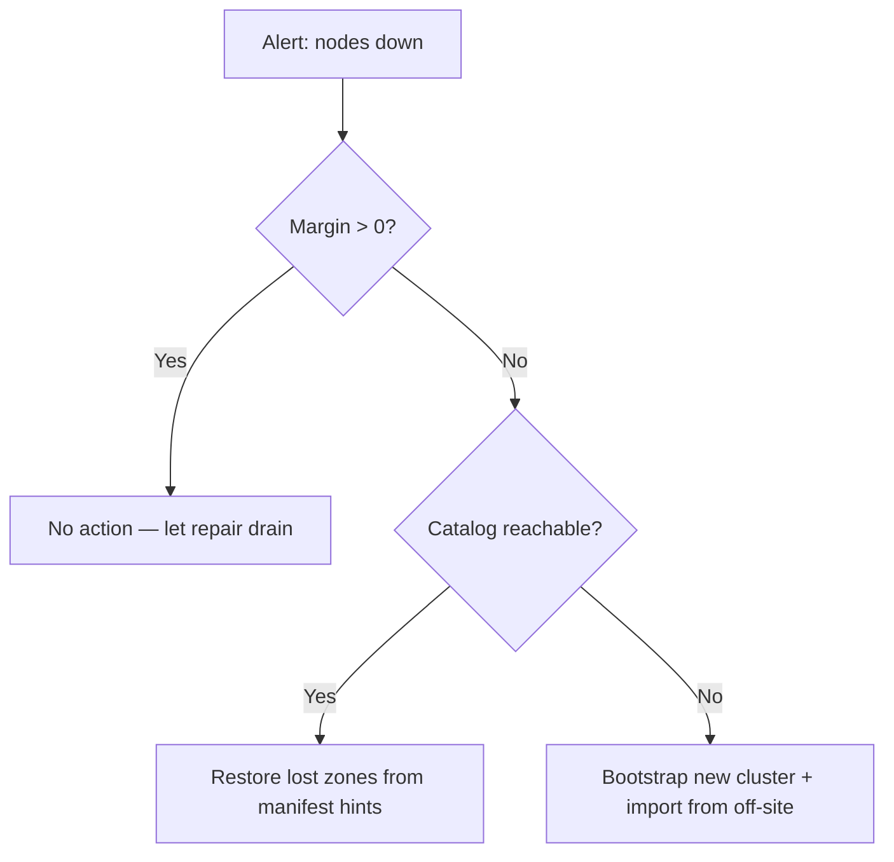

# Betriebshandbuch


> ⚠ **Translation may be stale.** This file was last synced before Stage 12-15 (versioning + deletion, HNSW-backed semantic search, /spotlight ROI, streaming /holo, /diff, /similar, auto-repair-on-read, background scrub, typed RPC layer with timeouts + NoLiveNodes panic-fix, per-folder inline upload). The English source under [../](../) is the canon for any new feature; the [Unreleased] block of [../../CHANGELOG.md](../../CHANGELOG.md) lists every delta this translation does not yet cover.


Dieses Handbuch beschreibt, wie ein holofs-Cluster in der Produktion
**bereitgestellt**, **überwacht**, **gesichert**, **wiederhergestellt** und
**kapazitätstechnisch geplant** wird.

## Inhalt

1. [Deployment-Topologien](#1-deployment-topologies)
2. [Bare-Metal-Installation](#2-bare-metal-install)
3. [Docker / Compose](#3-docker--compose)
4. [Kubernetes via Helm](#4-kubernetes-via-helm)
5. [Konfigurationsreferenz](#5-configuration-reference)
6. [Monitoring und Alarmierung](#6-monitoring--alerting)
7. [Kapazitätsplanung](#7-capacity-planning)
8. [Backup und Wiederherstellung](#8-backup--restore)
9. [Disaster Recovery](#9-disaster-recovery)
10. [Day-2-Prozeduren](#10-day-2-procedures)

---

## 1. Deployment-Topologien

| Topologie        | Anwendungsfall                                  | Vorteile                        | Nachteile                             |
|------------------|-------------------------------------------------|---------------------------------|---------------------------------------|
| Eingebettet      | Entwicklung, Demo, Evaluierung auf Einzel-Host  | Ein Binary, keine Orchestrierung | Keine Maschinen-Fehlertoleranz       |
| Multi-Prozess    | Einzel-Host, isolierte Prozessgrenzen           | nodes unabhängig neu starten    | Weiterhin Single Point of Failure (Host) |
| Multi-Host       | Produktion: 40 nodes über 5 Zonen × 8 Hosts     | Echte Dauerhaftigkeit, Zonen-Failover | Erfordert Netzwerk, Monitoring, Ops |
| Kubernetes       | Cloud / On-Prem mit k8s                         | Helm-basiert, deklarativ        | StatefulSets sind schwieriger als zustandslos |

**Empfohlenes Produktionsziel:** ≥ 5 Zonen × ≥ 4 Hosts × 1–2 nodes pro Host.
Dies übersteht **jeden vollständigen Ausfall einer Zone** plus gleichzeitige
einzelne node-Ausfälle in den verbleibenden Zonen (siehe
[theory.md §3](./theory.md#3-priority-layers)).

---

## 2. Bare-Metal-Installation

### 2.1. Voraussetzungen

- Linux (Kernel ≥ 5.10), macOS oder Windows Server.
- 2 GB RAM und 10 GB Disk pro node mindestens; 8 GB / 100 GB empfohlen.
- Offene TCP-Ports: gateway (`8787`) und node-Ports (9100–9139 standardmäßig).
- Ein Benutzerkonto (z. B. `holofs`) mit Schreibzugriff auf das Datenverzeichnis.

### 2.2. Aus dem Quellcode bauen

```sh
# Pinned MSRV: 1.75
rustup install 1.75.0
cargo build --release --workspace
```

Binaries, die unter `target/release/` erzeugt werden:

| Binary           | Zweck                                         |
|------------------|-----------------------------------------------|
| `holofs`         | Haupt-Multikommando-CLI                       |
| `holofs-node`    | Einzelner node-Daemon                         |
| `holofs-web`     | HTTP-gateway (axum + Leptos SSR)              |
| `holofs-admin`   | Cluster-Adminoperationen (whitelist, ban)     |
| `holofs-bench`   | Benchmarks                                    |
| `holofs-inspect` | Manifest- / Shard-Inspektion                  |
| `holofs-cluster` | Alles-in-einem (eingebettete N nodes + gateway) |
| `holofs-fs`      | Lokale Dateisystem-Helfer                     |

### 2.3. Whitelist (in der Produktion erforderlich)

```sh
# 1. Generate per-node Ed25519 keypairs
holofs-admin keygen --out keys/

# 2. Build whitelist
holofs-admin whitelist build \
    --node 10.0.1.10:9100 --pubkey keys/node1.pub --zone 0 \
    --node 10.0.1.11:9100 --pubkey keys/node2.pub --zone 1 \
    --node 10.0.2.10:9100 --pubkey keys/node3.pub --zone 2 \
    --admin-key keys/admin.priv \
    --out whitelist.holofs

# 3. Distribute whitelist.holofs to every node + gateway
```

Wire-Format: `HOLOFSW1` (siehe [api.md §3.4](./api.md#34-whitelist-holofsw1)).

### 2.4. TLS für das Wire-Protokoll (`--tls`, `--mtls`)

Das gateway↔node-Binärprotokoll kann mit rustls verschlüsselt werden (Stage 6).
Zwei optionale Flags steuern das Verhalten:

| Flag       | Wirkung |
|------------|---------|
| `--tls`    | Wire-Frames verschlüsseln. Server-Zertifikat wird vom Client verifiziert. |
| `--mtls`   | Impliziert `--tls`. Der Server fordert zusätzlich + verifiziert ein Client-Zertifikat. |

**Eingebetteter Modus (kein `--whitelist`):** das Binary erzeugt beim Start
eine selbst signierte CA + Leaf-Zertifikate. Nützlich für Entwicklung, Demos,
Single-Host-Cluster. Die CA liegt nur im RAM und wird bei jedem Neustart neu
erzeugt — Clients, die Zertifikate cachen, sehen bei jedem Boot frische
Aussteller.

**Verteilter Modus (`--whitelist`):** vorausgestellte PEMs auf der
Kommandozeile angeben. Erzeugen Sie diese mit `openssl` oder Ihrer
bestehenden PKI:

```sh
# Issue one CA + one cert per host (script omitted — use your PKI).
holofs-web \
  --whitelist cluster.wl \
  --admin-pubkey "$(holofs-admin pubkey admin.key)" \
  --tls --mtls \
  --tls-ca-cert /etc/holofs/ca.crt \
  --tls-cert   /etc/holofs/gateway.crt \
  --tls-key    /etc/holofs/gateway.key
```

Der entsprechende node-Befehl bezieht sein eigenes Leaf — siehe die
systemd-Unit in §2.5 für die Env-Var-Form.

Die Zertifikatsdateien müssen folgendes erfüllen:
- SANs des Leaf-Zertifikats müssen jeden `addr:port`-Host abdecken, mit dem
  das gateway sich verbindet (DNS-Name oder IP-Literal).
- Das CA-Zertifikat ist der Vertrauensanker auf beiden Seiten — dieselbe
  Datei auf jedem node und auf jedem gateway.
- Unter `--mtls` präsentieren beide Seiten dieselbe Art von Leaf, signiert
  von dieser CA. Fügen Sie ein separates "gateway"-Zertifikat hinzu, wenn
  Sie unterschiedliche CN-Werte wünschen.

### 2.5. systemd-Dienst

`/etc/systemd/system/holofs-node@.service`:

```ini
[Unit]
Description=holofs node %i
After=network.target

[Service]
Type=simple
User=holofs
Group=holofs
Environment=HOLOFS_DATA_DIR=/var/lib/holofs/node%i
Environment=HOLOFS_LISTEN=0.0.0.0:91%i
Environment=HOLOFS_WHITELIST=/etc/holofs/whitelist.holofs
Environment=HOLOFS_SECRET_KEY=/etc/holofs/keys/node%i.priv
# Stage 6: enable TLS on the wire protocol. Drop the next four lines for
# plain-TCP clusters; set HOLOFS_MTLS=1 for mutual auth.
Environment=HOLOFS_TLS=1
Environment=HOLOFS_TLS_CA_CERT=/etc/holofs/ca.crt
Environment=HOLOFS_TLS_CERT=/etc/holofs/node%i.crt
Environment=HOLOFS_TLS_KEY=/etc/holofs/node%i.key
ExecStart=/usr/local/bin/holofs-node
Restart=on-failure
RestartSec=5s
LimitNOFILE=65536

[Install]
WantedBy=multi-user.target
```

Dann `systemctl enable --now holofs-node@00 holofs-node@01 …`.

---

## 3. Docker / Compose

### 3.1. Image abrufen

```sh
docker pull ghcr.io/holofs/holofs:0.1.0
```

Das Dockerfile ist mehrstufig: rust:1.75-slim → debian:bookworm-slim. Das
Laufzeit-Image läuft als **non-root uid 10001**, mit `tini` als PID 1.

### 3.2. Single-Host-Cluster (eingebettet)

```sh
docker run -d \
  --name holofs \
  -p 8787:8787 \
  -v /srv/holofs:/var/lib/holofs \
  -e HOLOFS_N_NODES=40 \
  -e HOLOFS_DATA_DIR=/var/lib/holofs \
  ghcr.io/holofs/holofs:0.1.0 holofs-cluster
```

### 3.3. Multi-Prozess über Compose

```yaml
services:
  node-0: { ... environment: { HOLOFS_LISTEN: 0.0.0.0:9100, HOLOFS_ZONE: 0 } }
  node-1: { ... environment: { HOLOFS_LISTEN: 0.0.0.0:9101, HOLOFS_ZONE: 0 } }
  ...
  gateway:
    command: holofs-web
    environment:
      HOLOFS_NODES: node-0:9100,node-1:9101,...
      HOLOFS_WHITELIST: /etc/holofs/whitelist.holofs
    ports: ["8787:8787"]
    depends_on: [node-0, node-1, ...]
```

---

## 4. Kubernetes via Helm

Das Helm-Chart liegt unter `deploy/helm/holofs/`.

```sh
helm install holofs ./deploy/helm/holofs \
  --set nodeCount=40 \
  --set persistence.size=50Gi \
  --set ingress.enabled=true \
  --set ingress.hosts[0].host=holofs.example.com
```

**Schlüsselressourcen** (siehe `deploy/helm/holofs/templates/`):

- `StatefulSet` für nodes — stabile Netzwerk-IDs, PVC pro Replica.
- `Service` (`ClusterIP`) für das gateway.
- `Ingress` (optional) für externes HTTPS.

**Zonenbewusstsein:** `values.yaml` stellt `nodeAffinity` und
`topologySpreadConstraints` bereit. Mappen Sie Ihr k8s-Zonen-Label
(z. B. `topology.kubernetes.io/zone`) auf holofs-Zonen via
`HOLOFS_ZONE_FROM_LABEL=topology.kubernetes.io/zone` (automatisch abgeleitet
aus der `Downward API`).

**Probes:**

```yaml
livenessProbe:  { httpGet: { path: /,        port: http }, periodSeconds: 30 }
readinessProbe: { httpGet: { path: /health,  port: http }, periodSeconds: 10 }
```

**Security-Kontext:** läuft als `uid 10001`, `readOnlyRootFilesystem: true`,
`capabilities.drop: [ALL]`.

---

## 5. Konfigurationsreferenz

Die gesamte Konfiguration erfolgt über Env-Vars (CLI-Flags werden ebenfalls
akzeptiert; Flags gewinnen).

### 5.1. Allen Binaries gemeinsam

| Variable                    | Standard     | Beschreibung                                 |
|-----------------------------|--------------|----------------------------------------------|
| `HOLOFS_STORAGE_DIR`        | `./holofs-data` | Speicher-Root für shards, Katalog, manifests |
| `HOLOFS_LOG`                | `info,holofs_web=debug` | `tracing`-Filterspezifikation     |
| `HOLOFS_LOG_FORMAT`         | `text`       | `text` \| `json` (Produktion: `json`)         |
| `HOLOFS_TELEMETRY_OTLP`     | (aus)        | OTLP-Endpunkt, z. B. `http://otel:4317` (geplant) |
| `HOLOFS_METRICS_LISTEN`     | (nicht gesetzt) | Optionale separate Prometheus-Lauschadresse (Standard: auf Hauptport ausliefern) |

Jede Variable besitzt ein passendes CLI-Flag (`--storage`, `--log` usw.) —
führen Sie `holofs-web --help` für die vollständige Liste aus. Flags haben
Vorrang vor Env-Vars.

### 5.2. Node-spezifisch

| Variable                    | Standard       | Beschreibung                             |
|-----------------------------|----------------|------------------------------------------|
| `HOLOFS_LISTEN`             | `0.0.0.0:9100` | Wire-Protokoll-Bind-Adresse              |
| `HOLOFS_ZONE`               | `0`            | Zonen-ID (von zone-aware-Platzierung genutzt) |
| `HOLOFS_SECRET_KEY`         | —              | Pfad zum Ed25519-Geheimnis (32 Bytes)    |
| `HOLOFS_WHITELIST`          | —              | Pfad zur signierten whitelist            |
| `HOLOFS_MAX_DISK_GB`        | `unlimited`    | Put ablehnen, sobald überschritten       |

### 5.3. Gateway-spezifisch

| Variable                    | Standard       | Beschreibung                             |
|-----------------------------|----------------|------------------------------------------|
| `HOLOFS_NODES`              | —              | CSV von `addr:port` (initialer Bootstrap) |
| `HOLOFS_MONITOR_INTERVAL`   | `15`           | Health-Poll-Periode (Sekunden)           |
| `HOLOFS_AUDIT_INTERVAL`     | `30`           | Hintergrund-Audit-Periode (Sekunden)     |
| `HOLOFS_REPAIR_INTERVAL`    | `60`           | Hintergrund-Repair-Sweep                 |
| `HOLOFS_TLS`                | (aus)          | Wire-Protokoll verschlüsseln (gateway↔nodes) mit rustls. Eingebetteter Modus erzeugt automatisch eine selbst signierte CA. |
| `HOLOFS_MTLS`               | (aus)          | Impliziert `HOLOFS_TLS=1`. Server fordert zusätzlich + verifiziert ein Client-Zertifikat. |
| `HOLOFS_TLS_CERT`           | —              | Verteilter Modus: PEM-Leaf-Zertifikatspfad |
| `HOLOFS_TLS_KEY`            | —              | Verteilter Modus: zugehöriger PEM-Schlüsselpfad |
| `HOLOFS_TLS_CA_CERT`        | —              | Verteilter Modus: PEM-CA-Vertrauensanker-Pfad |
| `HOLOFS_PLACEMENT`          | `rendezvous`   | `roundrobin` \| `rendezvous` \| `rendezvous-zone` |

### 5.4. Eingebetteter Cluster

| Variable                    | Standard       | Beschreibung                             |
|-----------------------------|----------------|------------------------------------------|
| `HOLOFS_N_NODES`            | `40`           | Anzahl der In-Prozess-nodes              |
| `HOLOFS_EMBED_BASE_PORT`    | `9100`         | Stabiler Basis-Port (ephemeren Churn vermeiden) |
| `HOLOFS_ZONES`              | `5`            | Anzahl der zuzuweisenden Zonen           |

---

## 6. Monitoring und Alarmierung

### 6.1. Metrik-Endpunkt

Das gateway stellt `GET /metrics` im Prometheus-Text-Expositionsformat
(`text/plain; version=0.0.4`) bereit. Pull-basierte Gauges, die von
`Gateway::api_stats` + admin-kill-Snapshot stammen — keine Counter/Histogramme
in der ersten Version.

| Metrik                          | Typ   | Labels                       | Bedeutung |
|---------------------------------|-------|------------------------------|-----------|
| `holofs_nodes_total`            | gauge | —                            | nodes in der Topologie |
| `holofs_nodes_live`             | gauge | —                            | nodes nicht admin-deaktiviert |
| `holofs_objects_total`          | gauge | `kind` (image/audio/text/opaque) | Kataloggröße nach Art |
| `holofs_shards_total`           | gauge | —                            | geplante shards im Katalog |
| `holofs_shards_unique`          | gauge | —                            | unterschiedliche Shard-Hashes |
| `holofs_dedup_savings_pct`      | gauge | —                            | `(1 − unique/total) × 100` |
| `holofs_bytes_total`            | gauge | —                            | ungefähr gespeicherte Bytes |
| `holofs_node_admin_killed`      | gauge | `node`, `addr`, `zone`       | Per-node-Admin-Kill-Flag |

Zukünftige Versionen werden Counter und Histogramme für Wire-RTT,
Repair-Durchsatz, Decode-Latenz und Reputation hinzufügen (derzeit nur über
`tracing` protokolliert).

### 6.2. Referenz-Alarm-Regeln

```yaml
groups:
- name: holofs
  rules:
  - alert: HolofsNodeDown
    expr: holofs_node_up == 0
    for: 5m
    annotations:
      summary: "holofs node {{ $labels.node }} is down"

  - alert: HolofsZoneDegraded
    expr: count by (zone) (holofs_node_up == 0) >= 2
    for: 10m
    annotations:
      summary: "zone {{ $labels.zone }} has ≥2 dead nodes (margin loss)"

  - alert: HolofsDiskFillingFast
    expr: predict_linear(holofs_bytes_stored_total[1h], 24*3600) > node_filesystem_size_bytes
    for: 30m
    annotations:
      summary: "node {{ $labels.node }} will fill within 24h"

  - alert: HolofsRepairFailing
    expr: rate(holofs_repair_jobs_total{result="failed"}[15m]) > 0.1
    for: 30m

  - alert: HolofsLowReputation
    expr: holofs_node_reputation < 0.5
    for: 1h
    annotations:
      summary: "node {{ $labels.node }} reputation collapsed (audit mismatches)"
```

### 6.3. Tracing

Wenn `HOLOFS_TELEMETRY_OTLP` gesetzt ist, exportiert das gateway OTLP/HTTP-Spans:

| Span-Name              | Nützliche Attribute                        |
|------------------------|--------------------------------------------|
| `gateway.put`          | `object.kind`, `bytes.in`, `shards.out`    |
| `gateway.get`          | `object.kind`, `layers`, `bytes.out`, `nodes_contacted` |
| `gateway.repair`       | `object_id`, `channel`, `layer`, `shards_recovered` |
| `wire.send`            | `op`, `target.node`, `bytes`               |

### 6.4. Dashboards

Ein Referenz-Grafana-Dashboard-JSON wird unter `deploy/grafana/holofs.json`
ausgeliefert. Top-Panels: Ingest-Rate, Decode-P99 nach Art, Dedup-%,
Repair-Durchsatz, Per-Zone-node-Verfügbarkeits-Heatmap.

---

## 7. Kapazitätsplanung

### 7.1. Speicheroverhead

Die Speicherkosten werden von der RLNC-Redundanz über die Prioritätsschichten
dominiert. Für ein Objekt der Payload-Größe `S`:

$$
\text{stored bytes} \approx S \cdot \sum_{\ell} R_\ell \cdot \frac{N_\ell}{K_\ell}
$$

Bei den Standard-Schicht-Verhältnissen `R = [4.0, 2.5, 1.6, 1.15]` beträgt
der durchschnittliche Overhead grob **9,25×** (bei Berücksichtigung der
Metadaten ~9,4×).

| Objektgröße | Im Cluster gespeichert | Pro node (40 nodes) |
|-------------|------------------------|---------------------|
| 1 MB        | ~9,4 MB                | ~235 KB             |
| 1 GB        | ~9,4 GB                | ~235 MB             |
| 1 TB        | ~9,4 TB                | ~235 GB             |

**Auf günstigeren Speicher tunen:** `R_0` (Katastrophen-Verlust-Redundanz)
auf `2.0` und `R_1..3` auf `[1.5, 1.2, 1.05]` reduzieren — Overhead sinkt
auf ~5,75×. Siehe [theory.md §3](./theory.md#3-priority-layers) für den
Kompromiss zur Überlebensmarge.

### 7.2. CPU-Planung

| Operation              | Kosten (relativ zu memcpy) | Engpass       |
|------------------------|----------------------------|---------------|
| GF(2⁸)-Multiplikation  | 4× memcpy (LUT)            | L1-Cache      |
| Haar 2D vorwärts       | 3× memcpy                  | RAM-Bandbreite |
| RLNC-Encode K=16, Payload 1024 B | 60× memcpy       | CPU           |
| SHA-256 über 1 MB      | 2× memcpy (mit SIMD)       | CPU           |

Ein moderner x86_64-Kern erreicht etwa ~150 MB/s an RLNC-Encode für K=16.
Multi-Core skaliert linear, bis die Disk-IO zum Engpass wird (~500 MB/s
auf NVMe).

### 7.3. Netzwerkplanung

Worst-Case-Wire-Bandbreite pro Put:

```
egress = payload × redundancy_factor × layer_count
       ≈ payload × 9.25
```

Bei einem 100-MB-Upload sendet das gateway ~925 MB an den node-Pool aus.
Planen Sie mit **mindestens 1 Gbit/s** zwischen gateway und nodes.

### 7.4. Cluster richtig dimensionieren

| Eigenschaft              | Wählen nach                                |
|--------------------------|--------------------------------------------|
| `N_nodes`                | ≥ 4 × `K`, damit RLNC Platzierungsspielraum hat |
| `N_zones`                | ≥ 3; 5 empfohlen für Verlust-einer-Zone    |
| `K`                      | 16 (Standard) — Sweet Spot von CPU vs Marge |
| `redundancy_per_layer`   | passen Sie gewünschte ≥ 5σ Überlebensmarge an |

---

## 8. Backup und Wiederherstellung

### 8.1. Was auf der Platte liegt

Pro node (`HOLOFS_DATA_DIR`):

```
manifests/         per-object manifests (HOLOFSM6)
catalog/HOLOFSD1   the directory index (atomic write)
shards/aa/bb……    .shard files, content-addressed
identity/secret    Ed25519 private key
whitelist.holofs   admin-signed peer list
```

### 8.2. Backup-Modell

**holofs ist sein eigenes Backup** für jedes *einzelne* Objekt — der Verlust
eines nodes löst RLNC-Reparatur von Geschwistern aus. Backups sind relevant
für:

1. **Katastrophalen Cluster-Verlust** (z. B. alle Zonen offline).
2. **Logische Korruption / versehentliches Löschen** (`Purge` ist
   irreversibel).
3. **Identitätsmaterial** (Ed25519-Schlüssel + signierte whitelist) — ohne
   diese können Ersatz-nodes keinem vertrauenswürdigen Cluster wieder
   beitreten.

### 8.3. Empfohlener Backup-Plan

| Daten                | Häufigkeit       | Werkzeuge                 | Wohin               |
|----------------------|------------------|---------------------------|---------------------|
| Identität + whitelist | bei jeder Änderung | `restic`, `aws s3 sync` | Verschlüsselt off-site |
| Katalog-Snapshot     | stündlich        | `cp catalog/HOLOFSD1 → …` | S3 / NFS / Tape     |
| Shard-Verzeichnis    | optional         | `restic` oder zfs snapshots | Kaltspeicher      |

Ein periodischer `holofs-admin export <name>` rekonstruiert ein Objekt in
eine einzelne kanonische Datei und schreibt sie in einen externen Bucket.
Dies ist die empfohlene Methode, um **spezifische hochwertige Objekte** zu
sichern.

### 8.4. Wiederherstellungsverfahren

| Szenario                              | Vorgehen |
|---------------------------------------|----------|
| Einzelne node-Platte verloren         | Platte löschen; node neu starten; Cluster repariert shards automatisch. |
| Mehrere nodes verloren, < Marge       | Keine Maßnahme nötig — RLNC-Decode toleriert dies. |
| Katalog auf gateway korrupt           | `catalog/HOLOFSD1` von einem Peer-gateway oder dem neuesten stündlichen Backup kopieren; neu starten. |
| Gesamter Cluster verloren             | Neuen Cluster bereitstellen; `holofs-admin import` für jeden Off-Site-Export. |
| Whitelist-Schlüsselkompromittierung   | Neuen Admin-Schlüssel erzeugen; whitelist neu signieren; Hot-Reload (siehe [§10.4](#104-hot-reload-whitelist)). |

---

## 9. Disaster Recovery

### 9.1. RTO- / RPO-Ziele

| Ausfall                       | RTO       | RPO     | Auslöser                             |
|-------------------------------|-----------|---------|--------------------------------------|
| Einzelner node                | < 1 Min   | 0       | Auto (Monitor + Repair)              |
| Einzelne Zone (≤ ⅕ der nodes) | < 5 Min   | 0       | Auto (Marge weiterhin positiv)       |
| Zwei Zonen gleichzeitig       | < 1 Std   | Stunden | Manuell: neu provisionieren + importieren |
| Gesamter Cluster              | < 8 Std   | ≤ 1 Std | Manuell: vollständige Wiederherstellung aus S3-Backups |

### 9.2. Entscheidungsbaum



### 9.3. Übungen

Quartalsweise durchführen. Vorgeschlagene Szenarien:

1. **Zonen-Kill-Übung** — `kubectl drain` aller Pods in einem Zonen-Label;
   verifizieren, dass kein Objekt unerreichbar wird und Reparatur in
   < 10 Min abgeschlossen ist.
2. **Cold-Restore-Übung** — aus einem frischen k8s-Cluster
   `holofs-admin import-all` gegen einen Backup-Bucket ausführen; RTO messen.
3. **Schlüsselrotationsübung** — neue whitelist mit Admin-Schlüssel
   signieren, Hot-Reload ohne Downtime.

---

## 10. Day-2-Prozeduren

### 10.1. Einen node hinzufügen

```sh
# 1. Generate new node key
holofs-admin keygen --out keys/node41.priv

# 2. Re-sign whitelist with new entry
holofs-admin whitelist add \
  --whitelist whitelist.holofs \
  --node 10.0.3.10:9100 --pubkey keys/node41.pub --zone 4 \
  --admin-key keys/admin.priv \
  --out whitelist.holofs.new

# 3. Distribute, hot-reload, then start node
```

Der Katalog ist unverändert; zukünftige Platzierungen können den neuen node
über HRW auswählen. Bestehende Objekte werden **nicht** automatisch
rebalanciert — führen Sie `holofs-admin rebalance` aus, um shards zu
migrieren (optional; für die Korrektheit nicht erforderlich).

### 10.2. Einen node entfernen (außer Betrieb nehmen)

```sh
# 1. Drain — refuse new Puts, finish in-flight
holofs-admin node drain 10.0.1.10:9100

# 2. Wait for repair to redistribute its shards
holofs-admin node status 10.0.1.10:9100
# → "drained, 0 shards remaining"

# 3. Remove from whitelist
holofs-admin whitelist remove --node 10.0.1.10:9100 …

# 4. Shut down systemd unit
systemctl stop holofs-node@10
```

### 10.3. Eine defekte Platte ersetzen

1. `systemctl stop holofs-node@N`
2. Platte ersetzen, frisches Dateisystem unter `HOLOFS_DATA_DIR` einhängen.
3. Identitätsdateien (`identity/secret`, `whitelist.holofs`) aus dem
   Off-Site-Backup wiederherstellen — diese sind an die Adresse des nodes
   gebunden, nicht an die Platte.
4. `systemctl start holofs-node@N` — der Cluster füllt die Platte über
   audit-getriebene Reparatur innerhalb von Minuten bis Stunden je nach
   Größe wieder auf.

### 10.4. Hot-Reload der whitelist

```sh
# Drop new whitelist file into place
cp whitelist.holofs.new /etc/holofs/whitelist.holofs

# Signal all daemons
killall -SIGHUP holofs-node holofs-web
```

Daemons verifizieren die Admin-Signatur erneut, bevor die neue Liste
übernommen wird. Eine ungültige Signatur wird protokolliert und die alte
Liste beibehalten.

### 10.5. Rolling Upgrade

Holofs garantiert Wire-Protokoll-Kompatibilität innerhalb einer
Minor-Version (`0.x → 0.x+1` ist sicher). Für k8s:

```sh
helm upgrade holofs ./deploy/helm/holofs --set image.tag=0.2.0
```

Das StatefulSet rollt einen Pod nach dem anderen, wartet auf Readiness und
fährt dann fort. Während des Rollouts arbeitet der Cluster degradiert um
genau einen node — gut innerhalb der Marge bei jeder Standarddimensionierung.

### 10.6. Health-Befehl-Spickzettel

```sh
# Cluster-wide overview
curl -s http://gw:8787/api/stats | jq

# Per-node health (HTML in browser; JSON via accept header)
curl -s -H "accept: application/json" http://gw:8787/health

# Margin per (channel, layer) for one object
curl -s http://gw:8787/health/photo.png

# Inspect shard distribution
curl -s http://gw:8787/inspect/photo.png
```

Siehe [api.md](./api.md) für die vollständige Routeninventarliste.
