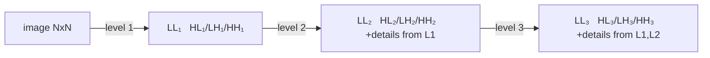
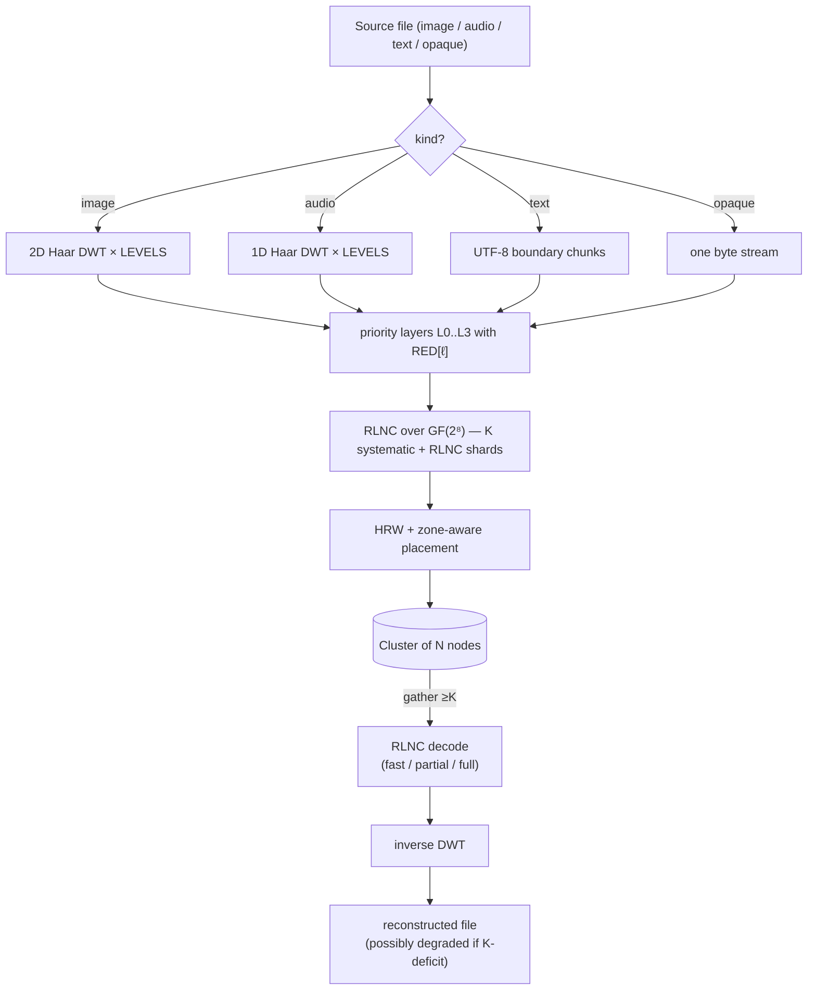

# Theorie

> ⚠ **Translation may be stale.** This file was last synced before Stage 12-15 (versioning + deletion, HNSW-backed semantic search, /spotlight ROI, streaming /holo, /diff, /similar, auto-repair-on-read, background scrub, typed RPC layer with timeouts + NoLiveNodes panic-fix, per-folder inline upload). The English source under [../](../) is the canon for any new feature; the [Unreleased] block of [../../CHANGELOG.md](../../CHANGELOG.md) lists every delta this translation does not yet cover.

Mathematische Grundlagen von holofs. Jeder Abschnitt enthält formale
Definitionen, einschlägige Formeln, Intuition und Verweise auf die Literatur.

> Mathematische Notation: GitHub rendert `$…$` und `$$…$$` über KaTeX.
> Diagramme sind Mermaid-Blöcke (auf GitHub ebenfalls nativ).

## Inhalt

1. [Galois-Körper GF(2⁸)](#1-galois-field-gf28)
2. [Random Linear Network Coding (RLNC)](#2-random-linear-network-coding-rlnc)
3. [Haar-Diskrete Wavelet-Transformation](#3-haar-discrete-wavelet-transform)
4. [Prioritätsschichten und holographische Degradation](#4-priority-layers-and-holographic-degradation)
5. [Highest Random Weight (Rendezvous) Hashing](#5-highest-random-weight-rendezvous-hashing)
6. [Zonenbewusste Platzierung](#6-zone-aware-placement)
7. [Inhaltsadressierung und Merkle-Bäume](#7-content-addressing-and-merkle-trees)
8. [Shamir Secret Sharing ↔ RLNC](#8-shamir-secret-sharing--rlnc)
9. [Bottom-K MinHash](#9-bottom-k-minhash)
10. [Perzeptuelles Hashing auf DWT-LL](#10-perceptual-hashing-on-dwt-ll)
11. [Reparatur- / regenerierende Codes](#11-repair--regenerating-codes)

---

## 1. Galois-Körper GF(2⁸)

Wir behandeln jedes Byte als Element des endlichen Körpers

$$
\mathrm{GF}(2^8) \;=\; \mathrm{GF}(2)[x] \;/\; \langle\, x^8 + x^4 + x^3 + x^2 + 1 \rangle,
$$

d. h. Polynome über $\mathbb{F}_2$ mit Grad $< 8$, reduziert modulo des
Rijndael- / AES-Polynoms $p(x) = \texttt{0x11d}$. Die Addition ist bitweises XOR:

$$
a \oplus b = (a_7 \oplus b_7,\, a_6 \oplus b_6,\, \dots,\, a_0 \oplus b_0).
$$

Die Multiplikation ist Polynom-Multiplikation modulo $p(x)$. Wir implementieren
sie über diskrete-Logarithmus-Tabellen relativ zum Generator $\alpha = \texttt{0x02}$:

$$
a \cdot b \;=\; \alpha^{\log_\alpha a + \log_\alpha b} \quad \text{for } a, b \neq 0,
$$

$$
a^{-1} \;=\; \alpha^{255 - \log_\alpha a}.
$$

Jede Multiplikation ist zwei Tabellen-Lookups + eine Addition. Die
`exp`-Tabelle ist auf Länge 512 dupliziert, sodass `log[a] + log[b]` nie
überläuft, was den Modulo im heißen Pfad eliminiert.

**Warum GF(2⁸).** Es passt in ein Byte, hat 255 Nicht-Null-Elemente
(reichlich verschiedene Koeffizienten für RLNC), und 8-Bit-Tabellen-Lookups
sind cachefreundlich. GF(2¹⁶) bietet eine geringere Wahrscheinlichkeit für
lineare Abhängigkeit, verdoppelt aber den Speicher.

**Implementierung.** [`holofs-core::gf`](../crates/holofs-core/src/gf.rs).

**Referenzen.**

- Lin & Costello, *Error Control Coding* (2. Aufl., 2004), §2.6.
- Joan Daemen & Vincent Rijmen, *The Design of Rijndael* (2002).

---

## 2. Random Linear Network Coding (RLNC)

Eine Datenschicht wird in $K$ Symbole $s_0, s_1, \ldots, s_{K-1}$ aufgeteilt
(jedes Symbol ist ein Byte-Vektor der Länge `sym_len`). Ein *shard* ist ein
Paar $(\mathbf{c}, \mathbf{p})$, wobei der Koeffizientenvektor
$\mathbf{c} = (c_0, \ldots, c_{K-1}) \in \mathrm{GF}(2^8)^K$ und der Payload

$$
\mathbf{p} \;=\; \bigoplus_{i=0}^{K-1} c_i \cdot s_i.
$$

Das XOR / die Multiplikation erfolgt pro Byte über $\mathrm{GF}(2^8)$.

### Decodierung

Bei $K$ shards $\{(\mathbf{c}^{(j)}, \mathbf{p}^{(j)})\}_{j=0}^{K-1}$ haben
wir das lineare System

$$
\underbrace{\begin{pmatrix} \mathbf{c}^{(0)} \\ \mathbf{c}^{(1)} \\ \vdots \\ \mathbf{c}^{(K-1)} \end{pmatrix}}_{C}
\;
\underbrace{\begin{pmatrix} s_0 \\ s_1 \\ \vdots \\ s_{K-1} \end{pmatrix}}_{S}
\;=\;
\underbrace{\begin{pmatrix} \mathbf{p}^{(0)} \\ \mathbf{p}^{(1)} \\ \vdots \\ \mathbf{p}^{(K-1)} \end{pmatrix}}_{P}
$$

Falls $C$ invertierbar ist, gewinnen wir $S = C^{-1} P$ via Gauß–Jordan-
Elimination in $O(K^3)$ Körperoperationen + $O(K^2 \cdot \texttt{sym\_len})$
für die Rücksubstitution zurück.

### Wahrscheinlichkeit der linearen Unabhängigkeit

Bei $n$ zufälligen shards, die gleichverteilt aus $\mathrm{GF}(2^8)^K$
gezogen werden, ist die Wahrscheinlichkeit, dass irgendwelche $K$ *nicht*
linear unabhängig sind (Decodierung scheitert), nach oben begrenzt durch

$$
P(\text{dependent}) \;\leq\; \frac{K}{2^8 - 1} \;\approx\; \frac{K}{255}.
$$

Für unser $K = 16$ ergibt das ≈ 6,3 %, was leicht durch das Senden von
$n > K$ shards ausgeglichen wird.

### Systematische shards

In holofs sind die ersten $\min(n, K)$ shards deterministisch
**systematisch**: $\mathbf{c}^{(i)} = \mathbf{e}_i$ (Standardbasis), sodass
der Payload buchstäblich das Rohsymbol $s_i$ ist. Dies bringt zwei enorme
Vorteile:

1. **Fast Path.** Wenn alle $K$ systematischen shards verfügbar sind, ist
   die Decodierung ein memcpy:
   $\hat S = (\mathbf{p}^{(0)} \,|\, \mathbf{p}^{(1)} \,|\, \cdots)$.
   Keine Gauß-Elimination, keine GF-Multiplikationen.

2. **Teilweise Wiederherstellung.** Wenn einige systematische shards fehlen,
   reduziert sich das Problem auf das Lösen eines kleineren $r \times r$-
   Systems (wobei $r$ die Anzahl der Unbekannten ist) — deutlich günstiger
   als das volle $K \times K$.

Die verbleibenden $n - K$ shards sind reines RLNC: zufällige Koeffizienten,
als "Versicherung" für Fälle, in denen systematische shards sterben.

**Implementierung.** [`holofs-core::rlnc`](../crates/holofs-core/src/rlnc.rs).

**Referenzen.**

- Rudolf Ahlswede, Ning Cai, Shuo-Yen R. Li, Raymond W. Yeung,
  ["Network Information Flow"](https://doi.org/10.1109/18.850663),
  IEEE Trans. Inf. Theory, 2000.
- Tracey Ho et al., ["A Random Linear Network Coding Approach to
  Multicast"](https://doi.org/10.1109/TIT.2006.881746),
  IEEE Trans. Inf. Theory, 2006.
- Christina Fragouli, Jean-Yves Le Boudec, Jörg Widmer,
  ["Network coding: an instant primer"](https://doi.org/10.1145/1198255.1198262),
  SIGCOMM CCR, 2006.

---

## 3. Haar-Diskrete Wavelet-Transformation

### 1D-Haar-Schritt

Bei einem Signal der Länge $2n$ $(x_0, x_1, \ldots, x_{2n-1})$ erzeugt der
Haar-Schritt *Approximations*-Koeffizienten $\mathbf{a}$ und
*Detail*-Koeffizienten $\mathbf{d}$:

$$
a_k \;=\; \frac{x_{2k} + x_{2k+1}}{\sqrt{2}}, \qquad
d_k \;=\; \frac{x_{2k} - x_{2k+1}}{\sqrt{2}}.
$$

$\mathbf{a}$ erfasst niederfrequente Inhalte (Durchschnitt), $\mathbf{d}$ die
hochfrequenten Inhalte (Differenz). Die Normalisierung $1/\sqrt{2}$ macht
die Transformation orthonormal — Energie bleibt erhalten:

$$
\sum_i x_i^2 \;=\; \sum_k a_k^2 + \sum_k d_k^2.
$$

### Mehrstufige Pyramide

Die rekursive Anwendung des Haar-Schritts allein auf $\mathbf{a}$ ergibt eine
mehraufloesungs-Pyramide. Nach $L$ Stufen ist das Signal in $L+1$ Bänder
zerlegt: ein grobes LL-Band (Größe $2n / 2^L$) und $L$ Detailbänder mit
abnehmender Auflösung.

### 2D-Haar (Tensorprodukt)

Für Bilder wenden wir die 1D-Haar-Transformation auf alle Zeilen und dann auf
alle Spalten an. Eine Stufe erzeugt vier Teilbänder:

| Teilband | Erfasst                               |
|----------|---------------------------------------|
| **LL**   | Niederfrequenz (grobe Struktur)       |
| **LH**   | horizontales Detail (vertikale Kanten) |
| **HL**   | vertikales Detail (horizontale Kanten) |
| **HH**   | diagonales Detail (Ecken, Textur)     |

Die Rekursion nur in LL hinein liefert die Standard-Wavelet-Pyramide:

### Umkehrung

Haar ist exakt invertierbar: $x_{2k} = (a_k + d_k)/\sqrt{2}$,
$x_{2k+1} = (a_k - d_k)/\sqrt{2}$. Wir können das Originalsignal aus dem
vollständigen Satz $\{a, d\}$-Koeffizienten wiederherstellen.

### Warum gerade Haar

- Einfachstes orthogonales Wavelet — Implementierung umfasst ~30 Zeilen.
- Linearphasig (keine räumliche Verschiebung).
- Für Demos der Prioritätsdegradation würden schärfere Wavelets (Daubechies-4,
  CDF 9/7) besseres PSNR pro Bit liefern, aber dasselbe qualitative
  Verhalten zeigen. Wir bleiben einfach, um die Mathematik zugänglich zu
  halten.

**Implementierung.** [`holofs-core::transform`](../crates/holofs-core/src/transform.rs).

**Referenzen.**

- Stéphane Mallat, *A Wavelet Tour of Signal Processing*
  (3. Aufl., Academic Press, 2008) — §7 (orthonormale Wavelet-Basen).
- Alfréd Haar, "Zur Theorie der orthogonalen Funktionensysteme",
  *Mathematische Annalen*, 1910 (Originalarbeit).

---

## 4. Prioritätsschichten und holographische Degradation

Die DWT-Teilbänder tragen Informationen ungleicher Wichtigkeit. Visuell:

- LL verlieren ⇒ das Bild geht vollständig verloren (dies ist das Thumbnail).
- HH₁ verlieren ⇒ die feinste Textur geht verloren, oft unmerklich.

Wir codieren jedes Band mit einer unterschiedlichen RLNC-Redundanz:

$$
\mathrm{RED}[\ell] \;\in\; \{\,4.0,\, 2.5,\, 1.6,\, 1.15\,\} \quad \text{for } \ell = 0, 1, 2, 3,
$$

sodass Schicht 0 (LL) mit $\lceil K \cdot 4.0 \rceil = 64$ shards gespeichert
wird, während Schicht 3 (feinstes Detail) $\lceil K \cdot 1.15 \rceil = 18$
erhält.

### Degradationskurve

Wenn ein Anteil $f$ der nodes ausfällt, ist die Wahrscheinlichkeit, dass
Schicht $\ell$ noch $\geq K$ lebende shards besitzt, näherungsweise

$$
P_\ell(f) \;=\; \sum_{k=K}^{n_\ell} \binom{n_\ell}{k} (1-f)^k\, f^{n_\ell - k}
$$

(binomial; HRW-Clustering wird für die Näherung ignoriert). Mit steigendem
$\ell$ sinkt $n_\ell$, sodass die Schichten **in Reihenfolge von hoher zu
niedriger Frequenz** ausfallen — genau das visuelle Verhalten einer
holographischen Platte, die zerschnitten wurde: das Bild bleibt erkennbar,
nur unschärfer.

### Empirische Demo

Auf Kodak kodim23 (Monte-Carlo, 5000 Versuche pro Kill-Prozentsatz,
40 nodes / 4 Zonen / K = 16):

| Kill % | volles Bild   | bis L2   | bis L1   | nur bis L0   | tot   |
|-------:|--------------:|---------:|---------:|-------------:|------:|
|   10 % |       42,8 %  |   57,2 % |    0,0 % |        0,0 % | 0,0 % |
|   25 % |        0,2 %  |   96,5 % |    3,3 % |        0,0 % | 0,0 % |
|   50 % |        0,0 %  |    0,0 % |   78,6 % |       21,4 % | 0,0 % |
|   75 % |        0,0 %  |    0,0 % |    0,0 % |       12,1 % | 87,9 %|

**Referenzen.**

- Andres Albanese, Johannes Blömer, Jeff Edmonds, Michael Luby, Madhu
  Sudan, ["Priority Encoding Transmission"](https://doi.org/10.1109/18.556657),
  IEEE Trans. Inf. Theory, 1996. Ursprüngliches Prioritäts-Codierungsschema,
  konzeptionell identisch mit unserem, aber angewendet auf Multicast-Video.
- Catherine Taylor, Jean-Yves Le Boudec, ["Holographic data storage with
  wavelet codecs"](https://www.epfl.ch/labs/lca/wp-content/uploads/2018/12/wavelet-codecs.pdf)
  (Vorlesungsskript, EPFL 2009) — klare Darstellung von DWT + Erasure-Codierung.

---

## 5. Highest Random Weight (Rendezvous) Hashing

Bei einem Schlüssel $k$ (Shard-Bezeichner) und einer Menge von nodes
$\{N_1, \ldots, N_m\}$ wählt HRW den node, der einen Hash maximiert:

$$
\mathrm{place}(k) \;=\; \arg\max_{i \in [m]} \;\; h(k,\, N_i).
$$

Wir verwenden [SplitMix64](https://prng.di.unimi.it/splitmix64.c) über ein
$(\text{object\_id},\, \text{channel},\, \text{layer},\, \text{shard\_idx},\, \text{node\_id})$-
Tupel als $h$.

### Theorem der minimalen Störung

Das Entfernen eines nodes aus dem Cluster verschiebt genau die shards, die
auf diesen node abgebildet wurden — andere bleiben. Formal: wenn $N_j$
ausscheidet, dann ist für jeden Schlüssel $k$, bei dem
$\mathrm{place}(k) = N_j$, die neue Platzierung

$$
\mathrm{place}'(k) \;=\; \arg\max_{i \neq j} \;\; h(k, N_i),
$$

unabhängig von allen anderen nodes. Dies ist die Eigenschaft, die HRW zum
richtigen Primitiv für inhaltsadressierten Speicher mit Churn macht —
konsistentes Hashing hat ähnliche Eigenschaften, aber mit O(log n) zusätzlichen
Hops auf einem Ring.

### Lastverteilung

Bei $m$ identischen nodes und gleichverteilten Zufallsschlüsseln beträgt der
erwartete Anteil der Schlüssel auf einem einzelnen node genau $1/m$, mit
Varianz $\frac{1}{m}(1 - \frac{1}{m})$ — wie ein gleichverteilter Wurf.

**Implementierung.** [`holofs-model::placement`](../crates/holofs-model/src/placement.rs).

**Referenzen.**

- David G. Thaler, Chinya V. Ravishankar,
  ["Using Name-Based Mappings to Increase Hit
  Rates"](https://doi.org/10.1109/90.664265),
  IEEE/ACM Trans. Networking, 1998.
- Karger et al., ["Consistent Hashing and Random Trees"](https://doi.org/10.1145/258533.258660),
  STOC 1997 — das alternative Schema; HRW ist einfacher, wenn man nur
  "einen aus $m$ auswählen" muss.

---

## 6. Zonenbewusste Platzierung

Reale Cluster haben Ausfallkorrelationen: ein ganzes Rack oder eine AZ kann
gemeinsam verschwinden. Wir legen eine *Kontingent*-Beschränkung auf HRW: für
jedes (channel, layer)-Paar darf keine einzelne Zone mehr als
$\lceil n_\ell / z \rceil$ shards beherbergen (wobei $z$ die Anzahl der
Zonen mit lebenden nodes ist).

### Algorithmus

Für jedes $\mathrm{shard\_idx} = 0, 1, \ldots, n_\ell - 1$:

1. Bewerten Sie jeden lebenden node nach $h(\text{key}, \text{node})$.
2. Absteigend sortieren.
3. Die Liste hinunterlaufen; den ersten node nehmen, **dessen Zone ihre
   Quote noch nicht überschritten hat**.

Die deterministische Reihenfolge hält die Platzierung stabil: das Entfernen
eines nodes verschiebt nur die shards, die sich auf ihm befanden, und nur
in dieselbe Zone (falls möglich). Das Hinzufügen eines nodes verteilt nur
$\sim 1/m$ der Last neu.

### Überleben bei Zonenausfall

Bei $z$ Zonen und $n_\ell$ shards pro Schicht bleiben beim Verlust einer
ganzen Zone

$$
n_\ell^{\text{alive}} \;\geq\; n_\ell \cdot \frac{z - 1}{z}
$$

shards am Leben. Für $n_\ell = 64$, $z = 4$, $K = 16$: 16 shards verlieren
(ein Viertel), 48 behalten — weit über der Schwelle von $K$.

In unserer 4-Zonen-Demo lässt **jeder** einzelne Zonenausfall das Objekt
bis L2 dekodierbar (nur das feinste L3-Detail fällt unter die Schwelle).

**Implementierung.** `place_layer_zone_aware` in
[`holofs-model::placement`](../crates/holofs-model/src/placement.rs).

**Referenzen.**

- Sage A. Weil et al., ["CRUSH: Controlled, Scalable, Decentralized
  Placement of Replicated Data"](https://doi.org/10.1145/1188455.1188582),
  SC '06 — die Inspiration; CRUSH macht dieselbe Idee mit gewichtetem
  hierarchischem Hashing für Ceph.

---

## 7. Inhaltsadressierung und Merkle-Bäume

Jeder shard hat einen SHA-256-Hash seiner `(coeffs || payload)`-Bytes (mit
einem Domain-Präfix `holofs-shard-v1`). Die Shard-Hashes sind Blätter eines
Merkle-Baums; die Wurzel wird im Objekt-manifest festgeschrieben.

### Objekt-CID

Der Content IDentifier eines Objekts ist

$$
\mathrm{CID} \;=\; \mathrm{SHA256}(\,\texttt{holofs-data-v1} \,\|\, \text{channels} \,\|\, \text{params}\,).
$$

Dies ist **deterministisch aus dem Inhalt**: zwei Clients, die dieselbe
Datei mit denselben Parametern codieren, erzeugen dieselbe CID. Zwei
Bilddateien, die in dieselben Canvas-Bytes umgewandelt werden (z. B.
verlustfreies PNG vs BMP derselben Quelle), erzeugen dieselbe CID —
Cross-Format-Dedup ergibt sich kostenlos.

### Warum ein Merkle-Baum und nicht nur ein Wurzel-Hash

- Überprüfbare Reparatur: ein regenerierender node kann beweisen, dass er
  einen neuen shard erzeugt hat, dessen Hash in `shard_hashes` enthalten
  ist, selbst wenn die Merkle-Wurzel inzwischen aktualisiert wurde.
- Auditierbares Streaming: ein Client, der shards herunterlädt, kann jeden
  shard beim Eintreffen gegen das manifest verifizieren und korrupte shards
  vor der Decodierung verwerfen.

**Implementierungen.** [`holofs-core::hash`](../crates/holofs-core/src/hash.rs) (FIPS
180-4 SHA-256, NIST-Vektor-verifiziert) und
[`holofs-core::merkle`](../crates/holofs-core/src/merkle.rs).

**Referenzen.**

- Ralph C. Merkle, "Protocols for Public Key Cryptosystems",
  *IEEE S&P*, 1980 — der ursprüngliche Baum.
- FIPS PUB 180-4, *Secure Hash Standard* (NIST, 2015).
- IPFS Specifications, [Content Identifiers](https://github.com/multiformats/cid).

---

## 8. Shamir Secret Sharing ↔ RLNC

Ein $(K, N)$-Shamir-Schema verteilt ein Geheimnis $s$ als $N$ Auswertungen
eines zufälligen Polynoms vom Grad $K - 1$ über einem endlichen Körper:

$$
f(x) \;=\; s + r_1 x + r_2 x^2 + \cdots + r_{K-1} x^{K-1}, \quad r_i \stackrel{\$}{\leftarrow} \mathbb{F}.
$$

Jede Partei $i \in [N]$ erhält $(x_i, f(x_i))$. Beliebige $K$ Anteile
rekonstruieren $f$ (und damit $s$) per Lagrange-Interpolation; $K - 1$
Anteile geben nichts über $s$ preis (informationstheoretische Sicherheit).

### Äquivalenz zu RLNC

Der Koeffizientenvektor $\mathbf{c}^{(j)} = (1, x_j, x_j^2, \ldots, x_j^{K-1})$
macht jeden Shamir-Anteil zu einem speziellen RLNC-shard. Die
Rekonstruktionsmatrix ist eine Vandermonde-Determinante, immer ungleich
null für verschiedene $x_j$.

In holofs verwenden wir Vandermonde-Shamir nicht direkt; wir verwenden
**zufällige** Koeffizientenvektoren. Die Sicherheitsgarantie ist geringfügig
schwächer (irgendwelche $K - 1$ shards lassen eine gleichverteilte
Wahrscheinlichkeitsdichte über dem Geheimnisraum entweichen — dieselbe wie
Shamir im schlimmsten Fall, aber nicht für alle Koeffizientenwahlen). Für
Key-Escrow-Anwendungsfälle ist dies akzeptabel.

### holofs-Escrow

`holofs-analytics::escrow` baut auf `holofs-core::rlnc::encode_layer_with_k`
mit benutzerdefiniertem $K, N$ auf. Shards werden als `.holoshare`-Dateien
serialisiert, verteilbar an Personen / Geräte. Der Escrow-Workflow ist
*rein clientseitig*: nichts wird im Cluster gespeichert.

**Referenzen.**

- Adi Shamir, ["How to Share a Secret"](https://doi.org/10.1145/359168.359176),
  Comm. ACM, 1979.
- Hugo Krawczyk, ["Secret Sharing Made Short"](https://link.springer.com/chapter/10.1007/3-540-48329-2_12),
  CRYPTO 1993 — Encrypt-then-Share-Ansatz für sehr große Geheimnisse;
  außerhalb des Umfangs für v0, aber ein natürlicher nächster Schritt.

---

## 9. Bottom-K MinHash

Bei zwei als Mengen von $n$-Shingles (Teilstrings der Länge $n$)
repräsentierten Dokumenten $A, B$ ist die Jaccard-Ähnlichkeit

$$
J(A, B) \;=\; \frac{|A \cap B|}{|A \cup B|} \;\in\; [0, 1].
$$

Die direkte Berechnung von $|A \cap B|$ erfordert $|A| + |B|$ Speicher.
MinHash liefert einen erwartungstreuen Schätzer mit festem Speicher $k$:

1. Jedes Shingle mit einem festen Hash $h$ hashen.
2. Die $k$ kleinsten unterschiedlichen Hash-Werte behalten:
   $A_k = \{h(s) : s \in A\}_{(1..k)}$.
3. Jaccard schätzen als

$$
\hat J(A, B) \;=\; \frac{|A_k \cap B_k|}{k}.
$$

Dieser Schätzer hat die Varianz

$$
\mathrm{Var}(\hat J) \;=\; \frac{J(1 - J)}{k},
$$

sodass für $k = 64$ die Standardabweichung $\leq 1/16 \approx 6\%$ beträgt —
ausreichend, um "nahezu duplikat" (J > 0,8) verlässlich von "unverwandt"
(J < 0,1) zu unterscheiden.

### holofs-Verwendung

`holofs-analytics::shingle` berechnet einen 64-Wert-MinHash auf 5-Byte-Shingles
zur PUT-Zeit und speichert ihn in `manifest.text_minhash`. Zur Suchzeit
berechnen wir Jaccard paarweise — keine I/O, keine Dekompression.

**Erkannte Unterschiede.** Identische Dateien: $J = 1,0$. Kleine Bearbeitungen
(Tippfehler, Absatzumordnung): typischerweise $J \geq 0,85$. Teilstring-
Einschluss (ein Dokument in ein anderes kopiert): $J \in [0,2,\, 0,7]$ je
nach Längenverhältnis. Unverwandt: $J \approx 0$.

**Referenzen.**

- Andrei Z. Broder, ["On the resemblance and containment of
  documents"](https://doi.org/10.1109/SEQUEN.1997.666900),
  SEQUENCES '97 — der ursprüngliche MinHash.
- Edith Cohen, ["Min-Wise Independent Permutations"](https://doi.org/10.1145/276698.276781),
  STOC 1998 — formale Analyse.
- Sergei Vassilvitskii, Sanjeev Arora et al., *Mining of Massive
  Datasets* (3. Aufl., 2020), §3 — praktische Einführung.

---

## 10. Perzeptuelles Hashing auf DWT-LL

Das LL-Band eines $W \times H$-Bildes nach $L$ DWT-Stufen ist eine
$W/2^L \times H/2^L$ Tiefpass-Approximation — exakt das Thumbnail, das von
klassischen perzeptuellen Hashes verwendet wird (pHash nutzt DCT, dHash
nutzt Pixel-Differenzen).

In holofs enthalten **die ersten $K$ systematischen shards der Schicht 0**
buchstäblich die LL-Pixel (als float-32 Wavelet-Koeffizienten, byteserialisiert).
Wir berechnen einen 16-Byte-Fingerabdruck als

$$
\mathrm{fp}_i \;=\; \mathrm{mean}(\mathrm{payload}(\mathrm{shard}_i)), \quad i = 0, 1, \ldots, K - 1.
$$

Für unser $K = 16$ ergibt das ein $4 \times 4$-Gitter mittlerer Luminanzen —
eine klassische dHash-Variante. Distanz ist L₁:

$$
d(\mathrm{fp}, \mathrm{fp}') \;=\; \sum_{i=0}^{15} |\mathrm{fp}_i - \mathrm{fp}'_i| \;\in\; [0,\, 16 \cdot 255].
$$

Ähnlichkeit in % ist $100 \cdot (1 - d / 4080)$. Identischer Inhalt → 0.
Visuell ähnlich → $d \lesssim 200$. Zufällige Bilder → $d \gtrsim 1500$.

**Wichtig**: wir berechnen diesen Fingerabdruck **ohne das Objekt zu
dekomprimieren** — lediglich durch Lesen der systematischen shards der
Schicht 0. Für eine Suche über Tausende von Objekten ist dies O(K) Bytes
pro Objekt.

**Referenzen.**

- Christoph Zauner, *Implementation and Benchmarking of Perceptual
  Image Hash Functions*, MSc-Thesis, FH Hagenberg, 2010 — Vergleich von
  aHash / dHash / pHash.
- Marr & Hildreth, ["Theory of edge detection"](https://www.jstor.org/stable/35407),
  Proc. Royal Society B, 1980 — coarse-to-fine-Visions-Motivation.

---

## 11. Reparatur- / regenerierende Codes

Wenn ein node $v$ verschwindet (oder ein neuer node hinzugefügt wird),
müssen wir seine shards auf einem Ersatz wiederherstellen. Zwei Optionen:

**(a) Vollständige Rekonstruktion.** $K$ shards herunterladen, das volle
Objekt decodieren, die fehlenden shards neu berechnen. Kosten:
$K \cdot \texttt{sym\_len}$ heruntergeladene Bytes plus $K^3$ GF-Operationen
für Gauß + $K \cdot \texttt{sym\_len}$ für die Neucodierung jedes verlorenen
shards.

**(b) RLNC-Regeneration** (was holofs tut). $d$ shards herunterladen
($K \leq d \leq n$), sie mischen als

$$
\mathbf{c}^{\text{new}} = \sum_{j=1}^d \alpha_j \mathbf{c}^{(j)}, \qquad
\mathbf{p}^{\text{new}} = \sum_{j=1}^d \alpha_j \mathbf{p}^{(j)}
$$

mit zufälligen $\alpha_j$. Das Ergebnis ist ein neuer gültiger RLNC-shard
*innerhalb derselben linearen Hülle* — kein vollständiges Decodieren und
Neucodieren nötig.

Kosten: dieselben heruntergeladenen Bytes ($d \cdot \texttt{sym\_len}$ für
$d = K$), **keine Gauß-Elimination**, nur GF-MAC-Operationen. Empirisch
~9× weniger GF-Multiplikationen.

Dies stellt holofs in die Familie der *Minimum Bandwidth Regenerating*
(MBR)-Codes — siehe Dimakis et al. für die unteren Schranken und den
Kompromiss mit *Minimum Storage Regenerating* (MSR).

**Referenzen.**

- Alexandros G. Dimakis, Brighten Godfrey, Yunnan Wu, Martin J.
  Wainwright, Kannan Ramchandran, ["Network Coding for Distributed
  Storage Systems"](https://doi.org/10.1109/TIT.2010.2054295),
  IEEE Trans. Inf. Theory, 2010 — etablierte das Feld.
- Anwitaman Datta, Frédérique Oggier, ["An Overview of Codes Tailor-Made
  for Better Repairability in Networked Distributed Storage
  Systems"](https://doi.org/10.1145/2723772.2723778), ACM SIGACT News, 2013.

---

## Alles zusammenfügen

Die vollständige Encode → Store → Recover-Pipeline:

Jede Box ordnet sich einem Abschnitt oben zu; verwenden Sie die
abschnittsweisen *Implementation*-Links, um direkt von der Theorie zum Code
zu navigieren.
