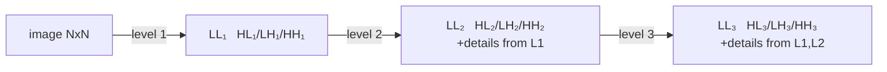
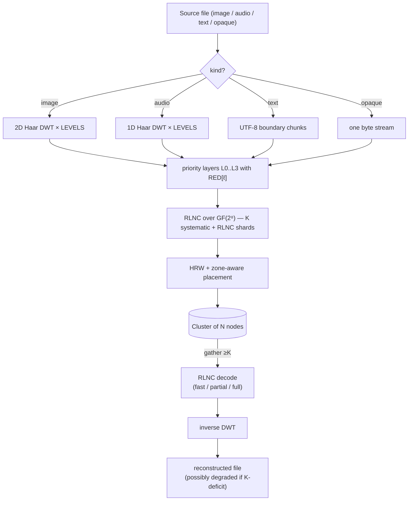

# Theorie

Mathematische Grundlagen von holofs. Jeder Abschnitt enthält formale
Definitionen, relevante Formeln, Intuition und Verweise auf die
Literatur.

> Mathematische Notation: GitHub rendert `$…$` und `$$…$$` via KaTeX.
> Diagramme sind Mermaid-Blöcke (ebenfalls nativ auf GitHub).

## Inhalt

1. [Galois-Körper GF(2⁸)](#1-galois-körper-gf2)
2. [Random Linear Network Coding (RLNC)](#2-random-linear-network-coding-rlnc)
3. [Haar-Diskrete-Wavelet-Transformation](#3-haar-diskrete-wavelet-transformation)
4. [Prioritätsschichten und holografische Degradation](#4-prioritätsschichten-und-holografische-degradation)
5. [Highest Random Weight (Rendezvous) Hashing](#5-highest-random-weight-rendezvous-hashing)
6. [Zone-Aware-Platzierung](#6-zone-aware-platzierung)
7. [Inhaltsadressierung und Merkle-Bäume](#7-inhaltsadressierung-und-merkle-bäume)
8. [Shamir-Secret-Sharing ↔ RLNC](#8-shamir-secret-sharing--rlnc)
9. [Bottom-K MinHash](#9-bottom-k-minhash)
10. [Perzeptuelles Hashing auf DWT-LL](#10-perzeptuelles-hashing-auf-dwt-ll)
11. [Repair- / Regenerating-Codes](#11-repair---regenerating-codes)

---

## 1. Galois-Körper GF(2⁸)

Wir behandeln jedes Byte als Element des endlichen Körpers

$$
\mathrm{GF}(2^8) \;=\; \mathrm{GF}(2)[x] \;/\; \langle\, x^8 + x^4 + x^3 + x^2 + 1 \rangle,
$$

d. h. Polynome über $\mathbb{F}_2$ mit Grad $< 8$, reduziert modulo dem
Rijndael-/AES-Polynom $p(x) = \texttt{0x11d}$. Addition ist ein bitweises
XOR:

$$
a \oplus b = (a_7 \oplus b_7,\, a_6 \oplus b_6,\, \dots,\, a_0 \oplus b_0).
$$

Die Multiplikation ist Polynom-Multiplikation mod $p(x)$. Wir
implementieren sie mit diskreten-Log-Tabellen relativ zum Generator
$\alpha = \texttt{0x02}$:

$$
a \cdot b \;=\; \alpha^{\log_\alpha a + \log_\alpha b} \quad \text{für } a, b \neq 0,
$$

$$
a^{-1} \;=\; \alpha^{255 - \log_\alpha a}.
$$

Jede Multiplikation besteht aus zwei Tabellen-Lookups + einer Addition.
Die `exp`-Tabelle ist auf Länge 512 dupliziert, sodass `log[a] + log[b]`
nie umbricht — das eliminiert das Modulo auf dem heißen Pfad.

**Warum GF(2⁸).** Es passt in ein Byte, besitzt 255 Nicht-Null-Elemente
(reichlich verschiedene Koeffizienten für RLNC), und 8-Bit-Tabellen-
Lookups sind cachefreundlich. GF(2¹⁶) gibt eine geringere
Linear-Abhängigkeitswahrscheinlichkeit, verdoppelt aber den Speicher.

**Implementierung.** [`holofs-core::gf`](../../crates/holofs-core/src/gf.rs).

**Referenzen.**

- Lin & Costello, *Error Control Coding* (2. Aufl., 2004), §2.6.
- Joan Daemen & Vincent Rijmen, *The Design of Rijndael* (2002).

---

## 2. Random Linear Network Coding (RLNC)

Eine Datenschicht wird in $K$ Symbole $s_0, s_1, \ldots, s_{K-1}$
aufgeteilt (jedes Symbol ist ein Byte-Vektor der Länge `sym_len`). Ein
*Shard* ist ein Paar $(\mathbf{c}, \mathbf{p})$, bei dem der
Koeffizientenvektor
$\mathbf{c} = (c_0, \ldots, c_{K-1}) \in \mathrm{GF}(2^8)^K$ ist und der
Payload

$$
\mathbf{p} \;=\; \bigoplus_{i=0}^{K-1} c_i \cdot s_i.
$$

Das XOR / die Multiplikation erfolgt byteweise über $\mathrm{GF}(2^8)$.

### Decodierung

Mit $K$ Shards $\{(\mathbf{c}^{(j)}, \mathbf{p}^{(j)})\}_{j=0}^{K-1}$
haben wir das lineare System

$$
\underbrace{\begin{pmatrix} \mathbf{c}^{(0)} \\ \mathbf{c}^{(1)} \\ \vdots \\ \mathbf{c}^{(K-1)} \end{pmatrix}}_{C}
\;
\underbrace{\begin{pmatrix} s_0 \\ s_1 \\ \vdots \\ s_{K-1} \end{pmatrix}}_{S}
\;=\;
\underbrace{\begin{pmatrix} \mathbf{p}^{(0)} \\ \mathbf{p}^{(1)} \\ \vdots \\ \mathbf{p}^{(K-1)} \end{pmatrix}}_{P}
$$

Ist $C$ invertierbar, gewinnen wir $S = C^{-1} P$ per Gauß-Jordan-
Elimination in $O(K^3)$ Körper-Operationen +
$O(K^2 \cdot \texttt{sym\_len})$ für die Rücksubstitution zurück.

### Wahrscheinlichkeit linearer Unabhängigkeit

Mit $n$ zufällig gleichverteilt aus $\mathrm{GF}(2^8)^K$ gezogenen Shards
ist die Wahrscheinlichkeit, dass beliebige $K$ *nicht* linear unabhängig
sind (Decodierung schlägt fehl), beschränkt durch

$$
P(\text{abhängig}) \;\leq\; \frac{K}{2^8 - 1} \;\approx\; \frac{K}{255}.
$$

Für unser $K = 16$ gibt das ≈ 6,3 %, leicht kompensierbar durch das
Versenden von $n > K$ Shards.

### Systematische Shards

In holofs sind die ersten $\min(n, K)$ Shards deterministisch
**systematisch**: $\mathbf{c}^{(i)} = \mathbf{e}_i$ (Standardbasis), sodass
der Payload buchstäblich das rohe Symbol $s_i$ ist. Das ergibt zwei
enorme Vorteile:

1. **Fast Path.** Sind alle $K$ systematischen Shards verfügbar, ist die
   Decodierung ein memcpy: $\hat S = (\mathbf{p}^{(0)} \,|\, \mathbf{p}^{(1)} \,|\, \cdots)$.
   Keine Gauß-Elimination, keine GF-Multiplikationen.

2. **Teilweise Wiederherstellung.** Fehlen einige systematische Shards,
   reduziert sich das Problem auf das Lösen eines kleineren
   $r \times r$-Systems (wobei $r$ die Anzahl der Unbekannten ist) — weit
   billiger als das volle $K \times K$.

Die verbleibenden $n - K$ Shards sind reines RLNC: zufällige
Koeffizienten, verwendet als „Versicherung" für Fälle, in denen
systematische Shards ausfallen.

**Implementierung.** [`holofs-core::rlnc`](../../crates/holofs-core/src/rlnc.rs).

**Referenzen.**

- Rudolf Ahlswede, Ning Cai, Shuo-Yen R. Li, Raymond W. Yeung,
  [„Network Information Flow"](https://doi.org/10.1109/18.850663),
  IEEE Trans. Inf. Theory, 2000.
- Tracey Ho et al., [„A Random Linear Network Coding Approach to
  Multicast"](https://doi.org/10.1109/TIT.2006.881746),
  IEEE Trans. Inf. Theory, 2006.
- Christina Fragouli, Jean-Yves Le Boudec, Jörg Widmer,
  [„Network coding: an instant primer"](https://doi.org/10.1145/1198255.1198262),
  SIGCOMM CCR, 2006.

---

## 3. Haar-Diskrete-Wavelet-Transformation

### 1D-Haar-Schritt

Gegeben ein Signal der Länge $2n$ $(x_0, x_1, \ldots, x_{2n-1})$, erzeugt
der Haar-Schritt *Approximations*-Koeffizienten $\mathbf{a}$ und
*Detail*-Koeffizienten $\mathbf{d}$:

$$
a_k \;=\; \frac{x_{2k} + x_{2k+1}}{\sqrt{2}}, \qquad
d_k \;=\; \frac{x_{2k} - x_{2k+1}}{\sqrt{2}}.
$$

$\mathbf{a}$ erfasst niederfrequenten Inhalt (Mittelwert), $\mathbf{d}$
den hochfrequenten Inhalt (Differenz). Die Normalisierung $1/\sqrt{2}$
macht die Transformation orthonormal — die Energie bleibt erhalten:

$$
\sum_i x_i^2 \;=\; \sum_k a_k^2 + \sum_k d_k^2.
$$

### Mehrstufige Pyramide

Rekursives Anwenden des Haar-Schritts allein auf $\mathbf{a}$ ergibt
eine Multi-Auflösungs-Pyramide. Nach $L$ Ebenen ist das Signal in
$L+1$ Bänder zerlegt: ein grobes LL-Band (Größe $2n / 2^L$) und $L$
Detailbänder abnehmender Auflösung.

### 2D-Haar (Tensorprodukt)

Für Bilder wenden wir das 1D-Haar auf alle Zeilen und dann auf alle
Spalten an. Eine Ebene erzeugt vier Unterbänder:

| Unterband | Erfasst                              |
|-----------|--------------------------------------|
| **LL**    | Niederfrequenz (grobe Struktur)      |
| **LH**    | horizontales Detail (vertikale Kanten) |
| **HL**    | vertikales Detail (horizontale Kanten) |
| **HH**    | diagonales Detail (Ecken, Textur)    |

Das Rekurrieren allein in LL ergibt die standardmäßige Wavelet-Pyramide:

### Inverse

Haar ist exakt invertierbar: $x_{2k} = (a_k + d_k)/\sqrt{2}$,
$x_{2k+1} = (a_k - d_k)/\sqrt{2}$. Wir können das ursprüngliche Signal
aus dem vollständigen Satz $\{a, d\}$-Koeffizienten zurückgewinnen.

### Warum speziell Haar

- Einfachstes orthogonales Wavelet — die Implementierung umfasst ~30
  Zeilen.
- Linearphasig (keine räumliche Verschiebung).
- Für Demos der Prioritäts-Degradation würden schärfere Wavelets
  (Daubechies-4, CDF 9/7) besseres PSNR pro Bit liefern, jedoch dasselbe
  qualitative Verhalten. Wir bleiben simpel, um die Mathematik
  zugänglich zu halten.

**Implementierung.** [`holofs-core::transform`](../../crates/holofs-core/src/transform.rs).

**Referenzen.**

- Stéphane Mallat, *A Wavelet Tour of Signal Processing*
  (3. Aufl., Academic Press, 2008) — §7 (orthonormale Wavelet-Basen).
- Alfréd Haar, „Zur Theorie der orthogonalen Funktionensysteme",
  *Mathematische Annalen*, 1910 (die Originalarbeit).

---

## 4. Prioritätsschichten und holografische Degradation

Die DWT-Unterbänder tragen Information ungleicher Bedeutung. Visuell:

- LL zu verlieren ⇒ das Bild vollständig zu verlieren (das ist das
  Thumbnail).
- HH₁ zu verlieren ⇒ die feinste Textur zu verlieren, oft
  unbemerkbar.

Wir codieren jedes Band mit einer anderen RLNC-Redundanz:

$$
\mathrm{RED}[\ell] \;\in\; \{\,4.0,\, 2.5,\, 1.6,\, 1.15\,\} \quad \text{für } \ell = 0, 1, 2, 3,
$$

sodass Schicht 0 (LL) mit $\lfloor K \cdot 4.0 + 0.5 \rfloor = 64$
Shards gespeichert wird, während Schicht 3 (feinstes Detail)
$\lfloor K \cdot 1.15 + 0.5 \rfloor = 18$ erhält. Der Code verwendet
kaufmännisches Runden (`f32::round`), nicht Aufrunden — daher liefert
`K · 1.15 = 18.4` das Ergebnis $18$, nicht $19$.

### Degradations-Kurve

Fällt ein Anteil $f$ der Nodes aus, ist die Wahrscheinlichkeit, dass
Schicht $\ell$ noch $\geq K$ lebende Shards besitzt, ungefähr

$$
P_\ell(f) \;=\; \sum_{k=K}^{n_\ell} \binom{n_\ell}{k} (1-f)^k\, f^{n_\ell - k}
$$

(binomial; HRW-Clustering wird für die Näherung ignoriert). Mit
zunehmendem $\ell$ nimmt $n_\ell$ ab, sodass die Schichten **in der
Reihenfolge von hoher zu niedriger Frequenz** ausfallen — genau das
visuelle Verhalten einer holografischen Platte, die zerschnitten wurde:
das Bild bleibt erkennbar, wird nur unschärfer.

### Empirische Demo

Auf Kodak kodim23 (Monte-Carlo, 5000 Versuche pro Kill-Prozentsatz,
40 Nodes / 4 Zonen / K = 16):

| kill % | volles Bild | bis L2 | bis L1 | nur bis L0 | tot |
|-------:|------------:|-------:|-------:|-----------:|----:|
|   10 % |      42,8 % | 57,2 % |  0,0 % |      0,0 % | 0,0 % |
|   25 % |       0,2 % | 96,5 % |  3,3 % |      0,0 % | 0,0 % |
|   50 % |       0,0 % |  0,0 % | 78,6 % |     21,4 % | 0,0 % |
|   75 % |       0,0 % |  0,0 % |  0,0 % |     12,1 % | 87,9 % |

**Referenzen.**

- Andres Albanese, Johannes Blömer, Jeff Edmonds, Michael Luby, Madhu
  Sudan, [„Priority Encoding Transmission"](https://doi.org/10.1109/18.556657),
  IEEE Trans. Inf. Theory, 1996. Ursprüngliches Priority-Coding-Schema,
  konzeptionell identisch zu unserem, jedoch auf Multicast-Video
  angewandt.
- Catherine Taylor, Jean-Yves Le Boudec, [„Holographic data storage with
  wavelet codecs"](https://www.epfl.ch/labs/lca/wp-content/uploads/2018/12/wavelet-codecs.pdf)
  (Vorlesungsnotizen, EPFL 2009) — klare Behandlung von DWT +
  Erasure-Coding.

---

## 5. Highest Random Weight (Rendezvous) Hashing

Gegeben ein Schlüssel $k$ (Shard-Identifier) und eine Menge von Nodes
$\{N_1, \ldots, N_m\}$, wählt HRW den Node, der einen Hash maximiert:

$$
\mathrm{place}(k) \;=\; \arg\max_{i \in [m]} \;\; h(k,\, N_i).
$$

Wir nutzen [SplitMix64](https://prng.di.unimi.it/splitmix64.c) über ein
$(\text{object\_id},\, \text{channel},\, \text{layer},\, \text{shard\_idx},\, \text{node\_id})$-
Tupel als $h$.

### Satz der minimalen Störung

Das Entfernen eines Nodes aus dem Cluster verschiebt genau die Shards,
die auf diesen Node abgebildet waren — andere bleiben. Formal: verlässt
$N_j$ den Cluster, so ist die neue Platzierung für jeden Schlüssel $k$
mit $\mathrm{place}(k) = N_j$

$$
\mathrm{place}'(k) \;=\; \arg\max_{i \neq j} \;\; h(k, N_i),
$$

unabhängig von allen anderen Nodes. Diese Eigenschaft macht HRW zur
richtigen Primitive für inhaltsadressierten Speicher mit Churn —
Consistent Hashing hat ähnliche Eigenschaften, aber mit O(log n)
zusätzlichen Hops auf einem Ring.

### Lastausgleich

Für $m$ identische Nodes und gleichverteilt zufällige Schlüssel ist der
erwartete Anteil der Schlüssel auf einem einzigen Node genau $1/m$, mit
Varianz $\frac{1}{m}(1 - \frac{1}{m})$ — gleich einer gleichverteilten
Zufallsauswahl.

**Implementierung.** [`holofs-model::placement`](../../crates/holofs-model/src/placement.rs).

**Referenzen.**

- David G. Thaler, Chinya V. Ravishankar,
  [„Using Name-Based Mappings to Increase Hit
  Rates"](https://doi.org/10.1109/90.664265),
  IEEE/ACM Trans. Networking, 1998.
- Karger et al., [„Consistent Hashing and Random Trees"](https://doi.org/10.1145/258533.258660),
  STOC 1997 — das alternative Schema; HRW ist einfacher, wenn man nur
  „einen von $m$ auswählen" möchte.

---

## 6. Zone-Aware-Platzierung

Reale Cluster besitzen Fehlerkorrelationen: ein ganzes Rack oder eine
AZ kann gemeinsam verschwinden. Wir legen eine *Quota*-Beschränkung
über HRW: für jedes (channel, layer)-Paar darf keine einzelne Zone mehr
als $\lceil n_\ell / z \rceil$ Shards hosten (wobei $z$ die Anzahl der
Zonen mit lebenden Nodes ist).

### Algorithmus

Für jedes $\mathrm{shard\_idx} = 0, 1, \ldots, n_\ell - 1$:

1. Bewerte jeden lebenden Node mit $h(\text{key}, \text{node})$.
2. Sortiere absteigend.
3. Gehe die Liste durch; nimm den ersten Node, dessen **Zone ihre
   Quota nicht überschritten hat**.

Die deterministische Reihenfolge hält die Platzierung stabil: das
Entfernen eines Nodes verschiebt nur Shards, die auf ihm lagen, und nur
in dieselbe Zone (falls möglich). Das Hinzufügen eines Nodes verteilt
nur $\sim 1/m$ der Last neu.

### Überleben eines Zonenausfalls

Mit $z$ Zonen und $n_\ell$ Shards pro Schicht bleiben nach dem Verlust
einer ganzen Zone

$$
n_\ell^{\text{alive}} \;\geq\; n_\ell \cdot \frac{z - 1}{z}
$$

Shards am Leben. Für $n_\ell = 64$, $z = 4$, $K = 16$: 16 Shards
verlieren (ein Viertel), 48 behalten — deutlich über der Schwelle von
$K$.

In unserer 4-Zonen-Demo lässt **jeder** Einzelzonenausfall das Objekt
bis L2 decodierbar (nur das feinste L3-Detail fällt unter die
Schwelle).

**Implementierung.** `place_layer_zone_aware` in
[`holofs-model::placement`](../../crates/holofs-model/src/placement.rs).

**Referenzen.**

- Sage A. Weil et al., [„CRUSH: Controlled, Scalable, Decentralized
  Placement of Replicated Data"](https://doi.org/10.1145/1188455.1188582),
  SC '06 — die Inspiration; CRUSH tut dieselbe Idee mit gewichtetem
  hierarchischem Hashing für Ceph.

---

## 7. Inhaltsadressierung und Merkle-Bäume

Jeder Shard hat einen SHA-256-Hash seiner `(coeffs || payload)`-Bytes
(mit einem Domain-Präfix `holofs-shard-v1`). Die Shard-Hashes sind
Blätter eines Merkle-Baums; die Wurzel wird an das Objekt-Manifest
committet.

### Objekt-CID

Der Content IDentifier eines Objekts ist

$$
\mathrm{CID} \;=\; \mathrm{SHA256}(\,\texttt{holofs-data-v1} \,\|\, \text{channels} \,\|\, \text{params}\,).
$$

Dies ist **deterministisch aus dem Inhalt**: zwei Clients, die
dieselbe Datei mit denselben Parametern codieren, produzieren dieselbe
CID. Zwei Bilddateien, die zu denselben Canvas-Bytes resampeln (z. B.
verlustfreies PNG vs. BMP derselben Quelle), produzieren dieselbe CID —
Cross-Format-Dedup fällt umsonst ab.

### Warum ein Merkle-Baum, nicht nur ein Wurzel-Hash

- Verifizierbare Reparatur: ein regenerierender Node kann beweisen,
  dass er einen neuen Shard erzeugt hat, dessen Hash in `shard_hashes`
  steht, selbst wenn die Merkle-Wurzel seither aktualisiert wurde.
- Auditierbares Streaming: ein Client, der Shards herunterlädt, kann
  jeden Shard beim Eintreffen gegen das Manifest verifizieren und
  korrupte Shards vor der Decodierung ablehnen.

### Second-Preimage-Härtung

Ein naiver Merkle-Baum — Hash-von-Hash-Paaren ohne Domain-Trennung —
ist anfällig für Second-Preimage-Angriffe: ein Angreifer, der ein Blatt
$L$ so wählen kann, dass $H(L)$ gleich einem Interior-Node-Hash
$H(a \| b)$ ist, kann $L$ gegen den gesamten Teilbaum tauschen, ohne
die Wurzel zu ändern. holofs blockt das auf zwei Wegen:

1. **Domain-Tags.** Blätter werden gehasht als
   $H(\texttt{holofs-merkle-leaf-v1} \| \text{shard\_hash})$;
   Interior-Nodes als
   $H(\texttt{holofs-merkle-node-v1} \| a \| b)$. Die beiden Domains
   können nicht kollidieren.
2. **Blattzahl-Mixing.** Die Wurzel wird finalisiert als
   $H(\texttt{holofs-merkle-root-v1} \| \text{leaf\_count} \| \text{tree\_root})$,
   sodass das Duplizieren des letzten Blatts zum Auffüllen auf eine
   Zweierpotenz (eine klassische Kanonisierungs-Ambiguität) durch die
   Anzahl gefangen wird.

**Implementierungen.**
[`holofs-core::hash`](../../crates/holofs-core/src/hash.rs) (FIPS 180-4
SHA-256, gegen NIST-Vektoren verifiziert) und
[`holofs-core::merkle`](../../crates/holofs-core/src/merkle.rs).

**Referenzen.**

- Ralph C. Merkle, „Protocols for Public Key Cryptosystems",
  *IEEE S&P*, 1980 — der ursprüngliche Baum.
- FIPS PUB 180-4, *Secure Hash Standard* (NIST, 2015).
- IPFS-Spezifikationen, [Content Identifiers](https://github.com/multiformats/cid).

---

## 8. Shamir-Secret-Sharing ↔ RLNC

Ein $(K, N)$-Shamir-Schema verteilt ein Geheimnis $s$ als $N$
Auswertungen eines zufälligen Polynoms vom Grad $K - 1$ über einem
endlichen Körper:

$$
f(x) \;=\; s + r_1 x + r_2 x^2 + \cdots + r_{K-1} x^{K-1}, \quad r_i \stackrel{\$}{\leftarrow} \mathbb{F}.
$$

Jede Partei $i \in [N]$ erhält $(x_i, f(x_i))$. Beliebige $K$ Anteile
rekonstruieren $f$ (und damit $s$) per Lagrange-Interpolation; $K - 1$
Anteile enthüllen nichts über $s$ (informationstheoretische
Sicherheit).

### Äquivalenz zu RLNC

Der Koeffizientenvektor
$\mathbf{c}^{(j)} = (1, x_j, x_j^2, \ldots, x_j^{K-1})$ macht jeden
Shamir-Anteil zu einem speziellen RLNC-Shard. Die
Rekonstruktionsmatrix ist eine Vandermonde-Determinante, immer
ungleich null für verschiedene $x_j$.

In holofs verwenden wir nicht direkt Vandermonde-Shamir; wir verwenden
**zufällige** Koeffizientenvektoren. Dies ist ein **Threshold-Erasure-Code,
kein Shamir**: der Koeffizientenvektor jedes Anteils liegt innerhalb
der `.holoshare`-Datei selbst (das `coeffs`-Feld), sodass beliebige
$K - 1$ Anteile einem Angreifer $K - 1$ lineare Gleichungen über
$\mathrm{GF}(2^8)$ mit $K$ Unbekannten geben — die Lösung schrumpft
auf einen eindimensionalen Unterraum statt des vollen
$\mathrm{GF}(2^8)^K$. Das sind grob $(K-1)/K$ der Klartext-Information;
das verbleibende $1/K$ ist das einzige echte Geheimnis. Für Klartext
mit selbstprüfender Struktur (Seed-Phrasen, Wörterbuchwörter,
Prüfsummen-IDs) forciert der Angreifer diese letzte Dimension trivial
durch und stellt das ganze Geheimnis wieder her.

**Konsequenz:** diese Konstruktion ist eine gute Obfuskation und ein
gutes Verfügbarkeits-Primitiv (beliebige $K$ Anteile rekonstruieren
byte-perfekt), aber sie ist **nicht** informationstheoretisch sicher
und **kein** Shamir. Behandeln Sie `.holoshare`-Dateien nicht als
sicher zur Übergabe an nicht vertrauenswürdige Parteien. Wickeln Sie
den Klartext zuerst in einen authentifizierten Chiffre ein (Krawczyks
„Encrypted-Then-Shared"-Muster, siehe unten), wenn Sie echte Geheimhaltung
benötigen.

### holofs-Escrow

`holofs-analytics::escrow` baut auf
`holofs-core::rlnc::encode_layer_with_k_random` mit benutzergewähltem
$K, N$ auf. Jeder der $N$ Anteile ist eine frische zufällige
Linearkombination der $K$ Klartext-Chunks — der systematische Pfad
des allgemeinen RLNC-Encoders (der $\min(K, N)$ Anteile ausgeben würde,
die einen Klartext-Chunk unverändert kopieren) wird für Escrow
absichtlich übersprungen, sodass kein Anteil eine wörtliche
Klartextkopie ist. Die Threshold-Erasure-Eigenschaft von oben gilt
weiterhin: $K$ Anteile rekonstruieren exakt, $K-1$ leaken grob
$(K-1)/K$ des Klartexts. Anteile werden als `.holoshare`-Dateien
serialisiert, die an Menschen / Geräte verteilt werden können. Der
Escrow-Workflow ist *rein clientseitig*: nichts wird auf dem Cluster
gespeichert.

**Referenzen.**

- Adi Shamir, [„How to Share a Secret"](https://doi.org/10.1145/359168.359176),
  Comm. ACM, 1979.
- Hugo Krawczyk, [„Secret Sharing Made Short"](https://link.springer.com/chapter/10.1007/3-540-48329-2_12),
  CRYPTO 1993 — Encrypted-Then-Shared-Ansatz für sehr große
  Geheimnisse; außerhalb des Umfangs von v0, aber ein natürlicher
  nächster Schritt.

---

## 9. Bottom-K MinHash

Gegeben zwei Dokumente $A, B$, dargestellt als Mengen von $n$-Shingles
(Teilstrings der Länge $n$), ist die Jaccard-Ähnlichkeit

$$
J(A, B) \;=\; \frac{|A \cap B|}{|A \cup B|} \;\in\; [0, 1].
$$

Das direkte Berechnen von $|A \cap B|$ erfordert $|A| + |B|$ Speicher.
MinHash liefert einen erwartungstreuen Schätzer mit festem Speicher
$k$:

1. Hashe jedes Shingle mit einem festen Hash $h$.
2. Behalte die $k$ kleinsten unterschiedlichen Hashwerte:
   $A_k = \{h(s) : s \in A\}_{(1..k)}$.
3. Schätze Jaccard als

$$
\hat J(A, B) \;=\; \frac{|A_k \cap B_k|}{k}.
$$

Dieser Schätzer hat die Varianz

$$
\mathrm{Var}(\hat J) \;=\; \frac{J(1 - J)}{k},
$$

sodass für $k = 64$ die Standardabweichung $\leq 1/16 \approx 6\%$
beträgt — genug, um „nahezu duplikat" ($J > 0{,}8$) verlässlich von
„nicht verwandt" ($J < 0{,}1$) zu unterscheiden.

### holofs-Verwendung

`holofs-analytics::shingle` berechnet einen 64-Wert-MinHash auf
5-Byte-Shingles zur PUT-Zeit und speichert ihn in
`manifest.text_minhash`. Zur Suchzeit berechnen wir Jaccard paarweise —
keine I/O, keine Dekompression.

**Erkannte Unterschiede.** Identische Dateien: $J = 1{,}0$. Kleine
Änderungen (Tippfehler, Absatz-Umsortierung): typischerweise
$J \geq 0{,}85$. Substring-Einschluss (ein Dokument in ein anderes
kopiert): $J \in [0{,}2,\, 0{,}7]$ je nach Längenverhältnis. Nicht
verwandt: $J \approx 0$.

**Referenzen.**

- Andrei Z. Broder, [„On the resemblance and containment of
  documents"](https://doi.org/10.1109/SEQUEN.1997.666900),
  SEQUENCES '97 — Original-MinHash.
- Edith Cohen, [„Min-Wise Independent Permutations"](https://doi.org/10.1145/276698.276781),
  STOC 1998 — formale Analyse.
- Sergei Vassilvitskii, Sanjeev Arora et al., *Mining of Massive
  Datasets* (3. Aufl., 2020), §3 — praktische Einführung.

---

## 10. Perzeptuelles Hashing auf DWT-LL

Das LL-Band eines $W \times H$-Bildes nach $L$ DWT-Ebenen ist eine
$W/2^L \times H/2^L$-Tiefpass-Approximation — genau das Thumbnail, das
von klassischen perzeptuellen Hashes verwendet wird (pHash nutzt DCT,
dHash nutzt Pixeldifferenzen).

In holofs enthalten **die ersten $K$ systematischen Shards der Schicht
0** buchstäblich die LL-Pixel (als float-32-Wavelet-Koeffizienten,
byte-serialisiert). Wir berechnen einen Fingerabdruck aus
kanalweisen Byte-Mittelwerten

$$
\mathrm{fp}_i^{(c)} \;=\; \mathrm{clamp}_{0..255}\bigl(\mathrm{mean}(\mathrm{payload}(\mathrm{shard}_i^{(c)}))\bigr),
\quad i = 0, \ldots, K - 1.
$$

Für unser $K = 16$ liefert jeder Kanal ein $4 \times 4$-Raster
mittlerer Luminanzen — eine klassische dHash-Variante. Der
gespeicherte Fingerabdruck konkateniert die drei Kanäle:
$[\mathrm{R}_{0..15}\,|\,\mathrm{G}_{0..15}\,|\,\mathrm{B}_{0..15}]$
— 48 Bytes für 3-Kanal-Bilder; Audio und andere 1-Kanal-Typen
verwenden nur die ersten 16.

**Zwei Distanzmetriken leben auf diesem Fingerabdruck:**

- `/api/fingerprint/<name>` liefert ein direktes L₁ über die
  Kanal-Bytes,
  $d = \sum_{c, i} |\mathrm{fp}_i^{(c)} - \mathrm{fp}_i^{'(c)}|
  \in [0,\, 48 \cdot 255]$ — nützlich für Exact-Match-Prüfungen.
- `/similar/<name>` leitet dHash-Bits ab — ein Bit pro
  Nachbarkachel-Vergleich innerhalb jedes Kanalstreifens, ergibt
  $3 \times 15 = 45$ Bits — und meldet Ähnlichkeit als
  $1 - \mathrm{hamming} / 45$. dHash degradiert graziös unter
  geometrischen Flips und Farbabweichungen, wo rohes L₁ sättigt.

**Wichtig**: beide Metriken werden **ohne das Objekt zu
dekomprimieren** berechnet — allein durch das Lesen der systematischen
Shards der Schicht 0. Für eine Suche über Tausende von Objekten ist das
$O(K)$ Bytes pro Objekt.

**Referenzen.**

- Christoph Zauner, *Implementation and Benchmarking of Perceptual
  Image Hash Functions*, MSc-Arbeit, Univ. Applied Sciences Hagenberg,
  2010 — Vergleich von aHash / dHash / pHash.
- Marr & Hildreth, [„Theory of edge detection"](https://www.jstor.org/stable/35407),
  Proc. Royal Society B, 1980 — Coarse-to-Fine-Vision-Motivation.

---

## 11. Repair- / Regenerating-Codes

Wenn ein Node $v$ verschwindet (oder ein neuer Node hinzukommt),
müssen wir seine Shards auf einem Ersatz wiederherstellen. Zwei
Optionen:

**(a) Vollständige Rekonstruktion.** $K$ Shards herunterladen, das
volle Objekt decodieren, die fehlenden Shards neu berechnen. Kosten:
$K \cdot \texttt{sym\_len}$ heruntergeladene Bytes plus $K^3$
GF-Operationen für Gauß + $K \cdot \texttt{sym\_len}$ für das
Neu-Encoding jedes verlorenen Shards.

**(b) RLNC-Regeneration** (was holofs tut). $d$ Shards herunterladen
($K \leq d \leq n$), sie mischen als

$$
\mathbf{c}^{\text{new}} = \sum_{j=1}^d \alpha_j \mathbf{c}^{(j)}, \qquad
\mathbf{p}^{\text{new}} = \sum_{j=1}^d \alpha_j \mathbf{p}^{(j)}
$$

mit zufälligen $\alpha_j$. Das Ergebnis ist ein neuer, gültiger
RLNC-Shard *im selben linearen Aufspann* — keine Notwendigkeit,
vollständig zu decodieren und neu zu encodieren.

Kosten: gleiche heruntergeladene Bytes ($d \cdot \texttt{sym\_len}$
für $d = K$), **keine Gauß-Elimination**, nur GF-MAC-Operationen.
Empirisch ~9× weniger GF-Multiplikationen.

Damit steht holofs in der Familie der *Minimum-Bandwidth-Regenerating*-
Codes (MBR) — siehe Dimakis et al. für die unteren Schranken und den
Trade-Off mit *Minimum-Storage-Regenerating* (MSR).

**Referenzen.**

- Alexandros G. Dimakis, Brighten Godfrey, Yunnan Wu, Martin J.
  Wainwright, Kannan Ramchandran, [„Network Coding for Distributed
  Storage Systems"](https://doi.org/10.1109/TIT.2010.2054295),
  IEEE Trans. Inf. Theory, 2010 — hat das Feld etabliert.
- Anwitaman Datta, Frédérique Oggier, [„An Overview of Codes Tailor-Made
  for Better Repairability in Networked Distributed Storage
  Systems"](https://doi.org/10.1145/2723772.2723778), ACM SIGACT News,
  2013.

---

## Alles zusammenfügen

Die vollständige Encode → Store → Recover-Pipeline:

Jede Box entspricht einem obigen Abschnitt; über die jeweiligen
*Implementierung*-Links pro Abschnitt navigierst du direkt von der
Theorie zum Code.
