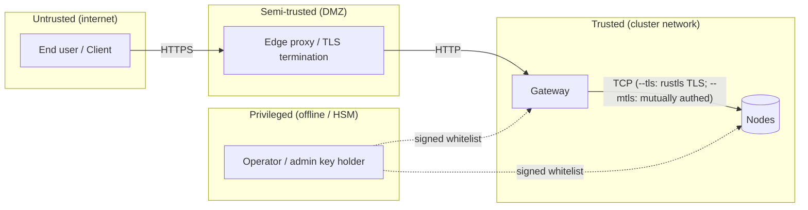

# Bedrohungsmodell

> ⚠ **Translation may be stale.** This file was last synced before Stage 12-15 (versioning + deletion, HNSW-backed semantic search, /spotlight ROI, streaming /holo, /diff, /similar, auto-repair-on-read, background scrub, typed RPC layer with timeouts + NoLiveNodes panic-fix, per-folder inline upload). The English source under [../](../) is the canon for any new feature; the [Unreleased] block of [../../CHANGELOG.md](../../CHANGELOG.md) lists every delta this translation does not yet cover.

Dieses Dokument zählt die **Angreifer**, **Schutzgüter**,
**Vertrauensannahmen** und **Gegenmaßnahmen** für ein holofs-Deployment auf.
Es verwendet die STRIDE-Taxonomie
([Howard & LeBlanc 2003](https://learn.microsoft.com/en-us/azure/security/develop/threat-modeling-tool-threats))
zur Klassifizierung von Bedrohungen und die [LINDDUN](https://linddun.org/)-
Brille für Datenschutzbedenken.

## Inhalt

1. [Geltungsbereich und Schutzgüter](#1-scope-and-assets)
2. [Vertrauensgrenzen](#2-trust-boundaries)
3. [Angreifer-Katalog](#3-adversary-catalogue)
4. [STRIDE-Analyse](#4-stride-analysis)
5. [Datenschutz-Analyse (LINDDUN)](#5-privacy-linddun-analysis)
6. [Nicht-Ziele und ausdrückliche Einschränkungen](#6-non-goals-and-explicit-limitations)
7. [Restrisiko-Register](#7-residual-risk-register)

---

## 1. Geltungsbereich und Schutzgüter

### 1.1. Im Geltungsbereich

Das betrachtete System ist ein holofs-Cluster, wie in
[architecture.md](./architecture.md) beschrieben:

- HTTP-gateway (Binary `holofs-web`, axum + Leptos SSR).
- node-Daemons (Binary `holofs-node`), 1..N pro Host.
- Das Wire-Protokoll zwischen ihnen (siehe
  [api.md §2](./api.md#2-wire-protocol-tcp)).
- On-Disk-Zustand (shards, manifests, Katalog, whitelist).
- Die signierte whitelist + Ed25519-Identitätsmaterial.

### 1.2. Außerhalb des Geltungsbereichs

- Der Betriebssystem-Kernel und der Hypervisor.
- Der TLS-terminierende Reverse-Proxy (falls extern verwendet).
- Der Browser / die Client-Anwendung des Nutzers.
- Seitenkanäle, die durch gemeinsam genutzte CPU-Caches mit Co-Tenants
  entstehen (Gegenmaßnahme: dedizierte nodes für sensible Deployments).
- Physische Angriffe auf das Speichermedium.

### 1.3. Zu schützende Güter

| Schutzgut                      | Vertraulichkeit | Integrität | Verfügbarkeit |
|--------------------------------|:---------------:|:----------:|:-------------:|
| Objekt-Payload                 | ●               | ●          | ●             |
| Objektmetadaten (Name, Art)    | ◐               | ●          | ●             |
| Katalog (Objekt → manifest)    |                 | ●          | ●             |
| Whitelist + Admin-Pubkey       |                 | ●          | ●             |
| Per-node Ed25519-Secret-Keys   | ●               | ●          |               |
| Cluster-Gesundheits- / Liveness-Daten |          | ●          | ◐             |

Legende: ● kritisch, ◐ moderat.

---

## 2. Vertrauensgrenzen

| Grenze             | Authentifizierung               | Verschlüsselung | Härtungshinweise |
|--------------------|---------------------------------|-----------------|------------------|
| Nutzer → Edge      | Anwendungsebene (Cookies, JWT)  | TLS 1.3         | Außerhalb des Geltungsbereichs |
| Edge → Gateway     | Heute keine (geplant: mTLS)     | Keine / mTLS    | gateway an privates VLAN binden |
| Gateway ↔ Node     | Ed25519 Challenge-Response (+ optional mTLS) | Plain TCP, oder rustls TLS via `--tls` (Stage 6) | Wire-Protokoll-nonce + signierter Handshake; `--mtls` ergänzt X.509-Zertifikatsverifikation |
| Operator → Cluster | Admin-Ed25519 signiert whitelist | Out-of-band    | Admin-Schlüssel offline / HSM verwahren |

---

## 3. Angreifer-Katalog

| Angreifer                  | Position                            | Ziel                              | Fähigkeit       |
|----------------------------|-------------------------------------|-----------------------------------|-----------------|
| **Externer anonymer**      | Öffentliches Internet               | Objekte lesen / löschen, DoS      | Netzwerk + L7   |
| **Kompromittierter Client** | Hält eine gültige HTTP-Session     | Daten anderer Nutzer exfiltrieren | L7              |
| **Netzwerk-Beobachter**    | Auf dem Pfad zwischen gateway/nodes | Verkehr lesen, Replay, MITM       | L3 / L4         |
| **Kompromittierter node**  | Hält gültigen node-Schlüssel        | Falsche Daten ausliefern, Audit verweigern | Wire-Protokoll |
| **Sybil-node**             | Besitzt keinen Schlüssel, versucht aber beizutreten | Platzierung / dedup verfälschen | Wire-Protokoll |
| **Kompromittierter Operator** | Hat Admin-Schlüssel              | Volle Cluster-Kontrolle           | Vollständig     |
| **Insider-Lesen**          | Dateisystem-Lesen auf einem node-Host | shards / Metadaten lesen        | OS-Shell        |
| **Zwang / Vorladung**      | Rechtlicher Zwang gegen Operatoren  | Spezifisches Objekt wiederherstellen | Rechtlich    |

Der Angreifer, der den größten Modellierungsaufwand verdient, ist der
**kompromittierte node**: ein vollständig authentifizierter Peer, der sich
selektiv falsch verhält. Die meisten Gegenmaßnahmen in diesem Dokument
zielen auf ihn ab.

---

## 4. STRIDE-Analyse

### 4.1. Spoofing

| # | Bedrohung                                           | Gegenmaßnahme |
|---|-----------------------------------------------------|---------------|
| S1 | Angreifer gibt sich als node aus, um shards zu erhalten | Ed25519-Challenge (`AuthChallenge`) — gateway verifiziert die Signatur mit dem whitelist-Pubkey, bevor es einer Antwort vertraut. Siehe [api.md §2 handshake](./api.md#authentication-handshake). |
| S2 | Angreifer gibt sich als gateway gegenüber einem node aus | Mit `--mtls` betreiben: der node lehnt jeden TLS-Handshake ab, dessen Client-Zertifikat nicht von der gemeinsamen CA signiert ist. Ohne `--mtls` zurückfallen auf Private-VLAN-Deployment. |
| S3 | Gefälschtes whitelist-Update                       | Die whitelist ist mit dem Admin-Ed25519-Schlüssel signiert; nodes lehnen unsignierte oder falsch signierte Updates ab. |
| S4 | Replay einer erfassten Antwort                      | Per-Request-nonce in `AuthChallenge` stellt sicher, dass Signaturen an eine frische Challenge binden. Wire-Frames tragen noch keine Replay-nonce für Nicht-Handshake-Nachrichten — siehe [§7](#7-residual-risk-register). |

### 4.2. Tampering

| # | Bedrohung                                           | Gegenmaßnahme |
|---|-----------------------------------------------------|---------------|
| T1 | Node liefert korrupten Shard-Payload zurück        | Die Identität jedes shards ist `SHA-256(coeffs ‖ payload)`. Das gateway berechnet ihn neu; ein Mismatch wird abgelehnt und zählt gegen `reputation`. |
| T2 | Node liefert einen anderen shard als angefordert   | Das manifest listet `shard_hashes[c][l][idx]`; das gateway verifiziert, dass der Hash mit dem erwarteten Eintrag übereinstimmt. |
| T3 | On-Disk-Korruption (Bitrot)                        | Shard-Dateinamen *sind* ihre Hashes — der Start-Scan und die Hintergrund-`Audit`-Task erkennen Mismatches und lösen RLNC-Reparatur aus. |
| T4 | Modifikation der Katalog-Datei                     | Katalog-Schreibvorgänge sind `write-tmp+fsync+rename`. Die Merkle-Wurzel in jedem manifest überprüft alle shards gegenseitig; geänderte Katalog-Einträge zeigen sich als Decode-Fehler. |
| T5 | MITM modifiziert Wire-Bytes                        | Mit `--tls` betreiben: rustls (TLS 1.2/1.3 via den `ring`-Provider) authentifiziert den Server und verschlüsselt jedes Frame. Die Shard-Hash-Verifikation bleibt als Defense-in-Depth-Check innerhalb des TLS-Tunnels bestehen. |

### 4.3. Repudiation

| # | Bedrohung                                           | Gegenmaßnahme |
|---|-----------------------------------------------------|---------------|
| R1 | Node bestreitet, eine falsche Antwort geliefert zu haben | Der Reputationswert wird serverseitig aus auditierbaren Hash-Mismatches aktualisiert; das Ops-Dashboard verzeichnet pro node `audit_fail_total`. |
| R2 | Operator bestreitet eine Admin-Aktion              | Whitelist-Updates tragen die Ed25519-Signatur des Admins; die *committete* whitelist-Datei ist der Audit-Trail. |

### 4.4. Informationspreisgabe

| # | Bedrohung                                           | Gegenmaßnahme |
|---|-----------------------------------------------------|---------------|
| I1 | Ein einzelner node liest "seine" shards und enthüllt Klartext | Ein einzelner shard ist `coeffs · chunks` über GF(2⁸), eine zufällige lineare Kombination von Chunks. Klartext aus weniger als `K` unabhängigen shards zu gewinnen, erfordert das Lösen eines unterbestimmten linearen Systems — informationstheoretisch undurchführbar **für einen einzelnen zufälligen shard**. |
| I2 | Angreifer sammelt ≥ K shards eines Objekts         | RLNC über öffentlichem GF(2⁸) ist **kein** Verschlüsselungsschema. Beliebige K linear unabhängige shards rekonstruieren den Payload. Gegenmaßnahme: **At-Rest-Verschlüsselung pro node** (geplant in Stage 7) und **Platzierungsdiversität** — unter `RendezvousZoneAware` umfassen K shards ≥ K verschiedene nodes in ≥ ⌈K/zone_count⌉ Zonen, sodass deren Auslesen die Kompromittierung entsprechend vieler erfordert. |
| I3 | Metadaten-Leak: Name + Art + Größe                 | Das manifest speichert Objektname und Content-Type im Klartext. Sensible Deployments sollten Namen vor dem Hochladen hashen oder pseudonymisieren. |
| I4 | Seitenkanäle (Cache, Netzwerk-Timing)              | In 0.1 nicht gemindert — dedizierte CPUs / dediziertes Netzwerk für sensible Deployments. |
| I5 | Backup-Leak                                        | Backups erben dieselbe Bedrohung: sie müssen verschlüsselt at rest gespeichert werden (`restic --pass-file`, S3 SSE-KMS). |
| I6 | Holoshare-Leak                                     | Eine einzelne `.holoshare`-Datei ist ein Anteil eines `(k,n)` Shamir-via-RLNC-Splits. Der Besitz von weniger als `k` ist informationstheoretisch sicher (siehe [theory.md §8](./theory.md#8-shamir-via-rlnc-key-escrow)). |

### 4.5. Denial of Service

| # | Bedrohung                                           | Gegenmaßnahme |
|---|-----------------------------------------------------|---------------|
| D1 | Gateway mit Uploads fluten                         | Das gateway muss hinter einem ratenbegrenzenden Reverse-Proxy laufen. Die Wire-Frame-Größe ist auf `MAX_FRAME = 64 MiB` auf jedem node begrenzt. |
| D2 | Ein einzelner node verweigert Anfragen             | RLNC besitzt ≥ K-of-N Redundanz pro Schicht. Die Repair-Task erkennt und stellt shards auf lebenden nodes wieder her. |
| D3 | Koordinierter Halb-Cluster-Ausfall                 | Die Marge ist für **jede einzelne Zone + verstreute Einzelausfälle** dimensioniert (siehe [theory.md §3](./theory.md#3-priority-layers)). Größere Ausfälle degradieren graziös: L3 (kosmetisches Detail) geht zuerst verloren, dann L2, L1. |
| D4 | "Schläfer"-node nimmt Puts entgegen, gibt aber nie Gets zurück | Die Audit-Task sendet zufällige `Audit(shard_hash)`-Sonden — ein nicht reagierender oder falsch antwortender node verliert Reputation und wird nicht mehr für Platzierungen ausgewählt. |
| D5 | Slow-Loris auf TCP                                 | Tokio-I/O-Timeouts bei jedem Frame-Read; konfigurierbar via `HOLOFS_WIRE_TIMEOUT`. |
| D6 | Speichererschöpfung durch riesigen Frame           | Frames > `MAX_FRAME` werden vor der Allokation abgelehnt. |

### 4.6. Rechteausweitung

| # | Bedrohung                                           | Gegenmaßnahme |
|---|-----------------------------------------------------|---------------|
| E1 | Sybil: Angreifer startet N gefälschte nodes, um Daten aufzunehmen | nodes werden nur beigetreten, wenn ihr Pubkey in der admin-signierten whitelist erscheint. Das Erzeugen gültiger Schlüssel hilft nicht — sie müssen zugelassen werden. |
| E2 | Kompromittiertes gateway greift auf alles zu       | Das gateway besitzt keinen Admin-Schlüssel; es kann keine neuen whitelist-Einträge erzeugen. Die Kompromittierung betrifft Ingress/Egress und Katalog-Aktualität, kann aber den Vertrauensanker nicht untergraben. |
| E3 | Kompromittierter Admin-Schlüssel                   | Dies ist eine totale Kompromittierung. Gegenmaßnahme: Admin-Schlüssel offline halten (HSM / Papier-Backup), per Dual-Control-Prozedur rotieren. |
| E4 | Privilegienerweiterung innerhalb des Containers    | Container läuft als `uid 10001`, `readOnlyRootFilesystem: true`, `capabilities.drop: [ALL]`. |
| E5 | Path-Traversal in Objektnamen                      | Objektnamen werden nur im Katalog gespeichert; On-Disk-Pfade sind inhaltsadressiert (`<hex2>/<hex62>.shard`). Der Objektname erreicht niemals das Dateisystem. |

---

## 5. Datenschutz-Analyse (LINDDUN)

Holofs ist **kein** datenschutzwahrendes Dateisystem nach Entwurf — es
priorisiert Dauerhaftigkeit, Dedup und Resilienz. Im Folgenden sind
Oberflächen aufgeführt, die Operatoren berücksichtigen müssen.

| LINDDUN-Kategorie   | Bedenken                                | Operator-Aktion |
|---------------------|------------------------------------------|-----------------|
| **L**inkability     | MinHash-Skizzen verraten Text-Ähnlichkeit; perzeptuelle Hashes verknüpfen nahezu duplikate Bilder. | Analytics-Endpunkte (`/similar`, `/diff`) für datenschutzsensible Tenants deaktivieren. |
| **I**dentifiability | Objektnamen werden wörtlich gespeichert. | Namen clientseitig hashen / pseudonymisieren. |
| **N**on-repudiation | Audit-Logs identifizieren nodes, die Inhalte ausliefern. | In vertrauenswürdigen Ops-Kontexten akzeptabel. |
| **D**etectability   | Die Existenz eines Objekts ist aus `/api/stats` ableitbar. | Nur authentifiziertes `/api/stats`. |
| **D**isclosure      | Siehe §4.4 — I1–I6.                     | Stage-7-At-Rest-Verschlüsselung. |
| **U**nawareness     | Dedup bedeutet, dass der Upload *eines anderen Tenants* dieselbe `data_cid` erzeugen kann. | Single-Tenant-Deployments nur dann, wenn dies relevant ist. |
| **N**oncompliance   | DSGVO "Recht auf Löschung" — `DELETE /<name>` sendet `Purge` an alle nodes; aber **shards könnten off-site gesichert worden sein**. | Backup-Aufbewahrung dokumentieren; `holofs-admin shred` für forensische Löschung freigeben. |

---

## 6. Nicht-Ziele und ausdrückliche Einschränkungen

Folgendes wird von holofs 0.1 **nicht** angeboten und erfordert externe
Kontrollen, falls benötigt:

1. **Ende-zu-Ende-Verschlüsselung.** Payloads werden codiert, aber nicht
   verschlüsselt gespeichert. Ein node mit ≥ K shards eines Objekts kann es
   rekonstruieren. Operatoren müssen holofs als "Daten im Klartext" at rest
   einstufen.
2. **Tenant-Isolation.** Es gibt keinen pro-Nutzer-Namespace; alle Objekte
   teilen sich einen einzigen Katalog. Multi-Tenant-Deployments müssen
   holofs mit einem autorisierenden Proxy vorschalten.
3. **Manipulationssicheres Audit-Log.** Reputation erfasst node-Fehlverhalten,
   erzeugt jedoch kein signiertes, nur anhängbares Log.
4. **Kryptografischer Anti-Replay-Schutz auf Wire-Frames.** Nur die
   `AuthChallenge` trägt eine nonce. Stage 7 fügt Per-Session-Keying hinzu.
5. **Quanten-Resistenz.** Ed25519 und SHA-256 sind pre-quantum. Stage 8
   evaluiert PQ-Migration.

---

## 7. Restrisiko-Register

| Risiko                                              | Schwere   | Wahrscheinlichkeit | Kompensierende Kontrolle |
|-----------------------------------------------------|:---------:|:------------------:|---------------------------|
| Wire-Verkehr im Klartext auf gemeinsamem LAN        | Niedrig   | Niedrig            | Durch `--tls` (rustls TLS 1.2/1.3, Stage 6) gemildert. Operatoren, die `--tls` nicht setzen, sollten auf ein privates VLAN beschränken. |
| Kompromittierung des Admin-Schlüssels               | Kritisch  | Niedrig            | Offline-Speicherung; vierteljährliche Rotations-Übung |
| Wire-Frame-Replay (Nicht-Handshake)                 | Mittel    | Niedrig            | Hash-Bindung begrenzt Schaden auf Integrität, nicht Vertraulichkeit |
| Seitenkanalangriffe auf gemeinsamer CPU             | Mittel    | Niedrig            | Dedizierte nodes für sensible Workloads |
| Backup-Leak                                         | Hoch      | Mittel             | Backups verschlüsseln (`restic`, SSE-KMS) |
| DSGVO-Löschung unvollständig aufgrund von Backups   | Mittel    | Mittel             | Dokumentierte Aufbewahrungsrichtlinie + Kundenoffenlegung |
| Operator-Kompromittierung über Supply Chain         | Hoch      | Niedrig            | Reproduzierbare Builds + signierte Releases (Stage 8) |

Jedes Risiko hat einen Owner (`@holofs/security`) und ein geplantes
Gegenmaßnahmen-Release. Verfolgung über GitHub-Issues mit Label `security`.
