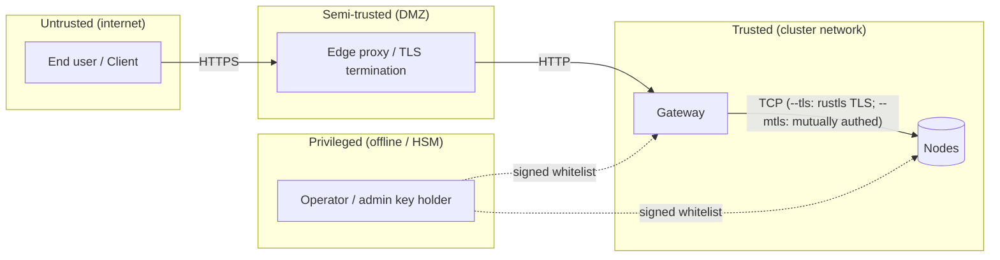

# Bedrohungsmodell

Dieses Dokument zählt die **Angreifer**, **Schutzgüter**,
**Vertrauensannahmen** und **Gegenmaßnahmen** für ein holofs-Deployment auf.
Es verwendet die STRIDE-Taxonomie
([Howard & LeBlanc 2003](https://learn.microsoft.com/en-us/azure/security/develop/threat-modeling-tool-threats))
zur Klassifizierung von Bedrohungen und die
[LINDDUN](https://linddun.org/)-Brille für Datenschutzbedenken.

## Inhalt

1. [Geltungsbereich und Schutzgüter](#1-geltungsbereich-und-schutzgüter)
2. [Vertrauensgrenzen](#2-vertrauensgrenzen)
3. [Angreifer-Katalog](#3-angreifer-katalog)
4. [STRIDE-Analyse](#4-stride-analyse)
5. [Datenschutz-Analyse (LINDDUN)](#5-datenschutz-analyse-linddun)
6. [Nicht-Ziele und ausdrückliche Einschränkungen](#6-nicht-ziele-und-ausdrückliche-einschränkungen)
7. [Restrisiko-Register](#7-restrisiko-register)

---

## 1. Geltungsbereich und Schutzgüter

### 1.1. Im Geltungsbereich

Das betrachtete System ist ein holofs-Cluster, wie in
[architecture.md](./architecture.md) beschrieben:

- HTTP-Gateway (Binary `holofs-web`, axum + Leptos SSR).
- Node-Daemons (Binary `holofs-node`), 1..N pro Host.
- Das Wire-Protokoll zwischen ihnen (siehe
  [api.md §2](./api.md#2-wire-protokoll-tcp)).
- On-Disk-Zustand (Shards, Manifests, Katalog, Whitelist).
- Die signierte Whitelist + Ed25519-Identitätsmaterial.

### 1.2. Außerhalb des Geltungsbereichs

- Der Betriebssystem-Kernel und der Hypervisor.
- Der TLS-terminierende Reverse-Proxy (falls extern verwendet).
- Der Browser bzw. die Client-Anwendung des Nutzers.
- Seitenkanäle, die durch gemeinsam genutzte CPU-Caches mit Co-Tenants
  entstehen (Gegenmaßnahme: dedizierte Nodes für sensible Deployments).
- Physische Angriffe auf das Speichermedium.

### 1.3. Zu schützende Güter

| Schutzgut                             | Vertraulichkeit | Integrität | Verfügbarkeit |
|---------------------------------------|:---------------:|:----------:|:-------------:|
| Objekt-Payload                        | ●               | ●          | ●             |
| Objektmetadaten (Name, Art)           | ◐               | ●          | ●             |
| Katalog (Objekt → Manifest)           |                 | ●          | ●             |
| Whitelist + Admin-Pubkey              |                 | ●          | ●             |
| Per-Node Ed25519-Secret-Keys          | ●               | ●          |               |
| Cluster-Gesundheits- / Liveness-Daten |                 | ●          | ◐             |

Legende: ● kritisch, ◐ moderat.

---

## 2. Vertrauensgrenzen

| Grenze             | Authentifizierung                            | Verschlüsselung                        | Härtungshinweise |
|--------------------|----------------------------------------------|----------------------------------------|------------------|
| Nutzer → Edge      | Anwendungsebene (Cookies, JWT)               | TLS 1.3                                | Außerhalb des Geltungsbereichs |
| Edge → Gateway     | Heute keine (geplant: mTLS)                  | Keine / mTLS                           | Gateway an privates VLAN binden |
| Gateway ↔ Node     | Ed25519 Challenge-Response (+ optional mTLS) | Plain TCP, oder rustls TLS via `--tls` | Wire-Protokoll-Nonce + signierter Handshake; `--mtls` ergänzt X.509-Zertifikatsverifikation |
| Operator → Cluster | Admin-Ed25519 signiert Whitelist             | Out-of-band                            | Admin-Schlüssel offline / HSM verwahren |

---

## 3. Angreifer-Katalog

| Angreifer                     | Position                                             | Ziel                                       | Fähigkeit       |
|-------------------------------|------------------------------------------------------|--------------------------------------------|-----------------|
| **Externer anonymer**         | Öffentliches Internet                                | Objekte lesen / löschen, DoS               | Netzwerk + L7   |
| **Kompromittierter Client**   | Hält eine gültige HTTP-Session                       | Daten anderer Nutzer exfiltrieren          | L7              |
| **Netzwerk-Beobachter**       | Auf dem Pfad zwischen Gateway/Nodes                  | Verkehr lesen, Replay, MITM                | L3 / L4         |
| **Kompromittierter Node**     | Hält gültigen Node-Schlüssel                         | Falsche Daten ausliefern, Audit verweigern | Wire-Protokoll  |
| **Sybil-Node**                | Besitzt keinen Schlüssel, versucht aber beizutreten  | Platzierung / Dedup verfälschen            | Wire-Protokoll  |
| **Kompromittierter Operator** | Hat Admin-Schlüssel                                  | Volle Cluster-Kontrolle                    | Vollständig     |
| **Insider-Lesen**             | Dateisystem-Lesen auf einem Node-Host                | Shards / Metadaten lesen                   | OS-Shell        |
| **Zwang / Vorladung**         | Rechtlicher Zwang gegen Operatoren                   | Spezifisches Objekt wiederherstellen       | Rechtlich       |

Der Angreifer, der den größten Modellierungsaufwand verdient, ist der
**kompromittierte Node**: ein vollständig authentifizierter Peer, der sich
selektiv falsch verhält. Die meisten Gegenmaßnahmen in diesem Dokument
zielen auf ihn ab.

---

## 4. STRIDE-Analyse

### 4.1. Spoofing

| #  | Bedrohung                                              | Gegenmaßnahme |
|----|--------------------------------------------------------|---------------|
| S1 | Angreifer gibt sich als Node aus, um Shards zu erhalten | Ed25519-Challenge (`AuthChallenge`) — das Gateway verifiziert die Signatur mit dem Whitelist-Pubkey, bevor es einer Antwort vertraut. Siehe [api.md §2 handshake](./api.md#authentifizierungs-handshake). |
| S2 | Angreifer gibt sich als Gateway gegenüber einem Node aus | Mit `--mtls` betreiben: der Node lehnt jeden TLS-Handshake ab, dessen Client-Zertifikat nicht von der gemeinsamen CA signiert ist. Ohne `--mtls` auf ein Private-VLAN-Deployment zurückfallen. |
| S3 | Gefälschtes Whitelist-Update                            | Die Whitelist ist mit dem Admin-Ed25519-Schlüssel signiert; Nodes lehnen unsignierte oder falsch signierte Updates ab. |
| S4 | Replay einer erfassten Antwort                          | Per-Request-Nonce in `AuthChallenge` stellt sicher, dass Signaturen an eine frische Challenge binden. Wire-Frames tragen für Nicht-Handshake-Nachrichten noch keine Replay-Nonce — siehe [§7](#7-restrisiko-register). |

### 4.2. Tampering

| #  | Bedrohung                                          | Gegenmaßnahme |
|----|----------------------------------------------------|---------------|
| T1 | Node liefert korrupten Shard-Payload zurück        | Die Identität jedes Shards ist `SHA-256(coeffs ‖ payload)`. Das Gateway berechnet ihn neu; ein Mismatch wird abgelehnt und zählt gegen `reputation`. |
| T2 | Node liefert einen anderen Shard als angefordert   | Das Manifest listet `shard_hashes[c][l][idx]`; das Gateway verifiziert, dass der Hash mit dem erwarteten Eintrag übereinstimmt. |
| T3 | On-Disk-Korruption (Bitrot)                        | Shard-Dateinamen *sind* ihre Hashes — der Start-Scan und die Hintergrund-`Audit`-Task erkennen Mismatches und lösen RLNC-Reparatur aus. |
| T4 | Modifikation der Katalog-Datei                     | Katalog-Schreibvorgänge sind `write-tmp+fsync+rename`. Die Merkle-Wurzel in jedem Manifest überprüft alle Shards gegenseitig; geänderte Katalog-Einträge zeigen sich als Decode-Fehler. |
| T5 | MITM modifiziert Wire-Bytes                        | Mit `--tls` betreiben: rustls (TLS 1.2/1.3 via den `ring`-Provider) authentifiziert den Server und verschlüsselt jedes Frame. Die Shard-Hash-Verifikation bleibt als Defense-in-Depth-Prüfung innerhalb des TLS-Tunnels bestehen. |

### 4.3. Repudiation

| #  | Bedrohung                                                | Gegenmaßnahme |
|----|----------------------------------------------------------|---------------|
| R1 | Node bestreitet, eine falsche Antwort geliefert zu haben | Der Reputationswert wird serverseitig aus auditierbaren Hash-Mismatches aktualisiert; das Ops-Dashboard verzeichnet pro Node `audit_fail_total`. |
| R2 | Operator bestreitet eine Admin-Aktion                     | Whitelist-Updates tragen die Ed25519-Signatur des Admins; die *committete* Whitelist-Datei ist der Audit-Trail. |

### 4.4. Informationspreisgabe

| #  | Bedrohung                                                     | Gegenmaßnahme |
|----|---------------------------------------------------------------|---------------|
| I1 | Ein einzelner Node liest „seine" Shards und enthüllt Klartext | Ein einzelner Shard ist `coeffs · chunks` über GF(2⁸), eine zufällige lineare Kombination von Chunks. Klartext aus weniger als `K` unabhängigen Shards zu gewinnen, erfordert das Lösen eines unterbestimmten linearen Systems — informationstheoretisch undurchführbar **für einen einzelnen zufälligen Shard**. |
| I2 | Angreifer sammelt ≥ K Shards eines Objekts                    | RLNC über öffentlichem GF(2⁸) ist **kein** Verschlüsselungsschema. Beliebige K linear unabhängige Shards rekonstruieren den Payload. Gegenmaßnahme: **At-Rest-Verschlüsselung pro Node** und **Platzierungsdiversität** — unter `RendezvousZoneAware` umspannen K Shards ≥ K verschiedene Nodes in ≥ ⌈K/zone_count⌉ Zonen, sodass deren Auslesen die Kompromittierung entsprechend vieler erfordert. |
| I3 | Metadaten-Leak: Name + Art + Größe                            | Das Manifest speichert Objektname und Content-Type im Klartext. Sensible Deployments sollten Namen vor dem Upload hashen oder pseudonymisieren. |
| I4 | Seitenkanäle (Cache, Netzwerk-Timing)                         | In 0.1 nicht gemindert — dedizierte CPUs / dediziertes Netzwerk für sensible Deployments. |
| I5 | Backup-Leak                                                   | Backups erben dieselbe Bedrohung: sie müssen at rest verschlüsselt gespeichert werden (`restic --pass-file`, S3 SSE-KMS). |
| I6 | Holoshare-Leak                                                | Eine einzelne `.holoshare`-Datei ist ein Anteil eines `(k,n)` Shamir-via-RLNC-Splits. Der Besitz von weniger als `k` ist informationstheoretisch sicher (siehe [theory.md §8](./theory.md#8-shamir-via-rlnc-schlüsselhinterlegung)). |

### 4.5. Denial of Service

| #   | Bedrohung                                                                | Gegenmaßnahme |
|-----|--------------------------------------------------------------------------|---------------|
| D1  | Gateway mit Uploads fluten                                               | Das Gateway muss hinter einem ratenbegrenzenden Reverse-Proxy laufen. Die Wire-Frame-Größe ist auf jedem Node auf `MAX_FRAME = 64 MiB` begrenzt. |
| D2  | Ein einzelner Node verweigert Anfragen                                   | RLNC besitzt ≥ K-of-N Redundanz pro Schicht. Auto-Repair-on-Read (3) + Hintergrund-Scrub (x) erkennen fehlende Shards und stellen sie auf lebenden Nodes wieder her. |
| D3  | Koordinierter Halb-Cluster-Ausfall                                       | Die Marge ist für **jede einzelne Zone + verstreute Einzelausfälle** dimensioniert (siehe [theory.md §3](./theory.md#3-prioritätsschichten)). Größere Ausfälle degradieren graziös: L3 (kosmetisches Detail) geht zuerst verloren, dann L2, L1. |
| D4  | „Schläfer"-Node nimmt Puts entgegen, gibt aber nie Gets zurück           | Die Audit-Task sendet zufällige `Audit(shard_hash)`-Sonden — ein nicht reagierender oder falsch antwortender Node verliert Reputation und wird nicht mehr für Platzierungen ausgewählt. x change: `MissingShard` wird als neutral behandelt (kein Reputationsabzug), um eine Dedup-Kollisions-Feedback-Schleife zu vermeiden, die zuvor gesunde Nodes aus dem Live-Set verdrängen konnte. |
| D5  | Slow-Loris auf TCP                                                       | Per-RPC-`tokio::time::timeout`-Budget (`HOLOFS_RPC_TIMEOUT_MS`, Default 8 s, `0` deaktiviert). Ein RPC mit Timeout vergiftet den gepoolten Stream und wird einmal auf einem frischen Socket via `is_likely_transient` erneut versucht. Begrenzt die vom Nutzer sichtbare Latenz auf 8 s + einen Retry statt des OS-Level-TCP-Timeouts von 60–75 s. |
| D6  | Speichererschöpfung durch riesigen Frame                                 | Frames > `MAX_FRAME` werden vor der Allokation abgelehnt. |
| D7  | Alle Nodes gleichzeitig dunkel (z. B. Boot-Race, flottenweites Deployment) | x: `placement::place` gibt `Result<_, NoLiveNodes>` zurück, statt zu asserten; das Gateway meldet ein sauberes `503 ServiceUnavailable` (`GatewayError::ClusterDegraded`) anstatt zu panicken. Zuvor konnte ein einzelnes untypisiertes `assert!` in `place_shard` den Gateway-Prozess durch ein einzelnes PUT während eines flottenweiten Ausfalls zum Absturz bringen. |
| D8  | Flut gleichzeitiger Requests erschöpft axum-Runtime                      | MEDIUM- (Default-Cap 64) und LONG- (Default-Cap 8) Route-Buckets tragen einen `tokio::sync::Semaphore`-Guard. Bei Sättigung liefert die Middleware sofort `503 Service Unavailable` zurück (statt Tasks auf die Runtime aufzustapeln). Konfigurierbar via `HOLOFS_MEDIUM_CONCURRENCY` / `HOLOFS_LONG_CONCURRENCY`. Ablehnungen zählen auf `holofs_backpressure_rejected_total{bucket}`. |
| D9  | Langsamer Handler blockiert die axum-Task-Queue                          | Per-Bucket-Deadlines (SHORT 10 s / MEDIUM 60 s / LONG 5 min), erzwungen durch eine `tokio::time::timeout`-Middleware. Bei Ablauf → `504 Gateway Timeout`; `holofs_handler_timeouts_total{bucket}` wird inkrementiert. Streaming-Endpunkte + MCP sind bewusst ohne Budget. |
| D10 | Stiller Kill einer Hintergrundschleife durch Panic                       | Jede lang laufende Schleife (Monitor / Auditor / Scrub / Reputation-Persist) wird innerhalb von `supervised_spawn` gestartet, das Panics via `JoinError` abfängt und mit exponentiellem Backoff (1 → 30 s) neu startet. Restarts zählen auf `holofs_supervised_task_restarts_total{task}`. |

### 4.6. Rechteausweitung

| #  | Bedrohung                                                            | Gegenmaßnahme |
|----|----------------------------------------------------------------------|---------------|
| E1 | Sybil: Angreifer startet N gefälschte Nodes, um Daten aufzunehmen    | Nodes werden nur aufgenommen, wenn ihr Pubkey in der admin-signierten Whitelist erscheint. Das Erzeugen gültiger Schlüssel hilft nicht — sie müssen zugelassen werden. |
| E2 | Kompromittiertes Gateway greift auf alles zu                         | Das Gateway besitzt keinen Admin-Schlüssel; es kann keine neuen Whitelist-Einträge erzeugen. Die Kompromittierung betrifft Ingress/Egress und Katalog-Aktualität, kann aber den Vertrauensanker nicht untergraben. |
| E3 | Kompromittierter Admin-Schlüssel                                     | Dies ist eine totale Kompromittierung. Gegenmaßnahme: Admin-Schlüssel offline halten (HSM / Papier-Backup), per Dual-Control-Prozedur rotieren. |
| E4 | Privilegienerweiterung innerhalb des Containers                      | Container läuft als `uid 10001`, `readOnlyRootFilesystem: true`, `capabilities.drop: [ALL]`. |
| E5 | Path-Traversal in Objektnamen                                        | Objektnamen werden nur im Katalog gespeichert; On-Disk-Pfade sind inhaltsadressiert (`<hex2>/<hex62>.shard`). Der Objektname erreicht niemals das Dateisystem. |
| E6 | Nicht authentifizierter Aufrufer killt Nodes / löst clusterweite GC aus | `POST /admin/node` (kill/revive) und `POST /api/gc` erfordern `Authorization: Bearer $HOLOFS_ADMIN_TOKEN`, wenn die Umgebungsvariable gesetzt ist. Fehlend → 401, falsch → 401, Env nicht gesetzt → **403 (Oberfläche deaktiviert)** als sicheres Default-Verhalten. Der Dev-Override `HOLOFS_ADMIN_UNAUTHENTICATED=1` öffnet die Endpunkte wieder und protokolliert beim Start eine WARN. Ablehnungen aufgeschlüsselt nach Grund in `holofs_admin_auth_failures_total{outcome}`. |

---

## 5. Datenschutz-Analyse (LINDDUN)

Holofs ist **kein** datenschutzwahrendes Dateisystem nach Entwurf — es
priorisiert Dauerhaftigkeit, Dedup und Resilienz. Im Folgenden sind
Oberflächen aufgeführt, die Operatoren berücksichtigen müssen.

| LINDDUN-Kategorie   | Bedenken                                                                          | Operator-Aktion |
|---------------------|-----------------------------------------------------------------------------------|-----------------|
| **L**inkability     | MinHash-Skizzen verraten Text-Ähnlichkeit; perzeptuelle Hashes verknüpfen nahezu duplikate Bilder. | Analytics-Endpunkte (`/similar`, `/diff`) für datenschutzsensible Tenants deaktivieren. |
| **I**dentifiability | Objektnamen werden wörtlich gespeichert.                                          | Namen clientseitig hashen / pseudonymisieren. |
| **N**on-repudiation | Audit-Logs identifizieren Nodes, die Inhalte ausliefern.                          | In vertrauenswürdigen Ops-Kontexten akzeptabel. |
| **D**etectability   | Die Existenz eines Objekts ist aus `/api/stats` ableitbar.                        | Nur authentifiziertes `/api/stats`. |
| **D**isclosure      | Siehe §4.4 — I1–I6.                                                               | At-Rest-Verschlüsselung. |
| **U**nawareness     | Dedup bedeutet, dass der Upload *eines anderen Tenants* dieselbe `data_cid` erzeugen kann. | Single-Tenant-Deployments nur dann, wenn dies relevant ist. |
| **N**oncompliance   | DSGVO „Recht auf Löschung" — `DELETE /<name>` sendet `Purge` an alle Nodes; aber **Shards könnten off-site gesichert worden sein**. | Backup-Aufbewahrung dokumentieren; `holofs-admin shred` für forensische Löschung freigeben. |

---

## 6. Nicht-Ziele und ausdrückliche Einschränkungen

Folgendes wird von holofs 0.1 **nicht** angeboten und erfordert externe
Kontrollen, falls benötigt:

1. **Ende-zu-Ende-Verschlüsselung.** Payloads werden codiert, aber nicht
   verschlüsselt gespeichert. Ein Node mit ≥ K Shards eines Objekts kann
   es rekonstruieren. Operatoren müssen holofs als „Daten im Klartext" at
   rest einstufen.
2. **Tenant-Isolation.** Es gibt keinen Per-Nutzer-Namespace; alle
   Objekte teilen sich einen einzigen Katalog. Multi-Tenant-Deployments
   müssen holofs einen autorisierenden Proxy vorschalten.
3. **Manipulationssicheres Audit-Log.** Reputation erfasst
   Node-Fehlverhalten, erzeugt jedoch kein signiertes, nur anhängbares
   Log.
4. **Kryptografischer Anti-Replay-Schutz auf Wire-Frames.** Nur die
   `AuthChallenge` trägt eine Nonce. Fügt Per-Session-Keying hinzu.
5. **Quanten-Resistenz.** Ed25519 und SHA-256 sind pre-quantum.
   Evaluiert PQ-Migration.

---

## 7. Restrisiko-Register

| Risiko                                              | Schwere   | Wahrscheinlichkeit | Kompensierende Kontrolle |
|-----------------------------------------------------|:---------:|:------------------:|---------------------------|
| Wire-Verkehr im Klartext auf gemeinsamem LAN        | Niedrig   | Niedrig            | Durch `--tls` (rustls TLS 1.2/1.3) gemildert. Operatoren, die `--tls` nicht setzen, sollten auf ein privates VLAN beschränken. |
| Kompromittierung des Admin-Schlüssels               | Kritisch  | Niedrig            | Offline-Speicherung; vierteljährliche Rotations-Übung |
| Wire-Frame-Replay (Nicht-Handshake)                 | Mittel    | Niedrig            | Hash-Bindung begrenzt Schaden auf Integrität, nicht Vertraulichkeit |
| Seitenkanalangriffe auf gemeinsamer CPU             | Mittel    | Niedrig            | Dedizierte Nodes für sensible Workloads |
| Backup-Leak                                         | Hoch      | Mittel             | Backups verschlüsseln (`restic`, SSE-KMS) |
| DSGVO-Löschung unvollständig aufgrund von Backups   | Mittel    | Mittel             | Dokumentierte Aufbewahrungsrichtlinie + Kundenoffenlegung |
| Operator-Kompromittierung über Supply Chain         | Hoch      | Niedrig            | Reproduzierbare Builds + signierte Releases |

Jedes Risiko hat einen Owner (`@holofs/security`) und ein geplantes
Gegenmaßnahmen-Release. Verfolgung über GitHub-Issues mit Label
`security`.
