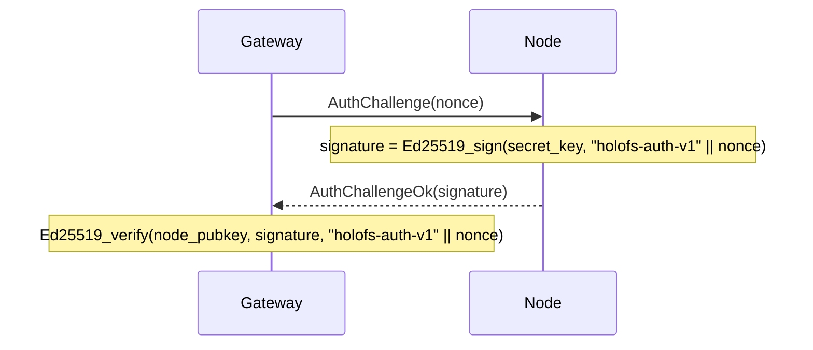

# Referencia de la API

Tres interfaces externas: **gateway HTTP**, **protocolo de cable de nodo**
y **formatos de archivo en disco** (manifiesto, catálogo, shard,
whitelist, holoshare).

## Contenido

1. [Gateway HTTP](#1-gateway-http)
2. [Protocolo de cable (TCP)](#2-protocolo-de-cable-tcp)
3. [Formatos en disco](#3-formatos-en-disco)
4. [Convenciones de cabeceras de respuesta](#4-convenciones-de-cabeceras-de-respuesta)
5. [Servidor MCP](#5-servidor-mcp)
6. [Operaciones wavelet](#6-operaciones-wavelet)

---

## 1. Gateway HTTP

URL base: `http://<addr>:8787/` (HTTPS vía el propio andamiaje TLS del
gateway desde `HOLOFS_TLS=1`, mTLS vía `HOLOFS_MTLS=1`).

> Las rutas están separadas por barras y son direccionables como
> comodines (`/photos/2026/img.jpg`). Los segmentos reservados de
> nivel superior — `api`, `health`, `escrow`, `preview`, `inspect`,
> `similar`, `diff`, `admin`, `metrics`, `pkg`, `help`, `inspect-zoom` —
> no pueden usarse como primer segmento de una ruta de objeto porque
> ocultan rutas reales.

> `GET /<path>` y `GET /preview/<path>` honran la cabecera de petición
> `Range:` según RFC 9110 §14.2. Un único rango de bytes satisfacible
> devuelve `206 Partial Content` con `Content-Range`. El objeto se
> decodifica completamente del lado del servidor y la respuesta es una
> porción del buffer resultante (el streaming progresivo por capas no
> está implementado). Las peticiones multi-rango recaen en un `200`
> con el cuerpo completo; las cabeceras mal formadas se ignoran.
> `Range: bytes=A-B` pasado EOF responde `416` con
> `Content-Range: bytes */<total>`.

### CRUD del catálogo

| Método   | Ruta                        | Descripción                                 | Cuerpo / parámetros |
|----------|-----------------------------|---------------------------------------------|---------------------|
| `GET`    | `/`                         | HTML del catálogo; lee `?p=<prefix>` para el directorio a listar | —             |
| `GET`    | `/<path>`                   | Descargar objeto en forma canónica. Honra `Range` — `206` en parcial, `416` en no satisfacible. | Range soportado |
| `GET`    | `/preview/<path>`           | Preview grueso (solo L0). Range honrado contra el cuerpo dimensionado por preview. | Range soportado |
| `PUT`    | `/<path>`                   | Subir bytes crudos, tipo auto-detectado. El directorio padre debe existir (vía `mkdir`) | cuerpo = archivo |
| `DELETE` | `/<path>`                   | Eliminar objeto + Purge en todos los nodos. Rehúsa entradas de directorio (usar `rmdir`) | —             |

### Operaciones de directorio

Dos variantes de cada mutación de catálogo: una variante JSON con
comodín para llamadores programáticos / `curl`, y un POST form-urlencoded
que los formularios HTML de la UI pueden invocar sin JavaScript. Las
variantes form redirigen 303 a `/?p=<parent>` para que el navegador
navegue de vuelta al directorio que el usuario estaba viendo.

| Método   | Ruta                        | Descripción                                                 | Cuerpo / parámetros           |
|----------|-----------------------------|-------------------------------------------------------------|-------------------------------|
| `POST`   | `/api/mkdir/<path>`         | Crear un marcador `Directory`. El padre debe existir.       | — (respuesta JSON)            |
| `POST`   | `/api/mkdir`                | mkdir compatible con form; redirige a `/?p=<parent>`        | `parent=…&name=…`             |
| `DELETE` | `/api/rmdir/<path>`         | Eliminar directorio vacío. 409 si tiene hijos.              | — (respuesta JSON)            |
| `POST`   | `/api/rmdir`                | rmdir compatible con form; redirige en éxito                | `path=…`                      |
| `POST`   | `/api/mv`                   | Renombrar / mover; los directorios arrastran cada descendiente | `from=…&to=…`               |
| `POST`   | `/api/list_dir`             | Función de servidor Leptos: hijos inmediatos de `prefix` (JSON-RPC) | `{"prefix":"…"}`      |

Mapeo de códigos de estado para las ops de directorio:

| Resultado                                | Estado | `GatewayError`           |
|------------------------------------------|--------|--------------------------|
| OK                                       | 200 / 201 / 303 | —               |
| Destino ya existe                        | 409    | `AlreadyExists`          |
| La ruta existe pero no es un directorio  | 409    | `NotADirectory`          |
| `rmdir` sobre un directorio no vacío     | 409    | `DirectoryNotEmpty`      |
| `GET`/`DELETE` de una entrada `Directory`| 409    | `IsDirectory`            |
| Ruta mal formada (`..`, `//`, `/` inicial) | 400  | `BadRequest`             |
| Directorio padre faltante                | 400    | `BadRequest`             |
| Entrada desconocida                      | 404    | `NotFound`               |

#### Respuesta por tipo

| Tipo      | `GET /<path>` devuelve                                       |
|-----------|--------------------------------------------------------------|
| image     | `image/png` (re-codificado de canales f32)                   |
| audio     | `audio/wav` (PCM 16-bit, mono/estéreo según almacenado)      |
| text      | tipo de contenido de texto por extensión, el cuerpo incluye marcadores de hueco si faltan shards |
| opaque    | tipo de contenido original + `Content-Disposition: attachment` |
| directory | `409 Conflict` — los directorios no tienen payload           |

### Salud del clúster

| Método | Ruta                   | Descripción                                    |
|--------|------------------------|------------------------------------------------|
| `GET`  | `/health`              | Tabla por nodo, botones kill/revive            |
| `GET`  | `/health/<name>`       | Margen por (canal, capa), simulación de pérdida Monte-Carlo, tabla de fallo de zona |
| `GET`  | `/api/stats`           | JSON: contadores de objetos por tipo, shards, % dedup |
| `POST` | `/admin/node` (`i=N`)  | Toggle del nodo N (excluido/restaurado por admin). **Con puerta admin-auth** — requiere `Authorization: Bearer $HOLOFS_ADMIN_TOKEN` cuando la env var está definida. |

`/api/stats` devuelve:

```json
{
  "nodes_total": 40,
  "nodes_live": 38,
  "objects_total": 14,
  "objects_by_kind": {"image": 7, "audio": 3, "text": 1, "opaque": 1, "directory": 2},
  "shards_total": 5328,
  "shards_unique": 5326,
  "dedup_savings_pct": 0.04,
  "bytes_total": 50266112,
  "auto_repairs_total": 0,
  "auto_repair_failures_total": 0,
  "scrub_runs_total": 8,
  "scrub_repairs_total": 0
}
```

`objects_total = sum(objects_by_kind)`; los marcadores `directory` se
cuentan pero no contribuyen nada a `shards_total` / `bytes_total`.

Los cuatro contadores finales exponen actividad de auto-curación:

- `auto_repairs_total` — GETs que dispararon el brazo de reintento
  `decode_with_autorepair` (LayerLost en el primer decode →
  repair_object_inplace → segundo decode).
- `auto_repair_failures_total` — pase de auto-reparación que a su vez
  falló (muy pocos donantes, segundo decode aún LayerLost, etc.).
- `scrub_runs_total` — ticks del scrub en segundo plano completados
  (`HOLOFS_SCRUB_INTERVAL`, por defecto 600 s).
- `scrub_repairs_total` — objetos que el scrub reparó *antes* de que
  cualquier usuario los encontrara.

Un clúster sano mantiene los cuatro en cero o cerca de cero; una tasa
sostenida no cero en `auto_repair_failures_total` es la señal de
alerta del operador.

#### `GET /metrics` — Exposición Prometheus

Cuerpo `text/plain; version=0.0.4` — cada gauge / counter emite líneas
`# HELP` + `# TYPE`. Véase
[`docs/es/operations.md § 6.1`](./operations.md#61-endpoint-de-metricas)
para el catálogo completo de métricas, etiquetas e interpretación.
Contadores de fiabilidad que vale la pena señalar:

- `holofs_catalog_persist_failures_total` — errores de escritura a
  disco en el guardado atómico del catálogo.
- `holofs_handler_timeouts_total{bucket="short|medium|long"}` —
  respuestas 504.
- `holofs_backpressure_rejected_total{bucket="medium|long"}` —
  respuestas 503 en saturación del semáforo.
- `holofs_backpressure_permits_available{bucket="medium|long"}` —
  gauge de permisos aún libres.
- `holofs_supervised_task_restarts_total{task="monitor|auditor|scrub"}`
  — reinicios de bucle supervisado por pánico.
- `holofs_admin_auth_failures_total{outcome="missing|bad|disabled"}` —
  rechazos de bearer-token admin divididos por razón.

`/metrics` vive en el bucket de ruta SHORT y hereda la deadline de
10 s; una respuesta lenta de `/metrics` es en sí misma una señal de
alerta.

### Búsqueda y analítica

| Método | Ruta                          | Descripción                                    |
|--------|-------------------------------|------------------------------------------------|
| `GET`  | `/similar/<path>`             | Top-10 objetos similares + overlap cross-objeto |
| `GET`  | `/diff?a=<a>&b=<b>`           | Visualización de diff por chunk. Dos rutas de objeto no caben en una única ruta, así que se movieron al query string |
| `GET`  | `/api/fingerprint/<path>`     | JSON: hash perceptual de 16 bytes (image/audio) o primeros 16 del CID (text/opaque) |

`/api/fingerprint/<name>` devuelve:

```json
{
  "name": "photo.png",
  "fingerprint": "a3f08c7d12...",
  "kind": "image"
}
```

### Inspección de shards

El triple `c_l_idx` identifica un shard dentro de un objeto como
`<channel>_<layer>_<idx>`. La URL coloca el triple fijo delante de la
ruta de objeto con comodín.

| Método | Ruta                                                      | Descripción |
|--------|-----------------------------------------------------------|-------------|
| `GET`  | `/inspect/<path>`                                         | Cuadrícula de todas las miniaturas de shard (código de color sys vs RLNC) |
| `GET`  | `/api/shard/<c_l_idx>.png/<path>`                         | PNG en escala de grises 32×32 del payload de un shard |
| `GET`  | `/inspect-zoom/<c_l_idx>/<path>`                          | Render grande + coeffs hex + payload + info del nodo |

### Escrow holográfico de claves

| Método | Ruta                             | Descripción |
|--------|----------------------------------|-------------|
| `GET`  | `/escrow`                        | UI con formularios split + recover |
| `POST` | `/escrow/split`                  | `file=…` + `k=…` + `n=…` → dividir en `n` archivos `.holoshare` |
| `GET`  | `/escrow/download/<id>_<idx>.holoshare` | Descargar una parte (mantenida en memoria del gateway) |
| `POST` | `/escrow/recover`                | `shares=…` (múltiples) → recuperar archivo original |

Los archivos `.holoshare` **no se almacenan en el clúster** — el
gateway los calcula bajo demanda y los mantiene en memoria hasta el
reinicio o hasta que el usuario los descargue.

### Versiones, búsqueda, streaming

Detrás de flags opt-in (`--enable-versions`, `--enable-embed`) el
gateway expone historial por objeto, búsqueda semántica y flujos HTTP
progresivos. Estos endpoints están activos por defecto una vez la
característica está encendida; sin auth por petición.

#### Historial de versiones

| Método | Ruta                              | Descripción |
|--------|-----------------------------------|-------------|
| `GET`  | `/versions/<name>`                | Página SSR: línea de tiempo de manifiestos archivados con botones restore + delete |
| `POST` | `/api/versions_list`              | Función de servidor Leptos (form-encoded `name=…`). JSON `{versions:[{id, created_at_ms, cid_short, width, height, kind}]}` |
| `POST` | `/api/restore`                    | Restore compatible con form. `name=…&id=…&return_to=…` → redirección 303 en éxito. |
| `POST` | `/api/versions/delete`            | Delete compatible con form. `name=…&id=…&return_to=…` → 303 en éxito. Elimina el archivo `.bin` y hace GC de los shards que solo él contenía. |

`HOLOFS_VERSIONS_KEEP_LAST=N` (perilla env) poda los archivos más
antiguos en cada PUT de modo que el historial de cada nombre se
mantenga acotado en `N`. Sin definir / `0` mantiene el historial
ilimitado (el `/api/versions/delete` manual es entonces la única
forma de liberar shards).

#### Búsqueda semántica

| Método | Ruta                                          | Descripción |
|--------|-----------------------------------------------|-------------|
| `GET`  | `/search`                                     | Página SSR con tarjetas de resultado |
| `GET`  | `/api/search?q=…&limit=…&band=…`              | JSON `{hits:[{name, score, band}]}` ordenado por coseno descendente |
| `POST` | `/api/embed_all`                              | Embeber en bloque cada imagen del catálogo que aún no esté en `embeddings.bin` (síncrono, imprime contadores `(new, skipped)`) |

`band` es uno de `coarse` / `mid` / `full` / `any` (por defecto `any`
— buscar entre los tres y mantener la mejor puntuación por nombre).
`q=` vacío devuelve 400 antes de pagar el coste de codificación
CLIP. Gateway deshabilitado (sin `--enable-embed`) → 503 + pista sobre
el flag faltante.

#### Streaming + ROI

| Método | Ruta                          | Descripción |
|--------|-------------------------------|-------------|
| `GET`  | `/holo/<name>`                | Revelación progresiva: página capa por capa que transmite una imagen nueva por cada capa DWT L0 → L_max |
| `GET`  | `/preview/stream/<name>`      | Cuerpo `multipart/x-mixed-replace`; cada parte es el mismo objeto decodificado una capa más de profundidad |
| `GET`  | `/api/spotlight.png?a=…&x=…&y=…&w=…&h=…` | Spotlight holográfico: nítido dentro del ROI, suave fuera. Se aceptan tanto coordenadas de píxel (`x_px`/`y_px`/…) como normalizadas (`x`/`y`/…) |
| `GET`  | `/spotlight?a=…`              | Página SSR con selector de ROI |

### Recolección de basura + uploads

| Método | Ruta                          | Descripción |
|--------|-------------------------------|-------------|
| `POST` | `/api/gc`                     | Recolector de shards huérfanos. Recorre el catálogo + archivos de versión, lista los hashes de cada nodo, pide a cada uno hacer `PurgeByHash` del residuo. **Con puerta admin-auth** — véase abajo. |
| `POST` | `/api/upload` (multipart)     | Upload compatible con form. Campos: `parent` (string, puede estar vacío), `file` (binario), `name` opcional para renombrar, `return_to` |
| `POST` | `/api/mv`                     | Renombrar / mover. Campos de form `from=…&to=…`. 4xx en intentos de sobreescritura. |

`/api/gc` devuelve:

```json
{
  "live_hashes": 5326,
  "manifests_scanned": 14,
  "held_total": 5326,
  "purged_total": 0,
  "embeddings_kept": 11,
  "embeddings_dropped": 0,
  "duration_ms": 47,
  "nodes": [
    {"idx": 0, "addr": "127.0.0.1:9100", "held": 134, "orphaned": 0, "ok": true},
    {"idx": 1, "addr": "127.0.0.1:9101", "held": 132, "orphaned": 0, "ok": true},
    ...
  ]
}
```

Idempotente — ejecutar dos veces en un clúster sano reporta cero en el
segundo pase. `embeddings_kept` / `embeddings_dropped` son `null`
cuando `--enable-embed` está apagado.

### Perillas de fiabilidad env

| Variable                              | Por defecto | Efecto                                                  |
|---------------------------------------|-------------|---------------------------------------------------------|
| `HOLOFS_RPC_TIMEOUT_MS`               | `8000`      | Timeout por RPC (envoltorio `tokio::time::timeout`). `0` desactiva. |
| `HOLOFS_SCRUB_INTERVAL`               | `600`       | Intervalo del scrub en segundo plano en segundos. `0` desactiva. |
| `HOLOFS_VERSIONS_KEEP_LAST`           | `0`         | Tope de historial por nombre. Descarta los más antiguos en cada PUT. `0` = ilimitado. |
| `HOLOFS_NO_SEED`                      | `false`     | Omitir el seed de demo PNG del modo embebido en un catálogo vacío. |
| `HOLOFS_POOL_PER_NODE`                | `8`         | Máximo de conexiones en pool inactivas por dir de nodo. |
| `HOLOFS_POOL_IDLE_SECS`               | `60`        | Descartar entradas de pool inactivas más tiempo que este en `acquire`. |
| `HOLOFS_POOL_DISABLE`                 | `false`     | Bypass del pool de keepalive — cada RPC marca fresco.  |
| `HOLOFS_MEDIUM_CONCURRENCY`           | `64`        | Permisos del bucket MEDIUM (decodes, PUT, dir ops).    |
| `HOLOFS_LONG_CONCURRENCY`             | `8`         | Permisos del bucket LONG (search, spotlight, GC).      |
| `HOLOFS_REPUTATION_PERSIST_INTERVAL`  | `30`        | Con qué frecuencia se hace snapshot del estado compartido `Reputation` a `<storage>/reputation.bin`. |
| `HOLOFS_ADMIN_TOKEN`                  | _(unset)_   | Bearer token para `/admin/*` + `/api/gc`. Cuando está definido, la cabecera `Authorization: Bearer $TOKEN` es obligatoria. |
| `HOLOFS_ADMIN_UNAUTHENTICATED`        | _(unset)_   | Override de dev: poner a `1` para dejar la superficie admin abierta cuando no hay token configurado (registra un WARN). |

#### Errores de clúster degradado

Cuando cada nodo está admin-killed o inalcanzable, el error tipado
`NoLiveNodes` sube:

- PUT contra un clúster totalmente caído → `503 Service Unavailable`
  con texto de cuerpo mencionando el clúster.
- GET en el camino de decode → `503` del segundo intento fallido de
  `decode_with_autorepair`.
- Tick del auditor / monitor → no-op silencioso (el conjunto `live`
  está vacío por definición, así que no se dispara ningún escaneo por
  objeto).

`/admin/node?i=N` (POST form) toggle del nodo `N` entre
admin-deshabilitado y admin-restaurado. `nodes_live` en `/api/stats`
refleja el conjunto efectivo inmediatamente.

#### Admin auth

`/admin/node` y `/api/gc` tienen puerta según la siguiente matriz,
resuelta una vez al arranque del proceso:

| `HOLOFS_ADMIN_TOKEN` | `HOLOFS_ADMIN_UNAUTHENTICATED` | Comprobación de cabecera | Estado de rechazo |
|----------------------|-------------------------------|--------------------------|-------------------|
| definido             | cualquiera                    | `Authorization: Bearer $TOKEN` requerido | 401 (faltante / incorrecto) |
| sin definir          | `"1"`                         | omitida (override de dev, WARN al arranque) | — |
| sin definir          | sin definir                   | omitida                  | 403 Forbidden — la superficie está **deshabilitada**, no abierta |

Cada rechazo incrementa
`holofs_admin_auth_failures_total{outcome=missing|bad|disabled}`.
Faltante = ninguna cabecera `Authorization`; incorrecto = token
incorrecto; deshabilitado = sin token configurado y sin override de dev.

Ejemplos de llamadas con un token configurado:

```sh
export HOLOFS_ADMIN_TOKEN=$(openssl rand -hex 32)
curl -H "Authorization: Bearer $HOLOFS_ADMIN_TOKEN" \
     -X POST 'http://127.0.0.1:8787/admin/node?i=5'
curl -H "Authorization: Bearer $HOLOFS_ADMIN_TOKEN" \
     -X POST http://127.0.0.1:8787/api/gc
```

---

## 2. Protocolo de cable (TCP)

Los nodos escuchan en un socket TCP. Cada mensaje es una trama:

```
+--------+--------------------+
| u32 BE | payload (≤ 64 MiB) |
+--------+--------------------+
```

El tope de 64 MiB (`holofs_wire::MAX_FRAME`) se aplica en tiempo de
decodificación; los nodos descartan tramas sobredimensionadas y cierran
la conexión.

### Tipos de petición

| Op   | Nombre            | Payload                                       |
|------|-------------------|-----------------------------------------------|
| 0x00 | `Ping`            | (vacío)                                       |
| 0x01 | `Put`             | object\_id, channel, layer, Shard             |
| 0x02 | `Get`             | object\_id, channel, layer                    |
| 0x03 | `Purge`           | object\_id                                    |
| 0x04 | `Stat`            | (vacío)                                       |
| 0x05 | `Audit`           | object\_id, channel, layer, shard\_hash       |
| 0x06 | `AuthChallenge`   | nonce[32]                                     |

### Tipos de respuesta

| Op   | Nombre                | Payload                                       |
|------|-----------------------|-----------------------------------------------|
| 0x00 | `Pong`                | (vacío)                                       |
| 0x01 | `Ack`                 | (vacío)                                       |
| 0x02 | `Shards`              | count: u32 BE + N × Shard                     |
| 0x03 | `StatResp`            | total\_shards: u32 BE                         |
| 0x04 | `AuditResp`           | tag: u8 (0=None, 1=Some) + Shard opcional     |
| 0x05 | `AuthChallengeOk`     | signature[64]                                 |
| 0xff | `Error`               | len: u32 BE + mensaje UTF-8                   |

### Formato de cable del shard

```
+---------------+-----------+----------------+---------+
| u16 BE coeffs_len | coeffs | u32 BE payload_len | payload |
+---------------+-----------+----------------+---------+
```

(Nota: `coeffs_len` es conceptualmente igual a `K` del manifiesto.)

### Handshake de autenticación

El gateway puede desafiar a cualquier nodo antes de confiar en sus
respuestas:



`node_pubkey` viene de la whitelist firmada (véase §3 abajo).

---

## 3. Formatos en disco

Todos los enteros multi-byte son **big-endian** a menos que se indique.
Los archivos se identifican por un magic de 8 bytes en el offset 0.

### 3.1. Manifest (`HOLOFSM9`, legacy `HOLOFSM6/M7/M8` aceptados al leer)

El manifiesto lleva un discriminante `ObjectKind` (`4 = Directory`) y
un selector `encoding` al final (`0 = Rlnc`, `1 = Replicated`). Los
archivos viejos `HOLOFSM6/M7/M8` decodifican limpiamente bajo el nuevo
código — los campos faltantes recaen en los valores por defecto
históricos (`encoding = Rlnc`, `created_at_unix = 0`).

Los marcadores de directorio tienen todos los campos numéricos en cero
y todos los campos `Vec` vacíos; su único portador es `object_id`
(derivado de SHA-256 de la ruta, tag de dominio `holofs-dir-v1\0`) y
un `content_type` fijo de `inode/directory`.

Un `Manifest` serializado describiendo la codificación de un objeto.

```
magic           8  bytes = "HOLOFSM7" (legacy "HOLOFSM6" también aceptado)
object_id       8  bytes BE
k               2  bytes BE
nlayers         1  byte
channels        1  byte
width           4  bytes BE
height          4  bytes BE
levels          1  byte
placement       1  byte (0=RoundRobin, 1=Rendezvous, 2=RendezvousZoneAware)

n_per_layer     nlayers × u32 BE
sym_len         nlayers × u32 BE
layer_positions for each layer:
                    n_positions: u32 BE
                    positions:   n_positions × u32 BE

nodes_count     u32 BE
for each node:
    addr_len    u16 BE
    addr        addr_len bytes UTF-8

zones           nodes_count bytes (one byte per node)

data_cid        32 bytes (SHA-256)
merkle_root     32 bytes (SHA-256)

shard_hashes    channels × nlayers × variable:
                    count: u32 BE
                    hashes: count × 32 bytes

kind            1  byte (0=Image, 1=Text, 2=Audio, 3=Opaque, 4=Directory)
content_type    1 byte length + length bytes UTF-8

chunk_lens      u32 BE count + count × u32 BE
                (for text: per-chunk lengths; for opaque: real file length;
                 for image/audio: usually empty)

audio_sample_rate  u32 BE  (0 for non-audio)

text_minhash    u32 BE count + count × u32 BE
                (for text: bottom-K MinHash; empty otherwise)
```

### 3.2. Directory (catalog, `HOLOFSD1`)

```
magic           8 bytes = "HOLOFSD1"
n_entries       u32 BE
for each entry:
    name_len    u16 BE
    name        UTF-8
    manifest_len u32 BE
    manifest    serialised Manifest (§3.1)
```

Escrito atómicamente (write a `.tmp`, fsync, rename).

### 3.3. Archivo de shard (`HOLOFSS1`)

```
magic        8  bytes = "HOLOFSS1"
object_id    8  bytes BE
channel      1  byte
layer        1  byte
coeffs_len   4  bytes BE
payload_len  4  bytes BE
coeffs       coeffs_len bytes
payload      payload_len bytes
```

Nombre de archivo: `<2 hex chars>/<remaining 62>.shard` donde el hex
completo es `sha256(coeffs || payload)`.

### 3.4. Whitelist (`HOLOFSW1`)

```
magic         8  bytes = "HOLOFSW1"
n_entries     u32 BE
for each entry:
    addr_len  u16 BE
    addr      UTF-8
    pubkey    32 bytes (Ed25519)
    zone      1 byte
admin_pubkey  32 bytes
signature     64 bytes Ed25519
              signs ("holofs-whitelist-v1" || everything-above-the-signature)
```

### 3.5. Holoshare (`HOLOSHAR1`)

Una parte de escrow. El escrow **no se almacena en el clúster**; este
archivo está pensado para distribución a humanos / dispositivos.

```
magic           9 bytes = "HOLOSHAR1"
escrow_id       16 bytes (first 16 of SHA-256 over the source data)
shard_idx       u16 BE
total_n         u16 BE
total_k         u16 BE
real_len        u64 BE (length of the original file in bytes)
content_type_n  1 byte
content_type    content_type_n bytes UTF-8
filename_n      1 byte
filename        filename_n bytes UTF-8
coeffs_len      u16 BE = total_k
coeffs          coeffs_len bytes
payload_len     u32 BE = sym_len
payload         payload_len bytes
```

Un grupo de escrow completo tiene idénticos `escrow_id`, `total_n`,
`total_k`, `real_len`, `content_type`, `filename`. La recuperación
requiere cualesquiera `total_k` valores `shard_idx` distintos del
mismo `escrow_id`.

---

## 4. Convenciones de cabeceras de respuesta

Cabeceras personalizadas `X-Holofs-*` en respuestas de objeto:

| Cabecera                     | Tipo      | Descripción |
|------------------------------|-----------|-------------|
| `X-Holofs-Kind`              | image / audio / text / opaque | tipo de objeto |
| `X-Holofs-Layers`            | `0-<max>` | para image / audio: capas realmente decodificadas |
| `X-Holofs-Bytes-Downloaded`  | u64       | bytes extraídos de los nodos para esta respuesta |
| `X-Holofs-Decode-Ms`         | u128      | tiempo gastado decodificando (excluye RTT de red) |
| `X-Holofs-Sample-Rate`       | u32       | audio: tasa de muestreo en Hz |
| `X-Holofs-Channels`          | u8        | audio: 1 o 2 |
| `X-Holofs-Chunks-Total`      | usize     | text: contador total de chunks |
| `X-Holofs-Chunks-Missing`    | usize     | text: chunks reemplazados por marcadores de hueco |
| `X-Holofs-Escrow-Shares-Used`| usize     | recover de escrow: número de partes consumidas |

---

## 5. Servidor MCP

El gateway expone un endpoint **Model Context Protocol** en `POST /mcp`
usando el transporte Streamable HTTP (rev de spec `2025-03-26`). Los
clientes MCP como Claude Desktop o Claude Code pueden llamarlo
directamente sin scraping de la UI web; el mismo `Arc<Gateway>`
respalda ambas superficies, de modo que lecturas y escrituras
permanecen coherentes.

### 5.1 Transporte

`/mcp` responde POST (mensajes cliente → servidor), GET (stream SSE
servidor → cliente opcional) y DELETE (teardown de sesión). Las
sesiones llevan una cabecera `Mcp-Session-Id` emitida en la llamada
inicial `initialize`. El endpoint se sienta detrás del resto del
router axum en el mismo puerto (por defecto `127.0.0.1:8787`).

### 5.2 Autenticación

La auth se controla mediante una única env var en el servidor:

| `HOLOFS_MCP_TOKEN`  | Comportamiento                                          |
|---------------------|--------------------------------------------------------|
| sin definir / vacía | `/mcp` está abierto pero **solo-lectura** — las herramientas de escritura rehúsan |
| cualquier valor no vacío | requiere `Authorization: Bearer <token>` en cada petición |

Cuando se define un token, las herramientas de escritura
(`put_object_text`, `mkdir`, `rmdir`, `mv_object`) se habilitan. Sin
token devuelven un error `invalid_request` apuntando al llamador a la
env var. El token se lee una vez al arranque y nunca se registra —
rotarlo requiere un reinicio.

Conexión con Claude Code:

```sh
# solo-lectura
claude mcp add --transport http holofs http://127.0.0.1:8787/mcp

# con auth
claude mcp add --transport http holofs http://127.0.0.1:8787/mcp \
  --header "Authorization: Bearer $HOLOFS_MCP_TOKEN"
```

### 5.3 Herramientas

Doce herramientas, organizadas por capacidad:

**Lectura (siempre disponibles)**

| Herramienta          | Entradas                                | Devuelve |
|----------------------|-----------------------------------------|---------|
| `list_catalog`       | `prefix?`, `recursive?`                 | filas del catálogo bajo prefix |
| `read_object_text`   | `path`                                  | cuerpo UTF-8, tope de 256 KiB |
| `find_similar`       | `path`, `scope?` (`all`/`folder`/`tree`)| top-10 vecinos + método |
| `get_cluster_health` | —                                       | snapshot de nodos + catálogo |
| `get_object_health`  | `path`                                  | resumen de disponibilidad de decode |

**Inspeccionar (siempre disponibles)**

| Herramienta      | Entradas                                              | Devuelve |
|------------------|-------------------------------------------------------|---------|
| `diff_objects`   | `a`, `b`, `include_cells?`                            | overlap de chunks por capa |
| `inspect_object` | `path`                                                | layout por (canal, capa) |
| `inspect_shard`  | `path`, `channel`, `layer`, `idx`, `include_payload?` | metadatos de shard + bytes opcionales |

**Escritura (con puerta `HOLOFS_MCP_TOKEN`)**

| Herramienta       | Entradas                              | Devuelve |
|-------------------|---------------------------------------|---------|
| `put_object_text` | `path`, `content`, `content_type?`    | `{path, action="wrote", note}` |
| `mkdir`           | `path`                                | `{path, action="created"}` |
| `rmdir`           | `path` (debe estar vacío)             | `{path, action="removed"}` |
| `mv_object`       | `from`, `to`                          | `{path, action="renamed", note}` |

### 5.4 Recursos

Cada entrada de catálogo no-directorio también se expone vía la
superficie `resources/` de MCP en `holofs:///<catalog-path>`.
`resources/list` devuelve una fila por archivo con `mimeType` del
manifiesto y una descripción corta; `resources/read` decodifica el
objeto del lado del servidor y devuelve:

- **tipo-texto** → `TextResourceContents` con cuerpo UTF-8
- **image / audio / opaque** → `BlobResourceContents` con payload codificado en base64

Las lecturas tienen tope de 1 MiB por fetch para evitar que una
extracción de recurso sature una ventana de contexto de LLM.

### 5.5 Ejemplo de cable (curl)

El flujo initialize → `tools/list` → `tools/call` sobre el transporte
Streamable HTTP:

```sh
SID=$(curl -si -X POST http://127.0.0.1:8787/mcp \
  -H 'Content-Type: application/json' \
  -H 'Accept: application/json, text/event-stream' \
  -d '{"jsonrpc":"2.0","id":1,"method":"initialize","params":{
    "protocolVersion":"2025-06-18","capabilities":{},
    "clientInfo":{"name":"curl","version":"1"}}}' \
  | grep -i 'mcp-session-id:' | awk '{print $2}' | tr -d '\r')

# requerido después de initialize
curl -s -X POST http://127.0.0.1:8787/mcp \
  -H "Mcp-Session-Id: $SID" -H 'Content-Type: application/json' \
  -H 'Accept: application/json, text/event-stream' \
  -d '{"jsonrpc":"2.0","method":"notifications/initialized"}' > /dev/null

# listar cada herramienta
curl -s -X POST http://127.0.0.1:8787/mcp \
  -H "Mcp-Session-Id: $SID" -H 'Content-Type: application/json' \
  -H 'Accept: application/json, text/event-stream' \
  -d '{"jsonrpc":"2.0","id":2,"method":"tools/list"}'

# encontrar archivos similares a un objeto dado, restringido a su carpeta
curl -s -X POST http://127.0.0.1:8787/mcp \
  -H "Mcp-Session-Id: $SID" -H 'Content-Type: application/json' \
  -H 'Accept: application/json, text/event-stream' \
  -d '{"jsonrpc":"2.0","id":3,"method":"tools/call","params":{
    "name":"find_similar","arguments":{
      "path":"photos/2026/mandala.png","scope":"folder"}}}'
```

---

## 6. Operaciones wavelet

Estas dos operaciones aprovechan el hecho de que holofs almacena cada
objeto image/audio en el dominio wavelet (DWT) dividido entre buckets
de shard `(channel, layer)`. Manipular shards a granularidad de capa
nos permite *transformar* un objeto sin decodificar, re-codificar, o
almacenar una segunda copia de los datos fuente.

Ambas operaciones se exponen solo a través de MCP hoy — las rutas HTTP
pueden añadirse más tarde, pero `claude mcp` + curl ya cubren los
mismos casos de uso.

### 6.1 Mezcla wavelet

Construye una imagen híbrida particionando las capas DWT entre dos
imágenes fuente compatibles: las capas `0..=split` vienen de la fuente
A, las capas `>split` vienen de la fuente B. La misma IDWT que
decodifica un objeto normal se ejecuta sobre el plano de coeficientes
híbrido, de modo que el resultado es un PNG real indistinguible en el
cable de un GET regular.

Requisitos de compatibilidad (o si no `BadRequest`): ambos objetos
deben ser tipo `Image`, compartir `width / height / channels / k /
nlayers / levels`, y tener tablas idénticas de `sym_len` y
`layer_positions` por capa. En la práctica eso significa: ingestados
con la misma configuración DWT del clúster.

Herramienta MCP — `wavelet_mix`:

| Parámetro  | Tipo             | Notas |
|------------|------------------|-------|
| `a`        | string           | ruta de catálogo, dueña de las capas `0..=split` |
| `b`        | string           | ruta de catálogo, dueña de las capas `>split` |
| `split`    | u8               | Split DWT. `0` = solo L0 de A, resto de B; `nlayers-1` = enteramente A |
| `save_as?` | string           | ruta de catálogo donde ingestar el resultado; requiere `HOLOFS_MCP_TOKEN`. Omitir para obtener bytes inline. |

Devuelve `{a, b, split, width, height, channels, bytes_downloaded,
decode_ms, saved_as, bytes_len, content_type, blob_base64}`.
`blob_base64` está vacío cuando se usó `save_as`.

Regla visual: las capas bajas llevan estructura gruesa (silueta,
sombreado), las capas altas llevan detalle fino (bordes, textura). Un
`split` pequeño ⇒ "esqueleto de A vestido con B"; un `split` grande
⇒ "A con la textura granular de B solamente".

### 6.2 Filtro de capa de audio

Renderiza un objeto de audio con solo las capas listadas contribuyendo
— todo lo demás se rellena con ceros antes del Haar inverso. Cada capa
mapea aproximadamente a una banda de frecuencia (L0 = envolvente de
bajos, ascendente), de modo que la herramienta da cortes de banda
única y EQ selectiva sin reconstruir el archivo.

Herramienta MCP — `audio_filter`:

| Parámetro      | Tipo      | Notas |
|----------------|-----------|-------|
| `path`         | string    | ruta de catálogo, debe ser `Audio` |
| `keep_layers`  | `u8[]`    | índices de capa a mantener (p. ej. `[0]` = solo bajos) |
| `save_as?`     | string    | ruta de catálogo donde ingestar como nuevo audio; requiere token |

Devuelve `{source, kept_layers, nlayers, sample_rate, channels,
bytes_downloaded, decode_ms, saved_as, bytes_len, content_type,
blob_base64}`.

Errores: `keep_layers` vacío o máscara toda-falsa ⇒ `BadRequest` (el
output sería silencio). Objeto no-audio ⇒ `BadRequest`.

### 6.3 Por qué esto es interesante

Ambas operaciones funcionan *en el dominio de frecuencia*, sobre
shards. Comparado con el enfoque obvio (descargar fuente, decodificar,
transformar, re-codificar):

* **Sin segunda copia por defecto** — el resultado se transmite de
  vuelta inline; los shards de la fuente en el clúster permanecen
  intactos.
* **Los híbridos guardados son objetos de primera clase** — cuando
  `save_as` está definido, el resultado pasa por el pipeline de
  ingesta normal (RLNC, dedup, descomposición DWT, manifiesto), de
  modo que obtiene degradación graciosa + búsqueda similar + todo lo
  demás.
* **Barato explorar** — el LLM puede barrer `split` de 0..nlayers-1
  para encontrar el híbrido visualmente más interesante, solo pagando
  por las extracciones de shard necesarias para cada capa.

---

## 7. Páginas UI

La superficie debajo cubre cada página Leptos renderizada por el
servidor. Cada ruta acepta un query `?lang=` para override de locale.

### 7.1 `/mix` — compositor de mezcla wavelet

GET `/mix?a=<image>&b=<image>&split=<u8>`. La página Leptos envuelve
la herramienta MCP `wavelet_mix`: un selector de B con búsqueda nativa
`<datalist>`, un input numérico de capa de split, una vista previa en
vivo ``, y un formulario "save as…" que hace
POST a `POST /api/mix-save`. El save pasa el output por el pipeline
normal `ingest_bytes` de modo que el híbrido se vuelve una entrada de
catálogo de primera clase.

### 7.2 `/about` — página de presentación

GET `/about`. Superficie de marketing renderizada por el servidor:
hero, cuatro tarjetas arquitectónicas (almacenamiento direccionable
por capa, dedup direccionado por contenido, RLNC k-de-n, transformaciones
de shard), lista viñetada de resultados de negocio, seis tarjetas de
caso de uso, CTA de vuelta al catálogo. Cadenas puras i18n, sin datos
de respaldo. Enlazada desde cada página a través de la entrada
"why holofs" de la barra superior.

### 7.3 `/health/<name>` — métricas extendidas

Las tablas existentes margen / Monte-Carlo / fallo-de-zona obtienen un
nuevo bloque "Métricas únicas" debajo de ellas:

* Almacenamiento / dedup — shards únicos / totales en este archivo;
  % dedup intra-archivo; contribución de este archivo al conjunto
  único de todo el catálogo.
* Originalidad — % de hashes distintos de este archivo que no
  aparecen en ninguna otra entrada de catálogo, con un gráfico de
  barras de desglose por capa.
* Distribución de energía por capa — solo para image / audio, la
  parte de `Σ coef²` por capa. Calculada decodificando cada capa una
  vez vía `Gateway::file_metrics` (un round-trip de red por capa).
* Split de banda de audio — agrupación bajos / medios / agudos de
  energías de capa solo para `ObjectKind::Audio`.
* Vecinos top-N de reutilización de shard — tabla con barras de
  desglose por capa para que el tipo de overlap (estructura gruesa
  vs detalle fino) sea legible de un vistazo.

Ruta de datos: `GET /api/file_metrics?name=<path>` devuelve el JSON
`FileMetricsView` consumido por la página. Útil como sonda curl.

### 7.4 `/search` — UI de búsqueda semántica

GET `/search?q=<text>&band=<any|coarse|mid|full>&lang=<code>`. Página
SSR pura con un input autofocus, una fila de píldoras selectora de
banda y una cuadrícula de tarjetas responsiva. Cada tarjeta de
resultado inicialmente renderiza el preview de capa gruesa
(`/preview/<name>`) y hace fundido cruzado a la imagen full-res para
que la galería visiblemente "se afina" según llega el detalle — sin
JavaScript involucrado. Cada tarjeta lleva una insignia de banda
teñida para que el usuario pueda decir qué nivel de abstracción
produjo la ganancia.

### 7.5 `/holo/<name>` — holograma en streaming

GET `/holo/<name>`. Una única imagen `` a sangrado completo cuyo
`src` apunta a `/preview/stream/<name>` (véase sección 8.1). El
navegador intercambia los píxeles renderizados según llega cada parte
multipart de modo que la imagen visiblemente enfoca a lo largo de la
vida de la respuesta. Acompañado de una narrativa corta explicando lo
que está pasando en el cable.

Advertencia: las visitas subsecuentes golpean la caché PNG por
`(name, layer)` y se sienten instantáneas. Force-reload (Cmd+Shift+R)
para ver la animación de enfoque de nuevo.

### 7.6 `/spotlight` — composite ROI

GET `/spotlight?a=<image>&x=N&y=N&w=N&h=N&mode=<spatial|coeff>`.
Página con una fila de presets + formulario de ROI personalizado + el
PNG renderizado. Dos modos de render:

* `spatial` (por defecto) — el gateway decodifica L0 grueso + calidad
  completa por separado y compone por píxel por máscara ROI. Fuera
  del ROI permanece borroso-visible.
* `coeff` — el gateway usa el mapeo inverso Haar para encontrar qué
  posiciones de coeficiente DWT tocan el ROI y pone en cero cada otro
  coeficiente antes del Haar inverso. Fuera del ROI colapsa a negro
  con la frontera de bloque Haar más nítida.

Mismo endpoint de respaldo para ambos: `GET /api/spotlight.png`
devuelve `image/png` con estas cabeceras de respuesta:

| Cabecera                        | Significado |
|---------------------------------|-------------|
| `x-holofs-roi-px: x,y,w,h`      | ROI en espacio de píxel después del clamping |
| `x-holofs-decode-ms`            | tiempo de decode + composite del lado del servidor |
| `x-holofs-bytes-downloaded`     | bytes de shard extraídos del clúster. Bajo la codificación Replicated por bloque esto escala linealmente con el área del ROI. |

### 7.7 `/versions/<name>` — historial por objeto

GET `/versions/<name>`. Lista cada manifiesto previo archivado para la
entrada de catálogo nombrada, más nuevo primero. Cada fila tiene un
formulario `restore` de un click que hace POST a `/api/restore` y
redirige 303 de vuelta.

Requiere que el gateway se inicie con `--enable-versions`. La página
muestra un banner explicativo cuando el versionado está apagado.

### 7.8 Nav de la barra superior

Cada página Leptos renderiza el mismo componente `<crate::ui::Topbar>`,
que lleva `rel="external"` en cada enlace de modo que la navegación
por click siempre haga un recargado de página completo. Esto sortea
un secuestro del enrutador SPA de Leptos que de otro modo dejaría el
DOM de la página anterior en su lugar.

---

## 8. Nuevos endpoints HTTP

Listados en orden alfabético; todo montado por `holofs-web/src/main.rs`.

### 8.1 `GET /preview/stream/<name>`

Holograma en streaming. Devuelve
`Content-Type: multipart/x-mixed-replace; boundary=hololayer-2026-06-25`
con una parte PNG por capa DWT acumulativa (L0 → L0-L1 → … → completo).
Cada parte lleva `Content-Type: image/png`,
`Content-Length: <bytes>`, y `X-Holofs-Layer: <N>`. Los navegadores
intercambian el contenido `` renderizado según llega cada parte.

Caché: la caché PNG por `(name, max_layer)` se comparte con los
endpoints regulares `/preview/<name>` y `/<name>`, de modo que un
segundo visitante de una imagen recientemente decodificada obtiene
frames instantáneos.

### 8.2 `GET /api/file_metrics?name=<path>`

Endpoint de función de servidor detrás de `/health/<name>`. Devuelve
el JSON `FileMetricsView`: almacenamiento / dedup, originalidad +
desglose por capa, vecinos top-N de reutilización con contadores
compartidos por capa, distribución de energía por capa (solo
image/audio), split de banda de audio (solo audio). Todos los
porcentajes están pre-formateados como `f32`.

### 8.3 `GET /api/search?q=<text>&limit=<N>&band=<coarse|mid|full|any>`

Búsqueda semántica respaldada por CLIP. Devuelve
`{"hits": [{"name": "<path>", "score": <f32>, "band": "<coarse|mid|full|any>"}, …]}`.
`limit` por defecto es 50, tope de 200. `band=any` (por defecto)
devuelve la banda con mejor puntuación por nombre; las bandas
explícitas filtran a ese nivel de abstracción.

Requiere `--enable-embed`. En la primera llamada tras el arranque del
proceso el gateway descarga ~155 MiB de pesos de imagen CLIP (para la
torre de visión ViT-B/32) + ~538 MiB del codificador de texto
multilingual (distilbert-base-multilingual-cased + una proyección
768→512 de
`sentence-transformers/clip-ViT-B-32-multilingual-v1`) desde
HuggingFace en `~/.cache/huggingface/hub/` — los reinicios subsecuentes
leen desde caché.

### 8.4 `POST /api/embed_all`

Endpoint síncrono de indexación en bloque. Recorre cada entrada de
catálogo `ObjectKind::Image`; para cada par `(data_cid, band)` que no
esté ya en `embeddings.bin` decodifica la banda apropiada, ejecuta
CLIP, y añade. Devuelve `{"new": <N>, "skipped": <M>}`.

### 8.5 `POST /api/gc`

Barre shards huérfanos de cada nodo vivo del clúster Y hace tombstone
de embeddings obsoletos. Síncrono; sub-segundo en catálogos de dev.

Devuelve:

```json
{
  "live_hashes":         <distinct hashes referenced by catalog + version archives>,
  "manifests_scanned":   <count>,
  "held_total":          <sum across nodes of held shards>,
  "purged_total":        <sum across nodes of purged shards>,
  "embeddings_kept":     <records remaining in embeddings.bin>,    // null when embed is off
  "embeddings_dropped":  <records purged from embeddings.bin>,     // null when embed is off
  "duration_ms":         <wall clock>,
  "nodes": [
    { "idx": 0, "addr": "127.0.0.1:9100", "held": 117, "orphaned": 0, "ok": true },
    …
  ]
}
```

Concurrencia: el lado de shard del pase se ejecuta sin un lock global
de escritor. Cada `Store::put` registra una época de escritura
wall-clock; el pase hace snapshot de la época primero, luego recorre
las listas de hashes del catálogo / nodo, luego pone puerta a cada
purga por nodo con `PurgeByHashUpTo(snapshot)`. Un PUT que compite
con el pase lleva una época estrictamente mayor que el corte y el
nodo rehúsa purgarlo. El único punto de serialización que queda es
la reescritura de embed.bin al final del GC.

### 8.6 `POST /api/restore`

Restore de versión compatible con form. Cuerpo:
`name=<path>&id=<version_id>&return_to=<url>`. Carga el manifiesto
archivado para `id`, archiva el manifiesto actual (de modo que el
restore es reversible), intercambia la entrada del catálogo. Devuelve
303 a `return_to` en éxito (por defecto `/versions/<name>`).

### 8.7 `GET /api/spotlight.png?name=<path>&x=N&y=N&w=N&h=N&mode=<spatial|coeff>`

Devuelve `image/png` del composite ROI. Véase sección 7.6 para
semántica de modos y la lista de cabeceras de respuesta.

### 8.8 `GET /api/versions_list?name=<path>`

Función de servidor que respalda `/versions/<name>`. Devuelve
`{"name", "versions": [{"id", "created_at_ms", "cid_short",
"width", "height", "kind"}], "enabled": <bool>}`. Lista vacía cuando
el versionado está apagado (la página renderiza un banner amigable en
lugar de fingir que no hay versiones).

---

## 9. Adiciones al protocolo de cable

El formato de cable TCP descrito en la sección 2 ganó cinco ops
extra cubriendo recolección de basura, PUT en lotes y concurrencia
GC basada en épocas:

| Byte OP | Petición                        | Respuesta      | Propósito |
|---------|---------------------------------|----------------|-----------|
| `0x07`  | `ListHashes`                    | `Hashes`       | Enumerar cada hash de shard que un nodo actualmente contiene. Usado por `Gateway::gc_orphaned_shards` para computar huérfanos (held − live). |
| `0x08`  | `PurgeByHash { hashes: Vec<H> }`| `Ack`          | Idempotente: elimina cada shard cuyo hash está en `hashes` del store en memoria del nodo + directorio de shards en disco. |
| `0x09`  | `PutBatch { object_id, channel, layer, shards: Vec<Shard> }` | `Ack` | PUT en lotes: almacena cada shard en `shards` bajo el mismo bucket `(object_id, channel, layer)`. Reduce el conteo de RPC del PUT Replicated por bloque de uno por shard a uno por (nodo, canal, capa). |
| `0x0a`  | `CurrentEpoch`                  | `Epoch`        | Devuelve la época de escritura wall-clock actual del nodo (ms desde UNIX_EPOCH). Instantánea usada por el pase de GC para poner puerta a purgas de shards escritos después de la instantánea. |
| `0x0b`  | `PurgeByHashUpTo { hashes, max_epoch }` | `Ack`  | Purga idempotente que solo elimina shards cuya época almacenada es ≤ `max_epoch`. Permite a GC ejecutarse concurrentemente con PUTs frescos — una carrera que aterriza un shard después de la instantánea está protegida porque su época es estrictamente mayor que el corte. |

Ganancias del lado de la respuesta:

| Tag    | Respuesta                 |
|--------|---------------------------|
| `0x06` | `Hashes(Vec<Hash>)`       |
| `0x07` | `Epoch { epoch: u64 }`    |

Layout de trama para las nuevas ops:

```
OP_LIST_HASHES:           0x07                              (no payload)
OP_PURGE_BY_HASH:         0x08 | u32 count | hash[count]
OP_PUT_BATCH:             0x09 | u64 object_id | u8 channel | u8 layer
                               | u32 count | shard[count]
OP_CURRENT_EPOCH:         0x0a                              (no payload)
OP_PURGE_BY_HASH_UP_TO:   0x0b | u64 max_epoch | u32 count | hash[count]
RSP_HASHES:               0x06 | u32 count | hash[count]
RSP_EPOCH:                0x07 | u64 epoch
```

Mismo límite `MAX_FRAME = 64 MiB` que el resto del protocolo.

---

## 10. Adiciones al formato de manifiesto

### 10.1 Magic `HOLOFSM9` y selector de codificación

El manifiesto en disco lleva un discriminante `encoding` de un byte
más una cola específica de variante:

| Byte | Variante                                                            | Cola |
|------|---------------------------------------------------------------------|------|
| `0`  | `ObjectEncoding::Rlnc`                                              | (vacío) — por defecto |
| `1`  | `ObjectEncoding::Replicated { replication: u8, block_size: u32 }`   | un `u8` + un `u32` BE |

La variante `Replicated` agrupa los coeficientes DWT de cada capa en
bloques de anchura `block_size` y replica cada bloque entre
`replication` nodos del clúster elegidos por HRW. Payload de un shard
= `block_size * 4` bytes (coeficientes `f32` crudos). El layout de
bloques es lo que permite a `/api/spotlight.png` extraer solo los
bloques cuyos coeficientes se solapan con el ROI solicitado.

Compatibilidad hacia atrás: los magic bytes legacy `HOLOFSM6`,
`HOLOFSM7`, y `HOLOFSM8` siguen siendo decodificables. Los registros
`HOLOFSM8` obtienen `encoding = Rlnc` al leer; `HOLOFSM7` / `HOLOFSM6`
adicionalmente rellenan `created_at_unix = 0`.

---

## 11. Flags CLI / operador

| Flag                      | Por defecto | Propósito |
|---------------------------|-------------|-----------|
| `--enable-embed`          | off         | Habilitar búsqueda semántica. Codificador de imagen ViT-B/32 + codificador de texto multilingual DistilBERT (50+ idiomas: ru / en / de / fr / es / zh / ja / …). Coste de primera llamada: ~700 MiB de descarga de pesos (155 MiB CLIP image + 540 MiB DistilBERT text + 1,5 MiB proyección). Cacheado bajo `~/.cache/huggingface/hub/`. |
| `--enable-versions`       | off         | Habilitar versionado por objeto. El almacenamiento crece monótonamente mientras está activo; ejecutar `/api/gc` para reclamar. |

Ambos tienen env vars correspondientes (`HOLOFS_ENABLE_EMBED`,
`HOLOFS_ENABLE_VERSIONS`). Son aditivos — activar uno no afecta al
otro.

---

## 12. Workaround de activos estáticos

`cargo-leptos` 0.3.6 guarda el bundle WASM como
`target/site/pkg/holofs.wasm`, pero el pegamento JS emitido por
`wasm-bindgen 0.2.100+` hardcodea
`new URL('holofs_bg.wasm', import.meta.url)`. Sin intervención el
navegador da 404 en el fetch wasm y hydrate nunca corre silenciosamente
(síntoma: las filas de carpeta lazy se quedan atascadas en
"loading catalog…").

El gateway parchea esto con una ruta dedicada en
`/pkg/holofs_bg.wasm` que sirve los bytes desde
`target/site/pkg/holofs.wasm` directamente. Cache-Control en todo el
prefijo `/pkg/` está definido como `no-cache` de modo que los
soft-reloads siempre revalidan contra el bundle recién construido.

Ambas piezas son puro axum + tower-http; nada que configurar.

---

## 13. Pool de conexiones de cable

Los RPCs cliente→nodo comparten un pool LIFO por dirección de
[`TransportStream`]s post-handshake. Sin él, cada PUT/Audit/Gather
abre una conexión TCP fresca (más handshake TLS cuando está
habilitado), lo que rápidamente agota el pool de puertos efímeros del
SO bajo cargas de trabajo de ingesta en bloque. Con el pool un seed
completo de árbol de muestra a cero de throttle e intervalos de
escaneo de fondo por defecto se completa limpiamente.

El pool se sitúa en `holofs_client::pool`. El lado del servidor ya
itera sobre las tramas por conexión, de modo que no se necesitó
cambio de protocolo.

| Env var | Por defecto | Propósito |
|---|---|---|
| `HOLOFS_POOL_PER_NODE` | `8` | Máximo de conexiones inactivas mantenidas por dirección de nodo. |
| `HOLOFS_POOL_IDLE_SECS` | `30` | Descartar entradas inactivas más viejas que esto en el próximo acquire (maneja timeouts inactivos del lado del peer). |
| `HOLOFS_POOL_DISABLE` | sin definir | Poner a `1` para forzar un dial fresco en cada RPC (escape hatch / A-B testing). |

`rpc()` reintenta una vez en un socket recién marcado si el primer IO
en un stream del pool expone
`UnexpectedEof / BrokenPipe / ConnectionReset /
ConnectionAborted / NotConnected`. Cada op de cable es idempotente en
la capa de aplicación (PUT/Audit/Gather/Purge/PutBatch todas clavan
en el hash del shard), de modo que el reintento es seguro y enmascara
silenciosamente la carrera rara de "el peer cerró mientras estábamos
inactivos".
