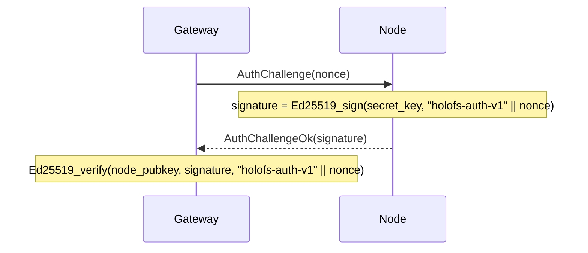

# Referencia de la API

Tres interfaces externas: **gateway HTTP**, **protocolo de cable del node** y
**formatos de archivo en disco** (manifest, catálogo, shard, whitelist, holoshare).

## Contenido

1. [Gateway HTTP](#1-http-gateway)
2. [Protocolo de cable (TCP)](#2-wire-protocol-tcp)
3. [Formatos en disco](#3-on-disk-formats)
4. [Convenciones de cabeceras de respuesta](#4-response-header-conventions)

---

## 1. HTTP gateway

URL base: `http://<addr>:8787/` (HTTPS mediante el andamiaje TLS propio del gateway
de la Etapa 6 — `HOLOFS_TLS=1`, mTLS mediante `HOLOFS_MTLS=1`).

> **Actualización de la Etapa 9.** Las rutas están separadas por barras y son
> direccionables como comodines (`/photos/2026/img.jpg`). Los segmentos de nivel
> superior reservados — `api`, `health`, `escrow`, `preview`, `inspect`,
> `similar`, `diff`, `admin`, `metrics`, `pkg` — no pueden usarse como primer
> segmento de la ruta de un objeto porque eclipsan rutas reales.

### CRUD del catálogo

| Método   | Ruta                       | Descripción                                 | Cuerpo / parámetros |
|----------|----------------------------|---------------------------------------------|---------------------|
| `GET`    | `/`                        | Catálogo HTML; lee `?p=<prefix>` para el directorio a listar | —                   |
| `GET`    | `/<path>`                  | Descargar el objeto en su forma canónica    | Soporta Range       |
| `GET`    | `/preview/<path>`          | Vista previa basta (solo L0)                | Soporta Range       |
| `PUT`    | `/<path>`                  | Subir bytes en bruto, kind auto-detectado. El directorio padre debe existir (mediante `mkdir`) | body = archivo |
| `DELETE` | `/<path>`                  | Eliminar el objeto + Purge en todos los nodes. Rechaza entradas de directorio (usar `rmdir`) | —                   |

### Operaciones sobre directorios (Etapa 9)

Dos variantes para cada mutación del catálogo: una variante JSON con comodín para
llamadas programáticas / `curl`, y un POST form-urlencoded que los formularios
HTML de la UI pueden invocar sin JavaScript. Las variantes de formulario hacen
303-redirect a `/?p=<parent>` para que el navegador vuelva al directorio que el
usuario estaba viendo.

| Método   | Ruta                       | Descripción                                                 | Cuerpo / parámetros          |
|----------|----------------------------|-------------------------------------------------------------|------------------------------|
| `POST`   | `/api/mkdir/<path>`        | Crea un marcador `Directory`. El padre debe existir.        | — (respuesta JSON)           |
| `POST`   | `/api/mkdir`               | mkdir amigable con formularios; redirige a `/?p=<parent>`   | `parent=…&name=…`            |
| `DELETE` | `/api/rmdir/<path>`        | Elimina un directorio vacío. 409 si tiene hijos.            | — (respuesta JSON)           |
| `POST`   | `/api/rmdir`               | rmdir amigable con formularios; redirige al tener éxito     | `path=…`                     |
| `POST`   | `/api/mv`                  | Renombrar / mover; los directorios arrastran a todos sus descendientes | `from=…&to=…`                |
| `POST`   | `/api/list_dir`            | Server fn de Leptos: hijos inmediatos de `prefix` (JSON-RPC)| `{"prefix":"…"}`             |

Correspondencia de códigos de estado para las operaciones de directorio:

| Resultado                                | Estado | `GatewayError`           |
|------------------------------------------|--------|--------------------------|
| OK                                       | 200 / 201 / 303 | —               |
| El destino ya existe                     | 409    | `AlreadyExists`          |
| La ruta existe pero no es un directorio  | 409    | `NotADirectory`          |
| `rmdir` sobre un directorio no vacío     | 409    | `DirectoryNotEmpty`      |
| `GET`/`DELETE` de una entrada `Directory`| 409    | `IsDirectory`            |
| Ruta mal formada (`..`, `//`, `/` inicial)| 400   | `BadRequest`             |
| Directorio padre ausente                 | 400    | `BadRequest`             |
| Entrada desconocida                      | 404    | `NotFound`               |

#### Respuesta por kind

| Kind      | `GET /<path>` devuelve                                      |
|-----------|-------------------------------------------------------------|
| image     | `image/png` (re-codificado desde canales f32)               |
| audio     | `audio/wav` (PCM de 16 bits, mono/estéreo según se almacenó)|
| text      | content-type de texto según la extensión, el cuerpo incluye marcadores de hueco si faltan shards |
| opaque    | content-type original + `Content-Disposition: attachment`   |
| directory | `409 Conflict` — los directorios no tienen carga útil (Etapa 9) |

### Salud del clúster

| Método | Ruta                  | Descripción                                  |
|--------|-----------------------|----------------------------------------------|
| `GET`  | `/health`             | Tabla por node, botones de kill/revive       |
| `GET`  | `/health/<name>`      | Margen por (canal, capa), simulación Monte-Carlo de pérdida, tabla de fallos por zona |
| `GET`  | `/api/stats`          | JSON: recuentos de objetos por kind, shards, % de dedup |
| `POST` | `/admin/node` (`i=N`) | Conmutar el node N (excluido/restaurado por el lado del admin) |

`/api/stats` devuelve:

```json
{
  "nodes_total": 40,
  "nodes_live": 38,
  "objects_total": 14,
  "objects_by_kind": {"image": 7, "audio": 3, "text": 1, "opaque": 1, "directory": 2},
  "shards_total": 5328,
  "shards_unique": 5326,
  "dedup_savings_pct": 0.04,
  "bytes_total": 50266112
}
```

`objects_total = sum(objects_by_kind)`; los marcadores `directory` se cuentan
pero no contribuyen a `shards_total` / `bytes_total`.

### Búsqueda y analítica

| Método | Ruta                          | Descripción                                  |
|--------|-------------------------------|----------------------------------------------|
| `GET`  | `/similar/<path>`             | Top-10 de objetos similares + solapamiento entre objetos |
| `GET`  | `/diff?a=<a>&b=<b>`           | Visualización de diff por chunk. Dos rutas de objeto no caben en una sola ruta, así que la Etapa 9 las trasladó a la query string |
| `GET`  | `/api/fingerprint/<path>`     | JSON: hash perceptual de 16 bytes (image/audio) o los primeros 16 del CID (text/opaque) |

`/api/fingerprint/<name>` devuelve:

```json
{
  "name": "photo.png",
  "fingerprint": "a3f08c7d12...",
  "kind": "image"
}
```

### Inspección de shards

La terna `c_l_idx` identifica un shard dentro de un objeto como
`<channel>_<layer>_<idx>`. La Etapa 9 reordenó la URL para que la terna fija
quede delante de la ruta del objeto con comodín.

| Método | Ruta                                                     | Descripción |
|--------|----------------------------------------------------------|-------------|
| `GET`  | `/inspect/<path>`                                        | Cuadrícula con miniaturas de todos los shards (codificadas por color: sys vs RLNC) |
| `GET`  | `/api/shard/<c_l_idx>.png/<path>`                        | PNG en escala de grises de 32×32 con la carga útil de un shard |
| `GET`  | `/inspect-zoom/<c_l_idx>/<path>`                         | Render grande + coeffs en hex + payload + info del node |

### Custodia (escrow) de clave holográfica

| Método | Ruta                            | Descripción |
|--------|---------------------------------|-------------|
| `GET`  | `/escrow`                       | UI con formularios de split + recover |
| `POST` | `/escrow/split`                 | `file=…` + `k=…` + `n=…` → dividir en `n` archivos `.holoshare` |
| `GET`  | `/escrow/download/<id>_<idx>.holoshare` | Descargar un share (mantenido en memoria del gateway) |
| `POST` | `/escrow/recover`               | `shares=…` (múltiples) → recuperar el archivo original |

Los archivos `.holoshare` **no se almacenan en el clúster** — el gateway los
calcula bajo demanda y los mantiene en memoria hasta el reinicio o hasta que el
usuario los descargue.

---

## 2. Wire protocol (TCP)

Los nodes escuchan en un socket TCP. Cada mensaje es un frame:

```
+--------+--------------------+
| u32 BE | payload (≤ 64 MiB) |
+--------+--------------------+
```

El límite de 64 MiB (`holofs_wire::MAX_FRAME`) se aplica en tiempo de decodificación;
los nodes descartan los frames demasiado grandes y cierran la conexión.

### Tipos de petición

| Op   | Nombre            | Payload                                       |
|------|-------------------|-----------------------------------------------|
| 0x00 | `Ping`            | (vacío)                                       |
| 0x01 | `Put`             | object\_id, channel, layer, Shard             |
| 0x02 | `Get`             | object\_id, channel, layer                    |
| 0x03 | `Purge`           | object\_id                                    |
| 0x04 | `Stat`            | (vacío)                                       |
| 0x05 | `Audit`           | object\_id, channel, layer, shard\_hash       |
| 0x06 | `AuthChallenge`   | nonce[32]                                     |

### Tipos de respuesta

| Op   | Nombre                | Payload                                       |
|------|-----------------------|-----------------------------------------------|
| 0x00 | `Pong`                | (vacío)                                       |
| 0x01 | `Ack`                 | (vacío)                                       |
| 0x02 | `Shards`              | count: u32 BE + N × Shard                     |
| 0x03 | `StatResp`            | total\_shards: u32 BE                         |
| 0x04 | `AuditResp`           | tag: u8 (0=None, 1=Some) + Shard opcional     |
| 0x05 | `AuthChallengeOk`     | signature[64]                                 |
| 0xff | `Error`               | len: u32 BE + mensaje UTF-8                   |

### Formato de cable del shard

```
+---------------+-----------+----------------+---------+
| u16 BE coeffs_len | coeffs | u32 BE payload_len | payload |
+---------------+-----------+----------------+---------+
```

(Nota: `coeffs_len` es conceptualmente igual a `K` del manifest.)

### Handshake de autenticación

El gateway puede desafiar a cualquier node antes de confiar en sus respuestas:



`node_pubkey` proviene de la whitelist firmada (véase §3 más abajo).

---

## 3. On-disk formats

Todos los enteros multi-byte son **big-endian** salvo indicación contraria. Los
archivos se identifican mediante un magic de 8 bytes en el desplazamiento 0.

### 3.1. Manifest (`HOLOFSM7`, el legacy `HOLOFSM6` se acepta en lectura)

La Etapa 9 elevó el magic a `HOLOFSM7` para señalar que una entrada puede llevar
el discriminante `ObjectKind::Directory` (tag `4`). El layout de cable es idéntico
byte-a-byte al de `HOLOFSM6`; solo creció el conjunto legal de valores `kind`.
Los archivos `HOLOFSM6` antiguos se decodifican sin problemas con el código nuevo.

Los marcadores de directorio tienen todos los campos numéricos a cero y todos
los campos `Vec` vacíos; su único portador es `object_id` (derivado de SHA-256
sobre la ruta, etiqueta de dominio `holofs-dir-v1\0`) y un `content_type` fijo de
`inode/directory`.

Un `Manifest` serializado que describe la codificación de un objeto.

```
magic           8  bytes = "HOLOFSM7" (también se acepta "HOLOFSM6" legacy)
object_id       8  bytes BE
k               2  bytes BE
nlayers         1  byte
channels        1  byte
width           4  bytes BE
height          4  bytes BE
levels          1  byte
placement       1  byte (0=RoundRobin, 1=Rendezvous, 2=RendezvousZoneAware)

n_per_layer     nlayers × u32 BE
sym_len         nlayers × u32 BE
layer_positions for each layer:
                    n_positions: u32 BE
                    positions:   n_positions × u32 BE

nodes_count     u32 BE
for each node:
    addr_len    u16 BE
    addr        addr_len bytes UTF-8

zones           nodes_count bytes (one byte per node)

data_cid        32 bytes (SHA-256)
merkle_root     32 bytes (SHA-256)

shard_hashes    channels × nlayers × variable:
                    count: u32 BE
                    hashes: count × 32 bytes

kind            1  byte (0=Image, 1=Text, 2=Audio, 3=Opaque, 4=Directory)
content_type    1 byte length + length bytes UTF-8

chunk_lens      u32 BE count + count × u32 BE
                (for text: per-chunk lengths; for opaque: real file length;
                 for image/audio: usually empty)

audio_sample_rate  u32 BE  (0 for non-audio)

text_minhash    u32 BE count + count × u32 BE
                (for text: bottom-K MinHash; empty otherwise)
```

### 3.2. Directorio (catálogo, `HOLOFSD1`)

```
magic           8 bytes = "HOLOFSD1"
n_entries       u32 BE
for each entry:
    name_len    u16 BE
    name        UTF-8
    manifest_len u32 BE
    manifest    serialised Manifest (§3.1)
```

Escrito de forma atómica (escribir en `.tmp`, fsync, rename).

### 3.3. Archivo de shard (`HOLOFSS1`)

```
magic        8  bytes = "HOLOFSS1"
object_id    8  bytes BE
channel      1  byte
layer        1  byte
coeffs_len   4  bytes BE
payload_len  4  bytes BE
coeffs       coeffs_len bytes
payload      payload_len bytes
```

Nombre del archivo: `<2 hex chars>/<remaining 62>.shard` donde la cadena hex
completa es `sha256(coeffs || payload)`.

### 3.4. Whitelist (`HOLOFSW1`)

```
magic         8  bytes = "HOLOFSW1"
n_entries     u32 BE
for each entry:
    addr_len  u16 BE
    addr      UTF-8
    pubkey    32 bytes (Ed25519)
    zone      1 byte
admin_pubkey  32 bytes
signature     64 bytes Ed25519
              signs ("holofs-whitelist-v1" || everything-above-the-signature)
```

### 3.5. Holoshare (`HOLOSHAR1`)

Un share de escrow. El escrow **no se almacena en el clúster**; este archivo
está pensado para su distribución a personas / dispositivos.

```
magic           9 bytes = "HOLOSHAR1"
escrow_id       16 bytes (first 16 of SHA-256 over the source data)
shard_idx       u16 BE
total_n         u16 BE
total_k         u16 BE
real_len        u64 BE (length of the original file in bytes)
content_type_n  1 byte
content_type    content_type_n bytes UTF-8
filename_n      1 byte
filename        filename_n bytes UTF-8
coeffs_len      u16 BE = total_k
coeffs          coeffs_len bytes
payload_len     u32 BE = sym_len
payload         payload_len bytes
```

Un grupo de escrow completo tiene `escrow_id`, `total_n`, `total_k`, `real_len`,
`content_type` y `filename` idénticos. La recuperación requiere cualesquiera
`total_k` valores distintos de `shard_idx` provenientes del mismo `escrow_id`.

---

## 4. Convenciones de cabeceras de respuesta

Cabeceras personalizadas `X-Holofs-*` en las respuestas de objeto:

| Cabecera                     | Tipo      | Descripción |
|------------------------------|-----------|-------------|
| `X-Holofs-Kind`              | image / audio / text / opaque | kind del objeto |
| `X-Holofs-Layers`            | `0-<max>` | para image / audio: capas realmente decodificadas |
| `X-Holofs-Bytes-Downloaded`  | u64       | bytes traídos desde los nodes para esta respuesta |
| `X-Holofs-Decode-Ms`         | u128      | tiempo dedicado a decodificar (excluye RTT de red) |
| `X-Holofs-Sample-Rate`       | u32       | audio: frecuencia de muestreo en Hz |
| `X-Holofs-Channels`          | u8        | audio: 1 o 2 |
| `X-Holofs-Chunks-Total`      | usize     | text: número total de chunks |
| `X-Holofs-Chunks-Missing`    | usize     | text: chunks reemplazados por marcadores de hueco |
| `X-Holofs-Escrow-Shares-Used`| usize     | escrow recover: número de shares consumidos |
