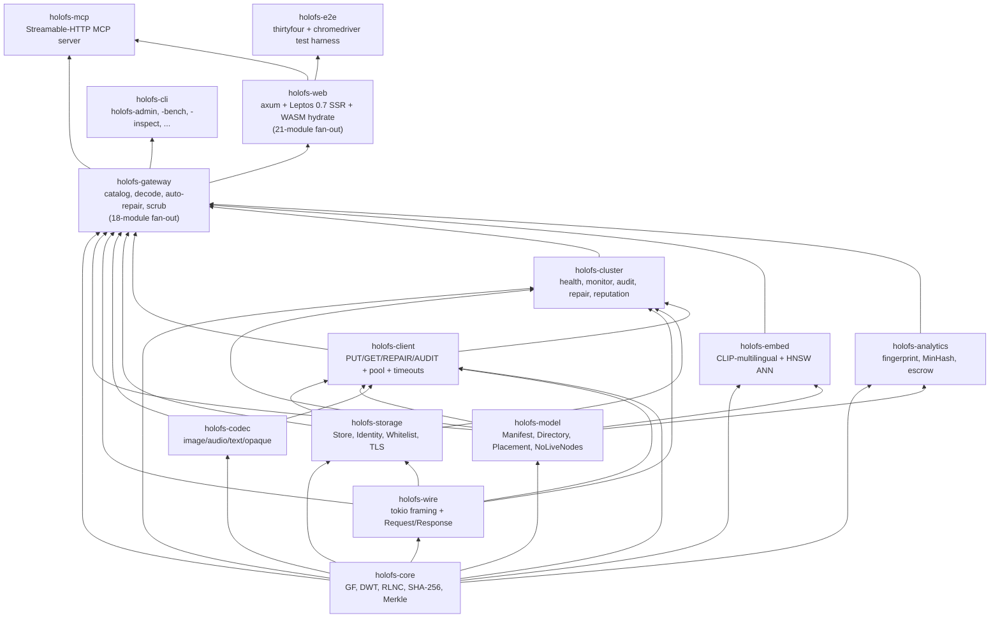
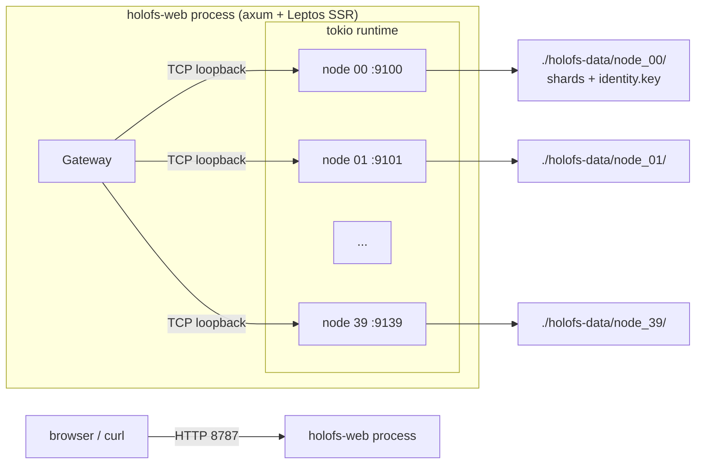
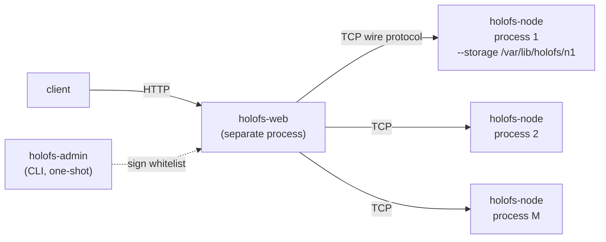
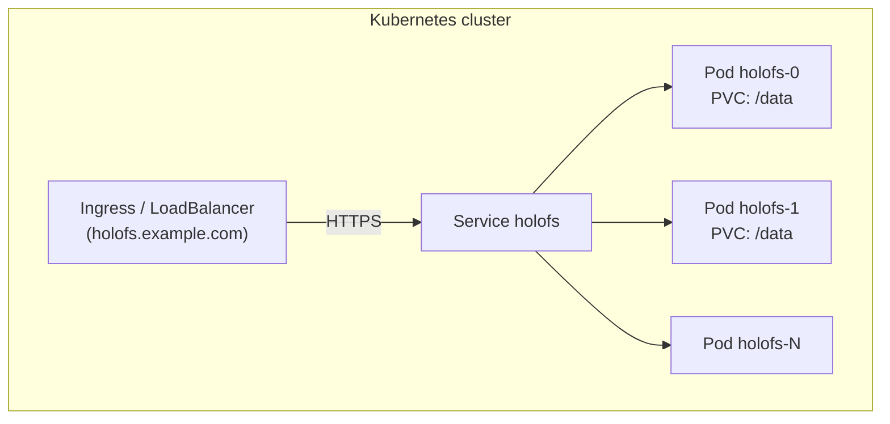
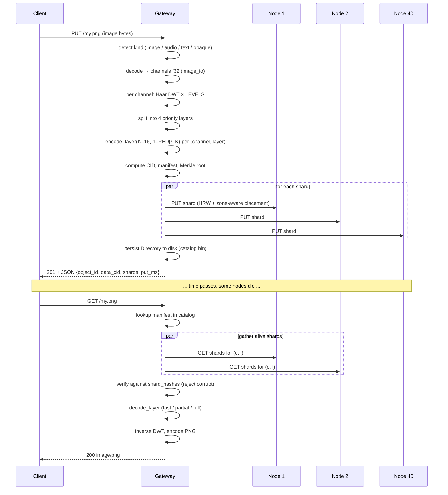

# Arquitectura

Estructura a nivel de sistema de holofs, dirigida a mantenedores y
revisores. Para los fundamentos matemáticos véase [theory.md](./theory.md);
para los detalles del protocolo HTTP / de cable véase [api.md](./api.md).

## Contenido

1. [Grafo de dependencias entre crates](#1-grafo-de-dependencias-entre-crates)
2. [Topologías de proceso / despliegue](#2-topologías-de-proceso--despliegue)
3. [Ciclo de vida del objeto (PUT → GET)](#3-ciclo-de-vida-del-objeto-put--get)
4. [Modelo de persistencia](#4-modelo-de-persistencia)
5. [Modelo de confianza](#5-modelo-de-confianza)
6. [Modelo de concurrencia](#6-modelo-de-concurrencia)
7. [Modos de fallo](#7-modos-de-fallo)

---

## 1. Grafo de dependencias entre crates

Orden topológico estricto — nunca dejar que las flechas apunten hacia arriba.



**Regla general.** Un pull request que añade una arista hacia arriba en
este grafo requiere una discusión aparte — casi siempre significa que un
tipo o función está en el crate equivocado.

### 1.1. Disposición de módulos del gateway

El crate `holofs-gateway` publica un tipo — `Gateway` — pero su
implementación está dividida entre 18 módulos hermanos, cada uno con un
bloque `impl Gateway { ... }`. Todo lo que queda en `http_gateway.rs`
(288 líneas) es estado + accesores + los dos helpers compartidos
`persist_catalog` e `invalidate_cache`. La API pública se preserva vía
`pub use` en la raíz del crate; los consumidores siguen escribiendo
`holofs_gateway::GatewayError`, `holofs_gateway::SimilarReport`, etc.
sin tocar la ruta del módulo.

| Módulo | Propósito |
|---|---|
| `http_gateway` | Struct `Gateway`, constructores, accesores, `persist_catalog`, `invalidate_cache`. |
| `error` | Enum `GatewayError` + `Display` + `From<NoLiveNodes>`. |
| `util` | Helpers pequeños: `now_unix`, `directory_object_id`, sniffers de tipo de contenido, `encode_png`. |
| `decode` | Dispatch de decodificación orientado a HTTP — `decode_object`, `get_or_decode` (caché PNG). |
| `ingest` | PUT universal — `ingest_bytes`, `put_any`, helpers de manifiesto en blanco por tipo. |
| `repair` | `decode_with_autorepair`, `repair_object_inplace`, `purge_orphans_of`. |
| `dirops` | `remove_object`, `mkdir`, `rmdir`, `rename`, `list_dir`. |
| `versions` | Historial de versiones por objeto: archivar / listar / restaurar / eliminar + retención. |
| `search` | Pipeline de embedding CLIP-multilingual + búsqueda semántica sobre HNSW. |
| `similarity` | Tipos `SimilarScope` / `SimilarMatch` / `ShardOverlap` + helpers de scope. |
| `fingerprint` | FP perceptual + `similar_to`. |
| `mix` | Mezcla wavelet + filtro de banda de audio. |
| `diff` | Analizador diff de chunks byte-perfect. |
| `spotlight` | Composites ROI: nítido dentro / borroso fuera. |
| `inspect` | View-model de `/inspect` + extracción de payload de shard. |
| `metrics` | `file_metrics` — storage/dedup + originalidad + energía por capa en una sola pasada. |
| `health` | Estadísticas del clúster, toggles admin, `scrub_tick`, `object_health`. |
| `escrow` | Escrow de claves RLNC estilo Shamir. |
| `gc` | Recolector de shards huérfanos. |

**Regla general.** Los nuevos métodos de `Gateway` pertenecen al módulo
cuya preocupación extienden, no a `http_gateway.rs`. Si se necesita un
nuevo módulo, va junto a los demás y obtiene su propio bloque
`impl Gateway`; nada en `http_gateway.rs` debe volver a crecer.

### 1.2. Capa de fiabilidad

Las primitivas de fiabilidad viven en `holofs-web` porque componen la
superficie HTTP, no el estado del gateway. Véase
[operations.md § 5.6](./operations.md#56-capa-de-fiabilidad) para la
referencia de env-vars.

| Módulo | Propósito |
|---|---|
| `holofs_web::supervised` | `supervised_spawn(name, shutdown, counter, f)` — envoltorio de captura de pánicos + reinicio con backoff exp. alrededor de `tokio::spawn`. |
| `holofs_web::timeout` | Middleware `run_with_deadline` + buckets de duración `SHORT`/`MEDIUM`/`LONG`. |
| `holofs_web::backpressure` | Middleware `with_permit` — `Arc<Semaphore>::try_acquire_owned` por bucket, 503 en saturación. |
| `holofs_web::admin_auth` | `AdminAuth::from_env` + middleware `require_admin_token` — puerta de bearer-token para `/admin/*` + `/api/gc`. |
| `holofs_web::bootstrap` | Lee env, conecta el `CancellationToken` compartido en cada tarea de larga ejecución, construye el handle `Bootstrap` que main.rs joins en el shutdown, conecta la tarea supervisada de persistencia de reputación. |

**La persistencia fail-loud** es un cambio del lado del gateway, no de
holofs-web: `Gateway::persist_catalog` devuelve
`Result<(), GatewayError::Persist>` y cada ruta de escritura (`ingest`,
`dirops`, `versions`) propaga vía `?`.

### 1.3. Disposición de módulos del crate web

`holofs-web` está dividido en módulos hermanos monopropósito — nada en
él excede unos pocos cientos de líneas.

**`lib.rs`** — registro de módulos + re-exports `pub use` en la raíz del
crate + componentes de nivel superior [`Shell`] / [`App`] /
[`RoutedApp`] + utilidad `url_encode` + entrada `hydrate` WASM. Todo lo
demás vive en hermanos:

| Módulo | Propósito |
|---|---|
| `catalog_types` | View-model `CatalogEntry` compartido entre las fronteras SSR + hydrate. `from_manifest` (solo SSR). |
| `filter` | Filtro de catálogo — `CatalogFilter`, `apply_filter`, `compile_glob`, `parse_date_to_unix`, `ymd_to_unix` + siete tests unitarios. Solo SSR. |
| `server_fns` | Las tres funciones `#[server]` (`get_catalog`, `list_dir`, `list_dir_page`) + `ListDirPage` + `TreeSort` + `compare_entries`. |
| `catalog_ui` | Quince componentes Leptos — `CatalogPage`, `CatalogFocusView`, `FilterBar`, `TreeZoomButtons`, `Breadcrumb`, `CatalogTreeView` + variantes eager/lazy, `LazyLevel`, `LazyDirNode`, `CatalogTreeBody`, `TreeNodeView`, `MkdirForm`, `UploadForm`, `ObjectCard`. |

**`handlers.rs`** — puerta de entrada pura para registro de módulos +
re-exports `pub use`. Cada handler vive en un sub-módulo de dominio bajo
`handlers/`:

| Módulo | Handlers |
|---|---|
| `handlers/objects` | GET / PUT / DELETE `/*path`, `/preview/*`, `/preview/stream/*`, `/api/shard/…`, alias wasm. |
| `handlers/dirops` | mkdir, rmdir, rm, mv (variantes JSON + form). |
| `handlers/uploads` | `/api/upload` multipart. |
| `handlers/versions` | `/api/restore`, `/api/versions/delete`. |
| `handlers/analytics` | `/api/fingerprint/*`, `/api/mix.png`, `/api/mix-save`, `/api/spotlight.png`. |
| `handlers/search` | `/api/embed_all`, `/api/search`. |
| `handlers/health` | `/api/stats`, `/metrics`, `/api/gc`, `/admin/node`, SSE `/api/health/events`. |
| `handlers/escrow` | `/escrow/split`, `/escrow/download`, `/escrow/recover`. |
| `handlers/util` | Helpers puros — validación de rutas, parseo de forms, escape HTML/JSON, atajos de cabecera, `error_to_response`. |
| `handlers/response` | Constructores de respuesta — `serve_with_range`, ingest / remove / mkdir / rmdir / rename → HTTP, stats + fingerprint → JSON. |

La API pública se preserva vía `pub use handlers::foo` en la raíz de
`handlers.rs`, de modo que las referencias existentes de `main.rs`
`handlers::mkdir` / `handlers::spotlight_png` / etc. se resuelven sin
cambios.

Las primitivas de fiabilidad del § 1.2 (`supervised`, `timeout`,
`backpressure`, `admin_auth`, `bootstrap`) no se ven afectadas — ya
vivían en sus propios módulos.

**Regla general.** Los nuevos componentes Leptos van a `catalog_ui.rs`
(relacionados con catálogo) o a un módulo hermano nuevo (escala-página
como `/health`, `/search`, `/versions`). Los nuevos handlers axum van
al módulo de dominio cuya preocupación extienden
(`handlers/dirops.rs` para una nueva variante de mkdir, etc.). Nada
nuevo debe hacer crecer los archivos de nivel superior `lib.rs` o
`handlers.rs`.

---

## 2. Topologías de proceso / despliegue

### A. Proceso único embebido (desarrollo / clústeres pequeños)



Se usa para demos, dev, single-machine bare-metal. El gateway y los
nodos comparten un runtime tokio pero se comunican por TCP real — fácil
de migrar a multi-proceso más adelante.

### B. Clúster bare-metal multi-proceso



Cada nodo es un proceso OS independiente con su propio directorio de
almacenamiento persistente e identidad Ed25519. El gateway se configura
con una whitelist firmada de triples `(addr, pubkey, zone)`. El
aislamiento de fallos es real: matar un proceso de nodo no tumba nada
más.

Variante con script: `./scripts/spawn-cluster.sh N BASE_PORT GATEWAY_ADDR`
levanta toda la topología con un comando.

### C. Kubernetes (StatefulSet)



`deploy/helm/holofs` proporciona plantillas de StatefulSet +
PersistentVolumeClaim. Cada pod ejecuta la imagen Docker multi-etapa,
que auto-genera nodos embebidos contra su propio PVC `/data`. Para
clústeres muy grandes, divide en N pods de gateway + M pods de nodo
dedicados (el chart Helm soporta `nodeCount` y `gatewayCount` por
separado).

---

## 3. Ciclo de vida del objeto (PUT → GET)



### Divergencia por tipo

| Tipo     | Ruta PUT                                              | Respuesta GET      |
|----------|-------------------------------------------------------|--------------------|
| image    | DWT 2D × 3 canales × 4 capas × RLNC                   | PNG re-codificado  |
| audio    | DWT 1D × 1–2 canales × 4 capas × RLNC                 | WAV PCM 16-bit     |
| text     | Chunks en frontera UTF-8 × 1 capa × RLNC sistemático  | text/plain + huecos |
| opaque   | Un flujo de bytes × 1 capa × RLNC (sin DWT)           | Bytes originales   |

---

## 4. Modelo de persistencia

Cada nodo posee un directorio. Allí viven tres tipos de archivos:

```
<storage>/
├── identity.key                # 32-byte Ed25519 seed (mode 0600)
├── <hex>/<hex>.shard           # one file per stored shard
└── <hex>/<hex>.shard
```

El gateway posee además:

```
<storage>/catalog.bin            # serialised Directory (Manifest map)
                                 # Header magic: "HOLOFSD1"
```

### Formato del archivo de shard

```
magic        8  bytes  = "HOLOFSS1"
object_id    8  bytes  big-endian
channel      1  byte
layer        1  byte
coeffs_len   4  bytes  big-endian
payload_len  4  bytes  big-endian
coeffs       coeffs_len bytes
payload      payload_len bytes
```

El nombre de archivo es `hex(sha256(shard))` dividido como
`<2 hex chars>/<remaining 62>.shard` (fanout estilo git para evitar
directorios enormes).

### Atomicidad de escritura

```
write to <name>.shard.tmp
fsync
rename <name>.shard.tmp → <name>.shard
```

Un crash deja o bien nada o bien un shard completo — nunca un archivo
troceado.

### WAL + group-commit

Cada `Store::put_appended` (invocado desde el handler del node-service
para `Request::Put` / `Request::PutBatch`) escribe un registro
length-prefixed con digest SHA-256 en un segmento WAL append-only
(`wal-<N>.log`, magic `HOLOFSW1`). Un flusher en segundo plano se
despierta cada `HOLOFS_NODE_FLUSH_INTERVAL_MS` (defecto 5 ms,
silenciosamente clampado a ≥ 1 ms tras el fix B3), flushea el
`BufWriter`, libera el lock del store y llama `fsync` sobre el
fichero subyacente vía `spawn_blocking`. Cuando fsync vuelve,
`wal_synced_seq` se incrementa y todos los waiters para una secuencia
≤ ese valor son notificados. Bajo un burst de 24 encoders, esto
transforma 24 × 12 ≈ 288 fsyncs per-shard concurrentes en ~200
fsyncs/s batchados, amortizando N appends pendientes por batch. El
handler no retorna `Ack` hasta que su WAL-seq asignada aterrice en
disco — la frontera de durabilidad queda igual que en la era
pre-WAL.

### Cifrado at-rest (AES-256-GCM)

Ponga `HOLOFS_AT_REST_ENC=1` en el nodo para activar — el switch es
booleano, no una clave hex. La clave de 32 bytes se deriva HKDF-
SHA256 del propio seed de identidad Ed25519 del nodo (la misma
`identity.key` usada para el handshake wire), con
`salt = "holofs-shard-salt-v1"` e `info = "holofs-shard-key-v1"`. Al
activarse, el node-service cambia el magic del fichero shard de
`HOLOFSS1` a `HOLOFSS2` y sella el blob `coeffs || payload` con
AES-256-GCM; el nonce de 12 bytes se guarda inline justo después
del header AAD. Los hashes de shards se computan sobre el payload
*plaintext*, así que el inventario de hashes y el content-addressing
no cambian — un nodo que conmuta el flag a mitad de vida re-emite
la misma lista de hashes en el siguiente escaneo. Véase
`crates/holofs-storage/src/crypto.rs::derive_shard_key` para la
derivación y el formato on-disk.

**Cobertura de amenazas.** Protege contra lecturas a nivel de
filesystem en el host del nodo (insider read, fuga de cinta de
backup). **No** protege contra el propio proceso node que posee K
shards de un objeto — el plaintext se descifra en cada lectura. Y
como la clave está atada al seed de identidad, una clave de identidad
perdida significa shards irrecuperables; respaldar `identity.key`
off-line antes de activar.

### Recuperación del índice

En `Store::open(dir)` el nodo recorre su árbol y reconstruye el índice
en memoria `HashMap<(object_id, channel, layer), HashMap<Hash, Shard>>`
re-hasheando cada shard. Esta es la única fuente de verdad permitida —
no hay un archivo `.idx` aparte que pudiera desactualizarse.

### Dedup

Los nombres de archivo de shard son direccionados por contenido. Un PUT
duplicado (mismos coeficientes + payload) se detecta por
`fs::write(... .tmp)` → `rename` sobre un archivo existente
(sobrescribe idénticamente). La comprobación del índice en memoria
anterior sigue devolviendo `false` desde `put()` de modo que el
llamador sabe que no apareció un shard nuevo.

---

## 5. Modelo de confianza

| Componente       | Suposición de confianza                                |
|------------------|--------------------------------------------------------|
| Admin            | absoluta — firma la whitelist, genera pares de claves  |
| Gateway          | confía en la firma del admin sobre la whitelist        |
| Nodo             | confía en su propia `identity.key` (filesystem)        |
| Inter-nodo       | no habla peer-to-peer; solo gateway ↔ nodo             |
| Cliente          | confía en el gateway (TLS recomendado para prod)       |

Explícitamente **no** somos un sistema sin permisos: no hay
prueba-de-replicación, no hay resistencia Sybil. holofs se sitúa en la
misma clase de confianza que Backblaze B2 o AWS S3, no Filecoin o
Storj. Véase [threat-model.md](./threat-model.md) para un análisis
estructurado.

### Primitivas criptográficas en uso

| Propósito                         | Primitiva                       | Crate                |
|-----------------------------------|---------------------------------|----------------------|
| Integridad de shard / objeto      | SHA-256 (FIPS 180-4, implementado a mano) | holofs-core |
| Identidad de nodo                 | Ed25519                         | ed25519-dalek (RFC 8032) |
| Firma de whitelist de admin       | Ed25519                         | ed25519-dalek       |
| Reto del handshake                | nonce aleatorio de 32 bytes + Ed25519 | holofs-storage |
| Escrow de clave / estilo Shamir   | RLNC sobre GF(2⁸) con K personalizado | holofs-analytics |
| Separación de dominios            | prefijo de string (`holofs-XXX-vN`) antes de la entrada de hash / sign |

---

## 6. Modelo de concurrencia

- **Runtime multi-threaded de Tokio** en la cima de cada binario
  (`#[tokio::main(flavor = "multi_thread")]`).
- **Una tarea por conexión** en el gateway y en cada nodo.
- **`tokio::sync::Mutex`** para estado compartido (catálogo, store,
  reputación, admin\_kills). Nunca mantenemos un mutex a través de un
  límite `.await` en un camino caliente — usamos patrones de snapshot
  en su lugar.
- **Canales** aún no usados (el sistema es petición/respuesta); las
  futuras respuestas de streaming usarán `tokio::sync::mpsc`.

### Tareas en segundo plano en el gateway

| Tarea                  | Cadencia | Crate           |
|------------------------|----------|-----------------|
| Monitor de salud       | `HOLOFS_MONITOR_INTERVAL` (15 s por defecto) | holofs-cluster |
| Auditor PoR            | `HOLOFS_AUDIT_INTERVAL` (30 s por defecto)   | holofs-cluster |
| Scrub de shards        | `HOLOFS_SCRUB_INTERVAL` (600 s por defecto)  | holofs-gateway |
| Persistencia de reputación | `HOLOFS_REPUTATION_PERSIST_INTERVAL` (30 s por defecto) | holofs-web |
| Autosave del catálogo  | en cada mutación de catálogo (inline)        | holofs-gateway |

Los cuatro bucles en segundo plano se ejecutan bajo
[`holofs_web::supervised::supervised_spawn`](#12-capa-de-fiabilidad):
un pánico → log ERROR + backoff exponencial (tope 1 → 30 s) +
reinicio. También honran un `tokio_util::sync::CancellationToken`
compartido y drenan limpiamente al recibir SIGTERM / SIGINT.

### Auto-reparación al leer + scrub

La ruta GET está envuelta en `decode_with_autorepair`: en
`ClientError::LayerLost` incrementa `auto_repairs_total`, ejecuta
`repair_object_inplace` (reparación quirúrgica por nodo vía
`list_node_hashes` + `repair_node`), persiste el manifiesto mutado, y
reintenta la decodificación una vez. Un segundo fallo incrementa
`auto_repair_failures_total` y expone el error original.

El scrub hace el mismo trabajo *proactivamente*: recorre el catálogo
entre peticiones de usuario, hace diff de `list_node_hashes` contra
`place_shard` por objeto, y repara quirúrgicamente las discrepancias
antes de que ningún lector llegue a un `LayerLost`. Se rastrea vía los
contadores `scrub_runs_total` + `scrub_repairs_total`.

### Concurrencia de GC basado en épocas

La pasada de GC se ejecuta concurrentemente con PUT / `restore_version`
/ scrub sin un lock global de escritor. Cada shard que el store
mantiene lleva una época de escritura wall-clock (ms desde
UNIX_EPOCH). Al inicio de una pasada de GC el gateway toma una
instantánea de época; el `PurgeByHashUpTo` del lado del nodo se niega
a borrar cualquier shard cuya época almacenada exceda la instantánea —
un PUT fresco que compita con la pasada está protegido porque su época
es estrictamente mayor que el corte.

El único punto de serialización que queda es la reescritura de
`embeddings.bin` al final del GC — ese paso aún mantiene `gc_barrier`
contra el append de `search::embed_object`, ya que el archivo en sí
no tiene análogo de época.

### Timeouts + reintentos de RPC

Cada op de cable (`rpc_attempt`) se ejecuta dentro de
`tokio::time::timeout` con `HOLOFS_RPC_TIMEOUT_MS` como presupuesto
(por defecto 8 s). En expiración el stream del pool se envenena y el
error emerge como `io::ErrorKind::TimedOut`; `is_likely_transient`
depende del tipo para conducir un único reintento automático contra
una conexión recién marcada. Combinado con el pool de keepalive por
addr, un nodo intermitente ahora limita la latencia visible al usuario
a 8 s + un reintento en lugar del timeout TCP a nivel de SO de
60-75 s.

---

## 7. Modos de fallo

| Fallo                                       | Detectado por                | Recuperación                      |
|---------------------------------------------|------------------------------|-----------------------------------|
| El proceso de nodo muere                    | monitor de salud (`Ping`)    | margen recalculado; si `LowMargin`, reparación encolada |
| El SO del nodo se reinicia, vuelve con la misma identidad | evento `revived` del monitor de salud | `repair_node` rellena el HRW share |
| El nodo devuelve bytes incorrectos (corrupción silenciosa) | auditoría PoR (discrepancia de hash) | la reputación cae; el nodo se excluye de `live` |
| El nodo miente "lo tengo" sin almacenarlo   | auditoría PoR (`MissingShard`) | la reputación cae |
| Todo un rack / zona se cae                  | monitor de salud + zone-aware | el objeto sigue decodificable hasta L_{n-1}/L_{n-2} |
| El gateway se cae a media PUT               | reintento del cliente         | los shards ya en nodos se deduplican por hash en el reintento |
| El gateway se cae a media DELETE            | inconsistente: algunos nodos purgados, otros no | `POST /api/gc` recoge shards huérfanos bajo demanda; el scrub en segundo plano los captura entre ejecuciones |
| Corrupción de disco en un archivo de shard  | verificación de hash al leer  | shard descartado → cae el margen → auto-reparación al leer re-codifica desde donantes |
| Partición de red entre gateway y nodo       | presupuesto `HOLOFS_RPC_TIMEOUT_MS` | RPC agotada reintenta una vez en un socket fresco; monitor de salud → excluir → reparar si el margen cae |
| Todos los nodos simultáneamente caídos      | `place_shard` devuelve `NoLiveNodes` | el gateway responde 503 con `ClusterDegraded` en lugar de aseverar; el cliente reintenta cuando los nodos vuelven |
| Firma de whitelist inválida                 | comprobación de arranque del gateway | rehúsa arrancar (fail-fast) |

### Contra lo que no protegemos

- **Gateway bizantino**: se confía en el gateway. Un gateway malicioso
  puede corromper todos los datos.
- **Colusión coordinada de nodos**: K nodos maliciosos (umbral K-de-N)
  pueden reconstruir cualquier objeto. La reputación es reactiva, no
  preventiva.
- **Ataques de canal lateral en tránsito de shards**: TLS mitigará la
  escucha; no previene ataques de timing contra las tablas de lookup
  GF(2⁸) (que son públicas de todas formas en el modelo de amenazas de
  holofs).
