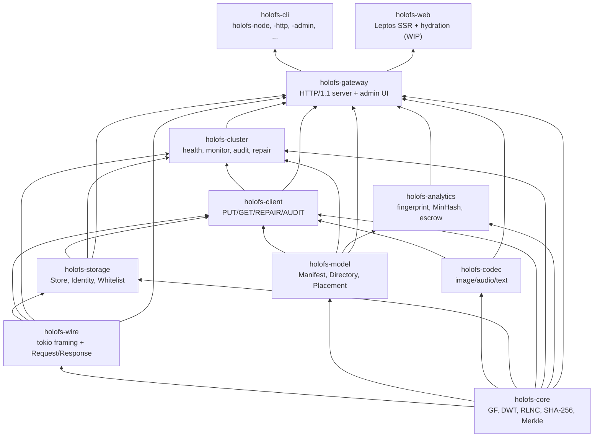
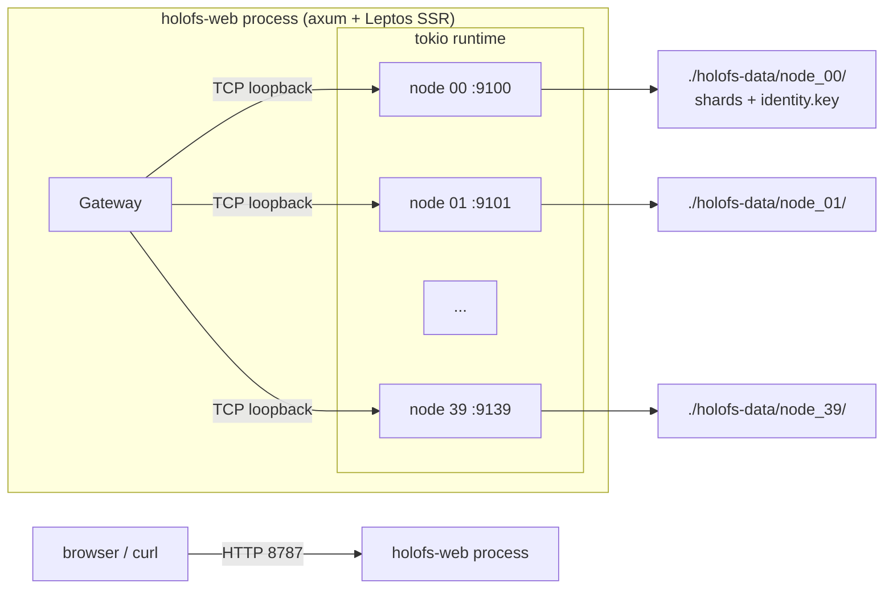
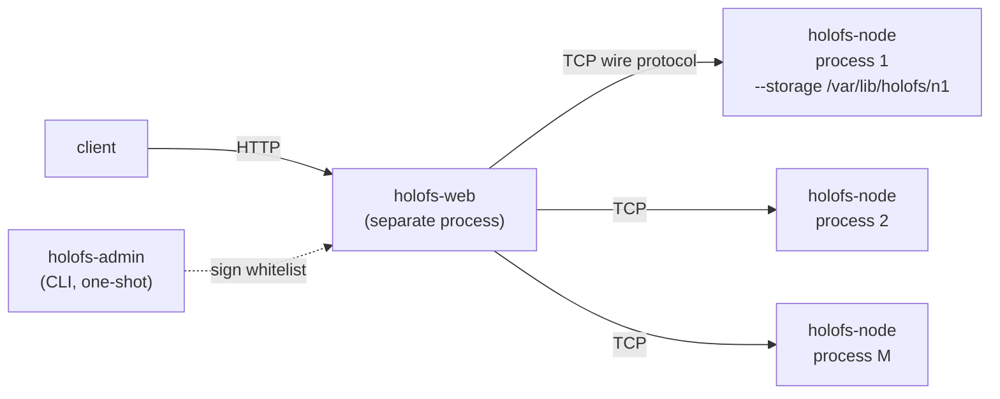
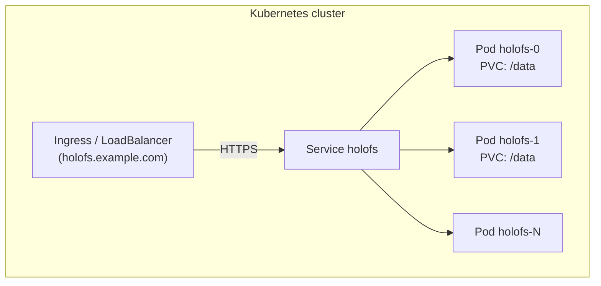
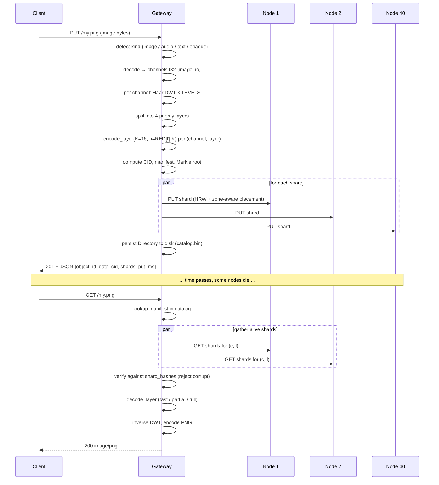

# Arquitectura

Estructura a nivel de sistema de holofs, destinada a mantenedores y revisores.
Para los fundamentos matemáticos véase [theory.md](./theory.md); para los
detalles del protocolo HTTP / de cable véase [api.md](./api.md).

## Contenido

1. [Grafo de dependencias de los crates](#1-crate-dependency-graph)
2. [Topologías de proceso / despliegue](#2-process--deployment-topologies)
3. [Ciclo de vida del objeto (PUT → GET)](#3-object-lifecycle-put--get)
4. [Modelo de persistencia](#4-persistence-model)
5. [Modelo de confianza](#5-trust-model)
6. [Modelo de concurrencia](#6-concurrency-model)
7. [Modos de fallo](#7-failure-modes)

---

## 1. Crate dependency graph

Orden topológico estricto — nunca dejes que las flechas apunten hacia arriba.



**Regla práctica.** Un pull request que añada una arista ascendente en este grafo
necesita una discusión aparte — casi siempre significa que un tipo o función está
en el crate equivocado.

---

## 2. Process / deployment topologies

### A. Proceso único embebido (desarrollo / clústeres pequeños)



Se usa para demos, dev, bare-metal de una sola máquina. El gateway y los nodes
comparten un runtime de tokio pero se comunican por TCP real — fácil de migrar
después a multi-proceso.

### B. Clúster bare-metal multi-proceso



Cada node es un proceso de SO independiente con su propio directorio de
almacenamiento persistente y su identidad Ed25519. El gateway se configura con
una whitelist firmada de ternas `(addr, pubkey, zone)`. El aislamiento de fallos
es real: matar un proceso de node no derriba nada más.

Variante con script: `./scripts/spawn-cluster.sh N BASE_PORT GATEWAY_ADDR`
levanta toda la topología con un solo comando.

### C. Kubernetes (StatefulSet)



`deploy/helm/holofs` proporciona plantillas de StatefulSet +
PersistentVolumeClaim. Cada pod ejecuta la imagen Docker multi-etapa, que
auto-genera nodes embebidos contra su propio PVC `/data`. Para clústeres muy
grandes, sepáralo en N pods de gateway + M pods dedicados de node (el chart de
Helm soporta `nodeCount` y `gatewayCount` por separado).

---

## 3. Object lifecycle (PUT → GET)



### Divergencia por kind

| Kind     | Ruta del PUT                                          | Respuesta del GET  |
|----------|-------------------------------------------------------|--------------------|
| image    | DWT 2D × 3 canales × 4 capas × RLNC                   | PNG re-codificado  |
| audio    | DWT 1D × 1–2 canales × 4 capas × RLNC                 | WAV PCM de 16 bits |
| text     | chunks por frontera UTF-8 × 1 capa × RLNC sistemático | text/plain + huecos|
| opaque   | un flujo de bytes × 1 capa × RLNC (sin DWT)           | bytes originales   |

---

## 4. Persistence model

Cada node posee un directorio. Allí viven tres tipos de archivos:

```
<storage>/
├── identity.key                # 32-byte Ed25519 seed (mode 0600)
├── <hex>/<hex>.shard           # one file per stored shard
└── <hex>/<hex>.shard
```

El gateway adicionalmente posee:

```
<storage>/catalog.bin            # serialised Directory (Manifest map)
                                 # Header magic: "HOLOFSD1"
```

### Layout del archivo de shard

```
magic        8  bytes  = "HOLOFSS1"
object_id    8  bytes  big-endian
channel      1  byte
layer        1  byte
coeffs_len   4  bytes  big-endian
payload_len  4  bytes  big-endian
coeffs       coeffs_len bytes
payload      payload_len bytes
```

El nombre del archivo es `hex(sha256(shard))` dividido como
`<2 hex chars>/<remaining 62>.shard` (fanout estilo git para evitar directorios
enormes).

### Atomicidad de la escritura

```
write to <name>.shard.tmp
fsync
rename <name>.shard.tmp → <name>.shard
```

Un crash deja o bien nada o bien un shard completo — nunca un archivo desgarrado.

### Recuperación del índice

En `Store::open(dir)` el node recorre su árbol y reconstruye el índice en memoria
`HashMap<(object_id, channel, layer), HashMap<Hash, Shard>>` re-hasheando cada
shard. Esta es la única fuente de verdad permitida — no hay un archivo `.idx`
separado que pudiera quedar obsoleto.

### Dedup

Los nombres de archivo de los shards son direccionados por contenido. Un PUT
duplicado (mismos coeficientes + payload) se detecta mediante
`fs::write(... .tmp)` → `rename` sobre un archivo existente (sobrescribe de
manera idéntica). La comprobación previa del índice en memoria sigue devolviendo
`false` desde `put()`, así que quien llama sabe que no apareció ningún shard
nuevo.

---

## 5. Trust model

| Componente      | Suposición de confianza                               |
|-----------------|-------------------------------------------------------|
| Admin           | absoluta — firma la whitelist, genera los keypairs    |
| Gateway         | confía en la firma del admin sobre la whitelist       |
| Node            | confía en su propio `identity.key` (sistema de archivos) |
| Inter-node      | no habla peer-to-peer; solo gateway ↔ node            |
| Cliente         | confía en el gateway (TLS recomendado para producción) |

Explícitamente **no** somos un sistema sin permisos: no hay
proof-of-replication, no hay resistencia a Sybil. holofs se sitúa en la misma
clase de confianza que Backblaze B2 o AWS S3, no Filecoin o Storj. Véase
[threat-model.md](./threat-model.md) para un análisis estructurado.

### Primitivas criptográficas en uso

| Propósito                        | Primitiva                       | Crate                |
|----------------------------------|---------------------------------|----------------------|
| Integridad de shard / objeto     | SHA-256 (FIPS 180-4, hecho a mano) | holofs-core      |
| Identidad del node               | Ed25519                         | ed25519-dalek (RFC 8032) |
| Firma de la whitelist del admin  | Ed25519                         | ed25519-dalek       |
| Reto de handshake                | nonce aleatorio de 32 bytes + Ed25519 | holofs-storage |
| Escrow de claves / estilo Shamir | RLNC sobre GF(2⁸) con K personalizada | holofs-analytics |
| Separación de dominio            | prefijo string (`holofs-XXX-vN`) antes de la entrada del hash / sign |

---

## 6. Concurrency model

- **Runtime multi-hilo de Tokio** en la parte superior de cada binario
  (`#[tokio::main(flavor = "multi_thread")]`).
- **Una tarea por conexión** en el gateway y en cada node.
- **`tokio::sync::Mutex`** para estado compartido (catálogo, store, reputación,
  admin\_kills). Nunca retenemos un mutex a través de un límite `.await` en una
  ruta caliente — usamos patrones de snapshot en su lugar.
- **Canales** aún no se usan (el sistema es de petición/respuesta); las futuras
  respuestas en streaming usarán `tokio::sync::mpsc`.

### Tareas en segundo plano en el gateway

| Tarea              | Cadencia | Crate           |
|--------------------|----------|------------------|
| Monitor de salud   | `HOLOFS_MONITOR_INTERVAL` (15 s por defecto) | holofs-cluster |
| Auditor de PoR     | `HOLOFS_AUDIT_INTERVAL` (30 s por defecto)   | holofs-cluster |
| Auto-guardado del catálogo | en cada mutación del catálogo (inline) | holofs-gateway |

Ambas tareas de fondo se abortan ante SIGINT mediante `tokio::select!`.

---

## 7. Failure modes

| Fallo                                       | Detectado por                | Recuperación                      |
|---------------------------------------------|------------------------------|-----------------------------------|
| El proceso del node muere                   | monitor de salud (`Ping`)    | margen recalculado; si `LowMargin`, reparación en cola |
| El SO del node se reinicia, vuelve con la misma identidad | evento `revived` del monitor de salud | `repair_node` re-rellena la share HRW |
| El node devuelve bytes incorrectos (corrupción silenciosa) | auditoría PoR (desajuste de hash) | la reputación baja; el node es excluido de `live` |
| El node miente "lo tengo" sin almacenar     | auditoría PoR (`MissingShard`) | la reputación baja |
| Un rack / zona entera se queda a oscuras    | monitor de salud + zone-aware | el objeto se mantiene decodificable hasta L_{n-1}/L_{n-2} |
| El gateway crashea a mitad de un PUT        | reintento del cliente         | los shards ya en los nodes se deduplican por hash al reintentar |
| El gateway crashea a mitad de un DELETE     | inconsistente: algunos nodes purgados, otros no | la siguiente pasada de salud detecta shards huérfanos (TODO: gc) |
| Corrupción de disco en un archivo de shard  | verificación de hash en lectura | el shard se descarta → cae el margen → reparación |
| Partición de red entre gateway y node       | timeout de RPC                | monitor de salud → excluir → reparar si cae el margen |
| Firma de whitelist inválida                 | comprobación al arrancar el gateway | se niega a arrancar (fail-fast) |

### Contra qué no protegemos

- **Gateway bizantino**: el gateway es confiable. Un gateway malicioso puede
  corromper todos los datos.
- **Colusión coordinada de nodes**: K nodes maliciosos (umbral K-de-N) pueden
  reconstruir cualquier objeto. La reputación es reactiva, no preventiva.
- **Ataques de canal lateral sobre el tráfico de shards**: TLS mitigará la
  escucha; no previene ataques de timing contra los table lookups de GF(2⁸)
  (que de todas formas son públicos en el modelo de amenazas de holofs).
