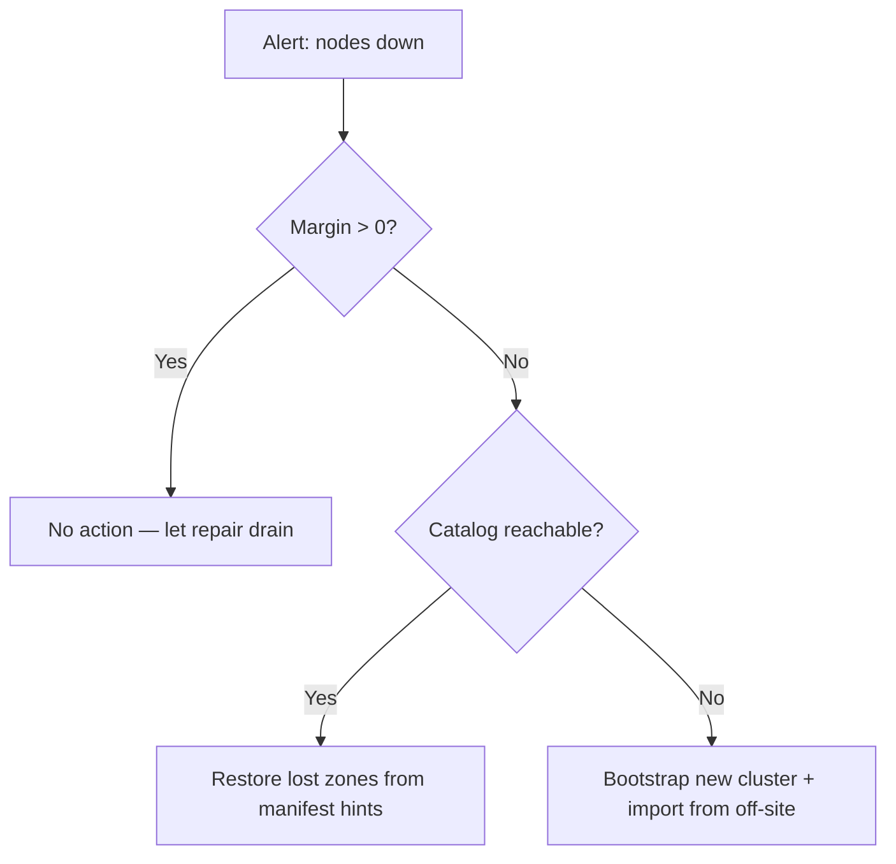

# Guía de operaciones


Esta guía describe cómo **desplegar**, **monitorizar**, **respaldar**,
**recuperar** y **planificar la capacidad** de un clúster holofs en producción.

## Contenido

1. [Topologías de despliegue](#1-deployment-topologies)
2. [Instalación en bare-metal](#2-bare-metal-install)
3. [Docker / Compose](#3-docker--compose)
4. [Kubernetes vía Helm](#4-kubernetes-via-helm)
5. [Referencia de configuración](#5-configuration-reference)
6. [Monitorización y alertado](#6-monitoring--alerting)
7. [Planificación de capacidad](#7-capacity-planning)
8. [Backup y restore](#8-backup--restore)
9. [Recuperación ante desastres](#9-disaster-recovery)
10. [Procedimientos del día 2](#10-day-2-procedures)

---

## 1. Deployment topologies

| Topología        | Caso de uso                                     | Pros                            | Contras                                |
|------------------|-------------------------------------------------|---------------------------------|----------------------------------------|
| Embebida         | Dev, demo, evaluación de un solo host           | Un único binario, sin orquestación | Sin tolerancia a fallos a nivel de máquina |
| Multi-proceso    | Único host, fronteras de proceso aisladas       | Reiniciar nodes de manera independiente | Sigue siendo un punto único de fallo (host) |
| Multi-host       | Producción: 40 nodes en 5 zonas × 8 hosts       | Durabilidad real, failover de zona | Requiere red, monitorización, ops      |
| Kubernetes       | Cloud / on-prem con k8s                         | Basado en Helm, declarativo     | Los stateful sets son más difíciles que los stateless |

**Objetivo recomendado en producción:** ≥ 5 zonas × ≥ 4 hosts × 1–2 nodes por host.
Esto sobrevive a **cualquier interrupción de una zona completa** más fallos
simultáneos de un solo node en las zonas restantes (véase
[theory.md §3](./theory.md#3-priority-layers)).

---

## 2. Bare-metal install

### 2.1. Prerrequisitos

- Linux (kernel ≥ 5.10), macOS o Windows Server.
- 2 GB de RAM y 10 GB de disco por node como mínimo; 8 GB / 100 GB recomendados.
- Puertos TCP abiertos: gateway (`8787`) y puertos de los nodes (9100–9139 por defecto).
- Una cuenta de usuario (p. ej. `holofs`) con acceso de escritura al directorio de datos.

### 2.2. Compilar desde el código fuente

```sh
# Pinned MSRV: 1.75
rustup install 1.75.0
cargo build --release --workspace
```

Binarios producidos en `target/release/`:

| Binario          | Propósito                                     |
|------------------|-----------------------------------------------|
| `holofs`         | CLI principal multi-comando                   |
| `holofs-node`    | Demonio de un solo node                       |
| `holofs-web`     | Gateway HTTP (axum + Leptos SSR)              |
| `holofs-admin`   | Operaciones de administración del clúster (whitelist, ban) |
| `holofs-bench`   | Benchmarks                                    |
| `holofs-inspect` | Inspección de manifest / shard                |
| `holofs-cluster` | Todo en uno (N nodes embebidos + gateway)     |
| `holofs-fs`      | Ayudantes del sistema de archivos local       |

### 2.3. Whitelist (requerida en producción)

```sh
# 1. Generate per-node Ed25519 keypairs
holofs-admin keygen --out keys/

# 2. Build whitelist
holofs-admin whitelist build \
    --node 10.0.1.10:9100 --pubkey keys/node1.pub --zone 0 \
    --node 10.0.1.11:9100 --pubkey keys/node2.pub --zone 1 \
    --node 10.0.2.10:9100 --pubkey keys/node3.pub --zone 2 \
    --admin-key keys/admin.priv \
    --out whitelist.holofs

# 3. Distribute whitelist.holofs to every node + gateway
```

Formato de cable: `HOLOFSW1` (véase [api.md §3.4](./api.md#34-whitelist-holofsw1)).

### 2.4. TLS para el protocolo de cable (`--tls`, `--mtls`)

El protocolo binario gateway↔node puede cifrarse con rustls (Etapa 6). Dos flags
opt-in controlan el comportamiento:

| Flag       | Efecto |
|------------|--------|
| `--tls`    | Cifra los frames del cable. El cliente verifica el cert del servidor. |
| `--mtls`   | Implica `--tls`. El servidor además exige + verifica un cert de cliente. |

**Modo embebido (sin `--whitelist`):** el binario genera una CA auto-firmada +
certs hoja al arrancar. Útil para dev, demos, clústeres de un solo host. La CA
vive solo en RAM y se regenera en cada reinicio — los clientes que cacheen
certs verán emisores frescos en cada arranque.

**Modo distribuido (`--whitelist`):** proporciona PEMs preemitidos en la línea
de comandos. Genéralos con `openssl` o tu PKI existente:

```sh
# Issue one CA + one cert per host (script omitted — use your PKI).
holofs-web \
  --whitelist cluster.wl \
  --admin-pubkey "$(holofs-admin pubkey admin.key)" \
  --tls --mtls \
  --tls-ca-cert /etc/holofs/ca.crt \
  --tls-cert   /etc/holofs/gateway.crt \
  --tls-key    /etc/holofs/gateway.key
```

El comando correspondiente del node recoge su propia hoja — véase la unidad
systemd en §2.5 para la forma en env-var.

Los archivos de cert deben cumplir:
- Los SAN del cert hoja deben cubrir cada host `addr:port` al que el gateway se
  conectará (nombre DNS o literal IP).
- El cert de la CA es la raíz de confianza en ambos lados — el mismo archivo en
  cada node y en cada gateway.
- Bajo `--mtls` ambos lados presentan el mismo tipo de hoja firmada por esa CA.
  Añade un cert "gateway" aparte si quieres valores CN distintos.

### 2.5. Servicio systemd

`/etc/systemd/system/holofs-node@.service`:

```ini
[Unit]
Description=holofs node %i
After=network.target

[Service]
Type=simple
User=holofs
Group=holofs
Environment=HOLOFS_DATA_DIR=/var/lib/holofs/node%i
Environment=HOLOFS_LISTEN=0.0.0.0:91%i
Environment=HOLOFS_WHITELIST=/etc/holofs/whitelist.holofs
Environment=HOLOFS_SECRET_KEY=/etc/holofs/keys/node%i.priv
# enable TLS on the wire protocol. Drop the next four lines for
# plain-TCP clusters; set HOLOFS_MTLS=1 for mutual auth.
Environment=HOLOFS_TLS=1
Environment=HOLOFS_TLS_CA_CERT=/etc/holofs/ca.crt
Environment=HOLOFS_TLS_CERT=/etc/holofs/node%i.crt
Environment=HOLOFS_TLS_KEY=/etc/holofs/node%i.key
ExecStart=/usr/local/bin/holofs-node
Restart=on-failure
RestartSec=5s
LimitNOFILE=65536

[Install]
WantedBy=multi-user.target
```

Luego `systemctl enable --now holofs-node@00 holofs-node@01 …`.

---

## 3. Docker / Compose

### 3.1. Descargar la imagen

```sh
docker pull ghcr.io/holofs/holofs:0.1.0
```

El Dockerfile es multi-etapa: rust:1.75-slim → debian:bookworm-slim. La imagen
de runtime se ejecuta como **no-root uid 10001**, con `tini` como PID 1.

### 3.2. Clúster de un solo host (embebido)

```sh
docker run -d \
  --name holofs \
  -p 8787:8787 \
  -v /srv/holofs:/var/lib/holofs \
  -e HOLOFS_N_NODES=40 \
  -e HOLOFS_DATA_DIR=/var/lib/holofs \
  ghcr.io/holofs/holofs:0.1.0 holofs-cluster
```

### 3.3. Multi-proceso vía Compose

```yaml
services:
  node-0: { ... environment: { HOLOFS_LISTEN: 0.0.0.0:9100, HOLOFS_ZONE: 0 } }
  node-1: { ... environment: { HOLOFS_LISTEN: 0.0.0.0:9101, HOLOFS_ZONE: 0 } }
  ...
  gateway:
    command: holofs-web
    environment:
      HOLOFS_NODES: node-0:9100,node-1:9101,...
      HOLOFS_WHITELIST: /etc/holofs/whitelist.holofs
    ports: ["8787:8787"]
    depends_on: [node-0, node-1, ...]
```

---

## 4. Kubernetes via Helm

El chart de Helm vive en `deploy/helm/holofs/`.

```sh
helm install holofs ./deploy/helm/holofs \
  --set nodeCount=40 \
  --set persistence.size=50Gi \
  --set ingress.enabled=true \
  --set ingress.hosts[0].host=holofs.example.com
```

**Recursos clave** (véase `deploy/helm/holofs/templates/`):

- `StatefulSet` para los nodes — IDs de red estables, un PVC por réplica.
- `Service` (`ClusterIP`) para el gateway.
- `Ingress` (opcional) para HTTPS externo.

**Zone awareness:** `values.yaml` expone `nodeAffinity` y
`topologySpreadConstraints`. Mapea tu etiqueta de zona de k8s (p. ej.
`topology.kubernetes.io/zone`) a las zonas de holofs mediante
`HOLOFS_ZONE_FROM_LABEL=topology.kubernetes.io/zone` (derivado automáticamente
desde la `Downward API`).

**Probes:**

```yaml
livenessProbe:  { httpGet: { path: /,        port: http }, periodSeconds: 30 }
readinessProbe: { httpGet: { path: /health,  port: http }, periodSeconds: 10 }
```

**Contexto de seguridad:** se ejecuta como `uid 10001`,
`readOnlyRootFilesystem: true`, `capabilities.drop: [ALL]`.

---

## 5. Configuration reference

Toda la configuración es por env vars (también se aceptan flags de CLI; ganan los flags).

### 5.1. Común a todos los binarios

| Variable                    | Defecto      | Descripción                                  |
|-----------------------------|--------------|----------------------------------------------|
| `HOLOFS_STORAGE_DIR`        | `./holofs-data` | Raíz de almacenamiento para shards, catálogo, manifests |
| `HOLOFS_LOG`                | `info,holofs_web=debug` | Especificación del filtro de `tracing` |
| `HOLOFS_LOG_FORMAT`         | `text`       | `text` \| `json` (producción: `json`)        |
| `HOLOFS_TELEMETRY_OTLP`     | (off)        | Endpoint OTLP, p. ej. `http://otel:4317` (planificado) |
| `HOLOFS_METRICS_LISTEN`     | (sin definir) | Dirección de escucha Prometheus separada opcional (defecto: servir en el puerto principal) |

Cada variable tiene un flag CLI equivalente (`--storage`, `--log`, etc.) — ejecuta
`holofs-web --help` para la lista completa. Los flags tienen prioridad sobre las env vars.

### 5.2. Específicas del node

| Variable                    | Defecto        | Descripción                              |
|-----------------------------|----------------|------------------------------------------|
| `HOLOFS_LISTEN`             | `0.0.0.0:9100` | Dirección de bind del protocolo de cable |
| `HOLOFS_ZONE`               | `0`            | ID de zona (usado por placement zone-aware) |
| `HOLOFS_SECRET_KEY`         | —              | Ruta al secreto Ed25519 (32 bytes)       |
| `HOLOFS_WHITELIST`          | —              | Ruta a la whitelist firmada              |
| `HOLOFS_MAX_DISK_GB`        | `unlimited`    | Rechaza Put una vez superado             |

### 5.3. Específicas del gateway

| Variable                    | Defecto        | Descripción                              |
|-----------------------------|----------------|------------------------------------------|
| `HOLOFS_NODES`              | —              | CSV de `addr:port` (bootstrap inicial)   |
| `HOLOFS_MONITOR_INTERVAL`   | `15`           | Periodo de health-poll (segundos)        |
| `HOLOFS_AUDIT_INTERVAL`     | `30`           | Periodo de auditoría en segundo plano (segundos) |
| `HOLOFS_REPAIR_INTERVAL`    | `60`           | Barrido de reparación en segundo plano   |
| `HOLOFS_TLS`                | (off)          | Cifrar el protocolo de cable (gateway↔nodes) con rustls. El modo embebido auto-genera una CA auto-firmada. |
| `HOLOFS_MTLS`               | (off)          | Implica `HOLOFS_TLS=1`. El servidor también requiere + verifica un cert de cliente. |
| `HOLOFS_TLS_CERT`           | —              | Modo distribuido: ruta al cert hoja PEM  |
| `HOLOFS_TLS_KEY`            | —              | Modo distribuido: ruta a la clave PEM correspondiente |
| `HOLOFS_TLS_CA_CERT`        | —              | Modo distribuido: ruta a la raíz de confianza CA PEM |
| `HOLOFS_PLACEMENT`          | `rendezvous`   | `roundrobin` \| `rendezvous` \| `rendezvous-zone` |

### 5.4. Clúster embebido

| Variable                    | Defecto        | Descripción                              |
|-----------------------------|----------------|------------------------------------------|
| `HOLOFS_N_NODES`            | `40`           | Número de nodes in-process               |
| `HOLOFS_EMBED_BASE_PORT`    | `9100`         | Puerto base estable (evitar rotación efímera) |
| `HOLOFS_ZONES`              | `5`            | Número de zonas a asignar                |

---

## 6. Monitoring & alerting

### 6.1. Endpoint de métricas

El gateway expone `GET /metrics` en el formato de exposición de texto Prometheus
(`text/plain; version=0.0.4`). Gauges basados en pull, originados desde
`Gateway::api_stats` + snapshot de admin-kill — sin counters/histograms en la
versión inicial.

| Métrica                         | Tipo  | Etiquetas                    | Significado |
|---------------------------------|-------|------------------------------|-------------|
| `holofs_nodes_total`            | gauge | —                            | nodes en la topología |
| `holofs_nodes_live`             | gauge | —                            | nodes no deshabilitados por el admin |
| `holofs_objects_total`          | gauge | `kind` (image/audio/text/opaque) | tamaño del catálogo por kind |
| `holofs_shards_total`           | gauge | —                            | shards planeados a lo largo del catálogo |
| `holofs_shards_unique`          | gauge | —                            | hashes de shard distintos |
| `holofs_dedup_savings_pct`      | gauge | —                            | `(1 − unique/total) × 100` |
| `holofs_bytes_total`            | gauge | —                            | bytes almacenados aproximados |
| `holofs_node_admin_killed`      | gauge | `node`, `addr`, `zone`       | flag de admin-kill por node |

Versiones futuras añadirán counters e histograms para RTT del cable, throughput
de reparación, latencia de decode y reputación (actualmente registrados solo
vía `tracing`).

### 6.2. Reglas de alerta de referencia

```yaml
groups:
- name: holofs
  rules:
  - alert: HolofsNodeDown
    expr: holofs_node_up == 0
    for: 5m
    annotations:
      summary: "holofs node {{ $labels.node }} is down"

  - alert: HolofsZoneDegraded
    expr: count by (zone) (holofs_node_up == 0) >= 2
    for: 10m
    annotations:
      summary: "zone {{ $labels.zone }} has ≥2 dead nodes (margin loss)"

  - alert: HolofsDiskFillingFast
    expr: predict_linear(holofs_bytes_stored_total[1h], 24*3600) > node_filesystem_size_bytes
    for: 30m
    annotations:
      summary: "node {{ $labels.node }} will fill within 24h"

  - alert: HolofsRepairFailing
    expr: rate(holofs_repair_jobs_total{result="failed"}[15m]) > 0.1
    for: 30m

  - alert: HolofsLowReputation
    expr: holofs_node_reputation < 0.5
    for: 1h
    annotations:
      summary: "node {{ $labels.node }} reputation collapsed (audit mismatches)"
```

### 6.3. Tracing

Cuando se establece `HOLOFS_TELEMETRY_OTLP`, el gateway exporta spans OTLP/HTTP:

| Nombre del span        | Atributos útiles                           |
|------------------------|--------------------------------------------|
| `gateway.put`          | `object.kind`, `bytes.in`, `shards.out`    |
| `gateway.get`          | `object.kind`, `layers`, `bytes.out`, `nodes_contacted` |
| `gateway.repair`       | `object_id`, `channel`, `layer`, `shards_recovered` |
| `wire.send`            | `op`, `target.node`, `bytes`               |

### 6.4. Dashboards

Un JSON de dashboard Grafana de referencia se distribuye en
`deploy/grafana/holofs.json`. Paneles principales: tasa de ingesta, decode P99
por kind, % de dedup, throughput de reparación, heatmap de disponibilidad de
nodes por zona.

---

## 7. Capacity planning

### 7.1. Sobrecarga de almacenamiento

El coste de almacenamiento está dominado por la redundancia RLNC a lo largo de
las capas de prioridad. Para un objeto de tamaño de payload `S`:

$$
\text{stored bytes} \approx S \cdot \sum_{\ell} R_\ell \cdot \frac{N_\ell}{K_\ell}
$$

Para las ratios de capa por defecto `R = [4.0, 2.5, 1.6, 1.15]`, la sobrecarga
promedio es de aproximadamente **9.25×** (contando metadatos, ~9.4×).

| Tamaño del objeto | Almacenado en el clúster | Por node (40 nodes) |
|-------------------|--------------------------|---------------------|
| 1 MB              | ~9.4 MB                  | ~235 KB             |
| 1 GB              | ~9.4 GB                  | ~235 MB             |
| 1 TB              | ~9.4 TB                  | ~235 GB             |

**Ajustar para abaratar el almacenamiento:** baja `R_0` (redundancia de pérdida
catastrófica) a `2.0` y `R_1..3` a `[1.5, 1.2, 1.05]` — la sobrecarga cae a
~5.75×. Véase [theory.md §3](./theory.md#3-priority-layers) para el compromiso
con el margen de supervivencia.

### 7.2. Planificación de CPU

| Operación              | Coste (relativo a memcpy) | Cuello de botella |
|------------------------|---------------------------|-------------------|
| Multiplicación GF(2⁸)  | 4× memcpy (LUT)           | caché L1          |
| Haar 2D forward        | 3× memcpy                 | ancho de banda de RAM |
| RLNC encode K=16, payload 1024 B | 60× memcpy        | CPU               |
| SHA-256 sobre 1 MB     | 2× memcpy (con SIMD)      | CPU               |

Un núcleo x86_64 moderno sostiene ~150 MB/s de RLNC encode para K=16. El
multinúcleo escala linealmente hasta que el IO de disco se convierte en el
cuello de botella (~500 MB/s en NVMe).

### 7.3. Planificación de red

Ancho de banda peor caso del cable por Put:

```
egress = payload × redundancy_factor × layer_count
       ≈ payload × 9.25
```

Para una subida de 100 MB, el gateway emite ~925 MB al pool de nodes. Planifica
**al menos 1 Gbit/s** entre gateway y nodes.

### 7.4. Dimensionar correctamente el clúster

| Propiedad                 | Elegir por                                 |
|---------------------------|--------------------------------------------|
| `N_nodes`                 | ≥ 4 × `K` para que RLNC tenga holgura de placement |
| `N_zones`                 | ≥ 3; 5 recomendado para soportar la pérdida de cualquier una zona |
| `K`                       | 16 (por defecto) — punto óptimo de CPU vs margen |
| `redundancy_per_layer`    | ajustar al margen de supervivencia ≥ 5σ deseado |

---

## 8. Backup & restore

### 8.1. Qué vive en disco

Por node (`HOLOFS_DATA_DIR`):

```
manifests/         per-object manifests (HOLOFSM6)
catalog/HOLOFSD1   the directory index (atomic write)
shards/aa/bb……    .shard files, content-addressed
identity/secret    Ed25519 private key
whitelist.holofs   admin-signed peer list
```

### 8.2. Modelo de backup

**holofs es su propio backup** para cualquier objeto *individual* — perder un
node dispara una reparación RLNC desde los hermanos. El backup importa para:

1. **Pérdida catastrófica del clúster** (p. ej. todas las zonas offline).
2. **Corrupción lógica / borrado accidental** (`Purge` es irreversible).
3. **Material de identidad** (claves Ed25519 + whitelist firmada) — sin estos,
   los reemplazos no pueden reincorporarse a un clúster de confianza.

### 8.3. Plan de backup recomendado

| Datos                | Frecuencia      | Herramientas              | Dónde                |
|----------------------|-----------------|---------------------------|----------------------|
| Identidad + whitelist | En cada cambio | `restic`, `aws s3 sync`   | Cifrado fuera del sitio |
| Snapshot del catálogo | Cada hora      | `cp catalog/HOLOFSD1 → …` | S3 / NFS / cinta     |
| Directorio de shards  | Opcional       | `restic` o snapshots zfs  | Almacenamiento en frío |

Un `holofs-admin export <name>` periódico reconstruye un objeto en un único
archivo canónico y lo escribe a un bucket externo. Esta es la forma recomendada
de respaldar **objetos específicos de alto valor**.

### 8.4. Procedimientos de restore

| Escenario                             | Procedimiento |
|---------------------------------------|---------------|
| Disco de un solo node perdido         | Limpia el disco; reinicia el node; el clúster auto-repara los shards. |
| Varios nodes perdidos, < margen       | No se requiere acción — RLNC decode lo tolera. |
| Catálogo corrupto en el gateway       | Copia `catalog/HOLOFSD1` desde un gateway par o del último backup horario; reinicia. |
| Clúster completo perdido              | Aprovisiona un nuevo clúster; `holofs-admin import` cada export externo. |
| Compromiso de clave de la whitelist   | Genera una nueva clave de admin; re-firma la whitelist; hot-reload (véase [§10.4](#104-hot-reload-whitelist)). |

---

## 9. Disaster recovery

### 9.1. Objetivos de RTO / RPO

| Fallo                         | RTO       | RPO     | Disparador                           |
|-------------------------------|-----------|---------|--------------------------------------|
| Node único                    | < 1 min   | 0       | Auto (monitor + reparación)          |
| Zona única (≤ ⅕ de los nodes) | < 5 min   | 0       | Auto (margen aún positivo)           |
| Dos zonas simultáneamente     | < 1 hr    | Horas   | Manual: re-aprovisionar + import     |
| Clúster completo              | < 8 hr    | ≤ 1 hr  | Manual: restore completo desde backups S3 |

### 9.2. Árbol de decisión



### 9.3. Drills

Ejecutar trimestralmente. Escenarios sugeridos:

1. **Drill de matar zona** — `kubectl drain` de todos los pods de una etiqueta
   de zona; asegurar que ningún objeto se vuelve inalcanzable y que la
   reparación se completa en < 10 min.
2. **Drill de restore en frío** — desde un clúster k8s fresco, ejecutar
   `holofs-admin import-all` contra un bucket de backup; medir el RTO.
3. **Drill de rotación de claves** — firmar una nueva whitelist con la clave de
   admin, hot-reload sin downtime.

---

## 10. Day-2 procedures

### 10.1. Añadir un node

```sh
# 1. Generate new node key
holofs-admin keygen --out keys/node41.priv

# 2. Re-sign whitelist with new entry
holofs-admin whitelist add \
  --whitelist whitelist.holofs \
  --node 10.0.3.10:9100 --pubkey keys/node41.pub --zone 4 \
  --admin-key keys/admin.priv \
  --out whitelist.holofs.new

# 3. Distribute, hot-reload, then start node
```

El catálogo permanece inalterado; los futuros placements pueden elegir el nuevo
node vía HRW. Los objetos existentes **no** se rebalancean automáticamente —
ejecuta `holofs-admin rebalance` para migrar shards (opcional; no necesario
para la corrección).

### 10.2. Eliminar (decomisionar) un node

```sh
# 1. Drain — refuse new Puts, finish in-flight
holofs-admin node drain 10.0.1.10:9100

# 2. Wait for repair to redistribute its shards
holofs-admin node status 10.0.1.10:9100
# → "drained, 0 shards remaining"

# 3. Remove from whitelist
holofs-admin whitelist remove --node 10.0.1.10:9100 …

# 4. Shut down systemd unit
systemctl stop holofs-node@10
```

### 10.3. Reemplazar un disco fallido

1. `systemctl stop holofs-node@N`
2. Reemplazar disco, montar un sistema de archivos fresco en `HOLOFS_DATA_DIR`.
3. Restaurar los archivos de identidad (`identity/secret`, `whitelist.holofs`)
   desde el backup externo — estos están ligados a la dirección del node, no al
   disco.
4. `systemctl start holofs-node@N` — el clúster rellenará el disco mediante
   reparación dirigida por auditoría en minutos a horas según el tamaño.

### 10.4. Hot-reload de la whitelist

```sh
# Drop new whitelist file into place
cp whitelist.holofs.new /etc/holofs/whitelist.holofs

# Signal all daemons
killall -SIGHUP holofs-node holofs-web
```

Los demonios re-verifican la firma del admin antes de intercambiar a la nueva
lista. Una firma incorrecta se registra y se mantiene la lista antigua.

### 10.5. Actualización rolling

Holofs garantiza compatibilidad del protocolo de cable dentro de una versión
menor (`0.x → 0.x+1` es seguro). Para k8s:

```sh
helm upgrade holofs ./deploy/helm/holofs --set image.tag=0.2.0
```

El StatefulSet rota un pod a la vez, espera a la readiness, y luego continúa.
Durante el rollout el clúster opera degradado exactamente en un node —
holgadamente dentro del margen para cualquier dimensionamiento por defecto.

### 10.6. Cheatsheet de comandos de salud

```sh
# Cluster-wide overview
curl -s http://gw:8787/api/stats | jq

# Per-node health (HTML in browser; JSON via accept header)
curl -s -H "accept: application/json" http://gw:8787/health

# Margin per (channel, layer) for one object
curl -s http://gw:8787/health/photo.png

# Inspect shard distribution
curl -s http://gw:8787/inspect/photo.png
```

Véase [api.md](./api.md) para el inventario completo de rutas.
