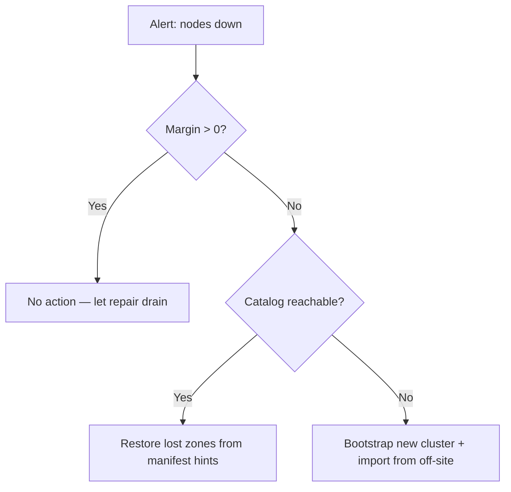

# Guía de operaciones

Esta guía describe cómo **desplegar**, **monitorizar**, **respaldar**,
**recuperar** y **planificar la capacidad** de un clúster holofs en
producción.

## Contenido

1. [Topologías de despliegue](#1-topologias-de-despliegue)
2. [Instalación bare-metal](#2-instalacion-bare-metal)
3. [Docker / Compose](#3-docker--compose)
4. [Kubernetes vía Helm](#4-kubernetes-via-helm)
5. [Referencia de configuración](#5-referencia-de-configuracion)
6. [Monitorización y alertas](#6-monitorizacion-y-alertas)
7. [Planificación de capacidad](#7-planificacion-de-capacidad)
8. [Backup y restauración](#8-backup-y-restauracion)
9. [Recuperación ante desastres](#9-recuperacion-ante-desastres)
10. [Procedimientos día-2](#10-procedimientos-dia-2)

---

## 1. Topologías de despliegue

| Topología        | Caso de uso                                     | Pros                            | Contras                               |
|------------------|-------------------------------------------------|---------------------------------|---------------------------------------|
| Embebida         | Dev, demo, evaluación en un único host          | Un binario, sin orquestación    | Sin tolerancia a fallos a nivel de máquina |
| Multi-proceso    | Host único, fronteras de proceso aisladas       | Reiniciar nodos independientemente | Sigue siendo un punto único de fallo (host) |
| Multi-host       | Producción: 40 nodos entre 5 zonas × 8 hosts    | Durabilidad real, failover de zona | Requiere red, monitorización, ops    |
| Kubernetes       | Nube / on-prem con k8s                          | Basado en Helm, declarativo     | Los stateful sets son más difíciles que los stateless |

**Objetivo recomendado para producción:** ≥ 5 zonas × ≥ 4 hosts × 1–2
nodos por host. Esto sobrevive a **cualquier caída de una zona completa**
más fallos simultáneos de nodos individuales en las zonas restantes
(véase [theory.md §3](./theory.md#4-capas-de-prioridad-y-degradacion-holografica)).

---

## 2. Instalación bare-metal

### 2.1. Prerrequisitos

- Linux (kernel ≥ 5.10), macOS, o Windows Server.
- 2 GB de RAM y 10 GB de disco por nodo mínimo; 8 GB / 100 GB recomendado.
- Puertos TCP abiertos: gateway (`8787`) y puertos de nodos (9100–9139 por defecto).
- Una cuenta de usuario (p. ej. `holofs`) con acceso de escritura al directorio de datos.

### 2.2. Compilar desde el código fuente

```sh
# MSRV fijado: 1.75
rustup install 1.75.0
cargo build --release --workspace
```

Binarios producidos bajo `target/release/`:

| Binario          | Propósito                                     |
|------------------|-----------------------------------------------|
| `holofs`         | CLI principal multi-comando                   |
| `holofs-node`    | Demonio de nodo único                         |
| `holofs-web`     | Gateway HTTP (axum + Leptos SSR)              |
| `holofs-admin`   | Operaciones de admin del clúster (whitelist, ban) |
| `holofs-bench`   | Benchmarks                                    |
| `holofs-inspect` | Inspección de manifiestos / shards            |
| `holofs-cluster` | Todo-en-uno (N nodos embebidos + gateway)     |
| `holofs-fs`      | Helpers de filesystem local                   |

### 2.3. Whitelist (requerido en producción)

```sh
# 1. Generar pares de claves Ed25519 por nodo
holofs-admin keygen --out keys/

# 2. Construir la whitelist
holofs-admin whitelist build \
    --node 10.0.1.10:9100 --pubkey keys/node1.pub --zone 0 \
    --node 10.0.1.11:9100 --pubkey keys/node2.pub --zone 1 \
    --node 10.0.2.10:9100 --pubkey keys/node3.pub --zone 2 \
    --admin-key keys/admin.priv \
    --out whitelist.holofs

# 3. Distribuir whitelist.holofs a cada nodo + gateway
```

Formato de cable: `HOLOFSW1` (véase [api.md §3.4](./api.md#34-whitelist-holofsw1)).

### 2.4. TLS para el protocolo de cable (`--tls`, `--mtls`)

El protocolo binario gateway↔nodo puede cifrarse con rustls. Dos flags
opt-in controlan el comportamiento:

| Flag       | Efecto |
|------------|--------|
| `--tls`    | Cifra las tramas de cable. El cert del servidor es verificado por el cliente. |
| `--mtls`   | Implica `--tls`. El servidor además requiere + verifica un cert de cliente. |

**Modo embebido (sin `--whitelist`):** el binario genera una CA
autofirmada + certs de hoja al arranque. Útil para dev, demos,
clústeres de un solo host. La CA vive solo en RAM y se regenera en
cada reinicio — los clientes que cachean certs verán emisores frescos
en cada arranque.

**Modo distribuido (`--whitelist`):** suministra PEMs pre-emitidos en
la línea de comandos. Genéralos con `openssl` o tu PKI existente:

```sh
# Emitir una CA + un cert por host (script omitido — usa tu PKI).
holofs-web \
  --whitelist cluster.wl \
  --admin-pubkey "$(holofs-admin pubkey admin.key)" \
  --tls --mtls \
  --tls-ca-cert /etc/holofs/ca.crt \
  --tls-cert   /etc/holofs/gateway.crt \
  --tls-key    /etc/holofs/gateway.key
```

El comando de nodo correspondiente recoge su propia hoja — véase la
unidad systemd en §2.5 para la forma de env-var.

Los archivos de cert deben satisfacer:
- Los SANs del cert de hoja deben cubrir cada host `addr:port` al que
  el gateway se conectará (nombre DNS o literal IP).
- El cert CA es la raíz de confianza en ambos lados — mismo archivo en
  cada nodo y en cada gateway.
- Bajo `--mtls` ambos lados presentan el mismo tipo de hoja firmada por
  esa CA. Añade un cert "gateway" separado si quieres valores CN
  distintos.

### 2.5. Servicio systemd

`/etc/systemd/system/holofs-node@.service`:

```ini
[Unit]
Description=holofs node %i
After=network.target

[Service]
Type=simple
User=holofs
Group=holofs
Environment=HOLOFS_STORAGE_DIR=/var/lib/holofs/node%i
# habilita TLS sobre el protocolo de cable. Elimina las siguientes cuatro
# líneas para clústeres de TCP plano; define HOLOFS_MTLS=1 para autenticación mutua.
Environment=HOLOFS_TLS=1
Environment=HOLOFS_TLS_CA_CERT=/etc/holofs/ca.crt
Environment=HOLOFS_TLS_CERT=/etc/holofs/node%i.crt
Environment=HOLOFS_TLS_KEY=/etc/holofs/node%i.key
ExecStart=/usr/local/bin/holofs-node
Restart=on-failure
RestartSec=5s
LimitNOFILE=65536

[Install]
WantedBy=multi-user.target
```

Luego `systemctl enable --now holofs-node@00 holofs-node@01 …`.

---

## 3. Docker / Compose

### 3.1. Descargar imagen

```sh
docker pull ghcr.io/holofs/holofs:1.0.0
```

El Dockerfile es multi-etapa: rust:1.81-slim-bookworm → debian:bookworm-slim.
La imagen de runtime se ejecuta como **uid 10001 no-root**, con `tini`
como PID 1.

### 3.2. Clúster de host único (embebido)

```sh
docker run -d \
  --name holofs \
  -p 8787:8787 \
  -v /srv/holofs:/data \
  ghcr.io/holofs/holofs:1.0.0
```

### 3.3. Multi-proceso vía Compose

```yaml
services:
  node-0: { ... environment: { HOLOFS_LISTEN: 0.0.0.0:9100, HOLOFS_ZONE: 0 } }
  node-1: { ... environment: { HOLOFS_LISTEN: 0.0.0.0:9101, HOLOFS_ZONE: 0 } }
  ...
  gateway:
    command: holofs-web
    environment:
      HOLOFS_NODES: node-0:9100,node-1:9101,...
      HOLOFS_WHITELIST: /etc/holofs/whitelist.holofs
    ports: ["8787:8787"]
    depends_on: [node-0, node-1, ...]
```

---

## 4. Kubernetes vía Helm

El chart Helm vive en `deploy/helm/holofs/`.

```sh
helm install holofs ./deploy/helm/holofs \
  --set nodeCount=40 \
  --set persistence.size=50Gi \
  --set ingress.enabled=true \
  --set ingress.hosts[0].host=holofs.example.com
```

**Recursos clave** (véase `deploy/helm/holofs/templates/`):

- `StatefulSet` para nodos — IDs de red estables, PVC por réplica.
- `Service` (`ClusterIP`) para el gateway.
- `Ingress` (opcional) para HTTPS externo.

**Conciencia de zona:** `values.yaml` expone `nodeAffinity` y
`topologySpreadConstraints`. Mapea tu etiqueta de zona de k8s (p. ej.
`topology.kubernetes.io/zone`) a zonas de holofs vía
`HOLOFS_ZONE_FROM_LABEL=topology.kubernetes.io/zone` (auto-derivado
del `Downward API`).

**Probes:**

```yaml
livenessProbe:  { httpGet: { path: /,        port: http }, periodSeconds: 30 }
readinessProbe: { httpGet: { path: /health,  port: http }, periodSeconds: 10 }
```

**Contexto de seguridad:** se ejecuta como `uid 10001`,
`readOnlyRootFilesystem: true`, `capabilities.drop: [ALL]`.

---

## 5. Referencia de configuración

Toda la configuración es vía variables de entorno (los flags CLI
también se aceptan; los flags ganan).

### 5.1. Común a todos los binarios

| Variable                    | Por defecto    | Descripción                                  |
|-----------------------------|----------------|----------------------------------------------|
| `HOLOFS_STORAGE_DIR`        | `./holofs-data` | Raíz de almacenamiento para shards, catálogo, manifiestos |
| `HOLOFS_LOG`                | `info,holofs_web=debug` | Spec de filtro `tracing`             |
| `HOLOFS_LOG_FORMAT`         | `text`         | `text` \| `json` (producción: `json`)         |
| `HOLOFS_TELEMETRY_OTLP`     | (off)          | Endpoint OTLP, p. ej. `http://otel:4317` (planificado) |
| `HOLOFS_METRICS_LISTEN`     | (unset)        | Dirección de escucha Prometheus separada opcional (por defecto: servir en puerto principal) |

Cada variable tiene un flag CLI equivalente (`--storage`, `--log`,
etc.) — ejecuta `holofs-web --help` para la lista completa. Los flags
tienen precedencia sobre las env vars.

### 5.2. Específico de nodo

| Variable                    | Por defecto    | Descripción                              |
|-----------------------------|----------------|------------------------------------------|
| `HOLOFS_LISTEN`             | `0.0.0.0:9100` | Dirección de bind del protocolo de cable |
| `HOLOFS_ZONE`               | `0`            | ID de zona (usado por placement zone-aware) |
| `HOLOFS_SECRET_KEY`         | —              | Ruta al secreto Ed25519 (32 bytes)       |
| `HOLOFS_WHITELIST`          | —              | Ruta a la whitelist firmada              |
| `HOLOFS_MAX_DISK_GB`        | `unlimited`    | Rehusa Put una vez excedido              |

### 5.3. Específico de gateway

| Variable                    | Por defecto    | Descripción                              |
|-----------------------------|----------------|------------------------------------------|
| `HOLOFS_NODES`              | —              | CSV de `addr:port` (bootstrap inicial)   |
| `HOLOFS_MONITOR_INTERVAL`   | `15`           | Período de sondeo de salud (segundos)    |
| `HOLOFS_AUDIT_INTERVAL`     | `30`           | Período de auditoría en segundo plano (segundos) |
| `HOLOFS_REPAIR_INTERVAL`    | `60`           | Barrido de reparación en segundo plano   |
| `HOLOFS_TLS`                | (off)          | Cifra el protocolo de cable (gateway↔nodos) con rustls. El modo embebido auto-genera una CA autofirmada. |
| `HOLOFS_MTLS`               | (off)          | Implica `HOLOFS_TLS=1`. El servidor también requiere + verifica un cert de cliente. |
| `HOLOFS_TLS_CERT`           | —              | Modo distribuido: ruta al cert de hoja PEM |
| `HOLOFS_TLS_KEY`            | —              | Modo distribuido: ruta a la clave PEM correspondiente |
| `HOLOFS_TLS_CA_CERT`        | —              | Modo distribuido: ruta a la raíz de confianza CA PEM |
| `HOLOFS_PLACEMENT`          | `rendezvous`   | `roundrobin` \| `rendezvous` \| `rendezvous-zone` |

### 5.4. Clúster embebido

| Variable                    | Por defecto    | Descripción                              |
|-----------------------------|----------------|------------------------------------------|
| `HOLOFS_N_NODES`            | `40`           | Número de nodos en proceso               |
| `HOLOFS_EMBED_BASE_PORT`    | `9100`         | Puerto base estable (evita churn efímero) |
| `HOLOFS_ZONES`              | `5`            | Número de zonas a asignar                |
| `HOLOFS_NO_SEED`            | `false`        | Omitir el seed de demo de dos PNG en un catálogo vacío. Poner a `true` cuando se re-suba desde un árbol de muestra conocido para que el seed no colisione con tus datos. |

### 5.5. Fiabilidad

| Variable                    | Por defecto | Descripción                                              |
|-----------------------------|-------------|----------------------------------------------------------|
| `HOLOFS_RPC_TIMEOUT_MS`     | `8000`      | Presupuesto general por RPC (`tokio::time::timeout`). `0` desactiva el tope; el timeout TCP a nivel de SO (60-75 s) es entonces la única parada. |
| `HOLOFS_SCRUB_INTERVAL`     | `600`       | Período del scrub de shards en segundo plano (segundos). `0` desactiva. El scrub recorre el catálogo, hace diff de `list_node_hashes` vs `place_shard`, repara las discrepancias antes de que los usuarios las encuentren. |
| `HOLOFS_VERSIONS_KEEP_LAST` | `0`         | Tope de historial de versiones por nombre. Descarta los archivos más antiguos en cada PUT. `0` = ilimitado (el `/api/versions/delete` manual es entonces el único camino para recuperar shards). Requiere `--enable-versions`. |
| `HOLOFS_POOL_PER_NODE`      | `8`         | Máximo de conexiones de cable en pool inactivas por dir de nodo. |
| `HOLOFS_POOL_IDLE_SECS`     | `60`        | Descartar entradas de pool inactivas más tiempo que este en `acquire`. |
| `HOLOFS_POOL_DISABLE`       | `false`     | Bypass del pool de keepalive — cada RPC marca fresco. Útil cuando se persiguen bugs de nivel de cable. |

### 5.5.c. Rate limit por IP

Complementa los topes globales de backpressure: los topes evitan que
el proceso explote bajo cualquier ráfaga — esta capa evita que un
único cliente mal-comportado hambre a todos los demás llamadores.
Ambas se aplican a los buckets MEDIUM (decode / PUT / dir ops) y LONG
(search / spotlight / GC); SHORT y los endpoints de streaming
permanecen ilimitados.

| Variable                        | Por defecto | Descripción                                              |
|---------------------------------|-------------|----------------------------------------------------------|
| `HOLOFS_RATE_LIMIT_RPS_PER_IP`  | `0`         | Tasa de recarga del token bucket por IP de cliente. Cero desactiva la capa por completo. |
| `HOLOFS_RATE_LIMIT_BURST`       | `2 × rps`   | Máximo de tokens que un bucket contiene. Con bucket vacío la petición responde 429 con `Retry-After: 1`. |
| `HOLOFS_RATE_LIMIT_IDLE_SECS`   | `300`       | Umbral de expulsión por inactividad para el mapa por IP (memoria acotada bajo poblaciones de cliente de alta rotación). |

**Fuente de IP del cliente.** Detrás de un reverse proxy el middleware
lee el primer salto de `X-Forwarded-For`. Las conexiones directas
usan `ConnectInfo<SocketAddr>` de
`into_make_service_with_connect_info`. Ninguna presente → bucket
compartido `0.0.0.0` para que los hosts ruidosos no obtengan un pase
libre por conexión.

**Métrica.** `holofs_rate_limit_rejected_total` cuenta cada respuesta
429. Una tasa sostenida no cero sugiere o bien un cliente abusivo
(investigar) o un tope infraaprovisionado (subir
`rate_limit_rps_per_ip`).

### 5.5.b. PUT en streaming

| Variable                    | Por defecto | Descripción                                              |
|-----------------------------|-------------|----------------------------------------------------------|
| `HOLOFS_UPLOAD_MAX_SIZE`    | `1 GiB`     | Tope del cuerpo por petición para `PUT /*path`. El cuerpo se transmite directamente a `<storage>/uploads/upload-<pid>-<counter>.tmp` (RAM constante independientemente de la velocidad del cliente / tamaño del cuerpo) y se lee de vuelta en un `Vec<u8>` justo antes de `Gateway::ingest_bytes`. Los cuerpos que exceden el tope devuelven 413 Payload Too Large; el tempfile se elimina en cada camino de salida. |

El streaming mantiene el delta de RSS del gateway acotado por el
buffer de copia (~64 KiB) en lugar de la tasa de subida del cliente —
un cliente lento en una subida de 200 MiB ya no fija 200 MiB de
memoria del gateway durante toda la duración. RSS aún sube al tamaño
del cuerpo brevemente en tiempo de ingesta porque el codec RLNC / DWT
espera `&[u8]`; una ingesta totalmente streaming está fuera del
alcance hasta que el codec la soporte.

### 5.6. Capa de fiabilidad

Cada perilla debajo tiene un valor por defecto seguro; el gateway
arranca con éxito sin ninguna de ellas definida.

| Variable                              | Por defecto | Descripción                                              |
|---------------------------------------|-------------|----------------------------------------------------------|
| `HOLOFS_MEDIUM_CONCURRENCY`           | `64`        | Permisos para el bucket de ruta MEDIUM (decodes, PUT, dir ops). En saturación el middleware del handler devuelve 503 con un cuerpo de diagnóstico en lugar de acumular tareas axum. Sintonizar contra `holofs_backpressure_permits_available{bucket="medium"}`. |
| `HOLOFS_LONG_CONCURRENCY`             | `8`         | Permisos para el bucket LONG (búsqueda semántica, spotlight, `/api/gc`, `/api/embed_all`, escaneos de fingerprint). |
| `HOLOFS_REPUTATION_PERSIST_INTERVAL`  | `30`        | Con qué frecuencia se hace snapshot del estado compartido de `Reputation` a `<storage>/reputation.bin`. El bootstrap lo carga de vuelta en el siguiente arranque; una discrepancia de `n_nodes` o archivo corrupto silenciosamente recae en una tabla fresca. También se escribe una instantánea final en SIGTERM. |
| `HOLOFS_ADMIN_TOKEN`                  | _(unset)_   | Cuando está definido, `POST /admin/node` y `POST /api/gc` requieren `Authorization: Bearer <token>`. Faltante/incorrecto → 401. |
| `HOLOFS_ADMIN_UNAUTHENTICATED`        | _(unset)_   | Override de dev: poner a `1` para dejar la superficie admin abierta cuando `HOLOFS_ADMIN_TOKEN` no está definido. Registra un WARN al arranque. Si ninguna variable está definida la superficie admin está deshabilitada (403). |

Los timeouts están hardcodeados por bucket por diseño (SHORT 10 s,
MEDIUM 60 s, LONG 300 s); los endpoints de streaming (SSE,
multipart/x-mixed-replace) + `/mcp` están intencionadamente sin
presupuesto. Los handlers vencidos emergen como `504 Gateway Timeout`
e incrementan `holofs_handler_timeouts_total{bucket=…}`.

### 5.7. Características opcionales

| Variable                    | Por defecto | Descripción                                              |
|-----------------------------|-------------|----------------------------------------------------------|
| `HOLOFS_ENABLE_VERSIONS`    | `false`     | Espejo de `--enable-versions`. Archiva cada PUT-reemplazo como archivo lateral bajo `<storage>/versions/<sanitized>/v…bin`. |
| `HOLOFS_ENABLE_EMBED`       | `false`     | Espejo de `--enable-embed`. Carga el modelo CLIP-multilingual en el primer PUT o primer `/api/search`, luego mantiene `embeddings.bin`. |
| `HOLOFS_MCP_TOKEN`          | —           | Cuando está definido, el endpoint `/mcp` requiere `Authorization: Bearer <token>` Y activa las herramientas de escritura. Sin la variable el endpoint permanece abierto + solo-lectura. |

### 5.8. Archivo de configuración TOML

Cada env var de arriba (`HOLOFS_*` y `LEPTOS_SITE_ADDR`) también es
configurable a través de un único archivo de configuración TOML pasado
vía `--config /path/to/holofs.toml` o la env var `HOLOFS_CONFIG`.
Un archivo de referencia comentado vive en
[`deploy/holofs.example.toml`](../../deploy/holofs.example.toml).

Escalera de prioridad (la más alta gana):

1. Flag CLI (`--medium-concurrency 128`)
2. Env var (`HOLOFS_MEDIUM_CONCURRENCY=128`)
3. Valor del archivo TOML (`[reliability] medium_concurrency = 128`)
4. Valor por defecto en tiempo de compilación

**Ejemplo**:

```toml
[server]
addr = "0.0.0.0:8787"
storage = "/var/lib/holofs"
log_format = "json"

[tls]
enabled = true
mtls = true
cert = "/etc/holofs/node.crt"
key = "/etc/holofs/node.key"
ca_cert = "/etc/holofs/ca.crt"

[reliability]
medium_concurrency = 128
long_concurrency = 16
scrub_interval_secs = 300

[admin]
# Token inline O referenciar un archivo (recomendado para secretos).
token_file = "/etc/holofs/admin.token"
```

**Secretos.** `[admin] token` y `[mcp] token` aceptan o bien una
cadena inline o una ruta `token_file` que apunta a un archivo cuya
primera línea no vacía es el token. Para producción, prefiere
`token_file` con modo `0400` y propiedad root para que el token no
sea visible en el historial git del archivo de configuración /
chart Helm empaquetado.

**Campos desconocidos**. TOML usa `deny_unknown_fields` en tiempo de
parseo — un typo en `medium_concurency` (sin la 'r') falla ruidosamente
al arranque con el nombre exacto de la clave en el error. Esto es
intencional; un fallback silencioso derrotaría el propósito del
archivo.

### 5.9. Cifrado de shards en reposo

Habilitar con `HOLOFS_AT_REST_ENC=1` (o `[security]
at_rest_encryption = true` en el TOML). Cuando está activo, cada
archivo de shard escrito a disco se sella con AES-256-GCM. La cabecera
permanece en texto plano (para que `Store::open` pueda seguir
indexando sin la clave), pero los coeficientes + payload del chunk
codificado son cifrado.

**Gestión de claves.** La clave AES de 32 bytes se deriva al arranque
del seed de identidad del nodo vía HKDF-SHA256
(`salt = "holofs-shard-salt-v1"`, `info = "holofs-shard-key-v1"`).
Ningún nuevo secreto que rotar — perder `identity.key` ya pierde la
identidad del nodo. La clave permanece en RAM durante la vida del
proceso; root en un nodo en ejecución puede leer texto plano a través
de una ruta de auditoría legítima.

**Formato de cable.** Dos magics de shard coexisten:

| Magic       | Significado                                                 |
|-------------|-------------------------------------------------------------|
| `HOLOFSS1`  | Texto plano. Leído por cada versión.                        |
| `HOLOFSS2`  | Sellado. `[8 B magic][18 B header][12 B nonce][ct+tag]`.    |

La cabecera de 18 bytes es AAD para el tag GCM, de modo que cualquier
reescritura post-hoc de cabecera (object_id, channel, layer, lengths)
invalida el shard al descifrar. Las lecturas olfatean los primeros 8
bytes y despachan — se soportan directorios mixtos v1 + v2 de modo
que habilitar sobre un store existente sella solo escrituras
*nuevas*. Un pase completo de re-cifrado está fuera del alcance; la
migración recomendada es generar un nodo fresco con una identidad
fresca y dejar que el pase de auto-reparación rebalancee shards sobre
él.

**Modelo de amenazas.** En el alcance: un adversario hace snapshot de
los archivos de shard de un nodo apagado (fuga de backup, disco
decomisado, la reconstrucción RAID dejó el disco viejo legible).
Fuera del alcance: root en un nodo en ejecución — una vez que la
clave derivada está en RAM, `read_shard_file` produce texto plano
para auditorías legítimas.

---

## 6. Monitorización y alertas

### 6.1. Endpoint de métricas

El gateway expone `GET /metrics` en formato de exposición de texto
Prometheus (`text/plain; version=0.0.4`). Gauges basados en pull
obtenidos de `Gateway::api_stats` + snapshot de admin-kill más
contadores de fiabilidad.

| Métrica                                     | Tipo    | Etiquetas                    | Significado |
|---------------------------------------------|---------|------------------------------|-------------|
| `holofs_nodes_total`                        | gauge   | —                            | nodos en topología |
| `holofs_nodes_live`                         | gauge   | —                            | nodos no deshabilitados por admin |
| `holofs_objects_total`                      | gauge   | `kind` (image/audio/text/opaque/directory) | tamaño de catálogo por tipo |
| `holofs_shards_total`                       | gauge   | —                            | shards planificados en todo el catálogo |
| `holofs_shards_unique`                      | gauge   | —                            | hashes de shard distintos |
| `holofs_dedup_savings_pct`                  | gauge   | —                            | `(1 − unique/total) × 100` |
| `holofs_bytes_total`                        | gauge   | —                            | bytes almacenados aproximados |
| `holofs_node_admin_killed`                  | gauge   | `node`, `addr`, `zone`       | flag de admin-kill por nodo |
| `holofs_auto_repairs_total`                 | counter | —                            | GETs que dispararon el brazo de reintento de `decode_with_autorepair` |
| `holofs_auto_repair_failures_total`         | counter | —                            | pases de auto-reparación que fallaron ellos mismos |
| `holofs_scrub_runs_total`                   | counter | —                            | ticks del scrub en segundo plano completados (`HOLOFS_SCRUB_INTERVAL`) |
| `holofs_scrub_repairs_total`                | counter | —                            | objetos que el scrub reparó *antes* de que cualquier usuario los encontrara |
| `holofs_catalog_persist_failures_total`     | counter | —                            | Errores de guardado atómico del catálogo en disco. No-cero = el estado en disco está detrás de la memoria; el próximo reinicio pierde escrituras. Alertar inmediatamente. |
| `holofs_handler_timeouts_total`             | counter | `bucket` (short/medium/long) | Respuestas 504 causadas por la deadline por bucket. |
| `holofs_backpressure_rejected_total`        | counter | `bucket` (medium/long)       | Respuestas 503 causadas por el semáforo estando en capacidad. |
| `holofs_backpressure_permits_available`     | gauge   | `bucket` (medium/long)       | Permisos aún libres. Constantemente en 0 = bucket infraaprovisionado; constantemente en máximo = ocioso. |
| `holofs_supervised_task_restarts_total`     | counter | `task` (monitor/auditor/scrub) | Pánicos + salidas inesperadas del bucle supervisado. Cualquier no-cero señala un crash repetido que el operador debe investigar. |
| `holofs_admin_auth_failures_total`          | counter | `outcome` (missing/bad/disabled) | Rechazos de bearer-token admin divididos por razón. `disabled` = superficie rehusada porque ni `HOLOFS_ADMIN_TOKEN` ni `HOLOFS_ADMIN_UNAUTHENTICATED` están definidas. |

Un clúster sano mantiene los contadores de auto-curación en cero o
cerca de cero; una tasa sostenida no cero en
`auto_repair_failures_total` es la señal de alerta del operador de que
el placement / pérdida de disco ha ido más allá de lo que el umbral K
puede absorber.

Los contadores de fiabilidad (fallos de persistencia, timeouts de
handler, rechazos de backpressure, reinicios supervisados, fallos de
admin-auth) juntos forman el "dashboard de alertas de fiabilidad" —
cada uno de ellos debe estar plano en cero en un clúster bien
aprovisionado con un token configurado. Véase las reglas de alerta de
referencia debajo.

Releases futuros añadirán histogramas para RTT de cable, latencia de
decode y reputación por objeto (actualmente registrada solo vía
`tracing`).

### 6.2. Reglas de alerta de referencia

```yaml
groups:
- name: holofs
  rules:
  - alert: HolofsNodeDown
    expr: holofs_node_up == 0
    for: 5m
    annotations:
      summary: "holofs node {{ $labels.node }} is down"

  - alert: HolofsZoneDegraded
    expr: count by (zone) (holofs_node_up == 0) >= 2
    for: 10m
    annotations:
      summary: "zone {{ $labels.zone }} has ≥2 dead nodes (margin loss)"

  - alert: HolofsDiskFillingFast
    expr: predict_linear(holofs_bytes_stored_total[1h], 24*3600) > node_filesystem_size_bytes
    for: 30m
    annotations:
      summary: "node {{ $labels.node }} will fill within 24h"

  - alert: HolofsRepairFailing
    expr: rate(holofs_repair_jobs_total{result="failed"}[15m]) > 0.1
    for: 30m

  - alert: HolofsLowReputation
    expr: holofs_node_reputation < 0.5
    for: 1h
    annotations:
      summary: "node {{ $labels.node }} reputation collapsed (audit mismatches)"

  # Alertas de fiabilidad de la serie N.

  - alert: HolofsCatalogPersistFailing
    expr: rate(holofs_catalog_persist_failures_total[10m]) > 0
    for: 5m
    annotations:
      summary: "gateway is failing to persist the catalog to disk"
      description: |
        holofs_catalog_persist_failures_total is climbing.
        Every increment = one 500 on a PUT/mkdir/rmdir/rename and one
        write that in-memory succeeded but on-disk didn't. Next
        restart will drop those changes. Check disk space + FS mount
        options on the gateway host.

  - alert: HolofsHandlerTimeouts
    expr: rate(holofs_handler_timeouts_total[15m]) > 0.05
    for: 15m
    annotations:
      summary: "handler bucket {{ $labels.bucket }} exceeding deadline"
      description: |
        More than one 504 every ~20 seconds. Slow cluster, slow disk,
        or the deadline is too tight for the traffic pattern.

  - alert: HolofsBackpressureSaturated
    expr: holofs_backpressure_permits_available == 0
    for: 5m
    annotations:
      summary: "bucket {{ $labels.bucket }} has zero permits available"
      description: |
        The MEDIUM/LONG semaphore is at 0 for 5 minutes straight.
        Either the cluster is genuinely overloaded (scale up nodes)
        or the cap is too low for the workload — bump the matching
        HOLOFS_*_CONCURRENCY env var.

  - alert: HolofsSupervisedTaskRestarting
    expr: rate(holofs_supervised_task_restarts_total[30m]) > 0
    for: 15m
    annotations:
      summary: "{{ $labels.task }} is crashing repeatedly"
      description: |
        The supervised background loop is panicking + being restarted
        by supervised_spawn. Read the gateway logs for the panic
        payload and file a bug.

  - alert: HolofsAdminAuthAttempts
    expr: rate(holofs_admin_auth_failures_total{outcome=~"missing|bad"}[10m]) > 0.1
    for: 10m
    annotations:
      summary: "admin surface seeing sustained 401s (possible probe)"
      description: |
        Someone is hitting /admin/node or /api/gc without a valid
        bearer. Missing = no Authorization header at all; bad = wrong
        token. If unexpected, treat as a probe.
```

### 6.3. Trazado

Cuando `HOLOFS_TELEMETRY_OTLP` está definido, el gateway exporta
spans OTLP/HTTP:

| Nombre del span        | Atributos útiles                           |
|------------------------|--------------------------------------------|
| `gateway.put`          | `object.kind`, `bytes.in`, `shards.out`    |
| `gateway.get`          | `object.kind`, `layers`, `bytes.out`, `nodes_contacted` |
| `gateway.repair`       | `object_id`, `channel`, `layer`, `shards_recovered` |
| `wire.send`            | `op`, `target.node`, `bytes`               |

### 6.4. Dashboards

Un dashboard Grafana de referencia JSON se envía en
`deploy/grafana/holofs.json`. Paneles principales: tasa de ingesta,
P99 de decode por tipo, % de dedup, throughput de reparación, mapa de
calor de disponibilidad de nodos por zona.

---

## 7. Planificación de capacidad

### 7.1. Overhead de almacenamiento

El coste de almacenamiento está dominado por la redundancia RLNC entre
capas de prioridad. Para un objeto de tamaño de payload `S`:

$$
\text{stored bytes} \approx S \cdot \sum_{\ell} R_\ell \cdot \frac{N_\ell}{K_\ell}
$$

Para ratios de capa por defecto `R = [4.0, 2.5, 1.6, 1.15]`, el
overhead promedio es aproximadamente **9,25×** (contando metadatos,
~9,4×).

| Tamaño de objeto | Almacenado en clúster | Por nodo (40 nodos) |
|------------------|-----------------------|---------------------|
| 1 MB             | ~9,4 MB               | ~235 KB             |
| 1 GB             | ~9,4 GB               | ~235 MB             |
| 1 TB             | ~9,4 TB               | ~235 GB             |

**Ajustar para almacenamiento más barato:** bajar `R_0` (redundancia
de pérdida catastrófica) a `2.0` y `R_1..3` a `[1.5, 1.2, 1.05]` — el
overhead cae a ~5,75×. Véase [theory.md §3](./theory.md#4-capas-de-prioridad-y-degradacion-holografica)
para el trade-off del margen de supervivencia.

### 7.2. Planificación de CPU

| Operación              | Coste (relativo a memcpy) | Cuello de botella |
|------------------------|---------------------------|-------------------|
| GF(2⁸) multiply        | 4× memcpy (LUT)           | caché L1          |
| Haar 2D forward        | 3× memcpy                 | Ancho de banda RAM |
| RLNC encode K=16, payload 1024 B | 60× memcpy      | CPU               |
| SHA-256 sobre 1 MB     | 2× memcpy (con SIMD)      | CPU               |

Un núcleo x86_64 moderno sostiene ~150 MB/s de codificación RLNC para
K=16. Escala linealmente en multi-core hasta que la I/O de disco se
convierte en el cuello de botella (~500 MB/s en NVMe).

### 7.3. Planificación de red

Ancho de banda de cable en el peor caso por Put:

```
egress = payload × redundancy_factor × layer_count
       ≈ payload × 9.25
```

Para un upload de 100 MB, el gateway emite ~925 MB al pool de nodos.
Planifica **al menos 1 Gbit/s** entre gateway y nodos.

### 7.4. Dimensionamiento correcto del clúster

| Propiedad                 | Elige por                                  |
|---------------------------|--------------------------------------------|
| `N_nodes`                 | ≥ 4 × `K` para que RLNC tenga holgura de placement |
| `N_zones`                 | ≥ 3; 5 recomendado para pérdida de cualquier zona |
| `K`                       | 16 (por defecto) — punto dulce de CPU vs margen |
| `redundancy_per_layer`    | ajustar al margen de supervivencia deseado ≥ 5σ |

---

## 8. Backup y restauración

### 8.1. Qué vive en disco

Por nodo (`HOLOFS_DATA_DIR`):

```
manifests/         manifiestos por objeto (HOLOFSM6)
catalog/HOLOFSD1   el índice de directorio (escritura atómica)
shards/aa/bb……    archivos .shard, direccionados por contenido
identity/secret    clave privada Ed25519
whitelist.holofs   lista de peers firmada por admin
```

### 8.2. Modelo de backup

**holofs es su propio backup** para cualquier objeto *individual* —
perder un nodo dispara reparación RLNC desde hermanos. El backup
importa para:

1. **Pérdida catastrófica del clúster** (p. ej. todas las zonas offline).
2. **Corrupción lógica / borrado accidental** (`Purge` es irreversible).
3. **Material de identidad** (claves Ed25519 + whitelist firmada) — sin
   ellos, los reemplazos no pueden reunirse a un clúster confiable.

### 8.3. Plan de backup recomendado

| Datos                | Frecuencia      | Herramientas              | Dónde               |
|----------------------|-----------------|---------------------------|---------------------|
| Identidad + whitelist | En cada cambio | `restic`, `aws s3 sync`   | Cifrado fuera del sitio |
| Snapshot de catálogo | Cada hora       | `cp catalog/HOLOFSD1 → …` | S3 / NFS / cinta    |
| Directorio de shards | Opcional        | `restic` o snapshots zfs  | Almacenamiento frío |

Un `holofs-admin export <name>` periódico reconstruye un objeto en un
único archivo canónico y lo escribe a un bucket externo. Esta es la
forma recomendada de respaldar **objetos específicos de alto valor**.

### 8.4. Procedimientos de restauración

| Escenario                             | Procedimiento |
|---------------------------------------|---------------|
| Disco de un único nodo perdido        | Limpiar disco; reiniciar nodo; el clúster auto-repara los shards. |
| Múltiples nodos perdidos, < margen    | No se necesita acción — el decode RLNC lo tolera. |
| Catálogo corrupto en gateway          | Copiar `catalog/HOLOFSD1` de un gateway par o del último backup horario; reiniciar. |
| Todo el clúster perdido               | Aprovisionar clúster nuevo; `holofs-admin import` cada exportación externa. |
| Compromiso de clave de whitelist      | Generar nueva clave de admin; re-firmar whitelist; hot-reload (véase [§10.4](#104-hot-reload-de-whitelist)). |

---

## 9. Recuperación ante desastres

### 9.1. Objetivos RTO / RPO

| Fallo                          | RTO       | RPO     | Disparador                             |
|--------------------------------|-----------|---------|----------------------------------------|
| Nodo único                     | < 1 min   | 0       | Auto (monitor + reparación)            |
| Zona única (≤ ⅕ de nodos)      | < 5 min   | 0       | Auto (el margen sigue positivo)        |
| Dos zonas simultáneamente      | < 1 hr    | Horas   | Manual: re-aprovisionar + importar     |
| Todo el clúster                | < 8 hr    | ≤ 1 hr  | Manual: restauración completa desde backups S3 |

### 9.2. Árbol de decisión



### 9.3. Simulacros

Ejecutar trimestralmente. Escenarios sugeridos:

1. **Simulacro de kill de zona** — `kubectl drain` todos los pods en una
   etiqueta de zona; aseverar que ningún objeto se vuelve inaccesible
   y la reparación se completa en < 10 min.
2. **Simulacro de restauración en frío** — desde un clúster k8s fresco,
   ejecutar `holofs-admin import-all` contra un bucket de backup;
   medir RTO.
3. **Simulacro de rotación de clave** — firmar una nueva whitelist con
   la clave de admin, hot-reload sin downtime.

---

## 10. Procedimientos día-2

### 10.1. Añadir un nodo

```sh
# 1. Generar nueva clave de nodo
holofs-admin keygen --out keys/node41.priv

# 2. Re-firmar whitelist con nueva entrada
holofs-admin whitelist add \
  --whitelist whitelist.holofs \
  --node 10.0.3.10:9100 --pubkey keys/node41.pub --zone 4 \
  --admin-key keys/admin.priv \
  --out whitelist.holofs.new

# 3. Distribuir, hot-reload, luego iniciar el nodo
```

El catálogo permanece sin cambios; los placements futuros pueden
elegir el nuevo nodo vía HRW. Los objetos existentes **no** se
rebalancean automáticamente — ejecutar `holofs-admin rebalance` para
migrar shards (opcional; no es necesario para la corrección).

### 10.2. Eliminar (decomisar) un nodo

```sh
# 1. Drenar — rehúsa nuevos Puts, termina en-vuelo
holofs-admin node drain 10.0.1.10:9100

# 2. Esperar a que la reparación redistribuya sus shards
holofs-admin node status 10.0.1.10:9100
# → "drained, 0 shards remaining"

# 3. Quitar de la whitelist
holofs-admin whitelist remove --node 10.0.1.10:9100 …

# 4. Apagar la unidad systemd
systemctl stop holofs-node@10
```

### 10.3. Reemplazar un disco fallido

1. `systemctl stop holofs-node@N`
2. Reemplazar disco, montar filesystem fresco en `HOLOFS_DATA_DIR`.
3. Restaurar archivos de identidad (`identity/secret`, `whitelist.holofs`)
   desde el backup externo — estos están atados a la dirección del
   nodo, no al disco.
4. `systemctl start holofs-node@N` — el clúster rellenará el disco vía
   reparación dirigida por auditoría en minutos a horas dependiendo
   del tamaño.

### 10.4. Hot-reload de whitelist

```sh
# Colocar nuevo archivo de whitelist en su sitio
cp whitelist.holofs.new /etc/holofs/whitelist.holofs

# Señalar a todos los demonios
killall -SIGHUP holofs-node holofs-web
```

Los demonios re-verifican la firma del admin antes de intercambiar la
nueva lista. Una firma incorrecta se registra y se mantiene la lista
vieja.

### 10.5. Actualización en rolling

Holofs garantiza compatibilidad del protocolo de cable dentro de una
versión menor (`1.x → 1.x+1` es seguro). Para k8s:

```sh
helm upgrade holofs ./deploy/helm/holofs --set image.tag=1.0.0
```

El StatefulSet rueda un pod a la vez, espera a la disponibilidad,
luego procede. Durante el rollout el clúster opera degradado por
exactamente un nodo — muy dentro del margen para cualquier
dimensionamiento por defecto.

### 10.6. Chuleta de comandos de salud

```sh
# Visión general del clúster
curl -s http://gw:8787/api/stats | jq

# Salud por nodo (HTML en navegador; JSON vía cabecera accept)
curl -s -H "accept: application/json" http://gw:8787/health

# Margen por (canal, capa) para un objeto
curl -s http://gw:8787/health/photo.png

# Inspeccionar distribución de shards
curl -s http://gw:8787/inspect/photo.png
```

Véase [api.md](./api.md) para el inventario completo de rutas.
