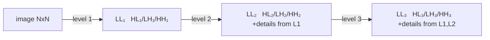
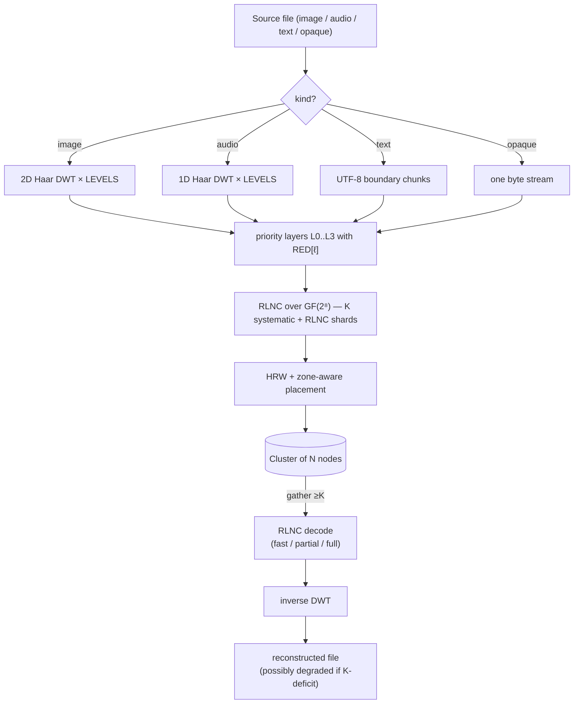

# Teoría

Fundamentos matemáticos de holofs. Cada sección tiene definiciones
formales, fórmulas relevantes, intuición y referencias a la literatura.

> Notación matemática: GitHub renderiza `$…$` y `$$…$$` vía KaTeX. Los
> diagramas son bloques Mermaid (también nativos en GitHub).

## Contenido

1. [Campo de Galois GF(2⁸)](#1-campo-de-galois-gf2)
2. [Codificación aleatoria lineal de red (RLNC)](#2-codificación-aleatoria-lineal-de-red-rlnc)
3. [Transformada wavelet discreta de Haar](#3-transformada-wavelet-discreta-de-haar)
4. [Capas de prioridad y degradación holográfica](#4-capas-de-prioridad-y-degradación-holográfica)
5. [Hashing por peso aleatorio más alto (rendezvous)](#5-hashing-por-peso-aleatorio-más-alto-rendezvous)
6. [Placement con conciencia de zona](#6-placement-con-conciencia-de-zona)
7. [Direccionamiento por contenido y árboles Merkle](#7-direccionamiento-por-contenido-y-árboles-merkle)
8. [Secreto compartido de Shamir ↔ RLNC](#8-secreto-compartido-de-shamir--rlnc)
9. [MinHash Bottom-K](#9-minhash-bottom-k)
10. [Hashing perceptual sobre DWT-LL](#10-hashing-perceptual-sobre-dwt-ll)
11. [Códigos de reparación / regenerativos](#11-códigos-de-reparación--regenerativos)

---

## 1. Campo de Galois GF(2⁸)

Tratamos cada byte como un elemento del cuerpo finito

$$
\mathrm{GF}(2^8) \;=\; \mathrm{GF}(2)[x] \;/\; \langle\, x^8 + x^4 + x^3 + x^2 + 1 \rangle,
$$

es decir, polinomios sobre $\mathbb{F}_2$ de grado $< 8$, reducidos
módulo el polinomio de Rijndael / AES $p(x) = \texttt{0x11d}$. La suma
es XOR bit a bit:

$$
a \oplus b = (a_7 \oplus b_7,\, a_6 \oplus b_6,\, \dots,\, a_0 \oplus b_0).
$$

La multiplicación es multiplicación polinómica módulo $p(x)$. La
implementamos mediante tablas de logaritmo discreto relativas al
generador $\alpha = \texttt{0x02}$:

$$
a \cdot b \;=\; \alpha^{\log_\alpha a + \log_\alpha b} \quad \text{para } a, b \neq 0,
$$

$$
a^{-1} \;=\; \alpha^{255 - \log_\alpha a}.
$$

Cada multiplicación son dos búsquedas en tabla + una suma. La tabla
`exp` está duplicada a longitud 512 para que `log[a] + log[b]` nunca dé
la vuelta, eliminando el módulo en el camino caliente.

**Por qué GF(2⁸).** Cabe en un byte, tiene 255 elementos no nulos
(muchos coeficientes distintos para RLNC), y las búsquedas de tabla de
8 bits son amigables con la caché. GF(2¹⁶) da menor probabilidad de
dependencia lineal pero duplica la memoria.

**Implementación.** [`holofs-core::gf`](../../crates/holofs-core/src/gf.rs).

**Referencias.**

- Lin & Costello, *Error Control Coding* (2ª ed., 2004), §2.6.
- Joan Daemen & Vincent Rijmen, *The Design of Rijndael* (2002).

---

## 2. Codificación aleatoria lineal de red (RLNC)

Una capa de datos se divide en $K$ símbolos $s_0, s_1, \ldots, s_{K-1}$
(cada símbolo es un vector de bytes de longitud `sym_len`). Un *shard*
es un par $(\mathbf{c}, \mathbf{p})$ donde el vector de coeficientes
$\mathbf{c} = (c_0, \ldots, c_{K-1}) \in \mathrm{GF}(2^8)^K$ y el
payload es

$$
\mathbf{p} \;=\; \bigoplus_{i=0}^{K-1} c_i \cdot s_i.
$$

El XOR / multiplicación es byte a byte sobre $\mathrm{GF}(2^8)$.

### Decodificación

Dados $K$ shards $\{(\mathbf{c}^{(j)}, \mathbf{p}^{(j)})\}_{j=0}^{K-1}$
tenemos el sistema lineal

$$
\underbrace{\begin{pmatrix} \mathbf{c}^{(0)} \\ \mathbf{c}^{(1)} \\ \vdots \\ \mathbf{c}^{(K-1)} \end{pmatrix}}_{C}
\;
\underbrace{\begin{pmatrix} s_0 \\ s_1 \\ \vdots \\ s_{K-1} \end{pmatrix}}_{S}
\;=\;
\underbrace{\begin{pmatrix} \mathbf{p}^{(0)} \\ \mathbf{p}^{(1)} \\ \vdots \\ \mathbf{p}^{(K-1)} \end{pmatrix}}_{P}
$$

Si $C$ es invertible recuperamos $S = C^{-1} P$ vía eliminación de
Gauss-Jordan en $O(K^3)$ operaciones de campo + $O(K^2 \cdot \texttt{sym\_len})$
para la sustitución hacia atrás.

### Probabilidad de independencia lineal

Con $n$ shards aleatorios extraídos uniformemente de
$\mathrm{GF}(2^8)^K$, la probabilidad de que cualquier $K$ *no* sean
linealmente independientes (la decodificación falla) está acotada por

$$
P(\text{dependent}) \;\leq\; \frac{K}{2^8 - 1} \;\approx\; \frac{K}{255}.
$$

Para nuestro $K = 16$ esto da ≈ 6,3 %, fácilmente compensado enviando
$n > K$ shards.

### Shards sistemáticos

En holofs, los primeros $\min(n, K)$ shards son deterministicamente
**sistemáticos**: $\mathbf{c}^{(i)} = \mathbf{e}_i$ (base canónica), de
modo que el payload es literalmente el símbolo bruto $s_i$. Esto
produce dos enormes ventajas:

1. **Camino rápido.** Cuando los $K$ shards sistemáticos están todos
   disponibles, la decodificación es un memcpy:
   $\hat S = (\mathbf{p}^{(0)} \,|\, \mathbf{p}^{(1)} \,|\, \cdots)$.
   No hay eliminación de Gauss, no hay multiplicaciones GF.

2. **Recuperación parcial.** Cuando faltan algunos shards sistemáticos,
   el problema se reduce a resolver un sistema $r \times r$ más pequeño
   (donde $r$ es el número de incógnitas) — mucho más barato que el
   $K \times K$ completo.

Los $n - K$ shards restantes son RLNC puro: coeficientes aleatorios,
usados como "seguro" para los casos en que los shards sistemáticos
mueren.

**Implementación.** [`holofs-core::rlnc`](../../crates/holofs-core/src/rlnc.rs).

**Referencias.**

- Rudolf Ahlswede, Ning Cai, Shuo-Yen R. Li, Raymond W. Yeung,
  ["Network Information Flow"](https://doi.org/10.1109/18.850663),
  IEEE Trans. Inf. Theory, 2000.
- Tracey Ho et al., ["A Random Linear Network Coding Approach to
  Multicast"](https://doi.org/10.1109/TIT.2006.881746),
  IEEE Trans. Inf. Theory, 2006.
- Christina Fragouli, Jean-Yves Le Boudec, Jörg Widmer,
  ["Network coding: an instant primer"](https://doi.org/10.1145/1198255.1198262),
  SIGCOMM CCR, 2006.

---

## 3. Transformada wavelet discreta de Haar

### Paso 1D de Haar

Dada una señal de longitud $2n$ $(x_0, x_1, \ldots, x_{2n-1})$, el paso
de Haar produce coeficientes de *aproximación* $\mathbf{a}$ y
coeficientes de *detalle* $\mathbf{d}$:

$$
a_k \;=\; \frac{x_{2k} + x_{2k+1}}{\sqrt{2}}, \qquad
d_k \;=\; \frac{x_{2k} - x_{2k+1}}{\sqrt{2}}.
$$

$\mathbf{a}$ captura contenido de baja frecuencia (promedio),
$\mathbf{d}$ el contenido de alta frecuencia (diferencia). La
normalización $1/\sqrt{2}$ hace que la transformada sea ortonormal — la
energía se preserva:

$$
\sum_i x_i^2 \;=\; \sum_k a_k^2 + \sum_k d_k^2.
$$

### Pirámide multi-nivel

Aplicando el paso de Haar recursivamente solo a $\mathbf{a}$ se obtiene
una pirámide multi-resolución. Después de $L$ niveles la señal se
descompone en $L+1$ bandas: una banda LL gruesa (tamaño $2n / 2^L$) y
$L$ bandas de detalle de resolución decreciente.

### Haar 2D (producto tensorial)

Para imágenes aplicamos el Haar 1D a todas las filas y luego a todas
las columnas. Un nivel produce cuatro sub-bandas:

| Sub-banda | Captura                                |
|-----------|----------------------------------------|
| **LL**    | baja frecuencia (estructura gruesa)    |
| **LH**    | detalle horizontal (bordes verticales) |
| **HL**    | detalle vertical (bordes horizontales) |
| **HH**    | detalle diagonal (esquinas, textura)   |

La recursión sobre LL solo produce la pirámide wavelet estándar:

### Inversa

Haar es exactamente invertible: $x_{2k} = (a_k + d_k)/\sqrt{2}$,
$x_{2k+1} = (a_k - d_k)/\sqrt{2}$. Podemos recuperar la señal original
a partir del conjunto completo de coeficientes $\{a, d\}$.

### Por qué Haar específicamente

- La wavelet ortogonal más simple — la implementación son ~30 líneas.
- Fase lineal (sin desplazamiento espacial).
- Para demos de degradación por prioridad, wavelets más agudas
  (Daubechies-4, CDF 9/7) darían mejor PSNR por bit pero el mismo
  comportamiento cualitativo. Nos mantenemos simples para que las
  matemáticas sean accesibles.

**Implementación.** [`holofs-core::transform`](../../crates/holofs-core/src/transform.rs).

**Referencias.**

- Stéphane Mallat, *A Wavelet Tour of Signal Processing*
  (3ª ed., Academic Press, 2008) — §7 (bases wavelet ortonormales).
- Alfréd Haar, "Zur Theorie der orthogonalen Funktionensysteme",
  *Mathematische Annalen*, 1910 (el artículo original).

---

## 4. Capas de prioridad y degradación holográfica

Las sub-bandas de la DWT transportan información de importancia
desigual. Visualmente:

- Perder LL ⇒ perder la imagen entera (esta es la miniatura).
- Perder HH₁ ⇒ perder la textura más fina, a menudo imperceptible.

Codificamos cada banda con una redundancia RLNC diferente:

$$
\mathrm{RED}[\ell] \;\in\; \{\,4.0,\, 2.5,\, 1.6,\, 1.15\,\} \quad \text{para } \ell = 0, 1, 2, 3,
$$

de modo que la capa 0 (LL) se almacena con
$\lfloor K \cdot 4.0 + 0.5 \rfloor = 64$ shards, mientras que la capa 3
(detalle más fino) obtiene $\lfloor K \cdot 1.15 + 0.5 \rfloor = 18$.
El código usa redondeo bancario (`f32::round`), no techo — por eso
`K · 1.15 = 18.4` da $18$, no $19$.

### Curva de degradación

Si una fracción $f$ de nodos falla, la probabilidad de que la capa
$\ell$ aún tenga $\geq K$ shards vivos es aproximadamente

$$
P_\ell(f) \;=\; \sum_{k=K}^{n_\ell} \binom{n_\ell}{k} (1-f)^k\, f^{n_\ell - k}
$$

(binomial; ignorando el clustering HRW para la aproximación). Para
$\ell$ creciente, $n_\ell$ decrece, de modo que las capas fallan **en
orden desde alta frecuencia a baja** — exactamente el comportamiento
visual de una placa holográfica que ha sido cortada: la imagen sigue
siendo reconocible, solo más borrosa.

### Demo empírica

Sobre Kodak kodim23 (Monte-Carlo, 5000 pruebas por porcentaje de kill,
40 nodos / 4 zonas / K = 16):

| % kill | imagen completa | hasta L2 | hasta L1 | solo hasta L0 | muerta |
|-------:|----------------:|---------:|---------:|--------------:|-------:|
|   10 % |          42,8 % |   57,2 % |    0,0 % |         0,0 % |  0,0 % |
|   25 % |           0,2 % |   96,5 % |    3,3 % |         0,0 % |  0,0 % |
|   50 % |           0,0 % |    0,0 % |   78,6 % |        21,4 % |  0,0 % |
|   75 % |           0,0 % |    0,0 % |    0,0 % |        12,1 % | 87,9 % |

**Referencias.**

- Andres Albanese, Johannes Blömer, Jeff Edmonds, Michael Luby, Madhu
  Sudan, ["Priority Encoding Transmission"](https://doi.org/10.1109/18.556657),
  IEEE Trans. Inf. Theory, 1996. Esquema original de codificación por
  prioridad, conceptualmente idéntico al nuestro pero aplicado a video
  multicast.
- Catherine Taylor, Jean-Yves Le Boudec, ["Holographic data storage with
  wavelet codecs"](https://www.epfl.ch/labs/lca/wp-content/uploads/2018/12/wavelet-codecs.pdf)
  (apuntes de clase, EPFL 2009) — tratamiento claro de DWT +
  codificación por borrado.

---

## 5. Hashing por peso aleatorio más alto (rendezvous)

Dado una clave $k$ (identificador de shard) y un conjunto de nodos
$\{N_1, \ldots, N_m\}$, HRW elige el nodo que maximiza un hash:

$$
\mathrm{place}(k) \;=\; \arg\max_{i \in [m]} \;\; h(k,\, N_i).
$$

Usamos [SplitMix64](https://prng.di.unimi.it/splitmix64.c) sobre una
tupla $(\text{object\_id},\, \text{channel},\, \text{layer},\, \text{shard\_idx},\, \text{node\_id})$
como $h$.

### Teorema de disrupción mínima

Eliminar un nodo del clúster mueve exactamente los shards que mapeaban
a ese nodo — los demás permanecen. Formalmente, si $N_j$ se va,
entonces para cualquier clave $k$ donde
$\mathrm{place}(k) = N_j$, el nuevo placement es

$$
\mathrm{place}'(k) \;=\; \arg\max_{i \neq j} \;\; h(k, N_i),
$$

independiente de todos los demás nodos. Esta es la propiedad que hace
a HRW la primitiva correcta para almacenamiento direccionado por
contenido con churn — el hashing consistente tiene propiedades
similares pero con O(log n) saltos extra en un anillo.

### Balance de carga

Para $m$ nodos idénticos y claves aleatorias uniformes, la fracción
esperada de claves en cualquier nodo individual es exactamente $1/m$,
con varianza $\frac{1}{m}(1 - \frac{1}{m})$ — igual que un lanzamiento
uniforme.

**Implementación.** [`holofs-model::placement`](../../crates/holofs-model/src/placement.rs).

**Referencias.**

- David G. Thaler, Chinya V. Ravishankar,
  ["Using Name-Based Mappings to Increase Hit
  Rates"](https://doi.org/10.1109/90.664265),
  IEEE/ACM Trans. Networking, 1998.
- Karger et al., ["Consistent Hashing and Random Trees"](https://doi.org/10.1145/258533.258660),
  STOC 1997 — el esquema alternativo; HRW es más simple cuando solo se
  necesita "elegir uno de $m$".

---

## 6. Placement con conciencia de zona

Los clústeres reales tienen correlaciones de fallo: un rack o AZ
entero puede desaparecer conjuntamente. Superponemos una restricción
de *cuota* sobre HRW: para cada par (canal, capa), ninguna zona
individual puede alojar más de $\lceil n_\ell / z \rceil$ shards (donde
$z$ es el número de zonas con nodos vivos).

### Algoritmo

Para cada $\mathrm{shard\_idx} = 0, 1, \ldots, n_\ell - 1$:

1. Puntuar cada nodo vivo por $h(\text{key}, \text{node})$.
2. Ordenar descendentemente.
3. Recorrer la lista; tomar el primer nodo cuya **zona no haya
   excedido su cuota**.

El ordenamiento determinista mantiene el placement estable: eliminar
un nodo desplaza solo los shards que estaban en él, y solo dentro de
la misma zona (si es posible). Añadir un nodo redistribuye solo
$\sim 1/m$ de la carga.

### Supervivencia bajo fallo de zona

Con $z$ zonas y $n_\ell$ shards por capa, perder una zona entera deja

$$
n_\ell^{\text{alive}} \;\geq\; n_\ell \cdot \frac{z - 1}{z}
$$

shards vivos. Para $n_\ell = 64$, $z = 4$, $K = 16$: se pierden 16
shards (un cuarto), quedan 48 — muy por encima del umbral de $K$.

En nuestra demo de 4 zonas, **cualquier** fallo de zona individual
deja el objeto decodificable hasta L2 (solo el detalle más fino L3
cae por debajo del umbral).

**Implementación.** `place_layer_zone_aware` en
[`holofs-model::placement`](../../crates/holofs-model/src/placement.rs).

**Referencias.**

- Sage A. Weil et al., ["CRUSH: Controlled, Scalable, Decentralized
  Placement of Replicated Data"](https://doi.org/10.1145/1188455.1188582),
  SC '06 — la inspiración; CRUSH hace la misma idea con hashing
  jerárquico ponderado para Ceph.

---

## 7. Direccionamiento por contenido y árboles Merkle

Cada shard tiene un hash SHA-256 de sus bytes `(coeffs || payload)`
(con un prefijo de dominio `holofs-shard-v1`). Los hashes de shard son
hojas de un árbol Merkle; la raíz se compromete en el manifiesto del
objeto.

### CID del objeto

El Content IDentifier de un objeto es

$$
\mathrm{CID} \;=\; \mathrm{SHA256}(\,\texttt{holofs-data-v1} \,\|\, \text{channels} \,\|\, \text{params}\,).
$$

Esto es **determinista a partir del contenido**: dos clientes
codificando el mismo archivo con los mismos parámetros producen el
mismo CID. Dos archivos de imagen que se redimensionan a los mismos
bytes de lienzo (p. ej. PNG sin pérdidas vs BMP de la misma fuente)
producen el mismo CID — el dedup cross-formato sale gratis.

### Por qué un árbol Merkle, no solo un hash raíz

- Reparación verificable: un nodo regenerador puede probar que produjo
  un nuevo shard cuyo hash está en `shard_hashes`, incluso cuando la
  raíz Merkle haya sido actualizada desde entonces.
- Streaming auditable: un cliente descargando shards puede verificar
  cada shard contra el manifiesto según llega, rechazando shards
  corruptos antes de decodificar.

**Implementaciones.** [`holofs-core::hash`](../../crates/holofs-core/src/hash.rs) (SHA-256 FIPS
180-4, verificado con vectores NIST) y
[`holofs-core::merkle`](../../crates/holofs-core/src/merkle.rs).

**Referencias.**

- Ralph C. Merkle, "Protocols for Public Key Cryptosystems",
  *IEEE S&P*, 1980 — el árbol original.
- FIPS PUB 180-4, *Secure Hash Standard* (NIST, 2015).
- IPFS Specifications, [Content Identifiers](https://github.com/multiformats/cid).

---

## 8. Secreto compartido de Shamir ↔ RLNC

Un esquema de Shamir $(K, N)$ distribuye un secreto $s$ como $N$
evaluaciones de un polinomio aleatorio de grado $K - 1$ sobre un
cuerpo finito:

$$
f(x) \;=\; s + r_1 x + r_2 x^2 + \cdots + r_{K-1} x^{K-1}, \quad r_i \stackrel{\$}{\leftarrow} \mathbb{F}.
$$

Cada parte $i \in [N]$ recibe $(x_i, f(x_i))$. Cualesquiera $K$ partes
reconstruyen $f$ (y por tanto $s$) vía interpolación de Lagrange;
$K - 1$ partes no revelan nada sobre $s$ (seguridad de la
teoría-de-la-información).

### Equivalencia a RLNC

El vector de coeficientes
$\mathbf{c}^{(j)} = (1, x_j, x_j^2, \ldots, x_j^{K-1})$
hace que cada parte de Shamir sea un shard RLNC especial. La matriz de
reconstrucción es un determinante de Vandermonde, siempre no cero para
$x_j$ distintos.

En holofs no usamos Vandermonde-Shamir directamente; usamos vectores
de coeficientes **aleatorios**. La garantía de seguridad es
ligeramente más débil (cualesquiera $K - 1$ shards filtran una pdf
uniforme sobre el espacio secreto — igual que Shamir en el peor caso,
pero no para todas las elecciones de coeficientes). Para casos de uso
de escrow de claves esto es aceptable.

### Escrow de holofs

`holofs-analytics::escrow` se basa en
`holofs-core::rlnc::encode_layer_with_k` con $K, N$ elegidos por el
usuario. Los shards se serializan como archivos `.holoshare`
distribuibles a humanos / dispositivos. El flujo de trabajo de escrow
es *puro-cliente*: no se almacena nada en el clúster.

**Referencias.**

- Adi Shamir, ["How to Share a Secret"](https://doi.org/10.1145/359168.359176),
  Comm. ACM, 1979.
- Hugo Krawczyk, ["Secret Sharing Made Short"](https://link.springer.com/chapter/10.1007/3-540-48329-2_12),
  CRYPTO 1993 — enfoque cifrado-luego-compartido para secretos muy
  grandes; fuera del alcance de v0 pero un próximo paso natural.

---

## 9. MinHash Bottom-K

Dados dos documentos $A, B$ representados como conjuntos de
$n$-shingles (subcadenas de longitud $n$), la similitud de Jaccard es

$$
J(A, B) \;=\; \frac{|A \cap B|}{|A \cup B|} \;\in\; [0, 1].
$$

Calcular $|A \cap B|$ directamente requiere $|A| + |B|$ memoria.
MinHash da un estimador insesgado con memoria fija $k$:

1. Hashear cada shingle con un hash fijo $h$.
2. Mantener los $k$ valores de hash distintos más pequeños:
   $A_k = \{h(s) : s \in A\}_{(1..k)}$.
3. Estimar Jaccard como

$$
\hat J(A, B) \;=\; \frac{|A_k \cap B_k|}{k}.
$$

Este estimador tiene varianza

$$
\mathrm{Var}(\hat J) \;=\; \frac{J(1 - J)}{k},
$$

de modo que para $k = 64$ la desviación estándar es
$\leq 1/16 \approx 6\%$ — suficiente para discriminar
"casi-duplicado" ($J > 0.8$) de "no relacionado" ($J < 0.1$) de forma
fiable.

### Uso en holofs

`holofs-analytics::shingle` calcula un MinHash de 64 valores sobre
shingles de 5 bytes en tiempo de PUT y lo almacena en
`manifest.text_minhash`. En tiempo de búsqueda, calculamos Jaccard por
pares — sin I/O, sin descompresión.

**Diferencias detectadas.** Archivos idénticos: $J = 1.0$. Ediciones
pequeñas (typos, reordenación de párrafos): típicamente $J \geq 0.85$.
Inclusión de subcadena (un documento copiado dentro de otro):
$J \in [0.2, 0.7]$ dependiendo del ratio de longitud. No relacionados:
$J \approx 0$.

**Referencias.**

- Andrei Z. Broder, ["On the resemblance and containment of
  documents"](https://doi.org/10.1109/SEQUEN.1997.666900),
  SEQUENCES '97 — MinHash original.
- Edith Cohen, ["Min-Wise Independent Permutations"](https://doi.org/10.1145/276698.276781),
  STOC 1998 — análisis formal.
- Sergei Vassilvitskii, Sanjeev Arora et al., *Mining of Massive
  Datasets* (3ª ed., 2020), §3 — introducción práctica.

---

## 10. Hashing perceptual sobre DWT-LL

La banda LL de una imagen $W \times H$ tras $L$ niveles de DWT es una
aproximación paso-bajo de $W/2^L \times H/2^L$ — exactamente la
miniatura utilizada por los hashes perceptuales clásicos (pHash usa
DCT, dHash usa diferencias de píxeles).

En holofs, **los primeros $K$ shards sistemáticos de la capa 0**
contienen literalmente los píxeles LL (como coeficientes wavelet
float-32, serializados en bytes). Calculamos un fingerprint a partir
de las medias de bytes por canal

$$
\mathrm{fp}_i^{(c)} \;=\; \mathrm{clamp}_{0..255}\bigl(\mathrm{mean}(\mathrm{payload}(\mathrm{shard}_i^{(c)}))\bigr),
\quad i = 0, \ldots, K - 1.
$$

Para nuestro $K = 16$ cada canal produce una cuadrícula $4 \times 4$
de luminancias medias — una variante clásica de dHash. El fingerprint
almacenado concatena los tres canales:
$[\mathrm{R}_{0..15}\,|\,\mathrm{G}_{0..15}\,|\,\mathrm{B}_{0..15}]$
— 48 bytes para imágenes de 3 canales; audio y otros tipos de 1
canal usan solo los primeros 16.

**Dos métricas de distancia viven sobre este fingerprint:**

- `/api/fingerprint/<name>` expone un L₁ directo sobre los bytes de
  canal,
  $d = \sum_{c, i} |\mathrm{fp}_i^{(c)} - \mathrm{fp}_i^{'(c)}|
  \in [0,\, 48 \cdot 255]$ — útil para comprobaciones de igualdad
  exacta.
- `/similar/<name>` deriva bits dHash — un bit por comparación de
  baldosas adyacentes dentro de cada franja de canal, dando
  $3 \times 15 = 45$ bits — y reporta similitud como
  $1 - \mathrm{hamming} / 45$. dHash se degrada suavemente bajo
  volteos geométricos y divergencia cromática, donde L₁ se satura.

**Importante**: ambas métricas se calculan **sin descomprimir el
objeto** — solo leyendo los shards sistemáticos de la capa 0. Para
una búsqueda entre miles de objetos esto es $O(K)$ bytes por objeto.

**Referencias.**

- Christoph Zauner, *Implementation and Benchmarking of Perceptual
  Image Hash Functions*, tesis MSc, Univ. Applied Sciences Hagenberg,
  2010 — comparación de aHash / dHash / pHash.
- Marr & Hildreth, ["Theory of edge detection"](https://www.jstor.org/stable/35407),
  Proc. Royal Society B, 1980 — motivación coarse-to-fine de visión.

---

## 11. Códigos de reparación / regenerativos

Cuando un nodo $v$ desaparece (o se añade un nodo nuevo), necesitamos
restaurar sus shards en un reemplazo. Dos opciones:

**(a) Reconstrucción completa.** Descargar $K$ shards, decodificar el
objeto completo, recomputar los shards faltantes. Coste:
$K \cdot \texttt{sym\_len}$ bytes descargados, más $K^3$ operaciones
GF para Gauss + $K \cdot \texttt{sym\_len}$ para recodificar cada
shard perdido.

**(b) Regeneración RLNC** (lo que hace holofs). Descargar $d$ shards
($K \leq d \leq n$), mezclarlos como

$$
\mathbf{c}^{\text{new}} = \sum_{j=1}^d \alpha_j \mathbf{c}^{(j)}, \qquad
\mathbf{p}^{\text{new}} = \sum_{j=1}^d \alpha_j \mathbf{p}^{(j)}
$$

con $\alpha_j$ aleatorios. El resultado es un nuevo shard RLNC válido
*en la misma envolvente lineal* — no hay necesidad de decodificar y
recodificar completamente.

Coste: mismos bytes descargados ($d \cdot \texttt{sym\_len}$ para
$d = K$), **sin eliminación de Gauss**, solo operaciones mac de GF.
Empíricamente ~9× menos multiplicaciones GF.

Esto sitúa a holofs en la familia de códigos de *Regeneración de
Ancho de Banda Mínimo* (MBR) — véase Dimakis et al. para las cotas
inferiores y el trade-off con la *Regeneración de Almacenamiento
Mínimo* (MSR).

**Referencias.**

- Alexandros G. Dimakis, Brighten Godfrey, Yunnan Wu, Martin J.
  Wainwright, Kannan Ramchandran, ["Network Coding for Distributed
  Storage Systems"](https://doi.org/10.1109/TIT.2010.2054295),
  IEEE Trans. Inf. Theory, 2010 — estableció el campo.
- Anwitaman Datta, Frédérique Oggier, ["An Overview of Codes Tailor-Made
  for Better Repairability in Networked Distributed Storage
  Systems"](https://doi.org/10.1145/2723772.2723778), ACM SIGACT News, 2013.

---

## Uniéndolo todo

El pipeline completo de codificar → almacenar → recuperar:

Cada caja se corresponde con una sección de arriba; los enlaces
*Implementación* de cada sección permiten navegar desde la teoría
directamente al código.
