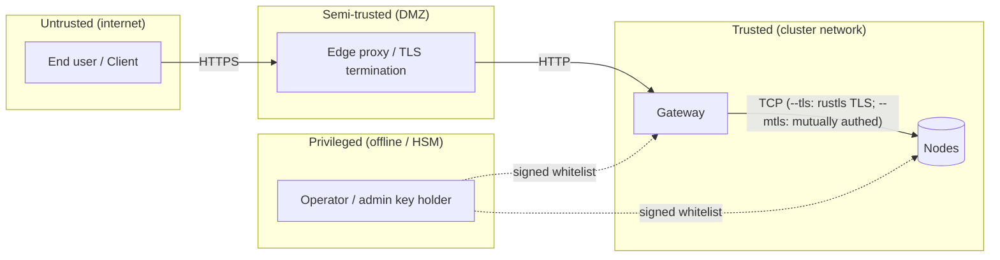

# Modelo de amenazas

Este documento enumera los **adversarios**, **activos**, **suposiciones de
confianza** y **mitigaciones** para un despliegue de holofs. Utiliza la
taxonomía STRIDE ([Howard & LeBlanc 2003](https://learn.microsoft.com/en-us/azure/security/develop/threat-modeling-tool-threats))
para clasificar las amenazas y la lente [LINDDUN](https://linddun.org/) para
las preocupaciones de privacidad.

## Contenido

1. [Alcance y activos](#1-scope-and-assets)
2. [Fronteras de confianza](#2-trust-boundaries)
3. [Catálogo de adversarios](#3-adversary-catalogue)
4. [Análisis STRIDE](#4-stride-analysis)
5. [Análisis de privacidad (LINDDUN)](#5-privacy-linddun-analysis)
6. [No-objetivos y limitaciones explícitas](#6-non-goals-and-explicit-limitations)
7. [Registro de riesgo residual](#7-residual-risk-register)

---

## 1. Scope and assets

### 1.1. Dentro del alcance

El sistema bajo consideración es un clúster holofs como se describe en
[architecture.md](./architecture.md):

- Gateway HTTP (binario `holofs-web`, axum + Leptos SSR).
- Demonios de node (binario `holofs-node`), 1..N por host.
- El protocolo de cable entre ellos (véase [api.md §2](./api.md#2-wire-protocol-tcp)).
- Estado en disco (shards, manifests, catálogo, whitelist).
- La whitelist firmada + el material de identidad Ed25519.

### 1.2. Fuera del alcance

- El kernel del sistema operativo y el hipervisor.
- El reverse proxy terminador de TLS (si se usa externamente).
- El navegador / aplicación cliente del usuario.
- Canales laterales derivados de cachés de CPU compartidas con co-inquilinos
  (mitigación: nodes dedicados para despliegues sensibles).
- Ataques físicos sobre los medios de almacenamiento.

### 1.3. Activos a proteger

| Activo                         | Confidencialidad | Integridad | Disponibilidad |
|--------------------------------|:----------------:|:----------:|:--------------:|
| Payload del objeto             | ●                | ●          | ●              |
| Metadatos del objeto (nombre, kind) | ◐           | ●          | ●              |
| Catálogo (objeto → manifest)   |                  | ●          | ●              |
| Whitelist + pubkey de admin    |                  | ●          | ●              |
| Claves secretas Ed25519 por node | ●              | ●          |                |
| Datos de salud / liveness del clúster |           | ●          | ◐              |

Leyenda: ● crítico, ◐ moderado.

---

## 2. Trust boundaries

| Frontera           | Autenticación                   | Cifrado         | Notas de hardening |
|--------------------|---------------------------------|-----------------|--------------------|
| Usuario → Edge     | Nivel de aplicación (cookies, JWT) | TLS 1.3      | Fuera de alcance   |
| Edge → Gateway     | Ninguna hoy (planificado: mTLS) | Ninguno / mTLS  | Vincular el gateway a una VLAN privada |
| Gateway ↔ Node     | Ed25519 challenge-response (+ mTLS opcional) | TCP plano, o rustls TLS vía `--tls` (Etapa 6) | Nonce del protocolo de cable + handshake firmado; `--mtls` añade verificación de cert X.509 |
| Operador → Clúster | Ed25519 del admin firma la whitelist | Out-of-band | Mantener la clave de admin offline / HSM |

---

## 3. Adversary catalogue

| Adversario                 | Posición                            | Objetivo                          | Capacidad      |
|----------------------------|-------------------------------------|-----------------------------------|----------------|
| **Anónimo externo**        | Internet pública                    | Leer / borrar objetos, DoS        | Red + L7       |
| **Cliente comprometido**   | Tiene una sesión HTTP válida        | Exfiltrar datos de otros usuarios | L7             |
| **Observador de red**      | En la ruta entre gateway/nodes      | Leer tráfico, replay, MITM        | L3 / L4        |
| **Node comprometido**      | Tiene una clave de node válida      | Servir datos incorrectos, rehusar auditoría | Protocolo de cable |
| **Node Sybil**             | No posee clave pero intenta unirse  | Polucionar placement / dedup      | Protocolo de cable |
| **Operador comprometido**  | Tiene la clave de admin             | Control total del clúster         | Total          |
| **Lectura interna**        | Lectura de filesystem en un host de node | Leer shards / metadatos      | Shell del SO   |
| **Coerción / citación**    | Compulsión legal contra los operadores | Recuperar un objeto específico | Legal          |

El adversario que justifica el mayor esfuerzo de modelado es el **node
comprometido**: un par totalmente autenticado que se comporta mal de manera
selectiva. La mayoría de las mitigaciones en este documento lo atacan.

---

## 4. STRIDE analysis

### 4.1. Spoofing

| # | Amenaza                                              | Mitigación |
|---|------------------------------------------------------|------------|
| S1 | El atacante suplanta a un node para recibir shards  | Reto Ed25519 (`AuthChallenge`) — el gateway verifica la firma con el pubkey de la whitelist antes de confiar en cualquier respuesta. Véase [api.md §2 handshake](./api.md#authentication-handshake). |
| S2 | El atacante suplanta al gateway ante un node        | Ejecutar con `--mtls`: el node rechaza cualquier handshake TLS cuyo cert de cliente no esté firmado por la CA compartida. Sin `--mtls`, recurrir a despliegue en VLAN privada. |
| S3 | Actualización forjada de la whitelist               | La whitelist está firmada con la clave Ed25519 del admin; los nodes rechazan actualizaciones sin firma o con firma errónea. |
| S4 | Replay de una respuesta capturada                   | El nonce por petición en `AuthChallenge` garantiza que las firmas se atan a un reto fresco. Los frames de cable aún no llevan nonce de replay para mensajes que no son de handshake — véase [§7](#7-residual-risk-register). |

### 4.2. Tampering

| # | Amenaza                                              | Mitigación |
|---|------------------------------------------------------|------------|
| T1 | El node devuelve payload de shard corrupto          | La identidad de cada shard es `SHA-256(coeffs ‖ payload)`. El gateway recalcula; un desajuste se rechaza y cuenta contra `reputation`. |
| T2 | El node devuelve un shard distinto al solicitado    | El manifest lista `shard_hashes[c][l][idx]`; el gateway verifica que el hash coincide con la entrada esperada. |
| T3 | Corrupción en disco (bitrot)                        | Los nombres de archivo de los shards *son* sus hashes — el escaneo de arranque y la tarea `Audit` en segundo plano detectan desajustes y disparan reparación RLNC. |
| T4 | Modificación del archivo de catálogo                | Las escrituras del catálogo son `write-tmp+fsync+rename`. La raíz Merkle en cada manifest cruza-verifica todos los shards; las entradas de catálogo volteadas afloran como fallos de decode. |
| T5 | MITM modifica bytes del cable                       | Ejecutar con `--tls`: rustls (TLS 1.2/1.3 a través del proveedor `ring`) autentica al servidor y cifra cada frame. La verificación de hash de shard sigue siendo una comprobación de defensa en profundidad dentro del túnel TLS. |

### 4.3. Repudiation

| # | Amenaza                                              | Mitigación |
|---|------------------------------------------------------|------------|
| R1 | El node niega haber servido una respuesta incorrecta | La puntuación de reputación se actualiza del lado del servidor a partir de desajustes de hash auditables; el dashboard de ops registra `audit_fail_total` por node. |
| R2 | El operador niega una acción de admin               | Las actualizaciones de whitelist llevan la firma Ed25519 del admin; el archivo de whitelist *comprometido* es el rastro de auditoría. |

### 4.4. Information disclosure

| # | Amenaza                                              | Mitigación |
|---|------------------------------------------------------|------------|
| I1 | Un solo node leyendo "sus" shards revela texto plano | Un shard individual es `coeffs · chunks` sobre GF(2⁸), una combinación lineal aleatoria de chunks. Recuperar texto plano desde menos de `K` shards independientes requiere resolver un sistema lineal infradeterminado — inviable teórico-informativamente **para un único shard aleatorio**. |
| I2 | El adversario recolecta ≥ K shards de un objeto     | RLNC sobre GF(2⁸) pública **no** es un esquema de cifrado. Cualesquiera K shards linealmente independientes reconstruyen el payload. Mitigación: **cifrado en reposo por node** (Etapa 7 planificada) y **diversidad de placement** — bajo `RendezvousZoneAware`, K shards se reparten entre ≥ K nodes distintos en ≥ ⌈K/zone_count⌉ zonas, por lo que leerlos requiere comprometer esa cantidad. |
| I3 | Filtración de metadatos: nombre + kind + tamaño     | El manifest almacena el nombre del objeto y el content type en texto plano. Los despliegues sensibles deberían hashear o pseudonimizar los nombres antes de subirlos. |
| I4 | Canales laterales (caché, timing de red)            | No mitigado en 0.1 — usa CPUs / red dedicadas para despliegues sensibles. |
| I5 | Filtración de backup                                | Los backups heredan la misma amenaza: deben estar cifrados en reposo (`restic --pass-file`, S3 SSE-KMS). |
| I6 | Filtración de Holoshare                             | Un archivo `.holoshare` individual es un share de un split `(k,n)` Shamir-vía-RLNC. Poseer menos de `k` es seguro teórico-informativamente (véase [theory.md §8](./theory.md#8-shamir-via-rlnc-key-escrow)). |

### 4.5. Denial of service

| # | Amenaza                                              | Mitigación |
|---|------------------------------------------------------|------------|
| D1 | Inundar el gateway con subidas                      | El gateway debe ejecutarse detrás de un reverse proxy con rate-limit. El tamaño de los frames de cable está limitado a `MAX_FRAME = 64 MiB` en cada node. |
| D2 | Un solo node rechaza peticiones                     | RLNC tiene redundancia ≥ K-de-N por capa. La tarea de reparación detecta y resucita shards sobre nodes vivos. |
| D3 | Interrupción coordinada de medio clúster            | El margen está dimensionado para **cualquier una zona + fallos individuales dispersos** (véase [theory.md §3](./theory.md#3-priority-layers)). Interrupciones más grandes degradan suavemente: L3 (detalle cosmético) se pierde primero, luego L2, L1. |
| D4 | Node "sleeper" que acepta puts pero nunca devuelve gets | La tarea de auditoría emite sondeos `Audit(shard_hash)` aleatorios — un node no responsivo o que responde mal pierde reputación y deja de ser elegido para placement. |
| D5 | Slow-loris sobre TCP                                | Timeouts de I/O de Tokio en cada lectura de frame; configurable vía `HOLOFS_WIRE_TIMEOUT`. |
| D6 | Agotamiento de memoria mediante frame enorme        | Los frames > `MAX_FRAME` son rechazados antes de la asignación. |

### 4.6. Elevation of privilege

| # | Amenaza                                              | Mitigación |
|---|------------------------------------------------------|------------|
| E1 | Sybil: el atacante engendra N nodes falsos para absorber datos | Los nodes solo se unen si su pubkey aparece en la whitelist firmada por el admin. Generar claves válidas no ayuda — deben ser admitidos. |
| E2 | Un gateway comprometido accede a todo              | El gateway no tiene clave de admin; no puede acuñar nuevas entradas en la whitelist. Un compromiso afecta a ingress/egress y a la frescura del catálogo pero no puede subvertir la raíz de confianza. |
| E3 | Clave de admin comprometida                         | Esto es compromiso total. Mitigación: mantener la clave de admin offline (HSM / backup en papel), rotar vía procedimiento de control dual. |
| E4 | Escalada de privilegios dentro del contenedor       | El contenedor se ejecuta como `uid 10001`, `readOnlyRootFilesystem: true`, `capabilities.drop: [ALL]`. |
| E5 | Path traversal en nombres de objeto                 | Los nombres de objeto se almacenan solo en el catálogo; las rutas en disco están direccionadas por contenido (`<hex2>/<hex62>.shard`). El nombre del objeto nunca alcanza el filesystem. |

---

## 5. Privacy (LINDDUN) analysis

Holofs **no** es un filesystem que preserve la privacidad por diseño —
prioriza la durabilidad, dedup y la resiliencia. Las siguientes son superficies
que los operadores deben considerar.

| Categoría LINDDUN  | Preocupación                             | Acción del operador |
|--------------------|------------------------------------------|---------------------|
| **L**inkability    | Los sketches de MinHash revelan similitud de texto; los hashes perceptuales enlazan imágenes casi duplicadas. | Deshabilitar los endpoints de analítica (`/similar`, `/diff`) para inquilinos sensibles a la privacidad. |
| **I**dentifiability | Los nombres de objeto se almacenan literalmente. | Hashear / pseudonimizar nombres del lado cliente. |
| **N**on-repudiation | Los logs de auditoría identifican los nodes que sirven contenido. | Aceptable en contextos de ops de confianza. |
| **D**etectability  | La existencia de un objeto es inferible desde `/api/stats`. | `/api/stats` solo autenticado. |
| **D**isclosure     | Véase §4.4 — I1–I6.                      | Cifrado en reposo de la Etapa 7. |
| **U**nawareness    | Dedup significa que la subida *de otro inquilino* puede producir el mismo `data_cid`. | Despliegues de un solo inquilino únicamente cuando esto importe. |
| **N**oncompliance  | "Derecho al olvido" de GDPR — `DELETE /<name>` emite `Purge` a todos los nodes; pero **los shards pueden haber sido respaldados fuera del sitio**. | Documentar la retención de backups; exponer `holofs-admin shred` para borrado de grado forense. |

---

## 6. Non-goals and explicit limitations

Lo siguiente **no** lo ofrece holofs 0.1 y requiere controles externos si se
necesita:

1. **Cifrado de extremo a extremo.** Los payloads se almacenan codificados pero
   no cifrados. Un node con ≥ K shards de un objeto puede reconstruirlo. Los
   operadores deben clasificar holofs como "datos en claro" en reposo.
2. **Aislamiento de inquilinos.** No hay namespace por usuario; todos los
   objetos comparten un único catálogo. Los despliegues multi-inquilino deben
   anteponer a holofs un proxy autorizador.
3. **Log de auditoría tamper-evident.** La reputación rastrea el mal
   comportamiento de los nodes pero no produce un log firmado y append-only.
4. **Anti-replay criptográfico en frames de cable.** Solo el `AuthChallenge`
   lleva un nonce. La Etapa 7 añade keying por sesión.
5. **Resistencia cuántica.** Ed25519 y SHA-256 son pre-cuánticos. La Etapa 8
   evalúa la migración PQ.

---

## 7. Residual risk register

| Riesgo                                              | Severidad | Probabilidad | Control compensatorio |
|-----------------------------------------------------|:---------:|:------------:|-----------------------|
| Tráfico de cable en texto plano en LAN compartida   | Baja      | Baja         | Mitigado por `--tls` (rustls TLS 1.2/1.3, Etapa 6). Los operadores que no establezcan `--tls` deberían restringir a una VLAN privada. |
| Compromiso de la clave de admin                     | Crítica   | Baja         | Almacenamiento offline; drill de rotación trimestral |
| Replay de frames de cable (no-handshake)            | Media     | Baja         | El binding por hash limita el daño a la integridad, no a la confidencialidad |
| Ataques de canal lateral sobre CPU compartida       | Media     | Baja         | Nodes dedicados para cargas sensibles |
| Filtración de backup                                | Alta      | Media        | Cifrar backups (`restic`, SSE-KMS) |
| Borrado GDPR incompleto debido a backups            | Media     | Media        | Política documentada de retención + divulgación al cliente |
| Compromiso del operador vía supply chain            | Alta      | Baja         | Builds reproducibles + releases firmados (Etapa 8) |

Cada riesgo tiene un propietario (`@holofs/security`) y una release de
mitigación planificada. Seguimiento vía issues de GitHub con etiqueta
`security`.
