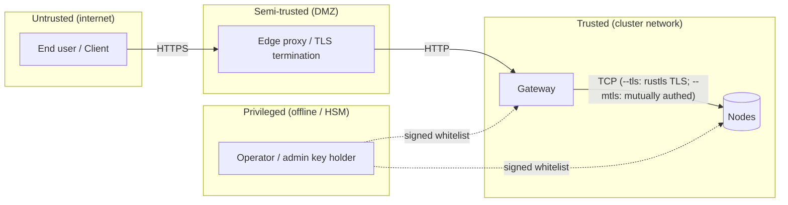

# Modelo de amenazas

Este documento enumera los **adversarios**, **activos**, **supuestos de
confianza** y **mitigaciones** de un despliegue de holofs. Utiliza la
taxonomía STRIDE ([Howard & LeBlanc 2003](https://learn.microsoft.com/en-us/azure/security/develop/threat-modeling-tool-threats))
para clasificar las amenazas y la lente [LINDDUN](https://linddun.org/) para
las preocupaciones de privacidad.

## Contenido

1. [Alcance y activos](#1-alcance-y-activos)
2. [Fronteras de confianza](#2-fronteras-de-confianza)
3. [Catálogo de adversarios](#3-catálogo-de-adversarios)
4. [Análisis STRIDE](#4-análisis-stride)
5. [Análisis de privacidad (LINDDUN)](#5-análisis-de-privacidad-linddun)
6. [No-objetivos y limitaciones explícitas](#6-no-objetivos-y-limitaciones-explícitas)
7. [Registro de riesgo residual](#7-registro-de-riesgo-residual)

---

## 1. Alcance y activos

### 1.1. Dentro del alcance

El sistema bajo consideración es un clúster holofs como se describe en
[architecture.md](./architecture.md):

- Gateway HTTP (binario `holofs-web`, axum + Leptos SSR).
- Demonios de nodo (binario `holofs-node`), 1..N por host.
- El protocolo de cable entre ellos (véase [api.md §2](./api.md#2-protocolo-de-cable-tcp)).
- El estado en disco (shards, manifiestos, catálogo, whitelist).
- La whitelist firmada + material de identidad Ed25519.

### 1.2. Fuera del alcance

- El kernel del sistema operativo y el hipervisor.
- El reverse proxy que termina TLS (si se usa externamente).
- El navegador / aplicación cliente del usuario.
- Canales laterales derivados de cachés de CPU compartidas con
  co-inquilinos (mitigación: nodos dedicados para despliegues sensibles).
- Ataques físicos contra los medios de almacenamiento.

### 1.3. Activos a proteger

| Activo                            | Confidencialidad | Integridad | Disponibilidad |
|-----------------------------------|:----------------:|:----------:|:--------------:|
| Payload del objeto                | ●                | ●          | ●              |
| Metadatos del objeto (nombre, tipo) | ◐              | ●          | ●              |
| Catálogo (objeto → manifiesto)    |                  | ●          | ●              |
| Whitelist + pubkey de admin       |                  | ●          | ●              |
| Claves secretas Ed25519 por nodo  | ●                | ●          |                |
| Datos de salud / liveness del clúster |              | ●          | ◐              |

Leyenda: ● crítico, ◐ moderado.

---

## 2. Fronteras de confianza

| Frontera             | Autenticación                     | Cifrado         | Notas de endurecimiento |
|----------------------|-----------------------------------|-----------------|-------------------------|
| Usuario → Edge       | Nivel de aplicación (cookies, JWT) | TLS 1.3        | Fuera del alcance       |
| Edge → Gateway       | Ninguna hoy (planificado: mTLS)   | Ninguno / mTLS  | Vincular gateway a VLAN privada |
| Gateway ↔ Nodo       | Reto-respuesta Ed25519 (+ mTLS opcional) | TCP plano, o rustls TLS vía `--tls` | Nonce de protocolo de cable + handshake firmado; `--mtls` añade verificación de cert. X.509 |
| Operador → Clúster   | El admin Ed25519 firma la whitelist | Fuera de banda | Mantener la clave del admin offline / HSM |

---

## 3. Catálogo de adversarios

| Adversario                    | Posición                             | Objetivo                            | Capacidad      |
|-------------------------------|--------------------------------------|-------------------------------------|----------------|
| **Anónimo externo**           | Internet pública                     | Leer / borrar objetos, DoS          | Red + L7       |
| **Cliente comprometido**      | Posee sesión HTTP válida             | Exfiltrar datos de otros usuarios   | L7             |
| **Observador de red**         | En la ruta entre gateway/nodos       | Leer tráfico, replay, MITM          | L3 / L4        |
| **Nodo comprometido**         | Posee clave de nodo válida           | Servir datos incorrectos, negar auditoría | Protocolo de cable |
| **Nodo Sybil**                | No tiene clave pero intenta unirse   | Contaminar placement / dedup        | Protocolo de cable |
| **Operador comprometido**     | Posee la clave del admin             | Control total del clúster           | Completa       |
| **Lectura interna**           | Lectura de filesystem en un host de nodo | Leer shards / metadatos          | Shell del SO   |
| **Coerción / requerimiento judicial** | Coacción legal contra operadores | Recuperar un objeto específico   | Legal          |

El adversario que merece más esfuerzo de modelado es el **nodo
comprometido**: un peer totalmente autenticado que se comporta mal
selectivamente. La mayoría de las mitigaciones de este documento
apuntan a él.

---

## 4. Análisis STRIDE

### 4.1. Spoofing

| # | Amenaza                                                | Mitigación |
|---|--------------------------------------------------------|------------|
| S1 | El atacante suplanta a un nodo para recibir shards    | Reto Ed25519 (`AuthChallenge`) — el gateway verifica la firma con la pubkey de la whitelist antes de confiar en cualquier respuesta. Véase [api.md handshake](./api.md#handshake-de-autenticación). |
| S2 | El atacante suplanta al gateway ante un nodo          | Ejecutar con `--mtls`: el nodo rechaza cualquier handshake TLS cuyo certificado de cliente no esté firmado por la CA compartida. Sin `--mtls`, recurrir a despliegue en VLAN privada. |
| S3 | Actualización de whitelist forjada                    | La whitelist se firma con la clave Ed25519 del admin; los nodos rechazan actualizaciones sin firmar o con firma incorrecta. |
| S4 | Replay de una respuesta capturada                     | El nonce por petición en `AuthChallenge` asegura que las firmas se enlazan a un reto fresco. Las tramas de cable aún no llevan nonce de replay para mensajes fuera del handshake — véase [§7](#7-registro-de-riesgo-residual). |

### 4.2. Tampering

| # | Amenaza                                                | Mitigación |
|---|--------------------------------------------------------|------------|
| T1 | El nodo devuelve payload de shard corrupto            | La identidad de cada shard es `SHA-256(coeffs ‖ payload)`. El gateway recalcula; una discrepancia se rechaza y cuenta contra la `reputation`. |
| T2 | El nodo devuelve un shard distinto al solicitado      | El manifiesto lista `shard_hashes[c][l][idx]`; el gateway verifica que el hash coincida con la entrada esperada. |
| T3 | Corrupción en disco (bitrot)                          | Los nombres de archivo de los shards *son* sus hashes — el escaneo al arranque y la tarea `Audit` en segundo plano detectan discrepancias y disparan reparación RLNC. |
| T4 | Modificación del archivo del catálogo                 | Las escrituras del catálogo son `write-tmp+fsync+rename`. La raíz Merkle de cada manifiesto verifica cruzadamente todos los shards; entradas de catálogo alteradas se manifiestan como fallos de decodificación. |
| T5 | MITM modifica bytes en el cable                       | Ejecutar con `--tls`: rustls (TLS 1.2/1.3 vía el proveedor `ring`) autentica al servidor y cifra cada trama. La verificación de hash de shard sigue siendo una comprobación en profundidad dentro del túnel TLS. |

### 4.3. Repudiación

| # | Amenaza                                                | Mitigación |
|---|--------------------------------------------------------|------------|
| R1 | El nodo niega haber servido una respuesta incorrecta  | La puntuación de reputación se actualiza en el lado del servidor a partir de discrepancias de hash auditables; el dashboard de ops registra `audit_fail_total` por nodo. |
| R2 | El operador niega acción administrativa               | Las actualizaciones de whitelist llevan la firma Ed25519 del admin; el archivo de whitelist *comprometido* es el rastro de auditoría. |

### 4.4. Divulgación de información

| # | Amenaza                                                | Mitigación |
|---|--------------------------------------------------------|------------|
| I1 | Un único nodo leyendo "sus" shards revela texto plano | Un shard individual es `coeffs · chunks` sobre GF(2⁸), una combinación lineal aleatoria de chunks. Recuperar texto plano a partir de menos de `K` shards independientes requiere resolver un sistema lineal subdeterminado — inviable en teoría de la información **para un único shard aleatorio**. |
| I2 | Adversario recolecta ≥ K shards de un objeto          | RLNC sobre GF(2⁸) público **no** es un esquema de cifrado. Cualquier K shards linealmente independientes reconstruyen el payload. Mitigación: **cifrado en reposo por nodo** y **diversidad de placement** — bajo `RendezvousZoneAware`, K shards abarcan ≥ K nodos distintos en ≥ ⌈K/zone_count⌉ zonas, por lo que leerlos requiere comprometer esa cantidad. |
| I3 | Fuga de metadatos: nombre + tipo + tamaño             | El manifiesto almacena el nombre del objeto y el tipo de contenido en texto plano. Los despliegues sensibles deben hashear o pseudonimizar los nombres antes de subirlos. |
| I4 | Canales laterales (caché, tiempo de red)              | No mitigados en 0.1 — usar CPUs / red dedicadas para despliegues sensibles. |
| I5 | Fuga en backups                                       | Los backups heredan la misma amenaza: deben cifrarse en reposo (`restic --pass-file`, S3 SSE-KMS). |
| I6 | Fuga de Holoshare                                     | Un archivo `.holoshare` individual es una parte de un split `(k,n)` de Shamir-vía-RLNC. Poseer menos de `k` es teoría-de-la-información seguro (véase [theory.md §8](./theory.md#8-secreto-compartido-de-shamir--rlnc)). |

### 4.5. Denegación de servicio

| # | Amenaza                                                | Mitigación |
|---|--------------------------------------------------------|------------|
| D1 | Inundar el gateway con uploads                        | El gateway debe ejecutarse detrás de un reverse proxy con rate-limiting. El tamaño de trama de cable está limitado a `MAX_FRAME = 64 MiB` en cada nodo. |
| D2 | Un único nodo rechaza peticiones                      | RLNC tiene redundancia ≥ K-de-N por capa. La auto-reparación al leer (3) + scrub en segundo plano (x) detectan y resucitan shards en nodos vivos. |
| D3 | Interrupción coordinada de media unidad de clúster    | El margen está dimensionado para **cualquier zona + fallos aislados dispersos** (véase [theory.md §4](./theory.md#4-capas-de-prioridad-y-degradación-holográfica)). Interrupciones mayores degradan con gracia: L3 (detalle cosmético) se pierde primero, luego L2, L1. |
| D4 | Nodo "durmiente" acepta puts pero nunca devuelve gets | La tarea de auditoría emite sondas aleatorias `Audit(shard_hash)` — un nodo no receptivo o que responde mal pierde reputación y deja de ser elegido para placement. Cambio x: `MissingShard` se trata como neutral (sin impacto en reputación), para evitar un bucle de retroalimentación de colisión de dedup que previamente sacaba nodos sanos del conjunto vivo. |
| D5 | Slow-loris sobre TCP                                  | Presupuesto por RPC `tokio::time::timeout` (`HOLOFS_RPC_TIMEOUT_MS`, por defecto 8 s, `0` desactiva). Una RPC agotada envenena el stream del pool y reintenta una vez sobre un socket fresco vía `is_likely_transient`. Limita la latencia visible al usuario a 8 s + un reintento en lugar del timeout TCP a nivel de SO de 60-75 s. |
| D6 | Agotamiento de memoria mediante trama enorme          | Las tramas > `MAX_FRAME` son rechazadas antes de la asignación. |
| D7 | Todos los nodos simultáneamente apagados (p. ej. carrera de arranque, deploy de flota) | x: `placement::place` devuelve `Result<_, NoLiveNodes>` en lugar de aseverar; el gateway expone un `503 ServiceUnavailable` limpio (`GatewayError::ClusterDegraded`) en lugar de entrar en pánico. Previamente, un único `assert!` sin tipo en `place_shard` podía tumbar el proceso del gateway con un solo PUT durante una caída de flota. |
| D8 | Avalancha de peticiones concurrentes agota el runtime de axum | Las rutas MEDIUM (por defecto tope 64) y LONG (por defecto tope 8) llevan un guardia `tokio::sync::Semaphore`. En saturación el middleware devuelve `503 Service Unavailable` inmediatamente (en lugar de acumular tareas en el runtime). Configurable vía `HOLOFS_MEDIUM_CONCURRENCY` / `HOLOFS_LONG_CONCURRENCY`. Los rechazos se contabilizan en `holofs_backpressure_rejected_total{bucket}`. |
| D9 | Handler lento atasca la cola de tareas de axum        | Deadlines por bucket (SHORT 10 s / MEDIUM 60 s / LONG 5 min) aplicados por un middleware `tokio::time::timeout`. Vencidos → `504 Gateway Timeout`; se incrementa `holofs_handler_timeouts_total{bucket}`. Los endpoints de streaming + MCP están intencionadamente sin presupuesto. |
| D10 | Muerte silenciosa de un bucle en segundo plano por pánico | Cada bucle de larga ejecución (monitor / auditor / scrub / persistencia de reputación) se genera dentro de `supervised_spawn`, que captura pánicos vía `JoinError` y reinicia con backoff exponencial (1 → 30 s). Los reinicios se contabilizan en `holofs_supervised_task_restarts_total{task}`. |

### 4.6. Elevación de privilegios

| # | Amenaza                                                | Mitigación |
|---|--------------------------------------------------------|------------|
| E1 | Sybil: el atacante genera N nodos falsos para absorber datos | Los nodos solo se unen si su pubkey aparece en la whitelist firmada por el admin. Generar claves válidas no ayuda — deben ser admitidas. |
| E2 | Gateway comprometido accede a todo                    | El gateway no tiene la clave del admin; no puede acuñar nuevas entradas de whitelist. El compromiso afecta al ingreso/egreso y a la frescura del catálogo pero no puede subvertir la raíz de confianza. |
| E3 | Clave del admin comprometida                          | Es un compromiso total. Mitigación: mantener la clave del admin offline (HSM / backup en papel), rotar mediante procedimiento de doble control. |
| E4 | Escalada de privilegios dentro del contenedor         | El contenedor se ejecuta como `uid 10001`, `readOnlyRootFilesystem: true`, `capabilities.drop: [ALL]`. |
| E5 | Path traversal en nombres de objeto                   | Los nombres de objeto se almacenan solo en el catálogo; las rutas en disco son direccionadas por contenido (`<hex2>/<hex62>.shard`). El nombre del objeto nunca llega al filesystem. |
| E6 | Un llamador no autenticado mata nodos / dispara GC de todo el clúster | `POST /admin/node` (kill/revive) y `POST /api/gc` requieren `Authorization: Bearer $HOLOFS_ADMIN_TOKEN` cuando la variable de entorno está definida. Falta → 401, incorrecta → 401, variable sin definir → **403 (surface desactivada)** como seguro-por-defecto. El override de desarrollo `HOLOFS_ADMIN_UNAUTHENTICATED=1` reabre los endpoints y registra un WARN al arranque. Los rechazos se dividen por razón en `holofs_admin_auth_failures_total{outcome}`. |

---

## 5. Análisis de privacidad (LINDDUN)

Holofs **no** es un filesystem que preserve la privacidad por diseño —
prioriza durabilidad, dedup y resiliencia. Lo siguiente son superficies
que los operadores deben considerar.

| Categoría LINDDUN     | Preocupación                              | Acción del operador |
|-----------------------|-------------------------------------------|---------------------|
| **L**inkability       | Los sketches MinHash revelan similitud textual; los hashes perceptuales enlazan imágenes casi duplicadas. | Deshabilitar endpoints de analítica (`/similar`, `/diff`) para inquilinos sensibles a la privacidad. |
| **I**dentifiability   | Los nombres de objeto se almacenan literalmente. | Hashear / pseudonimizar nombres del lado del cliente. |
| **N**on-repudiation   | Los logs de auditoría identifican nodos que sirven contenido. | Aceptable en contextos de ops confiables. |
| **D**etectability     | La existencia de un objeto se puede inferir de `/api/stats`. | Solo `/api/stats` autenticado. |
| **D**isclosure        | Véase §4.4 — I1–I6. | cifrado en reposo. |
| **U**nawareness       | El dedup significa que el upload de *otro inquilino* puede producir el mismo `data_cid`. | Solo despliegues mono-inquilino cuando esto importe. |
| **N**oncompliance     | "Derecho al olvido" del GDPR — `DELETE /<name>` emite `Purge` a todos los nodos; pero **los shards pueden haber sido respaldados fuera del sitio**. | Documentar la retención de backups; exponer `holofs-admin shred` para borrado forense. |

---

## 6. No-objetivos y limitaciones explícitas

Los siguientes **no** son ofrecidos por holofs 0.1 y requieren controles
externos si son necesarios:

1. **Cifrado extremo a extremo.** Los payloads se almacenan codificados
   pero no cifrados. Un nodo con ≥ K shards de un objeto puede
   reconstruirlo. Los operadores deben clasificar holofs como
   "datos-en-claro" en reposo.
2. **Aislamiento de inquilinos.** No hay namespace por usuario; todos los
   objetos comparten un único catálogo. Los despliegues multi-inquilino
   deben poner delante de holofs un proxy autorizador.
3. **Log de auditoría a prueba de manipulación.** La reputación rastrea
   mal comportamiento de nodo pero no produce un log firmado y sólo de
   anexión.
4. **Anti-replay criptográfico sobre tramas de cable.** Solo el
   `AuthChallenge` lleva un nonce. Añade claves por sesión.
5. **Resistencia cuántica.** Ed25519 y SHA-256 son pre-cuánticos.
   Evalúa migración PQ.

---

## 7. Registro de riesgo residual

| Riesgo                                                | Severidad | Probabilidad | Control compensatorio |
|-------------------------------------------------------|:---------:|:------------:|-----------------------|
| Tráfico de cable en texto claro en LAN compartida     | Baja      | Baja         | Mitigado por `--tls` (rustls TLS 1.2/1.3). Los operadores que no configuran `--tls` deben restringirse a una VLAN privada. |
| Compromiso de la clave del admin                      | Crítica   | Baja         | Almacenamiento offline; simulacro de rotación trimestral |
| Replay de trama de cable (fuera del handshake)        | Media     | Baja         | El enlace por hash limita el daño a integridad, no a confidencialidad |
| Ataques de canal lateral en CPU compartida            | Media     | Baja         | Nodos dedicados para cargas sensibles |
| Fuga en backup                                        | Alta      | Media        | Cifrar backups (`restic`, SSE-KMS) |
| Borrado por GDPR incompleto por backups               | Media     | Media        | Política de retención documentada + divulgación al cliente |
| Compromiso del operador vía cadena de suministro      | Alta      | Baja         | Builds reproducibles + releases firmados |

Cada riesgo tiene un propietario (`@holofs/security`) y una release de
mitigación planificada. Se rastrean vía issues de GitHub con la etiqueta
`security`.
