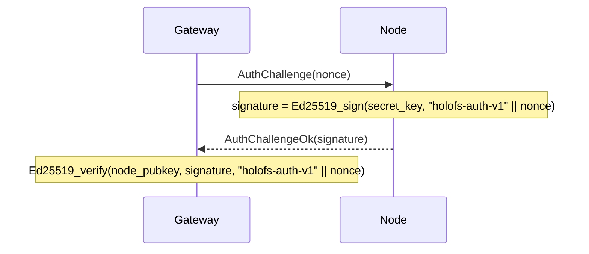

# Référence de l'API

Trois interfaces externes : **passerelle HTTP**, **protocole filaire
de nœud** et **formats de fichier sur disque** (manifeste, catalogue,
shard, liste blanche, holoshare).

## Sommaire

1. [Passerelle HTTP](#1-passerelle-http)
2. [Protocole filaire (TCP)](#2-protocole-filaire-tcp)
3. [Formats sur disque](#3-formats-sur-disque)
4. [Conventions d'en-têtes de réponse](#4-conventions-den-têtes-de-réponse)
5. [Serveur MCP](#5-serveur-mcp)
6. [Opérations en ondelettes](#6-opérations-en-ondelettes)

---

## 1. Passerelle HTTP

URL de base : `http://<addr>:8787/` (HTTPS via l'échafaudage TLS
propre à la passerelle depuis `HOLOFS_TLS=1`, mTLS via
`HOLOFS_MTLS=1`).

> Les chemins sont séparés par des barres obliques et adressables sous
> forme de jokers (`/photos/2026/img.jpg`). Les segments de niveau
> supérieur réservés — `api`, `health`, `escrow`, `preview`, `inspect`,
> `similar`, `diff`, `admin`, `metrics`, `pkg`, `help`, `inspect-zoom`
> — ne peuvent pas être utilisés comme premier segment d'un chemin
> d'objet parce qu'ils masqueraient de vraies routes.

> `GET /<path>` et `GET /preview/<path>` honorent l'en-tête de requête
> `Range:` conformément à la RFC 9110 §14.2. Une plage d'octets unique
> satisfiable retourne `206 Partial Content` avec `Content-Range`.
> L'objet est décodé côté serveur en entier et la réponse est une
> tranche du tampon résultant (le streaming progressif par couche
> n'est pas implémenté). Les requêtes multi-plages retombent sur un
> `200` avec le corps complet ; les en-têtes malformés sont ignorés.
> `Range: bytes=A-B` au-delà de EOF répond `416` avec
> `Content-Range: bytes */<total>`.

### CRUD de catalogue

| Méthode  | Chemin                    | Description                                 | Corps / paramètres |
|----------|---------------------------|---------------------------------------------|--------------------|
| `GET`    | `/`                       | Catalogue HTML ; lit `?p=<prefix>` pour le répertoire à lister | — |
| `GET`    | `/<path>`                 | Télécharger l'objet sous forme canonique. Honore `Range` — `206` sur partiel, `416` sur non satisfiable. | Range supporté |
| `GET`    | `/preview/<path>`         | Aperçu grossier (L0 uniquement). Range honoré contre le corps à la taille de l'aperçu. | Range supporté |
| `PUT`    | `/<path>`                 | Envoyer des octets bruts, type auto-détecté. Le répertoire parent doit exister (via `mkdir`) | corps = fichier |
| `DELETE` | `/<path>`                 | Retirer l'objet + Purge sur tous les nœuds. Refuse les entrées de répertoire (utiliser `rmdir`) | — |

### Opérations de répertoire

Deux variantes de chaque mutation de catalogue : une variante JSON à
joker pour les appelants programmatiques / `curl`, et un POST
form-urlencoded que les formulaires HTML de l'UI peuvent frapper sans
JavaScript. Les variantes formulaire redirigent 303 vers
`/?p=<parent>` afin que le navigateur navigue de retour vers le
répertoire que l'utilisateur regardait.

| Méthode  | Chemin                    | Description                                                 | Corps / paramètres |
|----------|---------------------------|-------------------------------------------------------------|---------------------|
| `POST`   | `/api/mkdir/<path>`       | Créer un marqueur `Directory`. Le parent doit exister.      | — (réponse JSON)    |
| `POST`   | `/api/mkdir`              | mkdir compatible formulaire ; redirige vers `/?p=<parent>`  | `parent=…&name=…`   |
| `DELETE` | `/api/rmdir/<path>`       | Supprimer un répertoire vide. 409 s'il a des enfants.       | — (réponse JSON)    |
| `POST`   | `/api/rmdir`              | rmdir compatible formulaire ; redirige en cas de succès     | `path=…`            |
| `POST`   | `/api/mv`                 | Renommer / déplacer ; les répertoires emportent tous leurs descendants | `from=…&to=…` |
| `POST`   | `/api/list_dir`           | Fonction serveur Leptos : enfants immédiats de `prefix` (JSON-RPC) | `{"prefix":"…"}` |

Mapping code de statut pour les ops de répertoire :

| Résultat                                       | Statut | `GatewayError`           |
|------------------------------------------------|--------|--------------------------|
| OK                                             | 200 / 201 / 303 | —              |
| Cible déjà existante                           | 409    | `AlreadyExists`          |
| Le chemin existe mais n'est pas un répertoire  | 409    | `NotADirectory`          |
| `rmdir` sur un répertoire non vide             | 409    | `DirectoryNotEmpty`      |
| `GET`/`DELETE` d'une entrée `Directory`        | 409    | `IsDirectory`            |
| Chemin malformé (`..`, `//`, `/` en tête)      | 400    | `BadRequest`             |
| Répertoire parent manquant                     | 400    | `BadRequest`             |
| Entrée inconnue                                | 404    | `NotFound`               |

#### Réponse par type

| Type      | `GET /<path>` retourne                                       |
|-----------|--------------------------------------------------------------|
| image     | `image/png` (ré-encodé depuis les canaux f32)                |
| audio     | `audio/wav` (PCM 16 bits, mono/stéréo selon stockage)        |
| text      | content-type texte selon l'extension, le corps inclut des marqueurs de trou si les shards sont courts |
| opaque    | content-type original + `Content-Disposition: attachment`    |
| directory | `409 Conflict` — les répertoires n'ont pas de charge utile   |

### Santé du cluster

| Méthode | Chemin                | Description                                   |
|---------|-----------------------|-----------------------------------------------|
| `GET`   | `/health`             | Tableau par nœud, boutons kill/revive         |
| `GET`   | `/health/<name>`      | Marge par (canal, couche), simulation Monte-Carlo de perte, tableau de défaillance de zone |
| `GET`   | `/api/stats`          | JSON : comptes d'objets par type, shards, % dedup |
| `POST`  | `/admin/node` (`i=N`) | Basculer le nœud N (exclu/rétabli côté admin). **Gardé par auth admin** — exige `Authorization: Bearer $HOLOFS_ADMIN_TOKEN` quand la variable d'environnement est définie. |

`/api/stats` retourne :

```json
{
  "nodes_total": 40,
  "nodes_live": 38,
  "objects_total": 14,
  "objects_by_kind": {"image": 7, "audio": 3, "text": 1, "opaque": 1, "directory": 2},
  "shards_total": 5328,
  "shards_unique": 5326,
  "dedup_savings_pct": 0.04,
  "bytes_total": 50266112,
  "auto_repairs_total": 0,
  "auto_repair_failures_total": 0,
  "scrub_runs_total": 8,
  "scrub_repairs_total": 0
}
```

`objects_total = sum(objects_by_kind)` ; les marqueurs `directory`
sont comptés mais ne contribuent en rien à `shards_total` /
`bytes_total`.

Les quatre compteurs de queue exposent l'activité d'auto-guérison :

- `auto_repairs_total` — GETs qui ont déclenché le bras de retry de
  `decode_with_autorepair` (LayerLost au premier décodage →
  repair_object_inplace → second décodage).
- `auto_repair_failures_total` — passe de réparation auto qui a
  elle-même échoué (trop peu de donneurs, second décodage encore
  LayerLost, etc.).
- `scrub_runs_total` — ticks de scrub d'arrière-plan complétés
  (`HOLOFS_SCRUB_INTERVAL`, 600 s par défaut).
- `scrub_repairs_total` — objets que le scrub a réparés *avant*
  qu'un utilisateur ne les rencontre.

Un cluster sain garde les quatre à zéro ou proche de zéro ; un taux
non nul soutenu sur `auto_repair_failures_total` est le signal
d'alerte opérateur.

#### `GET /metrics` — exposition Prometheus

Corps `text/plain; version=0.0.4` — chaque gauge / counter émet des
lignes `# HELP` + `# TYPE`. Voir
[`docs/fr/operations.md § 6.1`](operations.md#61-endpoint-de-métriques)
pour le catalogue complet des métriques, les étiquettes et
l'interprétation. Compteurs de fiabilité à signaler :

- `holofs_catalog_persist_failures_total` — erreurs d'écriture disque
  sur la sauvegarde atomique du catalogue.
- `holofs_handler_timeouts_total{bucket="short|medium|long"}` —
  réponses 504.
- `holofs_backpressure_rejected_total{bucket="medium|long"}` —
  réponses 503 sur saturation du sémaphore.
- `holofs_backpressure_permits_available{bucket="medium|long"}` —
  gauge de permis encore libres.
- `holofs_supervised_task_restarts_total{task="monitor|auditor|scrub"}`
  — redémarrages de boucle supervisée sur panique.
- `holofs_admin_auth_failures_total{outcome="missing|bad|disabled"}` —
  rejets de jeton bearer admin ventilés par raison.

`/metrics` vit dans le seau de routes SHORT et hérite de la deadline
de 10 s ; une réponse `/metrics` lente est elle-même un signal
d'alerte.

### Recherche et analytique

| Méthode | Chemin                        | Description                                  |
|---------|-------------------------------|----------------------------------------------|
| `GET`   | `/similar/<path>`             | Top-10 des objets similaires + recouvrement inter-objets |
| `GET`   | `/diff?a=<a>&b=<b>`           | Visualisation du diff par chunk. Deux chemins d'objet ne tiennent pas dans une seule route, donc déplacés dans la chaîne de requête |
| `GET`   | `/api/fingerprint/<path>`     | JSON : hachage perceptuel 16 octets (image/audio) ou 16 premiers du CID (text/opaque) |

`/api/fingerprint/<name>` retourne :

```json
{
  "name": "photo.png",
  "fingerprint": "a3f08c7d12...",
  "kind": "image"
}
```

### Inspection de shards

Le triplet `c_l_idx` identifie un shard dans un objet comme
`<channel>_<layer>_<idx>`. L'URL place le triplet fixe devant le
chemin d'objet à joker.

| Méthode | Chemin                                                   | Description |
|---------|----------------------------------------------------------|-------------|
| `GET`   | `/inspect/<path>`                                        | Grille de toutes les vignettes de shards (codées par couleur sys vs RLNC) |
| `GET`   | `/api/shard/<c_l_idx>.png/<path>`                        | PNG en niveaux de gris 32×32 de la charge utile d'un shard |
| `GET`   | `/inspect-zoom/<c_l_idx>/<path>`                         | Rendu large + coeffs hex + payload + infos nœud |

### Séquestre holographique de clé

| Méthode | Chemin                          | Description |
|---------|---------------------------------|-------------|
| `GET`   | `/escrow`                       | UI avec formulaires split + recover |
| `POST`  | `/escrow/split`                 | `file=…` + `k=…` + `n=…` → découpage en `n` fichiers `.holoshare` |
| `GET`   | `/escrow/download/<id>_<idx>.holoshare` | Télécharger une part (retenue en mémoire de passerelle) |
| `POST`  | `/escrow/recover`               | `shares=…` (multiples) → récupérer le fichier original |

Les fichiers `.holoshare` ne sont **pas stockés sur le cluster** — la
passerelle les calcule à la demande et les garde en mémoire jusqu'au
redémarrage ou jusqu'à ce que l'utilisateur les télécharge.

### Versions, recherche, streaming

Derrière des drapeaux opt-in (`--enable-versions`, `--enable-embed`),
la passerelle expose l'historique par objet, la recherche sémantique
et les flux HTTP progressifs. Ces endpoints sont activés par défaut
une fois la fonctionnalité activée ; pas d'auth par requête.

#### Historique de versions

| Méthode | Chemin                            | Description |
|---------|-----------------------------------|-------------|
| `GET`   | `/versions/<name>`                | Page SSR : chronologie des manifestes archivés avec boutons restore + delete |
| `POST`  | `/api/versions_list`              | Fonction serveur Leptos (form-encoded `name=…`). JSON `{versions:[{id, created_at_ms, cid_short, width, height, kind}]}` |
| `POST`  | `/api/restore`                    | Restore compatible formulaire. `name=…&id=…&return_to=…` → redirection 303 en cas de succès. |
| `POST`  | `/api/versions/delete`            | Delete compatible formulaire. `name=…&id=…&return_to=…` → 303 en cas de succès. Écarte l'archive `.bin` et GC tous les shards qu'elle détenait uniquement. |

`HOLOFS_VERSIONS_KEEP_LAST=N` (bouton d'environnement) élague les plus
anciennes archives à chaque PUT afin que l'historique de chaque nom
reste borné à `N`. Non défini / `0` garde l'historique illimité (le
`/api/versions/delete` manuel est alors la seule façon de libérer des
shards).

#### Recherche sémantique

| Méthode | Chemin                                        | Description |
|---------|-----------------------------------------------|-------------|
| `GET`   | `/search`                                     | Page SSR avec cartes de résultat |
| `GET`   | `/api/search?q=…&limit=…&band=…`              | JSON `{hits:[{name, score, band}]}` trié par cosinus décroissant |
| `POST`  | `/api/embed_all`                              | Embed-en-bloc chaque image du catalogue qui n'est pas encore dans `embeddings.bin` (synchrone, imprime les comptes `(new, skipped)`) |

`band` est un de `coarse` / `mid` / `full` / `any` (défaut `any` —
cherche à travers les trois et garde le meilleur score par nom).
`q=` vide retourne 400 avant de payer le coût d'encodage CLIP.
Passerelle désactivée (pas de `--enable-embed`) → 503 + hint sur le
drapeau manquant.

#### Streaming + ROI

| Méthode | Chemin                        | Description |
|---------|-------------------------------|-------------|
| `GET`   | `/holo/<name>`                | Révélation progressive : page couche par couche qui stream une nouvelle image pour chaque couche DWT L0 → L_max |
| `GET`   | `/preview/stream/<name>`      | Corps `multipart/x-mixed-replace` ; chaque partie est le même objet décodé une couche de plus |
| `GET`   | `/api/spotlight.png?a=…&x=…&y=…&w=…&h=…` | Spotlight holographique : net dans la ROI, doux à l'extérieur. Coordonnées pixel (`x_px`/`y_px`/…) et normalisées (`x`/`y`/…) acceptées |
| `GET`   | `/spotlight?a=…`              | Page SSR avec sélecteur de ROI |

### Garbage collection + uploads

| Méthode | Chemin                        | Description |
|---------|-------------------------------|-------------|
| `POST`  | `/api/gc`                     | Collecteur de shards orphelins. Parcourt le catalogue + les archives de versions, liste les hachages de chaque nœud, demande à chacun de `PurgeByHash` le résidu. **Gardé par auth admin** — voir ci-dessous. |
| `POST`  | `/api/upload` (multipart)     | Upload compatible formulaire. Champs : `parent` (chaîne, peut être vide), `file` (binaire), renommage `name` optionnel, `return_to` |
| `POST`  | `/api/mv`                     | Renommer / déplacer. Champs de formulaire `from=…&to=…`. 4xx sur tentatives d'écrasement. |

`/api/gc` retourne :

```json
{
  "live_hashes": 5326,
  "manifests_scanned": 14,
  "held_total": 5326,
  "purged_total": 0,
  "embeddings_kept": 11,
  "embeddings_dropped": 0,
  "duration_ms": 47,
  "nodes": [
    {"idx": 0, "addr": "127.0.0.1:9100", "held": 134, "orphaned": 0, "ok": true},
    {"idx": 1, "addr": "127.0.0.1:9101", "held": 132, "orphaned": 0, "ok": true},
    ...
  ]
}
```

Idempotent — l'exécuter deux fois sur un cluster sain rapporte zéro
à la deuxième passe. `embeddings_kept` / `embeddings_dropped` sont
`null` quand `--enable-embed` est désactivé.

### Boutons d'environnement de fiabilité

| Variable                              | Défaut  | Effet                                                    |
|---------------------------------------|---------|----------------------------------------------------------|
| `HOLOFS_RPC_TIMEOUT_MS`               | `8000`  | Timeout par RPC (wrapper `tokio::time::timeout`). `0` désactive. |
| `HOLOFS_SCRUB_INTERVAL`               | `600`   | Intervalle de scrub d'arrière-plan en secondes. `0` désactive. |
| `HOLOFS_VERSIONS_KEEP_LAST`           | `0`     | Plafond d'historique par nom. Écarte les plus anciens à chaque PUT. `0` = illimité. |
| `HOLOFS_NO_SEED`                      | `false` | Sauter le seed de démo PNG en mode embarqué sur un catalogue vide. |
| `HOLOFS_POOL_PER_NODE`                | `8`     | Nombre max de connexions inactives mises en pool par adresse de nœud. |
| `HOLOFS_POOL_IDLE_SECS`               | `60`    | Retirer les entrées en pool inactives depuis plus longtemps que cela à `acquire`. |
| `HOLOFS_POOL_DISABLE`                 | `false` | Contourner le pool keepalive — chaque RPC compose une nouvelle connexion. |
| `HOLOFS_MEDIUM_CONCURRENCY`           | `64`    | Permis du seau MEDIUM (décodages, PUT, ops de répertoire). |
| `HOLOFS_LONG_CONCURRENCY`             | `8`     | Permis du seau LONG (recherche, spotlight, GC). |
| `HOLOFS_REPUTATION_PERSIST_INTERVAL`  | `30`    | Fréquence à laquelle l'état `Reputation` partagé est instantané vers `<storage>/reputation.bin`. |
| `HOLOFS_ADMIN_TOKEN`                  | _(non défini)_ | Jeton bearer pour `/admin/*` + `/api/gc`. Quand défini, l'en-tête `Authorization: Bearer $TOKEN` est obligatoire. |
| `HOLOFS_ADMIN_UNAUTHENTICATED`        | _(non défini)_ | Dépassement dev : mettre à `1` pour laisser la surface admin ouverte quand aucun jeton n'est configuré (journalise un WARN). |

#### Erreurs cluster dégradé

Quand chaque nœud est admin-tué ou injoignable, l'erreur typée
`NoLiveNodes` remonte :

- PUT contre un cluster entièrement hors service →
  `503 Service Unavailable` avec un texte de corps mentionnant le
  cluster.
- GET sur le chemin de décodage → `503` depuis l'échec du deuxième
  essai de `decode_with_autorepair`.
- Tick d'auditeur / monitor → no-op silencieux (l'ensemble `live` est
  vide par définition, donc aucun scan par objet ne se déclenche).

`/admin/node?i=N` (POST formulaire) bascule le nœud `N` entre
admin-désactivé et admin-restauré. `nodes_live` dans `/api/stats`
reflète l'ensemble effectif immédiatement.

#### Auth admin

`/admin/node` et `/api/gc` sont gardés par la matrice suivante,
résolue une fois au démarrage du processus :

| `HOLOFS_ADMIN_TOKEN` | `HOLOFS_ADMIN_UNAUTHENTICATED` | Vérification d'en-tête | Statut de rejet |
|----------------------|-------------------------------|--------------|------------------|
| défini               | quelconque                    | `Authorization: Bearer $TOKEN` requis | 401 (manquant / mauvais) |
| non défini           | `"1"`                         | sauté (dépassement dev, WARN au démarrage) | — |
| non défini           | non défini                    | sauté                | 403 Forbidden — la surface est **désactivée**, non ouverte |

Chaque rejet incrémente
`holofs_admin_auth_failures_total{outcome=missing|bad|disabled}`.
Missing = pas d'en-tête `Authorization` du tout ; bad = mauvais
jeton ; disabled = aucun jeton configuré et pas de dépassement dev.

Exemples d'appels avec un jeton configuré :

```sh
export HOLOFS_ADMIN_TOKEN=$(openssl rand -hex 32)
curl -H "Authorization: Bearer $HOLOFS_ADMIN_TOKEN" \
     -X POST 'http://127.0.0.1:8787/admin/node?i=5'
curl -H "Authorization: Bearer $HOLOFS_ADMIN_TOKEN" \
     -X POST http://127.0.0.1:8787/api/gc
```

---

## 2. Protocole filaire (TCP)

Les nœuds écoutent sur un socket TCP. Chaque message est une trame :

```
+--------+--------------------+
| u32 BE | payload (≤ 64 MiB) |
+--------+--------------------+
```

Le plafond de 64 Mio (`holofs_wire::MAX_FRAME`) est appliqué au moment
du décodage ; les nœuds abandonnent les trames surdimensionnées et
ferment la connexion.

### Types de requête

| Op   | Nom               | Charge utile                                  |
|------|-------------------|-----------------------------------------------|
| 0x00 | `Ping`            | (vide)                                        |
| 0x01 | `Put`             | object\_id, channel, layer, Shard             |
| 0x02 | `Get`             | object\_id, channel, layer                    |
| 0x03 | `Purge`           | object\_id                                    |
| 0x04 | `Stat`            | (vide)                                        |
| 0x05 | `Audit`           | object\_id, channel, layer, shard\_hash       |
| 0x06 | `AuthChallenge`   | nonce[32]                                     |

### Types de réponse

| Op   | Nom                   | Charge utile                                  |
|------|-----------------------|-----------------------------------------------|
| 0x00 | `Pong`                | (vide)                                        |
| 0x01 | `Ack`                 | (vide)                                        |
| 0x02 | `Shards`              | count: u32 BE + N × Shard                     |
| 0x03 | `StatResp`            | total\_shards: u32 BE                         |
| 0x04 | `AuditResp`           | tag: u8 (0=None, 1=Some) + Shard optionnel    |
| 0x05 | `AuthChallengeOk`     | signature[64]                                 |
| 0xff | `Error`               | len: u32 BE + message UTF-8                   |

### Format filaire du shard

```
+---------------+-----------+----------------+---------+
| u16 BE coeffs_len | coeffs | u32 BE payload_len | payload |
+---------------+-----------+----------------+---------+
```

(Note : `coeffs_len` est conceptuellement égal à `K` du manifeste.)

### Poignée de main d'authentification

La passerelle peut défier tout nœud avant de faire confiance à ses
réponses :



`node_pubkey` provient de la liste blanche signée (voir §3 ci-dessous).

---

## 3. Formats sur disque

Tous les entiers multi-octets sont **big-endian** sauf indication.
Les fichiers sont identifiés par une magie de 8 octets à l'offset 0.

### 3.1. Manifeste (`HOLOFSM9`, les héritages `HOLOFSM6/M7/M8` sont acceptés en lecture)

Le manifeste porte un discriminant `ObjectKind` (`4 = Directory`) et
un sélecteur `encoding` en queue (`0 = Rlnc`, `1 = Replicated`). Les
anciens fichiers `HOLOFSM6/M7/M8` se décodent proprement sous le
nouveau code — les champs manquants retombent sur les valeurs
historiques par défaut (`encoding = Rlnc`, `created_at_unix = 0`).

Les marqueurs de répertoire ont tous les champs numériques mis à zéro
et chaque champ `Vec` vide ; leur seul porteur est `object_id` (dérivé
par SHA-256 du chemin, tag de domaine `holofs-dir-v1\0`) et un
`content_type` fixe de `inode/directory`.

Un `Manifest` sérialisé décrivant l'encodage d'un objet.

```
magic           8  bytes = "HOLOFSM7" (legacy "HOLOFSM6" also accepted)
object_id       8  bytes BE
k               2  bytes BE
nlayers         1  byte
channels        1  byte
width           4  bytes BE
height          4  bytes BE
levels          1  byte
placement       1  byte (0=RoundRobin, 1=Rendezvous, 2=RendezvousZoneAware)

n_per_layer     nlayers × u32 BE
sym_len         nlayers × u32 BE
layer_positions for each layer:
                    n_positions: u32 BE
                    positions:   n_positions × u32 BE

nodes_count     u32 BE
for each node:
    addr_len    u16 BE
    addr        addr_len bytes UTF-8

zones           nodes_count bytes (one byte per node)

data_cid        32 bytes (SHA-256)
merkle_root     32 bytes (SHA-256)

shard_hashes    channels × nlayers × variable:
                    count: u32 BE
                    hashes: count × 32 bytes

kind            1  byte (0=Image, 1=Text, 2=Audio, 3=Opaque, 4=Directory)
content_type    1 byte length + length bytes UTF-8

chunk_lens      u32 BE count + count × u32 BE
                (for text: per-chunk lengths; for opaque: real file length;
                 for image/audio: usually empty)

audio_sample_rate  u32 BE  (0 for non-audio)

text_minhash    u32 BE count + count × u32 BE
                (for text: bottom-K MinHash; empty otherwise)
```

### 3.2. Répertoire (catalogue, `HOLOFSD1`)

```
magic           8 bytes = "HOLOFSD1"
n_entries       u32 BE
for each entry:
    name_len    u16 BE
    name        UTF-8
    manifest_len u32 BE
    manifest    serialised Manifest (§3.1)
```

Écrit de manière atomique (écriture en `.tmp`, fsync, rename).

### 3.3. Fichier shard (`HOLOFSS1`)

```
magic        8  bytes = "HOLOFSS1"
object_id    8  bytes BE
channel      1  byte
layer        1  byte
coeffs_len   4  bytes BE
payload_len  4  bytes BE
coeffs       coeffs_len bytes
payload      payload_len bytes
```

Nom de fichier : `<2 caractères hex>/<62 restants>.shard` où l'hex
complet est `sha256(coeffs || payload)`.

### 3.4. Liste blanche (`HOLOFSW1`)

```
magic         8  bytes = "HOLOFSW1"
n_entries     u32 BE
for each entry:
    addr_len  u16 BE
    addr      UTF-8
    pubkey    32 bytes (Ed25519)
    zone      1 byte
admin_pubkey  32 bytes
signature     64 bytes Ed25519
              signs ("holofs-whitelist-v1" || everything-above-the-signature)
```

### 3.5. Holoshare (`HOLOSHAR1`)

Une part de séquestre. Le séquestre n'est **pas stocké sur le
cluster** ; ce fichier est destiné à la distribution à des humains /
appareils.

```
magic           9 bytes = "HOLOSHAR1"
escrow_id       16 bytes (first 16 of SHA-256 over the source data)
shard_idx       u16 BE
total_n         u16 BE
total_k         u16 BE
real_len        u64 BE (length of the original file in bytes)
content_type_n  1 byte
content_type    content_type_n bytes UTF-8
filename_n      1 byte
filename        filename_n bytes UTF-8
coeffs_len      u16 BE = total_k
coeffs          coeffs_len bytes
payload_len     u32 BE = sym_len
payload         payload_len bytes
```

Un groupe de séquestre complet a `escrow_id`, `total_n`, `total_k`,
`real_len`, `content_type`, `filename` identiques. La récupération
exige n'importe quelles `total_k` valeurs `shard_idx` distinctes du
même `escrow_id`.

---

## 4. Conventions d'en-têtes de réponse

En-têtes personnalisés `X-Holofs-*` sur les réponses d'objet :

| En-tête                      | Type      | Description |
|------------------------------|-----------|-------------|
| `X-Holofs-Kind`              | image / audio / text / opaque | type d'objet |
| `X-Holofs-Layers`            | `0-<max>` | pour image / audio : couches réellement décodées |
| `X-Holofs-Bytes-Downloaded`  | u64       | octets tirés des nœuds pour cette réponse |
| `X-Holofs-Decode-Ms`         | u128      | temps passé à décoder (exclut le RTT réseau) |
| `X-Holofs-Sample-Rate`       | u32       | audio : taux d'échantillonnage en Hz |
| `X-Holofs-Channels`          | u8        | audio : 1 ou 2 |
| `X-Holofs-Chunks-Total`      | usize     | text : nombre total de chunks |
| `X-Holofs-Chunks-Missing`    | usize     | text : chunks remplacés par des marqueurs de trou |
| `X-Holofs-Escrow-Shares-Used`| usize     | récupération séquestre : nombre de parts consommées |

---

## 5. Serveur MCP

La passerelle expose un endpoint **Model Context Protocol** à
`POST /mcp` en utilisant le transport HTTP streamable
(révision de spec `2025-03-26`). Les clients MCP comme Claude Desktop
ou Claude Code peuvent l'appeler directement sans scraping de l'UI
web ; le même `Arc<Gateway>` soutient les deux surfaces, donc les
lectures et écritures restent cohérentes.

### 5.1 Transport

`/mcp` répond à POST (messages client → serveur), GET (flux SSE
optionnel serveur → client) et DELETE (démontage de session). Les
sessions portent un en-tête `Mcp-Session-Id` émis à l'appel initial
`initialize`. L'endpoint se trouve derrière le reste du routeur axum
sur le même port (défaut `127.0.0.1:8787`).

### 5.2 Authentification

L'auth est contrôlée par une seule variable d'environnement côté
serveur :

| `HOLOFS_MCP_TOKEN`  | Comportement                                             |
|---------------------|----------------------------------------------------------|
| non défini / vide   | `/mcp` est ouvert mais **en lecture seule** — les outils d'écriture refusent |
| toute valeur non vide | exige `Authorization: Bearer <token>` sur chaque requête |

Quand un jeton est défini, les outils d'écriture (`put_object_text`,
`mkdir`, `rmdir`, `mv_object`) sont activés. Sans jeton, ils renvoient
une erreur `invalid_request` pointant l'appelant sur la variable
d'environnement. Le jeton est lu une fois au démarrage et jamais
journalisé — sa rotation exige un redémarrage.

Câblage Claude Code :

```sh
# lecture seule
claude mcp add --transport http holofs http://127.0.0.1:8787/mcp

# avec auth
claude mcp add --transport http holofs http://127.0.0.1:8787/mcp \
  --header "Authorization: Bearer $HOLOFS_MCP_TOKEN"
```

### 5.3 Outils

Douze outils, organisés par capacité :

**Lecture (toujours disponible)**

| Outil                 | Entrées                                  | Retourne |
|-----------------------|------------------------------------------|----------|
| `list_catalog`        | `prefix?`, `recursive?`                  | lignes de catalogue sous le préfixe |
| `read_object_text`    | `path`                                   | corps UTF-8, plafonné à 256 Kio |
| `find_similar`        | `path`, `scope?` (`all`/`folder`/`tree`) | top-10 voisins + méthode |
| `get_cluster_health`  | —                                        | instantané des nœuds + catalogue |
| `get_object_health`   | `path`                                   | résumé de préparation au décodage |

**Inspection (toujours disponible)**

| Outil            | Entrées                                                | Retourne |
|------------------|--------------------------------------------------------|----------|
| `diff_objects`   | `a`, `b`, `include_cells?`                             | recouvrement de chunks par couche |
| `inspect_object` | `path`                                                 | disposition par (canal, couche) |
| `inspect_shard`  | `path`, `channel`, `layer`, `idx`, `include_payload?`  | métadonnées de shard + octets optionnels |

**Écriture (gardée par `HOLOFS_MCP_TOKEN`)**

| Outil             | Entrées                               | Retourne |
|-------------------|---------------------------------------|----------|
| `put_object_text` | `path`, `content`, `content_type?`    | `{path, action="wrote", note}` |
| `mkdir`           | `path`                                | `{path, action="created"}` |
| `rmdir`           | `path` (doit être vide)               | `{path, action="removed"}` |
| `mv_object`       | `from`, `to`                          | `{path, action="renamed", note}` |

### 5.4 Ressources

Chaque entrée de catalogue non-répertoire est également exposée via la
surface `resources/` MCP à `holofs:///<catalog-path>`. `resources/list`
retourne une ligne par fichier avec `mimeType` du manifeste et une
courte description ; `resources/read` décode l'objet côté serveur et
retourne :

- **type texte** → `TextResourceContents` avec corps UTF-8
- **image / audio / opaque** → `BlobResourceContents` avec payload
  encodé en base64

Les lectures sont plafonnées à 1 Mio par fetch pour éviter qu'un tirage
de ressource ne sature la fenêtre de contexte d'un LLM.

### 5.5 Exemple filaire (curl)

Le flux initialize → `tools/list` → `tools/call` sur le transport HTTP
streamable :

```sh
SID=$(curl -si -X POST http://127.0.0.1:8787/mcp \
  -H 'Content-Type: application/json' \
  -H 'Accept: application/json, text/event-stream' \
  -d '{"jsonrpc":"2.0","id":1,"method":"initialize","params":{
    "protocolVersion":"2025-06-18","capabilities":{},
    "clientInfo":{"name":"curl","version":"1"}}}' \
  | grep -i 'mcp-session-id:' | awk '{print $2}' | tr -d '\r')

# obligatoire après initialize
curl -s -X POST http://127.0.0.1:8787/mcp \
  -H "Mcp-Session-Id: $SID" -H 'Content-Type: application/json' \
  -H 'Accept: application/json, text/event-stream' \
  -d '{"jsonrpc":"2.0","method":"notifications/initialized"}' > /dev/null

# lister chaque outil
curl -s -X POST http://127.0.0.1:8787/mcp \
  -H "Mcp-Session-Id: $SID" -H 'Content-Type: application/json' \
  -H 'Accept: application/json, text/event-stream' \
  -d '{"jsonrpc":"2.0","id":2,"method":"tools/list"}'

# trouver des fichiers similaires d'un objet donné, restreint à son dossier
curl -s -X POST http://127.0.0.1:8787/mcp \
  -H "Mcp-Session-Id: $SID" -H 'Content-Type: application/json' \
  -H 'Accept: application/json, text/event-stream' \
  -d '{"jsonrpc":"2.0","id":3,"method":"tools/call","params":{
    "name":"find_similar","arguments":{
      "path":"photos/2026/mandala.png","scope":"folder"}}}'
```

---

## 6. Opérations en ondelettes

Ces deux opérations tirent parti du fait que holofs stocke chaque
objet image/audio dans le domaine des ondelettes (DWT) réparti sur des
seaux de shards `(canal, couche)`. Manipuler les shards à la
granularité de couche nous permet de *transformer* un objet sans
jamais décoder, ré-encoder ou stocker une seconde copie des données
sources.

Les deux opérations ne sont exposées qu'à travers MCP aujourd'hui —
des routes HTTP peuvent être ajoutées plus tard, mais `claude mcp` +
curl couvrent déjà les mêmes cas d'usage.

### 6.1 Mélange en ondelettes

Construit une image hybride en partitionnant les couches DWT entre
deux images sources compatibles : les couches `0..=split` viennent de
la source A, les couches `>split` viennent de la source B. La même
IDWT qui décode un objet normal s'exécute sur le plan de coefficients
hybride, donc le résultat est un vrai PNG indiscernable sur le fil
d'un GET régulier.

Exigences de compatibilité (sinon `BadRequest`) : les deux objets
doivent être de type `Image`, partager `width / height / channels /
k / nlayers / levels`, et avoir des tables `sym_len` et
`layer_positions` par couche identiques. En pratique, cela signifie :
ingérés avec la même configuration DWT du cluster.

Outil MCP — `wavelet_mix` :

| Paramètre  | Type             | Notes |
|------------|------------------|-------|
| `a`        | string           | chemin catalogue, propriétaire des couches `0..=split` |
| `b`        | string           | chemin catalogue, propriétaire des couches `>split` |
| `split`    | u8               | découpage DWT. `0` = seul L0 vient de A, le reste de B ; `nlayers-1` = entièrement A |
| `save_as?` | string           | chemin catalogue où ingérer le résultat ; requiert `HOLOFS_MCP_TOKEN`. Omettre pour obtenir les octets inline. |

Retourne `{a, b, split, width, height, channels, bytes_downloaded,
decode_ms, saved_as, bytes_len, content_type, blob_base64}`.
`blob_base64` est vide quand `save_as` a été utilisé.

Règle visuelle empirique : les basses couches portent la structure
grossière (silhouette, ombrage), les hautes couches portent le détail
fin (arêtes, texture). Un petit `split` ⇒ « squelette de A habillé
avec B » ; un grand `split` ⇒ « A avec seulement la texture de grain
de B ».

### 6.2 Filtre de couche audio

Restitue un objet audio avec seulement les couches listées
contribuant — tout le reste est mis à zéro avant la Haar inverse.
Chaque couche correspond grossièrement à une bande de fréquences
(L0 = enveloppe grave, en ascendant), donc l'outil vous donne des
coupes de bande unique et un EQ sélectif sans reconstruire le fichier.

Outil MCP — `audio_filter` :

| Paramètre      | Type      | Notes |
|----------------|-----------|-------|
| `path`         | string    | chemin catalogue, doit être `Audio` |
| `keep_layers`  | `u8[]`    | indices de couches à conserver (p. ex. `[0]` = grave seul) |
| `save_as?`     | string    | chemin catalogue où ingérer comme nouvel audio ; requiert un jeton |

Retourne `{source, kept_layers, nlayers, sample_rate, channels,
bytes_downloaded, decode_ms, saved_as, bytes_len, content_type,
blob_base64}`.

Erreurs : `keep_layers` vide ou masque entièrement faux ⇒ `BadRequest`
(la sortie serait du silence). Objet non audio ⇒ `BadRequest`.

### 6.3 Pourquoi c'est intéressant

Les deux opérations travaillent *dans le domaine fréquentiel*, sur les
shards. Comparées à l'approche évidente (télécharger la source,
décoder, transformer, ré-encoder) :

* **Pas de seconde copie par défaut** — le résultat retourne en
  streaming inline ; les shards de la source sur le cluster ne sont
  pas touchés.
* **Les hybrides sauvegardés sont des objets de premier ordre** —
  quand `save_as` est défini, le résultat passe par le chemin
  d'ingestion normal (RLNC, dedup, décomposition DWT, manifeste), donc
  il obtient dégradation gracieuse + recherche de similaires + tout le
  reste.
* **Peu coûteux à explorer** — le LLM peut balayer `split` de
  0..nlayers-1 pour trouver l'hybride le plus visuellement
  intéressant, ne payant que pour les fetchs de shards nécessaires à
  chaque couche.

---

## 7. Pages UI

La surface ci-dessous couvre chaque page Leptos rendue côté serveur.
Chaque route accepte une requête `?lang=` pour surcharger la locale.

### 7.1 `/mix` — compositeur de mélange en ondelettes

GET `/mix?a=<image>&b=<image>&split=<u8>`. La page Leptos enveloppe
l'outil MCP `wavelet_mix` : un sélecteur de B avec recherche
`<datalist>` native, un input numérique de couche de split, un aperçu
en direct `` et un formulaire « save as… »
postant sur `POST /api/mix-save`. La sauvegarde fait passer la sortie
par le pipeline normal `ingest_bytes` afin que l'hybride devienne une
entrée de catalogue de premier ordre.

### 7.2 `/about` — page de présentation

GET `/about`. Surface marketing rendue côté serveur : hero, quatre
cartes architecturales (stockage adressable par couche, dedup adressé
par contenu, RLNC k-of-n, transformations de shards), liste à puces
d'impacts métier, six cartes de cas d'usage, CTA de retour vers le
catalogue. Chaînes purement i18n, pas de données de support. Lié
depuis chaque page à travers l'entrée « why holofs » de la barre
supérieure.

### 7.3 `/health/<name>` — métriques étendues

Les tables existantes marge / Monte-Carlo / défaillance de zone
reçoivent un nouveau bloc « Unique metrics » en dessous :

* Stockage / dedup — shards unique / total dans ce fichier ;
  % dedup intra-fichier ; contribution de ce fichier à l'ensemble
  unique à l'échelle du catalogue.
* Originalité — % des hachages distincts de ce fichier qui n'apparaissent
  dans aucune autre entrée de catalogue, avec un graphique à barres
  détaillé par couche.
* Distribution d'énergie par couche — pour image / audio uniquement,
  la part de `Σ coef²` par couche. Calculée en décodant chaque couche
  une fois via `Gateway::file_metrics` (un aller-retour réseau par
  couche).
* Découpage de bande audio — regroupement grave / médium / aigu des
  énergies de couche pour `ObjectKind::Audio` uniquement.
* Top-N voisins de réutilisation de shards — tableau avec barres de
  ventilation par couche afin que le type de recouvrement (structure
  grossière vs détail fin) soit lisible d'un coup d'œil.

Chemin de données : `GET /api/file_metrics?name=<path>` retourne le
JSON `FileMetricsView` consommé par la page. Utile comme sonde curl.

### 7.4 `/search` — UI de recherche sémantique

GET `/search?q=<text>&band=<any|coarse|mid|full>&lang=<code>`. Page
SSR pure avec un input autofocus, une rangée de pilules sélecteur de
bande et une grille de cartes réactive. Chaque carte de résultat rend
initialement l'aperçu de couche grossière (`/preview/<name>`) et fait
un cross-fade vers l'image pleine résolution afin que la galerie
« se précise » visiblement à mesure que le détail arrive — pas de
JavaScript impliqué. Chaque carte porte un badge de bande teinté afin
que l'utilisateur puisse dire quel niveau d'abstraction a produit le
gain.

### 7.5 `/holo/<name>` — hologramme streamé

GET `/holo/<name>`. Un unique `` en plein cadre dont le `src`
pointe vers `/preview/stream/<name>` (voir section 8.1). Le
navigateur échange les pixels rendus à mesure que chaque partie
multipart arrive, afin que l'image se mette visiblement au point sur
la durée de vie de la réponse. Accompagné d'une courte narration
expliquant ce qui se passe sur le fil.

Réserve : les visites suivantes atteignent le cache PNG par
(name, layer) et semblent instantanées. Forcer un rechargement
(Cmd+Shift+R) pour revoir l'animation de mise au point.

### 7.6 `/spotlight` — composite ROI

GET `/spotlight?a=<image>&x=N&y=N&w=N&h=N&mode=<spatial|coeff>`.
Affiche une rangée de préréglages + un formulaire ROI personnalisé +
le PNG rendu. Deux modes de rendu :

* `spatial` (défaut) — la passerelle décode L0 grossière + pleine
  qualité séparément et compose par pixel selon le masque ROI.
  L'extérieur du ROI reste flou-visible.
* `coeff` — la passerelle utilise la carte inverse de Haar pour
  trouver quelles positions de coefficients DWT touchent le ROI et met
  à zéro tout autre coefficient avant la Haar inverse. L'extérieur du
  ROI s'effondre au noir avec la frontière de bloc Haar plus nette.

Même endpoint de support pour les deux : `GET /api/spotlight.png`
retourne `image/png` avec ces en-têtes de réponse :

| En-tête                         | Signification |
|---------------------------------|---------------|
| `x-holofs-roi-px: x,y,w,h`      | ROI espace pixel après clamping |
| `x-holofs-decode-ms`            | temps de décodage + composition côté serveur |
| `x-holofs-bytes-downloaded`     | octets de shards tirés du cluster. Sous l'encodage Replicated par bloc, cela passe linéairement avec l'aire du ROI. |

### 7.7 `/versions/<name>` — historique par objet

GET `/versions/<name>`. Liste chaque manifeste antérieur archivé pour
l'entrée de catalogue nommée, du plus récent au plus ancien. Chaque
ligne a un formulaire `restore` en un clic qui POST vers `/api/restore`
et redirige 303 en retour.

Requiert que la passerelle soit démarrée avec `--enable-versions`. La
page montre une bannière explicative quand le versionnement est
désactivé.

### 7.8 Nav de barre supérieure

Chaque page Leptos rend le même composant `<crate::ui::Topbar>`, qui
porte `rel="external"` sur chaque lien afin que la navigation par
clic effectue toujours un rechargement complet de page. Cela
contourne un détournement du routeur SPA Leptos qui laisserait
autrement le DOM de la page précédente en place.

---

## 8. Nouveaux endpoints HTTP

Listés par ordre alphabétique ; tout monté par
`holofs-web/src/main.rs`.

### 8.1 `GET /preview/stream/<name>`

Hologramme streamé. Retourne
`Content-Type: multipart/x-mixed-replace; boundary=hololayer-2026-06-25`
avec une partie PNG par couche DWT cumulée (L0 → L0-L1 → … → complet).
Chaque partie porte `Content-Type: image/png`,
`Content-Length: <bytes>`, et `X-Holofs-Layer: <N>`. Les navigateurs
échangent le contenu de l'`` rendu à mesure que chaque partie
arrive.

Cache : le cache PNG par `(name, max_layer)` est partagé avec les
endpoints réguliers `/preview/<name>` et `/<name>`, afin qu'un second
visiteur d'une image récemment décodée obtienne des trames instantanées.

### 8.2 `GET /api/file_metrics?name=<path>`

Endpoint de fonction serveur derrière `/health/<name>`. Retourne le
JSON `FileMetricsView` : stockage / dedup, originalité + ventilation
par couche, top-N voisins de réutilisation avec comptes partagés par
couche, distribution d'énergie par couche (image/audio uniquement),
découpage de bande audio (audio uniquement). Tous les pourcentages
sont pré-formatés en `f32`.

### 8.3 `GET /api/search?q=<text>&limit=<N>&band=<coarse|mid|full|any>`

Recherche sémantique soutenue par CLIP. Retourne
`{"hits": [{"name": "<path>", "score": <f32>, "band": "<coarse|mid|full|any>"}, …]}`.
`limit` vaut 50 par défaut, plafonné à 200. `band=any` (défaut)
retourne la bande au meilleur score par nom ; les bandes explicites
filtrent à ce niveau d'abstraction.

Requiert `--enable-embed`. Au premier appel après le démarrage du
processus, la passerelle télécharge ~155 Mio de poids CLIP image
(pour la tour de vision ViT-B/32) + ~538 Mio d'encodeur texte
multilingue (distilbert-base-multilingual-cased + une projection
768→512 de `sentence-transformers/clip-ViT-B-32-multilingual-v1`)
depuis HuggingFace dans `~/.cache/huggingface/hub/` — les
redémarrages suivants lisent depuis le cache.

### 8.4 `POST /api/embed_all`

Endpoint d'indexation en masse synchrone. Parcourt chaque entrée de
catalogue `ObjectKind::Image` ; pour chaque paire `(data_cid, band)`
pas encore dans `embeddings.bin`, il décode la bande appropriée,
exécute CLIP et ajoute. Retourne `{"new": <N>, "skipped": <M>}`.

### 8.5 `POST /api/gc`

Balayer les shards orphelins de chaque nœud vivant du cluster ET
mettre en tombstone les embeddings obsolètes. Synchrone ; sous la
seconde sur les catalogues dev.

Retourne :

```json
{
  "live_hashes":         <distinct hashes referenced by catalog + version archives>,
  "manifests_scanned":   <count>,
  "held_total":          <sum across nodes of held shards>,
  "purged_total":        <sum across nodes of purged shards>,
  "embeddings_kept":     <records remaining in embeddings.bin>,    // null when embed is off
  "embeddings_dropped":  <records purged from embeddings.bin>,     // null when embed is off
  "duration_ms":         <wall clock>,
  "nodes": [
    { "idx": 0, "addr": "127.0.0.1:9100", "held": 117, "orphaned": 0, "ok": true },
    …
  ]
}
```

Concurrence : le côté shard de la passe s'exécute sans verrou
écrivain global. Chaque `Store::put` enregistre une époque d'écriture
d'horloge murale ; la passe prend un instantané d'époque d'abord, puis
parcourt le catalogue / les listes de hachages de nœuds, puis garde
chaque purge par nœud avec `PurgeByHashUpTo(snapshot)`. Un PUT qui
court contre la passe porte une époque strictement supérieure au seuil
et le nœud refuse de le purger. Le seul point de sérialisation restant
est la réécriture de embed.bin en queue de GC.

### 8.6 `POST /api/restore`

Restauration de version compatible formulaire. Corps :
`name=<path>&id=<version_id>&return_to=<url>`. Charge le manifeste
archivé pour `id`, archive le manifeste courant (afin que la
restauration soit réversible), échange l'entrée du catalogue. Retourne
303 vers `return_to` en cas de succès (par défaut
`/versions/<name>`).

### 8.7 `GET /api/spotlight.png?name=<path>&x=N&y=N&w=N&h=N&mode=<spatial|coeff>`

Retourne `image/png` du composite ROI. Voir section 7.6 pour la
sémantique de mode et la liste des en-têtes de réponse.

### 8.8 `GET /api/versions_list?name=<path>`

Fonction serveur soutenant `/versions/<name>`. Retourne
`{"name", "versions": [{"id", "created_at_ms", "cid_short",
"width", "height", "kind"}], "enabled": <bool>}`. Liste vide quand
le versionnement est désactivé (la page rend une bannière amicale au
lieu de prétendre qu'aucune version n'existe).

---

## 9. Additions du protocole filaire

Le format filaire TCP décrit à la section 2 a gagné cinq ops
supplémentaires couvrant le garbage collection, le PUT par lots et la
concurrence GC basée sur les époques :

| Octet OP | Requête                         | Réponse        | Objectif |
|----------|---------------------------------|----------------|----------|
| `0x07`   | `ListHashes`                    | `Hashes`       | Énumère chaque hachage de shard qu'un nœud détient actuellement. Utilisé par `Gateway::gc_orphaned_shards` pour calculer les orphelins (détenu − vivant). |
| `0x08`   | `PurgeByHash { hashes: Vec<H> }`| `Ack`          | Idempotent : supprime chaque shard dont le hachage est dans `hashes` du store en mémoire + du répertoire de shards sur disque du nœud. |
| `0x09`   | `PutBatch { object_id, channel, layer, shards: Vec<Shard> }` | `Ack` | PUT par lots : stocke chaque shard dans `shards` sous le même seau `(object_id, channel, layer)`. Réduit le nombre de RPC du PUT Replicated par bloc de un par shard à un par (nœud, canal, couche). |
| `0x0a`   | `CurrentEpoch`                  | `Epoch`        | Retourne l'époque d'écriture d'horloge murale courante du nœud (ms depuis UNIX_EPOCH). Instantanée par la passe GC pour garder les purges de shards écrits après l'instantané. |
| `0x0b`   | `PurgeByHashUpTo { hashes, max_epoch }` | `Ack`  | Purge idempotente qui ne supprime que les shards dont l'époque stockée est ≤ `max_epoch`. Permet au GC de s'exécuter en concurrence avec des PUT frais — une course qui pose un shard après l'instantané est protégée parce que son époque est strictement supérieure au seuil. |

Le côté réponse gagne :

| Tag    | Réponse                   |
|--------|---------------------------|
| `0x06` | `Hashes(Vec<Hash>)`       |
| `0x07` | `Epoch { epoch: u64 }`    |

Disposition de trame pour les nouvelles ops :

```
OP_LIST_HASHES:           0x07                              (no payload)
OP_PURGE_BY_HASH:         0x08 | u32 count | hash[count]
OP_PUT_BATCH:             0x09 | u64 object_id | u8 channel | u8 layer
                               | u32 count | shard[count]
OP_CURRENT_EPOCH:         0x0a                              (no payload)
OP_PURGE_BY_HASH_UP_TO:   0x0b | u64 max_epoch | u32 count | hash[count]
RSP_HASHES:               0x06 | u32 count | hash[count]
RSP_EPOCH:                0x07 | u64 epoch
```

Même limite `MAX_FRAME = 64 Mio` que le reste du protocole.

---

## 10. Additions au format de manifeste

### 10.1 Magie `HOLOFSM9` et sélecteur d'encodage

Le manifeste sur disque porte un discriminant `encoding` d'un octet
plus une queue spécifique à la variante :

| Octet | Variante                                                             | Queue |
|-------|----------------------------------------------------------------------|-------|
| `0`   | `ObjectEncoding::Rlnc`                                              | (vide) — le défaut |
| `1`   | `ObjectEncoding::Replicated { replication: u8, block_size: u32 }`   | un `u8` + un `u32` BE |

La variante `Replicated` regroupe les coefficients DWT de chaque
couche en blocs de largeur `block_size` et réplique chaque bloc à
travers `replication` nœuds du cluster choisis par HRW. La charge
utile d'un shard = `block_size * 4` octets (coefficients `f32` bruts).
La disposition en blocs est ce qui permet à `/api/spotlight.png` de
n'aller chercher que les blocs dont les coefficients recouvrent le ROI
demandé.

Compatibilité descendante : les magies héritées `HOLOFSM6`, `HOLOFSM7`
et `HOLOFSM8` sont encore décodables. Les enregistrements `HOLOFSM8`
reçoivent `encoding = Rlnc` en lecture ; `HOLOFSM7` / `HOLOFSM6`
remplissent en plus `created_at_unix = 0`.

---

## 11. Drapeaux CLI / opérateur

| Drapeau                   | Défaut | Objectif |
|---------------------------|--------|----------|
| `--enable-embed`          | off    | Active la recherche sémantique. Encodeur image ViT-B/32 + encodeur texte DistilBERT multilingue (50+ langues : ru / en / de / fr / es / zh / ja / …). Coût du premier appel : ~700 Mio de poids téléchargés (155 Mio CLIP image + 540 Mio DistilBERT texte + 1,5 Mio projection). Mis en cache sous `~/.cache/huggingface/hub/`. |
| `--enable-versions`       | off    | Active le versionnement par objet. Le stockage croît monotonement tant que activé ; exécuter `/api/gc` pour récupérer. |

Les deux ont des variables d'environnement correspondantes
(`HOLOFS_ENABLE_EMBED`, `HOLOFS_ENABLE_VERSIONS`). Elles sont
additives — en activer une n'affecte pas l'autre.

---

## 12. Contournement d'asset statique

`cargo-leptos` 0.3.6 sauvegarde le bundle WASM comme
`target/site/pkg/holofs.wasm`, mais le glue JS émis par
`wasm-bindgen 0.2.100+` code en dur
`new URL('holofs_bg.wasm', import.meta.url)`. Sans intervention, le
navigateur reçoit un 404 sur le fetch wasm et l'hydratation ne
s'exécute silencieusement jamais (symptôme : les lignes de dossier
paresseuses restent bloquées sur « loading catalog… »).

La passerelle passe par-dessus cela avec une route dédiée à
`/pkg/holofs_bg.wasm` qui sert les octets depuis
`target/site/pkg/holofs.wasm` directement. Le Cache-Control sur tout
le préfixe `/pkg/` est mis à `no-cache` afin que les rechargements
souples revalident toujours contre le bundle fraîchement construit.

Les deux morceaux sont du pur axum + tower-http ; rien à configurer.

---

## 13. Pool de connexions filaires

Les RPC client→nœud partagent un pool LIFO par adresse de
[`TransportStream`]s post-poignée de main. Sans lui, chaque
PUT/Audit/Gather ouvre une nouvelle connexion TCP (plus une poignée
de main TLS quand activée), ce qui épuise rapidement le pool de ports
éphémères de l'OS sous des charges d'ingestion en masse. Avec le pool,
un seed d'arborescence d'échantillons complet à débit zéro et
intervalles de scan d'arrière-plan par défaut se termine proprement.

Le pool est dans `holofs_client::pool`. Le côté serveur boucle déjà
sur les trames par connexion, donc aucun changement de protocole
n'était nécessaire.

| Variable d'env | Défaut | Objectif |
|---|---|---|
| `HOLOFS_POOL_PER_NODE` | `8` | Max de connexions inactives gardées par adresse de nœud. |
| `HOLOFS_POOL_IDLE_SECS` | `30` | Écarter les entrées inactives plus anciennes que cela au prochain acquire (gère les timeouts d'inactivité côté pair). |
| `HOLOFS_POOL_DISABLE` | non défini | Mettre à `1` pour forcer une nouvelle composition à chaque RPC (échappatoire / test A-B). |

`rpc()` réessaie une fois sur un socket fraîchement composé si la
première IO sur un flux en pool remonte
`UnexpectedEof / BrokenPipe / ConnectionReset / ConnectionAborted /
NotConnected`. Chaque op filaire est idempotente au niveau applicatif
(PUT/Audit/Gather/Purge/PutBatch clefent tous sur le hachage de
shard), donc le retry est sûr et masque silencieusement la rare course
« le pair a fermé pendant qu'on était inactifs ».
