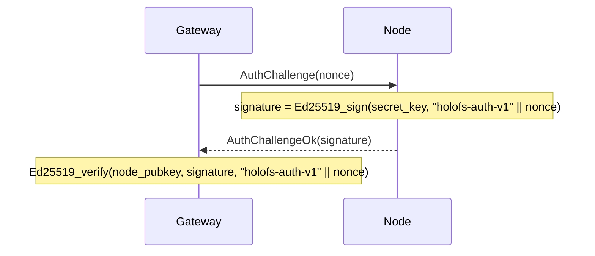

# Référence de l'API

Trois interfaces externes : **gateway HTTP**, **protocole filaire du node**, et
**formats de fichiers sur disque** (manifest, catalogue, shard, whitelist, holoshare).

## Sommaire

1. [Gateway HTTP](#1-http-gateway)
2. [Protocole filaire (TCP)](#2-wire-protocol-tcp)
3. [Formats sur disque](#3-on-disk-formats)
4. [Conventions d'en-têtes de réponse](#4-response-header-conventions)
5. [Serveur MCP (Étape 12)](#5-serveur-mcp-etape-12)
6. [Opérations wavelet (Étape 12.5)](#6-operations-wavelet-etape-125)

---

## 1. HTTP gateway

URL de base : `http://<addr>:8787/` (HTTPS via le squelette TLS propre du gateway
issu de l'étape 6 — `HOLOFS_TLS=1`, mTLS via `HOLOFS_MTLS=1`).

> **Mise à jour de l'étape 9.** Les chemins sont séparés par des slashes et adressables comme
> des wildcards (`/photos/2026/img.jpg`). Les segments de premier niveau réservés —
> `api`, `health`, `escrow`, `preview`, `inspect`, `similar`, `diff`,
> `admin`, `metrics`, `pkg` — ne peuvent pas être utilisés comme premier segment d'un
> chemin d'objet car ils masquent de vraies routes.

### CRUD du catalogue

| Méthode  | Chemin                     | Description                                 | Corps / paramètres |
|----------|----------------------------|---------------------------------------------|--------------------|
| `GET`    | `/`                        | Catalogue HTML ; lit `?p=<prefix>` pour le répertoire à lister | —             |
| `GET`    | `/<path>`                  | Télécharge l'objet sous sa forme canonique  | Range pris en charge |
| `GET`    | `/preview/<path>`          | Aperçu grossier (L0 uniquement)             | Range pris en charge |
| `PUT`    | `/<path>`                  | Charge des octets bruts, le kind est auto-détecté. Le répertoire parent doit exister (via `mkdir`) | corps = fichier |
| `DELETE` | `/<path>`                  | Supprime l'objet + Purge sur tous les nodes. Refuse les entrées de répertoire (utilisez `rmdir`) | —             |

### Opérations sur les répertoires (étape 9)

Deux variantes de chaque mutation du catalogue : une variante JSON wildcard pour
les appelants programmatiques / `curl`, et un POST form-urlencoded que les formulaires
HTML de l'UI peuvent atteindre sans JavaScript. Les variantes formulaire effectuent
une redirection 303 vers `/?p=<parent>` pour que le navigateur retourne au répertoire
que l'utilisateur consultait.

| Méthode  | Chemin                     | Description                                                 | Corps / paramètres           |
|----------|----------------------------|-------------------------------------------------------------|------------------------------|
| `POST`   | `/api/mkdir/<path>`        | Crée un marqueur `Directory`. Le parent doit exister.       | — (réponse JSON)             |
| `POST`   | `/api/mkdir`               | mkdir convivial pour les formulaires ; redirige vers `/?p=<parent>` | `parent=…&name=…`    |
| `DELETE` | `/api/rmdir/<path>`        | Supprime un répertoire vide. 409 s'il a des enfants.        | — (réponse JSON)             |
| `POST`   | `/api/rmdir`               | rmdir convivial pour les formulaires ; redirige en cas de succès | `path=…`                |
| `POST`   | `/api/mv`                  | Renommer / déplacer ; les répertoires emportent tous leurs descendants | `from=…&to=…`         |
| `POST`   | `/api/list_dir`            | Fonction serveur Leptos : enfants directs de `prefix` (JSON-RPC) | `{"prefix":"…"}`        |

Correspondance des codes d'état pour les opérations sur les répertoires :

| Résultat                                 | Statut | `GatewayError`           |
|------------------------------------------|--------|--------------------------|
| OK                                       | 200 / 201 / 303 | —               |
| La cible existe déjà                     | 409    | `AlreadyExists`          |
| Le chemin existe mais n'est pas un répertoire | 409 | `NotADirectory`        |
| `rmdir` sur un répertoire non vide       | 409    | `DirectoryNotEmpty`      |
| `GET`/`DELETE` d'une entrée `Directory`  | 409    | `IsDirectory`            |
| Chemin malformé (`..`, `//`, `/` initial) | 400   | `BadRequest`             |
| Répertoire parent manquant               | 400    | `BadRequest`             |
| Entrée inconnue                          | 404    | `NotFound`               |

#### Réponse par kind

| Kind      | `GET /<path>` retourne                                       |
|-----------|--------------------------------------------------------------|
| image     | `image/png` (réencodé à partir des canaux f32)               |
| audio     | `audio/wav` (PCM 16 bits, mono/stéréo selon le stockage)     |
| text      | content-type texte selon l'extension, le corps inclut des marqueurs de trou si les shards sont courts |
| opaque    | content-type d'origine + `Content-Disposition: attachment`   |
| directory | `409 Conflict` — les répertoires n'ont pas de payload (étape 9) |

### Santé du cluster

| Méthode | Chemin                | Description                                  |
|---------|-----------------------|----------------------------------------------|
| `GET`   | `/health`             | Tableau par node, boutons kill/revive        |
| `GET`   | `/health/<name>`      | Marge par (canal, couche), simulation Monte-Carlo de perte, tableau de défaillance par zone |
| `GET`   | `/api/stats`          | JSON : compteurs d'objets par kind, shards, % de dedup |
| `POST`  | `/admin/node` (`i=N`) | Bascule le node N (admin-side excluded/restored) |

`/api/stats` retourne :

```json
{
  "nodes_total": 40,
  "nodes_live": 38,
  "objects_total": 14,
  "objects_by_kind": {"image": 7, "audio": 3, "text": 1, "opaque": 1, "directory": 2},
  "shards_total": 5328,
  "shards_unique": 5326,
  "dedup_savings_pct": 0.04,
  "bytes_total": 50266112
}
```

`objects_total = sum(objects_by_kind)` ; les marqueurs `directory` sont comptés
mais ne contribuent en rien à `shards_total` / `bytes_total`.

### Recherche et analyses

| Méthode | Chemin                        | Description                                  |
|---------|-------------------------------|----------------------------------------------|
| `GET`   | `/similar/<path>`             | Top-10 des objets similaires + recouvrement inter-objets |
| `GET`   | `/diff?a=<a>&b=<b>`           | Visualisation des différences par chunk. Deux chemins d'objet ne tiennent pas dans une seule route, l'étape 9 les a déplacés dans la query string |
| `GET`   | `/api/fingerprint/<path>`     | JSON : empreinte perceptuelle de 16 octets (image/audio) ou les 16 premiers du CID (text/opaque) |

`/api/fingerprint/<name>` retourne :

```json
{
  "name": "photo.png",
  "fingerprint": "a3f08c7d12...",
  "kind": "image"
}
```

### Inspection des shards

Le triplet `c_l_idx` identifie un shard à l'intérieur d'un objet comme
`<channel>_<layer>_<idx>`. L'étape 9 a réorganisé l'URL pour que le triplet fixe
soit placé devant le chemin wildcard de l'objet.

| Méthode | Chemin                                                   | Description |
|---------|----------------------------------------------------------|-------------|
| `GET`   | `/inspect/<path>`                                        | Grille de toutes les vignettes de shards (code couleur sys vs RLNC) |
| `GET`   | `/api/shard/<c_l_idx>.png/<path>`                        | PNG niveaux de gris 32×32 du payload d'un shard |
| `GET`   | `/inspect-zoom/<c_l_idx>/<path>`                         | Rendu agrandi + coeffs hex + payload + infos sur le node |

### Séquestre de clé holographique

| Méthode | Chemin                          | Description |
|---------|---------------------------------|-------------|
| `GET`   | `/escrow`                       | UI avec formulaires split + recover |
| `POST`  | `/escrow/split`                 | `file=…` + `k=…` + `n=…` → divise en `n` fichiers `.holoshare` |
| `GET`   | `/escrow/download/<id>_<idx>.holoshare` | Télécharge une part (conservée en mémoire du gateway) |
| `POST`  | `/escrow/recover`               | `shares=…` (multiples) → récupère le fichier d'origine |

Les fichiers `.holoshare` **ne sont pas stockés sur le cluster** — le gateway les
calcule à la demande et les conserve en mémoire jusqu'au redémarrage ou jusqu'à ce
que l'utilisateur les télécharge.

---

## 2. Wire protocol (TCP)

Les nodes écoutent sur un socket TCP. Chaque message est une trame :

```
+--------+--------------------+
| u32 BE | payload (≤ 64 MiB) |
+--------+--------------------+
```

Le plafond de 64 MiB (`holofs_wire::MAX_FRAME`) est appliqué au décodage ;
les nodes rejettent les trames surdimensionnées et ferment la connexion.

### Types de requêtes

| Op   | Nom               | Payload                                       |
|------|-------------------|-----------------------------------------------|
| 0x00 | `Ping`            | (vide)                                        |
| 0x01 | `Put`             | object\_id, channel, layer, Shard             |
| 0x02 | `Get`             | object\_id, channel, layer                    |
| 0x03 | `Purge`           | object\_id                                    |
| 0x04 | `Stat`            | (vide)                                        |
| 0x05 | `Audit`           | object\_id, channel, layer, shard\_hash       |
| 0x06 | `AuthChallenge`   | nonce[32]                                     |

### Types de réponses

| Op   | Nom                   | Payload                                       |
|------|-----------------------|-----------------------------------------------|
| 0x00 | `Pong`                | (vide)                                        |
| 0x01 | `Ack`                 | (vide)                                        |
| 0x02 | `Shards`              | count: u32 BE + N × Shard                     |
| 0x03 | `StatResp`            | total\_shards: u32 BE                         |
| 0x04 | `AuditResp`           | tag: u8 (0=None, 1=Some) + Shard optionnel    |
| 0x05 | `AuthChallengeOk`     | signature[64]                                 |
| 0xff | `Error`               | len: u32 BE + message UTF-8                   |

### Format filaire du shard

```
+---------------+-----------+----------------+---------+
| u16 BE coeffs_len | coeffs | u32 BE payload_len | payload |
+---------------+-----------+----------------+---------+
```

(Note : `coeffs_len` est conceptuellement égal au `K` du manifest.)

### Handshake d'authentification

Le gateway peut défier n'importe quel node avant d'accorder sa confiance à ses réponses :



`node_pubkey` provient de la whitelist signée (voir §3 ci-dessous).

---

## 3. On-disk formats

Tous les entiers multi-octets sont **big-endian** sauf mention contraire. Les fichiers
sont identifiés par un magic de 8 octets à l'offset 0.

### 3.1. Manifest (`HOLOFSM7`, legacy `HOLOFSM6` accepté en lecture)

L'étape 9 a fait passer le magic à `HOLOFSM7` pour signaler qu'une entrée peut porter
le discriminant `ObjectKind::Directory` (tag `4`). La disposition filaire est
identique octet pour octet à `HOLOFSM6` ; seul l'ensemble légal des valeurs `kind`
s'est agrandi. Les anciens fichiers `HOLOFSM6` se décodent proprement sous le nouveau code.

Les marqueurs de répertoire ont tous leurs champs numériques mis à zéro et chaque champ
`Vec` vide ; leur seul porteur est `object_id` (dérivé SHA-256 du chemin,
étiquette de domaine `holofs-dir-v1\0`) et un `content_type` fixe à
`inode/directory`.

Un `Manifest` sérialisé décrivant l'encodage d'un objet.

```
magic           8  bytes = "HOLOFSM7" (legacy "HOLOFSM6" also accepted)
object_id       8  bytes BE
k               2  bytes BE
nlayers         1  byte
channels        1  byte
width           4  bytes BE
height          4  bytes BE
levels          1  byte
placement       1  byte (0=RoundRobin, 1=Rendezvous, 2=RendezvousZoneAware)

n_per_layer     nlayers × u32 BE
sym_len         nlayers × u32 BE
layer_positions for each layer:
                    n_positions: u32 BE
                    positions:   n_positions × u32 BE

nodes_count     u32 BE
for each node:
    addr_len    u16 BE
    addr        addr_len bytes UTF-8

zones           nodes_count bytes (one byte per node)

data_cid        32 bytes (SHA-256)
merkle_root     32 bytes (SHA-256)

shard_hashes    channels × nlayers × variable:
                    count: u32 BE
                    hashes: count × 32 bytes

kind            1  byte (0=Image, 1=Text, 2=Audio, 3=Opaque, 4=Directory)
content_type    1 byte length + length bytes UTF-8

chunk_lens      u32 BE count + count × u32 BE
                (for text: per-chunk lengths; for opaque: real file length;
                 for image/audio: usually empty)

audio_sample_rate  u32 BE  (0 for non-audio)

text_minhash    u32 BE count + count × u32 BE
                (for text: bottom-K MinHash; empty otherwise)
```

### 3.2. Directory (catalogue, `HOLOFSD1`)

```
magic           8 bytes = "HOLOFSD1"
n_entries       u32 BE
for each entry:
    name_len    u16 BE
    name        UTF-8
    manifest_len u32 BE
    manifest    serialised Manifest (§3.1)
```

Écrit de manière atomique (écriture dans `.tmp`, fsync, rename).

### 3.3. Fichier shard (`HOLOFSS1`)

```
magic        8  bytes = "HOLOFSS1"
object_id    8  bytes BE
channel      1  byte
layer        1  byte
coeffs_len   4  bytes BE
payload_len  4  bytes BE
coeffs       coeffs_len bytes
payload      payload_len bytes
```

Nom de fichier : `<2 hex chars>/<remaining 62>.shard` où l'hex complet est
`sha256(coeffs || payload)`.

### 3.4. Whitelist (`HOLOFSW1`)

```
magic         8  bytes = "HOLOFSW1"
n_entries     u32 BE
for each entry:
    addr_len  u16 BE
    addr      UTF-8
    pubkey    32 bytes (Ed25519)
    zone      1 byte
admin_pubkey  32 bytes
signature     64 bytes Ed25519
              signs ("holofs-whitelist-v1" || everything-above-the-signature)
```

### 3.5. Holoshare (`HOLOSHAR1`)

Une part de séquestre. Le séquestre **n'est pas stocké sur le cluster** ; ce fichier
est destiné à être distribué à des humains / appareils.

```
magic           9 bytes = "HOLOSHAR1"
escrow_id       16 bytes (first 16 of SHA-256 over the source data)
shard_idx       u16 BE
total_n         u16 BE
total_k         u16 BE
real_len        u64 BE (length of the original file in bytes)
content_type_n  1 byte
content_type    content_type_n bytes UTF-8
filename_n      1 byte
filename        filename_n bytes UTF-8
coeffs_len      u16 BE = total_k
coeffs          coeffs_len bytes
payload_len     u32 BE = sym_len
payload         payload_len bytes
```

Un groupe de séquestre complet possède les mêmes `escrow_id`, `total_n`, `total_k`,
`real_len`, `content_type`, `filename`. La récupération requiert `total_k` valeurs
distinctes de `shard_idx` provenant du même `escrow_id`.

---

## 4. Response header conventions

En-têtes personnalisés `X-Holofs-*` sur les réponses d'objet :

| En-tête                      | Type      | Description |
|------------------------------|-----------|-------------|
| `X-Holofs-Kind`              | image / audio / text / opaque | kind de l'objet |
| `X-Holofs-Layers`            | `0-<max>` | pour image / audio : couches réellement décodées |
| `X-Holofs-Bytes-Downloaded`  | u64       | octets récupérés depuis les nodes pour cette réponse |
| `X-Holofs-Decode-Ms`         | u128      | temps passé à décoder (hors RTT réseau) |
| `X-Holofs-Sample-Rate`       | u32       | audio : fréquence d'échantillonnage en Hz |
| `X-Holofs-Channels`          | u8        | audio : 1 ou 2 |
| `X-Holofs-Chunks-Total`      | usize     | text : nombre total de chunks |
| `X-Holofs-Chunks-Missing`    | usize     | text : chunks remplacés par des marqueurs de trou |
| `X-Holofs-Escrow-Shares-Used`| usize     | escrow recover : nombre de parts consommées |


---

## 5. Serveur MCP (Étape 12)

La gateway expose un endpoint **Model Context Protocol** sur
`POST /mcp` via le transport Streamable HTTP (spécification révision
`2025-03-26`). Les clients MCP comme Claude Desktop ou Claude Code y
parlent directement sans scraper l'interface web ; les deux surfaces
partagent le même `Arc<Gateway>`, donc lectures et écritures restent
cohérentes.

### 5.1 Transport

`/mcp` répond aux POST (messages client → serveur), GET (flux SSE
serveur → client optionnel) et DELETE (clôture de session). Chaque
session porte un en-tête `Mcp-Session-Id` émis sur le premier
`initialize`. L'endpoint vit derrière le même routeur axum (port par
défaut `127.0.0.1:8787`).

### 5.2 Authentification

Contrôlée par une seule variable d'environnement côté serveur :

| `HOLOFS_MCP_TOKEN`         | Comportement                                          |
|----------------------------|-------------------------------------------------------|
| absente / vide             | `/mcp` ouvert mais **lecture seule** — les outils d'écriture refusent |
| toute valeur non vide      | exige `Authorization: Bearer <token>` sur chaque requête |

Avec un token défini, les outils d'écriture (`put_object_text`,
`mkdir`, `rmdir`, `mv_object`) sont activés. Sans token ils renvoient
`invalid_request` en indiquant la variable. Le token est lu une fois
au démarrage et jamais loggé — toute rotation impose un redémarrage.

Câblage dans Claude Code :

```sh
# lecture seule
claude mcp add --transport http holofs http://127.0.0.1:8787/mcp

# avec auth
claude mcp add --transport http holofs http://127.0.0.1:8787/mcp \
  --header "Authorization: Bearer $HOLOFS_MCP_TOKEN"
```

### 5.3 Outils

Douze outils regroupés par capacité :

**Lecture (toujours disponible)**

| Outil                 | Entrées                                 | Renvoie |
|-----------------------|-----------------------------------------|---------|
| `list_catalog`        | `prefix?`, `recursive?`                 | lignes du catalogue sous prefix |
| `read_object_text`    | `path`                                  | corps UTF-8, plafonné à 256 KiB |
| `find_similar`        | `path`, `scope?` (`all`/`folder`/`tree`)| top-10 voisins + méthode |
| `get_cluster_health`  | —                                       | nœuds + snapshot du catalogue |
| `get_object_health`   | `path`                                  | résumé de la capacité de décodage |

**Inspection (toujours disponible)**

| Outil            | Entrées                                               | Renvoie |
|------------------|-------------------------------------------------------|---------|
| `diff_objects`   | `a`, `b`, `include_cells?`                            | chevauchement chunk par couche |
| `inspect_object` | `path`                                                | layout par (canal, couche) |
| `inspect_shard`  | `path`, `channel`, `layer`, `idx`, `include_payload?` | méta du shard + payload optionnel |

**Écriture (sous `HOLOFS_MCP_TOKEN`)**

| Outil             | Entrées                               | Renvoie |
|-------------------|---------------------------------------|---------|
| `put_object_text` | `path`, `content`, `content_type?`    | `{path, action="wrote", note}` |
| `mkdir`           | `path`                                | `{path, action="created"}` |
| `rmdir`           | `path` (doit être vide)               | `{path, action="removed"}` |
| `mv_object`       | `from`, `to`                          | `{path, action="renamed", note}` |

### 5.4 Ressources

Chaque entrée du catalogue qui n'est pas un répertoire est aussi
exposée via la surface MCP `resources/` à l'URI `holofs:///<chemin>`.
`resources/list` retourne une ligne par fichier avec `mimeType` issu
du manifeste et une courte description ; `resources/read` décode
l'objet côté serveur et renvoie :

- **text-kind** → `TextResourceContents` au format UTF-8
- **image / audio / opaque** → `BlobResourceContents` en base64

Les lectures sont plafonnées à 1 MiB par appel pour qu'un seul fetch
ne sature pas la fenêtre de contexte du LLM.

### 5.5 Exemple en ligne de commande (curl)

Flux initialize → `tools/list` → `tools/call` sur Streamable HTTP :

```sh
SID=$(curl -si -X POST http://127.0.0.1:8787/mcp \
  -H 'Content-Type: application/json' \
  -H 'Accept: application/json, text/event-stream' \
  -d '{"jsonrpc":"2.0","id":1,"method":"initialize","params":{
    "protocolVersion":"2025-06-18","capabilities":{},
    "clientInfo":{"name":"curl","version":"1"}}}' \
  | grep -i 'mcp-session-id:' | awk '{print $2}' | tr -d '\r')

# requis après initialize
curl -s -X POST http://127.0.0.1:8787/mcp \
  -H "Mcp-Session-Id: $SID" -H 'Content-Type: application/json' \
  -H 'Accept: application/json, text/event-stream' \
  -d '{"jsonrpc":"2.0","method":"notifications/initialized"}' > /dev/null

# lister tous les outils
curl -s -X POST http://127.0.0.1:8787/mcp \
  -H "Mcp-Session-Id: $SID" -H 'Content-Type: application/json' \
  -H 'Accept: application/json, text/event-stream' \
  -d '{"jsonrpc":"2.0","id":2,"method":"tools/list"}'

# trouver les fichiers similaires, restreint au dossier
curl -s -X POST http://127.0.0.1:8787/mcp \
  -H "Mcp-Session-Id: $SID" -H 'Content-Type: application/json' \
  -H 'Accept: application/json, text/event-stream' \
  -d '{"jsonrpc":"2.0","id":3,"method":"tools/call","params":{
    "name":"find_similar","arguments":{
      "path":"photos/2026/mandala.png","scope":"folder"}}}'
```

---

## 6. Opérations wavelet (Étape 12.5)

Ces deux opérations exploitent le fait que holofs stocke chaque image
et chaque objet audio dans le domaine wavelet (DWT), réparti entre
des seaux de shards `(channel, layer)`. Manipuler les shards à la
granularité d'un layer permet de *transformer* un objet sans le
décoder, sans le ré-encoder, sans stocker une seconde copie.

À l'étape 12.5 ces deux opérations ne sont accessibles que via MCP —
des routes HTTP peuvent être ajoutées plus tard, mais `claude mcp` +
curl couvrent déjà les mêmes cas.

### 6.1 Mix wavelet

Construit un PNG hybride en partitionnant les layers DWT entre deux
images sources compatibles : les layers `0..=split` viennent de A,
les layers `>split` de B. Le même IDWT qui décode un objet normal
tourne sur le plan de coefficients hybride — le résultat est un vrai
PNG indistinguable d'un GET ordinaire sur le réseau.

Conditions de compatibilité (sinon `BadRequest`) : les deux objets
doivent être `Image`, partager `width / height / channels / k /
nlayers / levels` et avoir les mêmes `sym_len` / `layer_positions`
par layer. En pratique : ingéré avec la même configuration DWT du
cluster.

Outil MCP `wavelet_mix` :

| Param      | Type       | Notes |
|------------|------------|-------|
| `a`        | string     | chemin catalogue, fournit les layers `0..=split` |
| `b`        | string     | chemin catalogue, fournit les layers `>split` |
| `split`    | u8         | split DWT. `0` ⇒ seul L0 vient de A, le reste de B ; `nlayers-1` ⇒ entièrement A |
| `save_as?` | string     | chemin pour ingérer le résultat ; nécessite `HOLOFS_MCP_TOKEN`. Sans ce paramètre, les bytes reviennent inline. |

Retourne `{a, b, split, width, height, channels, bytes_downloaded,
decode_ms, saved_as, bytes_len, content_type, blob_base64}`.
`blob_base64` est vide quand `save_as` a été utilisé.

Règle visuelle : les layers bas portent la structure grossière
(silhouette, tons), les layers hauts les détails fins (bords,
texture). Petit `split` ⇒ « squelette de A habillé en B » ; grand
`split` ⇒ « A avec la texture/grain de B ».

### 6.2 Filtre par layer audio

Rend un objet audio en ne laissant contribuer que les layers
listés — tout le reste est mis à zéro avant le Haar inverse. Chaque
layer correspond grossièrement à une bande de fréquence (L0 =
enveloppe basse, en montant), donc l'outil produit des coupures par
bande et un EQ sélectif sans reconstruire le fichier.

Outil MCP `audio_filter` :

| Param          | Type       | Notes |
|----------------|------------|-------|
| `path`         | string     | chemin catalogue, doit être `Audio` |
| `keep_layers`  | `u8[]`     | indices à conserver (ex. `[0]` = basses seules) |
| `save_as?`     | string     | chemin pour stocker comme nouvel audio ; nécessite token |

Retourne `{source, kept_layers, nlayers, sample_rate, channels,
bytes_downloaded, decode_ms, saved_as, bytes_len, content_type,
blob_base64}`.

Erreurs : `keep_layers` vide ou masque entièrement à `false` ⇒
`BadRequest` (le résultat serait du silence). Objet non audio ⇒
`BadRequest`.

### 6.3 Pourquoi c'est intéressant

Les deux opérations travaillent *dans le domaine fréquentiel*, sur
les shards. Comparé à l'approche évidente (télécharger la source,
décoder, transformer, ré-encoder) :

* **Pas de copie par défaut** — le résultat revient inline ; les
  shards de la source dans le cluster ne sont pas touchés.
* **Les hybrides sauvegardés sont des objets de plein droit** —
  avec `save_as`, le résultat passe par l'ingest normal (RLNC, dédup,
  DWT, manifest), donc il bénéficie de la dégradation gracieuse, du
  similar search, etc.
* **Exploration peu coûteuse** — le LLM peut balayer `split` de
  0..nlayers-1 pour trouver l'hybride le plus intéressant, en payant
  seulement les shard-fetches nécessaires par layer.

---

## 7. Stages 12.6 – 15.0 — Référence en anglais

Depuis le Stage 12.5, neuf stages supplémentaires ont été
livrés : per-file metrics (12.7), page `/about` (12.7), recherche
sémantique CLIP + UI `/search` (12.8/12.9), colonne robust-copy
(13.0), hologramme streaming (13.1), spotlight ROI (13.2 + 14.1),
index par bande hiérarchique (13.3), versions par objet (13.4),
GC des shards orphelins (14.0), recherche HNSW (14.2), GC des
embeddings (14.3), barrière GC (14.4), magic `HOLOFSM9` +
`ObjectEncoding` (15.0) plus nouvelles opérations TCP
(`ListHashes`, `PurgeByHash`, `PutBatch`).

La traduction française de cette section n'est pas encore prête.
Référez-vous au `docs/api.md` anglais (sections 7–12) — il
contient la table complète des endpoints et des pages, le JSON
GcReport, les layouts de frames des nouvelles wire ops, et les
règles de compatibilité HOLOFSM9.

Les PR de traduction sont bienvenues.
