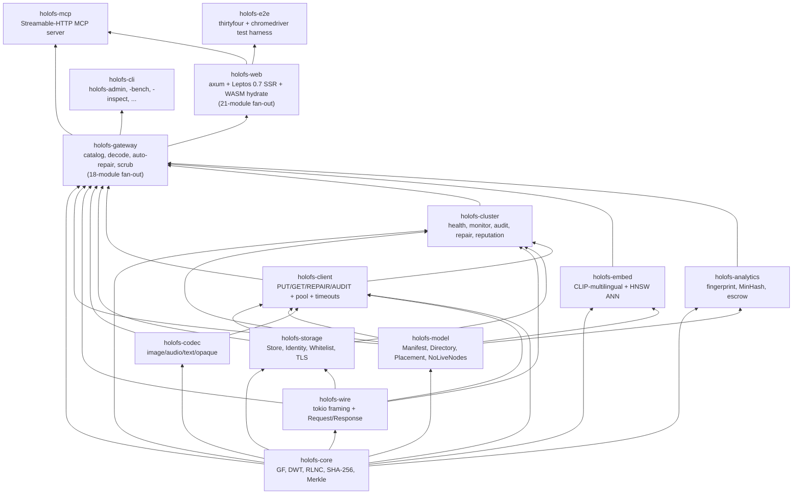
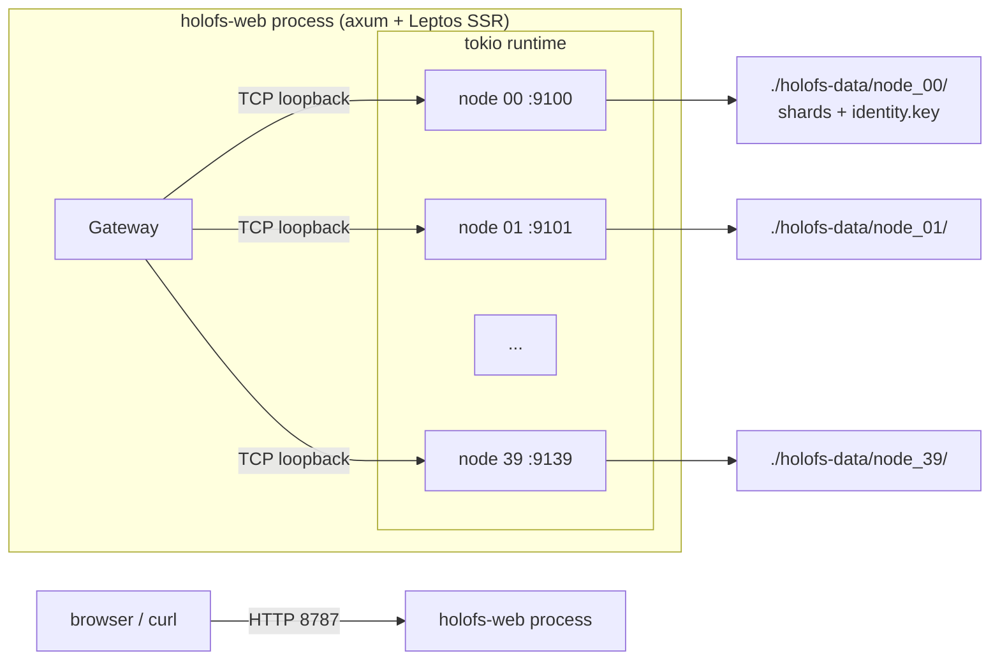
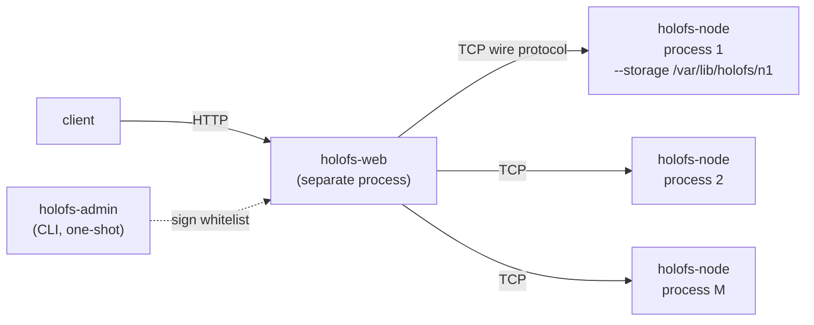
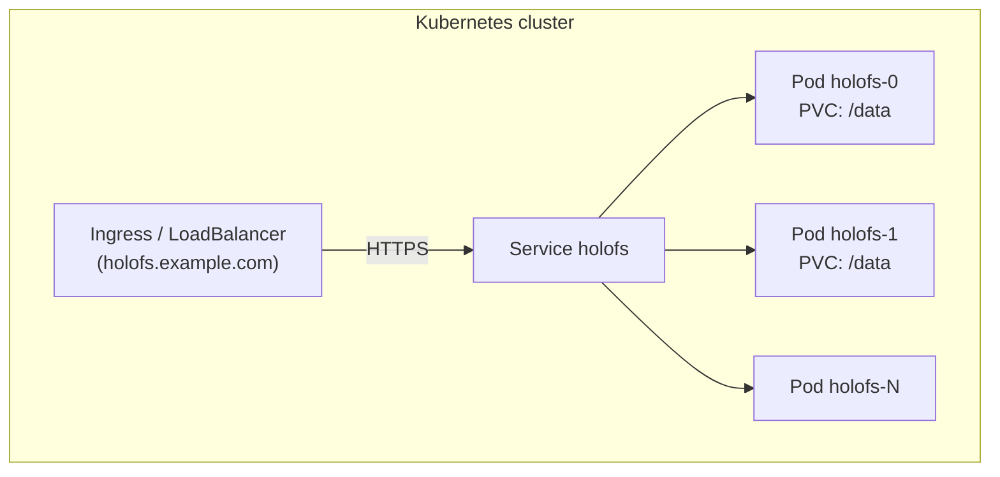
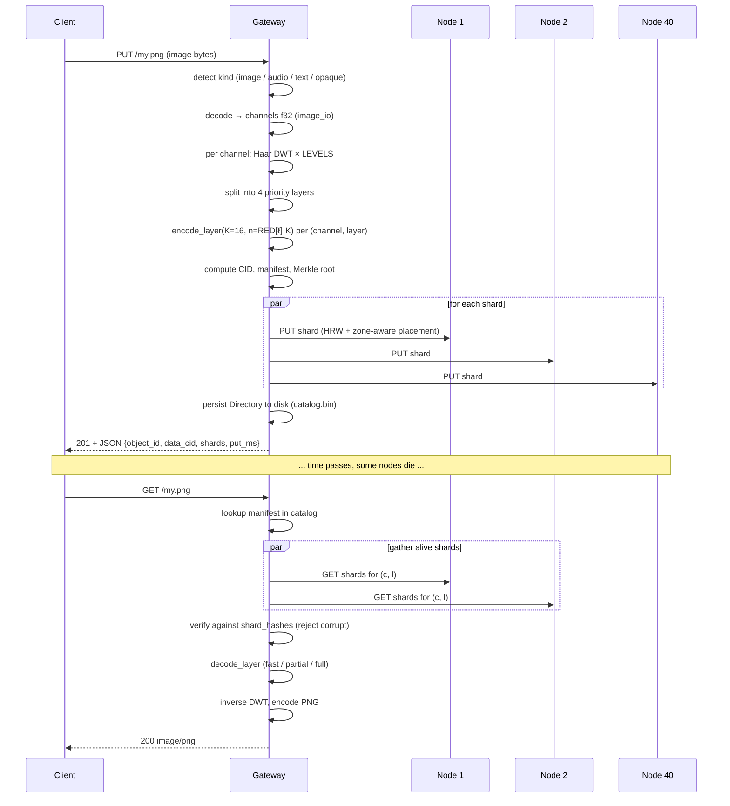

# Architecture

Structure du système holofs au niveau système, destinée aux
mainteneurs et aux relecteurs. Pour les fondements mathématiques,
voir [theory.md](./theory.md) ; pour les détails du protocole HTTP /
filaire, voir [api.md](./api.md).

## Sommaire

1. [Graphe de dépendances des crates](#1-graphe-de-dépendances-des-crates)
2. [Topologies de processus / déploiement](#2-topologies-de-processus--déploiement)
3. [Cycle de vie d'un objet (PUT → GET)](#3-cycle-de-vie-dun-objet-put--get)
4. [Modèle de persistance](#4-modèle-de-persistance)
5. [Modèle de confiance](#5-modèle-de-confiance)
6. [Modèle de concurrence](#6-modèle-de-concurrence)
7. [Modes de défaillance](#7-modes-de-défaillance)

---

## 1. Graphe de dépendances des crates

Ordre topologique strict — ne jamais laisser les flèches pointer vers
le haut.



**Règle empirique.** Une pull request qui ajoute une arête ascendante
dans ce graphe requiert une discussion séparée — cela signifie presque
toujours qu'un type ou une fonction est dans la mauvaise crate.

### 1.1. Disposition des modules de la passerelle

La crate `holofs-gateway` embarque un unique type — `Gateway` — mais
son implémentation est éclatée sur 18 modules frères, chacun possédant
un bloc `impl Gateway { ... }`. Tout ce qui reste dans
`http_gateway.rs` (288 lignes) est l'état + les accesseurs + les deux
helpers partagés `persist_catalog` et `invalidate_cache`. L'API publique
est préservée via les `pub use` à la racine de la crate ; les
consommateurs écrivent toujours `holofs_gateway::GatewayError`,
`holofs_gateway::SimilarReport`, etc. sans toucher au chemin de module.

| Module | Rôle |
|---|---|
| `http_gateway` | Struct `Gateway`, constructeurs, accesseurs, `persist_catalog`, `invalidate_cache`. |
| `error` | Enum `GatewayError` + `Display` + `From<NoLiveNodes>`. |
| `util` | Petits helpers : `now_unix`, `directory_object_id`, sniffers de content-type, `encode_png`. |
| `decode` | Dispatch de décodage côté HTTP — `decode_object`, `get_or_decode` (cache PNG). |
| `ingest` | PUT universel — `ingest_bytes`, `put_any`, helpers de manifeste vierge par type. |
| `repair` | `decode_with_autorepair`, `repair_object_inplace`, `purge_orphans_of`. |
| `dirops` | `remove_object`, `mkdir`, `rmdir`, `rename`, `list_dir`. |
| `versions` | Historique de versions par objet : archive / list / restore / delete + rétention. |
| `search` | Pipeline d'embedding CLIP-multilingual + recherche sémantique adossée HNSW. |
| `similarity` | Types `SimilarScope` / `SimilarMatch` / `ShardOverlap` + helpers de scope. |
| `fingerprint` | Empreinte perceptuelle + `similar_to`. |
| `mix` | Mélange par ondelettes + filtre de bande audio. |
| `diff` | Analyseur de diff par chunk, exact au niveau octet. |
| `spotlight` | Composites ROI net-à-l'intérieur / flou-à-l'extérieur. |
| `inspect` | View-model `/inspect` + extraction de la charge utile des shards. |
| `metrics` | `file_metrics` — stockage/dedup + originalité + énergie par couche en une passe. |
| `health` | Statistiques du cluster, bascules admin, `scrub_tick`, `object_health`. |
| `escrow` | Séquestre de clé RLNC de style Shamir. |
| `gc` | Ramasse-miettes de shards orphelins. |

**Règle empirique.** Les nouvelles méthodes de `Gateway` appartiennent
au module dont la préoccupation elles étendent, non à `http_gateway.rs`.
Si un nouveau module est nécessaire, il rejoint les autres et obtient
son propre bloc `impl Gateway` ; rien dans `http_gateway.rs` ne doit
grossir à nouveau.

### 1.2. Couche de fiabilité

Les primitives de fiabilité vivent dans `holofs-web` parce qu'elles
composent la surface HTTP, non l'état de la passerelle. Voir
[operations.md § 5.6](operations.md#56-couche-de-fiabilité) pour la
référence des variables d'environnement.

| Module | Rôle |
|---|---|
| `holofs_web::supervised` | `supervised_spawn(name, shutdown, counter, f)` — wrapper autour de `tokio::spawn` avec capture de panique et redémarrage à backoff exponentiel. |
| `holofs_web::timeout` | Middleware `run_with_deadline` + seaux de durées `SHORT`/`MEDIUM`/`LONG`. |
| `holofs_web::backpressure` | Middleware `with_permit` — `Arc<Semaphore>::try_acquire_owned` par seau, 503 à saturation. |
| `holofs_web::admin_auth` | `AdminAuth::from_env` + middleware `require_admin_token` — porte à jeton bearer pour `/admin/*` + `/api/gc`. |
| `holofs_web::bootstrap` | Lit l'environnement, câble le `CancellationToken` partagé dans chaque tâche longue durée, construit le handle `Bootstrap` sur lequel main.rs joint à l'arrêt, plombe la tâche supervisée de persistance de réputation. |

**Persistance qui échoue bruyamment** est un changement côté passerelle,
non côté holofs-web : `Gateway::persist_catalog` retourne
`Result<(), GatewayError::Persist>` et chaque chemin écrivain (`ingest`,
`dirops`, `versions`) propage via `?`.

### 1.3. Disposition des modules de la crate web

`holofs-web` est éclaté en modules frères mono-usage — rien à
l'intérieur ne dépasse quelques centaines de lignes.

**`lib.rs`** — registre de modules + réexports `pub use` à la racine
de la crate + composants top-level [`Shell`] / [`App`] / [`RoutedApp`]
+ utilitaire `url_encode` + point d'entrée WASM `hydrate`. Tout le
reste vit dans les modules frères :

| Module | Rôle |
|---|---|
| `catalog_types` | View-model `CatalogEntry` partagé entre les frontières SSR + hydrate. `from_manifest` (SSR uniquement). |
| `filter` | Filtre de catalogue — `CatalogFilter`, `apply_filter`, `compile_glob`, `parse_date_to_unix`, `ymd_to_unix` + sept tests unitaires. SSR uniquement. |
| `server_fns` | Les trois fonctions `#[server]` (`get_catalog`, `list_dir`, `list_dir_page`) + `ListDirPage` + `TreeSort` + `compare_entries`. |
| `catalog_ui` | Quinze composants Leptos — `CatalogPage`, `CatalogFocusView`, `FilterBar`, `TreeZoomButtons`, `Breadcrumb`, `CatalogTreeView` + variantes eager/lazy, `LazyLevel`, `LazyDirNode`, `CatalogTreeBody`, `TreeNodeView`, `MkdirForm`, `UploadForm`, `ObjectCard`. |

**`handlers.rs`** — porte d'entrée pure d'enregistrement de modules +
réexports `pub use`. Chaque handler vit dans un sous-module de domaine
sous `handlers/` :

| Module | Handlers |
|---|---|
| `handlers/objects` | GET / PUT / DELETE `/*path`, `/preview/*`, `/preview/stream/*`, `/api/shard/…`, alias wasm. |
| `handlers/dirops` | mkdir, rmdir, rm, mv (versions JSON + formulaire). |
| `handlers/uploads` | multipart `/api/upload`. |
| `handlers/versions` | `/api/restore`, `/api/versions/delete`. |
| `handlers/analytics` | `/api/fingerprint/*`, `/api/mix.png`, `/api/mix-save`, `/api/spotlight.png`. |
| `handlers/search` | `/api/embed_all`, `/api/search`. |
| `handlers/health` | `/api/stats`, `/metrics`, `/api/gc`, `/admin/node`, `/api/health/events` SSE. |
| `handlers/escrow` | `/escrow/split`, `/escrow/download`, `/escrow/recover`. |
| `handlers/util` | Helpers purs — validation de chemin, parsing de formulaire, échappement HTML/JSON, raccourcis d'en-têtes, `error_to_response`. |
| `handlers/response` | Constructeurs de réponse — `serve_with_range`, ingest / remove / mkdir / rmdir / rename → HTTP, stats + fingerprint → JSON. |

L'API publique est préservée via `pub use handlers::foo` à la racine
de `handlers.rs`, de sorte que les références existantes de `main.rs`
comme `handlers::mkdir` / `handlers::spotlight_png` / etc. se résolvent
inchangées.

Les primitives de fiabilité du § 1.2 (`supervised`, `timeout`,
`backpressure`, `admin_auth`, `bootstrap`) sont inchangées — elles
vivaient déjà dans leurs propres modules.

**Règle empirique.** Les nouveaux composants Leptos vont dans
`catalog_ui.rs` (liés au catalogue) ou dans un nouveau module frère
(page de niveau `/health`, `/search`, `/versions`). Les nouveaux
handlers axum vont dans le module de domaine dont ils étendent la
préoccupation (`handlers/dirops.rs` pour une nouvelle variante mkdir,
etc.). Rien de nouveau ne doit grossir le fichier `lib.rs` ou
`handlers.rs` de haut niveau.

---

## 2. Topologies de processus / déploiement

### A. Processus unique embarqué (développement / petits clusters)



Utilisé pour les démonstrations, le dev, les machines uniques en
bare-metal. La passerelle et les nœuds partagent un runtime tokio mais
communiquent en vrai TCP — facile à migrer plus tard vers du
multi-processus.

### B. Cluster bare-metal multi-processus



Chaque nœud est un processus OS indépendant avec son propre répertoire
de stockage persistant et son identité Ed25519. La passerelle est
configurée avec une liste blanche signée de triplets
`(addr, pubkey, zone)`. L'isolation des pannes est réelle : tuer un
processus de nœud ne fait rien tomber d'autre.

Variante scriptée : `./scripts/spawn-cluster.sh N BASE_PORT GATEWAY_ADDR`
monte toute la topologie en une commande.

### C. Kubernetes (StatefulSet)



`deploy/helm/holofs` fournit les templates StatefulSet +
PersistentVolumeClaim. Chaque pod exécute l'image Docker multi-étages,
qui crée automatiquement des nœuds embarqués contre son propre PVC
`/data`. Pour des clusters très grands, séparer en N pods passerelle
+ M pods nœuds dédiés (le chart Helm gère `nodeCount` et
`gatewayCount` séparément).

---

## 3. Cycle de vie d'un objet (PUT → GET)



### Divergence par type

| Type     | Chemin PUT                                              | Réponse GET        |
|----------|---------------------------------------------------------|--------------------|
| image    | DWT 2D × 3 canaux × 4 couches × RLNC                    | PNG réencodé       |
| audio    | DWT 1D × 1–2 canaux × 4 couches × RLNC                  | WAV PCM 16 bits    |
| text     | Chunks à frontière UTF-8 × 1 couche × RLNC systématique | text/plain + trous |
| opaque   | Un flux d'octets × 1 couche × RLNC (sans DWT)           | Octets originaux   |

---

## 4. Modèle de persistance

Chaque nœud possède un répertoire. Trois types de fichiers y vivent :

```
<storage>/
├── identity.key                # 32-byte Ed25519 seed (mode 0600)
├── <hex>/<hex>.shard           # one file per stored shard
└── <hex>/<hex>.shard
```

La passerelle possède en plus :

```
<storage>/catalog.bin            # serialised Directory (Manifest map)
                                 # Header magic: "HOLOFSD1"
```

### Disposition d'un fichier shard

```
magic        8  bytes  = "HOLOFSS1"
object_id    8  bytes  big-endian
channel      1  byte
layer        1  byte
coeffs_len   4  bytes  big-endian
payload_len  4  bytes  big-endian
coeffs       coeffs_len bytes
payload      payload_len bytes
```

Le nom de fichier est `hex(sha256(shard))` découpé en
`<2 caractères hex>/<62 caractères restants>.shard` (fanout à la git
pour éviter d'énormes répertoires).

### Atomicité d'écriture

```
write to <name>.shard.tmp
fsync
rename <name>.shard.tmp → <name>.shard
```

Un crash laisse soit rien, soit un shard complet — jamais un fichier
déchiré.

### Récupération de l'index

À `Store::open(dir)`, le nœud parcourt son arbre et reconstruit
l'index en mémoire
`HashMap<(object_id, channel, layer), HashMap<Hash, Shard>>` en
re-hachant chaque shard. C'est la seule source de vérité autorisée —
il n'y a pas de fichier `.idx` séparé qui pourrait devenir obsolète.

### Déduplication

Les noms de fichiers de shard sont adressés par contenu. Un PUT dupliqué
(mêmes coefficients + payload) est détecté par
`fs::write(... .tmp)` → `rename` par-dessus un fichier existant
(écrase à l'identique). La vérification d'index en mémoire plus tôt
renvoie encore `false` depuis `put()` de sorte que l'appelant sait
qu'aucun nouveau shard n'est apparu.

---

## 5. Modèle de confiance

| Composant       | Hypothèse de confiance                                |
|-----------------|-------------------------------------------------------|
| Admin           | absolue — signe la liste blanche, génère les clés     |
| Passerelle      | fait confiance à la signature admin sur la liste blanche |
| Nœud            | fait confiance à sa propre `identity.key` (système de fichiers) |
| Inter-nœuds     | ne se parle pas entre pairs ; uniquement passerelle ↔ nœud |
| Client          | fait confiance à la passerelle (TLS recommandé en prod) |

Nous ne sommes explicitement **pas** un système sans permission : il n'y
a pas de preuve de réplication, pas de résistance Sybil. holofs se
situe dans la même classe de confiance que Backblaze B2 ou AWS S3, pas
Filecoin ou Storj. Voir [threat-model.md](./threat-model.md) pour une
analyse structurée.

### Primitives cryptographiques en usage

| Objectif                         | Primitive                        | Crate                |
|----------------------------------|----------------------------------|----------------------|
| Intégrité des shards / objets    | SHA-256 (FIPS 180-4, fait main)  | holofs-core          |
| Identité du nœud                 | Ed25519                          | ed25519-dalek (RFC 8032) |
| Signature de liste blanche admin | Ed25519                          | ed25519-dalek        |
| Défi de poignée de main          | Nonce aléatoire 32 octets + Ed25519 | holofs-storage    |
| Séquestre de clé / style Shamir  | RLNC sur GF(2⁸) avec K personnalisé | holofs-analytics  |
| Séparation de domaine            | Préfixe de chaîne (`holofs-XXX-vN`) avant l'entrée hash / sign |

---

## 6. Modèle de concurrence

- **Runtime tokio multi-thread** en haut de chaque binaire
  (`#[tokio::main(flavor = "multi_thread")]`).
- **Une tâche par connexion** dans la passerelle et dans chaque nœud.
- **`tokio::sync::Mutex`** pour l'état partagé (catalogue, store,
  réputation, admin\_kills). Nous ne tenons jamais un mutex à travers
  une frontière `.await` sur un chemin chaud — patrons de snapshot à la
  place.
- **Canaux** pas encore utilisés (le système est requête/réponse) ; les
  futures réponses en streaming utiliseront `tokio::sync::mpsc`.

### Tâches d'arrière-plan dans la passerelle

| Tâche                     | Cadence | Crate           |
|---------------------------|---------|------------------|
| Monitor de santé          | `HOLOFS_MONITOR_INTERVAL` (15 s par défaut) | holofs-cluster |
| Auditeur PoR              | `HOLOFS_AUDIT_INTERVAL` (30 s par défaut)   | holofs-cluster |
| Scrub de shards           | `HOLOFS_SCRUB_INTERVAL` (600 s par défaut)  | holofs-gateway |
| Persistance de réputation | `HOLOFS_REPUTATION_PERSIST_INTERVAL` (30 s par défaut) | holofs-web |
| Sauvegarde auto du catalogue | à chaque mutation du catalogue (en ligne) | holofs-gateway |

Les quatre boucles d'arrière-plan s'exécutent sous
[`holofs_web::supervised::supervised_spawn`](#12-couche-de-fiabilité) :
une panique → log ERROR + backoff exponentiel (plafond 1 → 30 s) +
redémarrage. Elles honorent aussi un `tokio_util::sync::CancellationToken`
partagé et se vident proprement sur SIGTERM / SIGINT.

### Réparation auto à la lecture + scrub

Le chemin GET est enveloppé dans `decode_with_autorepair` : sur
`ClientError::LayerLost` il incrémente `auto_repairs_total`, exécute
`repair_object_inplace` (réparation chirurgicale par nœud via
`list_node_hashes` + `repair_node`), persiste le manifeste muté et
réessaie une fois le décodage. Un second échec incrémente
`auto_repair_failures_total` et remonte l'erreur d'origine.

Le scrub fait le même travail *de manière proactive* : parcourt le
catalogue entre les requêtes utilisateur, diffe `list_node_hashes`
contre `place_shard` par objet, et répare chirurgicalement les
divergences avant qu'un lecteur ne rencontre un `LayerLost`. Suivi
via les compteurs `scrub_runs_total` + `scrub_repairs_total`.

### Concurrence GC basée sur les époques

La passe GC s'exécute en concurrence avec PUT / `restore_version` /
scrub sans un verrou écrivain global. Chaque shard que le store détient
porte une époque d'écriture d'horloge murale (ms depuis UNIX_EPOCH). Au
début d'une passe GC, la passerelle prend un instantané d'époque ; le
`PurgeByHashUpTo` côté nœud refuse de supprimer tout shard dont l'époque
stockée dépasse l'instantané — un PUT frais qui court contre la passe
est protégé parce que son époque est strictement supérieure au seuil.

Le seul point de sérialisation restant est la réécriture de
`embeddings.bin` à la fin du GC — cette étape tient encore
`gc_barrier` contre l'ajout de `search::embed_object`, puisque le
fichier lui-même n'a pas d'analogue d'époque.

### Timeouts + retries RPC

Chaque opération filaire (`rpc_attempt`) s'exécute dans
`tokio::time::timeout` avec `HOLOFS_RPC_TIMEOUT_MS` comme budget
(8 s par défaut). À expiration, le flux mis en pool est empoisonné et
l'erreur remonte sous forme de `io::ErrorKind::TimedOut` ;
`is_likely_transient` s'appuie sur le kind pour piloter un unique
retry automatique contre une connexion fraîchement composée. Combiné
avec le pool keepalive par adresse, un nœud défaillant plafonne
désormais la latence visible par l'utilisateur à 8 s + un retry au lieu
du timeout TCP au niveau OS de 60-75 s.

---

## 7. Modes de défaillance

| Défaillance                                 | Détectée par                     | Récupération                        |
|---------------------------------------------|----------------------------------|-------------------------------------|
| Le processus de nœud meurt                  | monitor de santé (`Ping`)        | marge recalculée ; si `LowMargin`, réparation mise en file |
| L'OS du nœud redémarre, revient avec la même identité | événement `revived` du monitor de santé | `repair_node` remplit à nouveau la part HRW |
| Le nœud renvoie de mauvais octets (corruption silencieuse) | audit PoR (mismatch de hachage) | la réputation chute ; nœud exclu de `live` |
| Le nœud ment « je l'ai » sans stocker      | audit PoR (`MissingShard`)      | la réputation chute |
| Un rack / une zone entière tombe            | monitor de santé + zone-aware    | l'objet reste décodable jusqu'à L_{n-1}/L_{n-2} |
| La passerelle plante en pleine PUT          | retry client                     | les shards déjà sur les nœuds sont dédupliqués par hachage au retry |
| La passerelle plante en pleine DELETE       | incohérent : certains nœuds purgés, d'autres non | `POST /api/gc` ramasse à la demande les shards orphelins ; le scrub d'arrière-plan les attrape entre les runs |
| Corruption disque sur un fichier shard      | vérification du hachage à la lecture | shard rejeté → la marge chute → réparation auto à la lecture ré-encode à partir des donneurs |
| Partition réseau entre la passerelle et un nœud | budget `HOLOFS_RPC_TIMEOUT_MS` | le RPC expiré réessaie une fois sur un socket frais ; monitor de santé → exclure → réparation si la marge chute |
| Tous les nœuds simultanément muets          | `place_shard` retourne `NoLiveNodes` | la passerelle renvoie 503 avec `ClusterDegraded` au lieu d'assert ; le client réessaie quand les nœuds reviennent |
| Signature de liste blanche invalide         | contrôle au démarrage de la passerelle | refuse de démarrer (fail-fast) |

### Ce contre quoi nous ne protégeons pas

- **Passerelle byzantine** : la passerelle est de confiance. Une
  passerelle malveillante peut corrompre toutes les données.
- **Collusion coordonnée de nœuds** : K nœuds malveillants (seuil
  K-parmi-N) peuvent reconstruire tout objet. La réputation est
  réactive, non préventive.
- **Attaques par canal auxiliaire sur le transit des shards** : TLS
  atténuera l'écoute clandestine ; il n'empêche pas les attaques par
  timing contre les recherches de tables GF(2⁸) (qui sont publiques de
  toute façon dans le modèle de menace holofs).
