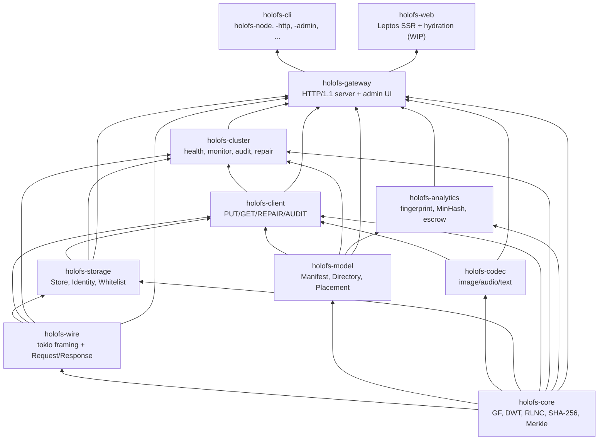
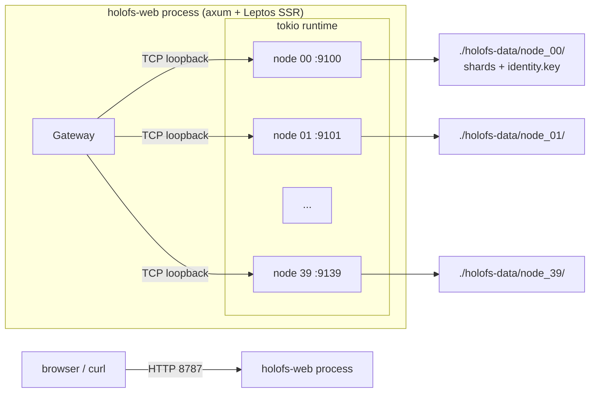
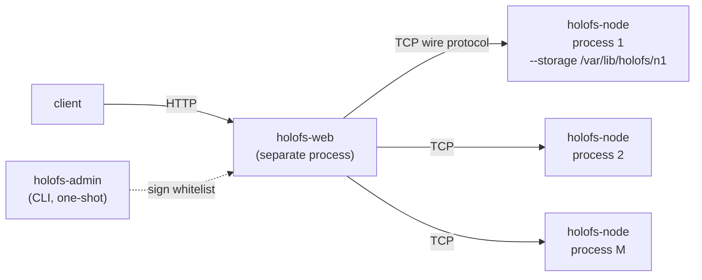
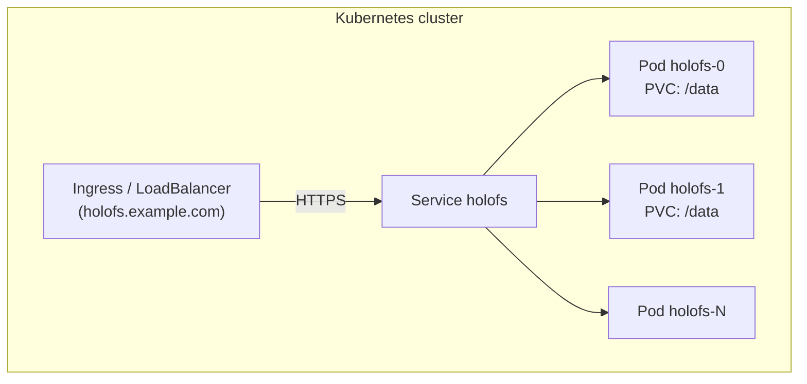
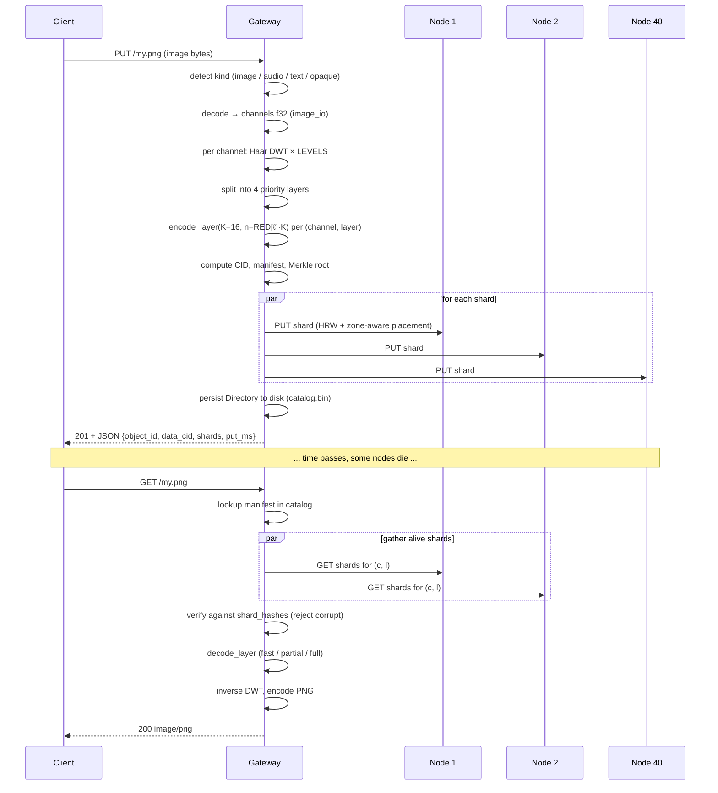

# Architecture


> ⚠ **Translation may be stale.** This file was last synced before Stage 12-15 (versioning + deletion, HNSW-backed semantic search, /spotlight ROI, streaming /holo, /diff, /similar, auto-repair-on-read, background scrub, typed RPC layer with timeouts + NoLiveNodes panic-fix, per-folder inline upload). The English source under [../](../) is the canon for any new feature; the [Unreleased] block of [../../CHANGELOG.md](../../CHANGELOG.md) lists every delta this translation does not yet cover.


Structure au niveau système de holofs, à destination des mainteneurs et des relecteurs.
Pour les fondements mathématiques, voir [theory.md](./theory.md) ; pour les détails du
protocole HTTP / filaire, voir [api.md](./api.md).

## Sommaire

1. [Graphe de dépendances entre crates](#1-crate-dependency-graph)
2. [Topologies de processus / déploiement](#2-process--deployment-topologies)
3. [Cycle de vie d'un objet (PUT → GET)](#3-object-lifecycle-put--get)
4. [Modèle de persistance](#4-persistence-model)
5. [Modèle de confiance](#5-trust-model)
6. [Modèle de concurrence](#6-concurrency-model)
7. [Modes de défaillance](#7-failure-modes)

---

## 1. Crate dependency graph

Ordre topologique strict — ne jamais laisser une flèche pointer vers le haut.



**Règle de bon sens.** Une pull request qui ajoute une arête montante dans ce graphe
nécessite une discussion à part — cela signifie presque toujours qu'un type ou une fonction
se trouve dans le mauvais crate.

---

## 2. Process / deployment topologies

### A. Embarqué mono-processus (développement / petits clusters)



Utilisé pour les démos, le dev, le bare-metal mono-machine. Le gateway et les nodes
partagent un runtime tokio mais communiquent via un vrai TCP — facile à migrer
plus tard vers un mode multi-processus.

### B. Cluster bare-metal multi-processus



Chaque node est un processus OS indépendant avec son propre répertoire de stockage
persistant et son identité Ed25519. Le gateway est configuré avec une whitelist signée
de triplets `(addr, pubkey, zone)`. L'isolation des défaillances est réelle :
tuer un processus node ne fait tomber rien d'autre.

Variante scriptée : `./scripts/spawn-cluster.sh N BASE_PORT GATEWAY_ADDR`
monte toute la topologie en une seule commande.

### C. Kubernetes (StatefulSet)



`deploy/helm/holofs` fournit des templates StatefulSet + PersistentVolumeClaim.
Chaque pod exécute l'image Docker multi-stage, qui auto-spawn des nodes embarqués
contre son propre PVC `/data`. Pour de très grands clusters, séparez en N pods
gateway + M pods node dédiés (le chart Helm prend en charge `nodeCount` et
`gatewayCount` séparément).

---

## 3. Object lifecycle (PUT → GET)



### Divergences par kind

| Kind     | Chemin du PUT                                          | Réponse du GET      |
|----------|--------------------------------------------------------|---------------------|
| image    | DWT 2D × 3 canaux × 4 couches × RLNC                   | PNG réencodé        |
| audio    | DWT 1D × 1–2 canaux × 4 couches × RLNC                 | WAV PCM 16 bits     |
| text     | Chunks aux frontières UTF-8 × 1 couche × RLNC systématique | text/plain + trous |
| opaque   | un flux d'octets × 1 couche × RLNC (pas de DWT)        | octets originaux    |

---

## 4. Persistence model

Chaque node possède un répertoire. Trois sortes de fichiers y résident :

```
<storage>/
├── identity.key                # 32-byte Ed25519 seed (mode 0600)
├── <hex>/<hex>.shard           # one file per stored shard
└── <hex>/<hex>.shard
```

Le gateway possède en plus :

```
<storage>/catalog.bin            # serialised Directory (Manifest map)
                                 # Header magic: "HOLOFSD1"
```

### Disposition d'un fichier shard

```
magic        8  bytes  = "HOLOFSS1"
object_id    8  bytes  big-endian
channel      1  byte
layer        1  byte
coeffs_len   4  bytes  big-endian
payload_len  4  bytes  big-endian
coeffs       coeffs_len bytes
payload      payload_len bytes
```

Le nom du fichier est `hex(sha256(shard))` découpé en `<2 hex chars>/<remaining 62>.shard`
(fanout à la git pour éviter des répertoires énormes).

### Atomicité d'écriture

```
write to <name>.shard.tmp
fsync
rename <name>.shard.tmp → <name>.shard
```

Un crash laisse soit rien, soit un shard complet — jamais un fichier déchiré.

### Récupération de l'index

Sur `Store::open(dir)` le node parcourt son arborescence et reconstruit en mémoire
l'index `HashMap<(object_id, channel, layer), HashMap<Hash, Shard>>` en
re-hashant chaque shard. C'est la seule source de vérité autorisée — il n'y a
pas de fichier `.idx` séparé susceptible de devenir périmé.

### Dedup

Les noms de fichiers shard sont content-addressed. Un PUT en double (mêmes coefficients
+ payload) est détecté par `fs::write(... .tmp)` → `rename` au-dessus d'un fichier existant
(écrasement à l'identique). La vérification de l'index en mémoire en amont retourne
néanmoins `false` depuis `put()` afin que l'appelant sache qu'aucun nouveau shard
n'est apparu.

---

## 5. Trust model

| Composant       | Hypothèse de confiance                                |
|-----------------|-------------------------------------------------------|
| Admin           | absolue — signe la whitelist, génère les paires de clés |
| Gateway         | fait confiance à la signature admin sur la whitelist  |
| Node            | fait confiance à sa propre `identity.key` (système de fichiers) |
| Inter-node      | pas de communication peer-to-peer ; uniquement gateway ↔ node |
| Client          | fait confiance au gateway (TLS recommandé en prod)    |

Nous ne sommes explicitement **pas** un système sans permission : il n'y a pas
de preuve de réplication, pas de résistance Sybil. holofs se situe dans la même
classe de confiance que Backblaze B2 ou AWS S3, pas Filecoin ou Storj. Voir
[threat-model.md](./threat-model.md) pour une analyse structurée.

### Primitives cryptographiques utilisées

| Objet                            | Primitive                       | Crate                |
|----------------------------------|---------------------------------|----------------------|
| Intégrité shard / objet          | SHA-256 (FIPS 180-4, fait main) | holofs-core          |
| Identité du node                 | Ed25519                         | ed25519-dalek (RFC 8032) |
| Signature de la whitelist admin  | Ed25519                         | ed25519-dalek        |
| Challenge de handshake           | nonce aléatoire de 32 octets + Ed25519 | holofs-storage |
| Séquestre de clé / style Shamir  | RLNC sur GF(2⁸) avec K personnalisé | holofs-analytics |
| Séparation de domaine            | préfixe de chaîne (`holofs-XXX-vN`) avant l'entrée de hash / signature |

---

## 6. Concurrency model

- **Runtime tokio multi-threadé** en tête de chaque binaire
  (`#[tokio::main(flavor = "multi_thread")]`).
- **Une tâche par connexion** dans le gateway et dans chaque node.
- **`tokio::sync::Mutex`** pour l'état partagé (catalogue, store, réputation,
  admin\_kills). Nous ne maintenons jamais un mutex à travers une frontière `.await`
  sur un chemin chaud — patterns de snapshot à la place.
- **Channels** non utilisés pour le moment (le système est requête/réponse) ; les
  futures réponses en streaming utiliseront `tokio::sync::mpsc`.

### Tâches en arrière-plan du gateway

| Tâche              | Cadence | Crate           |
|--------------------|---------|------------------|
| Health monitor     | `HOLOFS_MONITOR_INTERVAL` (15 s par défaut) | holofs-cluster |
| Auditeur PoR       | `HOLOFS_AUDIT_INTERVAL` (30 s par défaut)   | holofs-cluster |
| Auto-sauvegarde catalogue | à chaque mutation du catalogue (inline) | holofs-gateway |

Les deux tâches d'arrière-plan sont avortées sur SIGINT via `tokio::select!`.

---

## 7. Failure modes

| Défaillance                                 | Détectée par                  | Récupération                      |
|---------------------------------------------|------------------------------|-----------------------------------|
| Le processus node meurt                     | health monitor (`Ping`)       | marge recalculée ; si `LowMargin`, repair mis en file |
| L'OS du node redémarre, revient avec la même identité | événement `revived` du health monitor | `repair_node` remplit à nouveau la part HRW |
| Le node retourne de mauvais octets (corruption silencieuse) | audit PoR (mismatch de hash) | la réputation chute ; node exclu de `live` |
| Le node ment « je l'ai » sans stocker      | audit PoR (`MissingShard`)    | la réputation chute |
| Un rack / zone entier tombe                 | health monitor + zone-aware   | l'objet reste décodable jusqu'à $L_{n-1}/L_{n-2}$ |
| Le gateway crashe pendant un PUT            | retry du client               | les shards déjà sur les nodes sont dédupliqués par hash au retry |
| Le gateway crashe pendant un DELETE         | incohérent : certains nodes purgés, d'autres non | la prochaine passe de santé détecte des shards orphelins (TODO : gc) |
| Corruption disque sur un fichier shard      | vérification de hash en lecture | shard rejeté → marge chute → repair |
| Partition réseau entre gateway et node      | timeout RPC                   | health monitor → exclure → repair si la marge chute |
| Signature de whitelist invalide             | vérification au démarrage du gateway | refuse de démarrer (fail-fast) |

### Ce contre quoi nous ne protégeons pas

- **Gateway byzantin** : le gateway est de confiance. Un gateway malveillant peut
  corrompre toutes les données.
- **Collusion coordonnée de nodes** : K nodes malveillants (seuil K-de-N) peuvent
  reconstruire n'importe quel objet. La réputation est réactive, pas préventive.
- **Attaques par canal auxiliaire sur le transit des shards** : TLS atténuera l'écoute
  passive ; il ne prévient pas les attaques par timing contre les lookups dans les tables
  GF(2⁸) (qui sont de toute façon publiques dans le modèle de menace de holofs).
