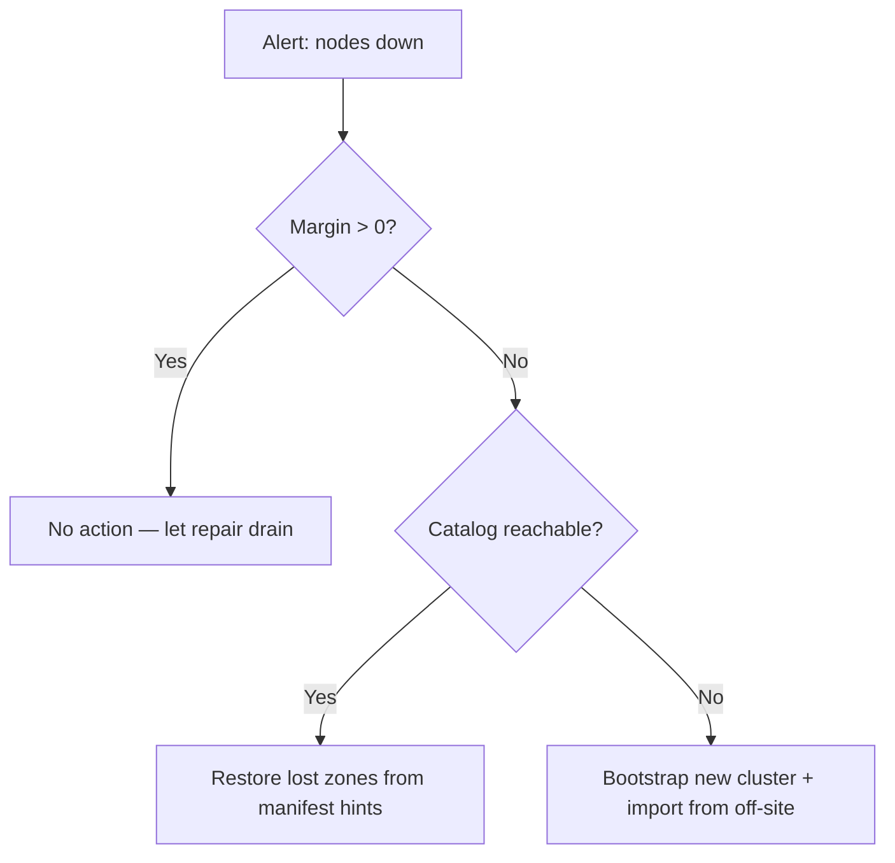

# Guide d'exploitation

Ce guide décrit comment **déployer**, **superviser**, **sauvegarder**,
**restaurer** et **planifier la capacité** d'un cluster holofs en
production.

## Sommaire

1. [Topologies de déploiement](#1-topologies-de-déploiement)
2. [Installation bare-metal](#2-installation-bare-metal)
3. [Docker / Compose](#3-docker--compose)
4. [Kubernetes via Helm](#4-kubernetes-via-helm)
5. [Référence de configuration](#5-référence-de-configuration)
6. [Supervision et alerting](#6-supervision-et-alerting)
7. [Planification de la capacité](#7-planification-de-la-capacité)
8. [Sauvegarde et restauration](#8-sauvegarde-et-restauration)
9. [Reprise après sinistre](#9-reprise-après-sinistre)
10. [Procédures Day-2](#10-procédures-day-2)

---

## 1. Topologies de déploiement

| Topologie        | Cas d'usage                                       | Avantages                       | Inconvénients                         |
|------------------|---------------------------------------------------|---------------------------------|---------------------------------------|
| Embarqué         | Dev, démo, évaluation mono-hôte                   | Un binaire, aucune orchestration | Aucune tolérance de pannes machine    |
| Multi-processus  | Hôte unique, frontières de processus isolées      | Redémarrage indépendant des nœuds | Toujours un point unique de défaillance (hôte) |
| Multi-hôte       | Production : 40 nœuds sur 5 zones × 8 hôtes       | Durabilité réelle, bascule de zone | Nécessite réseau, supervision, ops    |
| Kubernetes       | Cloud / on-prem avec k8s                          | Basé sur Helm, déclaratif        | Les stateful sets sont plus durs que le sans état |

**Cible de production recommandée :** ≥ 5 zones × ≥ 4 hôtes × 1–2
nœuds par hôte. Cela survit à **toute panne d'une zone complète** plus
des défaillances simultanées de nœuds uniques dans les zones restantes
(voir [theory.md §4](./theory.md#4-couches-de-priorité-et-dégradation-holographique)).

---

## 2. Installation bare-metal

### 2.1. Prérequis

- Linux (noyau ≥ 5.10), macOS ou Windows Server.
- 2 Go de RAM et 10 Go de disque par nœud au minimum ; 8 Go / 100 Go
  recommandés.
- Ports TCP ouverts : passerelle (`8787`) et ports de nœud (9100–9139
  par défaut).
- Un compte utilisateur (p. ex. `holofs`) avec accès en écriture au
  répertoire de données.

### 2.2. Compilation depuis les sources

```sh
# MSRV épinglée : 1.75
rustup install 1.81.0
cargo build --release --workspace
```

Binaires produits sous `target/release/` :

| Binaire              | Rôle                                            |
|----------------------|-------------------------------------------------|
| `holofs-web`         | Passerelle HTTP + cluster embarqué (axum + Leptos SSR) |
| `holofs-node`        | Démon de nœud unique (`ADDR --storage DIR`)    |
| `holofs-admin`       | Whitelist keygen + signature                    |
| `holofs-cluster`     | Harness de dev local : N nœuds in-process + passerelle |
| `holofs-fs`          | Playground de système de fichiers local         |
| `holofs-inspect`     | Inspection de manifestes / shards               |
| `holofs-bench`       | Benchmarks                                      |
| `holofs-soak`        | Driver d'ops aléatoires longue durée contre une passerelle vivante |
| `holofs-soak-report` | Rendu de rapports HTML + Markdown à partir d'un répertoire de run soak |
| `holofs`             | CLI legacy à commande unique                    |

### 2.3. Liste blanche (obligatoire en production)

```sh
# 1. Générer une paire de clés admin (gardée hors ligne ; seule la
#    pubkey circule).
holofs-admin gen-key admin.key
holofs-admin pubkey admin.key   # imprime ADMIN_PUBKEY_HEX

# 2. Démarrer chaque nœud une fois pour qu'il matérialise son propre
#    identity.key et imprime sa pubkey — collecter ces chaînes hex.
holofs-node 10.0.1.10:9100 --storage /var/lib/holofs/node00
# → holofs-node addr=10.0.1.10:9100 pubkey=NODE0_PUBKEY_HEX

# 3. Signer la liste blanche. Chaque --node est ADDR=PUBKEY_HEX:ZONE.
holofs-admin sign-whitelist \
    --admin admin.key \
    --node 10.0.1.10:9100=NODE0_PUBKEY_HEX:0 \
    --node 10.0.1.11:9100=NODE1_PUBKEY_HEX:0 \
    --node 10.0.2.10:9100=NODE2_PUBKEY_HEX:1 \
    --out whitelist.holofs

# 4. Distribuer whitelist.holofs à chaque nœud + passerelle. Vérifier :
holofs-admin verify-whitelist whitelist.holofs --admin-pubkey ADMIN_PUBKEY_HEX
holofs-admin show-whitelist   whitelist.holofs
```

Format filaire : `HOLOFSW1` (voir [api.md §3.4](./api.md#34-liste-blanche-holofsw1)).

### 2.4. TLS pour le protocole filaire (`--tls`, `--mtls`)

Le protocole binaire passerelle↔nœud peut être chiffré avec rustls.
Deux drapeaux opt-in contrôlent le comportement :

| Drapeau    | Effet |
|------------|-------|
| `--tls`    | Chiffre les trames filaires. Le certificat serveur est vérifié par le client. |
| `--mtls`   | Implique `--tls`. Le serveur exige et vérifie en plus un certificat client. |

**Mode embarqué (pas de `--whitelist`) :** le binaire génère au
démarrage une CA auto-signée + des certificats feuille. Utile pour le
dev, les démos, les clusters mono-hôte. La CA vit seulement en RAM et
est régénérée à chaque redémarrage — les clients qui mettent en cache
les certificats verront des émetteurs frais à chaque boot.

**Mode distribué (`--whitelist`) :** fournir des PEM pré-émis en ligne
de commande. Les générer avec `openssl` ou votre PKI existante :

```sh
# Émettez une CA + un certificat par hôte (script omis — utilisez votre PKI).
holofs-web \
  --whitelist cluster.wl \
  --admin-pubkey "$(holofs-admin pubkey admin.key)" \
  --tls --mtls \
  --tls-ca-cert /etc/holofs/ca.crt \
  --tls-cert   /etc/holofs/gateway.crt \
  --tls-key    /etc/holofs/gateway.key
```

La commande de nœud correspondante prend son propre feuille — voir
l'unité systemd au §2.5 pour la forme variable d'environnement.

Les fichiers de certificat doivent satisfaire :
- Les SAN du certificat feuille doivent couvrir chaque hôte `addr:port`
  auquel la passerelle se connectera (nom DNS ou littéral IP).
- Le certificat CA est la racine de confiance des deux côtés — même
  fichier sur chaque nœud et chaque passerelle.
- Sous `--mtls`, les deux côtés présentent le même genre de feuille
  signée par cette CA. Ajouter un certificat « passerelle » séparé si
  vous voulez des valeurs CN distinctes.

### 2.5. Service systemd

`/etc/systemd/system/holofs-node@.service` :

```ini
[Unit]
Description=holofs node %i
After=network.target

[Service]
Type=simple
User=holofs
Group=holofs
Environment=HOLOFS_STORAGE_DIR=/var/lib/holofs/node%i
# activer TLS sur le protocole filaire. Retirer les quatre lignes suivantes pour
# des clusters TCP en clair ; définir HOLOFS_MTLS=1 pour l'authentification mutuelle.
Environment=HOLOFS_TLS=1
Environment=HOLOFS_TLS_CA_CERT=/etc/holofs/ca.crt
Environment=HOLOFS_TLS_CERT=/etc/holofs/node%i.crt
Environment=HOLOFS_TLS_KEY=/etc/holofs/node%i.key
ExecStart=/usr/local/bin/holofs-node
Restart=on-failure
RestartSec=5s
LimitNOFILE=65536

[Install]
WantedBy=multi-user.target
```

Puis `systemctl enable --now holofs-node@00 holofs-node@01 …`.

---

## 3. Docker / Compose

### 3.1. Récupérer l'image

```sh
docker pull ghcr.io/holofs/holofs:1.0.0
```

Le Dockerfile est multi-étages : rust:1.81-slim-bookworm → debian:bookworm-slim.
L'image d'exécution tourne en **uid 10001 non-root**, avec `tini`
comme PID 1.

### 3.2. Cluster mono-hôte (embarqué)

```sh
docker run -d \
  --name holofs \
  -p 8787:8787 \
  -v /srv/holofs:/data \
  ghcr.io/holofs/holofs:1.0.0
```

### 3.3. Multi-processus via Compose

```yaml
services:
  holofs:
    image: ghcr.io/holofs/holofs:1.0.0
    volumes: ["/srv/holofs:/data"]
    environment:
      HOLOFS_LOG_FORMAT: json
      HOLOFS_ENABLE_EMBED: "1"
      HOLOFS_ENABLE_VERSIONS: "1"
    ports: ["8787:8787"]
```

---

## 4. Kubernetes via Helm

Le chart Helm vit à `deploy/helm/holofs/`.

```sh
helm install holofs ./deploy/helm/holofs \
  --set nodeCount=40 \
  --set persistence.size=50Gi \
  --set ingress.enabled=true \
  --set ingress.hosts[0].host=holofs.example.com
```

**Ressources clés** (voir `deploy/helm/holofs/templates/`) :

- `StatefulSet` pour les nœuds — IDs réseau stables, PVC par réplica.
- `Service` (`ClusterIP`) pour la passerelle.
- `Ingress` (optionnel) pour HTTPS externe.

**Conscience des zones :** `values.yaml` expose `nodeAffinity` et
`topologySpreadConstraints`. Mappez votre étiquette de zone k8s (p. ex.
`topology.kubernetes.io/zone`) aux zones holofs via
`HOLOFS_ZONE_FROM_LABEL=topology.kubernetes.io/zone` (dérivé
automatiquement de `Downward API`).

**Sondes :**

```yaml
livenessProbe:  { httpGet: { path: /,        port: http }, periodSeconds: 30 }
readinessProbe: { httpGet: { path: /health,  port: http }, periodSeconds: 10 }
```

**Contexte de sécurité :** tourne en `uid 10001`,
`readOnlyRootFilesystem: true`, `capabilities.drop: [ALL]`.

---

## 5. Référence de configuration

Toute la configuration se fait via variables d'environnement (les
drapeaux CLI sont aussi acceptés ; les drapeaux gagnent).

### 5.1. Passerelle (`holofs-web`)

| Variable                    | Défaut                    | Description                                  |
|-----------------------------|---------------------------|----------------------------------------------|
| `HOLOFS_STORAGE_DIR`        | `./holofs-data`           | Racine du stockage pour shards, catalogue, manifestes. |
| `HOLOFS_CATALOG`            | `<storage>/catalog.bin`   | Redéfinir le chemin du fichier catalogue.    |
| `HOLOFS_CONFIG`             | (non défini)              | Chemin vers une config TOML (§5.7).          |
| `HOLOFS_LOG`                | `info,holofs_web=debug`   | Spécification de filtre `tracing`.           |
| `HOLOFS_LOG_FORMAT`         | `text`                    | `text` \| `json` (production : `json`).      |
| `LEPTOS_SITE_ADDR`          | `127.0.0.1:8787`          | Adresse d'écoute HTTP (`--addr`).            |
| `HOLOFS_METRICS_LISTEN`     | (non défini)              | Adresse d'écoute Prometheus séparée optionnelle. |
| `HOLOFS_SEED_PHOTO`         | (non défini)              | Chemin vers un PNG qui seede `photo.png` au premier démarrage. |
| `HOLOFS_NO_SEED`            | `false`                   | Sauter le seed de démo à deux PNG sur un catalogue vide. |

Chaque variable de ce tableau a un drapeau CLI correspondant
(`--storage`, `--log`, `--addr`, etc.) — `holofs-web --help` donne la
liste canonique. Les drapeaux prévalent sur les variables
d'environnement.

### 5.2. `holofs-node` autonome

Le démon de nœud autonome ne prend que des arguments positionnels et
ne lit **aucune** variable `HOLOFS_*` — délibérément minimal pour que
le même binaire fonctionne sous systemd, docker ou en invocation
manuelle.

```text
holofs-node [ADDR] [--storage DIR]
```

`ADDR` défaut `127.0.0.1:5000`. `--storage DIR` active l'identité +
shards persistants ; sans cela, le nœud tourne en mémoire et
régénère sa pubkey à chaque démarrage (dev/démo uniquement).

### 5.3. Passerelle en mode distribué (whitelist + TLS)

| Variable                    | Défaut         | Description                                  |
|-----------------------------|----------------|----------------------------------------------|
| `HOLOFS_WHITELIST`          | —              | Chemin vers une whitelist signée (§2.3). Bascule le binaire en mode distribué. |
| `HOLOFS_ADMIN_PUBKEY`       | —              | Hex de 64 caractères de la pubkey admin qui a signé la whitelist. |
| `HOLOFS_TLS`                | (off)          | Chiffrer le protocole filaire (passerelle↔nœuds) avec rustls. Le mode embarqué génère automatiquement une CA auto-signée. |
| `HOLOFS_MTLS`               | (off)          | Implique `HOLOFS_TLS=1`. Le serveur exige et vérifie aussi un certificat client. |
| `HOLOFS_TLS_CERT`           | —              | Mode distribué : chemin PEM du certificat feuille. |
| `HOLOFS_TLS_KEY`            | —              | Mode distribué : chemin PEM de la clé correspondante. |
| `HOLOFS_TLS_CA_CERT`        | —              | Mode distribué : chemin PEM de la racine CA. |

### 5.4. Cluster embarqué

Les tailles de la topologie embarquée (`holofs-web` sans
`--whitelist`) sont des constantes à la compilation :
`N_NODES = 40`, `NLAYERS = 4`, `K = 16`, `LEVELS = 3`. Seuls le port
de base et le comportement du seed sont réglables au runtime.

| Variable                    | Défaut  | Description                                     |
|-----------------------------|---------|-------------------------------------------------|
| `HOLOFS_EMBED_BASE_PORT`    | `9100`  | Port de base stable pour les nœuds intra-processus ; chaque nœud écoute sur `base + idx`. À définir pour éviter le churn de ports éphémères. |
| `HOLOFS_NO_SEED`            | `false` | Sauter le seed de démo à deux PNG sur un catalogue vide. Mettre à `true` lors du réenvoi depuis une arborescence d'échantillons connue afin que le seed n'entre pas en collision avec vos données. |
| `HOLOFS_W` / `HOLOFS_H`     | `512`   | Dimensions du frame (chaque valeur doit être un multiple positif de `2^LEVELS = 8`). |

### 5.5. Fiabilité

| Variable                    | Défaut  | Description                                              |
|-----------------------------|---------|----------------------------------------------------------|
| `HOLOFS_RPC_TIMEOUT_MS`     | `8000`  | Budget global par RPC (`tokio::time::timeout`). `0` désactive le plafond ; le timeout TCP au niveau OS (60-75 s) devient alors le seul arrêt. |
| `HOLOFS_SCRUB_INTERVAL`     | `600`   | Période de scrub de shards en arrière-plan (secondes). `0` désactive. Les scrubs parcourent le catalogue, diffent `list_node_hashes` vs `place_shard`, réparent les divergences avant que les utilisateurs ne les rencontrent. |
| `HOLOFS_VERSIONS_KEEP_LAST` | `0`     | Plafond d'historique de versions par nom. Écarte les plus anciens archives à chaque PUT. `0` = illimité (le `/api/versions/delete` manuel est alors le seul chemin pour récupérer les shards). Requiert `--enable-versions`. |
| `HOLOFS_POOL_PER_NODE`      | `8`     | Nombre max de connexions filaires inactives mises en pool par adresse de nœud. |
| `HOLOFS_POOL_IDLE_SECS`     | `60`    | Retirer les entrées en pool inactives depuis plus longtemps que cela à `acquire`. |
| `HOLOFS_POOL_DISABLE`       | `false` | Contourner le pool keepalive — chaque RPC compose une nouvelle connexion. Utile pour traquer des bugs de niveau filaire. |

### 5.5.c. Limite de débit par IP

Complète les plafonds de contre-pression globaux : les plafonds
empêchent le processus d'exploser sous n'importe quel burst — cette
couche empêche un seul client mal élevé d'affamer tous les autres
appelants. Les deux s'appliquent aux seaux MEDIUM (décodage / PUT /
ops de répertoire) et LONG (recherche / spotlight / GC) ; SHORT et les
endpoints de streaming restent illimités.

| Variable                        | Défaut    | Description                                              |
|---------------------------------|-----------|----------------------------------------------------------|
| `HOLOFS_RATE_LIMIT_RPS_PER_IP`  | `0`       | Taux de recharge du token bucket par IP client. Zéro désactive la couche entièrement. |
| `HOLOFS_RATE_LIMIT_BURST`       | `2 × rps` | Nombre max de tokens que retient un bucket. Sur bucket vide, la requête reçoit 429 avec `Retry-After: 1`. |
| `HOLOFS_RATE_LIMIT_IDLE_SECS`   | `300`     | Seuil d'éviction pour inactivité de la map par IP (mémoire bornée sous des populations de clients à fort churn). |

**Source de l'IP client.** Derrière un proxy inverse, le middleware
lit le premier hop de `X-Forwarded-For`. Les connexions directes
utilisent `ConnectInfo<SocketAddr>` de
`into_make_service_with_connect_info`. Ni l'un ni l'autre présent →
bucket `0.0.0.0` partagé afin que les hôtes bruyants n'obtiennent pas
un accès gratuit par connexion.

**Métrique.** `holofs_rate_limit_rejected_total` compte chaque réponse
429. Un taux non nul soutenu suggère soit un client abusif (à
investiguer) soit un plafond sous-provisionné (augmenter
`rate_limit_rps_per_ip`).

### 5.5.b. PUT en streaming

| Variable                    | Défaut    | Description                                              |
|-----------------------------|-----------|----------------------------------------------------------|
| `HOLOFS_UPLOAD_MAX_SIZE`    | `1 Gio`   | Plafond de corps par requête pour `PUT /*path`. Le corps streame directement vers `<storage>/uploads/upload-<pid>-<counter>.tmp` (RAM constante quelle que soit la vitesse du client / la taille du corps) et est relu dans un `Vec<u8>` juste avant `Gateway::ingest_bytes`. Les corps dépassant le plafond retournent 413 Payload Too Large ; le fichier temporaire est supprimé sur chaque chemin de sortie. |

Le streaming maintient le delta RSS de la passerelle borné par le
tampon de copie (~64 Kio) plutôt que par le taux d'upload du client —
un client lent sur un upload de 200 Mio ne bloque plus 200 Mio de
mémoire de passerelle pour la durée. Le RSS pique encore brièvement à
la taille du corps au moment de l'ingestion parce que le codec RLNC /
DWT attend `&[u8]` ; un ingest entièrement en streaming est hors
portée tant que le codec ne le supporte pas.

### 5.6. Couche de fiabilité

Chaque bouton ci-dessous a un défaut sûr ; la passerelle démarre avec
succès sans aucun d'eux défini.

| Variable                              | Défaut  | Description                                              |
|---------------------------------------|---------|----------------------------------------------------------|
| `HOLOFS_MEDIUM_CONCURRENCY`           | `64`    | Permis pour le seau MEDIUM (décodages, PUT, ops de répertoire). À saturation, le middleware du handler retourne 503 avec un corps diagnostique au lieu d'empiler des tâches axum. Ajuster contre `holofs_backpressure_permits_available{bucket="medium"}`. |
| `HOLOFS_LONG_CONCURRENCY`             | `8`     | Permis pour le seau LONG (recherche sémantique, spotlight, `/api/gc`, `/api/embed_all`, scans d'empreinte). |
| `HOLOFS_REPUTATION_PERSIST_INTERVAL`  | `30`    | Fréquence à laquelle l'état `Reputation` partagé est instantané vers `<storage>/reputation.bin`. Le bootstrap le recharge au démarrage suivant ; un mismatch `n_nodes` ou un fichier corrompu retombe silencieusement sur une table fraîche. Un instantané final est aussi écrit sur SIGTERM. |
| `HOLOFS_ADMIN_TOKEN`                  | _(non défini)_ | Quand défini, `POST /admin/node` et `POST /api/gc` exigent `Authorization: Bearer <token>`. Manquant/mauvais → 401. |
| `HOLOFS_ADMIN_UNAUTHENTICATED`        | _(non défini)_ | Dépassement dev : mettre à `1` pour laisser la surface admin ouverte quand `HOLOFS_ADMIN_TOKEN` est non défini. Journalise un WARN au démarrage. Si aucune des deux variables n'est définie, la surface admin est désactivée (403). |

Les timeouts sont codés en dur par seau par conception (SHORT 10 s,
MEDIUM 60 s, LONG 300 s) ; les endpoints de streaming (SSE,
multipart/x-mixed-replace) + `/mcp` ne sont intentionnellement pas
budgétés. Les handlers écoulés remontent en `504 Gateway Timeout` et
incrémentent `holofs_handler_timeouts_total{bucket=…}`.

### 5.7. Fonctionnalités optionnelles

| Variable                    | Défaut  | Description                                              |
|-----------------------------|---------|----------------------------------------------------------|
| `HOLOFS_ENABLE_VERSIONS`    | `false` | Miroir de `--enable-versions`. Archive chaque remplacement par PUT comme un fichier annexe sous `<storage>/versions/<sanitized>/v…bin`. |
| `HOLOFS_ENABLE_EMBED`       | `false` | Miroir de `--enable-embed`. Charge le modèle CLIP-multilingual au premier PUT ou au premier `/api/search`, puis maintient `embeddings.bin`. |
| `HOLOFS_ASYNC_ENCODE`       | `false` | Bascule le chemin PUT RLNC par défaut de sync à async. Le handler retourne `202 Accepted` dès que le manifest placeholder est committé ; encode + fan-out des shards courent sur un tokio-task detached. Les handlers de lecture gatent sur `ManifestState` — voir §10.7 pour les mesures de throughput et quand c'est approprié. |
| `HOLOFS_MCP_TOKEN`          | —       | Quand défini, l'endpoint `/mcp` exige `Authorization: Bearer <token>` ET active les outils d'écriture. Sans la variable, l'endpoint reste ouvert + en lecture seule. |

### 5.8. Fichier de configuration TOML

Chaque variable d'environnement ci-dessus (`HOLOFS_*` et
`LEPTOS_SITE_ADDR`) est aussi réglable à travers un unique fichier de
configuration TOML passé via `--config /path/to/holofs.toml` ou la
variable d'environnement `HOLOFS_CONFIG`. Une configuration de
référence commentée vit à
[`deploy/holofs.example.toml`](../../deploy/holofs.example.toml).

Échelle de priorité (le plus haut gagne) :

1. Drapeau CLI (`--medium-concurrency 128`)
2. Variable d'environnement (`HOLOFS_MEDIUM_CONCURRENCY=128`)
3. Valeur du fichier TOML (`[reliability] medium_concurrency = 128`)
4. Défaut à la compilation

**Exemple** :

```toml
[server]
addr = "0.0.0.0:8787"
storage = "/var/lib/holofs"
log_format = "json"

[tls]
enabled = true
mtls = true
cert = "/etc/holofs/node.crt"
key = "/etc/holofs/node.key"
ca_cert = "/etc/holofs/ca.crt"

[reliability]
medium_concurrency = 128
long_concurrency = 16
scrub_interval_secs = 300

[admin]
# Jeton inline OU référence un fichier (recommandé pour les secrets).
token_file = "/etc/holofs/admin.token"
```

**Secrets.** `[admin] token` et `[mcp] token` acceptent soit une chaîne
inline soit un chemin `token_file` pointant sur un fichier dont la
première ligne non vide est le jeton. Pour la production, préférer
`token_file` avec mode `0400` et propriété root de sorte que le jeton
ne soit pas visible dans l'historique git du fichier de config /
chart Helm embarqué.

**Champs inconnus**. TOML utilise `deny_unknown_fields` au moment du
parsing — une faute de frappe dans `medium_concurency` (absence du 'r')
échoue bruyamment au démarrage avec le nom exact de clé dans l'erreur.
C'est intentionnel ; un repli silencieux détruirait le but du fichier.

### 5.9. Chiffrement des shards au repos

Activer avec `HOLOFS_AT_REST_ENC=1` (ou `[security]
at_rest_encryption = true` dans le TOML). Quand activé, chaque fichier
shard écrit sur disque est scellé avec AES-256-GCM. L'en-tête reste
en clair (afin que `Store::open` puisse toujours indexer sans la clé),
mais les coefficients + la charge utile de chunk encodée sont du
chiffré.

**Gestion des clés.** La clé AES 32 octets est dérivée au démarrage
depuis le seed d'identité du nœud via HKDF-SHA256
(`salt = "holofs-shard-salt-v1"`, `info = "holofs-shard-key-v1"`).
Pas de nouveau secret à faire tourner — perdre `identity.key` perd
déjà l'identité du nœud. La clé reste en RAM pour la durée de vie du
processus ; root sur un nœud en cours d'exécution peut lire du texte
en clair via un chemin d'audit légitime.

**Format filaire.** Deux magies de shard cohabitent :

| Magie       | Signification                                                |
|-------------|--------------------------------------------------------------|
| `HOLOFSS1`  | En clair. Lu par chaque version.                             |
| `HOLOFSS2`  | Scellé. `[8 o magie][18 o en-tête][12 o nonce][ct+tag]`.     |

L'en-tête de 18 octets est AAD pour le tag GCM, de sorte que toute
réécriture d'en-tête a posteriori (object_id, channel, layer,
longueurs) invalide le shard au déchiffrement. Les lectures reniflent
les 8 premiers octets et dispatchent — les répertoires mixtes v1 + v2
sont supportés de sorte qu'activer sur un store existant ne scelle que
les *nouvelles* écritures. Une passe complète de re-chiffrement est
hors portée ; la migration recommandée est de spawn un nouveau nœud
avec une nouvelle identité et laisser la passe de réparation
automatique rééquilibrer les shards sur lui.

**Modèle de menace.** Dans la portée : un adversaire prend un
instantané des fichiers de shard depuis un nœud éteint (fuite de
sauvegarde, disque décommissionné, reconstruction RAID a laissé
l'ancien disque lisible). Hors portée : root sur un nœud en cours
d'exécution — une fois que la clé dérivée est en RAM,
`read_shard_file` produit du texte en clair pour les audits légitimes.

---

## 6. Supervision et alerting

### 6.1. Endpoint de métriques

La passerelle expose `GET /metrics` au format d'exposition texte
Prometheus (`text/plain; version=0.0.4`). Gauges basés sur le pull
sourcés de `Gateway::api_stats` + instantané admin-kill plus des
compteurs de fiabilité.

| Métrique                                     | Type    | Étiquettes                   | Signification |
|----------------------------------------------|---------|------------------------------|---------------|
| `holofs_nodes_total`                         | gauge   | —                            | nœuds dans la topologie |
| `holofs_nodes_live`                          | gauge   | —                            | nœuds non admin-désactivés |
| `holofs_objects_total`                       | gauge   | `kind` (image/audio/text/opaque/directory) | taille du catalogue par type |
| `holofs_shards_total`                        | gauge   | —                            | shards planifiés à travers le catalogue |
| `holofs_shards_unique`                       | gauge   | —                            | hachages de shards distincts |
| `holofs_dedup_savings_pct`                   | gauge   | —                            | `(1 − unique/total) × 100` |
| `holofs_bytes_total`                         | gauge   | —                            | octets stockés approximatifs |
| `holofs_node_admin_killed`                   | gauge   | `node`, `addr`, `zone`       | drapeau admin-kill par nœud |
| `holofs_auto_repairs_total`                  | counter | —                            | GETs qui ont déclenché le bras de retry de `decode_with_autorepair` |
| `holofs_auto_repair_failures_total`          | counter | —                            | passes de réparation auto qui ont elles-mêmes échoué |
| `holofs_scrub_runs_total`                    | counter | —                            | ticks de scrub d'arrière-plan complétés (`HOLOFS_SCRUB_INTERVAL`) |
| `holofs_scrub_repairs_total`                 | counter | —                            | objets que le scrub a réparés *avant* qu'un utilisateur ne les rencontre |
| `holofs_catalog_persist_failures_total`      | counter | —                            | Erreurs d'écriture atomique du catalogue sur disque. Non nul = l'état sur disque est en retard sur la mémoire ; le prochain redémarrage perd des écritures. Alerter immédiatement. |
| `holofs_handler_timeouts_total`              | counter | `bucket` (short/medium/long) | Réponses 504 causées par la deadline par seau. |
| `holofs_backpressure_rejected_total`         | counter | `bucket` (medium/long)       | Réponses 503 causées par le sémaphore à capacité. |
| `holofs_backpressure_permits_available`      | gauge   | `bucket` (medium/long)       | Permis encore libres. Constamment à 0 = seau sous-provisionné ; constamment au max = inactif. |
| `holofs_supervised_task_restarts_total`      | counter | `task` (monitor/auditor/scrub) | Paniques + sorties inattendues des boucles supervisées. Tout non-zéro signale un crash répété que l'opérateur doit investiguer. |
| `holofs_admin_auth_failures_total`           | counter | `outcome` (missing/bad/disabled) | Rejets de jeton bearer admin ventilés par raison. `disabled` = surface refusée parce que ni `HOLOFS_ADMIN_TOKEN` ni `HOLOFS_ADMIN_UNAUTHENTICATED` n'est défini. |

Un cluster sain garde les compteurs d'auto-guérison à zéro ou proche
de zéro ; un taux non nul soutenu sur `auto_repair_failures_total`
est le signal d'alerte opérateur que le placement / la perte disque
est allé au-delà de ce que le seuil K peut absorber.

Les compteurs de fiabilité (échecs de persistance, timeouts de
handler, rejets de contre-pression, redémarrages supervisés, échecs
d'auth admin) forment ensemble le « tableau d'alertes de fiabilité »
— chacun d'eux devrait être plat à zéro sur un cluster bien
provisionné avec un jeton configuré. Voir les règles d'alerte de
référence ci-dessous.

Les futures releases ajouteront des histogrammes pour le RTT filaire,
la latence de décodage et la réputation par objet (actuellement
uniquement journalisée via `tracing`).

### 6.2. Règles d'alerte de référence

```yaml
groups:
- name: holofs
  rules:
  - alert: HolofsNodeDown
    expr: holofs_node_up == 0
    for: 5m
    annotations:
      summary: "holofs node {{ $labels.node }} is down"

  - alert: HolofsZoneDegraded
    expr: count by (zone) (holofs_node_up == 0) >= 2
    for: 10m
    annotations:
      summary: "zone {{ $labels.zone }} has ≥2 dead nodes (margin loss)"

  - alert: HolofsDiskFillingFast
    expr: predict_linear(holofs_bytes_stored_total[1h], 24*3600) > node_filesystem_size_bytes
    for: 30m
    annotations:
      summary: "node {{ $labels.node }} will fill within 24h"

  - alert: HolofsRepairFailing
    expr: rate(holofs_repair_jobs_total{result="failed"}[15m]) > 0.1
    for: 30m

  - alert: HolofsLowReputation
    expr: holofs_node_reputation < 0.5
    for: 1h
    annotations:
      summary: "node {{ $labels.node }} reputation collapsed (audit mismatches)"

  # Alertes de fiabilité série N.

  - alert: HolofsCatalogPersistFailing
    expr: rate(holofs_catalog_persist_failures_total[10m]) > 0
    for: 5m
    annotations:
      summary: "gateway is failing to persist the catalog to disk"
      description: |
        holofs_catalog_persist_failures_total is climbing.
        Every increment = one 500 on a PUT/mkdir/rmdir/rename and one
        write that in-memory succeeded but on-disk didn't. Next
        restart will drop those changes. Check disk space + FS mount
        options on the gateway host.

  - alert: HolofsHandlerTimeouts
    expr: rate(holofs_handler_timeouts_total[15m]) > 0.05
    for: 15m
    annotations:
      summary: "handler bucket {{ $labels.bucket }} exceeding deadline"
      description: |
        More than one 504 every ~20 seconds. Slow cluster, slow disk,
        or the deadline is too tight for the traffic pattern.

  - alert: HolofsBackpressureSaturated
    expr: holofs_backpressure_permits_available == 0
    for: 5m
    annotations:
      summary: "bucket {{ $labels.bucket }} has zero permits available"
      description: |
        The MEDIUM/LONG semaphore is at 0 for 5 minutes straight.
        Either the cluster is genuinely overloaded (scale up nodes)
        or the cap is too low for the workload — bump the matching
        HOLOFS_*_CONCURRENCY env var.

  - alert: HolofsSupervisedTaskRestarting
    expr: rate(holofs_supervised_task_restarts_total[30m]) > 0
    for: 15m
    annotations:
      summary: "{{ $labels.task }} is crashing repeatedly"
      description: |
        The supervised background loop is panicking + being restarted
        by supervised_spawn. Read the gateway logs for the panic
        payload and file a bug.

  - alert: HolofsAdminAuthAttempts
    expr: rate(holofs_admin_auth_failures_total{outcome=~"missing|bad"}[10m]) > 0.1
    for: 10m
    annotations:
      summary: "admin surface seeing sustained 401s (possible probe)"
      description: |
        Someone is hitting /admin/node or /api/gc without a valid
        bearer. Missing = no Authorization header at all; bad = wrong
        token. If unexpected, treat as a probe.
```

### 6.3. Tracing

Quand `HOLOFS_TELEMETRY_OTLP` est défini, la passerelle exporte les
spans OTLP/HTTP :

| Nom de span            | Attributs utiles                            |
|------------------------|---------------------------------------------|
| `gateway.put`          | `object.kind`, `bytes.in`, `shards.out`     |
| `gateway.get`          | `object.kind`, `layers`, `bytes.out`, `nodes_contacted` |
| `gateway.repair`       | `object_id`, `channel`, `layer`, `shards_recovered` |
| `wire.send`            | `op`, `target.node`, `bytes`                |

### 6.4. Tableaux de bord

Un tableau de bord Grafana JSON de référence est livré à
`deploy/grafana/holofs.json`. Panneaux du haut : débit d'ingestion,
P99 de décodage par type, % de dedup, débit de réparation, heatmap de
disponibilité de nœuds par zone.

---

## 7. Planification de la capacité

### 7.1. Surcoût de stockage

Le coût de stockage est dominé par la redondance RLNC à travers les
couches de priorité. Pour un objet de charge utile de taille `S` :

$$
\text{octets stockés} \approx S \cdot \sum_{\ell} R_\ell \cdot \frac{N_\ell}{K_\ell}
$$

Pour les ratios de couche par défaut `R = [4.0, 2.5, 1.6, 1.15]`, le
surcoût moyen est d'environ **9,25×** (en comptant les métadonnées,
~9,4×).

| Taille d'objet | Stocké sur le cluster | Par nœud (40 nœuds) |
|----------------|-----------------------|---------------------|
| 1 Mo           | ~9,4 Mo               | ~235 Ko             |
| 1 Go           | ~9,4 Go               | ~235 Mo             |
| 1 To           | ~9,4 To               | ~235 Go             |

**Ajuster pour un stockage moins cher :** baisser `R_0` (redondance de
perte catastrophique) à `2.0` et `R_1..3` à `[1.5, 1.2, 1.05]` — le
surcoût tombe à ~5,75×. Voir
[theory.md §4](./theory.md#4-couches-de-priorité-et-dégradation-holographique)
pour le compromis marge de survie.

### 7.2. Planification CPU

| Opération              | Coût (relatif au memcpy)  | Goulot        |
|------------------------|---------------------------|---------------|
| Multiplication GF(2⁸)  | 4× memcpy (LUT)           | Cache L1      |
| Haar 2D avant          | 3× memcpy                 | Bande passante RAM |
| Encodage RLNC K=16, payload 1024 B | 60× memcpy    | CPU           |
| SHA-256 sur 1 Mo       | 2× memcpy (avec SIMD)     | CPU           |

Un cœur x86_64 moderne soutient ~150 Mo/s d'encodage RLNC pour K=16.
Le multi-cœur passe linéairement jusqu'à ce que l'IO disque devienne
le goulot (~500 Mo/s sur NVMe).

### 7.3. Planification réseau

Bande passante filaire du pire cas par Put :

```
egress = payload × facteur_redondance × nombre_couches
       ≈ payload × 9.25
```

Pour un upload de 100 Mo, la passerelle émet ~925 Mo vers le pool de
nœuds. Prévoir **au moins 1 Gbit/s** entre la passerelle et les
nœuds.

### 7.4. Dimensionnement correct du cluster

| Propriété                 | Choisir par                                |
|---------------------------|--------------------------------------------|
| `N_nodes`                 | ≥ 4 × `K` pour que RLNC ait du jeu de placement |
| `N_zones`                 | ≥ 3 ; 5 recommandé pour perte de zone unique |
| `K`                       | 16 (défaut) — point idéal CPU vs marge     |
| `redundancy_per_layer`    | correspondre à la marge de survie ≥ 5σ désirée |

---

## 8. Sauvegarde et restauration

### 8.1. Ce qui vit sur disque

Par nœud (`HOLOFS_DATA_DIR`) :

```
manifests/         manifestes par objet (HOLOFSM6)
catalog/HOLOFSD1   l'index de répertoire (écriture atomique)
shards/aa/bb……    fichiers .shard, adressés par contenu
identity/secret    clé privée Ed25519
whitelist.holofs   liste de pairs signée par admin
```

### 8.2. Modèle de sauvegarde

**holofs est sa propre sauvegarde** pour tout objet *unique* — perdre
un nœud déclenche la réparation RLNC depuis les frères. La sauvegarde
importe pour :

1. **Perte catastrophique du cluster** (p. ex. toutes les zones hors ligne).
2. **Corruption logique / suppression accidentelle** (`Purge` est irréversible).
3. **Matériel d'identité** (clés Ed25519 + liste blanche signée) — sans
   ceux-ci, les remplacements ne peuvent rejoindre un cluster de confiance.

### 8.3. Plan de sauvegarde recommandé

| Données              | Fréquence         | Outillage                 | Où                   |
|----------------------|-------------------|---------------------------|----------------------|
| Identité + liste blanche | À chaque changement | `restic`, `aws s3 sync` | Hors site chiffré    |
| Instantané du catalogue | Toutes les heures | `cp catalog/HOLOFSD1 → …` | S3 / NFS / bande     |
| Répertoire de shards | Optionnel         | `restic` ou snapshots zfs | Stockage froid       |

Un `holofs-admin export <name>` périodique reconstruit un objet en un
unique fichier canonique et l'écrit dans un bucket externe. C'est la
manière recommandée de sauvegarder **des objets spécifiques à haute
valeur**.

### 8.4. Procédures de restauration

| Scénario                              | Procédure |
|---------------------------------------|-----------|
| Perte d'un disque de nœud             | Effacer le disque ; redémarrer le nœud ; le cluster répare automatiquement les shards. |
| Plusieurs nœuds perdus, < marge       | Aucune action nécessaire — le décodage RLNC le tolère. |
| Catalogue corrompu sur la passerelle  | Copier `catalog/HOLOFSD1` depuis une passerelle pair ou la dernière sauvegarde horaire ; redémarrer. |
| Cluster entier perdu                  | Provisionner un nouveau cluster ; `holofs-admin import` chaque export hors site. |
| Compromission de clé de liste blanche | Générer une nouvelle clé admin ; re-signer la liste blanche ; hot-reload (voir [§10.4](#104-hot-reload-de-la-liste-blanche)). |

---

## 9. Reprise après sinistre

### 9.1. Cibles RTO / RPO

| Défaillance                        | RTO       | RPO      | Déclencheur                          |
|------------------------------------|-----------|----------|--------------------------------------|
| Nœud unique                        | < 1 min   | 0        | Auto (monitor + réparation)          |
| Zone unique (≤ ⅕ des nœuds)        | < 5 min   | 0        | Auto (marge encore positive)         |
| Deux zones simultanément           | < 1 h     | Heures   | Manuel : re-provisionner + import    |
| Cluster entier                     | < 8 h     | ≤ 1 h    | Manuel : restauration complète depuis sauvegardes S3 |

### 9.2. Arbre de décision



### 9.3. Exercices

À exécuter trimestriellement. Scénarios suggérés :

1. **Exercice de kill de zone** — `kubectl drain` tous les pods dans
   une étiquette de zone ; vérifier qu'aucun objet ne devient
   inatteignable et que la réparation complète en < 10 min.
2. **Exercice de restauration à froid** — sur un cluster k8s frais,
   restaurer `<storage>/` depuis le bucket de sauvegarde
   (`restic restore` / `rclone copy`), démarrer la passerelle,
   vérifier `/api/stats` et un GET ponctuel ; mesurer le RTO.
3. **Exercice de rotation de clé** — signer une nouvelle liste blanche
   avec la clé admin, hot-reload sans indisponibilité.

---

## 10. Procédures Day-2

### 10.1. Ajouter un nœud

```sh
# 1. Démarrer le nouveau nœud une fois pour qu'il matérialise son
#    identity et imprime sa pubkey. Le répertoire storage doit être vide.
holofs-node 10.0.3.10:9100 --storage /var/lib/holofs/node41
# → holofs-node addr=10.0.3.10:9100 pubkey=NEW_PUBKEY_HEX

# 2. Re-signer la liste blanche avec l'ensemble *complet* des nœuds
#    (sign-whitelist régénère toujours le fichier depuis zéro).
holofs-admin sign-whitelist \
  --admin admin.key \
  --node 10.0.1.10:9100=NODE0_PUBKEY_HEX:0 \
  ... \
  --node 10.0.3.10:9100=NEW_PUBKEY_HEX:4 \
  --out whitelist.holofs

# 3. Distribuer whitelist.holofs à chaque nœud + passerelle ; SIGHUP.
```

Le catalogue est inchangé ; les futurs placements peuvent piocher le
nouveau nœud via HRW. Les objets existants ne sont **pas** rééquilibrés
automatiquement — le scrub d'arrière-plan (`HOLOFS_SCRUB_INTERVAL`) et
l'auto-réparation à la lecture migrent progressivement les shards.

### 10.2. Retirer (décommissionner) un nœud

Il n'y a pas de commande `drain` dédiée — décommissionner un nœud
consiste à éditer la liste blanche + arrêter le démon ; la boucle de
réparation du cluster restaure les shards perdus.

```sh
# 1. Re-signer la liste blanche sans le nœud sortant.
holofs-admin sign-whitelist \
  --admin admin.key \
  --node 10.0.1.11:9100=NODE1_PUBKEY_HEX:0 \
  ... \
  --out whitelist.holofs

# 2. Distribuer + SIGHUP chaque nœud + passerelle restants.
# 3. Regarder `holofs_repair_completed_total` grimper : le scrub
#    relocalise les shards du nœud parti sur les survivants.
# 4. Une fois que /api/stats montre les objets complètement réparés,
#    arrêter l'ancien démon.
systemctl stop holofs-node@10
```

### 10.3. Remplacer un disque défaillant

1. `systemctl stop holofs-node@N`
2. Remplacer le disque, monter un système de fichiers frais à
   `HOLOFS_DATA_DIR`.
3. Restaurer les fichiers d'identité (`identity/secret`,
   `whitelist.holofs`) depuis la sauvegarde hors site — ceux-ci sont
   liés à l'adresse du nœud, non au disque.
4. `systemctl start holofs-node@N` — le cluster remplira le disque via
   la réparation pilotée par audit en minutes à heures selon la taille.

### 10.4. Hot-reload de la liste blanche

```sh
# Déposer le nouveau fichier de liste blanche à sa place
cp whitelist.holofs.new /etc/holofs/whitelist.holofs

# Signaler tous les démons
killall -SIGHUP holofs-node holofs-web
```

Les démons re-vérifient la signature admin avant d'échanger la
nouvelle liste. Une mauvaise signature est journalisée et l'ancienne
liste est conservée.

### 10.5. Mise à jour progressive

Holofs garantit la compatibilité du protocole filaire dans une
version mineure (`1.x → 1.x+1` est sûr). Pour k8s :

```sh
helm upgrade holofs ./deploy/helm/holofs --set image.tag=1.0.0
```

Le StatefulSet roule un pod à la fois, attend la readiness, puis
avance. Pendant le déploiement, le cluster opère dégradé d'exactement
un nœud — bien à l'intérieur de la marge pour tout dimensionnement
par défaut.

### 10.6. Aide-mémoire des commandes de santé

```sh
# Vue d'ensemble du cluster
curl -s http://gw:8787/api/stats | jq

# Santé par nœud (HTML dans le navigateur ; JSON via l'en-tête accept)
curl -s -H "accept: application/json" http://gw:8787/health

# Marge par (canal, couche) pour un objet
curl -s http://gw:8787/health/photo.png

# Inspecter la distribution des shards
curl -s http://gw:8787/inspect/photo.png
```

Voir [api.md](./api.md) pour l'inventaire complet des routes.

### 10.7. Tests de soak

`holofs-soak` envoie du trafic HTTP aléatoire contre un gateway
vivant pendant des heures, enregistre tout ce qui s'est passé, et
sort avec un `summary.json` — le workflow prévu est « verrouiller un
changement suspect avec un soak d'une nuit, puis trier
`errors.jsonl` le lendemain matin ».

Trois topologies de cluster via `--topology` :

| `--topology`     | Ce que fait le runner                                                             |
|------------------|-----------------------------------------------------------------------------------|
| `external`       | Se connecte à un gateway déjà en cours d'exécution sur `--base` (défaut). Pas de cycle de vie. |
| `embedded`       | Lance un processus `holofs-web` avec le cluster 40 nœuds in-process.               |
| `multi-process`  | Lance `--nodes` processus `holofs-node` + un `holofs-web` whitelisté.              |

Pour les deux topologies avec spawn, la racine de stockage est un
tempdir scratch sous `$TMPDIR` (supprimé à la sortie sauf si
`--cluster-storage <dir>` est fourni), et le seed post-boot est
`deploy/dev-seed.sh` sauf si `--seed-script <path>` prend le relais.
Les binaires sont cherchés à côté de `holofs-soak` lui-même, ou
`--binary-dir <dir>` peut pointer ailleurs (ex. `target/release`).

**Feature-flags optionnels pour le gateway spawné :**

- `--enable-embed` — active la recherche sémantique CLIP sur le
  `holofs-web` spawné et déclenche un `POST /api/embed_all` après le
  seed pour que l'index soit peuplé avant le démarrage des workers.
  Sans le flag, le runner sonde `/api/search` au boot et retire l'op
  `search` du mix — pas de tempête de 500 sur une feature non
  câblée.
- `--enable-versions` — active l'historique de versions par objet.
  Désactivé, `versions_list` tombe pareillement du mix.

Les deux flags sont `false` par défaut (correspond à `make dev`),
pour que les smoke-runs courts démarrent vite. Activez-les pour les
soaks réalistes de 8 heures.

**Molettes de throttling.** 50 workers × ~0,5 s de think-time
donnent par défaut ~100 ops/sec — assez pour stresser un cluster
embedded 40 nœuds, mais suffisamment léger pour éviter une tempête
de retry auto-infligée. Quatre flags pour ajuster finement :

| Flag                        | Défaut  | Effet                                                                       |
|------------------------------|---------|-----------------------------------------------------------------------------|
| `--thinktime <dur>`          | `500ms` | Borne supérieure du sleep aléatoire que chaque worker prend entre les ops.   |
| `--error-backoff <dur>`      | `500ms` | Sleep de base après un 5xx / erreur transport. Double par échec consécutif.  |
| `--error-backoff-max <dur>`  | `30s`   | Plafond du backoff exponentiel.                                              |
| `--rate-limit <ops/s>`       | `0`     | Token-bucket global partagé par tous les workers. `0` = désactivé.           |
| `--op-mix "op=w,..."`        | `""`    | Écrase le poids de n'importe quelle op ; `w=0` retire l'op du mix.           |

Activer **`--rate-limit`** donne un plafond dur indépendamment du
nombre de workers — pratique pour des histogrammes de latence
reproductibles. `--op-mix` permet de découper des scénarios
read-heavy ou write-heavy sans toucher au code (ex.
`--op-mix "put_new=3,put_replace=2"` pour un profil surtout lecture,
`--op-mix "search=0,similar=0"` pour sauter les endpoints
analytiques).

Les poids effectifs et les paramètres de throttle sont aussi écrits
dans `config.json` pour que l'analyse post-run sache exactement quel
mix a produit les chiffres.

**Profils baseline mesurés sur cette machine.** Soak de 3 min sur
`--topology multi-process --nodes 4` (Macbook M-series, build
release) :

| Profil                        | Workers | Op-mix                     | Timeout | RPS   | Err % |
|-------------------------------|--------:|----------------------------|--------:|------:|------:|
| smoke-only                    | 10      | default                    | 30 s    | 1,7   | 3,9 % |
| default (inutilisable)        | 50      | default                    | 30 s    | 4,4   | 45 %  |
| write-light                   | 50      | `put_new=3,put_replace=2`  | 30 s    | 23,4  | 7,5 % |
| **sweet spot réaliste**       | **50**  | **`put_new=3,put_replace=1`** | **60 s** | **8,4** | **4,0 %** |
| patience client longue        | 50      | `put_new=3,put_replace=1`  | 120 s   | 10,9  | 10,7 % |

**Async ingest (`HOLOFS_ASYNC_ENCODE=1`).** Flag côté serveur
optionnel qui bascule le chemin PUT RLNC par défaut de sync
(`201 Created` après fin d'encode + fanout) à async : le manifest
placeholder est commité en synchrone en `ManifestState::Encoding`,
l'encode + fan-out des shards courent sur un tokio-task detached, et
le handler retourne `202 Accepted` avec un header `Location: /path`
+ JSON `{state:"encoding", …}`. Les handlers de lecture gatent sur
l'état — GET/HEAD sur `Encoding` retourne `503 Retry-After: 5`, sur
`Failed` retourne `404`. DELETE sur `Encoding` retourne `409
Conflict`. La récupération au démarrage rabaisse tout manifest
`Encoding` survivant à `Failed` pour qu'un shutdown sale ne laisse
pas de tombstones.

Mesuré sur la topologie soak multi-process à 4 nœuds, même profil
(`--workers 50 --op-mix "put_new=3,put_replace=1" --thinktime 500ms`) :

| Chemin            | PUT p50    | RPS total | Notes |
|-------------------|-----------:|----------:|-------|
| Sync (baseline)   | 49 969 ms  | 8,4       | Client attend l'encode complet. |
| Sync + fan-out    | 34 822 ms  | 5,3       | Wire parallèle ; encode toujours sur le chemin chaud. |
| **Async 202**     | **113 ms** | **24,1**  | Encode totalement hors chemin chaud. |

Le runner dans sa forme actuelle ne comprend pas le polling
`202` + `Retry-After` — il traite un GET sur `Encoding` comme un 503
banal — donc le run async ci-dessus rapporte un taux d'erreur gonflé
à ~45 %. Un client polling-aware (ou une future évolution du runner)
ramène ça à des 200 normaux.

**Quand utiliser `HOLOFS_ASYNC_ENCODE=1` :** pipelines burst-heavy
où l'appelant tolère un flow « rappelle-moi plus tard » — uploads en
gros, jobs de sync/réplication, batch ingest. Sync reste le défaut
pour les PUT interactifs où le client veut un `201` net et un
data_cid final.

Deux findings contre-intuitifs remontés par l'étude :

- Remonter `--request-timeout` de 60 s à 120 s a rendu les choses
  **pires**, pas meilleures : les clients qui attendent plus
  longtemps gardent plus de PUT concurrents en vol, les
  MEDIUM-permits (défaut 64) se remplissent, cascade de 5xx. 60 s
  est le sweet spot pour un cluster 4 nœuds.
- Remonter le `HOLOFS_MEDIUM_CONCURRENCY` du gateway de 64 à 128 a
  aussi rendu les choses **pires** — les permits supplémentaires
  laissent plus de PUT tourner, mais PUT est CPU-heavy (JPEG-décodage
  + DWT + fanout RLNC) et affame les GET concurrents sur le même
  hôte. GET p50 a bondi de 1 ms à 79 ms, taux d'erreur net a
  augmenté. 64 reste le défaut ; ne remontez que si la charge est
  prouvée read-dominant.

```sh
# 1) External : cluster déjà lancé, ex. via `make dev`.
./target/release/holofs-soak \
    --topology external \
    --base http://127.0.0.1:8787 \
    --workers 50 --duration 8h --out .soak

# 2) Embedded : 40 nœuds in-process ; le plus simple, correspond à `make dev`.
./target/release/holofs-soak \
    --topology embedded \
    --gateway-port 8787 \
    --enable-embed --enable-versions \
    --workers 50 --duration 8h \
    --binary-dir target/release --out .soak

# 3) Multi-process : N daemons de nœuds + gateway avec whitelist signée.
./target/release/holofs-soak \
    --topology multi-process \
    --nodes 8 --node-base-port 5100 --gateway-port 8787 \
    --enable-embed --enable-versions \
    --workers 50 --duration 8h \
    --binary-dir target/release --out .soak
```

Chaque run écrit dans `.soak/<utc-timestamp>/` :

| Fichier                 | Contenu                                                              |
|-------------------------|----------------------------------------------------------------------|
| `config.json`           | Paramètres utilisés (seed, durée, workers, base URL, timeouts).      |
| `ops.jsonl`             | Une ligne par appel HTTP : `{t, worker, op, target, http, ms, err?}`. |
| `errors.jsonl`          | Même schéma, filtré à `http >= 500` ou erreurs de transport.         |
| `metrics.jsonl`         | Snapshot `/metrics` + `/api/stats` toutes les `--metrics-interval`.   |
| `health-events.jsonl`   | Stream SSE brut de `/api/health/events`.                              |
| `summary.json`          | Comptes par op, latence p50/p95/p99, histogramme des statuts HTTP.    |

La sélection d'ops est pondérée vers la lecture (`get_random` ≈ 30 %,
`put_new` ≈ 15 %, `put_replace` ≈ 10 %, `search` ≈ 8 %, mutations
catalogue ≈ 12 %) pour que le runner sollicite plus fort les chemins
read + version que la surface admin. Ctrl-C éteint proprement et
écrit quand même le summary. Poids et ensemble d'ops sont compilés —
patcher `crates/holofs-cli/src/bin/holofs-soak.rs` s'il faut un mix
différent pour une investigation spécifique.

Le runner est délibérément **read-mostly sur la surface admin** : il
n'appelle pas `/api/gc`, `/admin/node`, ni les endpoints escrow —
donc on peut le pointer sur un gateway staging live sans effets de
bord sur l'état du cluster au-delà des PUT/DELETE normaux.

Shutdown gracieux dans les trois topologies :

- Ctrl-C ou la deadline `--duration` bascule un `CancellationToken`
  ; workers, writer, metrics-collector, et consommateur SSE drainent
  dans l'ordre, puis `summary.json` est écrit.
- Pour `embedded`/`multi-process`, les enfants spawnés reçoivent
  SIGTERM (via `Child::start_kill`) après que `summary.json` soit
  sur disque, chacun avec une grace-period de 5 s. Les tempdirs
  scratch sont supprimés en sortant.
- Si le run panic avant `summary.json`, `kill_on_drop(true)` sur
  chaque `Child` spawné garantit toujours qu'aucun processus gateway
  ou node ne fuite vers le test suivant.

### 10.7.a. Rapports

`holofs-soak-report` transforme un répertoire de run en un rapport
self-contained. HTML par défaut (CSS inline + graphiques SVG inline,
pas de CDN, pas de JS — s'ouvre dans n'importe quel navigateur et
reste lisible des années plus tard) ; Markdown disponible pour des
summaries commitables ou des attachements d'issue GitHub. Les deux
formats en un seul appel via `--format both`.

```sh
# Dernier run sous .soak/, HTML → .soak/<run>/report.html
holofs-soak-report

# Run explicite, deux formats, buckets de 30 s pour un soak court
holofs-soak-report .soak/2026-07-07T15-34-41Z --format both --bucket 30s

# Chemin de sortie custom (extension ajoutée automatiquement pour `both`)
holofs-soak-report --format both --output ~/soak-nightly
# → ~/soak-nightly.html + ~/soak-nightly.md
```

Le rapport contient :

1. **Aperçu** — total d'ops, taux d'erreur, RPS moyen, elapsed vs
   durée configurée, taille du bucket.
2. **Timings par opération** — count, erreurs, skips, p50/p95/p99 ms,
   max ms.
3. **Timelines de throughput et d'erreurs** — RPS par bucket +
   erreurs `{4xx, 5xx, transport}` empilées par bucket, plus une
   couche de latence p95 pour les top-5 ops par volume.
4. **Charge par worker** — bar-charts ops et erreurs.
5. **Top erreurs** — triplets `(op, target, http)` les plus
   fréquents plus messages transport-level dédupliqués.
6. **Télémétrie cluster** — timelines de `objects_total`,
   `shards_total`, `bytes_total`, `nodes_live`, et les compteurs de
   repair directement depuis `/api/stats` ; plus les métriques
   Prometheus `holofs_backpressure_rejected_total`,
   `holofs_handler_timeouts_total`,
   `holofs_rate_limit_rejected_total` et
   `holofs_backpressure_permits_available{bucket}` parsées depuis
   `metrics.jsonl`.
7. **Échantillon health-events** — 20 premières trames SSE
   verbatim (la queue est élidée avec un count).
8. **Reproductibilité** — `config.json` complet inséré à la fin pour
   un rerun exact.
