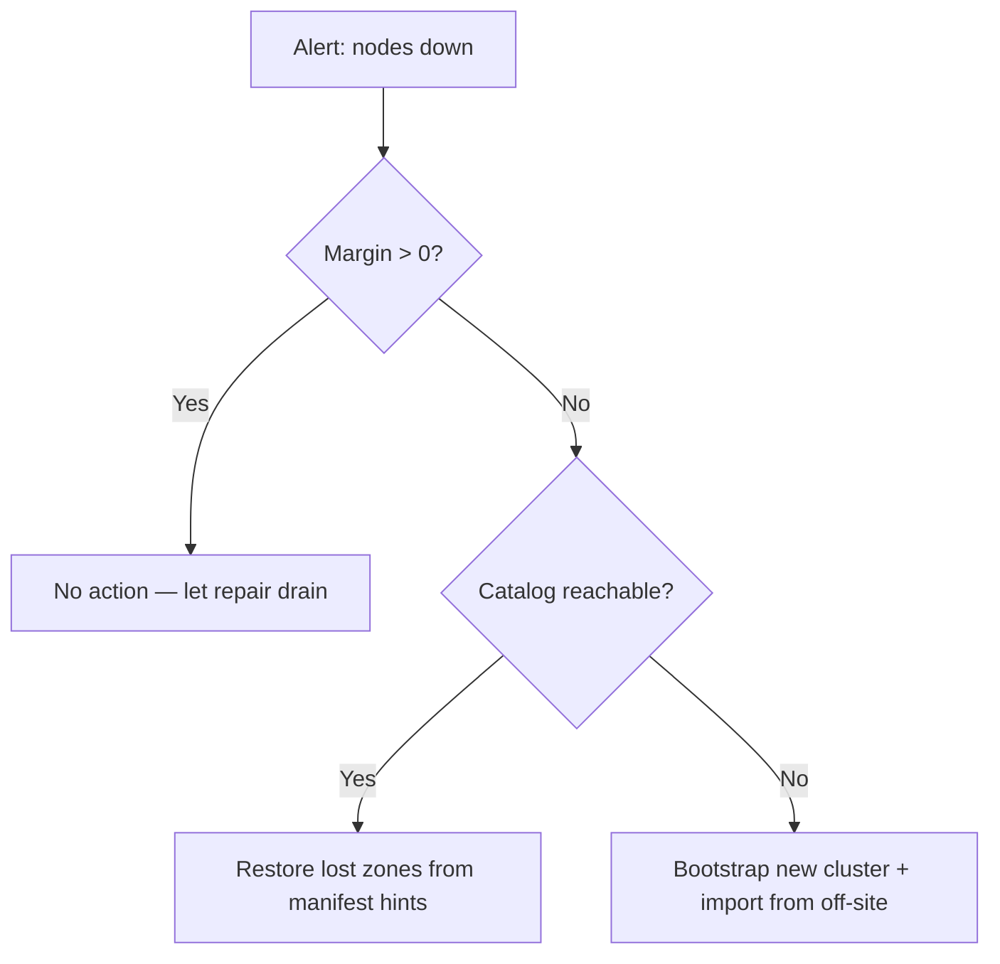

# Guide d'exploitation


> ⚠ **Translation may be stale.** This file was last synced before Stage 12-15 (versioning + deletion, HNSW-backed semantic search, /spotlight ROI, streaming /holo, /diff, /similar, auto-repair-on-read, background scrub, typed RPC layer with timeouts + NoLiveNodes panic-fix, per-folder inline upload). The English source under [../](../) is the canon for any new feature; the [Unreleased] block of [../../CHANGELOG.md](../../CHANGELOG.md) lists every delta this translation does not yet cover.


Ce guide décrit comment **déployer**, **surveiller**, **sauvegarder**, **restaurer**
et **planifier la capacité** d'un cluster holofs en production.

## Sommaire

1. [Topologies de déploiement](#1-deployment-topologies)
2. [Installation bare-metal](#2-bare-metal-install)
3. [Docker / Compose](#3-docker--compose)
4. [Kubernetes via Helm](#4-kubernetes-via-helm)
5. [Référence de configuration](#5-configuration-reference)
6. [Surveillance et alerting](#6-monitoring--alerting)
7. [Planification de la capacité](#7-capacity-planning)
8. [Sauvegarde et restauration](#8-backup--restore)
9. [Reprise après sinistre](#9-disaster-recovery)
10. [Procédures Day-2](#10-day-2-procedures)

---

## 1. Deployment topologies

| Topologie        | Cas d'usage                                     | Avantages                        | Inconvénients                         |
|------------------|-------------------------------------------------|----------------------------------|---------------------------------------|
| Embarquée        | Dev, démo, évaluation mono-hôte                 | Un binaire, pas d'orchestration  | Pas de tolérance aux pannes machine   |
| Multi-processus  | Hôte unique, frontières de processus isolées    | Redémarrer les nodes indépendamment | Toujours un point unique de défaillance (l'hôte) |
| Multi-hôte       | Production : 40 nodes répartis sur 5 zones × 8 hôtes | Durabilité réelle, failover par zone | Nécessite réseau, monitoring, ops |
| Kubernetes       | Cloud / on-prem avec k8s                        | Basé sur Helm, déclaratif        | Les stateful sets sont plus durs que stateless |

**Cible recommandée pour la production :** ≥ 5 zones × ≥ 4 hôtes × 1–2 nodes par hôte.
Ceci survit à **toute panne complète d'une zone** plus des défaillances simultanées
de nodes uniques dans les zones restantes (voir [theory.md §3](./theory.md#3-priority-layers)).

---

## 2. Bare-metal install

### 2.1. Prérequis

- Linux (kernel ≥ 5.10), macOS ou Windows Server.
- 2 GB de RAM et 10 GB de disque par node au minimum ; 8 GB / 100 GB recommandés.
- Ports TCP ouverts : gateway (`8787`) et ports des nodes (9100–9139 par défaut).
- Un compte utilisateur (par ex. `holofs`) avec accès en écriture au répertoire de données.

### 2.2. Build depuis les sources

```sh
# Pinned MSRV: 1.75
rustup install 1.75.0
cargo build --release --workspace
```

Binaires produits sous `target/release/` :

| Binaire          | Rôle                                          |
|------------------|-----------------------------------------------|
| `holofs`         | CLI multi-commande principal                  |
| `holofs-node`    | Démon de node unique                          |
| `holofs-web`     | Gateway HTTP (axum + Leptos SSR)              |
| `holofs-admin`   | Opérations d'administration du cluster (whitelist, ban) |
| `holofs-bench`   | Benchmarks                                    |
| `holofs-inspect` | Inspection des manifests / shards             |
| `holofs-cluster` | Tout-en-un (N nodes embarqués + gateway)      |
| `holofs-fs`      | Helpers pour le système de fichiers local     |

### 2.3. Whitelist (requise en production)

```sh
# 1. Generate per-node Ed25519 keypairs
holofs-admin keygen --out keys/

# 2. Build whitelist
holofs-admin whitelist build \
    --node 10.0.1.10:9100 --pubkey keys/node1.pub --zone 0 \
    --node 10.0.1.11:9100 --pubkey keys/node2.pub --zone 1 \
    --node 10.0.2.10:9100 --pubkey keys/node3.pub --zone 2 \
    --admin-key keys/admin.priv \
    --out whitelist.holofs

# 3. Distribute whitelist.holofs to every node + gateway
```

Format filaire : `HOLOFSW1` (voir [api.md §3.4](./api.md#34-whitelist-holofsw1)).

### 2.4. TLS pour le protocole filaire (`--tls`, `--mtls`)

Le protocole binaire gateway↔node peut être chiffré avec rustls (étape 6).
Deux flags opt-in contrôlent le comportement :

| Flag       | Effet |
|------------|-------|
| `--tls`    | Chiffre les trames filaires. Le certificat serveur est vérifié par le client. |
| `--mtls`   | Implique `--tls`. Le serveur exige et vérifie en plus un certificat client. |

**Mode embarqué (pas de `--whitelist`) :** le binaire génère au démarrage
une CA auto-signée + des certificats feuilles. Utile pour le dev, les démos,
les clusters mono-hôte. La CA ne vit qu'en RAM et est régénérée à chaque redémarrage —
les clients qui mettent les certificats en cache verront des émetteurs différents à chaque boot.

**Mode distribué (`--whitelist`) :** fournissez des PEM pré-émis en ligne de commande.
Générez-les avec `openssl` ou votre PKI existante :

```sh
# Issue one CA + one cert per host (script omitted — use your PKI).
holofs-web \
  --whitelist cluster.wl \
  --admin-pubkey "$(holofs-admin pubkey admin.key)" \
  --tls --mtls \
  --tls-ca-cert /etc/holofs/ca.crt \
  --tls-cert   /etc/holofs/gateway.crt \
  --tls-key    /etc/holofs/gateway.key
```

La commande node correspondante reprend sa propre feuille — voir l'unité systemd
au §2.5 pour la forme en variables d'environnement.

Les fichiers de certificat doivent satisfaire :
- Les SAN du certificat feuille doivent couvrir chaque hôte `addr:port` auquel
  le gateway se connectera (nom DNS ou IP littérale).
- Le certificat CA est la racine de confiance des deux côtés — même fichier sur
  chaque node et sur chaque gateway.
- Sous `--mtls` les deux côtés présentent le même type de feuille signée par cette
  CA. Ajoutez un certificat « gateway » séparé si vous voulez des valeurs CN distinctes.

### 2.5. Service systemd

`/etc/systemd/system/holofs-node@.service` :

```ini
[Unit]
Description=holofs node %i
After=network.target

[Service]
Type=simple
User=holofs
Group=holofs
Environment=HOLOFS_DATA_DIR=/var/lib/holofs/node%i
Environment=HOLOFS_LISTEN=0.0.0.0:91%i
Environment=HOLOFS_WHITELIST=/etc/holofs/whitelist.holofs
Environment=HOLOFS_SECRET_KEY=/etc/holofs/keys/node%i.priv
# Stage 6: enable TLS on the wire protocol. Drop the next four lines for
# plain-TCP clusters; set HOLOFS_MTLS=1 for mutual auth.
Environment=HOLOFS_TLS=1
Environment=HOLOFS_TLS_CA_CERT=/etc/holofs/ca.crt
Environment=HOLOFS_TLS_CERT=/etc/holofs/node%i.crt
Environment=HOLOFS_TLS_KEY=/etc/holofs/node%i.key
ExecStart=/usr/local/bin/holofs-node
Restart=on-failure
RestartSec=5s
LimitNOFILE=65536

[Install]
WantedBy=multi-user.target
```

Puis `systemctl enable --now holofs-node@00 holofs-node@01 …`.

---

## 3. Docker / Compose

### 3.1. Récupération de l'image

```sh
docker pull ghcr.io/holofs/holofs:0.1.0
```

Le Dockerfile est multi-stage : rust:1.75-slim → debian:bookworm-slim. L'image
d'exécution tourne en tant que **uid 10001 non-root**, avec `tini` en PID 1.

### 3.2. Cluster mono-hôte (embarqué)

```sh
docker run -d \
  --name holofs \
  -p 8787:8787 \
  -v /srv/holofs:/var/lib/holofs \
  -e HOLOFS_N_NODES=40 \
  -e HOLOFS_DATA_DIR=/var/lib/holofs \
  ghcr.io/holofs/holofs:0.1.0 holofs-cluster
```

### 3.3. Multi-processus via Compose

```yaml
services:
  node-0: { ... environment: { HOLOFS_LISTEN: 0.0.0.0:9100, HOLOFS_ZONE: 0 } }
  node-1: { ... environment: { HOLOFS_LISTEN: 0.0.0.0:9101, HOLOFS_ZONE: 0 } }
  ...
  gateway:
    command: holofs-web
    environment:
      HOLOFS_NODES: node-0:9100,node-1:9101,...
      HOLOFS_WHITELIST: /etc/holofs/whitelist.holofs
    ports: ["8787:8787"]
    depends_on: [node-0, node-1, ...]
```

---

## 4. Kubernetes via Helm

Le chart Helm se trouve dans `deploy/helm/holofs/`.

```sh
helm install holofs ./deploy/helm/holofs \
  --set nodeCount=40 \
  --set persistence.size=50Gi \
  --set ingress.enabled=true \
  --set ingress.hosts[0].host=holofs.example.com
```

**Ressources clés** (voir `deploy/helm/holofs/templates/`) :

- `StatefulSet` pour les nodes — identifiants réseau stables, PVC par réplique.
- `Service` (`ClusterIP`) pour le gateway.
- `Ingress` (optionnel) pour HTTPS externe.

**Awareness de zone :** `values.yaml` expose `nodeAffinity` et `topologySpreadConstraints`.
Mappez votre label de zone k8s (par ex. `topology.kubernetes.io/zone`) vers les zones holofs via
`HOLOFS_ZONE_FROM_LABEL=topology.kubernetes.io/zone` (auto-dérivé depuis
`Downward API`).

**Probes :**

```yaml
livenessProbe:  { httpGet: { path: /,        port: http }, periodSeconds: 30 }
readinessProbe: { httpGet: { path: /health,  port: http }, periodSeconds: 10 }
```

**Contexte de sécurité :** s'exécute en `uid 10001`, `readOnlyRootFilesystem: true`,
`capabilities.drop: [ALL]`.

---

## 5. Configuration reference

Toute la configuration passe par des variables d'environnement (les flags CLI sont
aussi acceptés ; les flags l'emportent).

### 5.1. Commun à tous les binaires

| Variable                    | Défaut       | Description                                  |
|-----------------------------|--------------|----------------------------------------------|
| `HOLOFS_STORAGE_DIR`        | `./holofs-data` | Racine de stockage pour shards, catalogue, manifests |
| `HOLOFS_LOG`                | `info,holofs_web=debug` | spec de filtre `tracing`            |
| `HOLOFS_LOG_FORMAT`         | `text`       | `text` \| `json` (production : `json`)        |
| `HOLOFS_TELEMETRY_OTLP`     | (off)        | Endpoint OTLP, par ex. `http://otel:4317` (prévu) |
| `HOLOFS_METRICS_LISTEN`     | (unset)      | Adresse d'écoute Prometheus séparée optionnelle (défaut : servi sur le port principal) |

Chaque variable a un flag CLI correspondant (`--storage`, `--log`, etc.) — exécutez
`holofs-web --help` pour la liste complète. Les flags ont priorité sur les variables d'env.

### 5.2. Spécifique au node

| Variable                    | Défaut         | Description                              |
|-----------------------------|----------------|------------------------------------------|
| `HOLOFS_LISTEN`             | `0.0.0.0:9100` | Adresse de bind du protocole filaire     |
| `HOLOFS_ZONE`               | `0`            | ID de zone (utilisé par le placement zone-aware) |
| `HOLOFS_SECRET_KEY`         | —              | Chemin vers le secret Ed25519 (32 octets) |
| `HOLOFS_WHITELIST`          | —              | Chemin vers la whitelist signée          |
| `HOLOFS_MAX_DISK_GB`        | `unlimited`    | Refuse les Put une fois dépassé          |

### 5.3. Spécifique au gateway

| Variable                    | Défaut         | Description                              |
|-----------------------------|----------------|------------------------------------------|
| `HOLOFS_NODES`              | —              | CSV de `addr:port` (bootstrap initial)   |
| `HOLOFS_MONITOR_INTERVAL`   | `15`           | Période de poll de santé (secondes)      |
| `HOLOFS_AUDIT_INTERVAL`     | `30`           | Période d'audit en arrière-plan (secondes) |
| `HOLOFS_REPAIR_INTERVAL`    | `60`           | Sweep de réparation en arrière-plan      |
| `HOLOFS_TLS`                | (off)          | Chiffre le protocole filaire (gateway↔nodes) avec rustls. Le mode embarqué auto-génère une CA auto-signée. |
| `HOLOFS_MTLS`               | (off)          | Implique `HOLOFS_TLS=1`. Le serveur exige et vérifie aussi un certificat client. |
| `HOLOFS_TLS_CERT`           | —              | Mode distribué : chemin du certificat feuille PEM |
| `HOLOFS_TLS_KEY`            | —              | Mode distribué : chemin de la clé PEM correspondante |
| `HOLOFS_TLS_CA_CERT`        | —              | Mode distribué : chemin de la racine de confiance CA PEM |
| `HOLOFS_PLACEMENT`          | `rendezvous`   | `roundrobin` \| `rendezvous` \| `rendezvous-zone` |

### 5.4. Cluster embarqué

| Variable                    | Défaut         | Description                              |
|-----------------------------|----------------|------------------------------------------|
| `HOLOFS_N_NODES`            | `40`           | Nombre de nodes in-process               |
| `HOLOFS_EMBED_BASE_PORT`    | `9100`         | Port de base stable (évite le churn éphémère) |
| `HOLOFS_ZONES`              | `5`            | Nombre de zones à assigner               |

---

## 6. Monitoring & alerting

### 6.1. Endpoint de métriques

Le gateway expose `GET /metrics` au format d'exposition textuel Prometheus
(`text/plain; version=0.0.4`). Jauges en pull-based sourcées depuis
`Gateway::api_stats` + le snapshot admin-kill — pas de compteurs/histogrammes dans la
release initiale.

| Métrique                        | Type  | Labels                       | Signification |
|---------------------------------|-------|------------------------------|---------------|
| `holofs_nodes_total`            | gauge | —                            | nodes dans la topologie |
| `holofs_nodes_live`             | gauge | —                            | nodes non admin-disabled |
| `holofs_objects_total`          | gauge | `kind` (image/audio/text/opaque) | taille du catalogue par kind |
| `holofs_shards_total`           | gauge | —                            | shards planifiés dans le catalogue |
| `holofs_shards_unique`          | gauge | —                            | hashes de shards distincts |
| `holofs_dedup_savings_pct`      | gauge | —                            | `(1 − unique/total) × 100` |
| `holofs_bytes_total`            | gauge | —                            | octets stockés approximatifs |
| `holofs_node_admin_killed`      | gauge | `node`, `addr`, `zone`       | flag admin-kill par node |

Les futures releases ajouteront des compteurs et histogrammes pour le RTT filaire,
le débit de réparation, la latence de décodage, et la réputation (actuellement
loggé via `tracing` uniquement).

### 6.2. Règles d'alerte de référence

```yaml
groups:
- name: holofs
  rules:
  - alert: HolofsNodeDown
    expr: holofs_node_up == 0
    for: 5m
    annotations:
      summary: "holofs node {{ $labels.node }} is down"

  - alert: HolofsZoneDegraded
    expr: count by (zone) (holofs_node_up == 0) >= 2
    for: 10m
    annotations:
      summary: "zone {{ $labels.zone }} has ≥2 dead nodes (margin loss)"

  - alert: HolofsDiskFillingFast
    expr: predict_linear(holofs_bytes_stored_total[1h], 24*3600) > node_filesystem_size_bytes
    for: 30m
    annotations:
      summary: "node {{ $labels.node }} will fill within 24h"

  - alert: HolofsRepairFailing
    expr: rate(holofs_repair_jobs_total{result="failed"}[15m]) > 0.1
    for: 30m

  - alert: HolofsLowReputation
    expr: holofs_node_reputation < 0.5
    for: 1h
    annotations:
      summary: "node {{ $labels.node }} reputation collapsed (audit mismatches)"
```

### 6.3. Tracing

Lorsque `HOLOFS_TELEMETRY_OTLP` est défini, le gateway exporte des spans OTLP/HTTP :

| Nom du span            | Attributs utiles                            |
|------------------------|---------------------------------------------|
| `gateway.put`          | `object.kind`, `bytes.in`, `shards.out`     |
| `gateway.get`          | `object.kind`, `layers`, `bytes.out`, `nodes_contacted` |
| `gateway.repair`       | `object_id`, `channel`, `layer`, `shards_recovered` |
| `wire.send`            | `op`, `target.node`, `bytes`                |

### 6.4. Tableaux de bord

Un dashboard Grafana de référence en JSON est livré dans `deploy/grafana/holofs.json`.
Panneaux du haut : taux d'ingestion, P99 de décodage par kind, % de dedup, débit de
réparation, heatmap de disponibilité des nodes par zone.

---

## 7. Capacity planning

### 7.1. Surcoût de stockage

Le coût de stockage est dominé par la redondance RLNC à travers les couches de priorité.
Pour un objet de taille de payload `S` :

$$
\text{stored bytes} \approx S \cdot \sum_{\ell} R_\ell \cdot \frac{N_\ell}{K_\ell}
$$

Pour les ratios de couche par défaut `R = [4.0, 2.5, 1.6, 1.15]`, le surcoût moyen est
d'environ **9,25×** (en comptant les métadonnées, ~9,4×).

| Taille de l'objet | Stocké sur le cluster | Par node (40 nodes) |
|-------------------|-----------------------|---------------------|
| 1 MB              | ~9,4 MB               | ~235 KB             |
| 1 GB              | ~9,4 GB               | ~235 MB             |
| 1 TB              | ~9,4 TB               | ~235 GB             |

**Réglez pour un stockage moins cher :** abaissez `R_0` (redondance contre perte catastrophique)
à `2.0` et `R_1..3` à `[1.5, 1.2, 1.05]` — le surcoût descend à ~5,75×.
Voir [theory.md §3](./theory.md#3-priority-layers) pour le compromis sur la marge
de survie.

### 7.2. Planification CPU

| Opération              | Coût (relatif à memcpy)   | Goulet d'étranglement |
|------------------------|---------------------------|-----------------------|
| Multiplication GF(2⁸)  | 4× memcpy (LUT)           | cache L1              |
| Haar 2D forward        | 3× memcpy                 | bande passante RAM    |
| Encodage RLNC K=16, payload 1024 B | 60× memcpy    | CPU                   |
| SHA-256 sur 1 MB       | 2× memcpy (avec SIMD)     | CPU                   |

Un cœur x86_64 moderne soutient ~150 MB/s d'encodage RLNC pour K=16. Le multi-cœur
scale linéairement jusqu'à ce que l'IO disque devienne le goulet (~500 MB/s sur NVMe).

### 7.3. Planification réseau

Bande passante filaire pire-cas par Put :

```
egress = payload × redundancy_factor × layer_count
       ≈ payload × 9.25
```

Pour un upload de 100 MB, le gateway émet ~925 MB vers le pool de nodes. Prévoyez
**au moins 1 Gbit/s** entre gateway et nodes.

### 7.4. Bon dimensionnement du cluster

| Propriété                 | Choisir selon                              |
|---------------------------|--------------------------------------------|
| `N_nodes`                 | ≥ 4 × `K` pour que RLNC ait du jeu de placement |
| `N_zones`                 | ≥ 3 ; 5 recommandé pour perte d'une zone quelconque |
| `K`                       | 16 (défaut) — sweet spot CPU vs marge      |
| `redundancy_per_layer`    | correspondre à la marge de survie ≥ 5σ désirée |

---

## 8. Backup & restore

### 8.1. Ce qui réside sur disque

Par node (`HOLOFS_DATA_DIR`) :

```
manifests/         per-object manifests (HOLOFSM6)
catalog/HOLOFSD1   the directory index (atomic write)
shards/aa/bb……    .shard files, content-addressed
identity/secret    Ed25519 private key
whitelist.holofs   admin-signed peer list
```

### 8.2. Modèle de sauvegarde

**holofs est sa propre sauvegarde** pour tout objet *unique* — perdre un node
déclenche une réparation RLNC depuis les frères. La sauvegarde compte pour :

1. **Perte catastrophique du cluster** (par ex. toutes les zones hors ligne).
2. **Corruption logique / suppression accidentelle** (`Purge` est irréversible).
3. **Matériel d'identité** (clés Ed25519 + whitelist signée) — sans cela,
   les remplaçants ne peuvent pas rejoindre un cluster de confiance.

### 8.3. Plan de sauvegarde recommandé

| Donnée               | Fréquence       | Outil                     | Où                  |
|----------------------|-----------------|---------------------------|---------------------|
| Identité + whitelist | À chaque changement | `restic`, `aws s3 sync` | Chiffré hors site   |
| Snapshot du catalogue | Horaire        | `cp catalog/HOLOFSD1 → …` | S3 / NFS / bande    |
| Répertoire des shards | Optionnel      | `restic` ou snapshots zfs | Stockage froid      |

Un `holofs-admin export <name>` périodique reconstruit un objet en un
unique fichier canonique et l'écrit dans un bucket externe. C'est la
manière recommandée de sauvegarder des **objets spécifiques à forte valeur**.

### 8.4. Procédures de restauration

| Scénario                              | Procédure |
|---------------------------------------|-----------|
| Perte du disque d'un seul node        | Effacer le disque ; redémarrer le node ; le cluster auto-répare les shards. |
| Plusieurs nodes perdus, < marge       | Aucune action nécessaire — le décodage RLNC le tolère. |
| Catalogue corrompu sur le gateway     | Copier `catalog/HOLOFSD1` depuis un gateway pair ou depuis la dernière sauvegarde horaire ; redémarrer. |
| Cluster entier perdu                  | Provisionner un nouveau cluster ; `holofs-admin import` chaque export hors site. |
| Compromission de la clé de la whitelist | Générer une nouvelle clé admin ; re-signer la whitelist ; hot-reload (voir [§10.4](#104-hot-reload-whitelist)). |

---

## 9. Disaster recovery

### 9.1. Objectifs RTO / RPO

| Défaillance                   | RTO       | RPO     | Déclencheur                          |
|-------------------------------|-----------|---------|--------------------------------------|
| Node unique                   | < 1 min   | 0       | Auto (monitor + repair)              |
| Zone unique (≤ ⅕ des nodes)   | < 5 min   | 0       | Auto (marge encore positive)         |
| Deux zones simultanées        | < 1 h     | Heures  | Manuel : re-provisionner + import    |
| Cluster entier                | < 8 h     | ≤ 1 h   | Manuel : restauration complète depuis les sauvegardes S3 |

### 9.2. Arbre de décision



### 9.3. Exercices

À effectuer trimestriellement. Scénarios suggérés :

1. **Exercice zone-kill** — `kubectl drain` tous les pods d'un label de zone ; vérifier
   qu'aucun objet ne devient inaccessible et que la réparation se termine en < 10 min.
2. **Exercice cold-restore** — depuis un cluster k8s fraîchement provisionné, exécuter
   `holofs-admin import-all` contre un bucket de sauvegarde ; mesurer le RTO.
3. **Exercice de rotation de clé** — signer une nouvelle whitelist avec la clé admin,
   hot-reload sans interruption.

---

## 10. Day-2 procedures

### 10.1. Ajouter un node

```sh
# 1. Generate new node key
holofs-admin keygen --out keys/node41.priv

# 2. Re-sign whitelist with new entry
holofs-admin whitelist add \
  --whitelist whitelist.holofs \
  --node 10.0.3.10:9100 --pubkey keys/node41.pub --zone 4 \
  --admin-key keys/admin.priv \
  --out whitelist.holofs.new

# 3. Distribute, hot-reload, then start node
```

Le catalogue est inchangé ; les futurs placements peuvent choisir le nouveau node via HRW.
Les objets existants ne sont **pas** rééquilibrés automatiquement — exécutez
`holofs-admin rebalance` pour migrer les shards (optionnel ; pas nécessaire pour
la correction).

### 10.2. Supprimer (mettre hors service) un node

```sh
# 1. Drain — refuse new Puts, finish in-flight
holofs-admin node drain 10.0.1.10:9100

# 2. Wait for repair to redistribute its shards
holofs-admin node status 10.0.1.10:9100
# → "drained, 0 shards remaining"

# 3. Remove from whitelist
holofs-admin whitelist remove --node 10.0.1.10:9100 …

# 4. Shut down systemd unit
systemctl stop holofs-node@10
```

### 10.3. Remplacer un disque défaillant

1. `systemctl stop holofs-node@N`
2. Remplacer le disque, monter un système de fichiers neuf sur `HOLOFS_DATA_DIR`.
3. Restaurer les fichiers d'identité (`identity/secret`, `whitelist.holofs`) depuis
   la sauvegarde hors site — ils sont liés à l'adresse du node, pas au disque.
4. `systemctl start holofs-node@N` — le cluster remplira le disque via la
   réparation pilotée par audit en quelques minutes à quelques heures selon la taille.

### 10.4. Hot-reload de la whitelist

```sh
# Drop new whitelist file into place
cp whitelist.holofs.new /etc/holofs/whitelist.holofs

# Signal all daemons
killall -SIGHUP holofs-node holofs-web
```

Les démons re-vérifient la signature admin avant d'échanger en place la nouvelle liste.
Une mauvaise signature est journalisée et l'ancienne liste est conservée.

### 10.5. Mise à jour rolling

Holofs garantit la compatibilité du protocole filaire au sein d'une version mineure
(`0.x → 0.x+1` est sûr). Pour k8s :

```sh
helm upgrade holofs ./deploy/helm/holofs --set image.tag=0.2.0
```

Le StatefulSet déroule un pod à la fois, attend la readiness, puis continue.
Pendant le déploiement, le cluster fonctionne dégradé d'exactement un node — largement
dans la marge pour tout dimensionnement par défaut.

### 10.6. Aide-mémoire des commandes de santé

```sh
# Cluster-wide overview
curl -s http://gw:8787/api/stats | jq

# Per-node health (HTML in browser; JSON via accept header)
curl -s -H "accept: application/json" http://gw:8787/health

# Margin per (channel, layer) for one object
curl -s http://gw:8787/health/photo.png

# Inspect shard distribution
curl -s http://gw:8787/inspect/photo.png
```

Voir [api.md](./api.md) pour l'inventaire complet des routes.
