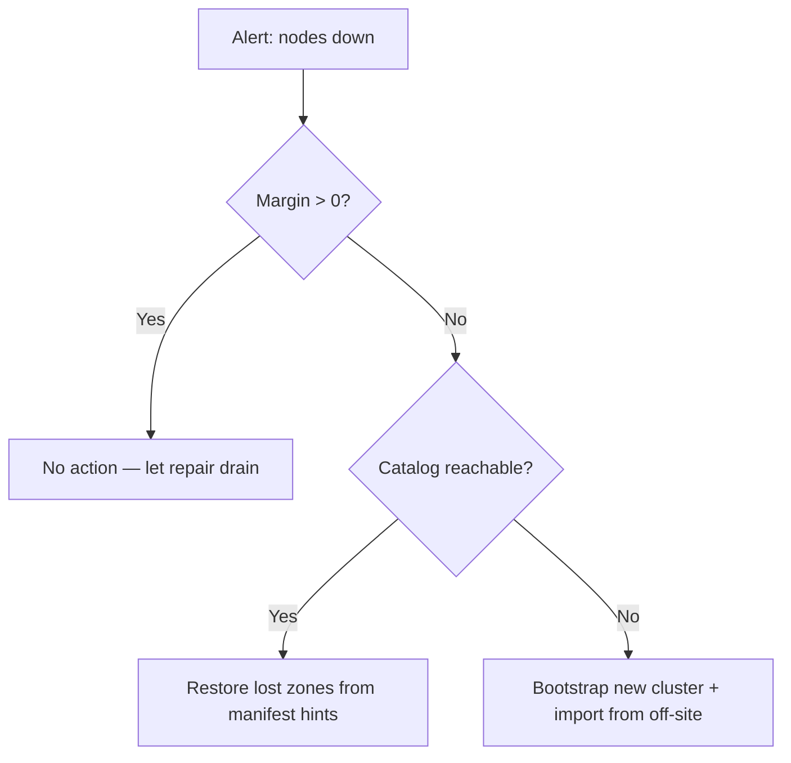

# Guide d'exploitation

Ce guide décrit comment **déployer**, **superviser**, **sauvegarder**,
**restaurer** et **planifier la capacité** d'un cluster holofs en
production.

## Sommaire

1. [Topologies de déploiement](#1-topologies-de-déploiement)
2. [Installation bare-metal](#2-installation-bare-metal)
3. [Docker / Compose](#3-docker--compose)
4. [Kubernetes via Helm](#4-kubernetes-via-helm)
5. [Référence de configuration](#5-référence-de-configuration)
6. [Supervision et alerting](#6-supervision-et-alerting)
7. [Planification de la capacité](#7-planification-de-la-capacité)
8. [Sauvegarde et restauration](#8-sauvegarde-et-restauration)
9. [Reprise après sinistre](#9-reprise-après-sinistre)
10. [Procédures Day-2](#10-procédures-day-2)

---

## 1. Topologies de déploiement

| Topologie        | Cas d'usage                                       | Avantages                       | Inconvénients                         |
|------------------|---------------------------------------------------|---------------------------------|---------------------------------------|
| Embarqué         | Dev, démo, évaluation mono-hôte                   | Un binaire, aucune orchestration | Aucune tolérance de pannes machine    |
| Multi-processus  | Hôte unique, frontières de processus isolées      | Redémarrage indépendant des nœuds | Toujours un point unique de défaillance (hôte) |
| Multi-hôte       | Production : 40 nœuds sur 5 zones × 8 hôtes       | Durabilité réelle, bascule de zone | Nécessite réseau, supervision, ops    |
| Kubernetes       | Cloud / on-prem avec k8s                          | Basé sur Helm, déclaratif        | Les stateful sets sont plus durs que le sans état |

**Cible de production recommandée :** ≥ 5 zones × ≥ 4 hôtes × 1–2
nœuds par hôte. Cela survit à **toute panne d'une zone complète** plus
des défaillances simultanées de nœuds uniques dans les zones restantes
(voir [theory.md §3](./theory.md#4-couches-de-priorité-et-dégradation-holographique)).

---

## 2. Installation bare-metal

### 2.1. Prérequis

- Linux (noyau ≥ 5.10), macOS ou Windows Server.
- 2 Go de RAM et 10 Go de disque par nœud au minimum ; 8 Go / 100 Go
  recommandés.
- Ports TCP ouverts : passerelle (`8787`) et ports de nœud (9100–9139
  par défaut).
- Un compte utilisateur (p. ex. `holofs`) avec accès en écriture au
  répertoire de données.

### 2.2. Compilation depuis les sources

```sh
# MSRV épinglée : 1.75
rustup install 1.75.0
cargo build --release --workspace
```

Binaires produits sous `target/release/` :

| Binaire          | Rôle                                            |
|------------------|-------------------------------------------------|
| `holofs`         | CLI principal multi-commande                    |
| `holofs-node`    | Démon de nœud unique                            |
| `holofs-web`     | Passerelle HTTP (axum + Leptos SSR)             |
| `holofs-admin`   | Opérations d'administration de cluster (liste blanche, ban) |
| `holofs-bench`   | Benchmarks                                      |
| `holofs-inspect` | Inspection de manifestes / shards               |
| `holofs-cluster` | Tout-en-un (N nœuds embarqués + passerelle)     |
| `holofs-fs`      | Helpers pour le système de fichiers local       |

### 2.3. Liste blanche (obligatoire en production)

```sh
# 1. Générer une paire de clés Ed25519 par nœud
holofs-admin keygen --out keys/

# 2. Construire la liste blanche
holofs-admin whitelist build \
    --node 10.0.1.10:9100 --pubkey keys/node1.pub --zone 0 \
    --node 10.0.1.11:9100 --pubkey keys/node2.pub --zone 1 \
    --node 10.0.2.10:9100 --pubkey keys/node3.pub --zone 2 \
    --admin-key keys/admin.priv \
    --out whitelist.holofs

# 3. Distribuer whitelist.holofs à chaque nœud + passerelle
```

Format filaire : `HOLOFSW1` (voir [api.md §3.4](./api.md#34-liste-blanche-holofsw1)).

### 2.4. TLS pour le protocole filaire (`--tls`, `--mtls`)

Le protocole binaire passerelle↔nœud peut être chiffré avec rustls.
Deux drapeaux opt-in contrôlent le comportement :

| Drapeau    | Effet |
|------------|-------|
| `--tls`    | Chiffre les trames filaires. Le certificat serveur est vérifié par le client. |
| `--mtls`   | Implique `--tls`. Le serveur exige et vérifie en plus un certificat client. |

**Mode embarqué (pas de `--whitelist`) :** le binaire génère au
démarrage une CA auto-signée + des certificats feuille. Utile pour le
dev, les démos, les clusters mono-hôte. La CA vit seulement en RAM et
est régénérée à chaque redémarrage — les clients qui mettent en cache
les certificats verront des émetteurs frais à chaque boot.

**Mode distribué (`--whitelist`) :** fournir des PEM pré-émis en ligne
de commande. Les générer avec `openssl` ou votre PKI existante :

```sh
# Émettez une CA + un certificat par hôte (script omis — utilisez votre PKI).
holofs-web \
  --whitelist cluster.wl \
  --admin-pubkey "$(holofs-admin pubkey admin.key)" \
  --tls --mtls \
  --tls-ca-cert /etc/holofs/ca.crt \
  --tls-cert   /etc/holofs/gateway.crt \
  --tls-key    /etc/holofs/gateway.key
```

La commande de nœud correspondante prend son propre feuille — voir
l'unité systemd au §2.5 pour la forme variable d'environnement.

Les fichiers de certificat doivent satisfaire :
- Les SAN du certificat feuille doivent couvrir chaque hôte `addr:port`
  auquel la passerelle se connectera (nom DNS ou littéral IP).
- Le certificat CA est la racine de confiance des deux côtés — même
  fichier sur chaque nœud et chaque passerelle.
- Sous `--mtls`, les deux côtés présentent le même genre de feuille
  signée par cette CA. Ajouter un certificat « passerelle » séparé si
  vous voulez des valeurs CN distinctes.

### 2.5. Service systemd

`/etc/systemd/system/holofs-node@.service` :

```ini
[Unit]
Description=holofs node %i
After=network.target

[Service]
Type=simple
User=holofs
Group=holofs
Environment=HOLOFS_DATA_DIR=/var/lib/holofs/node%i
Environment=HOLOFS_LISTEN=0.0.0.0:91%i
Environment=HOLOFS_WHITELIST=/etc/holofs/whitelist.holofs
Environment=HOLOFS_SECRET_KEY=/etc/holofs/keys/node%i.priv
# activer TLS sur le protocole filaire. Retirer les quatre lignes suivantes pour
# des clusters TCP en clair ; définir HOLOFS_MTLS=1 pour l'authentification mutuelle.
Environment=HOLOFS_TLS=1
Environment=HOLOFS_TLS_CA_CERT=/etc/holofs/ca.crt
Environment=HOLOFS_TLS_CERT=/etc/holofs/node%i.crt
Environment=HOLOFS_TLS_KEY=/etc/holofs/node%i.key
ExecStart=/usr/local/bin/holofs-node
Restart=on-failure
RestartSec=5s
LimitNOFILE=65536

[Install]
WantedBy=multi-user.target
```

Puis `systemctl enable --now holofs-node@00 holofs-node@01 …`.

---

## 3. Docker / Compose

### 3.1. Récupérer l'image

```sh
docker pull ghcr.io/holofs/holofs:0.1.0
```

Le Dockerfile est multi-étages : rust:1.75-slim → debian:bookworm-slim.
L'image d'exécution tourne en **uid 10001 non-root**, avec `tini`
comme PID 1.

### 3.2. Cluster mono-hôte (embarqué)

```sh
docker run -d \
  --name holofs \
  -p 8787:8787 \
  -v /srv/holofs:/var/lib/holofs \
  -e HOLOFS_N_NODES=40 \
  -e HOLOFS_DATA_DIR=/var/lib/holofs \
  ghcr.io/holofs/holofs:0.1.0 holofs-cluster
```

### 3.3. Multi-processus via Compose

```yaml
services:
  node-0: { ... environment: { HOLOFS_LISTEN: 0.0.0.0:9100, HOLOFS_ZONE: 0 } }
  node-1: { ... environment: { HOLOFS_LISTEN: 0.0.0.0:9101, HOLOFS_ZONE: 0 } }
  ...
  gateway:
    command: holofs-web
    environment:
      HOLOFS_NODES: node-0:9100,node-1:9101,...
      HOLOFS_WHITELIST: /etc/holofs/whitelist.holofs
    ports: ["8787:8787"]
    depends_on: [node-0, node-1, ...]
```

---

## 4. Kubernetes via Helm

Le chart Helm vit à `deploy/helm/holofs/`.

```sh
helm install holofs ./deploy/helm/holofs \
  --set nodeCount=40 \
  --set persistence.size=50Gi \
  --set ingress.enabled=true \
  --set ingress.hosts[0].host=holofs.example.com
```

**Ressources clés** (voir `deploy/helm/holofs/templates/`) :

- `StatefulSet` pour les nœuds — IDs réseau stables, PVC par réplica.
- `Service` (`ClusterIP`) pour la passerelle.
- `Ingress` (optionnel) pour HTTPS externe.

**Conscience des zones :** `values.yaml` expose `nodeAffinity` et
`topologySpreadConstraints`. Mappez votre étiquette de zone k8s (p. ex.
`topology.kubernetes.io/zone`) aux zones holofs via
`HOLOFS_ZONE_FROM_LABEL=topology.kubernetes.io/zone` (dérivé
automatiquement de `Downward API`).

**Sondes :**

```yaml
livenessProbe:  { httpGet: { path: /,        port: http }, periodSeconds: 30 }
readinessProbe: { httpGet: { path: /health,  port: http }, periodSeconds: 10 }
```

**Contexte de sécurité :** tourne en `uid 10001`,
`readOnlyRootFilesystem: true`, `capabilities.drop: [ALL]`.

---

## 5. Référence de configuration

Toute la configuration se fait via variables d'environnement (les
drapeaux CLI sont aussi acceptés ; les drapeaux gagnent).

### 5.1. Communes à tous les binaires

| Variable                    | Défaut       | Description                                  |
|-----------------------------|--------------|----------------------------------------------|
| `HOLOFS_STORAGE_DIR`        | `./holofs-data` | Racine du stockage pour shards, catalogue, manifestes |
| `HOLOFS_LOG`                | `info,holofs_web=debug` | Spécification de filtre `tracing` |
| `HOLOFS_LOG_FORMAT`         | `text`       | `text` \| `json` (production : `json`)        |
| `HOLOFS_TELEMETRY_OTLP`     | (off)        | Endpoint OTLP, p. ex. `http://otel:4317` (prévu) |
| `HOLOFS_METRICS_LISTEN`     | (non défini) | Adresse d'écoute Prometheus séparée optionnelle (défaut : sert sur le port principal) |

Chaque variable a un drapeau CLI correspondant (`--storage`, `--log`,
etc.) — exécutez `holofs-web --help` pour la liste complète. Les
drapeaux prévalent sur les variables d'environnement.

### 5.2. Spécifiques au nœud

| Variable                    | Défaut         | Description                              |
|-----------------------------|----------------|------------------------------------------|
| `HOLOFS_LISTEN`             | `0.0.0.0:9100` | Adresse de liaison du protocole filaire  |
| `HOLOFS_ZONE`               | `0`            | ID de zone (utilisé par le placement zone-aware) |
| `HOLOFS_SECRET_KEY`         | —              | Chemin vers le secret Ed25519 (32 octets) |
| `HOLOFS_WHITELIST`          | —              | Chemin vers la liste blanche signée      |
| `HOLOFS_MAX_DISK_GB`        | `unlimited`    | Refuser Put une fois dépassé             |

### 5.3. Spécifiques à la passerelle

| Variable                    | Défaut         | Description                              |
|-----------------------------|----------------|------------------------------------------|
| `HOLOFS_NODES`              | —              | CSV d'`addr:port` (bootstrap initial)    |
| `HOLOFS_MONITOR_INTERVAL`   | `15`           | Période de sondage santé (secondes)      |
| `HOLOFS_AUDIT_INTERVAL`     | `30`           | Période d'audit en arrière-plan (secondes) |
| `HOLOFS_REPAIR_INTERVAL`    | `60`           | Passe de réparation en arrière-plan      |
| `HOLOFS_TLS`                | (off)          | Chiffrer le protocole filaire (passerelle↔nœuds) avec rustls. Le mode embarqué génère automatiquement une CA auto-signée. |
| `HOLOFS_MTLS`               | (off)          | Implique `HOLOFS_TLS=1`. Le serveur exige et vérifie aussi un certificat client. |
| `HOLOFS_TLS_CERT`           | —              | Mode distribué : chemin PEM du certificat feuille |
| `HOLOFS_TLS_KEY`            | —              | Mode distribué : chemin PEM de la clé correspondante |
| `HOLOFS_TLS_CA_CERT`        | —              | Mode distribué : chemin PEM de la racine CA |
| `HOLOFS_PLACEMENT`          | `rendezvous`   | `roundrobin` \| `rendezvous` \| `rendezvous-zone` |

### 5.4. Cluster embarqué

| Variable                    | Défaut         | Description                              |
|-----------------------------|----------------|------------------------------------------|
| `HOLOFS_N_NODES`            | `40`           | Nombre de nœuds intra-processus          |
| `HOLOFS_EMBED_BASE_PORT`    | `9100`         | Port de base stable (éviter le churn éphémère) |
| `HOLOFS_ZONES`              | `5`            | Nombre de zones à assigner               |
| `HOLOFS_NO_SEED`            | `false`        | Sauter le seed de démo à deux PNG sur un catalogue vide. Mettre à `true` lors du réenvoi depuis une arborescence d'échantillons connue afin que le seed n'entre pas en collision avec vos données. |

### 5.5. Fiabilité

| Variable                    | Défaut  | Description                                              |
|-----------------------------|---------|----------------------------------------------------------|
| `HOLOFS_RPC_TIMEOUT_MS`     | `8000`  | Budget global par RPC (`tokio::time::timeout`). `0` désactive le plafond ; le timeout TCP au niveau OS (60-75 s) devient alors le seul arrêt. |
| `HOLOFS_SCRUB_INTERVAL`     | `600`   | Période de scrub de shards en arrière-plan (secondes). `0` désactive. Les scrubs parcourent le catalogue, diffent `list_node_hashes` vs `place_shard`, réparent les divergences avant que les utilisateurs ne les rencontrent. |
| `HOLOFS_VERSIONS_KEEP_LAST` | `0`     | Plafond d'historique de versions par nom. Écarte les plus anciens archives à chaque PUT. `0` = illimité (le `/api/versions/delete` manuel est alors le seul chemin pour récupérer les shards). Requiert `--enable-versions`. |
| `HOLOFS_POOL_PER_NODE`      | `8`     | Nombre max de connexions filaires inactives mises en pool par adresse de nœud. |
| `HOLOFS_POOL_IDLE_SECS`     | `60`    | Retirer les entrées en pool inactives depuis plus longtemps que cela à `acquire`. |
| `HOLOFS_POOL_DISABLE`       | `false` | Contourner le pool keepalive — chaque RPC compose une nouvelle connexion. Utile pour traquer des bugs de niveau filaire. |

### 5.5.c. Limite de débit par IP

Complète les plafonds de contre-pression globaux : les plafonds
empêchent le processus d'exploser sous n'importe quel burst — cette
couche empêche un seul client mal élevé d'affamer tous les autres
appelants. Les deux s'appliquent aux seaux MEDIUM (décodage / PUT /
ops de répertoire) et LONG (recherche / spotlight / GC) ; SHORT et les
endpoints de streaming restent illimités.

| Variable                        | Défaut    | Description                                              |
|---------------------------------|-----------|----------------------------------------------------------|
| `HOLOFS_RATE_LIMIT_RPS_PER_IP`  | `0`       | Taux de recharge du token bucket par IP client. Zéro désactive la couche entièrement. |
| `HOLOFS_RATE_LIMIT_BURST`       | `2 × rps` | Nombre max de tokens que retient un bucket. Sur bucket vide, la requête reçoit 429 avec `Retry-After: 1`. |
| `HOLOFS_RATE_LIMIT_IDLE_SECS`   | `300`     | Seuil d'éviction pour inactivité de la map par IP (mémoire bornée sous des populations de clients à fort churn). |

**Source de l'IP client.** Derrière un proxy inverse, le middleware
lit le premier hop de `X-Forwarded-For`. Les connexions directes
utilisent `ConnectInfo<SocketAddr>` de
`into_make_service_with_connect_info`. Ni l'un ni l'autre présent →
bucket `0.0.0.0` partagé afin que les hôtes bruyants n'obtiennent pas
un accès gratuit par connexion.

**Métrique.** `holofs_rate_limit_rejected_total` compte chaque réponse
429. Un taux non nul soutenu suggère soit un client abusif (à
investiguer) soit un plafond sous-provisionné (augmenter
`rate_limit_rps_per_ip`).

### 5.5.b. PUT en streaming

| Variable                    | Défaut    | Description                                              |
|-----------------------------|-----------|----------------------------------------------------------|
| `HOLOFS_UPLOAD_MAX_SIZE`    | `1 Gio`   | Plafond de corps par requête pour `PUT /*path`. Le corps streame directement vers `<storage>/uploads/upload-<pid>-<counter>.tmp` (RAM constante quelle que soit la vitesse du client / la taille du corps) et est relu dans un `Vec<u8>` juste avant `Gateway::ingest_bytes`. Les corps dépassant le plafond retournent 413 Payload Too Large ; le fichier temporaire est supprimé sur chaque chemin de sortie. |

Le streaming maintient le delta RSS de la passerelle borné par le
tampon de copie (~64 Kio) plutôt que par le taux d'upload du client —
un client lent sur un upload de 200 Mio ne bloque plus 200 Mio de
mémoire de passerelle pour la durée. Le RSS pique encore brièvement à
la taille du corps au moment de l'ingestion parce que le codec RLNC /
DWT attend `&[u8]` ; un ingest entièrement en streaming est hors
portée tant que le codec ne le supporte pas.

### 5.6. Couche de fiabilité

Chaque bouton ci-dessous a un défaut sûr ; la passerelle démarre avec
succès sans aucun d'eux défini.

| Variable                              | Défaut  | Description                                              |
|---------------------------------------|---------|----------------------------------------------------------|
| `HOLOFS_MEDIUM_CONCURRENCY`           | `64`    | Permis pour le seau MEDIUM (décodages, PUT, ops de répertoire). À saturation, le middleware du handler retourne 503 avec un corps diagnostique au lieu d'empiler des tâches axum. Ajuster contre `holofs_backpressure_permits_available{bucket="medium"}`. |
| `HOLOFS_LONG_CONCURRENCY`             | `8`     | Permis pour le seau LONG (recherche sémantique, spotlight, `/api/gc`, `/api/embed_all`, scans d'empreinte). |
| `HOLOFS_REPUTATION_PERSIST_INTERVAL`  | `30`    | Fréquence à laquelle l'état `Reputation` partagé est instantané vers `<storage>/reputation.bin`. Le bootstrap le recharge au démarrage suivant ; un mismatch `n_nodes` ou un fichier corrompu retombe silencieusement sur une table fraîche. Un instantané final est aussi écrit sur SIGTERM. |
| `HOLOFS_ADMIN_TOKEN`                  | _(non défini)_ | Quand défini, `POST /admin/node` et `POST /api/gc` exigent `Authorization: Bearer <token>`. Manquant/mauvais → 401. |
| `HOLOFS_ADMIN_UNAUTHENTICATED`        | _(non défini)_ | Dépassement dev : mettre à `1` pour laisser la surface admin ouverte quand `HOLOFS_ADMIN_TOKEN` est non défini. Journalise un WARN au démarrage. Si aucune des deux variables n'est définie, la surface admin est désactivée (403). |

Les timeouts sont codés en dur par seau par conception (SHORT 10 s,
MEDIUM 60 s, LONG 300 s) ; les endpoints de streaming (SSE,
multipart/x-mixed-replace) + `/mcp` ne sont intentionnellement pas
budgétés. Les handlers écoulés remontent en `504 Gateway Timeout` et
incrémentent `holofs_handler_timeouts_total{bucket=…}`.

### 5.7. Fonctionnalités optionnelles

| Variable                    | Défaut  | Description                                              |
|-----------------------------|---------|----------------------------------------------------------|
| `HOLOFS_ENABLE_VERSIONS`    | `false` | Miroir de `--enable-versions`. Archive chaque remplacement par PUT comme un fichier annexe sous `<storage>/versions/<sanitized>/v…bin`. |
| `HOLOFS_ENABLE_EMBED`       | `false` | Miroir de `--enable-embed`. Charge le modèle CLIP-multilingual au premier PUT ou au premier `/api/search`, puis maintient `embeddings.bin`. |
| `HOLOFS_MCP_TOKEN`          | —       | Quand défini, l'endpoint `/mcp` exige `Authorization: Bearer <token>` ET active les outils d'écriture. Sans la variable, l'endpoint reste ouvert + en lecture seule. |

### 5.8. Fichier de configuration TOML

Chaque variable d'environnement ci-dessus (`HOLOFS_*` et
`LEPTOS_SITE_ADDR`) est aussi réglable à travers un unique fichier de
configuration TOML passé via `--config /path/to/holofs.toml` ou la
variable d'environnement `HOLOFS_CONFIG`. Une configuration de
référence commentée vit à
[`deploy/holofs.example.toml`](../../deploy/holofs.example.toml).

Échelle de priorité (le plus haut gagne) :

1. Drapeau CLI (`--medium-concurrency 128`)
2. Variable d'environnement (`HOLOFS_MEDIUM_CONCURRENCY=128`)
3. Valeur du fichier TOML (`[reliability] medium_concurrency = 128`)
4. Défaut à la compilation

**Exemple** :

```toml
[server]
addr = "0.0.0.0:8787"
storage = "/var/lib/holofs"
log_format = "json"

[tls]
enabled = true
mtls = true
cert = "/etc/holofs/node.crt"
key = "/etc/holofs/node.key"
ca_cert = "/etc/holofs/ca.crt"

[reliability]
medium_concurrency = 128
long_concurrency = 16
scrub_interval_secs = 300

[admin]
# Jeton inline OU référence un fichier (recommandé pour les secrets).
token_file = "/etc/holofs/admin.token"
```

**Secrets.** `[admin] token` et `[mcp] token` acceptent soit une chaîne
inline soit un chemin `token_file` pointant sur un fichier dont la
première ligne non vide est le jeton. Pour la production, préférer
`token_file` avec mode `0400` et propriété root de sorte que le jeton
ne soit pas visible dans l'historique git du fichier de config /
chart Helm embarqué.

**Champs inconnus**. TOML utilise `deny_unknown_fields` au moment du
parsing — une faute de frappe dans `medium_concurency` (absence du 'r')
échoue bruyamment au démarrage avec le nom exact de clé dans l'erreur.
C'est intentionnel ; un repli silencieux détruirait le but du fichier.

### 5.9. Chiffrement des shards au repos

Activer avec `HOLOFS_AT_REST_ENC=1` (ou `[security]
at_rest_encryption = true` dans le TOML). Quand activé, chaque fichier
shard écrit sur disque est scellé avec AES-256-GCM. L'en-tête reste
en clair (afin que `Store::open` puisse toujours indexer sans la clé),
mais les coefficients + la charge utile de chunk encodée sont du
chiffré.

**Gestion des clés.** La clé AES 32 octets est dérivée au démarrage
depuis le seed d'identité du nœud via HKDF-SHA256
(`salt = "holofs-shard-salt-v1"`, `info = "holofs-shard-key-v1"`).
Pas de nouveau secret à faire tourner — perdre `identity.key` perd
déjà l'identité du nœud. La clé reste en RAM pour la durée de vie du
processus ; root sur un nœud en cours d'exécution peut lire du texte
en clair via un chemin d'audit légitime.

**Format filaire.** Deux magies de shard cohabitent :

| Magie       | Signification                                                |
|-------------|--------------------------------------------------------------|
| `HOLOFSS1`  | En clair. Lu par chaque version.                             |
| `HOLOFSS2`  | Scellé. `[8 o magie][18 o en-tête][12 o nonce][ct+tag]`.     |

L'en-tête de 18 octets est AAD pour le tag GCM, de sorte que toute
réécriture d'en-tête a posteriori (object_id, channel, layer,
longueurs) invalide le shard au déchiffrement. Les lectures reniflent
les 8 premiers octets et dispatchent — les répertoires mixtes v1 + v2
sont supportés de sorte qu'activer sur un store existant ne scelle que
les *nouvelles* écritures. Une passe complète de re-chiffrement est
hors portée ; la migration recommandée est de spawn un nouveau nœud
avec une nouvelle identité et laisser la passe de réparation
automatique rééquilibrer les shards sur lui.

**Modèle de menace.** Dans la portée : un adversaire prend un
instantané des fichiers de shard depuis un nœud éteint (fuite de
sauvegarde, disque décommissionné, reconstruction RAID a laissé
l'ancien disque lisible). Hors portée : root sur un nœud en cours
d'exécution — une fois que la clé dérivée est en RAM,
`read_shard_file` produit du texte en clair pour les audits légitimes.

---

## 6. Supervision et alerting

### 6.1. Endpoint de métriques

La passerelle expose `GET /metrics` au format d'exposition texte
Prometheus (`text/plain; version=0.0.4`). Gauges basés sur le pull
sourcés de `Gateway::api_stats` + instantané admin-kill plus des
compteurs de fiabilité.

| Métrique                                     | Type    | Étiquettes                   | Signification |
|----------------------------------------------|---------|------------------------------|---------------|
| `holofs_nodes_total`                         | gauge   | —                            | nœuds dans la topologie |
| `holofs_nodes_live`                          | gauge   | —                            | nœuds non admin-désactivés |
| `holofs_objects_total`                       | gauge   | `kind` (image/audio/text/opaque/directory) | taille du catalogue par type |
| `holofs_shards_total`                        | gauge   | —                            | shards planifiés à travers le catalogue |
| `holofs_shards_unique`                       | gauge   | —                            | hachages de shards distincts |
| `holofs_dedup_savings_pct`                   | gauge   | —                            | `(1 − unique/total) × 100` |
| `holofs_bytes_total`                         | gauge   | —                            | octets stockés approximatifs |
| `holofs_node_admin_killed`                   | gauge   | `node`, `addr`, `zone`       | drapeau admin-kill par nœud |
| `holofs_auto_repairs_total`                  | counter | —                            | GETs qui ont déclenché le bras de retry de `decode_with_autorepair` |
| `holofs_auto_repair_failures_total`          | counter | —                            | passes de réparation auto qui ont elles-mêmes échoué |
| `holofs_scrub_runs_total`                    | counter | —                            | ticks de scrub d'arrière-plan complétés (`HOLOFS_SCRUB_INTERVAL`) |
| `holofs_scrub_repairs_total`                 | counter | —                            | objets que le scrub a réparés *avant* qu'un utilisateur ne les rencontre |
| `holofs_catalog_persist_failures_total`      | counter | —                            | Erreurs d'écriture atomique du catalogue sur disque. Non nul = l'état sur disque est en retard sur la mémoire ; le prochain redémarrage perd des écritures. Alerter immédiatement. |
| `holofs_handler_timeouts_total`              | counter | `bucket` (short/medium/long) | Réponses 504 causées par la deadline par seau. |
| `holofs_backpressure_rejected_total`         | counter | `bucket` (medium/long)       | Réponses 503 causées par le sémaphore à capacité. |
| `holofs_backpressure_permits_available`      | gauge   | `bucket` (medium/long)       | Permis encore libres. Constamment à 0 = seau sous-provisionné ; constamment au max = inactif. |
| `holofs_supervised_task_restarts_total`      | counter | `task` (monitor/auditor/scrub) | Paniques + sorties inattendues des boucles supervisées. Tout non-zéro signale un crash répété que l'opérateur doit investiguer. |
| `holofs_admin_auth_failures_total`           | counter | `outcome` (missing/bad/disabled) | Rejets de jeton bearer admin ventilés par raison. `disabled` = surface refusée parce que ni `HOLOFS_ADMIN_TOKEN` ni `HOLOFS_ADMIN_UNAUTHENTICATED` n'est défini. |

Un cluster sain garde les compteurs d'auto-guérison à zéro ou proche
de zéro ; un taux non nul soutenu sur `auto_repair_failures_total`
est le signal d'alerte opérateur que le placement / la perte disque
est allé au-delà de ce que le seuil K peut absorber.

Les compteurs de fiabilité (échecs de persistance, timeouts de
handler, rejets de contre-pression, redémarrages supervisés, échecs
d'auth admin) forment ensemble le « tableau d'alertes de fiabilité »
— chacun d'eux devrait être plat à zéro sur un cluster bien
provisionné avec un jeton configuré. Voir les règles d'alerte de
référence ci-dessous.

Les futures releases ajouteront des histogrammes pour le RTT filaire,
la latence de décodage et la réputation par objet (actuellement
uniquement journalisée via `tracing`).

### 6.2. Règles d'alerte de référence

```yaml
groups:
- name: holofs
  rules:
  - alert: HolofsNodeDown
    expr: holofs_node_up == 0
    for: 5m
    annotations:
      summary: "holofs node {{ $labels.node }} is down"

  - alert: HolofsZoneDegraded
    expr: count by (zone) (holofs_node_up == 0) >= 2
    for: 10m
    annotations:
      summary: "zone {{ $labels.zone }} has ≥2 dead nodes (margin loss)"

  - alert: HolofsDiskFillingFast
    expr: predict_linear(holofs_bytes_stored_total[1h], 24*3600) > node_filesystem_size_bytes
    for: 30m
    annotations:
      summary: "node {{ $labels.node }} will fill within 24h"

  - alert: HolofsRepairFailing
    expr: rate(holofs_repair_jobs_total{result="failed"}[15m]) > 0.1
    for: 30m

  - alert: HolofsLowReputation
    expr: holofs_node_reputation < 0.5
    for: 1h
    annotations:
      summary: "node {{ $labels.node }} reputation collapsed (audit mismatches)"

  # Alertes de fiabilité série N.

  - alert: HolofsCatalogPersistFailing
    expr: rate(holofs_catalog_persist_failures_total[10m]) > 0
    for: 5m
    annotations:
      summary: "gateway is failing to persist the catalog to disk"
      description: |
        holofs_catalog_persist_failures_total is climbing.
        Every increment = one 500 on a PUT/mkdir/rmdir/rename and one
        write that in-memory succeeded but on-disk didn't. Next
        restart will drop those changes. Check disk space + FS mount
        options on the gateway host.

  - alert: HolofsHandlerTimeouts
    expr: rate(holofs_handler_timeouts_total[15m]) > 0.05
    for: 15m
    annotations:
      summary: "handler bucket {{ $labels.bucket }} exceeding deadline"
      description: |
        More than one 504 every ~20 seconds. Slow cluster, slow disk,
        or the deadline is too tight for the traffic pattern.

  - alert: HolofsBackpressureSaturated
    expr: holofs_backpressure_permits_available == 0
    for: 5m
    annotations:
      summary: "bucket {{ $labels.bucket }} has zero permits available"
      description: |
        The MEDIUM/LONG semaphore is at 0 for 5 minutes straight.
        Either the cluster is genuinely overloaded (scale up nodes)
        or the cap is too low for the workload — bump the matching
        HOLOFS_*_CONCURRENCY env var.

  - alert: HolofsSupervisedTaskRestarting
    expr: rate(holofs_supervised_task_restarts_total[30m]) > 0
    for: 15m
    annotations:
      summary: "{{ $labels.task }} is crashing repeatedly"
      description: |
        The supervised background loop is panicking + being restarted
        by supervised_spawn. Read the gateway logs for the panic
        payload and file a bug.

  - alert: HolofsAdminAuthAttempts
    expr: rate(holofs_admin_auth_failures_total{outcome=~"missing|bad"}[10m]) > 0.1
    for: 10m
    annotations:
      summary: "admin surface seeing sustained 401s (possible probe)"
      description: |
        Someone is hitting /admin/node or /api/gc without a valid
        bearer. Missing = no Authorization header at all; bad = wrong
        token. If unexpected, treat as a probe.
```

### 6.3. Tracing

Quand `HOLOFS_TELEMETRY_OTLP` est défini, la passerelle exporte les
spans OTLP/HTTP :

| Nom de span            | Attributs utiles                            |
|------------------------|---------------------------------------------|
| `gateway.put`          | `object.kind`, `bytes.in`, `shards.out`     |
| `gateway.get`          | `object.kind`, `layers`, `bytes.out`, `nodes_contacted` |
| `gateway.repair`       | `object_id`, `channel`, `layer`, `shards_recovered` |
| `wire.send`            | `op`, `target.node`, `bytes`                |

### 6.4. Tableaux de bord

Un tableau de bord Grafana JSON de référence est livré à
`deploy/grafana/holofs.json`. Panneaux du haut : débit d'ingestion,
P99 de décodage par type, % de dedup, débit de réparation, heatmap de
disponibilité de nœuds par zone.

---

## 7. Planification de la capacité

### 7.1. Surcoût de stockage

Le coût de stockage est dominé par la redondance RLNC à travers les
couches de priorité. Pour un objet de charge utile de taille `S` :

$$
\text{octets stockés} \approx S \cdot \sum_{\ell} R_\ell \cdot \frac{N_\ell}{K_\ell}
$$

Pour les ratios de couche par défaut `R = [4.0, 2.5, 1.6, 1.15]`, le
surcoût moyen est d'environ **9,25×** (en comptant les métadonnées,
~9,4×).

| Taille d'objet | Stocké sur le cluster | Par nœud (40 nœuds) |
|----------------|-----------------------|---------------------|
| 1 Mo           | ~9,4 Mo               | ~235 Ko             |
| 1 Go           | ~9,4 Go               | ~235 Mo             |
| 1 To           | ~9,4 To               | ~235 Go             |

**Ajuster pour un stockage moins cher :** baisser `R_0` (redondance de
perte catastrophique) à `2.0` et `R_1..3` à `[1.5, 1.2, 1.05]` — le
surcoût tombe à ~5,75×. Voir
[theory.md §3](./theory.md#4-couches-de-priorité-et-dégradation-holographique)
pour le compromis marge de survie.

### 7.2. Planification CPU

| Opération              | Coût (relatif au memcpy)  | Goulot        |
|------------------------|---------------------------|---------------|
| Multiplication GF(2⁸)  | 4× memcpy (LUT)           | Cache L1      |
| Haar 2D avant          | 3× memcpy                 | Bande passante RAM |
| Encodage RLNC K=16, payload 1024 B | 60× memcpy    | CPU           |
| SHA-256 sur 1 Mo       | 2× memcpy (avec SIMD)     | CPU           |

Un cœur x86_64 moderne soutient ~150 Mo/s d'encodage RLNC pour K=16.
Le multi-cœur passe linéairement jusqu'à ce que l'IO disque devienne
le goulot (~500 Mo/s sur NVMe).

### 7.3. Planification réseau

Bande passante filaire du pire cas par Put :

```
egress = payload × facteur_redondance × nombre_couches
       ≈ payload × 9.25
```

Pour un upload de 100 Mo, la passerelle émet ~925 Mo vers le pool de
nœuds. Prévoir **au moins 1 Gbit/s** entre la passerelle et les
nœuds.

### 7.4. Dimensionnement correct du cluster

| Propriété                 | Choisir par                                |
|---------------------------|--------------------------------------------|
| `N_nodes`                 | ≥ 4 × `K` pour que RLNC ait du jeu de placement |
| `N_zones`                 | ≥ 3 ; 5 recommandé pour perte de zone unique |
| `K`                       | 16 (défaut) — point idéal CPU vs marge     |
| `redundancy_per_layer`    | correspondre à la marge de survie ≥ 5σ désirée |

---

## 8. Sauvegarde et restauration

### 8.1. Ce qui vit sur disque

Par nœud (`HOLOFS_DATA_DIR`) :

```
manifests/         manifestes par objet (HOLOFSM6)
catalog/HOLOFSD1   l'index de répertoire (écriture atomique)
shards/aa/bb……    fichiers .shard, adressés par contenu
identity/secret    clé privée Ed25519
whitelist.holofs   liste de pairs signée par admin
```

### 8.2. Modèle de sauvegarde

**holofs est sa propre sauvegarde** pour tout objet *unique* — perdre
un nœud déclenche la réparation RLNC depuis les frères. La sauvegarde
importe pour :

1. **Perte catastrophique du cluster** (p. ex. toutes les zones hors ligne).
2. **Corruption logique / suppression accidentelle** (`Purge` est irréversible).
3. **Matériel d'identité** (clés Ed25519 + liste blanche signée) — sans
   ceux-ci, les remplacements ne peuvent rejoindre un cluster de confiance.

### 8.3. Plan de sauvegarde recommandé

| Données              | Fréquence         | Outillage                 | Où                   |
|----------------------|-------------------|---------------------------|----------------------|
| Identité + liste blanche | À chaque changement | `restic`, `aws s3 sync` | Hors site chiffré    |
| Instantané du catalogue | Toutes les heures | `cp catalog/HOLOFSD1 → …` | S3 / NFS / bande     |
| Répertoire de shards | Optionnel         | `restic` ou snapshots zfs | Stockage froid       |

Un `holofs-admin export <name>` périodique reconstruit un objet en un
unique fichier canonique et l'écrit dans un bucket externe. C'est la
manière recommandée de sauvegarder **des objets spécifiques à haute
valeur**.

### 8.4. Procédures de restauration

| Scénario                              | Procédure |
|---------------------------------------|-----------|
| Perte d'un disque de nœud             | Effacer le disque ; redémarrer le nœud ; le cluster répare automatiquement les shards. |
| Plusieurs nœuds perdus, < marge       | Aucune action nécessaire — le décodage RLNC le tolère. |
| Catalogue corrompu sur la passerelle  | Copier `catalog/HOLOFSD1` depuis une passerelle pair ou la dernière sauvegarde horaire ; redémarrer. |
| Cluster entier perdu                  | Provisionner un nouveau cluster ; `holofs-admin import` chaque export hors site. |
| Compromission de clé de liste blanche | Générer une nouvelle clé admin ; re-signer la liste blanche ; hot-reload (voir [§10.4](#104-hot-reload-de-la-liste-blanche)). |

---

## 9. Reprise après sinistre

### 9.1. Cibles RTO / RPO

| Défaillance                        | RTO       | RPO      | Déclencheur                          |
|------------------------------------|-----------|----------|--------------------------------------|
| Nœud unique                        | < 1 min   | 0        | Auto (monitor + réparation)          |
| Zone unique (≤ ⅕ des nœuds)        | < 5 min   | 0        | Auto (marge encore positive)         |
| Deux zones simultanément           | < 1 h     | Heures   | Manuel : re-provisionner + import    |
| Cluster entier                     | < 8 h     | ≤ 1 h    | Manuel : restauration complète depuis sauvegardes S3 |

### 9.2. Arbre de décision



### 9.3. Exercices

À exécuter trimestriellement. Scénarios suggérés :

1. **Exercice de kill de zone** — `kubectl drain` tous les pods dans
   une étiquette de zone ; vérifier qu'aucun objet ne devient
   inatteignable et que la réparation complète en < 10 min.
2. **Exercice de restauration à froid** — depuis un cluster k8s frais,
   exécuter `holofs-admin import-all` contre un bucket de sauvegarde ;
   mesurer le RTO.
3. **Exercice de rotation de clé** — signer une nouvelle liste blanche
   avec la clé admin, hot-reload sans indisponibilité.

---

## 10. Procédures Day-2

### 10.1. Ajouter un nœud

```sh
# 1. Générer une nouvelle clé de nœud
holofs-admin keygen --out keys/node41.priv

# 2. Re-signer la liste blanche avec la nouvelle entrée
holofs-admin whitelist add \
  --whitelist whitelist.holofs \
  --node 10.0.3.10:9100 --pubkey keys/node41.pub --zone 4 \
  --admin-key keys/admin.priv \
  --out whitelist.holofs.new

# 3. Distribuer, hot-reload, puis démarrer le nœud
```

Le catalogue est inchangé ; les futurs placements peuvent piocher le
nouveau nœud via HRW. Les objets existants ne sont **pas** rééquilibrés
automatiquement — exécuter `holofs-admin rebalance` pour migrer les
shards (optionnel ; non nécessaire pour la justesse).

### 10.2. Retirer (décommissionner) un nœud

```sh
# 1. Draîner — refuser les nouveaux Puts, terminer les en vol
holofs-admin node drain 10.0.1.10:9100

# 2. Attendre que la réparation redistribue ses shards
holofs-admin node status 10.0.1.10:9100
# → "drained, 0 shards remaining"

# 3. Retirer de la liste blanche
holofs-admin whitelist remove --node 10.0.1.10:9100 …

# 4. Arrêter l'unité systemd
systemctl stop holofs-node@10
```

### 10.3. Remplacer un disque défaillant

1. `systemctl stop holofs-node@N`
2. Remplacer le disque, monter un système de fichiers frais à
   `HOLOFS_DATA_DIR`.
3. Restaurer les fichiers d'identité (`identity/secret`,
   `whitelist.holofs`) depuis la sauvegarde hors site — ceux-ci sont
   liés à l'adresse du nœud, non au disque.
4. `systemctl start holofs-node@N` — le cluster remplira le disque via
   la réparation pilotée par audit en minutes à heures selon la taille.

### 10.4. Hot-reload de la liste blanche

```sh
# Déposer le nouveau fichier de liste blanche à sa place
cp whitelist.holofs.new /etc/holofs/whitelist.holofs

# Signaler tous les démons
killall -SIGHUP holofs-node holofs-web
```

Les démons re-vérifient la signature admin avant d'échanger la
nouvelle liste. Une mauvaise signature est journalisée et l'ancienne
liste est conservée.

### 10.5. Mise à jour progressive

Holofs garantit la compatibilité du protocole filaire dans une
version mineure (`0.x → 0.x+1` est sûr). Pour k8s :

```sh
helm upgrade holofs ./deploy/helm/holofs --set image.tag=0.2.0
```

Le StatefulSet roule un pod à la fois, attend la readiness, puis
avance. Pendant le déploiement, le cluster opère dégradé d'exactement
un nœud — bien à l'intérieur de la marge pour tout dimensionnement
par défaut.

### 10.6. Aide-mémoire des commandes de santé

```sh
# Vue d'ensemble du cluster
curl -s http://gw:8787/api/stats | jq

# Santé par nœud (HTML dans le navigateur ; JSON via l'en-tête accept)
curl -s -H "accept: application/json" http://gw:8787/health

# Marge par (canal, couche) pour un objet
curl -s http://gw:8787/health/photo.png

# Inspecter la distribution des shards
curl -s http://gw:8787/inspect/photo.png
```

Voir [api.md](./api.md) pour l'inventaire complet des routes.
