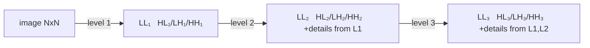
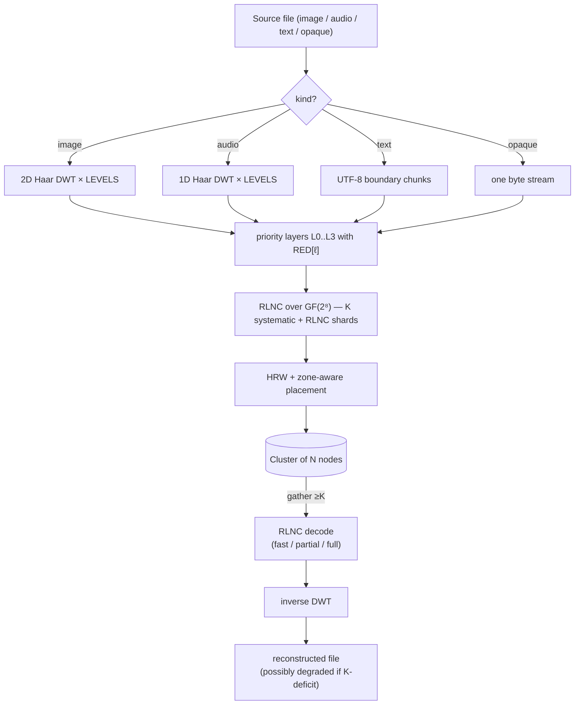

# Théorie

Fondements mathématiques de holofs. Chaque section comporte des définitions
formelles, les formules pertinentes, l'intuition, et des références à la littérature.

> Notation mathématique : GitHub rend `$…$` et `$$…$$` via KaTeX. Les diagrammes sont
> des blocs Mermaid (également natifs sur GitHub).

## Sommaire

1. [Corps de Galois GF(2⁸)](#1-galois-field-gf28)
2. [Random Linear Network Coding (RLNC)](#2-random-linear-network-coding-rlnc)
3. [Transformée en ondelettes discrète de Haar](#3-haar-discrete-wavelet-transform)
4. [Couches de priorité et dégradation holographique](#4-priority-layers-and-holographic-degradation)
5. [Hachage Highest Random Weight (rendezvous)](#5-highest-random-weight-rendezvous-hashing)
6. [Placement zone-aware](#6-zone-aware-placement)
7. [Adressage par contenu et arbres de Merkle](#7-content-addressing-and-merkle-trees)
8. [Partage de secret Shamir ↔ RLNC](#8-shamir-secret-sharing--rlnc)
9. [Bottom-K MinHash](#9-bottom-k-minhash)
10. [Hachage perceptuel sur la DWT-LL](#10-perceptual-hashing-on-dwt-ll)
11. [Codes de réparation / régénération](#11-repair--regenerating-codes)

---

## 1. Galois field GF(2⁸)

Nous traitons chaque octet comme un élément du corps fini

$$
\mathrm{GF}(2^8) \;=\; \mathrm{GF}(2)[x] \;/\; \langle\, x^8 + x^4 + x^3 + x^2 + 1 \rangle,
$$

c'est-à-dire les polynômes sur $\mathbb{F}_2$ de degré $< 8$, réduits modulo le
polynôme de Rijndael / AES $p(x) = \texttt{0x11d}$. L'addition est le XOR bit à bit :

$$
a \oplus b = (a_7 \oplus b_7,\, a_6 \oplus b_6,\, \dots,\, a_0 \oplus b_0).
$$

La multiplication est la multiplication polynomiale modulo $p(x)$. Nous l'implémentons via
des tables de log discret relatives au générateur $\alpha = \texttt{0x02}$ :

$$
a \cdot b \;=\; \alpha^{\log_\alpha a + \log_\alpha b} \quad \text{pour } a, b \neq 0,
$$

$$
a^{-1} \;=\; \alpha^{255 - \log_\alpha a}.
$$

Chaque multiplication équivaut à deux lookups de table + une addition. La table `exp` est
dupliquée jusqu'à une longueur de 512 afin que `log[a] + log[b]` ne déborde jamais, éliminant
le modulo sur le chemin chaud.

**Pourquoi GF(2⁸).** Il tient dans un octet, possède 255 éléments non nuls (largement assez de
coefficients distincts pour RLNC), et les lookups de table 8 bits sont cache-friendly.
GF(2¹⁶) donne une probabilité de dépendance linéaire plus faible mais double la mémoire.

**Implémentation.** [`holofs-core::gf`](../crates/holofs-core/src/gf.rs).

**Références.**

- Lin & Costello, *Error Control Coding* (2nd ed., 2004), §2.6.
- Joan Daemen & Vincent Rijmen, *The Design of Rijndael* (2002).

---

## 2. Random Linear Network Coding (RLNC)

Une couche de données est divisée en $K$ symboles $s_0, s_1, \ldots, s_{K-1}$ (chaque
symbole est un vecteur d'octets de longueur `sym_len`). Un *shard* est une paire
$(\mathbf{c}, \mathbf{p})$ où le vecteur de coefficients
$\mathbf{c} = (c_0, \ldots, c_{K-1}) \in \mathrm{GF}(2^8)^K$ et le payload est

$$
\mathbf{p} \;=\; \bigoplus_{i=0}^{K-1} c_i \cdot s_i.
$$

Le XOR / la multiplication se font octet par octet sur $\mathrm{GF}(2^8)$.

### Décodage

Étant donnés $K$ shards $\{(\mathbf{c}^{(j)}, \mathbf{p}^{(j)})\}_{j=0}^{K-1}$ nous
avons le système linéaire

$$
\underbrace{\begin{pmatrix} \mathbf{c}^{(0)} \\ \mathbf{c}^{(1)} \\ \vdots \\ \mathbf{c}^{(K-1)} \end{pmatrix}}_{C}
\;
\underbrace{\begin{pmatrix} s_0 \\ s_1 \\ \vdots \\ s_{K-1} \end{pmatrix}}_{S}
\;=\;
\underbrace{\begin{pmatrix} \mathbf{p}^{(0)} \\ \mathbf{p}^{(1)} \\ \vdots \\ \mathbf{p}^{(K-1)} \end{pmatrix}}_{P}
$$

Si $C$ est inversible, on récupère $S = C^{-1} P$ par élimination de Gauss-Jordan
en $O(K^3)$ opérations dans le corps + $O(K^2 \cdot \texttt{sym\_len})$ pour la substitution arrière.

### Probabilité d'indépendance linéaire

Avec $n$ shards aléatoires tirés uniformément dans $\mathrm{GF}(2^8)^K$, la
probabilité que $K$ quelconques *ne soient pas* linéairement indépendants (échec de décodage) est
bornée par

$$
P(\text{dependent}) \;\leq\; \frac{K}{2^8 - 1} \;\approx\; \frac{K}{255}.
$$

Pour notre $K = 16$ cela donne ≈ 6,3 %, facilement compensé en envoyant
$n > K$ shards.

### Shards systématiques

Dans holofs, les premiers $\min(n, K)$ shards sont déterministiquement
**systématiques** : $\mathbf{c}^{(i)} = \mathbf{e}_i$ (base standard), de sorte que le
payload est littéralement le symbole brut $s_i$. Cela apporte deux énormes gains :

1. **Chemin rapide.** Lorsque tous les $K$ shards systématiques sont disponibles, le décodage est
   un memcpy : $\hat S = (\mathbf{p}^{(0)} \,|\, \mathbf{p}^{(1)} \,|\, \cdots)$.
   Pas d'élimination de Gauss, pas de multiplications GF.

2. **Récupération partielle.** Lorsque certains shards systématiques sont manquants, le
   problème se réduit à résoudre un plus petit système $r \times r$ (où $r$ est
   le nombre d'inconnues) — bien moins coûteux que le $K \times K$ complet.

Les $n - K$ shards restants sont du RLNC pur : coefficients aléatoires, utilisés comme
« assurance » pour les cas où les shards systématiques meurent.

**Implémentation.** [`holofs-core::rlnc`](../crates/holofs-core/src/rlnc.rs).

**Références.**

- Rudolf Ahlswede, Ning Cai, Shuo-Yen R. Li, Raymond W. Yeung,
  ["Network Information Flow"](https://doi.org/10.1109/18.850663),
  IEEE Trans. Inf. Theory, 2000.
- Tracey Ho et al., ["A Random Linear Network Coding Approach to
  Multicast"](https://doi.org/10.1109/TIT.2006.881746),
  IEEE Trans. Inf. Theory, 2006.
- Christina Fragouli, Jean-Yves Le Boudec, Jörg Widmer,
  ["Network coding: an instant primer"](https://doi.org/10.1145/1198255.1198262),
  SIGCOMM CCR, 2006.

---

## 3. Haar Discrete Wavelet Transform

### Étape Haar 1D

Étant donné un signal de longueur $2n$ $(x_0, x_1, \ldots, x_{2n-1})$, l'étape Haar
produit des coefficients d'*approximation* $\mathbf{a}$ et de *détail* $\mathbf{d}$ :

$$
a_k \;=\; \frac{x_{2k} + x_{2k+1}}{\sqrt{2}}, \qquad
d_k \;=\; \frac{x_{2k} - x_{2k+1}}{\sqrt{2}}.
$$

$\mathbf{a}$ capture le contenu basse fréquence (moyenne), $\mathbf{d}$ le
contenu haute fréquence (différence). La normalisation $1/\sqrt{2}$ rend
la transformation orthonormée — l'énergie est préservée :

$$
\sum_i x_i^2 \;=\; \sum_k a_k^2 + \sum_k d_k^2.
$$

### Pyramide multi-niveau

Appliquer l'étape Haar récursivement à $\mathbf{a}$ seul donne une pyramide
multi-résolution. Après $L$ niveaux, le signal est décomposé en
$L+1$ bandes : une bande LL grossière (taille $2n / 2^L$) et $L$ bandes de détail de
résolution décroissante.

### Haar 2D (produit tensoriel)

Pour les images, nous appliquons le Haar 1D à toutes les lignes puis à toutes les colonnes. Un niveau
produit quatre sous-bandes :

| Sous-bande | Capture                               |
|------------|---------------------------------------|
| **LL**     | basse fréquence (structure grossière) |
| **LH**     | détail horizontal (arêtes verticales) |
| **HL**     | détail vertical (arêtes horizontales) |
| **HH**     | détail diagonal (coins, texture)      |

Récurser dans LL seul donne la pyramide d'ondelettes standard :

### Inverse

Haar est exactement inversible : $x_{2k} = (a_k + d_k)/\sqrt{2}$,
$x_{2k+1} = (a_k - d_k)/\sqrt{2}$. On peut récupérer le signal d'origine
depuis l'ensemble complet des coefficients $\{a, d\}$.

### Pourquoi Haar spécifiquement

- L'ondelette orthogonale la plus simple — l'implémentation fait ~30 lignes.
- Phase linéaire (pas de décalage spatial).
- Pour les démos de dégradation par priorité, des ondelettes plus tranchantes (Daubechies-4,
  CDF 9/7) donneraient un meilleur PSNR par bit mais le même comportement qualitatif.
  Nous restons simples pour garder les mathématiques accessibles.

**Implémentation.** [`holofs-core::transform`](../crates/holofs-core/src/transform.rs).

**Références.**

- Stéphane Mallat, *A Wavelet Tour of Signal Processing*
  (3rd ed., Academic Press, 2008) — §7 (bases d'ondelettes orthonormées).
- Alfréd Haar, "Zur Theorie der orthogonalen Funktionensysteme",
  *Mathematische Annalen*, 1910 (l'article original).

---

## 4. Priority layers and holographic degradation

Les sous-bandes DWT portent une information d'importance inégale. Visuellement :

- Perdre LL ⇒ perdre l'image entièrement (c'est la vignette).
- Perdre HH₁ ⇒ perdre la texture la plus fine, souvent imperceptible.

Nous encodons chaque bande avec une redondance RLNC différente :

$$
\mathrm{RED}[\ell] \;\in\; \{\,4.0,\, 2.5,\, 1.6,\, 1.15\,\} \quad \text{pour } \ell = 0, 1, 2, 3,
$$

de sorte que la couche 0 (LL) est stockée avec $\lceil K \cdot 4.0 \rceil = 64$ shards,
tandis que la couche 3 (détail le plus fin) en obtient $\lceil K \cdot 1.15 \rceil = 18$.

### Courbe de dégradation

Si une fraction $f$ des nodes échoue, la probabilité que la couche $\ell$ ait encore
$\geq K$ shards vivants est approximativement

$$
P_\ell(f) \;=\; \sum_{k=K}^{n_\ell} \binom{n_\ell}{k} (1-f)^k\, f^{n_\ell - k}
$$

(binomiale ; en ignorant le clustering HRW pour l'approximation). Pour
$\ell$ croissant, $n_\ell$ décroît, donc les couches échouent **dans l'ordre des
hautes fréquences vers les basses** — exactement le comportement visuel d'une plaque
holographique qui a été découpée : l'image reste reconnaissable, juste plus floue.

### Démo empirique

Sur Kodak kodim23 (Monte-Carlo, 5000 essais par pourcentage de kill,
40 nodes / 4 zones / K = 16) :

| % kill | image complète | jusqu'à L2 | jusqu'à L1 | jusqu'à L0 seul | mort |
|-------:|---------------:|-----------:|-----------:|----------------:|-----:|
|   10 % |         42,8 % |     57,2 % |      0,0 % |           0,0 % | 0,0 % |
|   25 % |          0,2 % |     96,5 % |      3,3 % |           0,0 % | 0,0 % |
|   50 % |          0,0 % |      0,0 % |     78,6 % |          21,4 % | 0,0 % |
|   75 % |          0,0 % |      0,0 % |      0,0 % |          12,1 % | 87,9 % |

**Références.**

- Andres Albanese, Johannes Blömer, Jeff Edmonds, Michael Luby, Madhu
  Sudan, ["Priority Encoding Transmission"](https://doi.org/10.1109/18.556657),
  IEEE Trans. Inf. Theory, 1996. Schéma original d'encodage par priorité,
  conceptuellement identique au nôtre mais appliqué à la vidéo multicast.
- Catherine Taylor, Jean-Yves Le Boudec, ["Holographic data storage with
  wavelet codecs"](https://www.epfl.ch/labs/lca/wp-content/uploads/2018/12/wavelet-codecs.pdf)
  (notes de cours, EPFL 2009) — traitement clair de DWT + codage par effacement.

---

## 5. Highest Random Weight (rendezvous) hashing

Étant donnée une clé $k$ (identifiant de shard) et un ensemble de nodes $\{N_1, \ldots, N_m\}$,
HRW choisit le node qui maximise un hash :

$$
\mathrm{place}(k) \;=\; \arg\max_{i \in [m]} \;\; h(k,\, N_i).
$$

Nous utilisons [SplitMix64](https://prng.di.unimi.it/splitmix64.c) sur un
tuple $(\text{object\_id},\, \text{channel},\, \text{layer},\, \text{shard\_idx},\, \text{node\_id})$
comme $h$.

### Théorème de perturbation minimale

Retirer un node du cluster déplace exactement les shards qui étaient mappés à
ce node — les autres restent. Formellement, si $N_j$ part, alors pour toute clé $k$
où $\mathrm{place}(k) = N_j$, le nouveau placement est

$$
\mathrm{place}'(k) \;=\; \arg\max_{i \neq j} \;\; h(k, N_i),
$$

indépendamment de tous les autres nodes. C'est la propriété qui fait de HRW la
bonne primitive pour le stockage content-addressed avec du churn — le hachage
cohérent a des propriétés similaires mais avec O(log n) sauts supplémentaires sur un anneau.

### Équilibrage de charge

Pour $m$ nodes identiques et des clés uniformément aléatoires, la fraction attendue
de clés sur un node donné est exactement $1/m$, avec variance
$\frac{1}{m}(1 - \frac{1}{m})$ — comme un tirage uniforme.

**Implémentation.** [`holofs-model::placement`](../crates/holofs-model/src/placement.rs).

**Références.**

- David G. Thaler, Chinya V. Ravishankar,
  ["Using Name-Based Mappings to Increase Hit
  Rates"](https://doi.org/10.1109/90.664265),
  IEEE/ACM Trans. Networking, 1998.
- Karger et al., ["Consistent Hashing and Random Trees"](https://doi.org/10.1145/258533.258660),
  STOC 1997 — le schéma alternatif ; HRW est plus simple quand vous avez
  juste besoin de « choisir un parmi $m$ ».

---

## 6. Zone-aware placement

Les clusters réels ont des corrélations de défaillances : un rack ou une AZ entière peut
disparaître ensemble. Nous superposons une contrainte de *quota* au-dessus de HRW : pour chaque
paire (channel, layer), aucune zone seule ne peut héberger plus de
$\lceil n_\ell / z \rceil$ shards (où $z$ est le nombre de zones avec
des nodes vivants).

### Algorithme

Pour chaque $\mathrm{shard\_idx} = 0, 1, \ldots, n_\ell - 1$ :

1. Scorer chaque node vivant par $h(\text{key}, \text{node})$.
2. Trier par ordre décroissant.
3. Parcourir la liste ; prendre le premier node dont la **zone n'a pas dépassé
   son quota**.

L'ordre déterministe garde le placement stable : retirer un node
ne décale que les shards qui étaient sur lui, et seulement dans la même zone (si
possible). Ajouter un node ne redistribue qu'environ $1/m$ de la charge.

### Survie en cas de défaillance d'une zone

Avec $z$ zones et $n_\ell$ shards par couche, perdre une zone entière laisse

$$
n_\ell^{\text{alive}} \;\geq\; n_\ell \cdot \frac{z - 1}{z}
$$

shards vivants. Pour $n_\ell = 64$, $z = 4$, $K = 16$ : on perd 16 shards
(un quart), on en garde 48 — bien au-dessus du seuil de $K$.

Dans notre démo à 4 zones, **toute** défaillance d'une seule zone laisse l'objet
décodable jusqu'à L2 (seul le détail le plus fin L3 passe sous le seuil).

**Implémentation.** `place_layer_zone_aware` dans
[`holofs-model::placement`](../crates/holofs-model/src/placement.rs).

**Références.**

- Sage A. Weil et al., ["CRUSH: Controlled, Scalable, Decentralized
  Placement of Replicated Data"](https://doi.org/10.1145/1188455.1188582),
  SC '06 — l'inspiration ; CRUSH fait la même idée avec un hachage hiérarchique
  pondéré pour Ceph.

---

## 7. Content addressing and Merkle trees

Chaque shard a un hash SHA-256 de ses octets `(coeffs || payload)` (avec un
préfixe de domaine `holofs-shard-v1`). Les hashes de shards sont les feuilles d'un
arbre de Merkle ; la racine est committée au manifest de l'objet.

### CID d'objet

Le Content IDentifier d'un objet est

$$
\mathrm{CID} \;=\; \mathrm{SHA256}(\,\texttt{holofs-data-v1} \,\|\, \text{channels} \,\|\, \text{params}\,).
$$

C'est **déterministe à partir du contenu** : deux clients qui encodent le même
fichier avec les mêmes paramètres produisent le même CID. Deux fichiers d'image
qui se redimensionnent vers les mêmes octets de canvas (par ex. PNG sans perte vs BMP
de la même source) produisent le même CID — la déduplication inter-format en découle
gratuitement.

### Pourquoi un arbre de Merkle, pas juste un seul hash racine

- Réparation vérifiable : un node qui régénère peut prouver qu'il a produit un
  nouveau shard dont le hash est dans `shard_hashes`, même quand la racine de Merkle
  a depuis été mise à jour.
- Streaming auditable : un client téléchargeant des shards peut vérifier chaque shard
  contre le manifest au fur et à mesure de leur arrivée, en rejetant les shards corrompus
  avant le décodage.

**Implémentations.** [`holofs-core::hash`](../crates/holofs-core/src/hash.rs) (SHA-256
FIPS 180-4, vecteurs NIST vérifiés) et
[`holofs-core::merkle`](../crates/holofs-core/src/merkle.rs).

**Références.**

- Ralph C. Merkle, "Protocols for Public Key Cryptosystems",
  *IEEE S&P*, 1980 — l'arbre original.
- FIPS PUB 180-4, *Secure Hash Standard* (NIST, 2015).
- IPFS Specifications, [Content Identifiers](https://github.com/multiformats/cid).

---

## 8. Shamir secret sharing ↔ RLNC

Un schéma Shamir $(K, N)$ distribue un secret $s$ comme $N$ évaluations d'un
polynôme aléatoire de degré $K - 1$ sur un corps fini :

$$
f(x) \;=\; s + r_1 x + r_2 x^2 + \cdots + r_{K-1} x^{K-1}, \quad r_i \stackrel{\$}{\leftarrow} \mathbb{F}.
$$

Chaque partie $i \in [N]$ reçoit $(x_i, f(x_i))$. Tout ensemble de $K$ parts reconstruit
$f$ (et donc $s$) par interpolation de Lagrange ; $K - 1$ parts ne révèlent
rien sur $s$ (sécurité théorique de l'information).

### Équivalence à RLNC

Le vecteur de coefficients $\mathbf{c}^{(j)} = (1, x_j, x_j^2, \ldots, x_j^{K-1})$
fait de chaque part Shamir un shard RLNC spécial. La matrice de
reconstruction est un déterminant de Vandermonde, toujours non nul pour des $x_j$ distincts.

Dans holofs, nous n'utilisons pas Vandermonde-Shamir directement ; nous utilisons des vecteurs
de coefficients **aléatoires**. La garantie de sécurité est légèrement plus faible (tout
ensemble de $K - 1$ shards fuite une densité de probabilité uniforme sur l'espace du secret —
identique à Shamir dans le pire cas, mais pas pour tous les choix de coefficients). Pour les
cas d'usage de séquestre de clé, c'est acceptable.

### Escrow holofs

`holofs-analytics::escrow` s'appuie sur `holofs-core::rlnc::encode_layer_with_k`
avec des $K, N$ choisis par l'utilisateur. Les shards sont sérialisés en fichiers `.holoshare`
distribuables à des humains / appareils. Le workflow d'escrow est *purement client* :
rien n'est stocké sur le cluster.

**Références.**

- Adi Shamir, ["How to Share a Secret"](https://doi.org/10.1145/359168.359176),
  Comm. ACM, 1979.
- Hugo Krawczyk, ["Secret Sharing Made Short"](https://link.springer.com/chapter/10.1007/3-540-48329-2_12),
  CRYPTO 1993 — approche encrypted-then-shared pour de très gros secrets ;
  hors scope pour v0 mais une étape naturelle suivante.

---

## 9. Bottom-K MinHash

Étant donné deux documents $A, B$ représentés comme des ensembles de $n$-shingles
(sous-chaînes de longueur $n$), la similarité de Jaccard est

$$
J(A, B) \;=\; \frac{|A \cap B|}{|A \cup B|} \;\in\; [0, 1].
$$

Calculer $|A \cap B|$ directement requiert $|A| + |B|$ de mémoire. MinHash donne
un estimateur non biaisé avec une mémoire fixe $k$ :

1. Hasher chaque shingle avec un hash fixe $h$.
2. Garder les $k$ plus petites valeurs de hash distinctes : $A_k = \{h(s) : s \in A\}_{(1..k)}$.
3. Estimer Jaccard comme

$$
\hat J(A, B) \;=\; \frac{|A_k \cap B_k|}{k}.
$$

Cet estimateur a une variance

$$
\mathrm{Var}(\hat J) \;=\; \frac{J(1 - J)}{k},
$$

donc pour $k = 64$ l'écart-type est $\leq 1/16 \approx 6\%$ —
suffisant pour discriminer « quasi-doublon » (J > 0,8) de « non lié »
(J < 0,1) de manière fiable.

### Usage dans holofs

`holofs-analytics::shingle` calcule un MinHash à 64 valeurs sur des shingles de 5 octets
au moment du PUT et le stocke dans `manifest.text_minhash`. Au moment de la recherche, nous
calculons Jaccard par paires — pas d'I/O, pas de décompression.

**Différences détectées.** Fichiers identiques : $J = 1,0$. Petites modifications
(coquilles, réordonnancement de paragraphes) : typiquement $J \geq 0,85$. Inclusion
de sous-chaînes (un document copié dans un autre) : $J \in [0,2, 0,7]$
selon le rapport de longueur. Non lié : $J \approx 0$.

**Références.**

- Andrei Z. Broder, ["On the resemblance and containment of
  documents"](https://doi.org/10.1109/SEQUEN.1997.666900),
  SEQUENCES '97 — MinHash original.
- Edith Cohen, ["Min-Wise Independent Permutations"](https://doi.org/10.1145/276698.276781),
  STOC 1998 — analyse formelle.
- Sergei Vassilvitskii, Sanjeev Arora et al., *Mining of Massive
  Datasets* (3rd ed., 2020), §3 — introduction pratique.

---

## 10. Perceptual hashing on DWT-LL

La bande LL d'une image $W \times H$ après $L$ niveaux de DWT est une
approximation passe-bas $W/2^L \times H/2^L$ — exactement la vignette
utilisée par les hashes perceptuels classiques (pHash utilise la DCT, dHash utilise les
différences de pixels).

Dans holofs, **les $K$ premiers shards systématiques de la couche 0** contiennent
littéralement les pixels LL (comme coefficients d'ondelettes float-32, sérialisés en octets).
Nous calculons une empreinte de 16 octets comme

$$
\mathrm{fp}_i \;=\; \mathrm{mean}(\mathrm{payload}(\mathrm{shard}_i)), \quad i = 0, 1, \ldots, K - 1.
$$

Pour notre $K = 16$ cela donne une grille $4 \times 4$ de luminances moyennes —
une variante dHash classique. La distance est $L_1$ :

$$
d(\mathrm{fp}, \mathrm{fp}') \;=\; \sum_{i=0}^{15} |\mathrm{fp}_i - \mathrm{fp}'_i| \;\in\; [0,\, 16 \cdot 255].
$$

La similarité en % est $100 \cdot (1 - d / 4080)$. Contenu identique → 0.
Visuellement similaire → $d \lesssim 200$. Images aléatoires → $d \gtrsim 1500$.

**Important** : nous calculons cette empreinte **sans décompresser
l'objet** — juste en lisant les shards systématiques de la couche 0. Pour une recherche
sur des milliers d'objets, c'est O(K) octets par objet.

**Références.**

- Christoph Zauner, *Implementation and Benchmarking of Perceptual
  Image Hash Functions*, MSc thesis, Univ. Applied Sciences Hagenberg,
  2010 — comparaison aHash / dHash / pHash.
- Marr & Hildreth, ["Theory of edge detection"](https://www.jstor.org/stable/35407),
  Proc. Royal Society B, 1980 — motivation de la vision coarse-to-fine.

---

## 11. Repair / regenerating codes

Lorsqu'un node $v$ disparaît (ou qu'un nouveau node est ajouté), il faut restaurer
ses shards sur un remplaçant. Deux options :

**(a) Reconstruction complète.** Télécharger $K$ shards, décoder l'objet entier,
recalculer les shards manquants. Coût : $K \cdot \texttt{sym\_len}$ octets
téléchargés, plus $K^3$ opérations GF pour Gauss + $K \cdot \texttt{sym\_len}$
pour réencoder chaque shard perdu.

**(b) Régénération RLNC** (ce que fait holofs). Télécharger $d$ shards
($K \leq d \leq n$), les mixer comme

$$
\mathbf{c}^{\text{new}} = \sum_{j=1}^d \alpha_j \mathbf{c}^{(j)}, \qquad
\mathbf{p}^{\text{new}} = \sum_{j=1}^d \alpha_j \mathbf{p}^{(j)}
$$

avec des $\alpha_j$ aléatoires. Le résultat est un nouveau shard RLNC valide *dans le même
sous-espace linéaire* — pas besoin de décoder et réencoder entièrement.

Coût : mêmes octets téléchargés ($d \cdot \texttt{sym\_len}$ pour $d = K$),
**pas d'élimination de Gauss**, juste des opérations mac GF. Empiriquement ~9× moins
de multiplications GF.

Cela place holofs dans la famille des codes *Minimum Bandwidth Regenerating*
(MBR) — voir Dimakis et al. pour les bornes inférieures et le compromis
avec *Minimum Storage Regenerating* (MSR).

**Références.**

- Alexandros G. Dimakis, Brighten Godfrey, Yunnan Wu, Martin J.
  Wainwright, Kannan Ramchandran, ["Network Coding for Distributed
  Storage Systems"](https://doi.org/10.1109/TIT.2010.2054295),
  IEEE Trans. Inf. Theory, 2010 — a établi le domaine.
- Anwitaman Datta, Frédérique Oggier, ["An Overview of Codes Tailor-Made
  for Better Repairability in Networked Distributed Storage
  Systems"](https://doi.org/10.1145/2723772.2723778), ACM SIGACT News, 2013.

---

## Mise en perspective globale

Le pipeline complet encode → store → recover :

Chaque boîte se mappe à une section ci-dessus ; référez-vous aux liens *Implémentation*
de chaque section pour naviguer directement de la théorie au code.
