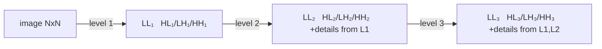
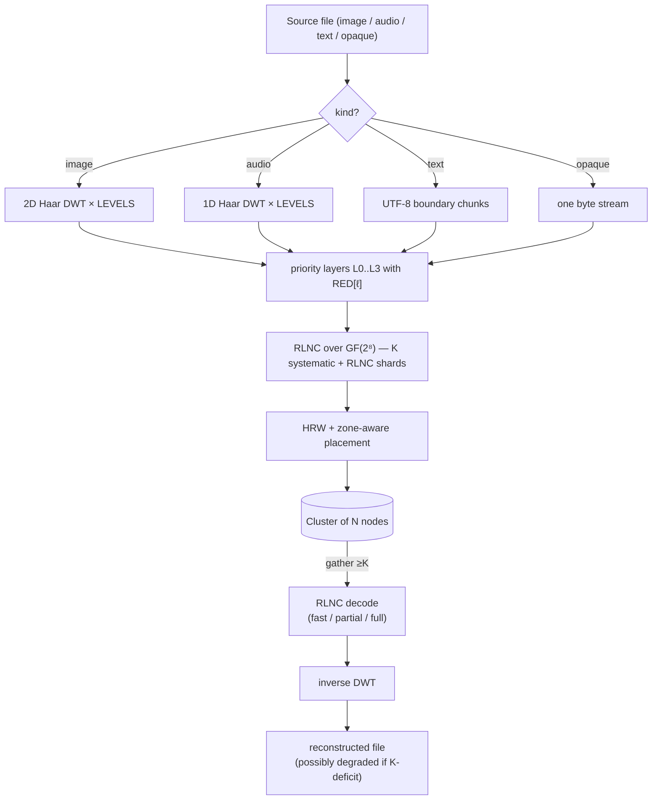

# Théorie

Fondements mathématiques de holofs. Chaque section contient des
définitions formelles, les formules pertinentes, l'intuition et des
références à la littérature.

> Notation mathématique : GitHub rend `$…$` et `$$…$$` via KaTeX. Les
> diagrammes sont des blocs Mermaid (également natifs sur GitHub).

## Sommaire

1. [Corps de Galois GF(2⁸)](#1-corps-de-galois-gf2)
2. [Random Linear Network Coding (RLNC)](#2-random-linear-network-coding-rlnc)
3. [Transformée en ondelettes discrète de Haar](#3-transformée-en-ondelettes-discrète-de-haar)
4. [Couches de priorité et dégradation holographique](#4-couches-de-priorité-et-dégradation-holographique)
5. [Hachage à plus haut poids aléatoire (rendezvous)](#5-hachage-à-plus-haut-poids-aléatoire-rendezvous)
6. [Placement conscient des zones](#6-placement-conscient-des-zones)
7. [Adressage par contenu et arbres de Merkle](#7-adressage-par-contenu-et-arbres-de-merkle)
8. [Partage de secret Shamir ↔ RLNC](#8-partage-de-secret-shamir--rlnc)
9. [Bottom-K MinHash](#9-bottom-k-minhash)
10. [Hachage perceptuel sur DWT-LL](#10-hachage-perceptuel-sur-dwt-ll)
11. [Codes de réparation / régénérants](#11-codes-de-réparation--régénérants)

---

## 1. Corps de Galois GF(2⁸)

Nous traitons chaque octet comme un élément du corps fini

$$
\mathrm{GF}(2^8) \;=\; \mathrm{GF}(2)[x] \;/\; \langle\, x^8 + x^4 + x^3 + x^2 + 1 \rangle,
$$

c.-à-d. des polynômes sur $\mathbb{F}_2$ de degré $< 8$, réduits modulo
le polynôme Rijndael / AES $p(x) = \texttt{0x11d}$. L'addition est le
OU exclusif bit à bit :

$$
a \oplus b = (a_7 \oplus b_7,\, a_6 \oplus b_6,\, \dots,\, a_0 \oplus b_0).
$$

La multiplication est la multiplication polynomiale modulo $p(x)$. Nous
l'implémentons via des tables de log discret relatives au générateur
$\alpha = \texttt{0x02}$ :

$$
a \cdot b \;=\; \alpha^{\log_\alpha a + \log_\alpha b} \quad \text{pour } a, b \neq 0,
$$

$$
a^{-1} \;=\; \alpha^{255 - \log_\alpha a}.
$$

Chaque multiplication est deux consultations de table + une addition.
La table `exp` est dupliquée en longueur 512 pour que
`log[a] + log[b]` ne déborde jamais, éliminant le modulo du chemin
chaud.

**Pourquoi GF(2⁸).** Ça tient dans un octet, a 255 éléments non nuls
(largement assez de coefficients distincts pour RLNC), et les
consultations de tables 8 bits sont efficaces pour le cache. GF(2¹⁶)
offre une probabilité de dépendance linéaire plus faible mais double
la mémoire.

**Implémentation.** [`holofs-core::gf`](../../crates/holofs-core/src/gf.rs).

**Références.**

- Lin & Costello, *Error Control Coding* (2ᵉ éd., 2004), §2.6.
- Joan Daemen & Vincent Rijmen, *The Design of Rijndael* (2002).

---

## 2. Random Linear Network Coding (RLNC)

Une couche de données est découpée en $K$ symboles
$s_0, s_1, \ldots, s_{K-1}$ (chaque symbole est un vecteur d'octets
de longueur `sym_len`). Un *shard* est une paire
$(\mathbf{c}, \mathbf{p})$ où le vecteur de coefficients
$\mathbf{c} = (c_0, \ldots, c_{K-1}) \in \mathrm{GF}(2^8)^K$ et la
charge utile est

$$
\mathbf{p} \;=\; \bigoplus_{i=0}^{K-1} c_i \cdot s_i.
$$

Le XOR / la multiplication se fait octet par octet sur $\mathrm{GF}(2^8)$.

### Décodage

Étant donné $K$ shards
$\{(\mathbf{c}^{(j)}, \mathbf{p}^{(j)})\}_{j=0}^{K-1}$ nous avons le
système linéaire

$$
\underbrace{\begin{pmatrix} \mathbf{c}^{(0)} \\ \mathbf{c}^{(1)} \\ \vdots \\ \mathbf{c}^{(K-1)} \end{pmatrix}}_{C}
\;
\underbrace{\begin{pmatrix} s_0 \\ s_1 \\ \vdots \\ s_{K-1} \end{pmatrix}}_{S}
\;=\;
\underbrace{\begin{pmatrix} \mathbf{p}^{(0)} \\ \mathbf{p}^{(1)} \\ \vdots \\ \mathbf{p}^{(K-1)} \end{pmatrix}}_{P}
$$

Si $C$ est inversible, on récupère $S = C^{-1} P$ via l'élimination
de Gauss–Jordan en $O(K^3)$ opérations de corps + $O(K^2 \cdot \texttt{sym\_len})$
pour la substitution arrière.

### Probabilité d'indépendance linéaire

Avec $n$ shards aléatoires tirés uniformément de $\mathrm{GF}(2^8)^K$,
la probabilité que $K$ quelconques *ne soient pas* linéairement
indépendants (le décodage échoue) est bornée par

$$
P(\text{dépendant}) \;\leq\; \frac{K}{2^8 - 1} \;\approx\; \frac{K}{255}.
$$

Pour notre $K = 16$, cela donne ≈ 6,3 %, aisément compensé en envoyant
$n > K$ shards.

### Shards systématiques

Dans holofs, les $\min(n, K)$ premiers shards sont déterministiquement
**systématiques** : $\mathbf{c}^{(i)} = \mathbf{e}_i$ (base
canonique), de sorte que la charge utile est littéralement le symbole
brut $s_i$. Cela offre deux énormes gains :

1. **Chemin rapide.** Quand tous les $K$ shards systématiques sont
   disponibles, le décodage est un memcpy :
   $\hat S = (\mathbf{p}^{(0)} \,|\, \mathbf{p}^{(1)} \,|\, \cdots)$.
   Pas d'élimination gaussienne, pas de multiplications GF.

2. **Récupération partielle.** Quand certains shards systématiques
   manquent, le problème se réduit à résoudre un système $r \times r$
   plus petit (où $r$ est le nombre d'inconnues) — bien moins coûteux
   qu'un $K \times K$ complet.

Les $n - K$ shards restants sont du RLNC pur : coefficients aléatoires,
utilisés comme « assurance » pour les cas où les shards systématiques
meurent.

**Implémentation.** [`holofs-core::rlnc`](../../crates/holofs-core/src/rlnc.rs).

**Références.**

- Rudolf Ahlswede, Ning Cai, Shuo-Yen R. Li, Raymond W. Yeung,
  [« Network Information Flow »](https://doi.org/10.1109/18.850663),
  IEEE Trans. Inf. Theory, 2000.
- Tracey Ho et al., [« A Random Linear Network Coding Approach to
  Multicast »](https://doi.org/10.1109/TIT.2006.881746),
  IEEE Trans. Inf. Theory, 2006.
- Christina Fragouli, Jean-Yves Le Boudec, Jörg Widmer,
  [« Network coding: an instant primer »](https://doi.org/10.1145/1198255.1198262),
  SIGCOMM CCR, 2006.

---

## 3. Transformée en ondelettes discrète de Haar

### Pas de Haar 1D

Étant donné un signal de longueur $2n$ $(x_0, x_1, \ldots, x_{2n-1})$,
le pas de Haar produit des coefficients d'*approximation* $\mathbf{a}$
et de *détail* $\mathbf{d}$ :

$$
a_k \;=\; \frac{x_{2k} + x_{2k+1}}{\sqrt{2}}, \qquad
d_k \;=\; \frac{x_{2k} - x_{2k+1}}{\sqrt{2}}.
$$

$\mathbf{a}$ capture le contenu basse fréquence (moyenne), $\mathbf{d}$
le contenu haute fréquence (différence). La normalisation $1/\sqrt{2}$
rend la transformée orthonormale — l'énergie est conservée :

$$
\sum_i x_i^2 \;=\; \sum_k a_k^2 + \sum_k d_k^2.
$$

### Pyramide multi-niveaux

Appliquer le pas de Haar récursivement à $\mathbf{a}$ seul donne une
pyramide multi-résolution. Après $L$ niveaux, le signal est décomposé
en $L+1$ bandes : une bande LL grossière (taille $2n / 2^L$) et $L$
bandes de détail de résolution décroissante.

### Haar 2D (produit tensoriel)

Pour les images, nous appliquons la Haar 1D à toutes les lignes puis à
toutes les colonnes. Un niveau produit quatre sous-bandes :

| Sous-bande | Capture                              |
|------------|--------------------------------------|
| **LL**     | basse fréquence (structure grossière) |
| **LH**     | détail horizontal (arêtes verticales) |
| **HL**     | détail vertical (arêtes horizontales) |
| **HH**     | détail diagonal (coins, texture)      |

Recurser dans LL seul donne la pyramide en ondelettes standard :

### Inverse

Haar est exactement inversible : $x_{2k} = (a_k + d_k)/\sqrt{2}$,
$x_{2k+1} = (a_k - d_k)/\sqrt{2}$. On peut retrouver le signal
original à partir de l'ensemble complet des coefficients $\{a, d\}$.

### Pourquoi spécifiquement Haar

- Ondelette orthogonale la plus simple — implémentation en ~30 lignes.
- Phase linéaire (pas de décalage spatial).
- Pour des démonstrations de dégradation par priorité, des ondelettes
  plus fines (Daubechies-4, CDF 9/7) donneraient un meilleur PSNR par
  bit mais le même comportement qualitatif. Nous restons simples pour
  garder les mathématiques accessibles.

**Implémentation.** [`holofs-core::transform`](../../crates/holofs-core/src/transform.rs).

**Références.**

- Stéphane Mallat, *A Wavelet Tour of Signal Processing*
  (3ᵉ éd., Academic Press, 2008) — §7 (bases d'ondelettes
  orthonormales).
- Alfréd Haar, « Zur Theorie der orthogonalen Funktionensysteme »,
  *Mathematische Annalen*, 1910 (l'article original).

---

## 4. Couches de priorité et dégradation holographique

Les sous-bandes DWT portent une information d'importance inégale.
Visuellement :

- Perdre LL ⇒ perdre entièrement l'image (c'est la vignette).
- Perdre HH₁ ⇒ perdre la texture la plus fine, souvent imperceptible.

Nous encodons chaque bande avec une redondance RLNC différente :

$$
\mathrm{RED}[\ell] \;\in\; \{\,4.0,\, 2.5,\, 1.6,\, 1.15\,\} \quad \text{pour } \ell = 0, 1, 2, 3,
$$

de sorte que la couche 0 (LL) est stockée avec
$\lfloor K \cdot 4.0 + 0.5 \rfloor = 64$ shards, tandis que la couche 3
(détail le plus fin) reçoit $\lfloor K \cdot 1.15 + 0.5 \rfloor = 18$.
Le code utilise l'arrondi bancaire (`f32::round`), non le plafond —
donc `K · 1.15 = 18.4` donne $18$, pas $19$.

### Courbe de dégradation

Si une fraction $f$ de nœuds échoue, la probabilité que la couche
$\ell$ ait encore $\geq K$ shards vivants est approximativement

$$
P_\ell(f) \;=\; \sum_{k=K}^{n_\ell} \binom{n_\ell}{k} (1-f)^k\, f^{n_\ell - k}
$$

(binomiale ; en ignorant le clustering HRW pour l'approximation). Pour
$\ell$ croissant, $n_\ell$ décroît, donc les couches échouent **dans
l'ordre de la haute fréquence à la basse** — exactement le comportement
visuel d'une plaque holographique qui a été coupée : l'image reste
reconnaissable, juste plus floue.

### Démonstration empirique

Sur Kodak kodim23 (Monte-Carlo, 5000 essais par pourcentage de kill,
40 nœuds / 4 zones / K = 16) :

| % kill | image entière | jusqu'à L2 | jusqu'à L1 | jusqu'à L0 seulement | morte |
|-------:|--------------:|-----------:|-----------:|---------------------:|------:|
|   10 % |        42,8 % |     57,2 % |      0,0 % |                0,0 % | 0,0 % |
|   25 % |         0,2 % |     96,5 % |      3,3 % |                0,0 % | 0,0 % |
|   50 % |         0,0 % |      0,0 % |     78,6 % |               21,4 % | 0,0 % |
|   75 % |         0,0 % |      0,0 % |      0,0 % |               12,1 % | 87,9 % |

**Références.**

- Andres Albanese, Johannes Blömer, Jeff Edmonds, Michael Luby, Madhu
  Sudan, [« Priority Encoding Transmission »](https://doi.org/10.1109/18.556657),
  IEEE Trans. Inf. Theory, 1996. Schéma d'encodage à priorité
  original, conceptuellement identique au nôtre mais appliqué à la
  vidéo en multicast.
- Catherine Taylor, Jean-Yves Le Boudec, [« Holographic data storage
  with wavelet codecs »](https://www.epfl.ch/labs/lca/wp-content/uploads/2018/12/wavelet-codecs.pdf)
  (notes de cours, EPFL 2009) — traitement clair de DWT + codage
  effaceur.

---

## 5. Hachage à plus haut poids aléatoire (rendezvous)

Étant donnée une clé $k$ (identifiant de shard) et un ensemble de
nœuds $\{N_1, \ldots, N_m\}$, HRW choisit le nœud maximisant un
hachage :

$$
\mathrm{place}(k) \;=\; \arg\max_{i \in [m]} \;\; h(k,\, N_i).
$$

Nous utilisons [SplitMix64](https://prng.di.unimi.it/splitmix64.c) sur
un tuple $(\text{object\_id},\, \text{channel},\, \text{layer},\, \text{shard\_idx},\, \text{node\_id})$
comme $h$.

### Théorème de perturbation minimale

Retirer un nœud du cluster déplace exactement les shards qui étaient
mappés sur ce nœud — les autres restent. Formellement, si $N_j$ part,
alors pour toute clé $k$ où $\mathrm{place}(k) = N_j$, le nouveau
placement est

$$
\mathrm{place}'(k) \;=\; \arg\max_{i \neq j} \;\; h(k, N_i),
$$

indépendamment de tous les autres nœuds. C'est la propriété qui fait
de HRW la primitive appropriée pour un stockage adressé par contenu
avec du churn — le hachage cohérent a des propriétés similaires mais
avec O(log n) sauts supplémentaires sur un anneau.

### Équilibre de charge

Pour $m$ nœuds identiques et des clés uniformément aléatoires, la
fraction attendue des clés sur un seul nœud est exactement $1/m$, avec
une variance $\frac{1}{m}(1 - \frac{1}{m})$ — même chose qu'un tirage
uniforme.

**Implémentation.** [`holofs-model::placement`](../../crates/holofs-model/src/placement.rs).

**Références.**

- David G. Thaler, Chinya V. Ravishankar,
  [« Using Name-Based Mappings to Increase Hit
  Rates »](https://doi.org/10.1109/90.664265),
  IEEE/ACM Trans. Networking, 1998.
- Karger et al., [« Consistent Hashing and Random Trees »](https://doi.org/10.1145/258533.258660),
  STOC 1997 — le schéma alternatif ; HRW est plus simple quand on a
  juste besoin de « choisir un parmi $m$ ».

---

## 6. Placement conscient des zones

Les clusters réels ont des corrélations de défaillance : un rack ou
une AZ entière peut disparaître ensemble. Nous superposons une
contrainte de *quota* au-dessus de HRW : pour chaque paire
(canal, couche), aucune zone ne peut héberger plus de
$\lceil n_\ell / z \rceil$ shards (où $z$ est le nombre de zones avec
des nœuds vivants).

### Algorithme

Pour chaque $\mathrm{shard\_idx} = 0, 1, \ldots, n_\ell - 1$ :

1. Noter chaque nœud vivant par $h(\text{clé}, \text{nœud})$.
2. Trier par ordre décroissant.
3. Descendre la liste ; prendre le premier nœud dont la **zone n'a pas
   dépassé son quota**.

L'ordonnancement déterministe garde le placement stable : retirer un
nœud ne déplace que les shards qui étaient sur lui, et seulement dans
la même zone (si possible). Ajouter un nœud ne redistribue que
$\sim 1/m$ de la charge.

### Survie sous panne de zone

Avec $z$ zones et $n_\ell$ shards par couche, perdre toute une zone
laisse

$$
n_\ell^{\text{vivant}} \;\geq\; n_\ell \cdot \frac{z - 1}{z}
$$

shards vivants. Pour $n_\ell = 64$, $z = 4$, $K = 16$ : on perd 16
shards (un quart), on en garde 48 — bien au-dessus du seuil de $K$.

Dans notre démo à 4 zones, **toute** défaillance de zone unique laisse
l'objet décodable jusqu'à L2 (seul le détail L3 le plus fin passe
sous le seuil).

**Implémentation.** `place_layer_zone_aware` dans
[`holofs-model::placement`](../../crates/holofs-model/src/placement.rs).

**Références.**

- Sage A. Weil et al., [« CRUSH: Controlled, Scalable, Decentralized
  Placement of Replicated Data »](https://doi.org/10.1145/1188455.1188582),
  SC '06 — l'inspiration ; CRUSH fait la même idée avec un hachage
  hiérarchique pondéré pour Ceph.

---

## 7. Adressage par contenu et arbres de Merkle

Chaque shard a un hachage SHA-256 de ses octets `(coeffs || payload)`
(avec un préfixe de domaine `holofs-shard-v1`). Les hachages des
shards sont les feuilles d'un arbre de Merkle ; la racine est
consignée dans le manifeste de l'objet.

### CID de l'objet

L'IDentifiant de Contenu d'un objet est

$$
\mathrm{CID} \;=\; \mathrm{SHA256}(\,\texttt{holofs-data-v1} \,\|\, \text{canaux} \,\|\, \text{params}\,).
$$

C'est **déterministe depuis le contenu** : deux clients encodant le
même fichier avec les mêmes paramètres produisent le même CID. Deux
fichiers image qui se redimensionnent en les mêmes octets de canevas
(p. ex. PNG sans perte contre BMP de la même source) produisent le
même CID — la déduplication inter-format en découle gratuitement.

### Pourquoi un arbre de Merkle et pas juste une racine

- Réparation vérifiable : un nœud régénérant peut prouver qu'il a
  produit un nouveau shard dont le hachage est dans `shard_hashes`,
  même quand la racine Merkle a été mise à jour depuis.
- Streaming auditable : un client téléchargeant des shards peut
  vérifier chaque shard contre le manifeste à l'arrivée, rejetant les
  shards corrompus avant le décodage.

**Implémentations.** [`holofs-core::hash`](../../crates/holofs-core/src/hash.rs) (FIPS
180-4 SHA-256, vérifié sur les vecteurs NIST) et
[`holofs-core::merkle`](../../crates/holofs-core/src/merkle.rs).

**Références.**

- Ralph C. Merkle, « Protocols for Public Key Cryptosystems »,
  *IEEE S&P*, 1980 — l'arbre original.
- FIPS PUB 180-4, *Secure Hash Standard* (NIST, 2015).
- IPFS Specifications, [Content Identifiers](https://github.com/multiformats/cid).

---

## 8. Partage de secret Shamir ↔ RLNC

Un schéma Shamir $(K, N)$ distribue un secret $s$ comme $N$
évaluations d'un polynôme aléatoire de degré $K - 1$ sur un corps
fini :

$$
f(x) \;=\; s + r_1 x + r_2 x^2 + \cdots + r_{K-1} x^{K-1}, \quad r_i \stackrel{\$}{\leftarrow} \mathbb{F}.
$$

Chaque partie $i \in [N]$ reçoit $(x_i, f(x_i))$. Toutes $K$ parts
reconstruisent $f$ (et donc $s$) via interpolation de Lagrange ;
$K - 1$ parts ne révèlent rien sur $s$ (sécurité théorique de
l'information).

### Équivalence avec RLNC

Le vecteur de coefficients
$\mathbf{c}^{(j)} = (1, x_j, x_j^2, \ldots, x_j^{K-1})$ fait de chaque
part Shamir un shard RLNC spécial. La matrice de reconstruction est
un déterminant de Vandermonde, toujours non nul pour des $x_j$
distincts.

Dans holofs, nous n'utilisons pas Vandermonde-Shamir directement ; nous
utilisons des vecteurs de coefficients **aléatoires**. La garantie de
sécurité est légèrement plus faible (toutes $K - 1$ shards laissent
fuir une pdf uniforme sur l'espace du secret — la même chose que
Shamir dans le pire cas, mais pas pour tous les choix de coefficients).
Pour les cas d'usage de séquestre de clé, cela est acceptable.

### Séquestre holofs

`holofs-analytics::escrow` s'appuie sur
`holofs-core::rlnc::encode_layer_with_k` avec $K, N$ choisis par
l'utilisateur. Les shards sont sérialisés en fichiers `.holoshare`
distribuables à des humains / appareils. Le workflow de séquestre est
*purement côté client* : rien n'est stocké sur le cluster.

**Références.**

- Adi Shamir, [« How to Share a Secret »](https://doi.org/10.1145/359168.359176),
  Comm. ACM, 1979.
- Hugo Krawczyk, [« Secret Sharing Made Short »](https://link.springer.com/chapter/10.1007/3-540-48329-2_12),
  CRYPTO 1993 — approche chiffrée-puis-partagée pour de très grands
  secrets ; hors portée pour la v0 mais une prochaine étape naturelle.

---

## 9. Bottom-K MinHash

Étant donnés deux documents $A, B$ représentés comme des ensembles de
$n$-shingles (sous-chaînes de longueur $n$), la similarité de Jaccard
est

$$
J(A, B) \;=\; \frac{|A \cap B|}{|A \cup B|} \;\in\; [0, 1].
$$

Calculer $|A \cap B|$ directement requiert $|A| + |B|$ mémoire. MinHash
donne un estimateur sans biais avec une mémoire fixe $k$ :

1. Hacher chaque shingle avec un hachage fixe $h$.
2. Garder les $k$ plus petites valeurs de hachage distinctes :
   $A_k = \{h(s) : s \in A\}_{(1..k)}$.
3. Estimer Jaccard comme

$$
\hat J(A, B) \;=\; \frac{|A_k \cap B_k|}{k}.
$$

Cet estimateur a une variance

$$
\mathrm{Var}(\hat J) \;=\; \frac{J(1 - J)}{k},
$$

donc pour $k = 64$ l'écart type est $\leq 1/16 \approx 6\%$ — assez
pour discriminer de manière fiable « quasi-doublon » (J > 0,8) de
« sans rapport » (J < 0,1).

### Usage dans holofs

`holofs-analytics::shingle` calcule un MinHash à 64 valeurs sur des
shingles de 5 octets au moment du PUT et le stocke dans
`manifest.text_minhash`. À l'heure de la recherche, nous calculons
Jaccard par paire — pas d'E/S, pas de décompression.

**Différences détectées.** Fichiers identiques : $J = 1,0$. Petites
modifications (fautes, réorganisation de paragraphes) : typiquement
$J \geq 0,85$. Inclusion de sous-chaîne (un document copié dans un
autre) : $J \in [0,2, 0,7]$ selon le rapport de longueur. Sans
rapport : $J \approx 0$.

**Références.**

- Andrei Z. Broder, [« On the resemblance and containment of
  documents »](https://doi.org/10.1109/SEQUEN.1997.666900),
  SEQUENCES '97 — MinHash original.
- Edith Cohen, [« Min-Wise Independent Permutations »](https://doi.org/10.1145/276698.276781),
  STOC 1998 — analyse formelle.
- Sergei Vassilvitskii, Sanjeev Arora et al., *Mining of Massive
  Datasets* (3ᵉ éd., 2020), §3 — primer pratique.

---

## 10. Hachage perceptuel sur DWT-LL

La bande LL d'une image $W \times H$ après $L$ niveaux de DWT est une
approximation passe-bas $W/2^L \times H/2^L$ — exactement la vignette
utilisée par les hachages perceptuels classiques (pHash utilise DCT,
dHash utilise des différences de pixels).

Dans holofs, **les $K$ premiers shards systématiques de la couche 0**
contiennent littéralement les pixels LL (comme coefficients
d'ondelettes en float-32, sérialisés en octets). Nous calculons une
empreinte par canal à partir des moyennes d'octets

$$
\mathrm{fp}_i^{(c)} \;=\; \mathrm{clamp}_{0..255}\bigl(\mathrm{moyenne}(\mathrm{payload}(\mathrm{shard}_i^{(c)}))\bigr),
\quad i = 0, \ldots, K - 1.
$$

Pour notre $K = 16$, chaque canal produit une grille $4 \times 4$ de
luminances moyennes — une variante dHash classique. L'empreinte
stockée concatène les trois canaux :
$[\mathrm{R}_{0..15}\,|\,\mathrm{G}_{0..15}\,|\,\mathrm{B}_{0..15}]$
— soit 48 octets pour les images à 3 canaux ; l'audio et les autres
types à 1 canal n'utilisent que les 16 premiers.

**Deux métriques de distance vivent au-dessus de cette empreinte :**

- `/api/fingerprint/<name>` expose un L₁ brut sur les octets de
  canaux,
  $d = \sum_{c, i} |\mathrm{fp}_i^{(c)} - \mathrm{fp}_i^{'(c)}|
  \in [0,\, 48 \cdot 255]$ — utile pour les tests d'égalité exacte.
- `/similar/<name>` dérive les bits dHash — un bit par comparaison
  de tuiles adjacentes dans chaque bande de canal, soit
  $3 \times 15 = 45$ bits — et rapporte la similarité comme
  $1 - \mathrm{hamming} / 45$. dHash se dégrade gracieusement sous les
  retournements géométriques et la divergence chromatique, là où L₁
  brut sature.

**Important** : les deux métriques sont calculées **sans décompresser
l'objet** — juste en lisant les shards systématiques de la couche 0.
Pour une recherche à travers des milliers d'objets, cela fait $O(K)$
octets par objet.

**Références.**

- Christoph Zauner, *Implementation and Benchmarking of Perceptual
  Image Hash Functions*, thèse MSc, Univ. Applied Sciences Hagenberg,
  2010 — comparaison de aHash / dHash / pHash.
- Marr & Hildreth, [« Theory of edge detection »](https://www.jstor.org/stable/35407),
  Proc. Royal Society B, 1980 — motivation de la vision
  grossier-vers-fin.

---

## 11. Codes de réparation / régénérants

Quand un nœud $v$ disparaît (ou qu'un nouveau nœud est ajouté), on
doit restaurer ses shards sur un remplaçant. Deux options :

**(a) Reconstruction complète.** Télécharger $K$ shards, décoder
l'objet complet, recalculer les shards manquants. Coût :
$K \cdot \texttt{sym\_len}$ octets téléchargés, plus $K^3$ opérations
GF pour Gauss + $K \cdot \texttt{sym\_len}$ pour ré-encoder chaque
shard perdu.

**(b) Régénération RLNC** (ce que fait holofs). Télécharger $d$ shards
($K \leq d \leq n$), les mélanger comme

$$
\mathbf{c}^{\text{nouveau}} = \sum_{j=1}^d \alpha_j \mathbf{c}^{(j)}, \qquad
\mathbf{p}^{\text{nouveau}} = \sum_{j=1}^d \alpha_j \mathbf{p}^{(j)}
$$

avec des $\alpha_j$ aléatoires. Le résultat est un nouveau shard RLNC
valide *dans le même sous-espace linéaire* — pas besoin de décoder
entièrement et de ré-encoder.

Coût : mêmes octets téléchargés ($d \cdot \texttt{sym\_len}$ pour
$d = K$), **pas d'élimination gaussienne**, juste des opérations mac
GF. Empiriquement ~9× moins de multiplications GF.

Cela place holofs dans la famille des codes *Minimum Bandwidth
Regenerating* (MBR) — voir Dimakis et al. pour les bornes inférieures
et le compromis avec *Minimum Storage Regenerating* (MSR).

**Références.**

- Alexandros G. Dimakis, Brighten Godfrey, Yunnan Wu, Martin J.
  Wainwright, Kannan Ramchandran, [« Network Coding for Distributed
  Storage Systems »](https://doi.org/10.1109/TIT.2010.2054295),
  IEEE Trans. Inf. Theory, 2010 — a établi le domaine.
- Anwitaman Datta, Frédérique Oggier, [« An Overview of Codes
  Tailor-Made for Better Repairability in Networked Distributed
  Storage Systems »](https://doi.org/10.1145/2723772.2723778),
  ACM SIGACT News, 2013.

---

## Assemblage global

Le pipeline complet encoder → stocker → récupérer :

Chaque boîte correspond à une section ci-dessus ; consulter les liens
d'*Implémentation* par section pour naviguer de la théorie directement
au code.
