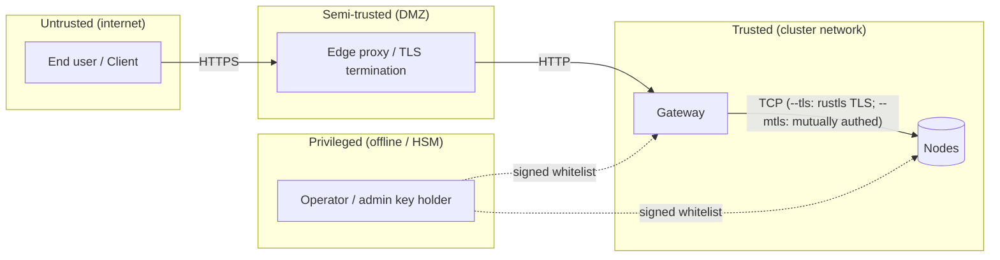

# Modèle de menace

Ce document énumère les **adversaires**, **actifs**, **hypothèses de confiance**,
et **mesures d'atténuation** pour un déploiement holofs. Il utilise la
taxonomie STRIDE ([Howard & LeBlanc 2003](https://learn.microsoft.com/en-us/azure/security/develop/threat-modeling-tool-threats))
pour classifier les menaces et le prisme [LINDDUN](https://linddun.org/) pour
les préoccupations de confidentialité.

## Sommaire

1. [Portée et actifs](#1-scope-and-assets)
2. [Frontières de confiance](#2-trust-boundaries)
3. [Catalogue d'adversaires](#3-adversary-catalogue)
4. [Analyse STRIDE](#4-stride-analysis)
5. [Analyse de confidentialité (LINDDUN)](#5-privacy-linddun-analysis)
6. [Non-objectifs et limites explicites](#6-non-goals-and-explicit-limitations)
7. [Registre des risques résiduels](#7-residual-risk-register)

---

## 1. Scope and assets

### 1.1. Dans la portée

Le système étudié est un cluster holofs tel que décrit dans
[architecture.md](./architecture.md) :

- Gateway HTTP (binaire `holofs-web`, axum + Leptos SSR).
- Démons de node (binaire `holofs-node`), 1..N par hôte.
- Le protocole filaire entre eux (voir [api.md §2](./api.md#2-wire-protocol-tcp)).
- L'état sur disque (shards, manifests, catalogue, whitelist).
- La whitelist signée + le matériel d'identité Ed25519.

### 1.2. Hors portée

- Le noyau du système d'exploitation et l'hyperviseur.
- Le reverse proxy de terminaison TLS (s'il est utilisé en externe).
- Le navigateur / l'application cliente de l'utilisateur.
- Les canaux auxiliaires découlant de caches CPU partagés avec des co-tenants
  (atténuation : nodes dédiés pour les déploiements sensibles).
- Les attaques physiques sur les supports de stockage.

### 1.3. Actifs à protéger

| Actif                          | Confidentialité | Intégrité | Disponibilité |
|--------------------------------|:---------------:|:---------:|:-------------:|
| Payload d'objet                | ●               | ●         | ●             |
| Métadonnées d'objet (nom, kind) | ◐              | ●         | ●             |
| Catalogue (objet → manifest)   |                 | ●         | ●             |
| Whitelist + pubkey admin       |                 | ●         | ●             |
| Clés secrètes Ed25519 par node | ●               | ●         |               |
| Données de santé / liveness du cluster |          | ●         | ◐             |

Légende : ● critique, ◐ modéré.

---

## 2. Trust boundaries

| Frontière          | Authentification                | Chiffrement     | Notes de durcissement |
|--------------------|---------------------------------|-----------------|-----------------------|
| Utilisateur → Edge | Niveau application (cookies, JWT) | TLS 1.3       | Hors portée           |
| Edge → Gateway     | Aucune aujourd'hui (prévu : mTLS) | Aucun / mTLS  | Lier le gateway à un VLAN privé |
| Gateway ↔ Node     | Challenge-response Ed25519 (+ mTLS optionnel) | TCP en clair, ou TLS rustls via `--tls` (étape 6) | Nonce du protocole filaire + handshake signé ; `--mtls` ajoute la vérification de certificat X.509 |
| Opérateur → Cluster | L'admin Ed25519 signe la whitelist | Hors-bande   | Garder la clé admin offline / HSM |

---

## 3. Adversary catalogue

| Adversaire                 | Position                            | Objectif                          | Capacité       |
|----------------------------|-------------------------------------|-----------------------------------|----------------|
| **Anonyme externe**        | Internet public                     | Lire / supprimer des objets, DoS  | Réseau + L7    |
| **Client compromis**       | Détient une session HTTP valide     | Exfiltrer les données d'autres utilisateurs | L7    |
| **Observateur réseau**     | Sur le chemin entre gateway/nodes   | Lire le trafic, rejouer, MITM     | L3 / L4        |
| **Node compromis**         | Détient une clé node valide         | Servir de mauvaises données, refuser l'audit | Protocole filaire |
| **Node Sybil**             | Ne possède aucune clé mais tente de rejoindre | Polluer placement / dedup | Protocole filaire |
| **Opérateur compromis**    | A la clé admin                      | Contrôle total du cluster         | Total          |
| **Lecture interne**        | Lecture du système de fichiers sur un hôte de node | Lire shards / métadonnées | Shell OS |
| **Coercition / assignation** | Contrainte légale contre les opérateurs | Récupérer un objet spécifique | Légal        |

L'adversaire qui justifie le plus d'effort de modélisation est le **node compromis** :
un pair pleinement authentifié qui se comporte mal de manière sélective. La plupart
des atténuations de ce document le ciblent.

---

## 4. STRIDE analysis

### 4.1. Spoofing

| # | Menace                                              | Atténuation |
|---|-----------------------------------------------------|-------------|
| S1 | Un attaquant usurpe l'identité d'un node pour recevoir des shards | Challenge Ed25519 (`AuthChallenge`) — le gateway vérifie la signature avec la pubkey de la whitelist avant de faire confiance à toute réponse. Voir [api.md §2 handshake](./api.md#authentication-handshake). |
| S2 | Un attaquant usurpe l'identité du gateway auprès d'un node | Exécuter avec `--mtls` : le node refuse tout handshake TLS dont le certificat client n'est pas signé par la CA partagée. Sans `--mtls`, revenir au déploiement sur VLAN privé. |
| S3 | Mise à jour de whitelist forgée                    | La whitelist est signée avec la clé Ed25519 admin ; les nodes refusent les mises à jour non signées ou à mauvaise signature. |
| S4 | Rejeu d'une réponse capturée                       | Un nonce par requête dans `AuthChallenge` garantit que les signatures se lient à un challenge frais. Les trames filaires ne portent pas encore de nonce anti-rejeu pour les messages non-handshake — voir [§7](#7-residual-risk-register). |

### 4.2. Tampering

| # | Menace                                              | Atténuation |
|---|-----------------------------------------------------|-------------|
| T1 | Un node retourne un payload de shard corrompu      | L'identité de chaque shard est `SHA-256(coeffs ‖ payload)`. Le gateway recalcule ; un mismatch est rejeté et compte contre la `reputation`. |
| T2 | Un node retourne un shard différent de celui demandé | Le manifest liste `shard_hashes[c][l][idx]` ; le gateway vérifie que le hash correspond à l'entrée attendue. |
| T3 | Corruption sur disque (bitrot)                     | Les noms de fichiers shard *sont* leurs hashes — le scan au démarrage et la tâche `Audit` en arrière-plan détectent les mismatches et déclenchent une réparation RLNC. |
| T4 | Modification du fichier catalogue                  | Les écritures du catalogue sont `write-tmp+fsync+rename`. La racine Merkle de chaque manifest cross-vérifie tous les shards ; les entrées de catalogue retournées remontent comme échecs de décodage. |
| T5 | Un MITM modifie les octets filaires                | Exécuter avec `--tls` : rustls (TLS 1.2/1.3 via le provider `ring`) authentifie le serveur et chiffre chaque trame. La vérification du hash de shard reste un contrôle de défense en profondeur à l'intérieur du tunnel TLS. |

### 4.3. Repudiation

| # | Menace                                              | Atténuation |
|---|-----------------------------------------------------|-------------|
| R1 | Un node nie avoir servi une mauvaise réponse       | Le score de réputation est mis à jour côté serveur à partir de mismatches de hash auditables ; le dashboard ops enregistre `audit_fail_total` par node. |
| R2 | L'opérateur nie une action admin                   | Les mises à jour de whitelist portent la signature Ed25519 de l'admin ; le fichier whitelist *committé* est la piste d'audit. |

### 4.4. Information disclosure

| # | Menace                                              | Atténuation |
|---|-----------------------------------------------------|-------------|
| I1 | Un seul node lisant « ses » shards révèle le plaintext | Un shard individuel est `coeffs · chunks` sur GF(2⁸), une combinaison linéaire aléatoire de chunks. Récupérer le plaintext depuis moins de `K` shards indépendants nécessite de résoudre un système linéaire sous-déterminé — théoriquement infaisable **pour un shard aléatoire unique**. |
| I2 | Un adversaire collecte ≥ K shards d'un objet       | RLNC sur GF(2⁸) public **n'est pas** un schéma de chiffrement. K shards linéairement indépendants reconstruisent le payload. Atténuation : **chiffrement at-rest par node** (prévu étape 7) et **diversité de placement** — sous `RendezvousZoneAware`, K shards s'étendent sur ≥ K nodes différents dans ≥ ⌈K/zone_count⌉ zones, donc les lire nécessite d'en compromettre autant. |
| I3 | Fuite de métadonnées : nom + kind + taille         | Le manifest stocke le nom de l'objet et le content type en clair. Les déploiements sensibles devraient hasher ou pseudonymiser les noms avant l'upload. |
| I4 | Canaux auxiliaires (cache, timing réseau)          | Non atténué en 0.1 — utiliser des CPU / réseau dédiés pour les déploiements sensibles. |
| I5 | Fuite de sauvegarde                                | Les sauvegardes héritent de la même menace : elles doivent être chiffrées au repos (`restic --pass-file`, S3 SSE-KMS). |
| I6 | Fuite de holoshare                                 | Un fichier `.holoshare` individuel est une part d'un split Shamir-via-RLNC `(k,n)`. En posséder moins de `k` est sûr de manière théorique-information (voir [theory.md §8](./theory.md#8-shamir-via-rlnc-key-escrow)). |

### 4.5. Denial of service

| # | Menace                                              | Atténuation |
|---|-----------------------------------------------------|-------------|
| D1 | Inonder le gateway avec des uploads                | Le gateway doit s'exécuter derrière un reverse proxy à limitation de débit. La taille de trame filaire est plafonnée à `MAX_FRAME = 64 MiB` sur chaque node. |
| D2 | Un seul node refuse les requêtes                   | RLNC a une redondance ≥ K-de-N par couche. La tâche de réparation détecte et ressuscite les shards sur des nodes vivants. |
| D3 | Panne coordonnée d'une moitié du cluster           | La marge est dimensionnée pour **toute zone unique + défaillances simples dispersées** (voir [theory.md §3](./theory.md#3-priority-layers)). Des pannes plus larges dégradent gracieusement : L3 (détail cosmétique) perdu en premier, puis L2, L1. |
| D4 | Un node « dormant » accepte les puts mais ne retourne jamais de get | La tâche d'audit émet des probes `Audit(shard_hash)` aléatoires — un node non réactif ou répondant faux voit sa réputation chuter et cesse d'être choisi pour le placement. |
| D5 | Slow-loris sur TCP                                 | Timeouts I/O tokio à chaque lecture de trame ; configurable via `HOLOFS_WIRE_TIMEOUT`. |
| D6 | Épuisement mémoire via énorme trame                | Les trames > `MAX_FRAME` sont rejetées avant allocation. |

### 4.6. Elevation of privilege

| # | Menace                                              | Atténuation |
|---|-----------------------------------------------------|-------------|
| E1 | Sybil : un attaquant spawn N faux nodes pour absorber les données | Les nodes ne sont joints que si leur pubkey apparaît dans la whitelist signée admin. Générer des clés valides ne sert à rien — il faut être admis. |
| E2 | Un gateway compromis accède à tout                 | Le gateway n'a pas de clé admin ; il ne peut pas créer de nouvelles entrées de whitelist. Une compromission affecte l'ingress/egress et la fraîcheur du catalogue mais ne peut pas subvertir la racine de confiance. |
| E3 | Clé admin compromise                               | C'est une compromission totale. Atténuation : garder la clé admin offline (HSM / sauvegarde papier), faire tourner via procédure de dual control. |
| E4 | Élévation de privilège à l'intérieur du conteneur  | Le conteneur s'exécute en `uid 10001`, `readOnlyRootFilesystem: true`, `capabilities.drop: [ALL]`. |
| E5 | Path traversal dans les noms d'objets              | Les noms d'objets ne sont stockés que dans le catalogue ; les chemins sur disque sont content-addressed (`<hex2>/<hex62>.shard`). Le nom de l'objet n'atteint jamais le système de fichiers. |

---

## 5. Privacy (LINDDUN) analysis

Holofs n'est **pas** un système de fichiers préservant la confidentialité de par sa
conception — il priorise la durabilité, la déduplication et la résilience. Les
surfaces suivantes sont à considérer par les opérateurs.

| Catégorie LINDDUN  | Préoccupation                            | Action de l'opérateur |
|--------------------|------------------------------------------|------------------------|
| **L**inkability    | Les sketches MinHash révèlent la similarité de texte ; les hashes perceptuels lient les images quasi-doublons. | Désactiver les endpoints d'analytics (`/similar`, `/diff`) pour les tenants sensibles à la confidentialité. |
| **I**dentifiability | Les noms d'objets sont stockés verbatim. | Hasher / pseudonymiser les noms côté client. |
| **N**on-repudiation | Les logs d'audit identifient les nodes servant le contenu. | Acceptable dans des contextes ops de confiance. |
| **D**etectability  | L'existence d'un objet est inférable depuis `/api/stats`. | `/api/stats` authentifié uniquement. |
| **D**isclosure     | Voir §4.4 — I1–I6.                       | Chiffrement at-rest étape 7. |
| **U**nawareness    | La dédup signifie que l'upload *d'un autre tenant* peut produire le même `data_cid`. | Déploiements mono-tenant uniquement lorsque cela importe. |
| **N**oncompliance  | RGPD « droit à l'effacement » — `DELETE /<name>` émet `Purge` à tous les nodes ; mais **les shards peuvent avoir été sauvegardés hors site**. | Documenter la rétention des sauvegardes ; exposer `holofs-admin shred` pour un effacement de grade forensique. |

---

## 6. Non-goals and explicit limitations

Les éléments suivants ne sont **pas** offerts par holofs 0.1 et nécessitent des contrôles
externes si besoin :

1. **Chiffrement de bout en bout.** Les payloads sont stockés encodés mais non
   chiffrés. Un node avec ≥ K shards d'un objet peut le reconstruire.
   Les opérateurs doivent classifier holofs comme « données en clair » au repos.
2. **Isolation entre tenants.** Il n'y a pas de namespace par utilisateur ; tous les objets
   partagent un catalogue unique. Les déploiements multi-tenants doivent fronter holofs
   avec un proxy d'autorisation.
3. **Journal d'audit infalsifiable.** La réputation suit le mauvais comportement des nodes mais
   ne produit pas de log append-only signé.
4. **Anti-rejeu cryptographique sur les trames filaires.** Seul `AuthChallenge`
   porte un nonce. L'étape 7 ajoute un keying par session.
5. **Résistance quantique.** Ed25519 et SHA-256 sont pré-quantiques. L'étape 8
   évalue la migration PQ.

---

## 7. Residual risk register

| Risque                                              | Sévérité | Probabilité | Contrôle compensatoire |
|-----------------------------------------------------|:--------:|:-----------:|------------------------|
| Trafic filaire en clair sur un LAN partagé          | Faible   | Faible      | Atténué par `--tls` (rustls TLS 1.2/1.3, étape 6). Les opérateurs qui ne définissent pas `--tls` devraient se restreindre à un VLAN privé. |
| Compromission de la clé admin                       | Critique | Faible      | Stockage offline ; exercice de rotation trimestriel |
| Rejeu de trame filaire (non-handshake)              | Moyenne  | Faible      | La liaison par hash limite les dommages à l'intégrité, pas à la confidentialité |
| Attaques par canal auxiliaire sur CPU partagé       | Moyenne  | Faible      | Nodes dédiés pour les workloads sensibles |
| Fuite de sauvegarde                                 | Élevée   | Moyenne     | Chiffrer les sauvegardes (`restic`, SSE-KMS) |
| Effacement RGPD incomplet à cause des sauvegardes   | Moyenne  | Moyenne     | Politique de rétention documentée + divulgation au client |
| Compromission de l'opérateur via la supply chain    | Élevée   | Faible      | Builds reproductibles + releases signées (étape 8) |

Chaque risque a un propriétaire (`@holofs/security`) et une release d'atténuation
planifiée. Suivi via les issues GitHub avec le label `security`.
