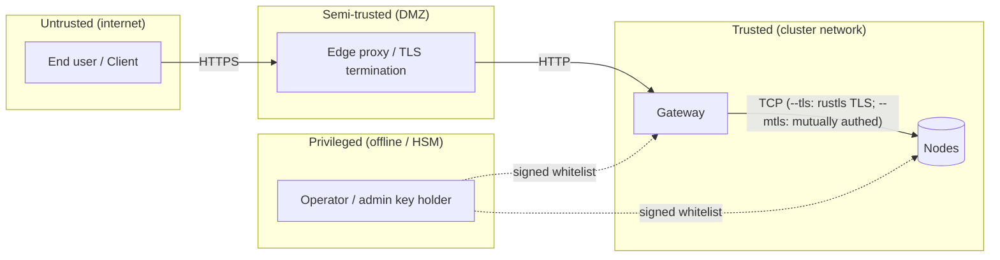

# Modèle de menace

Ce document énumère les **adversaires**, **actifs**, **hypothèses de
confiance** et **mesures d'atténuation** pour un déploiement holofs.
Il utilise la taxonomie STRIDE ([Howard & LeBlanc 2003](https://learn.microsoft.com/en-us/azure/security/develop/threat-modeling-tool-threats))
pour classifier les menaces et le prisme [LINDDUN](https://linddun.org/)
pour les préoccupations de confidentialité.

## Sommaire

1. [Portée et actifs](#1-portée-et-actifs)
2. [Frontières de confiance](#2-frontières-de-confiance)
3. [Catalogue d'adversaires](#3-catalogue-dadversaires)
4. [Analyse STRIDE](#4-analyse-stride)
5. [Analyse de confidentialité (LINDDUN)](#5-analyse-de-confidentialité-linddun)
6. [Non-objectifs et limites explicites](#6-non-objectifs-et-limites-explicites)
7. [Registre des risques résiduels](#7-registre-des-risques-résiduels)

---

## 1. Portée et actifs

### 1.1. Dans la portée

Le système étudié est un cluster holofs tel que décrit dans
[architecture.md](./architecture.md) :

- Passerelle HTTP (binaire `holofs-web`, axum + Leptos SSR).
- Démons de nœud (binaire `holofs-node`), 1..N par hôte.
- Le protocole filaire entre eux (voir [api.md §2](./api.md#2-protocole-filaire-tcp)).
- L'état sur disque (shards, manifestes, catalogue, liste blanche).
- La liste blanche signée + le matériel d'identité Ed25519.

### 1.2. Hors portée

- Le noyau du système d'exploitation et l'hyperviseur.
- Le proxy inverse terminant le TLS (s'il est utilisé en externe).
- Le navigateur / l'application cliente de l'utilisateur.
- Les canaux auxiliaires provenant du partage des caches CPU avec des
  co-locataires (atténuation : nœuds dédiés pour les déploiements sensibles).
- Les attaques physiques sur les supports de stockage.

### 1.3. Actifs à protéger

| Actif                              | Confidentialité | Intégrité | Disponibilité |
|------------------------------------|:---------------:|:---------:|:-------------:|
| Charge utile de l'objet            | ●               | ●         | ●             |
| Métadonnées de l'objet (nom, type) | ◐               | ●         | ●             |
| Catalogue (objet → manifeste)      |                 | ●         | ●             |
| Liste blanche + clé publique admin |                 | ●         | ●             |
| Clés secrètes Ed25519 par nœud     | ●               | ●         |               |
| Santé du cluster / données de vie  |                 | ●         | ◐             |

Légende : ● critique, ◐ modéré.

---

## 2. Frontières de confiance

| Frontière              | Authentification                              | Chiffrement                          | Notes de durcissement |
|------------------------|-----------------------------------------------|--------------------------------------|-----------------------|
| Utilisateur → Edge     | Niveau applicatif (cookies, JWT)              | TLS 1.3                              | Hors portée           |
| Edge → Passerelle      | Aucune aujourd'hui (prévu : mTLS)             | Aucun / mTLS                         | Lier la passerelle à un VLAN privé |
| Passerelle ↔ Nœud     | Défi-réponse Ed25519 (+ mTLS optionnel)       | TCP en clair, ou TLS rustls via `--tls` | Nonce du protocole filaire + poignée de main signée ; `--mtls` ajoute la vérification du certificat X.509 |
| Opérateur → Cluster    | La clé admin Ed25519 signe la liste blanche   | Hors bande                           | Garder la clé admin hors ligne / HSM |

---

## 3. Catalogue d'adversaires

| Adversaire                     | Position                                | Objectif                             | Capacité       |
|--------------------------------|-----------------------------------------|--------------------------------------|----------------|
| **Anonyme externe**            | Internet public                         | Lire / supprimer des objets, DoS     | Réseau + L7    |
| **Client compromis**           | Détient une session HTTP valide         | Exfiltrer les données d'autres utilisateurs | L7      |
| **Observateur réseau**         | Sur le chemin passerelle/nœuds          | Lire le trafic, rejouer, MITM        | L3 / L4        |
| **Nœud compromis**             | Détient une clé de nœud valide          | Servir de fausses données, refuser un audit | Protocole filaire |
| **Nœud Sybil**                 | Ne possède aucune clé mais tente de rejoindre | Polluer le placement / la déduplication | Protocole filaire |
| **Opérateur compromis**        | Détient la clé admin                    | Contrôle total du cluster            | Total          |
| **Lecture interne**            | Lecture du système de fichiers sur un hôte de nœud | Lire les shards / métadonnées | Shell OS   |
| **Contrainte / assignation**   | Contrainte légale envers les opérateurs | Récupérer un objet spécifique        | Légale         |

L'adversaire qui mérite le plus d'effort de modélisation est le **nœud
compromis** : un pair pleinement authentifié qui se comporte mal de
manière sélective. La plupart des mesures d'atténuation de ce document
le ciblent.

---

## 4. Analyse STRIDE

### 4.1. Usurpation (Spoofing)

| # | Menace                                              | Atténuation |
|---|-----------------------------------------------------|-------------|
| S1 | Un attaquant se fait passer pour un nœud afin de recevoir des shards | Défi Ed25519 (`AuthChallenge`) — la passerelle vérifie la signature avec la clé publique de la liste blanche avant de faire confiance à toute réponse. Voir [api.md § poignée de main d'authentification](./api.md#authentification-poignée-de-main). |
| S2 | Un attaquant se fait passer pour la passerelle auprès d'un nœud | Exécuter avec `--mtls` : le nœud refuse toute poignée de main TLS dont le certificat client n'est pas signé par la CA partagée. Sans `--mtls`, se rabattre sur un déploiement en VLAN privé. |
| S3 | Mise à jour de liste blanche falsifiée              | La liste blanche est signée avec la clé admin Ed25519 ; les nœuds refusent les mises à jour non signées ou de mauvaise signature. |
| S4 | Rejeu d'une réponse capturée                        | Un nonce par requête dans `AuthChallenge` garantit que les signatures se lient à un défi frais. Les trames filaires n'embarquent pas encore de nonce anti-rejeu pour les messages hors poignée de main — voir [§7](#7-registre-des-risques-résiduels). |

### 4.2. Falsification (Tampering)

| # | Menace                                              | Atténuation |
|---|-----------------------------------------------------|-------------|
| T1 | Un nœud renvoie une charge utile de shard corrompue | L'identité de chaque shard est `SHA-256(coeffs ‖ payload)`. La passerelle recalcule ; toute divergence est rejetée et compte contre la `réputation`. |
| T2 | Un nœud renvoie un shard différent de celui demandé | Le manifeste liste `shard_hashes[c][l][idx]` ; la passerelle vérifie que le hachage correspond à l'entrée attendue. |
| T3 | Corruption sur disque (bitrot)                      | Les noms de fichiers des shards *sont* leurs hachages — le scan de démarrage et la tâche `Audit` en arrière-plan détectent les divergences et déclenchent la réparation RLNC. |
| T4 | Modification du fichier catalogue                   | Les écritures du catalogue sont `write-tmp+fsync+rename`. La racine Merkle dans chaque manifeste croise toutes les valeurs de shards ; des entrées de catalogue inversées font surface comme échecs de décodage. |
| T5 | Le MITM modifie les octets sur le fil               | Exécuter avec `--tls` : rustls (TLS 1.2/1.3 via le fournisseur `ring`) authentifie le serveur et chiffre chaque trame. La vérification du hachage des shards reste un contrôle de défense en profondeur à l'intérieur du tunnel TLS. |

### 4.3. Répudiation

| # | Menace                                              | Atténuation |
|---|-----------------------------------------------------|-------------|
| R1 | Un nœud nie avoir servi une mauvaise réponse       | Le score de réputation est mis à jour côté serveur à partir de divergences de hachage auditables ; le tableau de bord ops enregistre `audit_fail_total` par nœud. |
| R2 | L'opérateur nie une action d'administration        | Les mises à jour de liste blanche portent la signature Ed25519 de l'admin ; le fichier liste blanche *commité* est la trace d'audit. |

### 4.4. Divulgation d'information

| # | Menace                                              | Atténuation |
|---|-----------------------------------------------------|-------------|
| I1 | Un seul nœud lisant « ses » shards révèle du texte en clair | Un shard individuel est `coeffs · chunks` sur GF(2⁸), une combinaison linéaire aléatoire de chunks. Récupérer le texte en clair à partir de moins de `K` shards indépendants exige de résoudre un système linéaire sous-déterminé — infaisable au sens de la théorie de l'information **pour un shard aléatoire unique**. |
| I2 | L'adversaire collecte ≥ K shards d'un objet         | Le RLNC sur GF(2⁸) public **n'est pas** un schéma de chiffrement. Tout ensemble de K shards linéairement indépendants reconstruit la charge utile. Atténuation : **chiffrement au repos par nœud** et **diversité de placement** — sous `RendezvousZoneAware`, K shards s'étendent sur ≥ K nœuds distincts dans ≥ ⌈K/zone_count⌉ zones, de sorte que les lire exige de compromettre autant d'éléments. |
| I3 | Fuite de métadonnées : nom + type + taille          | Le manifeste stocke le nom de l'objet et le type de contenu en clair. Les déploiements sensibles doivent hacher ou pseudonymiser les noms avant l'envoi. |
| I4 | Canaux auxiliaires (cache, timing réseau)           | Non atténué dans 0.1 — utiliser des CPUs / réseaux dédiés pour les déploiements sensibles. |
| I5 | Fuite de sauvegarde                                 | Les sauvegardes héritent de la même menace : elles doivent être chiffrées au repos (`restic --pass-file`, S3 SSE-KMS). |
| I6 | Fuite de holoshare                                  | Un fichier `.holoshare` individuel est une part d'un partage Shamir-via-RLNC `(k,n)`. Posséder moins de `k` parts est sûr au sens de la théorie de l'information (voir [theory.md §8](./theory.md#8-partage-de-secret-shamir--rlnc)). |

### 4.5. Déni de service

| # | Menace                                              | Atténuation |
|---|-----------------------------------------------------|-------------|
| D1 | Inonder la passerelle de téléversements             | La passerelle doit s'exécuter derrière un proxy inverse limitant le débit. La taille des trames filaires est plafonnée à `MAX_FRAME = 64 Mio` sur chaque nœud. |
| D2 | Un seul nœud refuse les requêtes                    | Le RLNC dispose d'une redondance ≥ K-parmi-N par couche. La réparation automatique à la lecture (3) + le scrub en arrière-plan (x) détectent et ressuscitent les shards sur des nœuds vivants. |
| D3 | Panne coordonnée de la moitié du cluster            | La marge est dimensionnée pour **toute panne d'une zone entière + pannes uniques éparses** (voir [theory.md §3](./theory.md#3-couches-de-priorité-et-dégradation-holographique)). Des pannes plus larges dégradent gracieusement : L3 (détail cosmétique) perdu en premier, puis L2, L1. |
| D4 | Nœud « dormant » qui accepte les puts mais ne rend jamais les gets | La tâche d'audit émet des sondes aléatoires `Audit(shard_hash)` — un nœud qui ne répond pas ou répond mal voit sa réputation chuter et cesse d'être choisi pour le placement. Changement x : `MissingShard` est traité comme neutre (pas de baisse de réputation), pour éviter une boucle de rétroaction liée à une collision de déduplication qui, précédemment, sortait des nœuds sains de l'ensemble vivant. |
| D5 | Slow-loris sur TCP                                  | Budget `tokio::time::timeout` par RPC (`HOLOFS_RPC_TIMEOUT_MS`, 8 s par défaut, `0` désactive). Un RPC expiré empoisonne le flux mis en cache et réessaie une fois sur un socket frais via `is_likely_transient`. Plafonne la latence visible par l'utilisateur à 8 s + un retry au lieu du timeout TCP niveau OS de 60-75 s. |
| D6 | Épuisement mémoire via une trame géante             | Les trames > `MAX_FRAME` sont rejetées avant allocation. |
| D7 | Tous les nœuds simultanément muets (p. ex. course au démarrage, déploiement en flotte) | x : `placement::place` retourne `Result<_, NoLiveNodes>` au lieu d'assert ; la passerelle expose un `503 ServiceUnavailable` propre (`GatewayError::ClusterDegraded`) au lieu de paniquer. Précédemment, un seul `assert!` non typé dans `place_shard` pouvait tuer le processus de passerelle via un seul PUT pendant une panne flottante. |
| D8 | Un flot de requêtes concurrentes épuise le runtime axum | Les seaux de routes MEDIUM (plafond par défaut 64) et LONG (plafond par défaut 8) portent une garde `tokio::sync::Semaphore`. À saturation, le middleware retourne immédiatement `503 Service Unavailable` (plutôt que d'empiler des tâches sur le runtime). Configurable via `HOLOFS_MEDIUM_CONCURRENCY` / `HOLOFS_LONG_CONCURRENCY`. Les rejets sont comptabilisés dans `holofs_backpressure_rejected_total{bucket}`. |
| D9 | Un handler lent bloque la file de tâches axum       | Deadlines par seau (SHORT 10 s / MEDIUM 60 s / LONG 5 min) appliqués par un middleware `tokio::time::timeout`. Écoulé → `504 Gateway Timeout` ; incrémente `holofs_handler_timeouts_total{bucket}`. Les endpoints de streaming + MCP ne sont intentionnellement pas budgétés. |
| D10 | Mort silencieuse d'une boucle d'arrière-plan par panique | Chaque boucle longue durée (monitor / auditor / scrub / persistance de réputation) est démarrée à l'intérieur de `supervised_spawn`, qui attrape les paniques via `JoinError` et redémarre avec un backoff exponentiel (1 → 30 s). Les redémarrages comptent vers `holofs_supervised_task_restarts_total{task}`. |

### 4.6. Élévation de privilèges

| # | Menace                                              | Atténuation |
|---|-----------------------------------------------------|-------------|
| E1 | Sybil : l'attaquant crée N faux nœuds pour absorber des données | Les nœuds ne sont admis que si leur clé publique apparaît dans la liste blanche signée par l'admin. Générer des clés valides ne sert à rien — elles doivent être admises. |
| E2 | Une passerelle compromise accède à tout             | La passerelle n'a pas de clé admin ; elle ne peut créer de nouvelles entrées de liste blanche. La compromission affecte l'ingestion/sortie et la fraîcheur du catalogue mais ne peut subvertir la racine de confiance. |
| E3 | Clé admin compromise                                | C'est une compromission totale. Atténuation : garder la clé admin hors ligne (HSM / sauvegarde papier), rotation via procédure double-contrôle. |
| E4 | Élévation de privilèges dans le conteneur           | Le conteneur s'exécute en `uid 10001`, `readOnlyRootFilesystem: true`, `capabilities.drop: [ALL]`. |
| E5 | Traversée de chemin dans les noms d'objets          | Les noms d'objets sont stockés uniquement dans le catalogue ; les chemins sur disque sont adressés par contenu (`<hex2>/<hex62>.shard`). Le nom d'objet n'atteint jamais le système de fichiers. |
| E6 | Un appelant non authentifié tue des nœuds / déclenche un GC de tout le cluster | `POST /admin/node` (kill/revive) et `POST /api/gc` exigent `Authorization: Bearer $HOLOFS_ADMIN_TOKEN` quand la variable d'environnement est définie. Manquant → 401, faux → 401, variable non définie → **403 (surface désactivée)** par défaut sûr. Le dépassement dev `HOLOFS_ADMIN_UNAUTHENTICATED=1` rouvre les endpoints et journalise un WARN au démarrage. Les rejets sont ventilés par raison dans `holofs_admin_auth_failures_total{outcome}`. |

---

## 5. Analyse de confidentialité (LINDDUN)

Holofs n'est **pas** un système de fichiers préservant la
confidentialité par conception — il privilégie la durabilité, la
déduplication et la résilience. Ce qui suit sont les surfaces que
les opérateurs doivent considérer.

| Catégorie LINDDUN     | Préoccupation                                | Action de l'opérateur |
|-----------------------|----------------------------------------------|-----------------------|
| **L**iabilité         | Les esquisses MinHash révèlent la similarité de texte ; les hachages perceptuels lient les quasi-doublons d'images. | Désactiver les endpoints d'analytique (`/similar`, `/diff`) pour les locataires sensibles à la vie privée. |
| **I**dentifiabilité   | Les noms d'objets sont stockés verbatim.     | Hacher / pseudonymiser les noms côté client. |
| **N**on-répudiation   | Les journaux d'audit identifient les nœuds servant du contenu. | Acceptable dans des contextes ops de confiance. |
| **D**étectabilité     | L'existence d'un objet est inférable depuis `/api/stats`. | `/api/stats` authentifié uniquement. |
| **D**ivulgation       | Voir §4.4 — I1–I6.                           | Chiffrement au repos. |
| **U**ninformation     | La déduplication signifie que le téléversement *d'un autre locataire* peut produire le même `data_cid`. | Déploiements mono-locataire uniquement quand cela importe. |
| **N**on-conformité    | RGPD « droit à l'effacement » — `DELETE /<name>` émet `Purge` à tous les nœuds ; mais **des shards peuvent avoir été sauvegardés hors site**. | Documenter la rétention des sauvegardes ; exposer `holofs-admin shred` pour un effacement de niveau forensique. |

---

## 6. Non-objectifs et limites explicites

Les éléments suivants ne sont **pas** offerts par holofs 0.1 et
nécessitent des contrôles externes si besoin :

1. **Chiffrement de bout en bout.** Les charges utiles sont stockées
   encodées mais non chiffrées. Un nœud avec ≥ K shards d'un objet peut
   le reconstruire. Les opérateurs doivent classer holofs comme
   « données en clair » au repos.
2. **Isolation des locataires.** Il n'y a pas de namespace par
   utilisateur ; tous les objets partagent un unique catalogue. Les
   déploiements multi-locataires doivent placer devant holofs un
   proxy d'autorisation.
3. **Journal d'audit inviolable.** La réputation suit les
   comportements fautifs des nœuds mais ne produit pas un journal signé
   en ajout seul.
4. **Anti-rejeu cryptographique sur les trames filaires.** Seul
   `AuthChallenge` porte un nonce. Ajoute la clef par session.
5. **Résistance quantique.** Ed25519 et SHA-256 sont pré-quantiques.
   Évalue la migration PQ.

---

## 7. Registre des risques résiduels

| Risque                                                | Sévérité | Vraisemblance | Contrôle compensatoire |
|-------------------------------------------------------|:--------:|:-------------:|------------------------|
| Trafic filaire en clair sur un LAN partagé            | Faible   | Faible        | Atténué par `--tls` (rustls TLS 1.2/1.3). Les opérateurs qui n'activent pas `--tls` doivent restreindre à un VLAN privé. |
| Compromission de la clé admin                         | Critique | Faible        | Stockage hors ligne ; exercice trimestriel de rotation |
| Rejeu de trame filaire (hors poignée de main)         | Moyen    | Faible        | La liaison de hachage limite les dégâts à l'intégrité, non à la confidentialité |
| Attaques par canal auxiliaire sur CPU partagé         | Moyen    | Faible        | Nœuds dédiés pour les charges de travail sensibles |
| Fuite de sauvegarde                                   | Élevé    | Moyen         | Chiffrer les sauvegardes (`restic`, SSE-KMS) |
| Effacement RGPD incomplet à cause des sauvegardes     | Moyen    | Moyen         | Politique de rétention documentée + divulgation client |
| Compromission d'opérateur via la chaîne d'approvisionnement | Élevé | Faible     | Constructions reproductibles + releases signées |

Chaque risque a un propriétaire (`@holofs/security`) et une release
d'atténuation prévue. Suivre via les issues GitHub avec le label
`security`.
