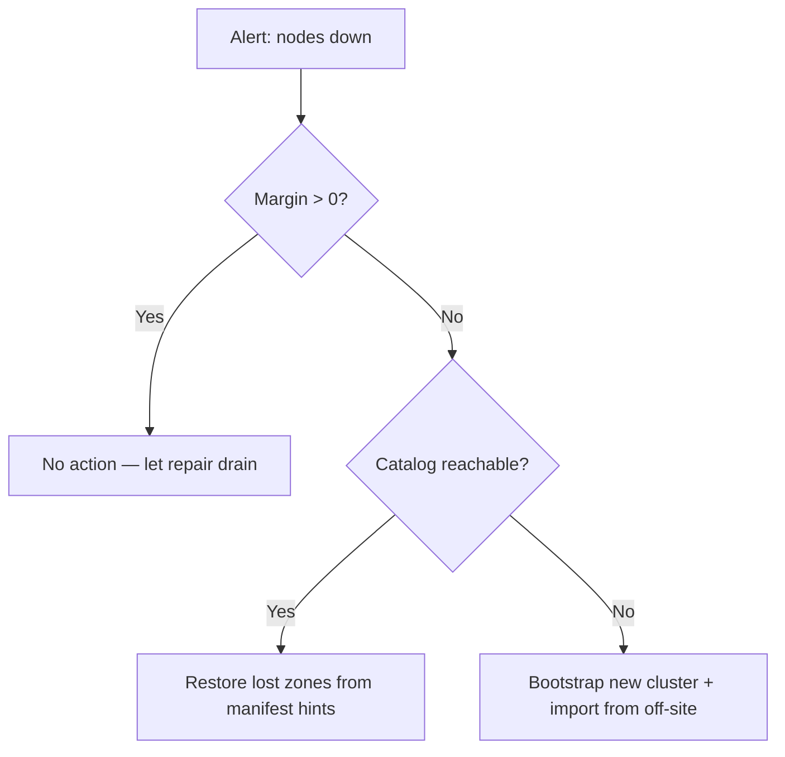

# Operations Guide

This guide describes how to **deploy**, **monitor**, **back up**, **recover**,
and **plan capacity** for a holofs cluster in production.

## Contents

1. [Deployment topologies](#1-deployment-topologies)
2. [Bare-metal install](#2-bare-metal-install)
3. [Docker / Compose](#3-docker--compose)
4. [Kubernetes via Helm](#4-kubernetes-via-helm)
5. [Configuration reference](#5-configuration-reference)
6. [Monitoring & alerting](#6-monitoring--alerting)
7. [Capacity planning](#7-capacity-planning)
8. [Backup & restore](#8-backup--restore)
9. [Disaster recovery](#9-disaster-recovery)
10. [Day-2 procedures](#10-day-2-procedures)

---

## 1. Deployment topologies

| Topology         | Use case                                        | Pros                            | Cons                                  |
|------------------|-------------------------------------------------|---------------------------------|---------------------------------------|
| Embedded         | Dev, demo, single-host evaluation               | One binary, no orchestration    | No machine-level fault tolerance      |
| Multi-process    | Single host, isolated process boundaries        | Restart nodes independently     | Still single point of failure (host)  |
| Multi-host       | Production: 40 nodes across 5 zones × 8 hosts   | Real durability, zone failover  | Requires network, monitoring, ops     |
| Kubernetes       | Cloud / on-prem with k8s                        | Helm-based, declarative         | Stateful sets are harder than stateless |

**Recommended production target:** ≥ 5 zones × ≥ 4 hosts × 1–2 nodes per host.
This survives **any one full-zone outage** plus simultaneous single-node
failures in remaining zones (see [theory.md §3](./theory.md#3-priority-layers)).

---

## 2. Bare-metal install

### 2.1. Prerequisites

- Linux (kernel ≥ 5.10), macOS, or Windows Server.
- 2 GB RAM and 10 GB disk per node minimum; 8 GB / 100 GB recommended.
- Open TCP ports: gateway (`8787`) and node ports (9100–9139 by default).
- A user account (e.g. `holofs`) with write access to data directory.

### 2.2. Build from source

```sh
# Pinned MSRV: 1.75
rustup install 1.75.0
cargo build --release --workspace
```

Binaries produced under `target/release/`:

| Binary           | Purpose                                       |
|------------------|-----------------------------------------------|
| `holofs`         | Main multi-command CLI                        |
| `holofs-node`    | Single node daemon                            |
| `holofs-web`     | HTTP gateway (axum + Leptos SSR)              |
| `holofs-admin`   | Cluster admin operations (whitelist, ban)     |
| `holofs-bench`   | Benchmarks                                    |
| `holofs-inspect` | Manifest / shard inspection                   |
| `holofs-cluster` | All-in-one (embedded N nodes + gateway)       |
| `holofs-fs`      | Local filesystem helpers                      |

### 2.3. Whitelist (required in production)

```sh
# 1. Generate per-node Ed25519 keypairs
holofs-admin keygen --out keys/

# 2. Build whitelist
holofs-admin whitelist build \
    --node 10.0.1.10:9100 --pubkey keys/node1.pub --zone 0 \
    --node 10.0.1.11:9100 --pubkey keys/node2.pub --zone 1 \
    --node 10.0.2.10:9100 --pubkey keys/node3.pub --zone 2 \
    --admin-key keys/admin.priv \
    --out whitelist.holofs

# 3. Distribute whitelist.holofs to every node + gateway
```

Wire format: `HOLOFSW1` (see [api.md §3.4](./api.md#34-whitelist-holofsw1)).

### 2.4. TLS for the wire protocol (`--tls`, `--mtls`)

The gateway↔node binary protocol can be encrypted with rustls (Stage 6).
Two opt-in flags control behaviour:

| Flag       | Effect |
|------------|--------|
| `--tls`    | Encrypt wire frames. Server cert is verified by the client. |
| `--mtls`   | Implies `--tls`. Server additionally requires + verifies a client cert. |

**Embedded mode (no `--whitelist`):** the binary generates a self-signed
CA + leaf certs at boot. Useful for dev, demos, single-host clusters. The
CA lives only in RAM and is regenerated on every restart — clients that
cache certs will see fresh issuers on each boot.

**Distributed mode (`--whitelist`):** supply pre-issued PEMs on the
command line. Generate them with `openssl` or your existing PKI:

```sh
# Issue one CA + one cert per host (script omitted — use your PKI).
holofs-web \
  --whitelist cluster.wl \
  --admin-pubkey "$(holofs-admin pubkey admin.key)" \
  --tls --mtls \
  --tls-ca-cert /etc/holofs/ca.crt \
  --tls-cert   /etc/holofs/gateway.crt \
  --tls-key    /etc/holofs/gateway.key
```

The corresponding node command picks up its own leaf — see the systemd
unit in §2.5 for the env-var form.

The cert files must satisfy:
- Leaf cert SANs must cover every `addr:port` host the gateway will
  connect to (DNS name or IP literal).
- The CA cert is the trust root on both sides — same file on every node
  and on every gateway.
- Under `--mtls` both sides present the same kind of leaf signed by that
  CA. Add a separate "gateway" cert if you want distinct CN values.

### 2.5. systemd service

`/etc/systemd/system/holofs-node@.service`:

```ini
[Unit]
Description=holofs node %i
After=network.target

[Service]
Type=simple
User=holofs
Group=holofs
Environment=HOLOFS_DATA_DIR=/var/lib/holofs/node%i
Environment=HOLOFS_LISTEN=0.0.0.0:91%i
Environment=HOLOFS_WHITELIST=/etc/holofs/whitelist.holofs
Environment=HOLOFS_SECRET_KEY=/etc/holofs/keys/node%i.priv
# Stage 6: enable TLS on the wire protocol. Drop the next four lines for
# plain-TCP clusters; set HOLOFS_MTLS=1 for mutual auth.
Environment=HOLOFS_TLS=1
Environment=HOLOFS_TLS_CA_CERT=/etc/holofs/ca.crt
Environment=HOLOFS_TLS_CERT=/etc/holofs/node%i.crt
Environment=HOLOFS_TLS_KEY=/etc/holofs/node%i.key
ExecStart=/usr/local/bin/holofs-node
Restart=on-failure
RestartSec=5s
LimitNOFILE=65536

[Install]
WantedBy=multi-user.target
```

Then `systemctl enable --now holofs-node@00 holofs-node@01 …`.

---

## 3. Docker / Compose

### 3.1. Pull image

```sh
docker pull ghcr.io/holofs/holofs:0.1.0
```

The Dockerfile is multi-stage: rust:1.75-slim → debian:bookworm-slim. The
runtime image runs as **non-root uid 10001**, with `tini` as PID 1.

### 3.2. Single-host cluster (embedded)

```sh
docker run -d \
  --name holofs \
  -p 8787:8787 \
  -v /srv/holofs:/var/lib/holofs \
  -e HOLOFS_N_NODES=40 \
  -e HOLOFS_DATA_DIR=/var/lib/holofs \
  ghcr.io/holofs/holofs:0.1.0 holofs-cluster
```

### 3.3. Multi-process via Compose

```yaml
services:
  node-0: { ... environment: { HOLOFS_LISTEN: 0.0.0.0:9100, HOLOFS_ZONE: 0 } }
  node-1: { ... environment: { HOLOFS_LISTEN: 0.0.0.0:9101, HOLOFS_ZONE: 0 } }
  ...
  gateway:
    command: holofs-web
    environment:
      HOLOFS_NODES: node-0:9100,node-1:9101,...
      HOLOFS_WHITELIST: /etc/holofs/whitelist.holofs
    ports: ["8787:8787"]
    depends_on: [node-0, node-1, ...]
```

---

## 4. Kubernetes via Helm

The Helm chart lives at `deploy/helm/holofs/`.

```sh
helm install holofs ./deploy/helm/holofs \
  --set nodeCount=40 \
  --set persistence.size=50Gi \
  --set ingress.enabled=true \
  --set ingress.hosts[0].host=holofs.example.com
```

**Key resources** (see `deploy/helm/holofs/templates/`):

- `StatefulSet` for nodes — stable network IDs, PVC per replica.
- `Service` (`ClusterIP`) for the gateway.
- `Ingress` (optional) for external HTTPS.

**Zone awareness:** `values.yaml` exposes `nodeAffinity` and `topologySpreadConstraints`.
Map your k8s zone label (e.g. `topology.kubernetes.io/zone`) to holofs zones via
`HOLOFS_ZONE_FROM_LABEL=topology.kubernetes.io/zone` (auto-derived from
`Downward API`).

**Probes:**

```yaml
livenessProbe:  { httpGet: { path: /,        port: http }, periodSeconds: 30 }
readinessProbe: { httpGet: { path: /health,  port: http }, periodSeconds: 10 }
```

**Security context:** runs as `uid 10001`, `readOnlyRootFilesystem: true`,
`capabilities.drop: [ALL]`.

---

## 5. Configuration reference

All configuration is via env vars (CLI flags also accepted; flags win).

### 5.1. Common to all binaries

| Variable                    | Default      | Description                                  |
|-----------------------------|--------------|----------------------------------------------|
| `HOLOFS_STORAGE_DIR`        | `./holofs-data` | Storage root for shards, catalog, manifests |
| `HOLOFS_LOG`                | `info,holofs_web=debug` | `tracing` filter spec               |
| `HOLOFS_LOG_FORMAT`         | `text`       | `text` \| `json` (production: `json`)         |
| `HOLOFS_TELEMETRY_OTLP`     | (off)        | OTLP endpoint, e.g. `http://otel:4317` (planned) |
| `HOLOFS_METRICS_LISTEN`     | (unset)      | Optional separate Prometheus listen address (default: serve on main port) |

Every variable has a matching CLI flag (`--storage`, `--log`, etc.) — run
`holofs-web --help` for the full list. Flags take precedence over env vars.

### 5.2. Node-specific

| Variable                    | Default        | Description                              |
|-----------------------------|----------------|------------------------------------------|
| `HOLOFS_LISTEN`             | `0.0.0.0:9100` | Wire-protocol bind address               |
| `HOLOFS_ZONE`               | `0`            | Zone ID (used by zone-aware placement)   |
| `HOLOFS_SECRET_KEY`         | —              | Path to Ed25519 secret (32 bytes)        |
| `HOLOFS_WHITELIST`          | —              | Path to signed whitelist                 |
| `HOLOFS_MAX_DISK_GB`        | `unlimited`    | Refuse Put once exceeded                 |

### 5.3. Gateway-specific

| Variable                    | Default        | Description                              |
|-----------------------------|----------------|------------------------------------------|
| `HOLOFS_NODES`              | —              | CSV of `addr:port` (initial bootstrap)   |
| `HOLOFS_MONITOR_INTERVAL`   | `15`           | Health-poll period (seconds)             |
| `HOLOFS_AUDIT_INTERVAL`     | `30`           | Background audit period (seconds)        |
| `HOLOFS_REPAIR_INTERVAL`    | `60`           | Background repair sweep                  |
| `HOLOFS_TLS`                | (off)          | Encrypt wire protocol (gateway↔nodes) with rustls. Embedded mode auto-generates a self-signed CA. |
| `HOLOFS_MTLS`               | (off)          | Implies `HOLOFS_TLS=1`. Server also requires + verifies a client cert. |
| `HOLOFS_TLS_CERT`           | —              | Distributed mode: PEM leaf cert path     |
| `HOLOFS_TLS_KEY`            | —              | Distributed mode: matching PEM key path  |
| `HOLOFS_TLS_CA_CERT`        | —              | Distributed mode: PEM CA trust root path |
| `HOLOFS_PLACEMENT`          | `rendezvous`   | `roundrobin` \| `rendezvous` \| `rendezvous-zone` |

### 5.4. Embedded cluster

| Variable                    | Default        | Description                              |
|-----------------------------|----------------|------------------------------------------|
| `HOLOFS_N_NODES`            | `40`           | Number of in-process nodes               |
| `HOLOFS_EMBED_BASE_PORT`    | `9100`         | Stable base port (avoid ephemeral churn) |
| `HOLOFS_ZONES`              | `5`            | Number of zones to assign                |

---

## 6. Monitoring & alerting

### 6.1. Metrics endpoint

The gateway exposes `GET /metrics` in Prometheus text exposition format
(`text/plain; version=0.0.4`). Pull-based gauges sourced from
`Gateway::api_stats` + admin-kill snapshot — no counters/histograms in the
initial release.

| Metric                          | Type  | Labels                       | Meaning |
|---------------------------------|-------|------------------------------|---------|
| `holofs_nodes_total`            | gauge | —                            | nodes in topology |
| `holofs_nodes_live`             | gauge | —                            | nodes not admin-disabled |
| `holofs_objects_total`          | gauge | `kind` (image/audio/text/opaque) | catalog size by kind |
| `holofs_shards_total`           | gauge | —                            | planned shards across catalog |
| `holofs_shards_unique`          | gauge | —                            | distinct shard hashes |
| `holofs_dedup_savings_pct`      | gauge | —                            | `(1 − unique/total) × 100` |
| `holofs_bytes_total`            | gauge | —                            | approximate stored bytes |
| `holofs_node_admin_killed`      | gauge | `node`, `addr`, `zone`       | per-node admin-kill flag |

Future releases will add counters and histograms for wire RTT, repair
throughput, decode latency, and reputation (currently logged via
`tracing` only).

### 6.2. Reference alert rules

```yaml
groups:
- name: holofs
  rules:
  - alert: HolofsNodeDown
    expr: holofs_node_up == 0
    for: 5m
    annotations:
      summary: "holofs node {{ $labels.node }} is down"

  - alert: HolofsZoneDegraded
    expr: count by (zone) (holofs_node_up == 0) >= 2
    for: 10m
    annotations:
      summary: "zone {{ $labels.zone }} has ≥2 dead nodes (margin loss)"

  - alert: HolofsDiskFillingFast
    expr: predict_linear(holofs_bytes_stored_total[1h], 24*3600) > node_filesystem_size_bytes
    for: 30m
    annotations:
      summary: "node {{ $labels.node }} will fill within 24h"

  - alert: HolofsRepairFailing
    expr: rate(holofs_repair_jobs_total{result="failed"}[15m]) > 0.1
    for: 30m

  - alert: HolofsLowReputation
    expr: holofs_node_reputation < 0.5
    for: 1h
    annotations:
      summary: "node {{ $labels.node }} reputation collapsed (audit mismatches)"
```

### 6.3. Tracing

When `HOLOFS_TELEMETRY_OTLP` is set, the gateway exports OTLP/HTTP spans:

| Span name              | Useful attributes                          |
|------------------------|--------------------------------------------|
| `gateway.put`          | `object.kind`, `bytes.in`, `shards.out`    |
| `gateway.get`          | `object.kind`, `layers`, `bytes.out`, `nodes_contacted` |
| `gateway.repair`       | `object_id`, `channel`, `layer`, `shards_recovered` |
| `wire.send`            | `op`, `target.node`, `bytes`               |

### 6.4. Dashboards

A reference Grafana dashboard JSON ships at `deploy/grafana/holofs.json`.
Top panels: ingest rate, decode P99 by kind, dedup %, repair throughput,
per-zone node availability heatmap.

---

## 7. Capacity planning

### 7.1. Storage overhead

Storage cost is dominated by RLNC redundancy across priority layers. For an
object of payload size `S`:

$$
\text{stored bytes} \approx S \cdot \sum_{\ell} R_\ell \cdot \frac{N_\ell}{K_\ell}
$$

For default layer ratios `R = [4.0, 2.5, 1.6, 1.15]`, average overhead is
roughly **9.25×** (counting metadata, ~9.4×).

| Object size | Stored on cluster | Per-node (40 nodes) |
|-------------|-------------------|---------------------|
| 1 MB        | ~9.4 MB           | ~235 KB             |
| 1 GB        | ~9.4 GB           | ~235 MB             |
| 1 TB        | ~9.4 TB           | ~235 GB             |

**Tune for cheaper storage:** lower `R_0` (catastrophic-loss redundancy)
to `2.0` and `R_1..3` to `[1.5, 1.2, 1.05]` — overhead drops to ~5.75×.
See [theory.md §3](./theory.md#3-priority-layers) for the survival-margin
trade-off.

### 7.2. CPU planning

| Operation              | Cost (relative to memcpy) | Bottleneck    |
|------------------------|---------------------------|---------------|
| GF(2⁸) multiply        | 4× memcpy (LUT)           | L1 cache      |
| Haar 2D forward        | 3× memcpy                 | RAM bandwidth |
| RLNC encode K=16, payload 1024 B | 60× memcpy        | CPU           |
| SHA-256 over 1 MB      | 2× memcpy (with SIMD)     | CPU           |

A modern x86_64 core sustains ~150 MB/s of RLNC encode for K=16. Multi-core
scales linearly until disk IO becomes the bottleneck (~500 MB/s on NVMe).

### 7.3. Network planning

Worst-case wire bandwidth per Put:

```
egress = payload × redundancy_factor × layer_count
       ≈ payload × 9.25
```

For a 100 MB upload, the gateway emits ~925 MB to the node pool. Plan for
**at least 1 Gbit/s** between gateway and nodes.

### 7.4. Right-sizing the cluster

| Property                  | Choose by                                  |
|---------------------------|--------------------------------------------|
| `N_nodes`                 | ≥ 4 × `K` so RLNC has placement slack      |
| `N_zones`                 | ≥ 3; 5 recommended for any-one-zone-loss   |
| `K`                       | 16 (default) — sweet spot of CPU vs margin |
| `redundancy_per_layer`    | match desired ≥ 5σ survival margin         |

---

## 8. Backup & restore

### 8.1. What lives on disk

Per node (`HOLOFS_DATA_DIR`):

```
manifests/         per-object manifests (HOLOFSM6)
catalog/HOLOFSD1   the directory index (atomic write)
shards/aa/bb……    .shard files, content-addressed
identity/secret    Ed25519 private key
whitelist.holofs   admin-signed peer list
```

### 8.2. Backup model

**holofs is its own backup** for any *single* object — losing a node
triggers RLNC repair from siblings. Backup matters for:

1. **Catastrophic cluster loss** (e.g. all zones offline).
2. **Logical corruption / accidental delete** (`Purge` is irreversible).
3. **Identity material** (Ed25519 keys + signed whitelist) — without
   these, replacements cannot rejoin a trusted cluster.

### 8.3. Recommended backup plan

| Data                 | Frequency       | Tooling                   | Where               |
|----------------------|-----------------|---------------------------|---------------------|
| Identity + whitelist | On every change | `restic`, `aws s3 sync`   | Encrypted off-site  |
| Catalog snapshot     | Hourly          | `cp catalog/HOLOFSD1 → …` | S3 / NFS / tape     |
| Shard dir            | Optional        | `restic` or zfs snapshots | Cold storage        |

A periodic `holofs-admin export <name>` reconstructs an object into a
single canonical file and writes it to an external bucket. This is the
recommended way to back up **specific high-value objects**.

### 8.4. Restore procedures

| Scenario                              | Procedure |
|---------------------------------------|-----------|
| Single node disk lost                 | Wipe disk; restart node; cluster auto-repairs shards. |
| Multiple nodes lost, < margin         | No action needed — RLNC decode tolerates it. |
| Catalog corrupt on gateway            | Copy `catalog/HOLOFSD1` from a peer gateway or the latest hourly backup; restart. |
| Whole cluster lost                    | Provision new cluster; `holofs-admin import` each off-site export. |
| Whitelist key compromise              | Generate new admin key; re-sign whitelist; hot-reload (see [§10.4](#104-hot-reload-whitelist)). |

---

## 9. Disaster recovery

### 9.1. RTO / RPO targets

| Failure                       | RTO       | RPO     | Trigger                              |
|-------------------------------|-----------|---------|--------------------------------------|
| Single node                   | < 1 min   | 0       | Auto (monitor + repair)              |
| Single zone (≤ ⅕ of nodes)    | < 5 min   | 0       | Auto (margin still positive)         |
| Two zones simultaneously       | < 1 hr    | Hours   | Manual: re-provision + import        |
| Whole cluster                 | < 8 hr    | ≤ 1 hr  | Manual: full restore from S3 backups |

### 9.2. Decision tree



### 9.3. Drills

Run quarterly. Suggested scenarios:

1. **Zone-kill drill** — `kubectl drain` all pods in one zone label; assert
   no object becomes unreachable and repair completes in < 10 min.
2. **Cold-restore drill** — from a fresh k8s cluster, run `holofs-admin
   import-all` against a backup bucket; measure RTO.
3. **Key rotation drill** — sign a new whitelist with admin key, hot-reload
   without downtime.

---

## 10. Day-2 procedures

### 10.1. Add a node

```sh
# 1. Generate new node key
holofs-admin keygen --out keys/node41.priv

# 2. Re-sign whitelist with new entry
holofs-admin whitelist add \
  --whitelist whitelist.holofs \
  --node 10.0.3.10:9100 --pubkey keys/node41.pub --zone 4 \
  --admin-key keys/admin.priv \
  --out whitelist.holofs.new

# 3. Distribute, hot-reload, then start node
```

Catalog is unchanged; future placements may pick the new node via HRW.
Existing objects are **not** rebalanced automatically — run
`holofs-admin rebalance` to migrate shards (optional; not needed for
correctness).

### 10.2. Remove (decommission) a node

```sh
# 1. Drain — refuse new Puts, finish in-flight
holofs-admin node drain 10.0.1.10:9100

# 2. Wait for repair to redistribute its shards
holofs-admin node status 10.0.1.10:9100
# → "drained, 0 shards remaining"

# 3. Remove from whitelist
holofs-admin whitelist remove --node 10.0.1.10:9100 …

# 4. Shut down systemd unit
systemctl stop holofs-node@10
```

### 10.3. Replace a failed disk

1. `systemctl stop holofs-node@N`
2. Replace disk, mount fresh filesystem at `HOLOFS_DATA_DIR`.
3. Restore identity files (`identity/secret`, `whitelist.holofs`) from
   the off-site backup — these are tied to the node's address, not the
   disk.
4. `systemctl start holofs-node@N` — the cluster will refill the disk via
   audit-driven repair within minutes to hours depending on size.

### 10.4. Hot-reload whitelist

```sh
# Drop new whitelist file into place
cp whitelist.holofs.new /etc/holofs/whitelist.holofs

# Signal all daemons
killall -SIGHUP holofs-node holofs-web
```

Daemons re-verify the admin signature before swapping in the new list. A
bad signature is logged and the old list is kept.

### 10.5. Rolling upgrade

Holofs guarantees wire-protocol compatibility within a minor version
(`0.x → 0.x+1` is safe). For k8s:

```sh
helm upgrade holofs ./deploy/helm/holofs --set image.tag=0.2.0
```

The StatefulSet rolls one pod at a time, waits for readiness, then
proceeds. During the rollout the cluster operates degraded by exactly one
node — well within margin for any default sizing.

### 10.6. Health command cheatsheet

```sh
# Cluster-wide overview
curl -s http://gw:8787/api/stats | jq

# Per-node health (HTML in browser; JSON via accept header)
curl -s -H "accept: application/json" http://gw:8787/health

# Margin per (channel, layer) for one object
curl -s http://gw:8787/health/photo.png

# Inspect shard distribution
curl -s http://gw:8787/inspect/photo.png
```

See [api.md](./api.md) for full route inventory.
