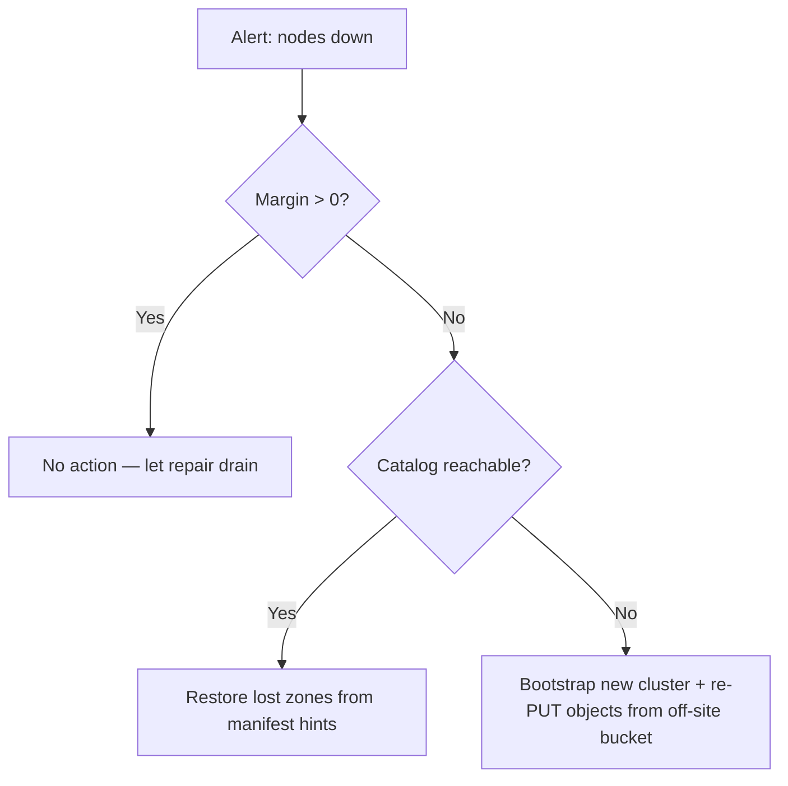

# Operations Guide

This guide describes how to **deploy**, **monitor**, **back up**, **recover**,
and **plan capacity** for a holofs cluster in production.

## Contents

1. [Deployment topologies](#1-deployment-topologies)
2. [Bare-metal install](#2-bare-metal-install)
3. [Docker / Compose](#3-docker--compose)
4. [Kubernetes via Helm](#4-kubernetes-via-helm)
5. [Configuration reference](#5-configuration-reference)
6. [Monitoring & alerting](#6-monitoring--alerting)
7. [Capacity planning](#7-capacity-planning)
8. [Backup & restore](#8-backup--restore)
9. [Disaster recovery](#9-disaster-recovery)
10. [Day-2 procedures](#10-day-2-procedures)

---

## 1. Deployment topologies

| Topology         | Use case                                        | Pros                            | Cons                                  |
|------------------|-------------------------------------------------|---------------------------------|---------------------------------------|
| Embedded         | Dev, demo, single-host evaluation               | One binary, no orchestration    | No machine-level fault tolerance      |
| Multi-process    | Single host, isolated process boundaries        | Restart nodes independently     | Still single point of failure (host)  |
| Multi-host       | Production: 40 nodes across 5 zones × 8 hosts   | Real durability, zone failover  | Requires network, monitoring, ops     |
| Kubernetes       | Cloud / on-prem with k8s                        | Helm-based, declarative         | Stateful sets are harder than stateless |

**Recommended production target:** ≥ 5 zones × ≥ 4 hosts × 1–2 nodes per host.
This survives **any one full-zone outage** plus simultaneous single-node
failures in remaining zones (see [theory.md §4](./theory.md#4-priority-layers-and-holographic-degradation)).

---

## 2. Bare-metal install

### 2.1. Prerequisites

- Linux (kernel ≥ 5.10), macOS, or Windows Server.
- 2 GB RAM and 10 GB disk per node minimum; 8 GB / 100 GB recommended.
- Open TCP ports: gateway (`8787`) and node ports (9100–9139 by default).
- A user account (e.g. `holofs`) with write access to data directory.

### 2.2. Build from source

```sh
# Pinned MSRV: 1.81
rustup install 1.81.0
cargo build --release --workspace
```

Binaries produced under `target/release/`:

| Binary           | Purpose                                       |
|------------------|-----------------------------------------------|
| `holofs-web`     | HTTP gateway + embedded cluster (axum + Leptos SSR) |
| `holofs-node`    | Standalone node daemon (`ADDR --storage DIR`) |
| `holofs-admin`   | Whitelist keygen + signing                    |
| `holofs-cluster` | Local dev harness: N in-process nodes + gateway |
| `holofs-fs`      | Local filesystem playground                   |
| `holofs-inspect` | Manifest / shard inspection                   |
| `holofs-bench`   | Benchmarks                                    |
| `holofs-soak`    | Long-running random-op driver against a live gateway |
| `holofs-soak-report` | Render HTML + Markdown report from a soak-run directory |
| `holofs`         | Legacy single-command CLI                     |

### 2.3. Whitelist (required in production)

```sh
# 1. Generate an admin keypair (kept offline; only the pubkey is distributed).
holofs-admin gen-key admin.key
holofs-admin pubkey admin.key   # prints ADMIN_PUBKEY_HEX

# 2. Boot each node once so it materialises its own identity.key and
#    prints its pubkey — collect these hex strings.
holofs-node 10.0.1.10:9100 --storage /var/lib/holofs/node00
# → holofs-node addr=10.0.1.10:9100 pubkey=NODE0_PUBKEY_HEX

# 3. Sign the whitelist. Each --node is ADDR=PUBKEY_HEX:ZONE.
holofs-admin sign-whitelist \
    --admin admin.key \
    --node 10.0.1.10:9100=NODE0_PUBKEY_HEX:0 \
    --node 10.0.1.11:9100=NODE1_PUBKEY_HEX:0 \
    --node 10.0.2.10:9100=NODE2_PUBKEY_HEX:1 \
    --out whitelist.holofs

# 4. Distribute whitelist.holofs to every node + gateway. Verify with:
holofs-admin verify-whitelist whitelist.holofs --admin-pubkey ADMIN_PUBKEY_HEX
holofs-admin show-whitelist   whitelist.holofs
```

Wire format: `HOLOFSW1` (see [api.md §3.4](./api.md#34-whitelist-holofsw1)).

### 2.4. TLS for the wire protocol (`--tls`, `--mtls`)

The gateway↔node binary protocol can be encrypted with rustls.
Two opt-in flags control behaviour:

| Flag       | Effect |
|------------|--------|
| `--tls`    | Encrypt wire frames. Server cert is verified by the client. |
| `--mtls`   | Implies `--tls`. Server additionally requires + verifies a client cert. |

**Embedded mode (no `--whitelist`):** the binary generates a self-signed
CA + leaf certs at boot. Useful for dev, demos, single-host clusters. The
CA lives only in RAM and is regenerated on every restart — clients that
cache certs will see fresh issuers on each boot.

**Distributed mode (`--whitelist`):** supply pre-issued PEMs on the
command line. Generate them with `openssl` or your existing PKI:

```sh
# Issue one CA + one cert per host (script omitted — use your PKI).
holofs-web \
  --whitelist cluster.wl \
  --admin-pubkey "$(holofs-admin pubkey admin.key)" \
  --tls --mtls \
  --tls-ca-cert /etc/holofs/ca.crt \
  --tls-cert   /etc/holofs/gateway.crt \
  --tls-key    /etc/holofs/gateway.key
```

The corresponding node command picks up its own leaf — see the systemd
unit in §2.5 for the env-var form.

The cert files must satisfy:

- Leaf cert SANs must cover every `addr:port` host the gateway will
  connect to (DNS name or IP literal).
- The CA cert is the trust root on both sides — same file on every node
  and on every gateway.
- Under `--mtls` both sides present the same kind of leaf signed by that
  CA. Add a separate "gateway" cert if you want distinct CN values.

### 2.5. systemd service

`/etc/systemd/system/holofs-node@.service`:

```ini
[Unit]
Description=holofs node %i
After=network.target

[Service]
Type=simple
User=holofs
Group=holofs
Environment=HOLOFS_STORAGE_DIR=/var/lib/holofs/node%i
ExecStart=/usr/local/bin/holofs-node 0.0.0.0:91%i --storage /var/lib/holofs/node%i
Restart=on-failure
RestartSec=5s
LimitNOFILE=65536

[Install]
WantedBy=multi-user.target
```

Then `systemctl enable --now holofs-node@00 holofs-node@01 …`.

---

## 3. Docker / Compose

### 3.1. Pull image

```sh
docker pull ghcr.io/holofs/holofs:1.0.0
```

The Dockerfile is multi-stage: rust:1.81-slim-bookworm → debian:bookworm-slim.
The runtime image runs as **non-root uid 10001**, with `tini` as PID 1.

### 3.2. Single-host cluster (embedded)

```sh
docker run -d \
  --name holofs \
  -p 8787:8787 \
  -v /srv/holofs:/data \
  ghcr.io/holofs/holofs:1.0.0
```

### 3.3. Compose

The runtime image ships a single embedded gateway (`holofs-web` with
`N_NODES` in-process nodes). Compose is only useful if you want to
compose the image with a reverse proxy / TLS terminator.

```yaml
services:
  holofs:
    image: ghcr.io/holofs/holofs:1.0.0
    volumes: ["/srv/holofs:/data"]
    environment:
      HOLOFS_LOG_FORMAT: json
      HOLOFS_ENABLE_EMBED: "1"
      HOLOFS_ENABLE_VERSIONS: "1"
    ports: ["8787:8787"]
```

A true multi-host distributed setup (separate `holofs-node` daemons +
one `holofs-web` gateway with a signed whitelist) is currently wired
via bare-metal / k8s, not Compose — the node daemon does not read the
Compose-friendly `HOLOFS_*` env-var set, only its positional address
and `--storage` flag.

---

## 4. Kubernetes via Helm

The Helm chart lives at `deploy/helm/holofs/`.

```sh
helm install holofs ./deploy/helm/holofs \
  --set nodeCount=40 \
  --set persistence.size=50Gi \
  --set ingress.enabled=true \
  --set ingress.hosts[0].host=holofs.example.com
```

**Key resources** (see `deploy/helm/holofs/templates/`):

- `StatefulSet` for nodes — stable network IDs, PVC per replica.
- `Service` (`ClusterIP`) for the gateway.
- `Ingress` (optional) for external HTTPS.

**Zone awareness:** `values.yaml` exposes `nodeAffinity` and
`topologySpreadConstraints` for spreading the StatefulSet across k8s
zones. Zone assignment inside holofs itself is currently a
compile-time constant on the embedded cluster path — cross-zone
placement in a distributed setup comes from the signed whitelist
entries (`ADDR=PUBKEY_HEX:ZONE`).

**Probes:**

```yaml
livenessProbe:  { httpGet: { path: /,        port: http }, periodSeconds: 30 }
readinessProbe: { httpGet: { path: /health,  port: http }, periodSeconds: 10 }
```

**Security context:** runs as `uid 10001`, `readOnlyRootFilesystem: true`,
`capabilities.drop: [ALL]`.

---

## 5. Configuration reference

All configuration is via env vars (CLI flags also accepted; flags win).

### 5.1. Gateway (`holofs-web`)

| Variable                    | Default              | Description                                  |
|-----------------------------|----------------------|----------------------------------------------|
| `HOLOFS_STORAGE_DIR`        | `./holofs-data`      | Storage root for shards, catalog, manifests. |
| `HOLOFS_CATALOG`            | `<storage>/catalog.bin` | Override the catalog path.                |
| `HOLOFS_CONFIG`             | (unset)              | Path to a TOML config file (§5.7).           |
| `HOLOFS_LOG`                | `info,holofs_web=debug` | `tracing` filter spec.                    |
| `HOLOFS_LOG_FORMAT`         | `text`               | `text` \| `json` (production: `json`).       |
| `LEPTOS_SITE_ADDR`          | `127.0.0.1:8787`     | HTTP listen address (`--addr`).              |
| `HOLOFS_METRICS_LISTEN`     | (unset)              | Optional separate Prometheus listen address. |
| `HOLOFS_SEED_PHOTO`         | (unset)              | Path to a PNG that seeds `photo.png` on first boot. |
| `HOLOFS_NO_SEED`            | `false`              | Skip the two-PNG demo seed on an empty catalog. |

Every variable in this table has a matching CLI flag (`--storage`,
`--log`, `--addr`, etc.) — run `holofs-web --help` for the canonical
list. Flags take precedence over env vars.

### 5.2. Standalone `holofs-node`

The standalone node daemon takes only positional arguments and does
not read any `HOLOFS_*` env vars — it is intentionally minimal so the
same binary works under systemd, docker, or hand-invocation.

```text
holofs-node [ADDR] [--storage DIR]
```

`ADDR` defaults to `127.0.0.1:5000`. `--storage DIR` switches on
persistent identity + shards; without it the node runs in-memory and
regenerates its pubkey on every start (dev/demo only).

### 5.3. Distributed-mode gateway (whitelist + TLS)

| Variable                    | Default        | Description                              |
|-----------------------------|----------------|------------------------------------------|
| `HOLOFS_WHITELIST`          | —              | Path to a signed whitelist (§2.3). Switches the binary into distributed mode. |
| `HOLOFS_ADMIN_PUBKEY`       | —              | 64-char hex of the admin pubkey that signed the whitelist. |
| `HOLOFS_TLS`                | (off)          | Encrypt wire protocol (gateway↔nodes) with rustls. Embedded mode auto-generates a self-signed CA. |
| `HOLOFS_MTLS`               | (off)          | Implies `HOLOFS_TLS=1`. Server also requires + verifies a client cert. |
| `HOLOFS_TLS_CERT`           | —              | Distributed mode: PEM leaf cert path.    |
| `HOLOFS_TLS_KEY`            | —              | Distributed mode: matching PEM key path. |
| `HOLOFS_TLS_CA_CERT`        | —              | Distributed mode: PEM CA trust root path. |

### 5.4. Embedded cluster

Embedded topology (`holofs-web` without `--whitelist`) sizes are
compile-time constants: `N_NODES = 40`, `NLAYERS = 4`, `K = 16`,
`LEVELS = 3`. Only the port base and the seed behaviour are
runtime-adjustable.

| Variable                    | Default | Description                                    |
|-----------------------------|---------|------------------------------------------------|
| `HOLOFS_EMBED_BASE_PORT`    | `9100`  | Stable base port for the in-process nodes; each node binds `base + idx`. Skip to avoid ephemeral-port churn. |
| `HOLOFS_NO_SEED`            | `false` | Skip the two-PNG demo seed on an empty catalog. Set to `true` when re-uploading from a known sample tree so the seed doesn't collide with your data. |
| `HOLOFS_W` / `HOLOFS_H`     | `512`   | Frame dimensions (both must be a positive multiple of `2^LEVELS = 8`). |

### 5.5. Reliability

| Variable                    | Default | Description                                              |
|-----------------------------|---------|----------------------------------------------------------|
| `HOLOFS_RPC_TIMEOUT_MS`     | `8000`  | Per-RPC overall budget (`tokio::time::timeout`). `0` disables the cap; the OS-level TCP timeout (60-75 s) is then the only stop. |
| `HOLOFS_SCRUB_INTERVAL`     | `600`   | Background shard scrub period (seconds). `0` disables. Scrubs walk the catalog, diff `list_node_hashes` vs `place_shard`, repair the mismatches before users hit them. |
| `HOLOFS_VERSIONS_KEEP_LAST` | `0`     | Per-name version-history cap. Drops oldest archives on every PUT. `0` = unlimited (manual `/api/versions/delete` is then the only path to reclaim shards). Requires `--enable-versions`. |
| `HOLOFS_POOL_PER_NODE`      | `8`     | Max idle pooled wire connections per node addr.         |
| `HOLOFS_POOL_IDLE_SECS`     | `60`    | Drop pooled entries idle longer than this on `acquire`. |
| `HOLOFS_POOL_DISABLE`       | `false` | Bypass the keepalive pool — every RPC dials fresh. Useful when chasing wire-level bugs. |

### 5.5.c. Per-IP rate limit

Complements the global backpressure caps: the caps stop the process
from exploding under any burst — this layer stops a single
misbehaving client from starving every other caller. Both apply to
the MEDIUM (decode / PUT / dir ops) and LONG (search / spotlight /
GC) buckets; SHORT and streaming endpoints stay unlimited.

| Variable                        | Default   | Description                                              |
|---------------------------------|-----------|----------------------------------------------------------|
| `HOLOFS_RATE_LIMIT_RPS_PER_IP`  | `0`       | Token bucket refill rate per client IP. Zero disables the layer entirely. |
| `HOLOFS_RATE_LIMIT_BURST`       | `2 × rps` | Max tokens a bucket holds. On empty bucket the request 429s with `Retry-After: 1`. |
| `HOLOFS_RATE_LIMIT_IDLE_SECS`   | `300`     | Idle-eviction threshold for the per-IP map (bounded memory under high-churn client populations). |

**Client-IP source.** Behind a reverse proxy the middleware reads
the first hop of `X-Forwarded-For`. Direct connections use
`ConnectInfo<SocketAddr>` from
`into_make_service_with_connect_info`. Neither present → shared
`0.0.0.0` bucket so noisy hosts don't get a per-connection free
pass.

**Metric.** `holofs_rate_limit_rejected_total` counts every 429
response. Sustained non-zero rate suggests either an abusive
client (investigate) or an under-provisioned cap (raise
`rate_limit_rps_per_ip`).

### 5.5.b. Streaming PUT

| Variable                    | Default   | Description                                              |
|-----------------------------|-----------|----------------------------------------------------------|
| `HOLOFS_UPLOAD_MAX_SIZE`    | `1 GiB`   | Per-request body cap for `PUT /*path`. The body streams straight to `<storage>/uploads/upload-<pid>-<counter>.tmp` (constant RAM regardless of client speed / body size) and is read back into a `Vec<u8>` right before `Gateway::ingest_bytes`. Bodies exceeding the cap return 413 Payload Too Large; the tempfile is deleted on every exit path. |

Streaming keeps the gateway RSS delta bounded by the copy buffer
(~64 KiB) rather than the client's upload rate — a slow client on a
200 MiB upload no longer pins 200 MiB of gateway memory for the
duration. RSS still spikes to body size briefly at ingest time
because the RLNC / DWT codec expects `&[u8]`; a fully-streaming
ingest is out of scope until the codec supports it.

### 5.6. Reliability layer

Every knob below has a safe default; the gateway boots successfully
with none of them set.

| Variable                              | Default | Description                                              |
|---------------------------------------|---------|----------------------------------------------------------|
| `HOLOFS_MEDIUM_CONCURRENCY`           | `64`    | Permits for the MEDIUM route bucket (decodes, PUT, dir ops). On saturation the handler middleware returns 503 with a diagnostic body instead of piling axum tasks. Tune against `holofs_backpressure_permits_available{bucket="medium"}`. |
| `HOLOFS_LONG_CONCURRENCY`             | `8`     | Permits for the LONG bucket (semantic search, spotlight, `/api/gc`, `/api/embed_all`, fingerprint scans). |
| `HOLOFS_REPUTATION_PERSIST_INTERVAL`  | `30`    | How often the shared `Reputation` state is snapshotted to `<storage>/reputation.bin`. The bootstrap loads it back next start; a `n_nodes` mismatch or corrupt file silently falls back to a fresh table. A final snapshot is also written on SIGTERM. |
| `HOLOFS_ADMIN_TOKEN`                  | _(unset)_ | When set, `POST /admin/node` and `POST /api/gc` require `Authorization: Bearer <token>`. Missing/wrong → 401. |
| `HOLOFS_ADMIN_UNAUTHENTICATED`        | _(unset)_ | Dev override: set to `1` to leave the admin surface open when `HOLOFS_ADMIN_TOKEN` is unset. Logs a WARN at boot. If neither var is set the admin surface is disabled (403). |

Timeouts are hard-coded per bucket by design (SHORT 10 s, MEDIUM 60 s,
LONG 300 s); streaming endpoints (SSE, multipart/x-mixed-replace) +
`/mcp` are intentionally unbudgeted. Elapsed handlers surface as
`504 Gateway Timeout` and increment
`holofs_handler_timeouts_total{bucket=…}`.

### 5.7. Optional features

| Variable                    | Default | Description                                              |
|-----------------------------|---------|----------------------------------------------------------|
| `HOLOFS_ENABLE_VERSIONS`    | `false` | Mirror of `--enable-versions`. Archives every PUT-replace as a side file under `<storage>/versions/<sanitized>/v…bin`. |
| `HOLOFS_ENABLE_EMBED`       | `false` | Mirror of `--enable-embed`. Loads the CLIP-multilingual model on first PUT or first `/api/search`, then maintains `embeddings.bin`. |
| `HOLOFS_ASYNC_ENCODE`       | `false` | Flip the default RLNC PUT path from sync to async. Handler returns `202 Accepted` after the placeholder manifest is committed; encode + shard fan-out run on a detached tokio task. Read-side handlers gate on `ManifestState` — see §10.7 for the measured throughput impact and when it's appropriate. |
| `HOLOFS_MCP_TOKEN`          | —       | When set, the `/mcp` endpoint requires `Authorization: Bearer <token>` AND flips write tools on. Without the variable the endpoint stays open + read-only. |

### 5.8. TOML configuration file

Every env var above (`HOLOFS_*` and `LEPTOS_SITE_ADDR`) is also
settable through a single TOML config file passed via
`--config /path/to/holofs.toml` or the `HOLOFS_CONFIG` env var.
A commented reference config lives at
[`deploy/holofs.example.toml`](../deploy/holofs.example.toml).

Priority ladder (highest wins):

1. CLI flag (`--medium-concurrency 128`)
2. Env var (`HOLOFS_MEDIUM_CONCURRENCY=128`)
3. Value from the TOML file (`[reliability] medium_concurrency = 128`)
4. Compile-time default

**Example**:

```toml
[server]
addr = "0.0.0.0:8787"
storage = "/var/lib/holofs"
log_format = "json"

[tls]
enabled = true
mtls = true
cert = "/etc/holofs/node.crt"
key = "/etc/holofs/node.key"
ca_cert = "/etc/holofs/ca.crt"

[reliability]
medium_concurrency = 128
long_concurrency = 16
scrub_interval_secs = 300

[admin]
# Inline token OR reference a file (recommended for secrets).
token_file = "/etc/holofs/admin.token"
```

**Secrets.** `[admin] token` and `[mcp] token` accept either an inline
string or a `token_file` path pointing at a file whose first
non-empty line is the token. For production, prefer `token_file`
with mode `0400` and root ownership so the token isn't visible in
the config file's git history / bundled Helm chart.

**Unknown fields**. TOML uses `deny_unknown_fields` at parse time —
a typo in `medium_concurency` (missing 'r') fails loud at boot
with the exact key name in the error. This is intentional; a
silent fallback would defeat the purpose of the file.

### 5.9. At-rest shard encryption

Enable with `HOLOFS_AT_REST_ENC=1` (or `[security]
at_rest_encryption = true` in the TOML). When on, every shard file
written to disk is sealed with AES-256-GCM. The header stays in
plaintext (so `Store::open` can still index without the key), but
the coefficients + encoded chunk payload are ciphertext.

**Key management.** The 32-byte AES key is derived at boot from the
node's identity seed via HKDF-SHA256
(`salt = "holofs-shard-salt-v1"`, `info = "holofs-shard-key-v1"`).
No new secret to rotate — losing `identity.key` already loses the
node's identity. The key stays in RAM for the process's lifetime;
root on a running node can read plaintext through a legitimate
audit path.

**Wire format.** Two shard magics coexist:

| Magic       | Meaning                                                     |
|-------------|-------------------------------------------------------------|
| `HOLOFSS1`  | Plaintext. Read by every version.                           |
| `HOLOFSS2`  | Sealed. `[8 B magic][18 B header][12 B nonce][ct+tag]`.     |

The 18-byte header is AAD to the GCM tag, so any post-hoc header
rewrite (object_id, channel, layer, lengths) invalidates the shard
on decrypt. Reads sniff the first 8 bytes and dispatch — mixed v1 +
v2 directories are supported so enabling on an existing store
seals only *new* writes. A full re-encryption pass is out of scope;
the recommended migration is to spawn a fresh node with a fresh
identity and let the auto-repair pass rebalance shards onto it.

**Threat model.** In scope: an adversary snapshots the shard files
off a powered-off node (backup leak, decommissioned disk, RAID
rebuild left the old drive readable). Out of scope: root on a
running node — once the derived key is in RAM,
`read_shard_file` produces plaintext for legitimate audits.

---

## 6. Monitoring & alerting

### 6.1. Metrics endpoint

The gateway exposes `GET /metrics` in Prometheus text exposition format
(`text/plain; version=0.0.4`). Pull-based gauges sourced from
`Gateway::api_stats` + admin-kill snapshot plus reliability
counters.

| Metric                                       | Type    | Labels                       | Meaning |
|----------------------------------------------|---------|------------------------------|---------|
| `holofs_nodes_total`                         | gauge   | —                            | nodes in topology |
| `holofs_nodes_live`                          | gauge   | —                            | nodes not admin-disabled |
| `holofs_objects_total`                       | gauge   | `kind` (image/audio/text/opaque/directory) | catalog size by kind |
| `holofs_shards_total`                        | gauge   | —                            | planned shards across catalog |
| `holofs_shards_unique`                       | gauge   | —                            | distinct shard hashes |
| `holofs_dedup_savings_pct`                   | gauge   | —                            | `(1 − unique/total) × 100` |
| `holofs_bytes_total`                         | gauge   | —                            | approximate stored bytes |
| `holofs_node_admin_killed`                   | gauge   | `node`, `addr`, `zone`       | per-node admin-kill flag |
| `holofs_auto_repairs_total`                  | counter | —                            | GETs that triggered `decode_with_autorepair`'s retry arm |
| `holofs_auto_repair_failures_total`          | counter | —                            | auto-repair passes that themselves failed |
| `holofs_scrub_runs_total`                    | counter | —                            | background scrub ticks completed (`HOLOFS_SCRUB_INTERVAL`) |
| `holofs_scrub_repairs_total`                 | counter | —                            | objects the scrub repaired *before* any user hit them |
| `holofs_catalog_persist_failures_total`      | counter | —                            | Atomic catalog save-to-disk errors. Non-zero = on-disk state is behind memory; next restart loses writes. Alert immediately. |
| `holofs_handler_timeouts_total`              | counter | `bucket` (short/medium/long) | 504 responses caused by the per-bucket deadline. |
| `holofs_backpressure_rejected_total`         | counter | `bucket` (medium/long)       | 503 responses caused by the semaphore being at capacity. |
| `holofs_backpressure_permits_available`      | gauge   | `bucket` (medium/long)       | Permits still free. Constantly at 0 = under-provisioned bucket; constantly at max = idle. |
| `holofs_supervised_task_restarts_total`      | counter | `task` (monitor/auditor/scrub) | Supervised loop panics + unexpected exits. Any non-zero flags a repeated crash the operator should investigate. |
| `holofs_admin_auth_failures_total`           | counter | `outcome` (missing/bad/disabled) | Admin bearer-token rejections split by reason. `disabled` = surface refused because neither `HOLOFS_ADMIN_TOKEN` nor `HOLOFS_ADMIN_UNAUTHENTICATED` is set. |
| `holofs_rate_limit_rejected_total`           | counter | —                            | Per-IP token-bucket rejections (429). Zero when `HOLOFS_RATE_LIMIT_RPS_PER_IP=0`. |
| `holofs_objects_encoding`                    | gauge   | —                            | Objects currently in the `state=Encoding` async-ingest queue. Sustained at `HOLOFS_ENCODE_QUEUE_MAX` = downstream can't keep up. |
| `holofs_encode_completed_total`              | counter | —                            | Async-ingest background encodes that finished successfully. |
| `holofs_encode_failed_total`                 | counter | —                            | Async-ingest background encodes that failed (encode error, cluster degraded, catalog persist error). Manifest flips to `state=Failed`. |
| `holofs_put_cpu_nanoseconds_sum`             | counter | —                            | Sum of CPU-phase (RLNC + DWT + hash) ns inside `put_object`. Divide by `holofs_put_count_total` for the average. |
| `holofs_put_fanout_nanoseconds_sum`          | counter | —                            | Sum of fanout (network) ns inside `put_object`. Same denominator. Compare against `cpu` to see whether writes are CPU- or network-bound. |
| `holofs_put_count_total`                     | counter | —                            | `put_object` completions — denominator for the two `*_nanoseconds_sum` averages. |

A healthy cluster keeps the self-healing counters at zero or
near-zero; sustained non-zero rate on `auto_repair_failures_total`
is the operator alert signal that placement / disk loss has gone
beyond what the K threshold can absorb.

The reliability counters (persist failures, handler timeouts,
backpressure rejections, supervised restarts, admin-auth failures)
together form the "reliability alert dashboard" — every one of
them should be flat at zero on a well-provisioned cluster with a
token configured. See the reference alert rules below.

Future releases will add histograms for wire RTT, decode latency,
and per-object reputation (currently logged via `tracing` only).

### 6.2. Reference alert rules

```yaml
groups:
- name: holofs
  rules:
  # Cluster-wide liveness. Alerts when the number of live nodes drops
  # below the total. `holofs_node_up` from earlier drafts does not
  # exist — per-node liveness is exposed as `holofs_node_admin_killed`
  # (1 = admin-disabled), so the derived alert is `(nodes_total -
  # nodes_live) > 0`.
  - alert: HolofsNodeDown
    expr: (holofs_nodes_total - holofs_nodes_live) > 0
    for: 5m
    annotations:
      summary: "one or more holofs nodes are down"

  - alert: HolofsZoneDegraded
    # A zone with ≥ 2 disabled nodes is where redundancy actually
    # starts to bite. Zones surface on `holofs_node_admin_killed`.
    expr: count by (zone) (holofs_node_admin_killed == 1) >= 2
    for: 10m
    annotations:
      summary: "zone {{ $labels.zone }} has ≥2 dead nodes (margin loss)"

  - alert: HolofsCatalogGrowingFast
    # Catalog byte size projection. The old rule pointed at a
    # nonexistent `holofs_bytes_stored_total`; the real cluster-wide
    # counter is `holofs_bytes_total` (gauge, sum of manifest
    # `n × (K + sym_len)` across every entry).
    expr: predict_linear(holofs_bytes_total[1h], 24*3600) > 1e12
    for: 30m
    annotations:
      summary: "catalog projected to exceed 1 TB within 24h"

  - alert: HolofsAutoRepairFailing
    # No `holofs_repair_jobs_total` metric exists. Use the real
    # counters that split repair outcomes: the *user-visible* GET
    # path failure rate is auto_repair_failures_total /
    # auto_repairs_total.
    expr: rate(holofs_auto_repair_failures_total[15m]) > 0.1
    for: 30m
    annotations:
      summary: "auto-repair pass is failing on the read path"
      description: |
        Every increment = one GET where the object was decodable
        neither before nor after `repair_object_inplace`. Sustained
        non-zero rate indicates real data loss beyond the K threshold.

  - alert: HolofsScrubStuck
    # `holofs_scrub_runs_total` bumps once per background scrub tick
    # (default 10 min). Sustained flat = the supervised scrub loop
    # died — cross-check with holofs_supervised_task_restarts_total.
    expr: rate(holofs_scrub_runs_total[30m]) == 0
    for: 30m
    annotations:
      summary: "background scrub tick has not fired in 30m"

  # Reputation (per-node audit mismatches) is not exported as a
  # Prometheus metric in this build — it lives in `tracing` logs
  # only. Track through Loki / journal instead of an alert.

  # N-series reliability alerts.

  - alert: HolofsCatalogPersistFailing
    expr: rate(holofs_catalog_persist_failures_total[10m]) > 0
    for: 5m
    annotations:
      summary: "gateway is failing to persist the catalog to disk"
      description: |
        holofs_catalog_persist_failures_total is climbing.
        Every increment = one 500 on a PUT/mkdir/rmdir/rename and one
        write that in-memory succeeded but on-disk didn't. Next
        restart will drop those changes. Check disk space + FS mount
        options on the gateway host.

  - alert: HolofsHandlerTimeouts
    expr: rate(holofs_handler_timeouts_total[15m]) > 0.05
    for: 15m
    annotations:
      summary: "handler bucket {{ $labels.bucket }} exceeding deadline"
      description: |
        More than one 504 every ~20 seconds. Slow cluster, slow disk,
        or the deadline is too tight for the traffic pattern.

  - alert: HolofsBackpressureSaturated
    expr: holofs_backpressure_permits_available == 0
    for: 5m
    annotations:
      summary: "bucket {{ $labels.bucket }} has zero permits available"
      description: |
        The MEDIUM/LONG semaphore is at 0 for 5 minutes straight.
        Either the cluster is genuinely overloaded (scale up nodes)
        or the cap is too low for the workload — bump the matching
        HOLOFS_*_CONCURRENCY env var.

  - alert: HolofsSupervisedTaskRestarting
    expr: rate(holofs_supervised_task_restarts_total[30m]) > 0
    for: 15m
    annotations:
      summary: "{{ $labels.task }} is crashing repeatedly"
      description: |
        The supervised background loop is panicking + being restarted
        by supervised_spawn. Read the gateway logs for the panic
        payload and file a bug.

  - alert: HolofsAdminAuthAttempts
    expr: rate(holofs_admin_auth_failures_total{outcome=~"missing|bad"}[10m]) > 0.1
    for: 10m
    annotations:
      summary: "admin surface seeing sustained 401s (possible probe)"
      description: |
        Someone is hitting /admin/node or /api/gc without a valid
        bearer. Missing = no Authorization header at all; bad = wrong
        token. If unexpected, treat as a probe.
```

### 6.3. Tracing

When `HOLOFS_TELEMETRY_OTLP` is set, the gateway exports OTLP/HTTP spans:

| Span name              | Useful attributes                          |
|------------------------|--------------------------------------------|
| `gateway.put`          | `object.kind`, `bytes.in`, `shards.out`    |
| `gateway.get`          | `object.kind`, `layers`, `bytes.out`, `nodes_contacted` |
| `gateway.repair`       | `object_id`, `channel`, `layer`, `shards_recovered` |
| `wire.send`            | `op`, `target.node`, `bytes`               |

### 6.4. Dashboards

A reference Grafana dashboard JSON ships at `deploy/grafana/holofs.json`.
Top panels: ingest rate, decode P99 by kind, dedup %, repair throughput,
per-zone node availability heatmap.

---

## 7. Capacity planning

### 7.1. Storage overhead

Storage cost is dominated by RLNC redundancy across priority layers. For an
object of payload size `S`:

$$
\text{stored bytes} \approx S \cdot \sum_{\ell} R_\ell \cdot \frac{N_\ell}{K_\ell}
$$

For default layer ratios `R = [4.0, 2.5, 1.6, 1.15]`, average overhead is
roughly **9.25×** (counting metadata, ~9.4×).

| Object size | Stored on cluster | Per-node (40 nodes) |
|-------------|-------------------|---------------------|
| 1 MB        | ~9.4 MB           | ~235 KB             |
| 1 GB        | ~9.4 GB           | ~235 MB             |
| 1 TB        | ~9.4 TB           | ~235 GB             |

**Tune for cheaper storage:** lower `R_0` (catastrophic-loss redundancy)
to `2.0` and `R_1..3` to `[1.5, 1.2, 1.05]` — overhead drops to ~5.75×.
See [theory.md §4](./theory.md#4-priority-layers-and-holographic-degradation) for the survival-margin
trade-off.

### 7.2. CPU planning

| Operation              | Cost (relative to memcpy) | Bottleneck    |
|------------------------|---------------------------|---------------|
| GF(2⁸) multiply        | 4× memcpy (LUT)           | L1 cache      |
| Haar 2D forward        | 3× memcpy                 | RAM bandwidth |
| RLNC encode K=16, payload 1024 B | 60× memcpy        | CPU           |
| SHA-256 over 1 MB      | 2× memcpy (with SIMD)     | CPU           |

A modern x86_64 core sustains ~150 MB/s of RLNC encode for K=16. Multi-core
scales linearly until disk IO becomes the bottleneck (~500 MB/s on NVMe).

### 7.3. Network planning

Worst-case wire bandwidth per Put:

```
egress = payload × redundancy_factor × layer_count
       ≈ payload × 9.25
```

For a 100 MB upload, the gateway emits ~925 MB to the node pool. Plan for
**at least 1 Gbit/s** between gateway and nodes.

### 7.4. Right-sizing the cluster

| Property                  | Choose by                                  |
|---------------------------|--------------------------------------------|
| `N_nodes`                 | ≥ 4 × `K` so RLNC has placement slack      |
| `N_zones`                 | ≥ 3; 5 recommended for any-one-zone-loss   |
| `K`                       | 16 (default) — sweet spot of CPU vs margin |
| `redundancy_per_layer`    | match desired ≥ 5σ survival margin         |

---

## 8. Backup & restore

### 8.1. What lives on disk

Per node (`HOLOFS_DATA_DIR`):

```
manifests/         per-object manifests (HOLOFSM6)
catalog/HOLOFSD1   the directory index (atomic write)
shards/aa/bb……    .shard files, content-addressed
identity/secret    Ed25519 private key
whitelist.holofs   admin-signed peer list
```

### 8.2. Backup model

**holofs is its own backup** for any *single* object — losing a node
triggers RLNC repair from siblings. Backup matters for:

1. **Catastrophic cluster loss** (e.g. all zones offline).
2. **Logical corruption / accidental delete** (`Purge` is irreversible).
3. **Identity material** (Ed25519 keys + signed whitelist) — without
   these, replacements cannot rejoin a trusted cluster.

### 8.3. Recommended backup plan

| Data                 | Frequency       | Tooling                   | Where               |
|----------------------|-----------------|---------------------------|---------------------|
| Identity + whitelist | On every change | `restic`, `aws s3 sync`   | Encrypted off-site  |
| Catalog snapshot     | Hourly          | `cp catalog/HOLOFSD1 → …` | S3 / NFS / tape     |
| Shard dir            | Optional        | `restic` or zfs snapshots | Cold storage        |

> **Object-level export is not built in.** The prior paragraph in
> this section described a `holofs-admin export <name>` /
> `holofs-admin import` command pair. **Those commands do not exist**
> in the CLI (`holofs-admin.rs` ships `gen-key`, `pubkey`,
> `sign-whitelist`, `verify-whitelist`, `show-whitelist` only). To
> back up "specific high-value objects" today, either
> (a) `curl -o` the object out over the gateway HTTP API and push the
> resulting blob to an off-site bucket, or (b) rely on the shard-dir
> + catalog snapshot below. A first-class export command is on the
> roadmap.

### 8.4. Restore procedures

| Scenario                              | Procedure |
|---------------------------------------|-----------|
| Single node disk lost                 | Wipe disk; restart node; cluster auto-repairs shards. |
| Multiple nodes lost, < margin         | No action needed — RLNC decode tolerates it. |
| Catalog corrupt on gateway            | Copy `catalog/HOLOFSD1` from a peer gateway or the latest hourly backup; restart. |
| Whole cluster lost                    | Provision new cluster; re-PUT each object over HTTP from the off-site bucket, or restore the shard-dir + catalog snapshot from cold storage. No `holofs-admin import` yet — see the caveat above. |
| Whitelist key compromise              | Generate new admin key; re-sign whitelist; hot-reload (see [§10.4](#104-hot-reload-whitelist)). |

---

## 9. Disaster recovery

### 9.1. RTO / RPO targets

| Failure                       | RTO       | RPO     | Trigger                              |
|-------------------------------|-----------|---------|--------------------------------------|
| Single node                   | < 1 min   | 0       | Auto (monitor + repair)              |
| Single zone (≤ ⅕ of nodes)    | < 5 min   | 0       | Auto (margin still positive)         |
| Two zones simultaneously       | < 1 hr    | Hours   | Manual: re-provision + import        |
| Whole cluster                 | < 8 hr    | ≤ 1 hr  | Manual: full restore from S3 backups |

### 9.2. Decision tree



### 9.3. Drills

Run quarterly. Suggested scenarios:

1. **Zone-kill drill** — `kubectl drain` all pods in one zone label; assert
   no object becomes unreachable and repair completes in < 10 min.
2. **Cold-restore drill** — from a fresh k8s cluster, restore
   `<storage>/` from the backup bucket (`restic restore` / `rclone
   copy`), start the gateway, confirm `/api/stats` and a spot GET;
   measure RTO.
3. **Key rotation drill** — sign a new whitelist with admin key, hot-reload
   without downtime.

---

## 10. Day-2 procedures

### 10.1. Add a node

```sh
# 1. Start the new node once so it materialises its identity + prints
#    its pubkey. Storage dir must be empty.
holofs-node 10.0.3.10:9100 --storage /var/lib/holofs/node41
# → holofs-node addr=10.0.3.10:9100 pubkey=NEW_PUBKEY_HEX

# 2. Re-sign the whitelist with the *full* new node set (sign-whitelist
#    always regenerates the file from scratch).
holofs-admin sign-whitelist \
  --admin admin.key \
  --node 10.0.1.10:9100=NODE0_PUBKEY_HEX:0 \
  ... \
  --node 10.0.3.10:9100=NEW_PUBKEY_HEX:4 \
  --out whitelist.holofs

# 3. Distribute whitelist.holofs to every node + gateway; SIGHUP them.
```

Catalog is unchanged; future placements may pick the new node via
HRW. Existing objects are **not** rebalanced automatically — the
background scrub (`HOLOFS_SCRUB_INTERVAL`) and read-time auto-repair
gradually migrate shards as they come up.

### 10.2. Remove (decommission) a node

There is no dedicated `drain` command — decommissioning is a whitelist
edit + a node shutdown, with the cluster's repair loop backfilling the
lost shards.

```sh
# 1. Re-sign whitelist without the departing node.
holofs-admin sign-whitelist \
  --admin admin.key \
  --node 10.0.1.11:9100=NODE1_PUBKEY_HEX:0 \
  ... \
  --out whitelist.holofs

# 2. Distribute + SIGHUP every remaining node + gateway.
# 3. Watch `holofs_repair_completed_total` climb as the scrub relocates
#    the departed node's shards onto the survivors.
# 4. Once /api/stats shows the objects fully repaired, shut down the
#    old daemon.
systemctl stop holofs-node@10
```

### 10.3. Replace a failed disk

1. `systemctl stop holofs-node@N`
2. Replace disk, mount fresh filesystem at `HOLOFS_DATA_DIR`.
3. Restore identity files (`identity/secret`, `whitelist.holofs`) from
   the off-site backup — these are tied to the node's address, not the
   disk.
4. `systemctl start holofs-node@N` — the cluster will refill the disk via
   audit-driven repair within minutes to hours depending on size.

### 10.4. Hot-reload whitelist

```sh
# Drop new whitelist file into place
cp whitelist.holofs.new /etc/holofs/whitelist.holofs

# Signal all daemons
killall -SIGHUP holofs-node holofs-web
```

Daemons re-verify the admin signature before swapping in the new list. A
bad signature is logged and the old list is kept.

### 10.5. Rolling upgrade

Holofs guarantees wire-protocol compatibility within a minor version
(`1.x → 1.x+1` is safe). For k8s:

```sh
helm upgrade holofs ./deploy/helm/holofs --set image.tag=1.0.0
```

The StatefulSet rolls one pod at a time, waits for readiness, then
proceeds. During the rollout the cluster operates degraded by exactly one
node — well within margin for any default sizing.

### 10.6. Health command cheatsheet

```sh
# Cluster-wide overview
curl -s http://gw:8787/api/stats | jq

# Per-node health (HTML in browser; JSON via accept header)
curl -s -H "accept: application/json" http://gw:8787/health

# Margin per (channel, layer) for one object
curl -s http://gw:8787/health/photo.png

# Inspect shard distribution
curl -s http://gw:8787/inspect/photo.png
```

See [api.md](./api.md) for full route inventory.

### 10.7. Soak testing

`holofs-soak` drives randomised HTTP traffic against a live gateway
for hours, records everything that happened, and exits with a
`summary.json` — the intended workflow is "gate a suspicious change
by running an overnight soak, then triage `errors.jsonl` the next
morning".

Three cluster topologies are supported via `--topology`:

| `--topology`     | What the runner does                                                        |
|------------------|-----------------------------------------------------------------------------|
| `external`       | Connects to an already-running gateway at `--base` (default). No lifecycle. |
| `embedded`       | Spawns one `holofs-web` process with the in-process 40-node cluster.        |
| `multi-process`  | Spawns `--nodes` `holofs-node` processes + a whitelisted `holofs-web`.      |

For the two spawned topologies the storage root is a scratch tempdir
under `$TMPDIR` (deleted on exit unless `--cluster-storage <dir>` is
given), and the post-boot seed is `deploy/dev-seed.sh` unless
`--seed-script <path>` overrides it. Binaries are looked up next to
`holofs-soak` itself, or `--binary-dir <dir>` can point elsewhere
(e.g. `target/release`).

**Optional feature flags for the spawned gateway:**

- `--enable-embed` — turns on CLIP semantic search on the spawned
  `holofs-web` and triggers a `POST /api/embed_all` after seed so the
  index is populated before workers start. Without this flag the
  runner probes `/api/search` at boot and drops the `search` op from
  the mix — no 500-storm on an unwired feature.
- `--enable-versions` — enables per-object version history on the
  spawned gateway. If off, `versions_list` is dropped from the mix
  the same way.

Both flags are `false` by default (matches `make dev`), so short
smoke runs start fast. Turn them on for realistic 8-hour soaks.

**Throttling knobs.** By default 50 workers × ~0.5 s think-time gives
~100 ops/sec — enough to stress an embedded 40-node cluster but light
enough to avoid a self-inflicted retry storm. Four flags fine-tune it:

| Flag                 | Default | Effect                                                                 |
|----------------------|---------|------------------------------------------------------------------------|
| `--thinktime <dur>`  | `500ms` | Upper bound of the random sleep each worker takes between ops.         |
| `--error-backoff <dur>` | `500ms` | Base sleep after a 5xx / transport error. Doubles per consecutive failure. |
| `--error-backoff-max <dur>` | `30s` | Cap on the exponential backoff.                                       |
| `--rate-limit <ops/s>` | `0`   | Global token bucket shared by all workers. `0` = disabled.             |
| `--op-mix "op=w,..."` | `""`  | Override any op's weight; `w=0` drops the op from the mix entirely.    |

Turning **`--rate-limit`** on gives you a hard cap regardless of
worker count — handy for reproducible latency histograms. `--op-mix`
lets you carve out read-heavy or write-heavy scenarios without
touching the source (e.g. `--op-mix "put_new=3,put_replace=2"` for
a mostly-read profile, `--op-mix "search=0,similar=0"` to skip
analytics endpoints).

Effective weights and throttle settings are also written into
`config.json` so post-run analysis knows exactly what mix produced
the numbers.

**Baseline profiles measured on this machine.** A 3-minute soak on
`--topology multi-process --nodes 4` (macbook M-series, release
build) gives:

| Profile                     | Workers | Op-mix                     | Timeout | RPS   | Err % |
|-----------------------------|--------:|----------------------------|--------:|------:|------:|
| smoke-only                  | 10      | default                    | 30 s    | 1.7   | 3.9 % |
| default (unusable)          | 50      | default                    | 30 s    | 4.4   | 45 % |
| write-light                 | 50      | `put_new=3,put_replace=2`  | 30 s    | 23.4  | 7.5 % |
| **realistic sweet spot**    | **50**  | **`put_new=3,put_replace=1`** | **60 s** | **8.4** | **4.0 %** |
| longer client patience      | 50      | `put_new=3,put_replace=1`  | 120 s   | 10.9  | 10.7 % |

**Async ingest (`HOLOFS_ASYNC_ENCODE=1`).** Optional server-side flag
that flips the default RLNC PUT path from sync (`201 Created` after
encode + fanout finish) to async: the placeholder manifest is
committed synchronously in `ManifestState::Encoding`, the encode +
shard fan-out run on a detached tokio task, and the handler
returns `202 Accepted` with a `Location: /path` header + JSON
`{state:"encoding", …}`. Read handlers gate on the state — GET/HEAD
on `Encoding` returns `503 Retry-After: 5`, on `Failed` returns
`404`. DELETE on `Encoding` returns `409 Conflict`. Startup
recovery downgrades any surviving `Encoding` manifest to `Failed`
so an unclean shutdown doesn't leave tombstones behind.

Measured on the 4-node multi-process soak topology, same profile
(`--workers 50 --op-mix "put_new=3,put_replace=1" --thinktime 500ms`):

| Path              | PUT p50    | Total RPS | Notes |
|-------------------|-----------:|----------:|-------|
| Sync (baseline)   | 49 969 ms  | 8.4       | Client waits full encode. |
| Sync + fan-out    | 34 822 ms  | 5.3       | Parallel wire; encode still on the hot path. |
| **Async 202**     | **113 ms** | **24.1**  | Encode fully off the hot path. |

The soak runner in its current form does not understand `202` +
`Retry-After` polling — it treats an `Encoding` GET as a plain 503 —
so the async run above reports an inflated ~45 % error rate. A
polling-aware client (or a future runner change) collapses those
back into normal 200s.

**When to use `HOLOFS_ASYNC_ENCODE=1`:** burst-heavy pipelines where
the caller can tolerate a "please poll me back" flow — bulk uploads,
sync/replication jobs, batch ingest. Sync remains the default for
interactive PUTs where the client wants a straight `201` and a
final data_cid.

Two counter-intuitive findings the study surfaced:

- Raising `--request-timeout` from 60 s to 120 s made things
  **worse**, not better: clients that wait longer keep more
  concurrent PUTs in-flight, MEDIUM permits (default 64) fill up,
  and 5xx cascade. 60 s is the sweet spot for a 4-node cluster.
- Raising the gateway's `HOLOFS_MEDIUM_CONCURRENCY` from 64 to 128
  also made things **worse** — the extra permits let more PUTs run,
  but PUT is CPU-heavy (JPEG decode + DWT + RLNC fanout) and starves
  concurrent GET on the same host. GET p50 jumped 1 ms → 79 ms, net
  error rate rose. 64 stays the default; only tune it up when the
  workload is provably read-dominant.

```sh
# 1) External: cluster is already up, e.g. from `make dev`.
./target/release/holofs-soak \
    --topology external \
    --base http://127.0.0.1:8787 \
    --workers 50 --duration 8h --out .soak

# 2) Embedded: 40 in-process nodes; simplest, matches `make dev`.
./target/release/holofs-soak \
    --topology embedded \
    --gateway-port 8787 \
    --enable-embed --enable-versions \
    --workers 50 --duration 8h \
    --binary-dir target/release --out .soak

# 3) Multi-process: N node daemons + gateway with signed whitelist.
./target/release/holofs-soak \
    --topology multi-process \
    --nodes 8 --node-base-port 5100 --gateway-port 8787 \
    --enable-embed --enable-versions \
    --workers 50 --duration 8h \
    --binary-dir target/release --out .soak
```

Each run writes to `.soak/<utc-timestamp>/`:

| File                   | Content                                                         |
|------------------------|-----------------------------------------------------------------|
| `config.json`          | Parameters used (seed, duration, workers, base URL, timeouts).  |
| `ops.jsonl`            | One line per HTTP call: `{t, worker, op, target, http, ms, err?}`. |
| `errors.jsonl`         | Same schema, filtered to `http >= 500` or transport-level errors. |
| `metrics.jsonl`        | `/metrics` + `/api/stats` snapshot every `--metrics-interval`.  |
| `health-events.jsonl`  | Raw `/api/health/events` SSE stream.                            |
| `summary.json`         | Per-op counts, p50/p95/p99 latency, HTTP-status histogram.      |

Op selection is weighted toward reads (`get_random` ≈ 30 %,
`put_new` ≈ 15 %, `put_replace` ≈ 10 %, `search` ≈ 8 %, catalog
mutations ≈ 12 %) so the runner exercises the read + version paths
harder than admin surface. Ctrl-C shuts down cleanly and still
writes the summary. Weights and op set are compiled in — patch
`crates/holofs-cli/src/bin/holofs-soak.rs` if you need a different
mix for a specific investigation.

The runner is intentionally **read-mostly on the admin surface**:
it does not call `/api/gc`, `/admin/node`, or the escrow endpoints,
so it can be pointed at a live staging gateway without cluster-state
side effects beyond regular PUT/DELETE.

Shutdown is graceful in all three topologies:

- Ctrl-C or the `--duration` deadline flips a `CancellationToken`;
  workers, the writer, the metrics collector, and the SSE consumer
  drain in order, then `summary.json` is written.
- For `embedded`/`multi-process`, the spawned children are sent
  SIGTERM (via `Child::start_kill`) after `summary.json` is on disk,
  each with a 5-second grace period. Scratch tempdirs are deleted on
  the way out.
- If the run panics before `summary.json`, `kill_on_drop(true)` on
  every spawned `Child` still ensures no gateway or node processes
  leak into the next test run.

### 10.7.a. Reports

`holofs-soak-report` turns a run directory into a self-contained
report. HTML is the default (inline CSS + inline SVG charts, no CDN,
no JS — opens in any browser and stays readable years from now);
Markdown is available for git-committable summaries or GitHub-issue
attachments. Both formats can be produced in one shot with
`--format both`.

```sh
# Latest run under .soak/, HTML → .soak/<run>/report.html
holofs-soak-report

# Explicit run, both formats, 30-second buckets for a short soak
holofs-soak-report .soak/2026-07-07T15-34-41Z --format both --bucket 30s

# Custom output path (extension appended automatically for `both`)
holofs-soak-report --format both --output ~/soak-nightly
# → ~/soak-nightly.html + ~/soak-nightly.md
```

The report contains:

1. **Overview** — total ops, error rate, average RPS, elapsed vs
   configured duration, bucket size.
2. **Timings per operation** — count, errors, skipped, p50/p95/p99
   ms, max ms.
3. **Throughput and error timelines** — RPS per bucket + stacked
   `{4xx, 5xx, transport}` errors per bucket, plus a p95-latency
   overlay for the top 5 ops by volume.
4. **Per-worker load** — ops and errors bar charts.
5. **Top errors** — highest-count `(op, target, http)` triples plus
   deduplicated transport-level error messages.
6. **Cluster telemetry** — timelines of `objects_total`,
   `shards_total`, `bytes_total`, `nodes_live`, and the repair
   counters straight from `/api/stats`; plus the Prometheus
   `holofs_backpressure_rejected_total`,
   `holofs_handler_timeouts_total`,
   `holofs_rate_limit_rejected_total`, and
   `holofs_backpressure_permits_available{bucket}` gauges parsed out
   of `metrics.jsonl`.
7. **Health-events sample** — first 20 SSE frames verbatim (the tail
   is elided with a count).
8. **Reproducibility** — full `config.json` embedded at the end for
   exact rerun.

`--bucket` defaults to 5 minutes — sane for the 8-hour target soak.
Drop it to `30s`–`1m` for smoke runs; raise it to `15m`+ for
day-long stress tests.
