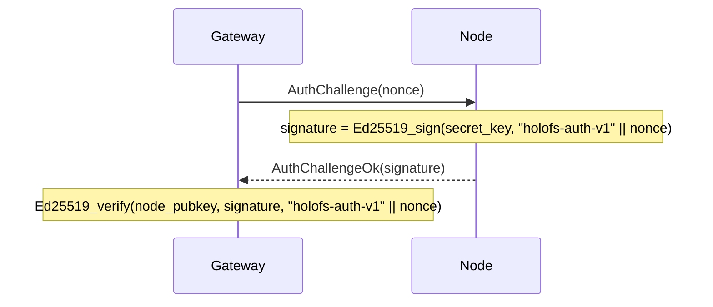

# Справочник API

Три внешних интерфейса: **HTTP gateway**, **проводной протокол node** и
**форматы файлов на диске** (manifest, каталог, shard, whitelist, holoshare).

## Содержание

1. [HTTP gateway](#1-http-gateway)
2. [Проводной протокол (TCP)](#2-wire-protocol-tcp)
3. [Форматы на диске](#3-on-disk-formats)
4. [Соглашения о заголовках ответа](#4-response-header-conventions)

---

## 1. HTTP gateway

Базовый URL: `http://<addr>:8787/` (HTTPS через собственную TLS-обвязку
gateway из Stage 6 — `HOLOFS_TLS=1`, mTLS через `HOLOFS_MTLS=1`).

> **Обновление Stage 9.** Пути разделяются слешем и адресуются как
> wildcard (`/photos/2026/img.jpg`). Зарезервированные сегменты верхнего уровня —
> `api`, `health`, `escrow`, `preview`, `inspect`, `similar`, `diff`,
> `admin`, `metrics`, `pkg` — не могут использоваться как первый сегмент
> пути объекта, поскольку они затеняют реальные маршруты.

### CRUD каталога

| Метод    | Путь                       | Описание                                    | Тело / параметры |
|----------|----------------------------|---------------------------------------------|------------------|
| `GET`    | `/`                        | HTML-каталог; читает `?p=<prefix>` для каталога, который нужно отобразить | —             |
| `GET`    | `/<path>`                  | Скачать объект в каноническом виде          | Поддерживается Range |
| `GET`    | `/preview/<path>`          | Грубый превью (только L0)                   | Поддерживается Range |
| `PUT`    | `/<path>`                  | Загрузить сырые байты, kind определяется автоматически. Родительский каталог должен существовать (через `mkdir`) | body = file |
| `DELETE` | `/<path>`                  | Удалить объект + Purge на всех node. Отказывает в удалении записей-каталогов (используйте `rmdir`) | —             |

### Операции с каталогами (Stage 9)

Две разновидности каждой мутации каталога: wildcard JSON-вариант для
программных вызовов / `curl` и form-urlencoded POST, который HTML-формы
UI могут вызывать без JavaScript. Формовые варианты делают 303-редирект на
`/?p=<parent>`, чтобы браузер вернулся в каталог, который пользователь
просматривал.

| Метод    | Путь                       | Описание                                                    | Тело / параметры             |
|----------|----------------------------|-------------------------------------------------------------|------------------------------|
| `POST`   | `/api/mkdir/<path>`        | Создать маркер `Directory`. Родитель должен существовать.   | — (JSON-ответ)               |
| `POST`   | `/api/mkdir`               | mkdir для форм; редирект на `/?p=<parent>`                  | `parent=…&name=…`            |
| `DELETE` | `/api/rmdir/<path>`        | Удалить пустой каталог. 409, если есть дочерние элементы.   | — (JSON-ответ)               |
| `POST`   | `/api/rmdir`               | rmdir для форм; редирект при успехе                         | `path=…`                     |
| `POST`   | `/api/mv`                  | Переименовать / переместить; каталоги тянут за собой всех потомков | `from=…&to=…`         |
| `POST`   | `/api/list_dir`            | Leptos server fn: непосредственные дочерние элементы `prefix` (JSON-RPC) | `{"prefix":"…"}` |

Соответствие кодов статуса для операций над каталогами:

| Результат                                | Статус | `GatewayError`           |
|------------------------------------------|--------|--------------------------|
| OK                                       | 200 / 201 / 303 | —               |
| Целевой объект уже существует            | 409    | `AlreadyExists`          |
| Путь существует, но не является каталогом | 409   | `NotADirectory`          |
| `rmdir` для непустого каталога           | 409    | `DirectoryNotEmpty`      |
| `GET`/`DELETE` для записи `Directory`    | 409    | `IsDirectory`            |
| Некорректный путь (`..`, `//`, ведущий `/`) | 400 | `BadRequest`             |
| Отсутствует родительский каталог         | 400    | `BadRequest`             |
| Неизвестная запись                       | 404    | `NotFound`               |

#### Ответ в зависимости от kind

| Kind      | `GET /<path>` возвращает                                    |
|-----------|-------------------------------------------------------------|
| image     | `image/png` (повторно закодировано из каналов f32)          |
| audio     | `audio/wav` (16-bit PCM, моно/стерео как сохранено)         |
| text      | content-type для текста в соответствии с расширением, тело включает маркеры пропусков, если shard'ов не хватает |
| opaque    | оригинальный content-type + `Content-Disposition: attachment` |
| directory | `409 Conflict` — у каталогов нет полезной нагрузки (Stage 9) |

### Здоровье кластера

| Метод | Путь                  | Описание                                       |
|-------|-----------------------|------------------------------------------------|
| `GET` | `/health`             | Таблица по node, кнопки kill/revive            |
| `GET` | `/health/<name>`      | Margin по (channel, layer), Monte-Carlo симуляция потерь, таблица отказов зон |
| `GET` | `/api/stats`          | JSON: счётчики объектов по kind, shards, dedup % |
| `POST` | `/admin/node` (`i=N`) | Переключить node N (admin-side excluded/restored) |

`/api/stats` возвращает:

```json
{
  "nodes_total": 40,
  "nodes_live": 38,
  "objects_total": 14,
  "objects_by_kind": {"image": 7, "audio": 3, "text": 1, "opaque": 1, "directory": 2},
  "shards_total": 5328,
  "shards_unique": 5326,
  "dedup_savings_pct": 0.04,
  "bytes_total": 50266112
}
```

`objects_total = sum(objects_by_kind)`; маркеры `directory` учитываются,
но не вносят вклада в `shards_total` / `bytes_total`.

### Поиск и аналитика

| Метод | Путь                          | Описание                                       |
|-------|-------------------------------|------------------------------------------------|
| `GET` | `/similar/<path>`             | Топ-10 похожих объектов + межобъектное пересечение |
| `GET` | `/diff?a=<a>&b=<b>`           | Поchunk-визуализация diff. Два пути объектов не помещаются в один маршрут, поэтому Stage 9 перенёс их в query string |
| `GET` | `/api/fingerprint/<path>`     | JSON: 16-байтовый перцептуальный хэш (image/audio) или первые 16 байт CID (text/opaque) |

`/api/fingerprint/<name>` возвращает:

```json
{
  "name": "photo.png",
  "fingerprint": "a3f08c7d12...",
  "kind": "image"
}
```

### Инспекция shard

Тройка `c_l_idx` идентифицирует один shard внутри объекта как
`<channel>_<layer>_<idx>`. Stage 9 перестроил URL так, что фиксированная
тройка теперь стоит перед wildcard-путём объекта.

| Метод | Путь                                                     | Описание |
|-------|----------------------------------------------------------|----------|
| `GET` | `/inspect/<path>`                                        | Сетка всех миниатюр shard (цветовая маркировка sys vs RLNC) |
| `GET` | `/api/shard/<c_l_idx>.png/<path>`                        | 32×32 серошкальный PNG полезной нагрузки одного shard |
| `GET` | `/inspect-zoom/<c_l_idx>/<path>`                         | Крупный рендер + hex-коэффициенты + payload + информация о node |

### Голографический ключевой escrow

| Метод | Путь                            | Описание |
|-------|---------------------------------|----------|
| `GET`  | `/escrow`                       | UI с формами split + recover |
| `POST` | `/escrow/split`                 | `file=…` + `k=…` + `n=…` → разбиение на `n` файлов `.holoshare` |
| `GET`  | `/escrow/download/<id>_<idx>.holoshare` | Скачать одну долю (хранится в памяти gateway) |
| `POST` | `/escrow/recover`               | `shares=…` (несколько) → восстановить исходный файл |

Файлы `.holoshare` **не хранятся на кластере** — gateway вычисляет их
по требованию и держит в памяти до перезапуска или до того, как пользователь
скачает их.

---

## 2. Проводной протокол (TCP)

Node слушает TCP-сокет. Каждое сообщение — один фрейм:

```
+--------+--------------------+
| u32 BE | payload (≤ 64 MiB) |
+--------+--------------------+
```

Ограничение 64 MiB (`holofs_wire::MAX_FRAME`) проверяется при декодировании;
node отбрасывает фреймы превышающего размера и закрывает соединение.

### Типы запросов

| Op   | Имя               | Payload                                       |
|------|-------------------|-----------------------------------------------|
| 0x00 | `Ping`            | (пусто)                                       |
| 0x01 | `Put`             | object\_id, channel, layer, Shard             |
| 0x02 | `Get`             | object\_id, channel, layer                    |
| 0x03 | `Purge`           | object\_id                                    |
| 0x04 | `Stat`            | (пусто)                                       |
| 0x05 | `Audit`           | object\_id, channel, layer, shard\_hash       |
| 0x06 | `AuthChallenge`   | nonce[32]                                     |

### Типы ответов

| Op   | Имя                   | Payload                                       |
|------|-----------------------|-----------------------------------------------|
| 0x00 | `Pong`                | (пусто)                                       |
| 0x01 | `Ack`                 | (пусто)                                       |
| 0x02 | `Shards`              | count: u32 BE + N × Shard                     |
| 0x03 | `StatResp`            | total\_shards: u32 BE                         |
| 0x04 | `AuditResp`           | tag: u8 (0=None, 1=Some) + optional Shard     |
| 0x05 | `AuthChallengeOk`     | signature[64]                                 |
| 0xff | `Error`               | len: u32 BE + UTF-8 message                   |

### Проводной формат shard

```
+---------------+-----------+----------------+---------+
| u16 BE coeffs_len | coeffs | u32 BE payload_len | payload |
+---------------+-----------+----------------+---------+
```

(Примечание: `coeffs_len` концептуально равен `K` из manifest.)

### Handshake аутентификации

Gateway может бросить вызов любой node перед тем, как доверять её ответам:



`node_pubkey` берётся из подписанного whitelist (см. §3 ниже).

---

## 3. Форматы на диске

Все многобайтовые целые — **big-endian**, если не указано иное. Файлы
идентифицируются 8-байтовой magic-сигнатурой по смещению 0.

### 3.1. Manifest (`HOLOFSM7`, легаси `HOLOFSM6` принимается при чтении)

Stage 9 поднял magic до `HOLOFSM7`, чтобы сигнализировать, что запись
может содержать дискриминант `ObjectKind::Directory` (тег `4`). Раскладка
байтов идентична `HOLOFSM6`; вырос только набор допустимых значений `kind`.
Старые файлы `HOLOFSM6` декодируются корректно новым кодом.

У маркеров каталогов все числовые поля обнулены, а все `Vec`-поля пусты;
их единственный носитель — `object_id` (производится из пути через SHA-256
с доменным тегом `holofs-dir-v1\0`) и фиксированный `content_type`
`inode/directory`.

Сериализованный `Manifest`, описывающий кодирование одного объекта.

```
magic           8  bytes = "HOLOFSM7" (legacy "HOLOFSM6" also accepted)
object_id       8  bytes BE
k               2  bytes BE
nlayers         1  byte
channels        1  byte
width           4  bytes BE
height          4  bytes BE
levels          1  byte
placement       1  byte (0=RoundRobin, 1=Rendezvous, 2=RendezvousZoneAware)

n_per_layer     nlayers × u32 BE
sym_len         nlayers × u32 BE
layer_positions for each layer:
                    n_positions: u32 BE
                    positions:   n_positions × u32 BE

nodes_count     u32 BE
for each node:
    addr_len    u16 BE
    addr        addr_len bytes UTF-8

zones           nodes_count bytes (one byte per node)

data_cid        32 bytes (SHA-256)
merkle_root     32 bytes (SHA-256)

shard_hashes    channels × nlayers × variable:
                    count: u32 BE
                    hashes: count × 32 bytes

kind            1  byte (0=Image, 1=Text, 2=Audio, 3=Opaque, 4=Directory)
content_type    1 byte length + length bytes UTF-8

chunk_lens      u32 BE count + count × u32 BE
                (for text: per-chunk lengths; for opaque: real file length;
                 for image/audio: usually empty)

audio_sample_rate  u32 BE  (0 for non-audio)

text_minhash    u32 BE count + count × u32 BE
                (for text: bottom-K MinHash; empty otherwise)
```

### 3.2. Каталог (catalog, `HOLOFSD1`)

```
magic           8 bytes = "HOLOFSD1"
n_entries       u32 BE
for each entry:
    name_len    u16 BE
    name        UTF-8
    manifest_len u32 BE
    manifest    serialised Manifest (§3.1)
```

Записывается атомарно (запись в `.tmp`, fsync, rename).

### 3.3. Файл shard (`HOLOFSS1`)

```
magic        8  bytes = "HOLOFSS1"
object_id    8  bytes BE
channel      1  byte
layer        1  byte
coeffs_len   4  bytes BE
payload_len  4  bytes BE
coeffs       coeffs_len bytes
payload      payload_len bytes
```

Имя файла: `<2 hex chars>/<remaining 62>.shard`, где полный hex —
`sha256(coeffs || payload)`.

### 3.4. Whitelist (`HOLOFSW1`)

```
magic         8  bytes = "HOLOFSW1"
n_entries     u32 BE
for each entry:
    addr_len  u16 BE
    addr      UTF-8
    pubkey    32 bytes (Ed25519)
    zone      1 byte
admin_pubkey  32 bytes
signature     64 bytes Ed25519
              signs ("holofs-whitelist-v1" || everything-above-the-signature)
```

### 3.5. Holoshare (`HOLOSHAR1`)

Одна доля escrow. Escrow **не хранится на кластере**; этот файл
предназначен для распространения людям / устройствам.

```
magic           9 bytes = "HOLOSHAR1"
escrow_id       16 bytes (first 16 of SHA-256 over the source data)
shard_idx       u16 BE
total_n         u16 BE
total_k         u16 BE
real_len        u64 BE (length of the original file in bytes)
content_type_n  1 byte
content_type    content_type_n bytes UTF-8
filename_n      1 byte
filename        filename_n bytes UTF-8
coeffs_len      u16 BE = total_k
coeffs          coeffs_len bytes
payload_len     u32 BE = sym_len
payload         payload_len bytes
```

Полная группа escrow имеет идентичные `escrow_id`, `total_n`, `total_k`,
`real_len`, `content_type`, `filename`. Для восстановления требуется любые
`total_k` различных значений `shard_idx` из того же `escrow_id`.

---

## 4. Соглашения о заголовках ответа

Кастомные заголовки `X-Holofs-*` в ответах на объекты:

| Заголовок                    | Тип       | Описание |
|------------------------------|-----------|----------|
| `X-Holofs-Kind`              | image / audio / text / opaque | kind объекта |
| `X-Holofs-Layers`            | `0-<max>` | для image / audio: фактически декодированные слои |
| `X-Holofs-Bytes-Downloaded`  | u64       | байтов, загруженных с node для этого ответа |
| `X-Holofs-Decode-Ms`         | u128      | время, потраченное на декодирование (исключая сетевой RTT) |
| `X-Holofs-Sample-Rate`       | u32       | audio: частота дискретизации в Гц |
| `X-Holofs-Channels`          | u8        | audio: 1 или 2 |
| `X-Holofs-Chunks-Total`      | usize     | text: общее число chunk'ов |
| `X-Holofs-Chunks-Missing`    | usize     | text: chunk'ов, заменённых маркерами пропусков |
| `X-Holofs-Escrow-Shares-Used`| usize     | escrow recover: число использованных долей |
