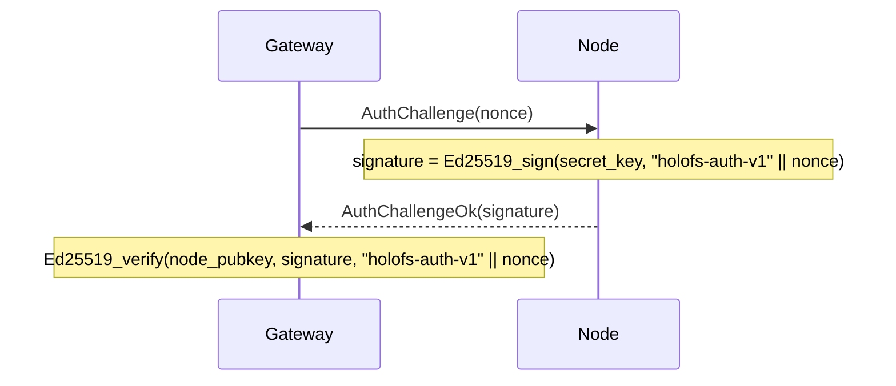

# Справочник API

Три внешних интерфейса: **HTTP gateway**, **проводной протокол node** и
**форматы файлов на диске** (manifest, каталог, shard, whitelist, holoshare).

## Содержание

1. [HTTP gateway](#1-http-gateway)
2. [Проводной протокол (TCP)](#2-wire-protocol-tcp)
3. [Форматы на диске](#3-on-disk-formats)
4. [Соглашения о заголовках ответа](#4-response-header-conventions)
5. [MCP-сервер (Stage 12)](#5-mcp-сервер-stage-12)
6. [Wavelet-операции (Stage 12.5)](#6-wavelet-операции-stage-125)

---

## 1. HTTP gateway

Базовый URL: `http://<addr>:8787/` (HTTPS через собственную TLS-обвязку
gateway из Stage 6 — `HOLOFS_TLS=1`, mTLS через `HOLOFS_MTLS=1`).

> **Обновление Stage 9.** Пути разделяются слешем и адресуются как
> wildcard (`/photos/2026/img.jpg`). Зарезервированные сегменты верхнего уровня —
> `api`, `health`, `escrow`, `preview`, `inspect`, `similar`, `diff`,
> `admin`, `metrics`, `pkg` — не могут использоваться как первый сегмент
> пути объекта, поскольку они затеняют реальные маршруты.

### CRUD каталога

| Метод    | Путь                       | Описание                                    | Тело / параметры |
|----------|----------------------------|---------------------------------------------|------------------|
| `GET`    | `/`                        | HTML-каталог; читает `?p=<prefix>` для каталога, который нужно отобразить | —             |
| `GET`    | `/<path>`                  | Скачать объект в каноническом виде          | Поддерживается Range |
| `GET`    | `/preview/<path>`          | Грубый превью (только L0)                   | Поддерживается Range |
| `PUT`    | `/<path>`                  | Загрузить сырые байты, kind определяется автоматически. Родительский каталог должен существовать (через `mkdir`) | body = file |
| `DELETE` | `/<path>`                  | Удалить объект + Purge на всех node. Отказывает в удалении записей-каталогов (используйте `rmdir`) | —             |

### Операции с каталогами (Stage 9)

Две разновидности каждой мутации каталога: wildcard JSON-вариант для
программных вызовов / `curl` и form-urlencoded POST, который HTML-формы
UI могут вызывать без JavaScript. Формовые варианты делают 303-редирект на
`/?p=<parent>`, чтобы браузер вернулся в каталог, который пользователь
просматривал.

| Метод    | Путь                       | Описание                                                    | Тело / параметры             |
|----------|----------------------------|-------------------------------------------------------------|------------------------------|
| `POST`   | `/api/mkdir/<path>`        | Создать маркер `Directory`. Родитель должен существовать.   | — (JSON-ответ)               |
| `POST`   | `/api/mkdir`               | mkdir для форм; редирект на `/?p=<parent>`                  | `parent=…&name=…`            |
| `DELETE` | `/api/rmdir/<path>`        | Удалить пустой каталог. 409, если есть дочерние элементы.   | — (JSON-ответ)               |
| `POST`   | `/api/rmdir`               | rmdir для форм; редирект при успехе                         | `path=…`                     |
| `POST`   | `/api/mv`                  | Переименовать / переместить; каталоги тянут за собой всех потомков | `from=…&to=…`         |
| `POST`   | `/api/list_dir`            | Leptos server fn: непосредственные дочерние элементы `prefix` (JSON-RPC) | `{"prefix":"…"}` |

Соответствие кодов статуса для операций над каталогами:

| Результат                                | Статус | `GatewayError`           |
|------------------------------------------|--------|--------------------------|
| OK                                       | 200 / 201 / 303 | —               |
| Целевой объект уже существует            | 409    | `AlreadyExists`          |
| Путь существует, но не является каталогом | 409   | `NotADirectory`          |
| `rmdir` для непустого каталога           | 409    | `DirectoryNotEmpty`      |
| `GET`/`DELETE` для записи `Directory`    | 409    | `IsDirectory`            |
| Некорректный путь (`..`, `//`, ведущий `/`) | 400 | `BadRequest`             |
| Отсутствует родительский каталог         | 400    | `BadRequest`             |
| Неизвестная запись                       | 404    | `NotFound`               |

#### Ответ в зависимости от kind

| Kind      | `GET /<path>` возвращает                                    |
|-----------|-------------------------------------------------------------|
| image     | `image/png` (повторно закодировано из каналов f32)          |
| audio     | `audio/wav` (16-bit PCM, моно/стерео как сохранено)         |
| text      | content-type для текста в соответствии с расширением, тело включает маркеры пропусков, если shard'ов не хватает |
| opaque    | оригинальный content-type + `Content-Disposition: attachment` |
| directory | `409 Conflict` — у каталогов нет полезной нагрузки (Stage 9) |

### Здоровье кластера

| Метод | Путь                  | Описание                                       |
|-------|-----------------------|------------------------------------------------|
| `GET` | `/health`             | Таблица по node, кнопки kill/revive            |
| `GET` | `/health/<name>`      | Margin по (channel, layer), Monte-Carlo симуляция потерь, таблица отказов зон |
| `GET` | `/api/stats`          | JSON: счётчики объектов по kind, shards, dedup % |
| `POST` | `/admin/node` (`i=N`) | Переключить node N (admin-side excluded/restored) |

`/api/stats` возвращает:

```json
{
  "nodes_total": 40,
  "nodes_live": 38,
  "objects_total": 14,
  "objects_by_kind": {"image": 7, "audio": 3, "text": 1, "opaque": 1, "directory": 2},
  "shards_total": 5328,
  "shards_unique": 5326,
  "dedup_savings_pct": 0.04,
  "bytes_total": 50266112
}
```

`objects_total = sum(objects_by_kind)`; маркеры `directory` учитываются,
но не вносят вклада в `shards_total` / `bytes_total`.

### Поиск и аналитика

| Метод | Путь                          | Описание                                       |
|-------|-------------------------------|------------------------------------------------|
| `GET` | `/similar/<path>`             | Топ-10 похожих объектов + межобъектное пересечение |
| `GET` | `/diff?a=<a>&b=<b>`           | Поchunk-визуализация diff. Два пути объектов не помещаются в один маршрут, поэтому Stage 9 перенёс их в query string |
| `GET` | `/api/fingerprint/<path>`     | JSON: 16-байтовый перцептуальный хэш (image/audio) или первые 16 байт CID (text/opaque) |

`/api/fingerprint/<name>` возвращает:

```json
{
  "name": "photo.png",
  "fingerprint": "a3f08c7d12...",
  "kind": "image"
}
```

### Инспекция shard

Тройка `c_l_idx` идентифицирует один shard внутри объекта как
`<channel>_<layer>_<idx>`. Stage 9 перестроил URL так, что фиксированная
тройка теперь стоит перед wildcard-путём объекта.

| Метод | Путь                                                     | Описание |
|-------|----------------------------------------------------------|----------|
| `GET` | `/inspect/<path>`                                        | Сетка всех миниатюр shard (цветовая маркировка sys vs RLNC) |
| `GET` | `/api/shard/<c_l_idx>.png/<path>`                        | 32×32 серошкальный PNG полезной нагрузки одного shard |
| `GET` | `/inspect-zoom/<c_l_idx>/<path>`                         | Крупный рендер + hex-коэффициенты + payload + информация о node |

### Голографический ключевой escrow

| Метод | Путь                            | Описание |
|-------|---------------------------------|----------|
| `GET`  | `/escrow`                       | UI с формами split + recover |
| `POST` | `/escrow/split`                 | `file=…` + `k=…` + `n=…` → разбиение на `n` файлов `.holoshare` |
| `GET`  | `/escrow/download/<id>_<idx>.holoshare` | Скачать одну долю (хранится в памяти gateway) |
| `POST` | `/escrow/recover`               | `shares=…` (несколько) → восстановить исходный файл |

Файлы `.holoshare` **не хранятся на кластере** — gateway вычисляет их
по требованию и держит в памяти до перезапуска или до того, как пользователь
скачает их.

---

## 2. Проводной протокол (TCP)

Node слушает TCP-сокет. Каждое сообщение — один фрейм:

```
+--------+--------------------+
| u32 BE | payload (≤ 64 MiB) |
+--------+--------------------+
```

Ограничение 64 MiB (`holofs_wire::MAX_FRAME`) проверяется при декодировании;
node отбрасывает фреймы превышающего размера и закрывает соединение.

### Типы запросов

| Op   | Имя               | Payload                                       |
|------|-------------------|-----------------------------------------------|
| 0x00 | `Ping`            | (пусто)                                       |
| 0x01 | `Put`             | object\_id, channel, layer, Shard             |
| 0x02 | `Get`             | object\_id, channel, layer                    |
| 0x03 | `Purge`           | object\_id                                    |
| 0x04 | `Stat`            | (пусто)                                       |
| 0x05 | `Audit`           | object\_id, channel, layer, shard\_hash       |
| 0x06 | `AuthChallenge`   | nonce[32]                                     |

### Типы ответов

| Op   | Имя                   | Payload                                       |
|------|-----------------------|-----------------------------------------------|
| 0x00 | `Pong`                | (пусто)                                       |
| 0x01 | `Ack`                 | (пусто)                                       |
| 0x02 | `Shards`              | count: u32 BE + N × Shard                     |
| 0x03 | `StatResp`            | total\_shards: u32 BE                         |
| 0x04 | `AuditResp`           | tag: u8 (0=None, 1=Some) + optional Shard     |
| 0x05 | `AuthChallengeOk`     | signature[64]                                 |
| 0xff | `Error`               | len: u32 BE + UTF-8 message                   |

### Проводной формат shard

```
+---------------+-----------+----------------+---------+
| u16 BE coeffs_len | coeffs | u32 BE payload_len | payload |
+---------------+-----------+----------------+---------+
```

(Примечание: `coeffs_len` концептуально равен `K` из manifest.)

### Handshake аутентификации

Gateway может бросить вызов любой node перед тем, как доверять её ответам:



`node_pubkey` берётся из подписанного whitelist (см. §3 ниже).

---

## 3. Форматы на диске

Все многобайтовые целые — **big-endian**, если не указано иное. Файлы
идентифицируются 8-байтовой magic-сигнатурой по смещению 0.

### 3.1. Manifest (`HOLOFSM7`, легаси `HOLOFSM6` принимается при чтении)

Stage 9 поднял magic до `HOLOFSM7`, чтобы сигнализировать, что запись
может содержать дискриминант `ObjectKind::Directory` (тег `4`). Раскладка
байтов идентична `HOLOFSM6`; вырос только набор допустимых значений `kind`.
Старые файлы `HOLOFSM6` декодируются корректно новым кодом.

У маркеров каталогов все числовые поля обнулены, а все `Vec`-поля пусты;
их единственный носитель — `object_id` (производится из пути через SHA-256
с доменным тегом `holofs-dir-v1\0`) и фиксированный `content_type`
`inode/directory`.

Сериализованный `Manifest`, описывающий кодирование одного объекта.

```
magic           8  bytes = "HOLOFSM7" (legacy "HOLOFSM6" also accepted)
object_id       8  bytes BE
k               2  bytes BE
nlayers         1  byte
channels        1  byte
width           4  bytes BE
height          4  bytes BE
levels          1  byte
placement       1  byte (0=RoundRobin, 1=Rendezvous, 2=RendezvousZoneAware)

n_per_layer     nlayers × u32 BE
sym_len         nlayers × u32 BE
layer_positions for each layer:
                    n_positions: u32 BE
                    positions:   n_positions × u32 BE

nodes_count     u32 BE
for each node:
    addr_len    u16 BE
    addr        addr_len bytes UTF-8

zones           nodes_count bytes (one byte per node)

data_cid        32 bytes (SHA-256)
merkle_root     32 bytes (SHA-256)

shard_hashes    channels × nlayers × variable:
                    count: u32 BE
                    hashes: count × 32 bytes

kind            1  byte (0=Image, 1=Text, 2=Audio, 3=Opaque, 4=Directory)
content_type    1 byte length + length bytes UTF-8

chunk_lens      u32 BE count + count × u32 BE
                (for text: per-chunk lengths; for opaque: real file length;
                 for image/audio: usually empty)

audio_sample_rate  u32 BE  (0 for non-audio)

text_minhash    u32 BE count + count × u32 BE
                (for text: bottom-K MinHash; empty otherwise)
```

### 3.2. Каталог (catalog, `HOLOFSD1`)

```
magic           8 bytes = "HOLOFSD1"
n_entries       u32 BE
for each entry:
    name_len    u16 BE
    name        UTF-8
    manifest_len u32 BE
    manifest    serialised Manifest (§3.1)
```

Записывается атомарно (запись в `.tmp`, fsync, rename).

### 3.3. Файл shard (`HOLOFSS1`)

```
magic        8  bytes = "HOLOFSS1"
object_id    8  bytes BE
channel      1  byte
layer        1  byte
coeffs_len   4  bytes BE
payload_len  4  bytes BE
coeffs       coeffs_len bytes
payload      payload_len bytes
```

Имя файла: `<2 hex chars>/<remaining 62>.shard`, где полный hex —
`sha256(coeffs || payload)`.

### 3.4. Whitelist (`HOLOFSW1`)

```
magic         8  bytes = "HOLOFSW1"
n_entries     u32 BE
for each entry:
    addr_len  u16 BE
    addr      UTF-8
    pubkey    32 bytes (Ed25519)
    zone      1 byte
admin_pubkey  32 bytes
signature     64 bytes Ed25519
              signs ("holofs-whitelist-v1" || everything-above-the-signature)
```

### 3.5. Holoshare (`HOLOSHAR1`)

Одна доля escrow. Escrow **не хранится на кластере**; этот файл
предназначен для распространения людям / устройствам.

```
magic           9 bytes = "HOLOSHAR1"
escrow_id       16 bytes (first 16 of SHA-256 over the source data)
shard_idx       u16 BE
total_n         u16 BE
total_k         u16 BE
real_len        u64 BE (length of the original file in bytes)
content_type_n  1 byte
content_type    content_type_n bytes UTF-8
filename_n      1 byte
filename        filename_n bytes UTF-8
coeffs_len      u16 BE = total_k
coeffs          coeffs_len bytes
payload_len     u32 BE = sym_len
payload         payload_len bytes
```

Полная группа escrow имеет идентичные `escrow_id`, `total_n`, `total_k`,
`real_len`, `content_type`, `filename`. Для восстановления требуется любые
`total_k` различных значений `shard_idx` из того же `escrow_id`.

---

## 4. Соглашения о заголовках ответа

Кастомные заголовки `X-Holofs-*` в ответах на объекты:

| Заголовок                    | Тип       | Описание |
|------------------------------|-----------|----------|
| `X-Holofs-Kind`              | image / audio / text / opaque | kind объекта |
| `X-Holofs-Layers`            | `0-<max>` | для image / audio: фактически декодированные слои |
| `X-Holofs-Bytes-Downloaded`  | u64       | байтов, загруженных с node для этого ответа |
| `X-Holofs-Decode-Ms`         | u128      | время, потраченное на декодирование (исключая сетевой RTT) |
| `X-Holofs-Sample-Rate`       | u32       | audio: частота дискретизации в Гц |
| `X-Holofs-Channels`          | u8        | audio: 1 или 2 |
| `X-Holofs-Chunks-Total`      | usize     | text: общее число chunk'ов |
| `X-Holofs-Chunks-Missing`    | usize     | text: chunk'ов, заменённых маркерами пропусков |
| `X-Holofs-Escrow-Shares-Used`| usize     | escrow recover: число использованных долей |

---

## 5. MCP-сервер (Stage 12)

Gateway отдаёт эндпоинт **Model Context Protocol** на `POST /mcp` по
транспорту Streamable HTTP (спека ревизии `2025-03-26`). MCP-клиенты
вроде Claude Desktop и Claude Code обращаются к нему напрямую, без
парсинга веб-UI; обе поверхности шарят один `Arc<Gateway>`, так что
чтения и записи остаются согласованными.

### 5.1 Транспорт

`/mcp` отвечает на POST (сообщения клиент → сервер), GET (опциональный
SSE-поток сервер → клиент) и DELETE (закрытие сессии). Сессия несёт
заголовок `Mcp-Session-Id`, выданный на первом `initialize`. Эндпоинт
сидит за тем же axum-роутером, что и остальной web (по умолчанию
`127.0.0.1:8787`).

### 5.2 Аутентификация

Управляется одной env-переменной на сервере:

| `HOLOFS_MCP_TOKEN`  | Поведение                                              |
|---------------------|--------------------------------------------------------|
| не задана / пустая  | `/mcp` открыт, но **только на чтение** — write-инструменты отказывают |
| любое непустое значение | требует `Authorization: Bearer <token>` на каждом запросе |

Когда токен задан, write-инструменты (`put_object_text`, `mkdir`,
`rmdir`, `mv_object`) включаются. Без токена они возвращают ошибку
`invalid_request` с подсказкой про env. Токен читается один раз на
старте и нигде не логируется — ротация требует перезапуска.

Подключение в Claude Code:

```sh
# read-only
claude mcp add --transport http holofs http://127.0.0.1:8787/mcp

# с auth
claude mcp add --transport http holofs http://127.0.0.1:8787/mcp \
  --header "Authorization: Bearer $HOLOFS_MCP_TOKEN"
```

### 5.3 Инструменты

Двенадцать инструментов, сгруппированных по возможностям:

**Чтение (всегда доступны)**

| Tool                  | Входы                                   | Возвращает |
|-----------------------|-----------------------------------------|------------|
| `list_catalog`        | `prefix?`, `recursive?`                 | строки каталога под prefix |
| `read_object_text`    | `path`                                  | UTF-8 тело, кап 256 KiB |
| `find_similar`        | `path`, `scope?` (`all`/`folder`/`tree`)| топ-10 соседей + метод |
| `get_cluster_health`  | —                                       | ноды + снапшот каталога |
| `get_object_health`   | `path`                                  | сводка по готовности декодирования |

**Инспекция (всегда доступны)**

| Tool             | Входы                                                 | Возвращает |
|------------------|-------------------------------------------------------|------------|
| `diff_objects`   | `a`, `b`, `include_cells?`                            | пересечение чанков по слоям |
| `inspect_object` | `path`                                                | расклад по (каналу, слою) |
| `inspect_shard`  | `path`, `channel`, `layer`, `idx`, `include_payload?` | метаданные шарда + опциональный payload |

**Запись (под `HOLOFS_MCP_TOKEN`)**

| Tool              | Входы                                 | Возвращает |
|-------------------|---------------------------------------|------------|
| `put_object_text` | `path`, `content`, `content_type?`    | `{path, action="wrote", note}` |
| `mkdir`           | `path`                                | `{path, action="created"}` |
| `rmdir`           | `path` (должна быть пустой)           | `{path, action="removed"}` |
| `mv_object`       | `from`, `to`                          | `{path, action="renamed", note}` |

### 5.4 Ресурсы

Каждая non-directory запись каталога доступна и через поверхность MCP
`resources/` под URI `holofs:///<catalog-path>`. `resources/list` отдаёт
по строке на файл с `mimeType` из манифеста и кратким описанием;
`resources/read` декодирует объект на сервере и возвращает:

- **text-kind** → `TextResourceContents` с UTF-8
- **image / audio / opaque** → `BlobResourceContents` с base64-payload

Чтение кэпнуто 1 MiB на запрос, чтобы один resource fetch не забил
контекст LLM-клиента.

### 5.5 Пример по протоколу (curl)

Поток initialize → `tools/list` → `tools/call` по Streamable HTTP:

```sh
SID=$(curl -si -X POST http://127.0.0.1:8787/mcp \
  -H 'Content-Type: application/json' \
  -H 'Accept: application/json, text/event-stream' \
  -d '{"jsonrpc":"2.0","id":1,"method":"initialize","params":{
    "protocolVersion":"2025-06-18","capabilities":{},
    "clientInfo":{"name":"curl","version":"1"}}}' \
  | grep -i 'mcp-session-id:' | awk '{print $2}' | tr -d '\r')

# обязательно после initialize
curl -s -X POST http://127.0.0.1:8787/mcp \
  -H "Mcp-Session-Id: $SID" -H 'Content-Type: application/json' \
  -H 'Accept: application/json, text/event-stream' \
  -d '{"jsonrpc":"2.0","method":"notifications/initialized"}' > /dev/null

# список инструментов
curl -s -X POST http://127.0.0.1:8787/mcp \
  -H "Mcp-Session-Id: $SID" -H 'Content-Type: application/json' \
  -H 'Accept: application/json, text/event-stream' \
  -d '{"jsonrpc":"2.0","id":2,"method":"tools/list"}'

# найти похожие на объект, ограничив поиск его папкой
curl -s -X POST http://127.0.0.1:8787/mcp \
  -H "Mcp-Session-Id: $SID" -H 'Content-Type: application/json' \
  -H 'Accept: application/json, text/event-stream' \
  -d '{"jsonrpc":"2.0","id":3,"method":"tools/call","params":{
    "name":"find_similar","arguments":{
      "path":"photos/2026/mandala.png","scope":"folder"}}}'
```

---

## 6. Wavelet-операции (Stage 12.5)

Эти две операции используют тот факт, что holofs хранит каждый image-
и audio-объект в wavelet (DWT) домене, разнесённым по `(channel,
layer)`-ведрам шардов. Манипуляции с шардами на гранулярности слоёв
позволяют *трансформировать* объект — без декодирования, перекодирования,
без второй копии source-данных.

Оба инструмента сейчас доступны только через MCP (Stage 12.5) — HTTP
маршруты можно будет добавить позже, но `claude mcp` + curl уже
покрывают те же сценарии.

### 6.1 Wavelet mix

Строит гибридное PNG-изображение, разделяя DWT-слои между двумя
совместимыми источниками: слои `0..=split` берутся из A, слои `>split`
из B. Тот же IDWT, который декодирует обычный объект, отрабатывает по
гибридной плоскости коэффициентов — на выходе настоящее PNG,
неотличимое по сети от обычного GET.

Требования совместимости (иначе `BadRequest`): оба объекта `Image`,
с одинаковыми `width / height / channels / k / nlayers / levels` и
идентичными per-layer `sym_len` / `layer_positions`. На практике —
загружены с той же конфигурацией DWT в кластере.

MCP-инструмент `wavelet_mix`:

| Параметр   | Тип       | Пояснение |
|------------|-----------|-----------|
| `a`        | строка    | catalog-путь, владелец слоёв `0..=split` |
| `b`        | строка    | catalog-путь, владелец слоёв `>split` |
| `split`    | u8        | DWT split. `0` ⇒ только L0 от A, остальное от B; `nlayers-1` ⇒ целиком A |
| `save_as?` | строка    | catalog-путь куда положить результат; требует `HOLOFS_MCP_TOKEN`. Без него bytes возвращаются inline. |

Возвращает `{a, b, split, width, height, channels, bytes_downloaded,
decode_ms, saved_as, bytes_len, content_type, blob_base64}`.
`blob_base64` пустой, если использовался `save_as`.

Визуальное правило: низкие слои несут грубую структуру (силуэт,
тонировку), высокие — мелкие детали (грань, текстуру). Маленький
`split` ⇒ «скелет A в шкуре B»; большой `split` ⇒ «A с текстурой/
зерном B».

### 6.2 Audio layer filter

Декодирует аудио-объект, оставляя коэффициенты только перечисленных
слоёв — остальные зануляются перед обратным Haar. Каждый слой грубо
соответствует частотной полосе (L0 = бас-огибающая, выше — выше
частоты), поэтому инструмент даёт single-band вырезки и селективный
EQ без пересборки файла.

MCP-инструмент `audio_filter`:

| Параметр       | Тип    | Пояснение |
|----------------|--------|-----------|
| `path`         | строка | catalog-путь, должен быть `Audio` |
| `keep_layers`  | `u8[]` | индексы слоёв (например `[0]` = только бас) |
| `save_as?`     | строка | catalog-путь для нового аудио; требует токен |

Возвращает `{source, kept_layers, nlayers, sample_rate, channels,
bytes_downloaded, decode_ms, saved_as, bytes_len, content_type,
blob_base64}`.

Ошибки: пустой `keep_layers` или маска со всеми `false` ⇒ `BadRequest`
(выход был бы тишиной). Объект не Audio ⇒ `BadRequest`.

### 6.3 В чём интерес

Обе операции работают *в частотном домене*, по шардам. По сравнению с
очевидным подходом (скачать source, декодировать, трансформировать,
перекодировать):

* **По умолчанию никаких лишних копий** — результат возвращается inline;
  шарды source-а в кластере не трогаются.
* **Сохранённые гибриды — полноправные объекты** — `save_as` гонит
  байты через обычный ingest (RLNC, дедуп, DWT, манифест), и они
  получают graceful degradation + similar search + всё остальное.
* **Дешёвый перебор** — LLM может прокатиться по `split` от 0 до
  `nlayers-1` в поиске самого интересного гибрида, оплачивая только
  shard-фетчи для каждого слоя.

---

## 7. UI и API, добавленные в Stages 12.6 – 15.0

Поверхность сильно выросла относительно изначальных пяти страниц.
Полный референс — в английском `docs/api.md` (секции 7–12);
ниже краткая выжимка по-русски, чтобы можно было ориентироваться
без переключения языка.

### Новые HTTP-эндпоинты

| Метод + путь                              | Stage  | Что делает |
|-------------------------------------------|--------|------------|
| `GET /api/file_metrics?name=<path>`       | 12.7   | JSON-метрики файла: dedup, originality по слоям, top-N соседей по shared shards, энергия слоёв (image/audio), audio bands. |
| `GET /api/search?q=<text>&band=<...>&limit=N` | 12.8 → 13.3 | Семантический поиск. ViT-B/32 image-encoder + multilingual DistilBERT text-encoder (поддерживает ru / en / de / fr / es / zh / ja / 50+ языков). `band ∈ {any, coarse, mid, full}`. По умолчанию `any` — лучшая оценка на файл. Требует `--enable-embed`. |
| `POST /api/embed_all`                     | 12.8   | Синхронный bulk-индекс: проходит по каталогу, embed-ит всё новое. Возвращает `{new, skipped}`. |
| `GET /preview/stream/<name>`              | 13.1   | `multipart/x-mixed-replace` поток PNG-кадров от L0 к полному разрешению. Каждый кадр — отдельный part с `X-Holofs-Layer: <N>`. |
| `GET /api/spotlight.png?name=...&x,y,w,h&mode=<spatial\|coeff>` | 13.2 + 14.1 | ROI-композит. `spatial` — двухпроходная композиция; `coeff` — Haar reverse-map, зануление коэффициентов вне ROI. |
| `POST /api/restore`                       | 13.4   | Восстановление архивной версии. Body: `name=<path>&id=<version_id>&return_to=<url>`. 303-редирект. Текущий manifest архивируется первым (restore обратим). |
| `GET /api/versions_list?name=<path>`      | 13.4   | Server fn под `/versions/<name>`: `{name, versions: [{id, created_at_ms, cid_short, width, height, kind}], enabled}`. |
| `POST /api/gc`                            | 14.0 + 14.3 + 14.4 | Сборка мусора шардов кластера + переписывание `embeddings.bin` с удалением stale-записей. JSON `GcReport`. См. ниже. |

### Новые Leptos-страницы

| Маршрут                | Stage  | Что показывает |
|------------------------|--------|----------------|
| `/mix?a=&b=&split=`    | 12.6   | UI для wavelet-mix (раньше был только MCP-tool). |
| `/about`               | 12.7   | Маркетинговая страница: hero + 4 архитектурные карточки + бизнес-польза + 6 кейсов. Чистая i18n. |
| `/search?q=&band=`     | 12.9 + 13.3 | Семантический поиск с band-пиллами. Карточки результатов имеют две ``: coarse + full, full плавно проявляется. |
| `/holo/<name>`         | 13.1   | Streaming-голограмма: один `` на `/preview/stream/<name>`. Без JS. |
| `/spotlight?a=`        | 13.2   | ROI композит. Preset-кнопки + custom ROI form + переключатель `mode=spatial\|coeff`. |
| `/versions/<name>`     | 13.4   | Таблица архивных версий с кнопкой "restore". Требует `--enable-versions`. |

### `POST /api/gc` — формат ответа

```json
{
  "live_hashes":         <distinct hash-ей в каталоге + version archives>,
  "manifests_scanned":   <число>,
  "held_total":          <сумма shards на всех нодах>,
  "purged_total":        <сумма purge-нутых>,
  "embeddings_kept":     <записей осталось в embeddings.bin>,
  "embeddings_dropped":  <записей удалено из embeddings.bin>,
  "duration_ms":         <ms>,
  "nodes": [
    { "idx": 0, "addr": "127.0.0.1:9100", "held": 117, "orphaned": 0, "ok": true },
    …
  ]
}
```

**Concurrency (Stage 14.4):** GC берёт эксклюзивный `write()` на
`gc_barrier` RwLock; PUT-ы / restore / embed-append держат `read()`.
GC ждёт пока все in-flight writers закончат, и блокирует новые
до завершения паса. PUT блокируется на ~40 ms на dev-каталоге.

### Новые wire-операции (TCP)

| OP    | Request                          | Response  | Назначение |
|-------|----------------------------------|-----------|------------|
| `0x07`| `ListHashes`                     | `Hashes`  | Перечисление всех hash-ей шардов на ноде. Используется GC для вычисления orphans = held − live. |
| `0x08`| `PurgeByHash { hashes }`         | `Ack`     | Идемпотентное удаление по списку hash. |
| `0x09`| `PutBatch { object_id, channel, layer, shards }` | `Ack` | Батч-PUT: один RPC вместо одного на каждый шард. Используется в Stage 15.0 scaffolding для будущего producer-а replicated encoding. |

### CLI-флаги оператора

| Флаг                  | Default | Назначение |
|-----------------------|---------|------------|
| `--enable-embed`      | off     | Stage 12.8 — мультилингвальный семантический поиск (50+ языков). Первый запуск качает ~700 MiB весов (155 MiB ViT-B/32 image + 540 MiB DistilBERT-multilingual text + 1.5 MiB projection) в `~/.cache/huggingface/hub/`. |
| `--enable-versions`   | off     | Stage 13.4 — per-object versions. Storage растёт монотонно пока флаг включён; `POST /api/gc` чистит. |

### HOLOFSM9 + `ObjectEncoding` (Stage 15.0)

Манифест добавил трейлинг-байт `encoding`. Варианты:

| Байт | Вариант                              | Хвост |
|------|--------------------------------------|-------|
| `0`  | `Rlnc`                               | — (дефолт для всего, что мы пишем сегодня) |
| `1`  | `Replicated { replication: u8 }`     | один `u8` (Stage 15.1 scaffolding; producer'а ещё нет) |

Совместимость: `HOLOFSM8/7/6` декодируются с дефолтом `Rlnc`.

### Пул соединений (Stage 15.1)

Все client→node RPC теперь идут через per-address LIFO-пул живых
`TransportStream`-ов. Серверная сторона и так работает в режиме
keepalive (`handle_connection` циклит по фреймам), так что протокол
не менялся. До пула полная заливка 44 семплов вышибала эфемерные
порты macOS на 28-м файле — теперь тот же тест с `THROTTLE_MS=0` и
дефолтными интервалами monitor/auditor проходит чисто.

Реализация — `holofs_client::pool`. Кнопки через переменные окружения:

| Переменная               | Default | Назначение |
|--------------------------|---------|------------|
| `HOLOFS_POOL_PER_NODE`   | `8`     | Максимум idle-соединений на одну ноду. |
| `HOLOFS_POOL_IDLE_SECS`  | `30`    | TTL idle-записи. Старше — на ближайшем `acquire` дропаем. |
| `HOLOFS_POOL_DISABLE`    | unset   | `=1` → пул выключен, каждый RPC дёргает свежий dial (escape hatch). |

В `rpc()` встроен ровно один retry на свежем соединении если первый
IO упал в `UnexpectedEof / BrokenPipe / ConnectionReset /
ConnectionAborted / NotConnected` — все wire-операции идемпотентны
(PUT/Audit/Gather/Purge/PutBatch ключуются по shard hash), так что
retry безопасен и молча скрывает гонку "peer закрыл сокет пока мы
простаивали".
