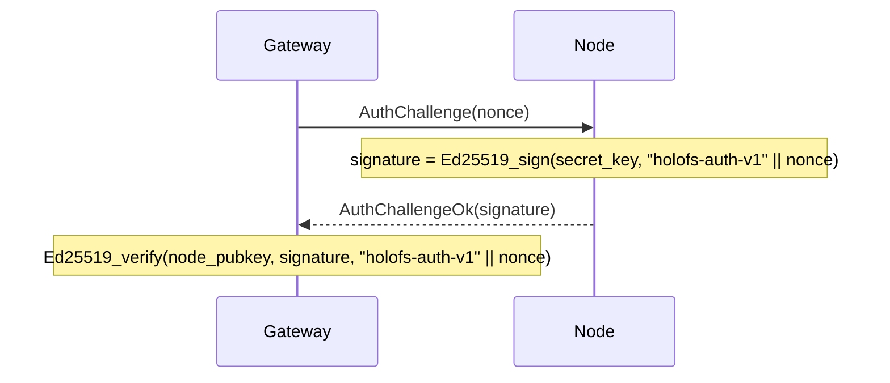

# Справочник API

Три внешних интерфейса: **HTTP-gateway**, **сетевой протокол ноды** и
**форматы файлов на диске** (manifest, каталог, shard, whitelist,
holoshare).

## Содержание

1. [HTTP-gateway](#1-http-gateway)
2. [Сетевой протокол (TCP)](#2-сетевой-протокол-tcp)
3. [Форматы на диске](#3-форматы-на-диске)
4. [Соглашения по response-заголовкам](#4-соглашения-по-response-заголовкам)
5. [MCP-сервер](#5-mcp-сервер)
6. [Wavelet-операции](#6-wavelet-операции)
7. [UI-страницы](#7-ui-страницы)
8. [Новые HTTP-эндпоинты](#8-новые-http-эндпоинты)
9. [Добавления в сетевой протокол](#9-добавления-в-сетевой-протокол)
10. [Добавления в формат манифеста](#10-добавления-в-формат-манифеста)
11. [CLI / operator-флаги](#11-cli--operator-флаги)
12. [Обходной путь для статик-ассетов](#12-обходной-путь-для-статик-ассетов)
13. [Пул wire-соединений](#13-пул-wire-соединений)

---

## 1. HTTP-gateway

Base URL: `http://<addr>:8787/` (HTTPS через собственный TLS-скаффолд
gateway через `HOLOFS_TLS=1`, mTLS через `HOLOFS_MTLS=1`).

> Пути разделены слэшами и адресуются как wildcards
> (`/photos/2026/img.jpg`). Зарезервированные top-level сегменты —
> `api`, `health`, `escrow`, `preview`, `inspect`, `similar`, `diff`,
> `admin`, `metrics`, `pkg`, `help`, `inspect-zoom` — не могут быть
> первым сегментом пути объекта, потому что они перекрывают реальные
> маршруты.

> `GET /<path>` и `GET /preview/<path>` учитывают request-header
> `Range:` по RFC 9110 §14.2. Один satisfiable byte-range возвращает
> `206 Partial Content` с `Content-Range`. Объект декодируется на
> сервере целиком, а ответ — это slice получившегося буфера
> (progressive layer streaming не реализован). Multi-range запросы
> откатываются к `200` с полным телом; битые заголовки игнорируются.
> `Range: bytes=A-B` за EOF даёт `416` с `Content-Range: bytes */<total>`.

### CRUD каталога

| Метод    | Путь                       | Описание                                    | Body / параметры |
|----------|----------------------------|---------------------------------------------|------------------|
| `GET`    | `/`                        | HTML-каталог; читает `?p=<prefix>` для директории для листинга | —             |
| `GET`    | `/<path>`                  | Скачать объект в каноническом виде. Учитывает `Range` — `206` при частичном, `416` при неудовлетворимом. | Range поддерживается |
| `GET`    | `/preview/<path>`          | Грубый preview (только L0). Range применяется к preview-размеру тела. | Range поддерживается |
| `PUT`    | `/<path>`                  | Загрузить сырые байты, kind авто-определяется. Родительская директория должна существовать (через `mkdir`) | body = файл |
| `DELETE` | `/<path>`                  | Удалить объект + Purge на всех нодах. Отказывает на directory-записях (используйте `rmdir`) | —             |

### Операции с директориями

Два варианта каждой мутации каталога: wildcard JSON-вариант для
программных / `curl` вызовов и form-urlencoded POST, который UI-формы
могут дёргать без JavaScript. Form-варианты 303-редиректят на
`/?p=<parent>`, чтобы браузер возвращался к директории, которую
смотрел пользователь.

| Метод    | Путь                       | Описание                                                 | Body / параметры          |
|----------|----------------------------|----------------------------------------------------------|---------------------------|
| `POST`   | `/api/mkdir/<path>`        | Создать `Directory`-маркер. Родитель должен существовать.| — (JSON-ответ)            |
| `POST`   | `/api/mkdir`               | Form-friendly mkdir; редирект на `/?p=<parent>`          | `parent=…&name=…`         |
| `DELETE` | `/api/rmdir/<path>`        | Убрать пустую директорию. 409 если есть дети.            | — (JSON-ответ)            |
| `POST`   | `/api/rmdir`               | Form-friendly rmdir; редирект при успехе                 | `path=…`                  |
| `POST`   | `/api/mv`                  | Rename / move; директории тащат за собой всех потомков   | `from=…&to=…`             |
| `POST`   | `/api/list_dir`            | Leptos server fn: непосредственные дети `prefix` (JSON-RPC) | `{"prefix":"…"}`       |

Маппинг статус-кодов для dir-операций:

| Исход                                    | Status         | `GatewayError`           |
|------------------------------------------|----------------|--------------------------|
| OK                                       | 200 / 201 / 303 | —                       |
| Цель уже существует                      | 409            | `AlreadyExists`          |
| Путь существует, но не директория        | 409            | `NotADirectory`          |
| `rmdir` на непустой директории           | 409            | `DirectoryNotEmpty`      |
| `GET`/`DELETE` на `Directory`-запись     | 409            | `IsDirectory`            |
| Битый путь (`..`, `//`, ведущий `/`)     | 400            | `BadRequest`             |
| Родительская dir отсутствует             | 400            | `BadRequest`             |
| Неизвестная запись                       | 404            | `NotFound`               |

#### Ответ по kind

| Kind      | `GET /<path>` возвращает                                    |
|-----------|-------------------------------------------------------------|
| image     | `image/png` (пересобирается из f32-каналов)                 |
| audio     | `audio/wav` (16-bit PCM, mono/stereo как сохранено)         |
| text      | text content-type по расширению, тело содержит hole-маркеры при коротких шардах |
| opaque    | оригинальный content-type + `Content-Disposition: attachment` |
| directory | `409 Conflict` — у директорий нет payload                   |

### Здоровье кластера

| Метод  | Путь                  | Описание                                     |
|--------|-----------------------|----------------------------------------------|
| `GET`  | `/health`             | Per-node таблица, kill/revive кнопки         |
| `GET`  | `/health/<name>`      | Margin по (channel, layer), Monte-Carlo симуляция потерь, таблица zone-failure |
| `GET`  | `/api/stats`          | JSON: счётчики объектов по kind, шардов, dedup % |
| `POST` | `/admin/node` (`i=N`) | Тумблер ноды N (admin-side excluded/restored). **Admin-auth-гейт** — требует `Authorization: Bearer $HOLOFS_ADMIN_TOKEN`, когда env-var задан. |

`/api/stats` возвращает:

```json
{
  "nodes_total": 40,
  "nodes_live": 38,
  "objects_total": 14,
  "objects_by_kind": {"image": 7, "audio": 3, "text": 1, "opaque": 1, "directory": 2},
  "shards_total": 5328,
  "shards_unique": 5326,
  "dedup_savings_pct": 0.04,
  "bytes_total": 50266112,
  "auto_repairs_total": 0,
  "auto_repair_failures_total": 0,
  "scrub_runs_total": 8,
  "scrub_repairs_total": 0
}
```

`objects_total = sum(objects_by_kind)`; `directory`-маркеры считаются,
но ничего не вносят в `shards_total` / `bytes_total`.

Четыре хвостовых счётчика показывают self-healing активность:

- `auto_repairs_total` — GET'ы, вызвавшие retry-руку
  `decode_with_autorepair` (LayerLost на первый декод →
  repair_object_inplace → второй декод).
- `auto_repair_failures_total` — auto-repair pass, который сам
  провалился (мало доноров, второй декод всё равно LayerLost и т. п.).
- `scrub_runs_total` — фоновые scrub-тики (`HOLOFS_SCRUB_INTERVAL`,
  по умолчанию 600 с).
- `scrub_repairs_total` — объекты, которые scrub починил *до* того,
  как пользователь на них наткнулся.

Здоровый кластер держит все четыре на нуле или около него; устойчивый
ненулевой рейт `auto_repair_failures_total` — сигнал оператору.

#### `GET /metrics` — Prometheus-экспозиция

Тело `text/plain; version=0.0.4` — каждый gauge / counter выдаёт
строки `# HELP` + `# TYPE`. См.
[`docs/operations.md § 6.1`](operations.md#61-эндпоинт-метрик) для
полного каталога метрик, меток и трактовки. Reliability-счётчики,
которые стоит выделить:

- `holofs_catalog_persist_failures_total` — ошибки записи каталога
  на диск при атомарном сохранении.
- `holofs_handler_timeouts_total{bucket="short|medium|long"}` —
  504-ответы.
- `holofs_backpressure_rejected_total{bucket="medium|long"}` —
  503-ответы при насыщении семафора.
- `holofs_backpressure_permits_available{bucket="medium|long"}` —
  gauge свободных permits'ов.
- `holofs_supervised_task_restarts_total{task="monitor|auditor|scrub"}`
  — перезапуски supervised-петли из-за паник.
- `holofs_admin_auth_failures_total{outcome="missing|bad|disabled"}` —
  отказы admin bearer-token'а по причине.

`/metrics` живёт в SHORT-ведре маршрутов и наследует 10-секундный
deadline; медленный `/metrics`-ответ сам по себе — alert-сигнал.

### Поиск и analytics

| Метод  | Путь                          | Описание                                     |
|--------|-------------------------------|----------------------------------------------|
| `GET`  | `/similar/<path>`             | Top-10 похожих объектов + cross-object overlap |
| `GET`  | `/diff?a=<a>&b=<b>`           | Визуализация per-chunk diff. Два пути объектов не помещаются в один маршрут, поэтому вынесены в query-string |
| `GET`  | `/api/fingerprint/<path>`     | JSON: 16-байтовый перцептуальный хэш (image/audio) или первые 16 CID (text/opaque) |

`/api/fingerprint/<name>` возвращает:

```json
{
  "name": "photo.png",
  "fingerprint": "a3f08c7d12...",
  "kind": "image"
}
```

### Инспекция шардов

Тройка `c_l_idx` идентифицирует один шард внутри объекта как
`<channel>_<layer>_<idx>`. URL ставит фиксированную тройку перед
wildcard-путём объекта.

| Метод  | Путь                                                     | Описание |
|--------|----------------------------------------------------------|----------|
| `GET`  | `/inspect/<path>`                                        | Сетка всех шард-миниатюр (цветокод sys vs RLNC) |
| `GET`  | `/api/shard/<c_l_idx>.png/<path>`                        | 32×32 grayscale PNG payload'а одного шарда |
| `GET`  | `/inspect-zoom/<c_l_idx>/<path>`                         | Крупный рендер + hex coeffs + payload + инфа о ноде |

### Holographic key escrow

| Метод  | Путь                            | Описание |
|--------|---------------------------------|----------|
| `GET`  | `/escrow`                       | UI с формами split + recover |
| `POST` | `/escrow/split`                 | `file=…` + `k=…` + `n=…` → разбить на `n` `.holoshare` файлов |
| `GET`  | `/escrow/download/<id>_<idx>.holoshare` | Скачать одну долю (лежит в памяти gateway) |
| `POST` | `/escrow/recover`               | `shares=…` (несколько) → восстановить оригинальный файл |

Файлы `.holoshare` **не хранятся в кластере** — gateway вычисляет их
по запросу и держит в памяти до перезапуска или пока пользователь их
не скачает.

### Версии, поиск, стриминг

За opt-in флагами (`--enable-versions`, `--enable-embed`) gateway
экспонирует per-object историю, семантический поиск и progressive
HTTP-стримы. Эти эндпоинты включены по умолчанию, когда фича
включена; per-request аутентификации нет.

#### История версий

| Метод  | Путь                              | Описание |
|--------|-----------------------------------|----------|
| `GET`  | `/versions/<name>`                | SSR-страница: timeline архивных манифестов с кнопками restore + delete |
| `POST` | `/api/versions_list`              | Leptos server fn (form-encoded `name=…`). JSON `{versions:[{id, created_at_ms, cid_short, width, height, kind}]}` |
| `POST` | `/api/restore`                    | Form-friendly restore. `name=…&id=…&return_to=…` → 303 при успехе. |
| `POST` | `/api/versions/delete`            | Form-friendly delete. `name=…&id=…&return_to=…` → 303 при успехе. Дропает `.bin`-архив и GC'ит шарды, которые он держал уникально. |

`HOLOFS_VERSIONS_KEEP_LAST=N` (env-knob) прунит старейшие архивы на
каждый PUT, так что per-name история остаётся в пределах `N`. Не
задано / `0` держит историю без ограничений (тогда единственный путь
освободить шарды — вручную `/api/versions/delete`).

#### Семантический поиск

| Метод  | Путь                                          | Описание |
|--------|-----------------------------------------------|----------|
| `GET`  | `/search`                                     | SSR-страница с карточками результатов |
| `GET`  | `/api/search?q=…&limit=…&band=…`              | JSON `{hits:[{name, score, band}]}` отсортировано по cosine убыванием |
| `POST` | `/api/embed_all`                              | Bulk-embed каждого изображения в каталоге, ещё не в `embeddings.bin` (синхронно, печатает `(new, skipped)`) |

`band` — один из `coarse` / `mid` / `full` / `any` (по умолчанию
`any` — поиск по всем трём с сохранением лучшего скора на имя).
Пустой `q=` возвращает 400 до трат на CLIP-encode. Отключённый gateway
(без `--enable-embed`) → 503 + подсказка о недостающем флаге.

#### Streaming + ROI

| Метод  | Путь                          | Описание |
|--------|-------------------------------|----------|
| `GET`  | `/holo/<name>`                | Прогрессивное появление: layer-by-layer страница, стримит новое изображение для каждого DWT-слоя L0 → L_max |
| `GET`  | `/preview/stream/<name>`      | Тело `multipart/x-mixed-replace`; каждая часть — тот же объект, декодированный на один слой глубже |
| `GET`  | `/api/spotlight.png?a=…&x=…&y=…&w=…&h=…` | Голографический spotlight: резко внутри ROI, плавно снаружи. Принимает как pixel-coords (`x_px`/`y_px`/…), так и нормализованные (`x`/`y`/…) |
| `GET`  | `/spotlight?a=…`              | SSR-страница с ROI-пикером |

### Сборщик мусора + upload'ы

| Метод  | Путь                          | Описание |
|--------|-------------------------------|----------|
| `POST` | `/api/gc`                     | Сборщик orphan-шардов. Обходит каталог + version-архивы, листит хэши каждой ноды, просит каждую `PurgeByHash` residue. **Admin-auth-гейт** — см. ниже. |
| `POST` | `/api/upload` (multipart)     | Form-friendly upload. Поля: `parent` (строка, может быть пустой), `file` (binary), опциональный `name` для переименования, `return_to` |
| `POST` | `/api/mv`                     | Rename / move. Form-поля `from=…&to=…`. 4xx при попытке clobber'а. |

`/api/gc` возвращает:

```json
{
  "live_hashes": 5326,
  "manifests_scanned": 14,
  "held_total": 5326,
  "purged_total": 0,
  "embeddings_kept": 11,
  "embeddings_dropped": 0,
  "duration_ms": 47,
  "nodes": [
    {"idx": 0, "addr": "127.0.0.1:9100", "held": 134, "orphaned": 0, "ok": true},
    {"idx": 1, "addr": "127.0.0.1:9101", "held": 132, "orphaned": 0, "ok": true},
    ...
  ]
}
```

Идемпотентный — запуск дважды на здоровом кластере на второй проход
даёт ноль. `embeddings_kept` / `embeddings_dropped` — `null`, если
`--enable-embed` выключен.

### Env-knobs надёжности

| Переменная                            | По умолчанию   | Эффект                                                   |
|---------------------------------------|----------------|----------------------------------------------------------|
| `HOLOFS_RPC_TIMEOUT_MS`               | `8000`         | Per-RPC timeout (обёртка `tokio::time::timeout`). `0` отключает. |
| `HOLOFS_SCRUB_INTERVAL`               | `600`          | Интервал фонового scrub'а в секундах. `0` отключает.    |
| `HOLOFS_VERSIONS_KEEP_LAST`           | `0`            | Per-name cap истории. Дропает старейшее на каждый PUT. `0` = без лимита. |
| `HOLOFS_NO_SEED`                      | `false`        | Пропустить embedded-режим демо-seed PNG на пустом каталоге. |
| `HOLOFS_POOL_PER_NODE`                | `8`            | Максимум idle пуловых соединений на адрес ноды.         |
| `HOLOFS_POOL_IDLE_SECS`               | `60`           | Дропать пуловые entries, простаивавшие дольше, на `acquire`. |
| `HOLOFS_POOL_DISABLE`                 | `false`        | Обход keepalive-пула — каждый RPC дозванивается свежо.  |
| `HOLOFS_MEDIUM_CONCURRENCY`           | `64`           | Permits для MEDIUM-ведра (декодирование, PUT, dir-ops). |
| `HOLOFS_LONG_CONCURRENCY`             | `8`            | Permits для LONG-ведра (поиск, spotlight, GC).          |
| `HOLOFS_REPUTATION_PERSIST_INTERVAL`  | `30`           | Как часто общий `Reputation` снапшотится в `<storage>/reputation.bin`. |
| `HOLOFS_ADMIN_TOKEN`                  | _(не задано)_  | Bearer-token для `/admin/*` + `/api/gc`. Когда задан, header `Authorization: Bearer $TOKEN` обязателен. |
| `HOLOFS_ADMIN_UNAUTHENTICATED`        | _(не задано)_  | Dev-override: `1` оставляет admin-поверхность открытой, если токен не задан (WARN в лог). |

#### Ошибки при cluster-degraded

Когда каждая нода admin-killed или недоступна, всплывает типизированная
ошибка `NoLiveNodes`:

- PUT против полностью упавшего кластера → `503 Service Unavailable`
  с телом, упоминающим кластер.
- GET на decode-пути → `503` от второй попытки
  `decode_with_autorepair`.
- Auditor / monitor tick → тихий no-op (`live`-набор по определению
  пуст, так что per-object scan не запускается).

`/admin/node?i=N` (form POST) переключает ноду `N` между
admin-disabled и admin-restored. `nodes_live` в `/api/stats`
отражает эффективный набор мгновенно.

#### Admin auth

`/admin/node` и `/api/gc` защищены следующей матрицей, разрешаемой
один раз при старте процесса:

| `HOLOFS_ADMIN_TOKEN` | `HOLOFS_ADMIN_UNAUTHENTICATED` | Проверка заголовка | Статус отказа |
|----------------------|--------------------------------|--------------------|---------------|
| задан                | любое                          | требуется `Authorization: Bearer $TOKEN` | 401 (missing / bad) |
| не задан             | `"1"`                          | пропускается (dev-override, WARN в лог при старте) | — |
| не задан             | не задан                       | пропускается       | 403 Forbidden — поверхность **выключена**, а не открыта |

Каждый отказ инкрементит
`holofs_admin_auth_failures_total{outcome=missing|bad|disabled}`.
Missing = вообще нет header'а `Authorization`; bad = неверный токен;
disabled = токен не сконфигурирован и нет dev-override.

Пример вызова с сконфигурированным токеном:

```sh
export HOLOFS_ADMIN_TOKEN=$(openssl rand -hex 32)
curl -H "Authorization: Bearer $HOLOFS_ADMIN_TOKEN" \
     -X POST 'http://127.0.0.1:8787/admin/node?i=5'
curl -H "Authorization: Bearer $HOLOFS_ADMIN_TOKEN" \
     -X POST http://127.0.0.1:8787/api/gc
```

---

## 2. Сетевой протокол (TCP)

Ноды слушают на TCP-сокете. Каждое сообщение — один frame:

```
+--------+--------------------+
| u32 BE | payload (≤ 64 MiB) |
+--------+--------------------+
```

Cap 64 MiB (`holofs_wire::MAX_FRAME`) применяется при декодировании;
ноды дропают oversize-фреймы и закрывают соединение.

### Типы запросов

| Op   | Имя               | Payload                                        |
|------|-------------------|------------------------------------------------|
| 0x00 | `Ping`            | (пусто)                                        |
| 0x01 | `Put`             | object\_id, channel, layer, Shard              |
| 0x02 | `Get`             | object\_id, channel, layer                     |
| 0x03 | `Purge`           | object\_id                                     |
| 0x04 | `Stat`            | (пусто)                                        |
| 0x05 | `Audit`           | object\_id, channel, layer, shard\_hash        |
| 0x06 | `AuthChallenge`   | nonce[32]                                      |

### Типы ответов

| Op   | Имя                   | Payload                                        |
|------|-----------------------|------------------------------------------------|
| 0x00 | `Pong`                | (пусто)                                        |
| 0x01 | `Ack`                 | (пусто)                                        |
| 0x02 | `Shards`              | count: u32 BE + N × Shard                      |
| 0x03 | `StatResp`            | total\_shards: u32 BE                          |
| 0x04 | `AuditResp`           | tag: u8 (0=None, 1=Some) + опциональный Shard  |
| 0x05 | `AuthChallengeOk`     | signature[64]                                  |
| 0xff | `Error`               | len: u32 BE + UTF-8 сообщение                  |

### Wire-формат шарда

```
+---------------+-----------+----------------+---------+
| u16 BE coeffs_len | coeffs | u32 BE payload_len | payload |
+---------------+-----------+----------------+---------+
```

(Замечание: `coeffs_len` концептуально равен `K` из манифеста.)

### Handshake аутентификации

Gateway может выдать challenge любой ноде до того, как поверит её
ответам:



`node_pubkey` берётся из подписанного whitelist (см. §3 ниже).

---

## 3. Форматы на диске

Все многобайтовые целые — **big-endian**, если не указано иное. Файлы
идентифицируются по 8-байтовому магическому префиксу на offset 0.

### 3.1. Manifest (`HOLOFSMA`, legacy `HOLOFSM6/M7/M8/M9` читаются)

Манифест несёт discriminant `ObjectKind` (`4 = Directory`),
завершающий селектор `encoding` (`0 = Rlnc`, `1 = Replicated`) и
следом байт `state` (`0 = Ready`, `1 = Encoding`, `2 = Failed`) —
последний добавлен в `HOLOFSMA` для async-ingest. Старые файлы
`HOLOFSM6/M7/M8/M9` декодируются под новым кодом чисто — недостающие
поля откатываются к историческим дефолтам (`state = Ready`,
`encoding = Rlnc`, `created_at_unix = 0`).

Directory-маркеры имеют все числовые поля обнулёнными и каждый
`Vec`-филд пустым; их единственный носитель — `object_id`
(SHA-256-производное от пути, domain-tag `holofs-dir-v1\0`) и
фиксированный `content_type` = `inode/directory`.

Сериализованный `Manifest`, описывающий encoding одного объекта.

```
magic           8  bytes = "HOLOFSMA" (legacy "HOLOFSM6/M7/M8/M9" тоже принимаются)
object_id       8  bytes BE
k               2  bytes BE
nlayers         1  byte
channels        1  byte
width           4  bytes BE
height          4  bytes BE
levels          1  byte
placement       1  byte (0=RoundRobin, 1=Rendezvous, 2=RendezvousZoneAware)

n_per_layer     nlayers × u32 BE
sym_len         nlayers × u32 BE
layer_positions на каждый layer:
                    n_positions: u32 BE
                    positions:   n_positions × u32 BE

nodes_count     u32 BE
на каждую ноду:
    addr_len    u16 BE
    addr        addr_len bytes UTF-8

zones           nodes_count bytes (один байт на ноду)

data_cid        32 bytes (SHA-256)
merkle_root     32 bytes (SHA-256)

shard_hashes    channels × nlayers × переменная:
                    count: u32 BE
                    hashes: count × 32 bytes

kind            1  byte (0=Image, 1=Text, 2=Audio, 3=Opaque, 4=Directory)
content_type    1 byte длина + length bytes UTF-8

chunk_lens      u32 BE count + count × u32 BE
                (для text: длины chunk'ов; для opaque: реальная длина файла;
                 для image/audio: обычно пусто)

audio_sample_rate  u32 BE  (0 для не-audio)

text_minhash    u32 BE count + count × u32 BE
                (для text: bottom-K MinHash; иначе пусто)
```

### 3.2. Directory (каталог, `HOLOFSD1`)

```
magic           8 bytes = "HOLOFSD1"
n_entries       u32 BE
на каждую запись:
    name_len    u16 BE
    name        UTF-8
    manifest_len u32 BE
    manifest    сериализованный Manifest (§3.1)
```

Пишется атомарно (write в `.tmp`, fsync, rename).

### 3.3. Файл шарда (`HOLOFSS1`)

```
magic        8  bytes = "HOLOFSS1"
object_id    8  bytes BE
channel      1  byte
layer        1  byte
coeffs_len   4  bytes BE
payload_len  4  bytes BE
coeffs       coeffs_len bytes
payload      payload_len bytes
```

Имя файла: `<2 hex chars>/<remaining 62>.shard`, где полный hex —
`sha256(coeffs || payload)`.

### 3.4. Whitelist (`HOLOFSW1`)

```
magic         8  bytes = "HOLOFSW1"
n_entries     u32 BE
на каждую запись:
    addr_len  u16 BE
    addr      UTF-8
    pubkey    32 bytes (Ed25519)
    zone      1 byte
admin_pubkey  32 bytes
signature     64 bytes Ed25519
              подписывает ("holofs-whitelist-v1" || всё-до-подписи)
```

### 3.5. Holoshare (`HOLOSHAR2`)

Одна escrow-доля. Escrow **не хранится в кластере**; этот файл
предназначен для распространения людям / устройствам. `HOLOSHAR2`
расширяет префиксы длины `content_type` и `filename` с `u8` до
`u16 BE`, чтобы длинные MIME-строки и имена файлов больше не
обрезались молча на границе ≥256 байт.

```
magic           9 bytes = "HOLOSHAR2"
escrow_id       16 bytes (первые 16 SHA-256 над исходными данными)
shard_idx       u16 BE
total_n         u16 BE
total_k         u16 BE
real_len        u64 BE (длина оригинального файла в байтах)
content_type_n  u16 BE
content_type    content_type_n bytes UTF-8
filename_n      u16 BE
filename        filename_n bytes UTF-8
coeffs_len      u16 BE = total_k
coeffs          coeffs_len bytes
payload_len     u32 BE = sym_len
payload         payload_len bytes
```

Полная escrow-группа имеет идентичные `escrow_id`, `total_n`,
`total_k`, `real_len`, `content_type`, `filename`. Восстановление
требует `total_k` различных значений `shard_idx` из одной
`escrow_id`.

---

## 4. Соглашения по response-заголовкам

Кастомные `X-Holofs-*` заголовки на response'ах объекта:

| Заголовок                    | Тип                         | Описание |
|------------------------------|-----------------------------|----------|
| `X-Holofs-Kind`              | image / audio / text / opaque | kind объекта |
| `X-Holofs-Layers`            | `0-<max>`                   | для image / audio: реально декодированные слои |
| `X-Holofs-Bytes-Downloaded`  | u64                         | байт, стянутых с нод для этого ответа |
| `X-Holofs-Decode-Ms`         | u128                        | время декодирования (без сетевого RTT) |
| `X-Holofs-Sample-Rate`       | u32                         | audio: sample rate в Hz |
| `X-Holofs-Channels`          | u8                          | audio: 1 или 2 |
| `X-Holofs-Chunks-Total`      | usize                       | text: полное число чанков |
| `X-Holofs-Chunks-Missing`    | usize                       | text: чанков, заменённых hole-маркерами |
| `X-Holofs-Escrow-Shares-Used`| usize                       | escrow recover: число потраченных долей |

---

## 5. MCP-сервер

Gateway экспортирует эндпоинт **Model Context Protocol** на
`POST /mcp` через Streamable HTTP transport (spec rev `2025-03-26`).
MCP-клиенты типа Claude Desktop или Claude Code могут его дёргать
напрямую без скрейпа web-UI; тот же `Arc<Gateway>` бэкает обе
поверхности, так что чтения и записи остаются связными.

### 5.1 Транспорт

`/mcp` отвечает на POST (сообщения клиент → сервер), GET
(опциональный SSE-стрим сервер → клиент) и DELETE (закрытие сессии).
Сессии несут заголовок `Mcp-Session-Id`, выданный на первом
`initialize`-вызове. Эндпоинт сидит за остальным axum-роутером на том
же порту (по умолчанию `127.0.0.1:8787`).

### 5.2 Аутентификация

Аутентификация контролируется одной env-var на сервере:

| `HOLOFS_MCP_TOKEN`  | Поведение                                                |
|---------------------|----------------------------------------------------------|
| не задан / пусто    | `/mcp` открыт, но **read-only** — write-tools отказывают |
| любое непустое      | требует `Authorization: Bearer <token>` на каждом запросе |

Когда токен задан, write-tools (`put_object_text`, `mkdir`, `rmdir`,
`mv_object`) включены. Без токена они возвращают `invalid_request` с
указанием на env-var. Токен читается один раз при старте и никогда не
логируется — ротация требует перезапуска.

Подключение Claude Code:

```sh
# read-only
claude mcp add --transport http holofs http://127.0.0.1:8787/mcp

# с аутентификацией
claude mcp add --transport http holofs http://127.0.0.1:8787/mcp \
  --header "Authorization: Bearer $HOLOFS_MCP_TOKEN"
```

### 5.3 Tools

Двенадцать tools, сгруппированных по capability:

**Read (всегда доступны)**

| Tool                  | Входы                                  | Возвращает |
|-----------------------|----------------------------------------|------------|
| `list_catalog`        | `prefix?`, `recursive?`                | строки каталога под prefix |
| `read_object_text`    | `path`                                 | UTF-8 тело, cap 256 KiB |
| `find_similar`        | `path`, `scope?` (`all`/`folder`/`tree`)| top-10 соседей + метод |
| `get_cluster_health`  | —                                      | ноды + snapshot каталога |
| `get_object_health`   | `path`                                 | decode-readiness summary |

**Inspect (всегда доступны)**

| Tool             | Входы                                                  | Возвращает |
|------------------|--------------------------------------------------------|------------|
| `diff_objects`   | `a`, `b`, `include_cells?`                             | per-layer chunk overlap |
| `inspect_object` | `path`                                                 | per-(channel, layer) layout |
| `inspect_shard`  | `path`, `channel`, `layer`, `idx`, `include_payload?`  | shard metadata + опциональные байты |

**Write (под гейтом `HOLOFS_MCP_TOKEN`)**

| Tool              | Входы                                | Возвращает |
|-------------------|--------------------------------------|------------|
| `put_object_text` | `path`, `content`, `content_type?`   | `{path, action="wrote", note}` |
| `mkdir`           | `path`                               | `{path, action="created"}` |
| `rmdir`           | `path` (должна быть пустая)          | `{path, action="removed"}` |
| `mv_object`       | `from`, `to`                         | `{path, action="renamed", note}` |

### 5.4 Resources

Каждая non-directory запись каталога также экспонирована через
MCP-поверхность `resources/` на `holofs:///<catalog-path>`.
`resources/list` возвращает строку на файл с `mimeType` из манифеста и
кратким описанием; `resources/read` декодирует объект на сервере и
возвращает:

- **text-kind** → `TextResourceContents` с UTF-8 телом
- **image / audio / opaque** → `BlobResourceContents` с base64-payload

Чтения ограничены 1 MiB на выборку, чтобы одна выборка ресурса не
заваливала контекстное окно LLM.

### 5.5 Wire-пример (curl)

Flow initialize → `tools/list` → `tools/call` через Streamable HTTP:

```sh
SID=$(curl -si -X POST http://127.0.0.1:8787/mcp \
  -H 'Content-Type: application/json' \
  -H 'Accept: application/json, text/event-stream' \
  -d '{"jsonrpc":"2.0","id":1,"method":"initialize","params":{
    "protocolVersion":"2025-06-18","capabilities":{},
    "clientInfo":{"name":"curl","version":"1"}}}' \
  | grep -i 'mcp-session-id:' | awk '{print $2}' | tr -d '\r')

# обязательно после initialize
curl -s -X POST http://127.0.0.1:8787/mcp \
  -H "Mcp-Session-Id: $SID" -H 'Content-Type: application/json' \
  -H 'Accept: application/json, text/event-stream' \
  -d '{"jsonrpc":"2.0","method":"notifications/initialized"}' > /dev/null

# перечислить каждый tool
curl -s -X POST http://127.0.0.1:8787/mcp \
  -H "Mcp-Session-Id: $SID" -H 'Content-Type: application/json' \
  -H 'Accept: application/json, text/event-stream' \
  -d '{"jsonrpc":"2.0","id":2,"method":"tools/list"}'

# найти похожие файлы для данного объекта, ограничив его папкой
curl -s -X POST http://127.0.0.1:8787/mcp \
  -H "Mcp-Session-Id: $SID" -H 'Content-Type: application/json' \
  -H 'Accept: application/json, text/event-stream' \
  -d '{"jsonrpc":"2.0","id":3,"method":"tools/call","params":{
    "name":"find_similar","arguments":{
      "path":"photos/2026/mandala.png","scope":"folder"}}}'
```

---

## 6. Wavelet-операции

Эти две операции используют то, что holofs хранит каждый
image/audio-объект в вейвлет-домене (DWT), распределённом по
`(channel, layer)`-вёдрам шардов. Манипулируя шардами на
layer-гранулярности, мы можем *трансформировать* объект без
декодирования, перекодирования или хранения второй копии исходных
данных.

Обе операции сегодня экспонированы только через MCP — HTTP-маршруты
можно добавить позже, но `claude mcp` + curl уже покрывают те же
use-case'ы.

### 6.1 Wavelet mix

Строит гибридное изображение, разделяя DWT-слои между двумя
совместимыми исходниками: слои `0..=split` идут из источника A, слои
`>split` — из источника B. Тот же IDWT, который декодирует обычный
объект, работает на гибридной плоскости коэффициентов, так что
результат — настоящий PNG, неотличимый на проводе от обычного GET.

Требования совместимости (иначе `BadRequest`): оба объекта должны
быть `Image` kind, разделять `width / height / channels / k / nlayers
/ levels` и иметь идентичные per-layer `sym_len` и `layer_positions`.
На практике это значит: ingest'ились с одной и той же DWT-конфигурацией
кластера.

MCP-tool — `wavelet_mix`:

| Параметр   | Тип             | Замечания |
|------------|-----------------|-----------|
| `a`        | string          | путь в каталоге, владелец слоёв `0..=split` |
| `b`        | string          | путь в каталоге, владелец слоёв `>split` |
| `split`    | u8              | DWT-split. `0` = только L0 от A, остальное от B; `nlayers-1` = целиком A |
| `save_as?` | string          | путь в каталоге для ingest результата; требует `HOLOFS_MCP_TOKEN`. Пропустите, чтобы получить inline-байты. |

Возвращает `{a, b, split, width, height, channels, bytes_downloaded,
decode_ms, saved_as, bytes_len, content_type, blob_base64}`.
`blob_base64` пуст, если использовался `save_as`.

Визуальное правило: низкие слои несут грубую структуру (силуэт,
шейдинг), высокие — тонкую детализацию (края, текстура). Маленький
`split` ⇒ «скелет A, одетый в B»; большой `split` ⇒ «A с текстурой
зерна B».

### 6.2 Audio layer filter

Рендерит audio-объект с вкладом только перечисленных слоёв —
остальное занулено перед обратным Хааром. Каждый слой примерно
маппится на частотную полосу (L0 = bass envelope, дальше вверх), так
что tool даёт single-band cuts и селективный EQ без пересборки файла.

MCP-tool — `audio_filter`:

| Параметр       | Тип       | Замечания |
|----------------|-----------|-----------|
| `path`         | string    | путь в каталоге, должен быть `Audio` |
| `keep_layers`  | `u8[]`    | индексы слоёв к сохранению (например, `[0]` = только bass) |
| `save_as?`     | string    | путь в каталоге для ingest как нового audio; требует токен |

Возвращает `{source, kept_layers, nlayers, sample_rate, channels,
bytes_downloaded, decode_ms, saved_as, bytes_len, content_type,
blob_base64}`.

Ошибки: пустой `keep_layers` или all-false маска ⇒ `BadRequest`
(вывод был бы тишиной). Не-audio объект ⇒ `BadRequest`.

### 6.3 Почему это интересно

Обе операции работают *в частотном домене*, на шардах. По сравнению
с очевидным подходом (скачать источник, декодировать, трансформировать,
перекодировать):

* **Нет второй копии по умолчанию** — результат стримится назад
  inline; шарды источника в кластере не трогаются.
* **Сохранённые гибриды — first-class объекты** — когда задан
  `save_as`, результат идёт через обычный ingest-путь (RLNC, dedup,
  DWT-декомпозиция, манифест), так что получает graceful degradation
  + similar-поиск + всё остальное.
* **Дёшево исследовать** — LLM может пробежать `split` от 0 до
  nlayers-1, чтобы найти самый визуально интересный гибрид, платя
  только за фетч шардов, нужных для каждого слоя.

---

## 7. UI-страницы

Ниже — обзор каждой server-rendered Leptos-страницы. Каждый маршрут
принимает `?lang=` query для переопределения локали.

### 7.1 `/mix` — композер wavelet-mix

GET `/mix?a=<image>&b=<image>&split=<u8>`. Leptos-страница обёртывает
MCP-tool `wavelet_mix`: B-picker с нативным `<datalist>`-поиском,
number-input для split-layer, live-preview
`` и форма "save as…", постящая в
`POST /api/mix-save`. Save проводит вывод через обычный
`ingest_bytes`-pipeline, так что гибрид становится first-class
записью каталога.

### 7.2 `/about` — pitch-страница

GET `/about`. Server-rendered маркетинговая поверхность: hero, четыре
архитектурные карточки (per-layer addressable storage, content-addressed
dedup, RLNC k-of-n, shard transforms), business-outcome bullet-list,
шесть use-case карточек, CTA обратно в каталог. Чистые i18n-строки,
без бэкенд-данных. Линкуется с каждой страницы через topbar-запись
"why holofs".

### 7.3 `/health/<name>` — расширенные метрики

Существующие таблицы margin / Monte-Carlo / zone-failure получают
новый блок "Unique metrics" ниже:

* Storage / dedup — уникальных / всего шардов в файле; intra-file
  dedup %; вклад этого файла в catalog-wide unique-набор.
* Originality — % уникальных хэшей этого файла, которых нет ни в
  одной другой записи каталога, с per-layer breakdown bar chart.
* Layer energy distribution — только для image / audio, доля
  `Σ coef²` на слой. Считается декодированием каждого слоя один раз
  через `Gateway::file_metrics` (один сетевой round-trip на слой).
* Audio band split — bass / mid / treble группировка энергий слоёв
  только для `ObjectKind::Audio`.
* Top-N shard reuse neighbours — таблица с per-layer breakdown-барами,
  чтобы вид overlap'а (грубая структура vs тонкая детализация) читался
  с одного взгляда.

Data path: `GET /api/file_metrics?name=<path>` возвращает JSON
`FileMetricsView`, потребляемый страницей. Полезно как curl-probe.

### 7.4 `/search` — UI семантического поиска

GET `/search?q=<text>&band=<any|coarse|mid|full>&lang=<code>`. Чистая
SSR-страница с autofocus-input, pill-рядом band-picker'а и responsive
card-grid. Каждая карточка результата сначала рендерит coarse-layer
preview (`/preview/<name>`) и cross-fades к full-res изображению, так
что галерея визуально «резчает» по мере прихода деталей — без единой
строчки JavaScript. Каждая карточка несёт цветной band-badge, чтобы
пользователь видел, какой уровень абстракции дал победу.

### 7.5 `/holo/<name>` — стриминговая голограмма

GET `/holo/<name>`. Один full-bleed ``, чей `src` указывает на
`/preview/stream/<name>` (см. секцию 8.1). Браузер меняет рендер
пикселей по мере прихода каждой multipart-части, так что изображение
визуально фокусируется за response-lifetime. Сопровождается коротким
нарративом, объясняющим, что происходит на проводе.

Замечание: повторные визиты попадают в per-(name, layer) PNG-кэш и
ощущаются мгновенно. Force-reload (Cmd+Shift+R), чтобы увидеть
анимацию фокуса снова.

### 7.6 `/spotlight` — ROI-композит

GET `/spotlight?a=<image>&x=N&y=N&w=N&h=N&mode=<spatial|coeff>`.
Страница с preset-рядом + custom-ROI формой + отрисованным PNG. Два
режима рендера:

* `spatial` (по умолчанию) — gateway декодирует coarse L0 + full
  quality отдельно и композит per pixel по ROI-маске. Снаружи ROI
  остаётся размытым, но видимым.
* `coeff` — gateway использует Haar reverse-map, чтобы найти, какие
  DWT-coefficient позиции затрагивают ROI, и обнуляет все остальные
  коэффициенты до обратного Хаара. Снаружи ROI схлопывается в чёрное
  с более резкой Haar-block границей.

Один и тот же бэкенд-эндпоинт для обоих: `GET /api/spotlight.png`
возвращает `image/png` со следующими response-заголовками:

| Заголовок                       | Смысл |
|---------------------------------|-------|
| `x-holofs-roi-px: x,y,w,h`      | pixel-space ROI после клэмпа |
| `x-holofs-decode-ms`            | серверное время декодирования + composite |
| `x-holofs-bytes-downloaded`     | стянутые байты шардов из кластера. Под per-block Replicated-encoding это масштабируется линейно с площадью ROI. |

### 7.7 `/versions/<name>` — история per-object

GET `/versions/<name>`. Перечисляет каждый архивный предыдущий
манифест для названной записи, новейшее первым. Каждая строка имеет
one-click `restore`-форму, постящую в `/api/restore` и 303-редиректящую
обратно.

Требует запуска gateway с `--enable-versions`. Страница показывает
объяснительный баннер, когда versioning выключен.

### 7.8 Topbar-навигация

Каждая Leptos-страница рендерит один и тот же компонент
`<crate::ui::Topbar>`, который несёт `rel="external"` на каждой
ссылке, так что click-навигация всегда даёт full-page reload. Это
обходит SPA-router hijack Leptos, который иначе оставлял бы DOM
предыдущей страницы на месте.

---

## 8. Новые HTTP-эндпоинты

Перечислены в алфавитном порядке; всё монтируется в
`holofs-web/src/main.rs`.

### 8.1 `GET /preview/stream/<name>`

Streaming-голограмма. Возвращает
`Content-Type: multipart/x-mixed-replace; boundary=hololayer-2026-06-25`
с одной PNG-частью на каждый кумулятивный DWT-слой (L0 → L0-L1 → …
→ full). Каждая часть несёт `Content-Type: image/png`,
`Content-Length: <bytes>` и `X-Holofs-Layer: <N>`. Браузеры меняют
рендер ``-контента по мере прихода каждой части.

Кэш: PNG-кэш per `(name, max_layer)` шарится с обычными
`/preview/<name>` и `/<name>` эндпоинтами, так что второй визитёр
недавно-декодированного изображения получает мгновенные кадры.

### 8.2 `GET /api/file_metrics?name=<path>`

Server-function эндпоинт за `/health/<name>`. Возвращает JSON
`FileMetricsView`: storage / dedup, originality + per-layer breakdown,
top-N reuse-neighbours с per-layer общими counts, layer-energy
distribution (только image/audio), audio band split (только audio).
Все проценты отформатированы как `f32`.

### 8.3 `GET /api/search?q=<text>&limit=<N>&band=<coarse|mid|full|any>`

CLIP-backed семантический поиск. Возвращает
`{"hits": [{"name": "<path>", "score": <f32>, "band": "<coarse|mid|full|any>"}, …]}`.
`limit` по умолчанию 50, cap 200. `band=any` (по умолчанию)
возвращает best-scoring band per name; явные bands фильтруют по
уровню абстракции.

Требует `--enable-embed`. На первый вызов после старта процесса
gateway скачивает ~155 MiB весов CLIP-image (для vision-башни
ViT-B/32) + ~538 MiB multilingual text-encoder
(distilbert-base-multilingual-cased + 768→512 projection из
`sentence-transformers/clip-ViT-B-32-multilingual-v1`) с HuggingFace
в `~/.cache/huggingface/hub/` — следующие рестарты читают из кэша.

### 8.4 `POST /api/embed_all`

Синхронный bulk-индексирующий эндпоинт. Обходит каждую запись
каталога `ObjectKind::Image`; для каждой пары `(data_cid, band)`, ещё
не в `embeddings.bin`, он декодирует соответствующий band, запускает
CLIP и аппендит. Возвращает `{"new": <N>, "skipped": <M>}`.

### 8.5 `POST /api/gc`

Sweep orphan-шардов с каждой живой ноды кластера И tombstone
stale-embeddings. Синхронный; sub-секундный на dev-каталогах.

Возвращает:

```json
{
  "live_hashes":         <distinct hashes referenced by catalog + version archives>,
  "manifests_scanned":   <count>,
  "held_total":          <сумма по нодам держимых шардов>,
  "purged_total":        <сумма по нодам purged шардов>,
  "embeddings_kept":     <записи, оставшиеся в embeddings.bin>,     // null, если embed выключен
  "embeddings_dropped":  <записи, удалённые из embeddings.bin>,     // null, если embed выключен
  "duration_ms":         <wall clock>,
  "nodes": [
    { "idx": 0, "addr": "127.0.0.1:9100", "held": 117, "orphaned": 0, "ok": true },
    …
  ]
}
```

Конкурентность: shard-side проход работает без глобального
writer-lock'а. Каждый `Store::put` записывает wall-clock write-epoch;
проход сначала снапшотит эпоху, потом обходит каталог / hash-списки
нод, потом гейтит каждый per-node purge через
`PurgeByHashUpTo(snapshot)`. PUT, гоняющийся с проходом, несёт эпоху
строго больше отсечки, и нода отказывается его удалять. Единственная
оставшаяся точка сериализации — перезапись embed.bin в конце GC.

### 8.6 `POST /api/restore`

Form-friendly восстановление версии. Body:
`name=<path>&id=<version_id>&return_to=<url>`. Загружает архивный
манифест для `id`, архивирует текущий (чтобы restore был обратим),
меняет запись каталога. Возвращает 303 в `return_to` при успехе (по
умолчанию `/versions/<name>`).

### 8.7 `GET /api/spotlight.png?name=<path>&x=N&y=N&w=N&h=N&mode=<spatial|coeff>`

Возвращает `image/png` ROI-композита. Семантику режимов и список
response-заголовков см. в секции 7.6.

### 8.8 `GET /api/versions_list?name=<path>`

Server-function за `/versions/<name>`. Возвращает
`{"name", "versions": [{"id", "created_at_ms", "cid_short",
"width", "height", "kind"}], "enabled": <bool>}`. Пустой список,
когда versioning выключен (страница рендерит дружественный баннер,
а не притворяется, что версий нет).

---

## 9. Добавления в сетевой протокол

Wire-формат TCP из секции 2 приобрёл пять дополнительных ops,
покрывающих garbage collection, batched PUT и конкурентность GC на
основе эпох:

| OP byte | Request                         | Response       | Назначение |
|---------|---------------------------------|----------------|------------|
| `0x07`  | `ListHashes`                    | `Hashes`       | Перечислить каждый хэш шарда, который нода сейчас держит. Используется `Gateway::gc_orphaned_shards` для вычисления orphan'ов (held − live). |
| `0x08`  | `PurgeByHash { hashes: Vec<H> }`| `Ack`          | Идемпотентно: удалить каждый шард, чей хэш в `hashes`, из in-memory store ноды + on-disk shard-dir. |
| `0x09`  | `PutBatch { object_id, channel, layer, shards: Vec<Shard> }` | `Ack` | Batched PUT: сохранить каждый шард в `shards` под одним `(object_id, channel, layer)`-ведром. Снижает число RPC per-block Replicated PUT'а с one-per-shard до one-per-(node, channel, layer). |
| `0x0a`  | `CurrentEpoch`                  | `Epoch`        | Вернуть текущую write-epoch (мс с UNIX_EPOCH). Снапшотится GC-проходом для гейтинга purge'а шардов, записанных после snapshot'а. |
| `0x0b`  | `PurgeByHashUpTo { hashes, max_epoch }` | `Ack`  | Идемпотентный purge, удаляющий только шарды, чья stored epoch ≤ `max_epoch`. Позволяет GC работать конкурентно со свежими PUT'ами — race, при котором шард пришёл после snapshot'а, защищён тем, что его эпоха строго больше отсечки. |

Ответная сторона получает:

| Tag    | Response                  |
|--------|---------------------------|
| `0x06` | `Hashes(Vec<Hash>)`       |
| `0x07` | `Epoch { epoch: u64 }`    |

Frame-layout новых ops:

```
OP_LIST_HASHES:           0x07                              (без payload)
OP_PURGE_BY_HASH:         0x08 | u32 count | hash[count]
OP_PUT_BATCH:             0x09 | u64 object_id | u8 channel | u8 layer
                               | u32 count | shard[count]
OP_CURRENT_EPOCH:         0x0a                              (без payload)
OP_PURGE_BY_HASH_UP_TO:   0x0b | u64 max_epoch | u32 count | hash[count]
RSP_HASHES:               0x06 | u32 count | hash[count]
RSP_EPOCH:                0x07 | u64 epoch
```

Тот же лимит `MAX_FRAME = 64 MiB`, что и в остальной части протокола.

---

## 10. Добавления в формат манифеста

### 10.1 Магический префикс `HOLOFSMA` — селекторы `encoding` и `state`

Manifest на диске несёт one-byte `encoding`-discriminant плюс
variant-specific хвост, за которым идёт byte `state`, добавленный в
`HOLOFSMA`:

| Byte | Вариант                                                              | Хвост |
|------|----------------------------------------------------------------------|-------|
| `0`  | `ObjectEncoding::Rlnc`                                               | (пусто) — дефолт |
| `1`  | `ObjectEncoding::Replicated { replication: u8, block_size: u32 }`    | один `u8` + один `u32` BE |

Вариант `Replicated` группирует DWT-коэффициенты каждого слоя в
блоки шириной `block_size` и реплицирует каждый блок на `replication`
нод кластера, выбранных HRW. Payload одного шарда =
`block_size * 4` байт (сырые `f32`-коэффициенты). Блочный layout
позволяет `/api/spotlight.png` фетчить только те блоки, чьи
коэффициенты перекрывают запрошенный ROI.

Байт `state` (присутствует только в `HOLOFSMA`): `0=Ready`,
`1=Encoding`, `2=Failed`. Async-ingest PUT (`HOLOFS_ASYNC_ENCODE=1`)
складывает placeholder с `state=Encoding`; фоновый worker
переключает его на `Ready` (успех) или `Failed` (ошибка кодирования /
persist).

Обратная совместимость: legacy magic-байты `HOLOFSM6`, `HOLOFSM7`,
`HOLOFSM8` и `HOLOFSM9` всё ещё декодируются. `HOLOFSM9`-записи
получают `state = Ready` при чтении; `HOLOFSM8` дополнительно
получает `encoding = Rlnc`; `HOLOFSM7` / `HOLOFSM6` дополнительно
заполняют `created_at_unix = 0`.

---

## 11. CLI / operator-флаги

| Флаг                      | По умолчанию | Назначение |
|---------------------------|--------------|------------|
| `--enable-embed`          | off          | Включает семантический поиск. ViT-B/32 image-encoder + multilingual DistilBERT text-encoder (50+ языков: ru / en / de / fr / es / zh / ja / …). Стоимость первого вызова: ~700 MiB весов скачивается (155 MiB CLIP image + 540 MiB DistilBERT text + 1.5 MiB projection). Кэшируется в `~/.cache/huggingface/hub/`. |
| `--enable-versions`       | off          | Включает per-object versioning. Storage растёт монотонно, пока включено; запустите `/api/gc` для освобождения. |

У обоих есть совпадающие env-var (`HOLOFS_ENABLE_EMBED`,
`HOLOFS_ENABLE_VERSIONS`). Они аддитивны — включение одного не
затрагивает другое.

---

## 12. Обходной путь для статик-ассетов

`cargo-leptos` 0.3.6 сохраняет WASM-бандл как
`target/site/pkg/holofs.wasm`, но JS-глу, выданный
`wasm-bindgen 0.2.100+`, хардкодит
`new URL('holofs_bg.wasm', import.meta.url)`. Без вмешательства
браузер получает 404 на wasm-fetch и hydrate тихо не запускается
(симптом: lazy folder-строки залипают в "loading catalog…").

Gateway обходит это выделенным маршрутом
`/pkg/holofs_bg.wasm`, отдающим байты из `target/site/pkg/holofs.wasm`
напрямую. Cache-Control на весь префикс `/pkg/` установлен в
`no-cache`, так что soft-reload'ы всегда revalid'ируют против
свежесобранного бандла.

Обе части — чистый axum + tower-http; нечего конфигурировать.

---

## 13. Пул wire-соединений

Client→node RPC'и делят per-address LIFO-пул post-handshake
[`TransportStream`]'ов. Без него каждый PUT/Audit/Gather открывает
свежий TCP (плюс TLS-handshake, когда включено), что быстро истощает
пул ephemeral-портов ОС под bulk-ingest нагрузкой. С пулом полный
sample-tree seed при zero-throttle и дефолтных background-scan
интервалах отрабатывает чисто.

Пул сидит в `holofs_client::pool`. Серверная сторона и так лупится
по фреймам на соединении, так что протокольных изменений не
потребовалось.

| Env-var                   | По умолчанию | Назначение |
|---------------------------|--------------|------------|
| `HOLOFS_POOL_PER_NODE`    | `8`          | Максимум idle-соединений на адрес ноды. |
| `HOLOFS_POOL_IDLE_SECS`   | `30`         | Дропать idle-entries старше этого на следующем acquire (учитывает peer-side idle timeouts). |
| `HOLOFS_POOL_DISABLE`     | не задан     | Установите в `1`, чтобы форсировать свежий дозвон на каждый RPC (escape hatch / A-B testing). |

`rpc()` ретраит один раз на свежедиалированном сокете, если первый
IO на пуловом стриме выдаёт `UnexpectedEof / BrokenPipe /
ConnectionReset / ConnectionAborted / NotConnected`. Каждая wire-op
идемпотентна на application-уровне (PUT/Audit/Gather/Purge/PutBatch
все ключуются по shard hash), так что retry безопасен и тихо
маскирует редкую гонку "peer закрыл, пока мы простаивали".
