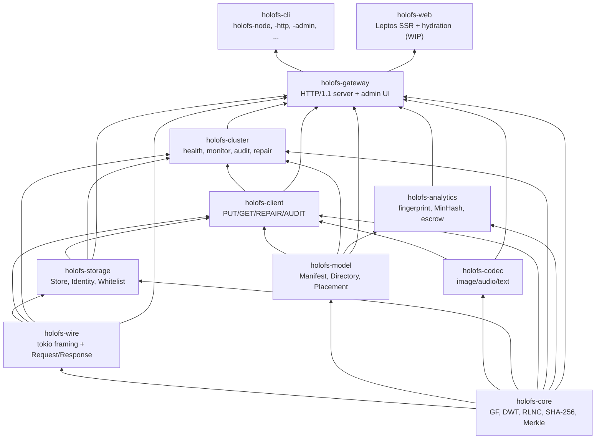
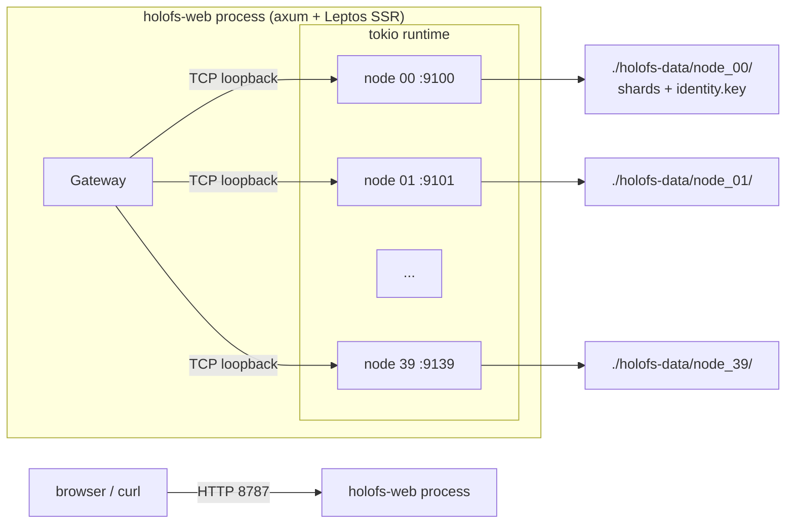
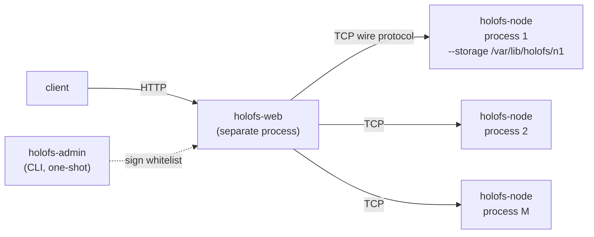
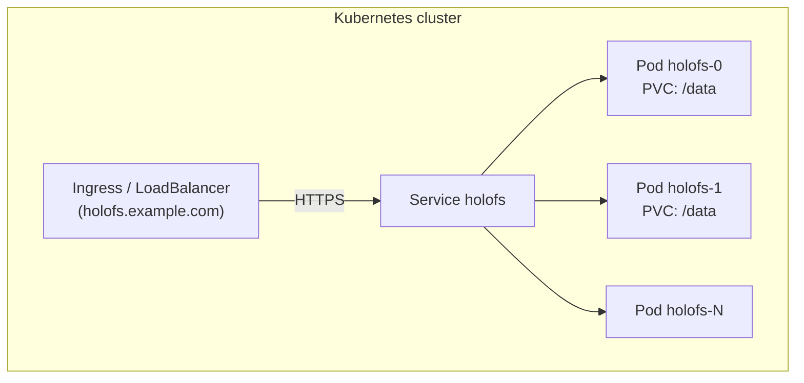
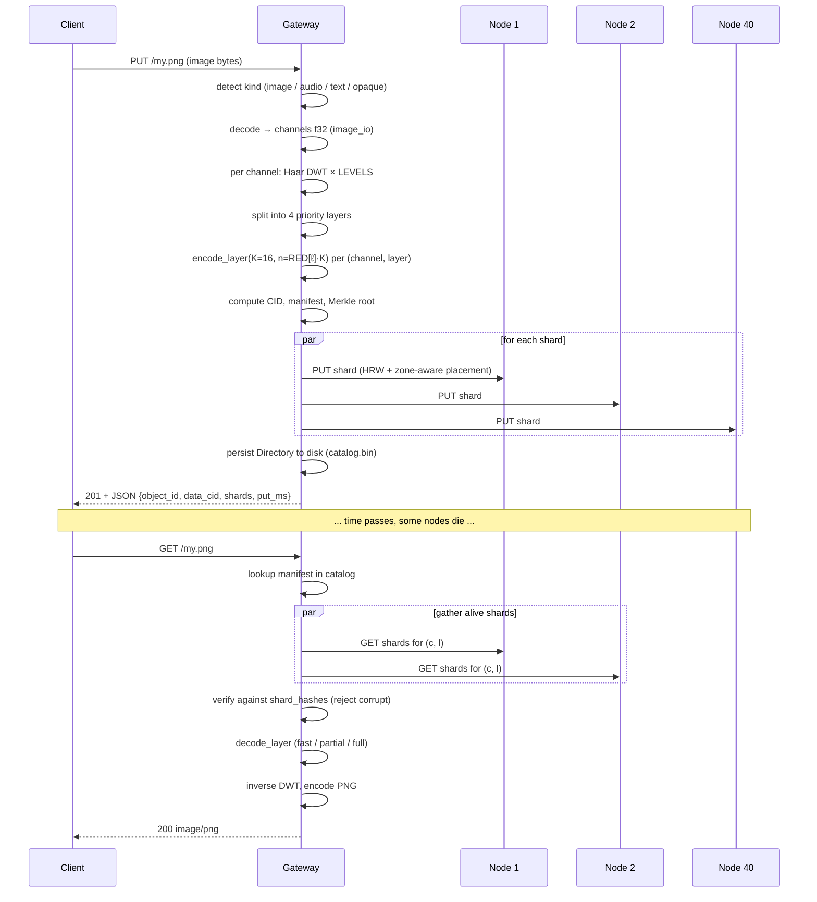

# Архитектура


Структура holofs системного уровня, предназначенная для сопровождающих и
рецензентов. Математические основы см. в [theory.md](./theory.md); детали
HTTP / проводного протокола см. в [api.md](./api.md).

## Содержание

1. [Граф зависимостей crate'ов](#1-crate-dependency-graph)
2. [Топологии процессов / развёртывания](#2-process--deployment-topologies)
3. [Жизненный цикл объекта (PUT → GET)](#3-object-lifecycle-put--get)
4. [Модель персистентности](#4-persistence-model)
5. [Модель доверия](#5-trust-model)
6. [Модель конкурентности](#6-concurrency-model)
7. [Режимы отказов](#7-failure-modes)

---

## 1. Граф зависимостей crate'ов

Строгий топологический порядок — никогда не позволяйте стрелкам указывать вверх.



**Эвристика.** Pull request, добавляющий восходящее ребро в этом графе,
требует отдельного обсуждения — почти всегда это означает, что тип или
функция находится не в том crate.

---

## 2. Топологии процессов / развёртывания

### A. Встроенный однопроцессный (разработка / небольшие кластеры)



Используется для демо, разработки, одномашинного bare-metal. Gateway и
node делят tokio runtime, но общаются по реальному TCP — легко мигрировать
на multi-process позже.

### B. Multi-process bare-metal кластер



Каждый node — независимый процесс ОС со своим персистентным каталогом
хранения и идентичностью Ed25519. Gateway сконфигурирован подписанным
whitelist'ом из троек `(addr, pubkey, zone)`. Изоляция отказов реальная:
убийство одного node-процесса не валит ничего другого.

Скриптовый вариант: `./scripts/spawn-cluster.sh N BASE_PORT GATEWAY_ADDR`
поднимает всю топологию одной командой.

### C. Kubernetes (StatefulSet)



`deploy/helm/holofs` предоставляет шаблоны StatefulSet + PersistentVolumeClaim.
Каждый pod запускает многоэтапный Docker-образ, который автоматически
поднимает встроенные node под собственным PVC `/data`. Для очень больших
кластеров разделите на N gateway-pod'ов + M выделенных node-pod'ов
(Helm chart поддерживает `nodeCount` и `gatewayCount` по отдельности).

---

## 3. Жизненный цикл объекта (PUT → GET)



### Различия по kind

| Kind     | Путь PUT                                              | Ответ GET          |
|----------|-------------------------------------------------------|--------------------|
| image    | DWT 2D × 3 каналов × 4 слоя × RLNC                    | повторно закодированный PNG |
| audio    | DWT 1D × 1–2 каналов × 4 слоя × RLNC                  | WAV 16-bit PCM     |
| text     | chunk'и по границе UTF-8 × 1 слой × систематический RLNC | text/plain + пропуски |
| opaque   | один поток байтов × 1 слой × RLNC (без DWT)           | исходные байты     |

---

## 4. Модель персистентности

Каждый node владеет каталогом. Там живут три вида файлов:

```
<storage>/
├── identity.key                # 32-byte Ed25519 seed (mode 0600)
├── <hex>/<hex>.shard           # one file per stored shard
└── <hex>/<hex>.shard
```

Gateway дополнительно владеет:

```
<storage>/catalog.bin            # serialised Directory (Manifest map)
                                 # Header magic: "HOLOFSD1"
```

### Раскладка файла shard

```
magic        8  bytes  = "HOLOFSS1"
object_id    8  bytes  big-endian
channel      1  byte
layer        1  byte
coeffs_len   4  bytes  big-endian
payload_len  4  bytes  big-endian
coeffs       coeffs_len bytes
payload      payload_len bytes
```

Имя файла — `hex(sha256(shard))`, разбитое как `<2 hex chars>/<remaining 62>.shard`
(git-стиль fanout, чтобы избежать огромных каталогов).

### Атомарность записи

```
write to <name>.shard.tmp
fsync
rename <name>.shard.tmp → <name>.shard
```

Сбой оставляет либо ничего, либо полный shard — никогда обрывочный файл.

### Восстановление индекса

При `Store::open(dir)` node обходит своё дерево и перестраивает in-memory
индекс `HashMap<(object_id, channel, layer), HashMap<Hash, Shard>>` путём
повторного хэширования каждого shard. Это единственный допустимый источник
истины — нет отдельного `.idx`-файла, который мог бы устареть.

### Dedup

Имена shard-файлов адресуются по содержимому. Дубликатный PUT (те же
коэффициенты + payload) обнаруживается через `fs::write(... .tmp)` →
`rename` поверх существующего файла (перезаписывает идентично).
In-memory проверка индекса ранее всё равно возвращает `false` из `put()`,
так что вызывающий знает, что новый shard не появился.

---

## 5. Модель доверия

| Компонент       | Предположение о доверии                               |
|-----------------|-------------------------------------------------------|
| Admin           | абсолютное — подписывает whitelist, генерирует пары ключей |
| Gateway         | доверяет подписи admin на whitelist                   |
| Node            | доверяет собственному `identity.key` (файловая система) |
| Inter-node      | не общаются peer-to-peer; только gateway ↔ node       |
| Client          | доверяет gateway (TLS рекомендуется для prod)         |

Мы явно **не** являемся permissionless-системой: нет proof-of-replication,
нет защиты от Sybil. holofs находится в том же классе доверия, что и
Backblaze B2 или AWS S3, а не Filecoin или Storj. Структурный анализ см.
в [threat-model.md](./threat-model.md).

### Используемые криптографические примитивы

| Назначение                       | Примитив                        | Crate                |
|----------------------------------|---------------------------------|----------------------|
| Целостность shard / объекта      | SHA-256 (FIPS 180-4, собственная реализация) | holofs-core         |
| Идентичность node                | Ed25519                         | ed25519-dalek (RFC 8032) |
| Подпись admin-whitelist          | Ed25519                         | ed25519-dalek       |
| Handshake-challenge              | случайный 32-байтовый nonce + Ed25519 | holofs-storage      |
| Key escrow / Shamir-style        | RLNC над GF(2⁸) с пользовательским K | holofs-analytics    |
| Доменное разделение              | строковый префикс (`holofs-XXX-vN`) перед входом hash / sign |

---

## 6. Модель конкурентности

- **Tokio multi-threaded runtime** наверху каждого бинарника
  (`#[tokio::main(flavor = "multi_thread")]`).
- **Одна задача на соединение** в gateway и в каждой node.
- **`tokio::sync::Mutex`** для разделяемого состояния (catalog, store,
  reputation, admin\_kills). Мы никогда не удерживаем мьютекс через
  границу `.await` на горячем пути — вместо этого используем snapshot-паттерны.
- **Каналы** пока не используются (система request/response); будущие
  стриминговые ответы будут использовать `tokio::sync::mpsc`.

### Фоновые задачи в gateway

| Задача             | Периодичность | Crate           |
|--------------------|---------------|------------------|
| Health monitor     | `HOLOFS_MONITOR_INTERVAL` (15 с по умолчанию) | holofs-cluster |
| PoR auditor        | `HOLOFS_AUDIT_INTERVAL` (30 с по умолчанию)   | holofs-cluster |
| Catalog autosave   | при каждой мутации catalog (inline)           | holofs-gateway |

Обе фоновые задачи прерываются по SIGINT через `tokio::select!`.

---

## 7. Режимы отказов

| Отказ                                       | Обнаруживается через         | Восстановление                    |
|---------------------------------------------|------------------------------|-----------------------------------|
| Процесс node падает                         | health monitor (`Ping`)      | margin пересчитывается; если `LowMargin`, repair ставится в очередь |
| ОС node перезагружается, возвращается с той же identity | health monitor `revived` event | `repair_node` перезаполняет HRW-долю |
| Node возвращает неверные байты (тихая порча) | PoR audit (несовпадение хэша) | reputation падает; node исключается из `live` |
| Node лжёт «у меня есть», не сохраняя        | PoR audit (`MissingShard`)   | reputation падает |
| Целая стойка / зона уходит в darkness        | health monitor + zone-aware  | объект остаётся декодируемым до L_{n-1}/L_{n-2} |
| Gateway падает посреди PUT                  | client retry                 | shard'ы уже на node дедуплицируются по хэшу при повторе |
| Gateway падает посреди DELETE               | несогласованность: часть node очищена, часть нет | следующий проход health обнаруживает осиротевшие shard'ы (TODO: gc) |
| Порча диска для одного файла shard          | проверка хэша при чтении      | shard отбрасывается → margin падает → repair |
| Сетевая партиция между gateway и node       | таймаут RPC                   | health monitor → исключение → repair, если margin падает |
| Подпись whitelist недействительна           | проверка при запуске gateway | отказ от запуска (fail-fast) |

### От чего мы не защищаем

- **Byzantine gateway**: gateway доверенный. Вредоносный gateway может
  испортить все данные.
- **Согласованный сговор node**: K вредоносных node (порог K-of-N) могут
  реконструировать любой объект. Reputation реактивен, не превентивен.
- **Атаки по побочным каналам на транзит shard**: TLS смягчит
  прослушивание; он не предотвращает атаки по таймингам на табличные
  обращения GF(2⁸) (которые в модели угроз holofs всё равно публичны).
