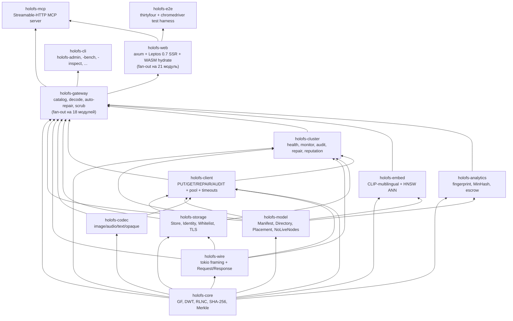
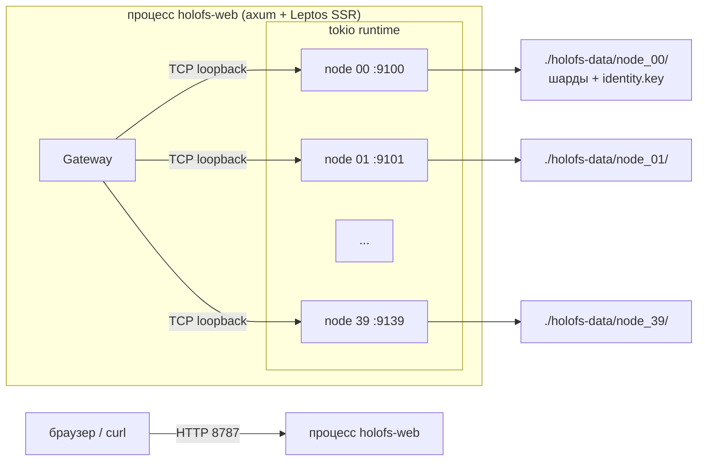
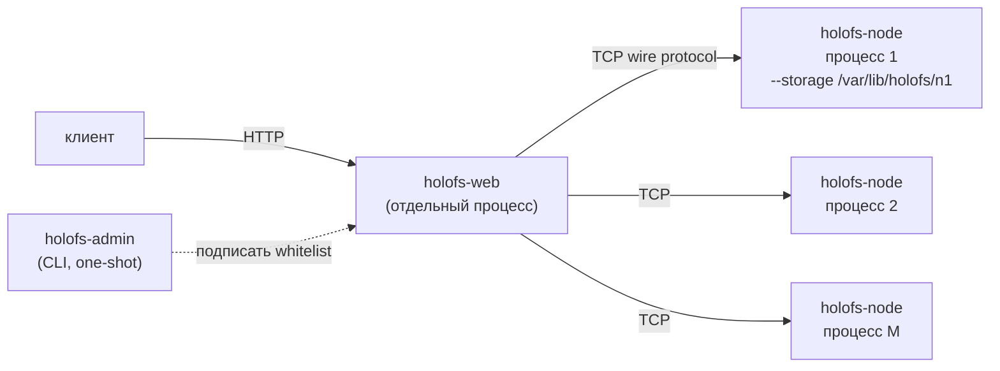
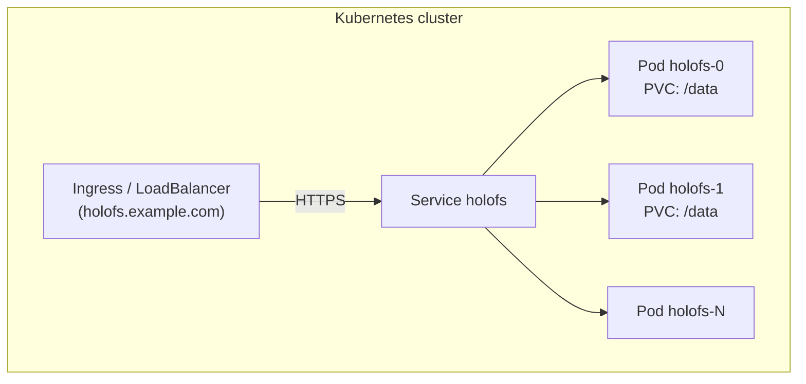
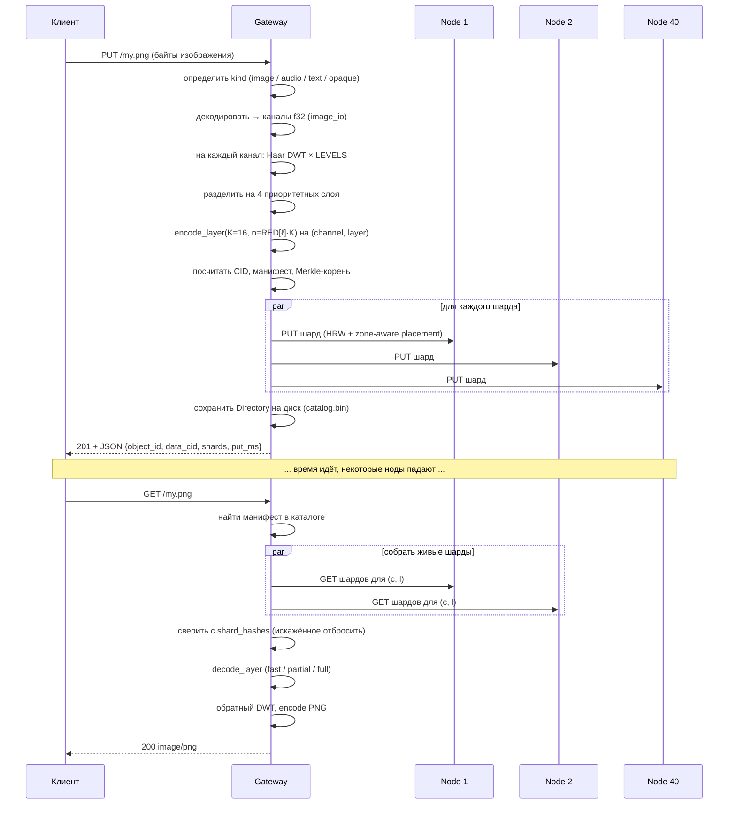

# Архитектура

Структура holofs системного уровня, предназначенная для сопровождающих и
ревьюеров. Математические основы см. в [theory.md](./theory.md); детали
HTTP / сетевого протокола см. в [api.md](./api.md).

## Содержание

1. [Граф зависимостей крейтов](#1-граф-зависимостей-крейтов)
2. [Топологии процессов / развёртывания](#2-топологии-процессов--развёртывания)
3. [Жизненный цикл объекта (PUT → GET)](#3-жизненный-цикл-объекта-put--get)
4. [Модель персистентности](#4-модель-персистентности)
5. [Модель доверия](#5-модель-доверия)
6. [Модель конкурентности](#6-модель-конкурентности)
7. [Режимы отказов](#7-режимы-отказов)

---

## 1. Граф зависимостей крейтов

Строгий топологический порядок — стрелки никогда не должны идти вверх.



**Правило хорошего тона.** PR, добавляющий ребро «вверх» в этот граф,
требует отдельного обсуждения — почти всегда это значит, что тип или
функция лежит не в том крейте.

### 1.1. Разбиение крейта gateway

Крейт `holofs-gateway` экспортирует один тип — `Gateway`, — но его
реализация расщеплена на 18 соседних модулей, каждый со своим блоком
`impl Gateway { ... }`. Всё, что остаётся в `http_gateway.rs` (288
строк), — состояние + аксессоры + два общих помощника
`persist_catalog` и `invalidate_cache`. Публичный API сохранён через
`pub use` в корне крейта; потребители по-прежнему пишут
`holofs_gateway::GatewayError`, `holofs_gateway::SimilarReport` и т. п.
без указания пути к модулю.

| Модуль | Назначение |
|---|---|
| `http_gateway` | Структура `Gateway`, конструкторы, аксессоры, `persist_catalog`, `invalidate_cache`. |
| `error` | Enum `GatewayError` + `Display` + `From<NoLiveNodes>`. |
| `util` | Небольшие хелперы: `now_unix`, `directory_object_id`, определители content-type, `encode_png`. |
| `decode` | HTTP-обёртка над декодированием — `decode_object`, `get_or_decode` (PNG-кэш). |
| `ingest` | Универсальный PUT — `ingest_bytes`, `put_any`, per-kind помощники пустого манифеста. |
| `repair` | `decode_with_autorepair`, `repair_object_inplace`, `purge_orphans_of`. |
| `dirops` | `remove_object`, `mkdir`, `rmdir`, `rename`, `list_dir`. |
| `versions` | История версий каждого объекта: archive / list / restore / delete + retention. |
| `search` | CLIP-multilingual embed-пайплайн + семантический поиск на HNSW. |
| `similarity` | Типы `SimilarScope` / `SimilarMatch` / `ShardOverlap` + помощники по scope. |
| `fingerprint` | Перцептуальный fingerprint + `similar_to`. |
| `mix` | Wavelet-mix + фильтр аудио-полос. |
| `diff` | Побайтовый chunk-diff. |
| `spotlight` | ROI-композиты «резко внутри / размыто снаружи». |
| `inspect` | View-model для `/inspect` + извлечение payload'а шарда. |
| `metrics` | `file_metrics` — storage/dedup + оригинальность + энергия по слоям за один проход. |
| `health` | Статистика кластера, admin-переключатели, `scrub_tick`, `object_health`. |
| `escrow` | Shamir-style RLNC key escrow. |
| `gc` | Сборщик мусора (orphan-shards). |

**Правило хорошего тона.** Новые методы `Gateway` идут в модуль, чью
концепцию они расширяют, а не в `http_gateway.rs`. Если нужен новый
модуль — он появляется рядом с остальными со своим блоком
`impl Gateway`; ничто в `http_gateway.rs` не должно снова разрастаться.

### 1.2. Слой надёжности

Примитивы надёжности живут в `holofs-web`, потому что они компонуют
HTTP-поверхность, а не состояние gateway. Полный справочник env-var
см. в [operations.md § 5.6](operations.md#56-слой-надёжности).

| Модуль | Назначение |
|---|---|
| `holofs_web::supervised` | `supervised_spawn(name, shutdown, counter, f)` — обёртка над `tokio::spawn` с ловлей паник и exp-backoff перезапуском. |
| `holofs_web::timeout` | Middleware `run_with_deadline` + duration-ведра `SHORT` / `MEDIUM` / `LONG`. |
| `holofs_web::backpressure` | Middleware `with_permit` — `Arc<Semaphore>::try_acquire_owned` на ведро, 503 при перегрузке. |
| `holofs_web::admin_auth` | `AdminAuth::from_env` + middleware `require_admin_token` — bearer-token гейт для `/admin/*` + `/api/gc`. |
| `holofs_web::bootstrap` | Читает env, прокидывает общий `CancellationToken` в каждую долгоживущую задачу, собирает handle `Bootstrap`, на который main.rs ждёт при shutdown, включает supervised-задачу reputation-persist. |

**Fail-loud persistence** — это изменение на стороне gateway, а не
holofs-web: `Gateway::persist_catalog` возвращает
`Result<(), GatewayError::Persist>`, и каждый писательский путь
(`ingest`, `dirops`, `versions`) пробрасывает ошибку через `?`.

### 1.3. Разбиение крейта web

`holofs-web` разбит на однозадачные соседние модули — ничто внутри не
превышает нескольких сотен строк.

**`lib.rs`** — регистр модулей + `pub use` в корне крейта +
топ-компоненты [`Shell`] / [`App`] / [`RoutedApp`] + утилита
`url_encode` + WASM-точка входа `hydrate`. Всё остальное живёт в
соседних модулях:

| Модуль | Назначение |
|---|---|
| `catalog_types` | View-model `CatalogEntry`, общий для SSR + hydrate. `from_manifest` (только SSR). |
| `filter` | Фильтр каталога — `CatalogFilter`, `apply_filter`, `compile_glob`, `parse_date_to_unix`, `ymd_to_unix` + семь unit-тестов. Только SSR. |
| `server_fns` | Три `#[server]` функции (`get_catalog`, `list_dir`, `list_dir_page`) + `ListDirPage` + `TreeSort` + `compare_entries`. |
| `catalog_ui` | Пятнадцать Leptos-компонентов — `CatalogPage`, `CatalogFocusView`, `FilterBar`, `TreeZoomButtons`, `Breadcrumb`, `CatalogTreeView` + eager/lazy варианты, `LazyLevel`, `LazyDirNode`, `CatalogTreeBody`, `TreeNodeView`, `MkdirForm`, `UploadForm`, `ObjectCard`. |

**`handlers.rs`** — чистая регистрация модулей + `pub use`. Каждый
обработчик живёт в доменном submodule под `handlers/`:

| Модуль | Обработчики |
|---|---|
| `handlers/objects` | GET / PUT / DELETE `/*path`, `/preview/*`, `/preview/stream/*`, `/api/shard/…`, wasm alias. |
| `handlers/dirops` | mkdir, rmdir, rm, mv (JSON + form). |
| `handlers/uploads` | multipart `/api/upload`. |
| `handlers/versions` | `/api/restore`, `/api/versions/delete`. |
| `handlers/analytics` | `/api/fingerprint/*`, `/api/mix.png`, `/api/mix-save`, `/api/spotlight.png`. |
| `handlers/search` | `/api/embed_all`, `/api/search`. |
| `handlers/health` | `/api/stats`, `/metrics`, `/api/gc`, `/admin/node`, `/api/health/events` SSE. |
| `handlers/escrow` | `/escrow/split`, `/escrow/download`, `/escrow/recover`. |
| `handlers/util` | Чистые помощники — валидация пути, парсинг форм, HTML/JSON escape, header shortcuts, `error_to_response`. |
| `handlers/response` | Сборщики ответов — `serve_with_range`, ingest / remove / mkdir / rmdir / rename → HTTP, stats + fingerprint → JSON. |

Публичный API сохранён через `pub use handlers::foo` в корне
`handlers.rs`, так что существующие в `main.rs` ссылки
`handlers::mkdir` / `handlers::spotlight_png` / и т. п. резолвятся без
изменений.

Примитивы надёжности из § 1.2 (`supervised`, `timeout`, `backpressure`,
`admin_auth`, `bootstrap`) не затронуты — они и так лежали в своих
модулях.

**Правило хорошего тона.** Новые Leptos-компоненты идут в
`catalog_ui.rs` (если про каталог) или в свежий соседний модуль
(page-scale вроде `/health`, `/search`, `/versions`). Новые
axum-обработчики — в доменный модуль, чью концепцию они расширяют
(`handlers/dirops.rs` для нового варианта mkdir и т. д.). Ничто новое
не должно раздувать верхнеуровневые `lib.rs` или `handlers.rs`.

---

## 2. Топологии процессов / развёртывания

### A. Встроенный однопроцессный (dev / малые кластеры)



Используется для демо, разработки, single-machine bare-metal. Gateway
и ноды делят один tokio-runtime, но общаются по настоящему TCP — легко
позже перейти на multi-process.

### B. Multi-process bare-metal кластер



Каждая нода — независимый процесс ОС со своей персистентной
storage-директорией и Ed25519-идентификацией. Gateway настроен со
списком троек `(addr, pubkey, zone)`, подписанных администратором.
Изоляция отказов реальная: убийство одного процесса ноды ничего больше
не роняет.

Скриптовой вариант: `./scripts/spawn-cluster.sh N BASE_PORT
GATEWAY_ADDR` поднимает всю топологию одной командой.

### C. Kubernetes (StatefulSet)



`deploy/helm/holofs` предоставляет шаблоны StatefulSet +
PersistentVolumeClaim. Каждый под запускает multi-stage Docker-образ,
который автоматически поднимает встроенные ноды на своём `/data` PVC.
Для очень больших кластеров разделяют на N gateway-подов + M
выделенных node-подов (Helm-chart поддерживает `nodeCount` и
`gatewayCount` независимо).

---

## 3. Жизненный цикл объекта (PUT → GET)



### Различия по kind

| Kind     | Путь PUT                                                | Ответ GET          |
|----------|---------------------------------------------------------|--------------------|
| image    | DWT 2D × 3 канала × 4 слоя × RLNC                       | пересобранный PNG  |
| audio    | DWT 1D × 1–2 канала × 4 слоя × RLNC                     | WAV 16-bit PCM     |
| text     | Чанки по границам UTF-8 × 1 слой × систематический RLNC | text/plain + дырки |
| opaque   | Один байт-поток × 1 слой × RLNC (без DWT)               | оригинальные байты |

---

## 4. Модель персистентности

У каждой ноды есть своя директория. В ней живут три типа файлов:

```
<storage>/
├── identity.key                # 32-байтовый Ed25519-seed (mode 0600)
├── <hex>/<hex>.shard           # один файл на хранимый шард
└── <hex>/<hex>.shard
```

Дополнительно у gateway:

```
<storage>/catalog.bin            # сериализованный Directory (карта Manifest)
                                 # Header magic: "HOLOFSD1"
```

### Формат файла шарда

```
magic        8  bytes  = "HOLOFSS1"
object_id    8  bytes  big-endian
channel      1  byte
layer        1  byte
coeffs_len   4  bytes  big-endian
payload_len  4  bytes  big-endian
coeffs       coeffs_len bytes
payload      payload_len bytes
```

Имя файла — `hex(sha256(shard))`, разбитое как
`<2 hex>/<remaining 62>.shard` (git-стилевой fanout, чтобы избежать
огромных директорий).

### Атомарность записи

```
записать в <name>.shard.tmp
fsync
rename <name>.shard.tmp → <name>.shard
```

При падении на диске остаётся либо ничего, либо целый шард — рваного
файла не бывает.

### WAL + group-commit

Каждый `Store::put_appended` (вызывается из хендлера node-сервиса на
`Request::Put` / `Request::PutBatch`) пишет length-prefixed запись с
sha256-дайджестом в append-only WAL-сегмент (`wal-<N>.log`, magic
`HOLOFSW1`). Фоновый flusher просыпается каждые
`HOLOFS_NODE_FLUSH_INTERVAL_MS` (дефолт 5 мс, молча клампится до ≥ 1
мс после фикса B3), сбрасывает `BufWriter`, отпускает store-лок и
вызывает `fsync` по нижележащему файлу через `spawn_blocking`. Когда
fsync возвращается, `wal_synced_seq` бампится и все ожидатели
последовательности ≤ этого значения нотифицируются. Под burst из
24 encoder'ов это превращает 24 × 12 ≈ 288 конкурентных
per-shard fsync'ов в ~200 batched fsync/сек, где каждый batch
амортизирует N pending-appends. Handler не возвращает `Ack`, пока
его WAL-seq не приземлится на диск, — граница durability не
изменилась по сравнению с pre-WAL эрой.

### At-rest шифрование (AES-256-GCM)

Установите `HOLOFS_AT_REST_ENC=1` на ноде для включения — переключатель
булев, не hex-ключ. 32-байтовый ключ HKDF-SHA256 выводится из
собственного Ed25519 identity-seed ноды (тот же `identity.key`, что
используется для wire-handshake), с `salt = "holofs-shard-salt-v1"` и
`info = "holofs-shard-key-v1"`. При включении node-сервис
переключает magic шард-файла с `HOLOFSS1` на `HOLOFSS2` и запечатывает
`coeffs || payload` с AES-256-GCM; 12-байтовый nonce хранится инлайн
сразу после AAD-заголовка. Хэши шардов считаются по *plaintext*
payload, так что hash inventory и content-addressing не меняются —
нода, переключающая флаг mid-life, эмитит тот же список хэшей на
следующем скане. См. `crates/holofs-storage/src/crypto.rs::derive_shard_key`
по деривации и on-disk формату.

**Покрытие угроз.** Защищает от filesystem-level чтения на хосте
ноды (инсайдер, утечка бэкап-ленты). **Не** защищает от самой node-
процесса, держащего K шардов объекта, — plaintext расшифровывается
на каждом чтении. И поскольку ключ привязан к identity-seed, потеря
identity-key означает невосстановимые шарды; забэкапьте `identity.key`
оффлайн до включения.

### Восстановление индекса

На `Store::open(dir)` нода обходит своё дерево и пересобирает
in-memory `HashMap<(object_id, channel, layer), HashMap<Hash, Shard>>`,
перехэшируя каждый шард. Это единственный допустимый источник истины —
нет отдельного `.idx`, который мог бы «протухнуть».

### Дедупликация

Имена файлов шардов content-addressed. Дубликатный PUT (те же
коэффициенты + payload) обнаруживается через
`fs::write(... .tmp)` → `rename` поверх существующего файла (запись
идентична). Проверка in-memory индекса выше по стеку всё равно
возвращает `false` из `put()`, так что вызывающий знает: новый шард не
появился.

---

## 5. Модель доверия

| Компонент       | Предположение о доверии                                |
|-----------------|--------------------------------------------------------|
| Admin           | абсолютное — подписывает whitelist, генерирует ключи   |
| Gateway         | доверяет admin-подписи на whitelist                    |
| Node            | доверяет своему `identity.key` (файловая система)      |
| Между нодами    | не общаются peer-to-peer; только gateway ↔ нода        |
| Клиент          | доверяет gateway (TLS рекомендуется в проде)           |

Мы явно **не** являемся permissionless-системой: нет
proof-of-replication, нет Sybil-сопротивления. holofs — в том же
классе доверия, что Backblaze B2 или AWS S3, а не Filecoin или Storj.
Структурированный разбор см. в [threat-model.md](./threat-model.md).

### Используемые криптографические примитивы

| Назначение                       | Примитив                          | Крейт                |
|----------------------------------|-----------------------------------|----------------------|
| Целостность шарда / объекта      | SHA-256 (FIPS 180-4, hand-rolled) | holofs-core          |
| Идентичность ноды                | Ed25519                           | ed25519-dalek (RFC 8032) |
| Подпись whitelist                | Ed25519                           | ed25519-dalek        |
| Challenge handshake              | 32-байтовый случайный nonce + Ed25519 | holofs-storage   |
| Key escrow / Shamir-style        | RLNC над GF(2⁸) с кастомным K     | holofs-analytics     |
| Domain separation                | Строковой префикс (`holofs-XXX-vN`) перед hash/sign |         |

---

## 6. Модель конкурентности

- **Tokio multi-threaded runtime** во главе каждого бинаря
  (`#[tokio::main(flavor = "multi_thread")]`).
- **Одна задача на соединение** в gateway и в каждой ноде.
- **`tokio::sync::Mutex`** для общего состояния (catalog, store,
  reputation, admin\_kills). Мьютекс никогда не удерживается через
  `.await` на горячем пути — вместо этого snapshot-паттерны.
- **Каналы** пока не используются (система request/response); будущие
  стриминговые ответы будут использовать `tokio::sync::mpsc`.

### Фоновые задачи в gateway

| Задача                | Периодичность | Крейт          |
|-----------------------|---------------|----------------|
| Health monitor        | `HOLOFS_MONITOR_INTERVAL` (по умолчанию 15 с) | holofs-cluster |
| PoR auditor           | `HOLOFS_AUDIT_INTERVAL` (по умолчанию 30 с)   | holofs-cluster |
| Shard scrub           | `HOLOFS_SCRUB_INTERVAL` (по умолчанию 600 с)  | holofs-gateway |
| Reputation persist    | `HOLOFS_REPUTATION_PERSIST_INTERVAL` (по умолчанию 30 с) | holofs-web |
| Catalog autosave      | на каждую мутацию каталога (inline)           | holofs-gateway |

Все четыре фоновых цикла запускаются под
[`holofs_web::supervised::supervised_spawn`](#12-слой-надёжности):
паника → ERROR-лог + экспоненциальный backoff (кап 1 → 30 с) +
перезапуск. Они также уважают общий
`tokio_util::sync::CancellationToken` и корректно завершаются по
SIGTERM / SIGINT.

### Auto-repair-on-read + scrub

Путь GET обёрнут в `decode_with_autorepair`: при
`ClientError::LayerLost` он инкрементит `auto_repairs_total`, запускает
`repair_object_inplace` (хирургическая починка на уровне ноды через
`list_node_hashes` + `repair_node`), сохраняет изменённый манифест и
повторяет декодирование один раз. Второй сбой инкрементит
`auto_repair_failures_total` и отдаёт исходную ошибку.

Scrub делает ту же работу *проактивно*: обходит каталог между
пользовательскими запросами, диффит `list_node_hashes` против
`place_shard` для каждого объекта и хирургически чинит несовпадения до
того, как читатель наткнётся на `LayerLost`. Отслеживается счётчиками
`scrub_runs_total` + `scrub_repairs_total`.

### Конкурентность GC на основе эпох

GC-проход работает конкурентно с PUT / `restore_version` / scrub без
глобального writer-lock'а. Каждый шард в сторе несёт свою write-epoch
(wall-clock, мс с UNIX_EPOCH). В начале GC-прохода gateway снимает
snapshot эпохи; на стороне ноды `PurgeByHashUpTo` отказывается удалять
любой шард, чья stored-эпоха превышает snapshot — свежий PUT,
гонящийся с проходом, защищён тем, что его эпоха строго больше отсечки.

Единственная оставшаяся точка сериализации — перезапись
`embeddings.bin` в конце GC-прохода: этот шаг всё ещё держит
`gc_barrier` против `search::embed_object` append'а, поскольку у самого
файла нет epoch-аналога.

### Таймауты RPC + ретраи

Каждая wire-операция (`rpc_attempt`) идёт внутри
`tokio::time::timeout` с бюджетом `HOLOFS_RPC_TIMEOUT_MS` (по
умолчанию 8 с). При истечении срока пуловое соединение помечается
испорченным, а ошибка всплывает как `io::ErrorKind::TimedOut`;
`is_likely_transient` реагирует на этот kind и делает одну
автоматическую попытку на свежедиалированном соединении. В сочетании с
per-addr keepalive-пулом флапающая нода теперь ограничивает
пользовательскую задержку до 8 с + один retry вместо OS-уровня TCP
60–75 с.

---

## 7. Режимы отказов

| Отказ                                       | Как обнаруживается           | Восстановление                    |
|---------------------------------------------|------------------------------|-----------------------------------|
| Процесс ноды падает                         | health monitor (`Ping`)      | margin пересчитывается; при `LowMargin` — repair в очереди |
| ОС ноды перезагружается с той же identity   | событие `revived` у monitor  | `repair_node` перезаполняет HRW-долю |
| Нода возвращает неверные байты (тихая порча)| PoR audit (несовпадение хэша) | reputation падает; нода исключается из `live` |
| Нода врёт «у меня есть» без хранения        | PoR audit (`MissingShard`)   | reputation падает                 |
| Целый rack / zone уходит в даун             | health monitor + zone-aware  | объект остаётся декодируемым до L_{n-1}/L_{n-2} |
| Gateway падает во время PUT                 | ретрай клиента                | шарды, уже попавшие на ноды, дедупятся по хэшу при повторе |
| Gateway падает во время DELETE              | несогласованно: часть нод почистили, часть нет | `POST /api/gc` подметает orphan-шарды по запросу; фоновый scrub ловит их между прогонами |
| Порча одного файла шарда на диске           | верификация хэша при чтении   | шард отбрасывается → margin падает → auto-repair-on-read перекодирует из доноров |
| Сетевой раздел gateway ↔ нода               | бюджет `HOLOFS_RPC_TIMEOUT_MS` | RPC с таймаутом повторяется один раз на свежем сокете; health monitor → исключить → repair если margin падает |
| Все ноды одновременно недоступны            | `place_shard` возвращает `NoLiveNodes` | gateway отвечает 503 с `ClusterDegraded` вместо panic; клиент ретраит когда ноды вернутся |
| Подпись whitelist невалидна                 | проверка при старте gateway   | отказывается стартовать (fail-fast) |

### От чего мы не защищаем

- **Византийский gateway**: gateway доверенный. Злонамеренный gateway
  может испортить все данные.
- **Скоординированный сговор нод**: K злонамеренных нод (K-of-N
  threshold) могут реконструировать любой объект. Репутация реактивна,
  а не превентивна.
- **Побочные каналы при передаче шардов**: TLS смягчит подслушивание,
  но не предотвратит timing-атаки на GF(2⁸) table lookups (которые в
  модели угроз holofs и так публичны).
