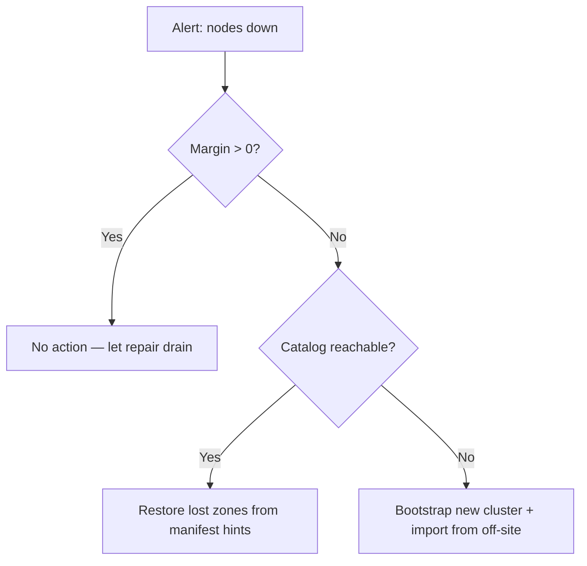

# Руководство по эксплуатации


> ⚠ **Translation may be stale.** This file was last synced before Stage 12-15 (versioning + deletion, HNSW-backed semantic search, /spotlight ROI, streaming /holo, /diff, /similar, auto-repair-on-read, background scrub, typed RPC layer with timeouts + NoLiveNodes panic-fix, per-folder inline upload). The English source under [../](../) is the canon for any new feature; the [Unreleased] block of [../../CHANGELOG.md](../../CHANGELOG.md) lists every delta this translation does not yet cover.


Это руководство описывает, как **развернуть**, **мониторить**, **резервно
копировать**, **восстанавливать** и **планировать ёмкость** кластера holofs
в продакшене.

## Содержание

1. [Топологии развёртывания](#1-deployment-topologies)
2. [Установка на bare-metal](#2-bare-metal-install)
3. [Docker / Compose](#3-docker--compose)
4. [Kubernetes через Helm](#4-kubernetes-via-helm)
5. [Справочник конфигурации](#5-configuration-reference)
6. [Мониторинг и алертинг](#6-monitoring--alerting)
7. [Планирование ёмкости](#7-capacity-planning)
8. [Резервное копирование и восстановление](#8-backup--restore)
9. [Disaster recovery](#9-disaster-recovery)
10. [Day-2 процедуры](#10-day-2-procedures)

---

## 1. Топологии развёртывания

| Топология        | Сценарий использования                          | Плюсы                           | Минусы                                |
|------------------|-------------------------------------------------|---------------------------------|---------------------------------------|
| Embedded         | Dev, демо, оценка на одном хосте                | Один бинарник, без оркестрации  | Нет отказоустойчивости на уровне машины |
| Multi-process    | Один хост, изолированные границы процессов      | Перезапуск node независимо      | Всё ещё единственная точка отказа (хост) |
| Multi-host       | Продакшен: 40 node по 5 зонам × 8 хостам        | Реальная долговечность, zone failover | Требует сеть, мониторинг, ops    |
| Kubernetes       | Облако / on-prem с k8s                          | Helm-based, декларативно        | Stateful sets сложнее, чем stateless  |

**Рекомендуемая цель для продакшена:** ≥ 5 зон × ≥ 4 хоста × 1–2 node на хост.
Это переживает **любой полный отказ одной зоны** плюс одновременные сбои
отдельных node в оставшихся зонах (см. [theory.md §3](./theory.md#3-priority-layers)).

---

## 2. Установка на bare-metal

### 2.1. Предварительные требования

- Linux (kernel ≥ 5.10), macOS или Windows Server.
- Минимум 2 ГБ RAM и 10 ГБ диска на node; рекомендуется 8 ГБ / 100 ГБ.
- Открытые TCP-порты: gateway (`8787`) и node-порты (9100–9139 по умолчанию).
- Учётная запись пользователя (например, `holofs`) с правом записи в каталог данных.

### 2.2. Сборка из исходников

```sh
# Pinned MSRV: 1.75
rustup install 1.75.0
cargo build --release --workspace
```

Бинарники появляются в `target/release/`:

| Бинарник         | Назначение                                    |
|------------------|-----------------------------------------------|
| `holofs`         | Основной CLI с множеством команд              |
| `holofs-node`    | Демон одного node                             |
| `holofs-web`     | HTTP gateway (axum + Leptos SSR)              |
| `holofs-admin`   | Операции администрирования кластера (whitelist, ban) |
| `holofs-bench`   | Бенчмарки                                     |
| `holofs-inspect` | Инспекция manifest / shard                    |
| `holofs-cluster` | Всё-в-одном (встроенные N node + gateway)     |
| `holofs-fs`      | Помощники локальной файловой системы          |

### 2.3. Whitelist (обязательно в продакшене)

```sh
# 1. Generate per-node Ed25519 keypairs
holofs-admin keygen --out keys/

# 2. Build whitelist
holofs-admin whitelist build \
    --node 10.0.1.10:9100 --pubkey keys/node1.pub --zone 0 \
    --node 10.0.1.11:9100 --pubkey keys/node2.pub --zone 1 \
    --node 10.0.2.10:9100 --pubkey keys/node3.pub --zone 2 \
    --admin-key keys/admin.priv \
    --out whitelist.holofs

# 3. Distribute whitelist.holofs to every node + gateway
```

Проводной формат: `HOLOFSW1` (см. [api.md §3.4](./api.md#34-whitelist-holofsw1)).

### 2.4. TLS для проводного протокола (`--tls`, `--mtls`)

Бинарный протокол gateway↔node можно шифровать с помощью rustls (Stage 6).
Два опциональных флага управляют поведением:

| Флаг       | Эффект |
|------------|--------|
| `--tls`    | Шифровать wire frames. Сертификат сервера проверяется клиентом. |
| `--mtls`   | Подразумевает `--tls`. Сервер дополнительно требует и проверяет клиентский сертификат. |

**Встроенный режим (без `--whitelist`):** бинарник генерирует
самоподписанный CA + leaf-сертификаты при старте. Полезно для разработки,
демо, однохостовых кластеров. CA живёт только в RAM и регенерируется при
каждом перезапуске — клиенты, кеширующие сертификаты, будут видеть
свежих издателей при каждой загрузке.

**Распределённый режим (`--whitelist`):** передавайте заранее выпущенные
PEM в командной строке. Сгенерируйте их с помощью `openssl` или вашей
существующей PKI:

```sh
# Issue one CA + one cert per host (script omitted — use your PKI).
holofs-web \
  --whitelist cluster.wl \
  --admin-pubkey "$(holofs-admin pubkey admin.key)" \
  --tls --mtls \
  --tls-ca-cert /etc/holofs/ca.crt \
  --tls-cert   /etc/holofs/gateway.crt \
  --tls-key    /etc/holofs/gateway.key
```

Соответствующая команда node подхватывает свой leaf — см. systemd unit
в §2.5 для формы с env-vars.

Файлы сертификатов должны удовлетворять:
- SAN'ы leaf-сертификата должны покрывать каждый хост `addr:port`, к которому
  gateway будет подключаться (DNS-имя или IP-литерал).
- CA-сертификат — корень доверия с обеих сторон — один и тот же файл
  на каждой node и на каждом gateway.
- При `--mtls` обе стороны предъявляют один и тот же вид leaf,
  подписанного этим CA. Добавьте отдельный «gateway»-сертификат, если
  нужны различные значения CN.

### 2.5. Сервис systemd

`/etc/systemd/system/holofs-node@.service`:

```ini
[Unit]
Description=holofs node %i
After=network.target

[Service]
Type=simple
User=holofs
Group=holofs
Environment=HOLOFS_DATA_DIR=/var/lib/holofs/node%i
Environment=HOLOFS_LISTEN=0.0.0.0:91%i
Environment=HOLOFS_WHITELIST=/etc/holofs/whitelist.holofs
Environment=HOLOFS_SECRET_KEY=/etc/holofs/keys/node%i.priv
# Stage 6: enable TLS on the wire protocol. Drop the next four lines for
# plain-TCP clusters; set HOLOFS_MTLS=1 for mutual auth.
Environment=HOLOFS_TLS=1
Environment=HOLOFS_TLS_CA_CERT=/etc/holofs/ca.crt
Environment=HOLOFS_TLS_CERT=/etc/holofs/node%i.crt
Environment=HOLOFS_TLS_KEY=/etc/holofs/node%i.key
ExecStart=/usr/local/bin/holofs-node
Restart=on-failure
RestartSec=5s
LimitNOFILE=65536

[Install]
WantedBy=multi-user.target
```

Затем `systemctl enable --now holofs-node@00 holofs-node@01 …`.

---

## 3. Docker / Compose

### 3.1. Получение образа

```sh
docker pull ghcr.io/holofs/holofs:0.1.0
```

Dockerfile многоэтапный: rust:1.75-slim → debian:bookworm-slim. Образ
runtime запускается под **non-root uid 10001**, с `tini` как PID 1.

### 3.2. Однохостовой кластер (embedded)

```sh
docker run -d \
  --name holofs \
  -p 8787:8787 \
  -v /srv/holofs:/var/lib/holofs \
  -e HOLOFS_N_NODES=40 \
  -e HOLOFS_DATA_DIR=/var/lib/holofs \
  ghcr.io/holofs/holofs:0.1.0 holofs-cluster
```

### 3.3. Multi-process через Compose

```yaml
serviceпрпрs:
  node-0: { ... environment: { HOLOFS_LISTEN: 0.0.0.0:9100, HOLOFS_ZONE: 0 } }
  node-1: { ... environment: { HOLOFS_LISTEN: 0.0.0.0:9101, HOLOFS_ZONE: 0 } }
  ...
  gateway:
    command: holofs-web
    environment:
      HOLOFS_NODES: node-0:9100,node-1:9101,...
      HOLOFS_WHITELIST: /etc/holofs/whitelist.holofs
    ports: ["8787:8787"]
    depends_on: [node-0, node-1, ...]
```

---

## 4. Kubernetes через Helm

Helm chart находится по пути `deploy/helm/holofs/`.

```sh
helm install holofs ./deploy/helm/holofs \
  --set nodeCount=40 \
  --set persistence.size=50Gi \
  --set ingress.enabled=true \
  --set ingress.hosts[0].host=holofs.example.com
```

**Ключевые ресурсы** (см. `deploy/helm/holofs/templates/`):

- `StatefulSet` для node — стабильные сетевые ID, PVC на каждую реплику.
- `Service` (`ClusterIP`) для gateway.
- `Ingress` (опционально) для внешнего HTTPS.

**Zone awareness:** `values.yaml` предоставляет `nodeAffinity` и `topologySpreadConstraints`.
Сопоставьте вашу k8s-метку зоны (например, `topology.kubernetes.io/zone`)
с зонами holofs через `HOLOFS_ZONE_FROM_LABEL=topology.kubernetes.io/zone`
(автоматически выводится из `Downward API`).

**Probes:**

```yaml
livenessProbe:  { httpGet: { path: /,        port: http }, periodSeconds: 30 }
readinessProbe: { httpGet: { path: /health,  port: http }, periodSeconds: 10 }
```

**Security context:** запускается под `uid 10001`, `readOnlyRootFilesystem: true`,
`capabilities.drop: [ALL]`.

---

## 5. Справочник конфигурации

Вся конфигурация через env vars (CLI-флаги также принимаются; флаги побеждают).

### 5.1. Общие для всех бинарников

| Переменная                  | По умолчанию | Описание                                     |
|-----------------------------|--------------|----------------------------------------------|
| `HOLOFS_STORAGE_DIR`        | `./holofs-data` | Корень хранения для shards, catalog, manifests |
| `HOLOFS_LOG`                | `info,holofs_web=debug` | Спецификация фильтра `tracing`       |
| `HOLOFS_LOG_FORMAT`         | `text`       | `text` \| `json` (для продакшена: `json`)    |
| `HOLOFS_TELEMETRY_OTLP`     | (off)        | OTLP endpoint, например `http://otel:4317` (планируется) |
| `HOLOFS_METRICS_LISTEN`     | (unset)      | Опциональный отдельный адрес прослушивания Prometheus (по умолчанию: на основном порту) |

У каждой переменной есть соответствующий CLI-флаг (`--storage`, `--log`
и т.д.) — запустите `holofs-web --help` для полного списка. Флаги имеют
приоритет над env vars.

### 5.2. Специфичные для node

| Переменная                  | По умолчанию   | Описание                                 |
|-----------------------------|----------------|------------------------------------------|
| `HOLOFS_LISTEN`             | `0.0.0.0:9100` | Адрес привязки проводного протокола      |
| `HOLOFS_ZONE`               | `0`            | ID зоны (используется zone-aware placement) |
| `HOLOFS_SECRET_KEY`         | —              | Путь к Ed25519 secret (32 байта)         |
| `HOLOFS_WHITELIST`          | —              | Путь к подписанному whitelist            |
| `HOLOFS_MAX_DISK_GB`        | `unlimited`    | Отказывать в Put при превышении          |

### 5.3. Специфичные для gateway

| Переменная                  | По умолчанию   | Описание                                 |
|-----------------------------|----------------|------------------------------------------|
| `HOLOFS_NODES`              | —              | CSV из `addr:port` (начальная инициализация) |
| `HOLOFS_MONITOR_INTERVAL`   | `15`           | Период health-poll (секунды)             |
| `HOLOFS_AUDIT_INTERVAL`     | `30`           | Период фонового audit (секунды)          |
| `HOLOFS_REPAIR_INTERVAL`    | `60`           | Фоновый sweep repair                     |
| `HOLOFS_TLS`                | (off)          | Шифровать проводной протокол (gateway↔nodes) через rustls. Embedded-режим автогенерирует self-signed CA. |
| `HOLOFS_MTLS`               | (off)          | Подразумевает `HOLOFS_TLS=1`. Сервер также требует и проверяет клиентский сертификат. |
| `HOLOFS_TLS_CERT`           | —              | Распределённый режим: путь к PEM leaf cert |
| `HOLOFS_TLS_KEY`            | —              | Распределённый режим: путь к соответствующему PEM-ключу |
| `HOLOFS_TLS_CA_CERT`        | —              | Распределённый режим: путь к PEM CA trust root |
| `HOLOFS_PLACEMENT`          | `rendezvous`   | `roundrobin` \| `rendezvous` \| `rendezvous-zone` |

### 5.4. Embedded cluster

| Переменная                  | По умолчанию   | Описание                                 |
|-----------------------------|----------------|------------------------------------------|
| `HOLOFS_N_NODES`            | `40`           | Число in-process node                    |
| `HOLOFS_EMBED_BASE_PORT`    | `9100`         | Стабильный базовый порт (избегайте ephemeral churn) |
| `HOLOFS_ZONES`              | `5`            | Число зон для назначения                 |

---

## 6. Мониторинг и алертинг

### 6.1. Endpoint метрик

Gateway предоставляет `GET /metrics` в формате Prometheus text exposition
(`text/plain; version=0.0.4`). Pull-based gauges берутся из
`Gateway::api_stats` + admin-kill snapshot — в начальном релизе нет
counters/histograms.

| Метрика                         | Тип   | Метки                        | Значение |
|---------------------------------|-------|------------------------------|----------|
| `holofs_nodes_total`            | gauge | —                            | node в топологии |
| `holofs_nodes_live`             | gauge | —                            | node, не отключённые админом |
| `holofs_objects_total`          | gauge | `kind` (image/audio/text/opaque) | размер catalog по kind |
| `holofs_shards_total`           | gauge | —                            | запланированные shard'ы по catalog |
| `holofs_shards_unique`          | gauge | —                            | различные хэши shard'ов |
| `holofs_dedup_savings_pct`      | gauge | —                            | `(1 − unique/total) × 100` |
| `holofs_bytes_total`            | gauge | —                            | приблизительные сохранённые байты |
| `holofs_node_admin_killed`      | gauge | `node`, `addr`, `zone`       | флаг admin-kill для каждой node |

Будущие релизы добавят counters и histograms для wire RTT, repair
throughput, decode latency, и reputation (сейчас логируется только
через `tracing`).

### 6.2. Эталонные правила алертов

```yaml
groups:
- name: holofs
  rules:
  - alert: HolofsNodeDown
    expr: holofs_node_up == 0
    for: 5m
    annotations:
      summary: "holofs node {{ $labels.node }} is down"

  - alert: HolofsZoneDegraded
    expr: count by (zone) (holofs_node_up == 0) >= 2
    for: 10m
    annotations:
      summary: "zone {{ $labels.zone }} has ≥2 dead nodes (margin loss)"

  - alert: HolofsDiskFillingFast
    expr: predict_linear(holofs_bytes_stored_total[1h], 24*3600) > node_filesystem_size_bytes
    for: 30m
    annotations:
      summary: "node {{ $labels.node }} will fill within 24h"

  - alert: HolofsRepairFailing
    expr: rate(holofs_repair_jobs_total{result="failed"}[15m]) > 0.1
    for: 30m

  - alert: HolofsLowReputation
    expr: holofs_node_reputation < 0.5
    for: 1h
    annotations:
      summary: "node {{ $labels.node }} reputation collapsed (audit mismatches)"
```

### 6.3. Трейсинг

Когда задано `HOLOFS_TELEMETRY_OTLP`, gateway экспортирует OTLP/HTTP spans:

| Имя span               | Полезные атрибуты                          |
|------------------------|--------------------------------------------|
| `gateway.put`          | `object.kind`, `bytes.in`, `shards.out`    |
| `gateway.get`          | `object.kind`, `layers`, `bytes.out`, `nodes_contacted` |
| `gateway.repair`       | `object_id`, `channel`, `layer`, `shards_recovered` |
| `wire.send`            | `op`, `target.node`, `bytes`               |

### 6.4. Дашборды

Эталонный Grafana-дашборд (JSON) поставляется в `deploy/grafana/holofs.json`.
Верхние панели: ingest rate, decode P99 по kind, dedup %, repair throughput,
heatmap доступности node по зонам.

---

## 7. Планирование ёмкости

### 7.1. Накладные расходы на хранение

Стоимость хранения определяется в основном избыточностью RLNC по приоритетным
слоям. Для объекта с payload размера `S`:

$$
\text{stored bytes} \approx S \cdot \sum_{\ell} R_\ell \cdot \frac{N_\ell}{K_\ell}
$$

При коэффициентах слоёв по умолчанию `R = [4.0, 2.5, 1.6, 1.15]` средние
накладные расходы — примерно **9.25×** (с учётом метаданных, ~9.4×).

| Размер объекта | На кластере | На node (40 node) |
|----------------|-------------|-------------------|
| 1 MB           | ~9.4 MB     | ~235 KB           |
| 1 GB           | ~9.4 GB     | ~235 MB           |
| 1 TB           | ~9.4 TB     | ~235 GB           |

**Тюнинг для более дешёвого хранения:** опустите `R_0` (избыточность для
катастрофических потерь) до `2.0`, а `R_1..3` до `[1.5, 1.2, 1.05]` —
накладные расходы упадут до ~5.75×. См. [theory.md §3](./theory.md#3-priority-layers)
для компромисса survival-margin.

### 7.2. Планирование CPU

| Операция               | Стоимость (относительно memcpy) | Узкое место   |
|------------------------|---------------------------------|---------------|
| GF(2⁸) multiply        | 4× memcpy (LUT)                 | L1 cache      |
| Haar 2D forward        | 3× memcpy                       | RAM bandwidth |
| RLNC encode K=16, payload 1024 B | 60× memcpy            | CPU           |
| SHA-256 over 1 MB      | 2× memcpy (с SIMD)              | CPU           |

Современное x86_64-ядро выдерживает ~150 MB/s RLNC encode при K=16.
Многоядерность масштабируется линейно до тех пор, пока диск IO не станет
узким местом (~500 MB/s на NVMe).

### 7.3. Планирование сети

Худший случай по wire-bandwidth на Put:

```
egress = payload × redundancy_factor × layer_count
       ≈ payload × 9.25
```

Для аплоада 100 MB gateway эмитит ~925 MB в пул node. Планируйте
**минимум 1 Gbit/s** между gateway и node.

### 7.4. Правильный размер кластера

| Параметр                  | Выбирайте по                               |
|---------------------------|--------------------------------------------|
| `N_nodes`                 | ≥ 4 × `K`, чтобы у RLNC был placement-запас |
| `N_zones`                 | ≥ 3; 5 рекомендуется для потери любой одной зоны |
| `K`                       | 16 (по умолчанию) — sweet spot CPU vs margin |
| `redundancy_per_layer`    | соответствует желаемому ≥ 5σ survival margin |

---

## 8. Резервное копирование и восстановление

### 8.1. Что живёт на диске

На каждой node (`HOLOFS_DATA_DIR`):

```
manifests/         per-object manifests (HOLOFSM6)
catalog/HOLOFSD1   the directory index (atomic write)
shards/aa/bb……    .shard files, content-addressed
identity/secret    Ed25519 private key
whitelist.holofs   admin-signed peer list
```

### 8.2. Модель резервного копирования

**holofs сам себе резервная копия** для любого *одного* объекта — потеря
node запускает RLNC repair от соседей. Резервная копия важна для:

1. **Катастрофической потери кластера** (например, все зоны offline).
2. **Логической порчи / случайного удаления** (`Purge` необратим).
3. **Идентификационный материал** (Ed25519 ключи + подписанный whitelist) —
   без них замены не могут присоединиться к доверенному кластеру.

### 8.3. Рекомендованный план резервного копирования

| Данные               | Частота         | Инструменты               | Где                 |
|----------------------|-----------------|---------------------------|---------------------|
| Identity + whitelist | При каждом изменении | `restic`, `aws s3 sync` | Зашифрованное off-site |
| Снапшот catalog      | Ежечасно        | `cp catalog/HOLOFSD1 → …` | S3 / NFS / лента   |
| Каталог shards       | Опционально     | `restic` или zfs snapshots | Холодное хранилище |

Периодический `holofs-admin export <name>` реконструирует объект в один
канонический файл и записывает его во внешний bucket. Это рекомендуемый
способ резервного копирования **конкретных высокоценных объектов**.

### 8.4. Процедуры восстановления

| Сценарий                              | Процедура |
|---------------------------------------|-----------|
| Потерян диск одной node               | Очистить диск; перезапустить node; кластер автоматически восстановит shard'ы. |
| Потеряно несколько node, < margin     | Никаких действий — RLNC decode это терпит. |
| Catalog испорчен на gateway           | Скопировать `catalog/HOLOFSD1` с peer gateway или из последнего ежечасного бекапа; перезапустить. |
| Потерян весь кластер                  | Развернуть новый кластер; `holofs-admin import` для каждого off-site экспорта. |
| Компрометация ключа whitelist          | Сгенерировать новый admin-ключ; пере-подписать whitelist; hot-reload (см. [§10.4](#104-hot-reload-whitelist)). |

---

## 9. Disaster recovery

### 9.1. Цели RTO / RPO

| Отказ                         | RTO       | RPO     | Триггер                              |
|-------------------------------|-----------|---------|--------------------------------------|
| Одна node                     | < 1 мин   | 0       | Авто (monitor + repair)              |
| Одна зона (≤ ⅕ node)          | < 5 мин   | 0       | Авто (margin всё ещё положителен)    |
| Две зоны одновременно          | < 1 час   | Часы    | Вручную: развернуть + import         |
| Весь кластер                  | < 8 час   | ≤ 1 час | Вручную: полное восстановление из S3-бекапов |

### 9.2. Дерево решений



### 9.3. Учения

Проводить ежеквартально. Предлагаемые сценарии:

1. **Zone-kill drill** — `kubectl drain` всех pod в одной zone label;
   проверить, что ни один объект не становится недоступным и repair
   завершается за < 10 мин.
2. **Cold-restore drill** — со свежего k8s-кластера запустить
   `holofs-admin import-all` против backup bucket; измерить RTO.
3. **Key rotation drill** — подписать новый whitelist admin-ключом,
   hot-reload без downtime.

---

## 10. Day-2 процедуры

### 10.1. Добавление node

```sh
# 1. Generate new node key
holofs-admin keygen --out keys/node41.priv

# 2. Re-sign whitelist with new entry
holofs-admin whitelist add \
  --whitelist whitelist.holofs \
  --node 10.0.3.10:9100 --pubkey keys/node41.pub --zone 4 \
  --admin-key keys/admin.priv \
  --out whitelist.holofs.new

# 3. Distribute, hot-reload, then start node
```

Catalog не меняется; будущие placement могут выбрать новую node через HRW.
Существующие объекты **не** перебалансируются автоматически — запустите
`holofs-admin rebalance` для миграции shard'ов (опционально; не требуется
для корректности).

### 10.2. Удаление (вывод из эксплуатации) node

```sh
# 1. Drain — refuse new Puts, finish in-flight
holofs-admin node drain 10.0.1.10:9100

# 2. Wait for repair to redistribute its shards
holofs-admin node status 10.0.1.10:9100
# → "drained, 0 shards remaining"

# 3. Remove from whitelist
holofs-admin whitelist remove --node 10.0.1.10:9100 …

# 4. Shut down systemd unit
systemctl stop holofs-node@10
```

### 10.3. Замена сбойного диска

1. `systemctl stop holofs-node@N`
2. Заменить диск, смонтировать свежую файловую систему в `HOLOFS_DATA_DIR`.
3. Восстановить файлы идентификации (`identity/secret`, `whitelist.holofs`)
   из off-site бекапа — они привязаны к адресу node, а не к диску.
4. `systemctl start holofs-node@N` — кластер заполнит диск через
   audit-driven repair за минуты — часы в зависимости от размера.

### 10.4. Hot-reload whitelist

```sh
# Drop new whitelist file into place
cp whitelist.holofs.new /etc/holofs/whitelist.holofs

# Signal all daemons
killall -SIGHUP holofs-node holofs-web
```

Демоны повторно проверяют admin-подпись перед заменой нового списка.
Плохая подпись логируется, а старый список остаётся.

### 10.5. Rolling upgrade

Holofs гарантирует совместимость проводного протокола в пределах minor
версии (`0.x → 0.x+1` безопасно). Для k8s:

```sh
helm upgrade holofs ./deploy/helm/holofs --set image.tag=0.2.0
```

StatefulSet раскатывает по одному pod за раз, ждёт readiness, затем
продолжает. Во время раската кластер работает в деградированном режиме
ровно на одну node — хорошо в пределах margin для любого дефолтного сайзинга.

### 10.6. Шпаргалка команд состояния

```sh
# Cluster-wide overview
curl -s http://gw:8787/api/stats | jq

# Per-node health (HTML in browser; JSON via accept header)
curl -s -H "accept: application/json" http://gw:8787/health

# Margin per (channel, layer) for one object
curl -s http://gw:8787/health/photo.png

# Inspect shard distribution
curl -s http://gw:8787/inspect/photo.png
```

См. [api.md](./api.md) для полного перечня маршрутов.
