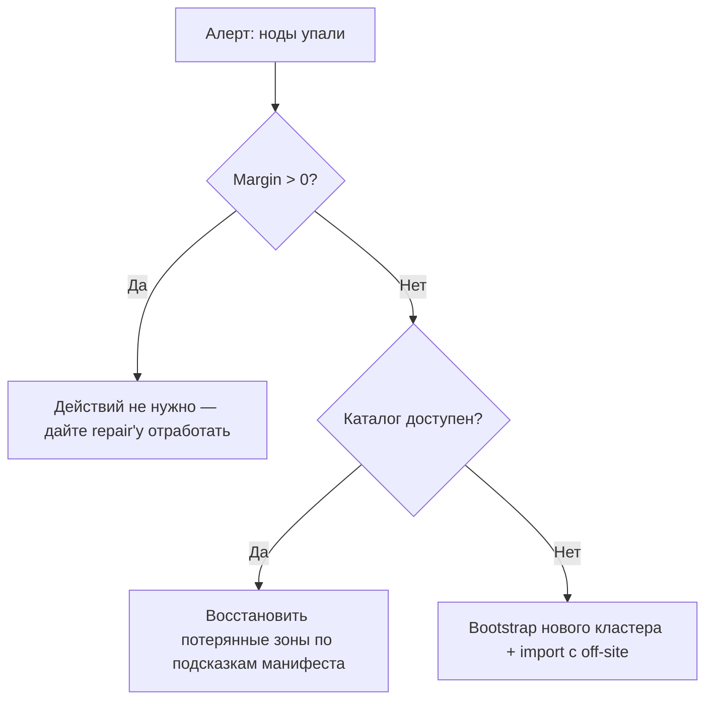

# Руководство по эксплуатации

Это руководство описывает, как **разворачивать**, **мониторить**,
**резервно копировать**, **восстанавливать** и **планировать ёмкость**
кластера holofs в проде.

## Содержание

1. [Топологии развёртывания](#1-топологии-развёртывания)
2. [Установка на bare-metal](#2-установка-на-bare-metal)
3. [Docker / Compose](#3-docker--compose)
4. [Kubernetes через Helm](#4-kubernetes-через-helm)
5. [Справочник конфигурации](#5-справочник-конфигурации)
6. [Мониторинг и алертинг](#6-мониторинг-и-алертинг)
7. [Планирование ёмкости](#7-планирование-ёмкости)
8. [Резервное копирование и восстановление](#8-резервное-копирование-и-восстановление)
9. [Disaster recovery](#9-disaster-recovery)
10. [Day-2 процедуры](#10-day-2-процедуры)

---

## 1. Топологии развёртывания

| Топология        | Сценарий использования                          | Плюсы                            | Минусы                                |
|------------------|-------------------------------------------------|----------------------------------|---------------------------------------|
| Embedded         | Dev, демо, single-host evaluation               | Один бинарь, без оркестрации     | Нет отказоустойчивости на уровне машин |
| Multi-process    | Один хост, изолированные процессы               | Ноды перезапускаются независимо  | Всё ещё single point of failure (хост) |
| Multi-host       | Прод: 40 нод × 5 зон × 8 хостов                 | Настоящая durability, zone failover | Требует сеть, мониторинг, ops       |
| Kubernetes       | Cloud / on-prem с k8s                           | На Helm, декларативно            | StatefulSet сложнее stateless-варианта |

**Рекомендуемая цель для прода:** ≥ 5 зон × ≥ 4 хоста × 1–2 ноды на хост.
Такое размещение переживает **отказ любой одной полной зоны** плюс
одиночные отказы отдельных нод в оставшихся зонах (см.
[theory.md §4](./theory.md#4-приоритетные-слои-и-голографическая-деградация)).

---

## 2. Установка на bare-metal

### 2.1. Требования

- Linux (kernel ≥ 5.10), macOS или Windows Server.
- 2 ГБ RAM и 10 ГБ диска на ноду минимум; 8 ГБ / 100 ГБ рекомендуется.
- Открытые TCP-порты: gateway (`8787`) и порты нод (9100–9139 по умолчанию).
- Пользовательская учётка (например, `holofs`) с правом записи в data-директорию.

### 2.2. Сборка из исходников

```sh
# Закреплённый MSRV: 1.81
rustup install 1.81.0
cargo build --release --workspace
```

Бинарники появляются в `target/release/`:

| Бинарь               | Назначение                                     |
|----------------------|------------------------------------------------|
| `holofs-web`         | HTTP-шлюз + встроенный кластер (axum + Leptos SSR) |
| `holofs-node`        | Демон одной ноды (`ADDR --storage DIR`)        |
| `holofs-admin`       | Whitelist keygen + подписание                  |
| `holofs-cluster`     | Локальный dev-harness: N in-process нод + gateway |
| `holofs-fs`          | Playground для локальной файловой системы      |
| `holofs-inspect`     | Инспекция манифестов / шардов                  |
| `holofs-bench`       | Бенчмарки                                      |
| `holofs-soak`        | Долгий генератор случайных операций против живого gateway |
| `holofs-soak-report` | Рендер HTML + Markdown отчёта из soak-каталога |
| `holofs`             | Legacy single-command CLI                      |

### 2.3. Whitelist (обязателен в проде)

```sh
# 1. Сгенерировать admin-keypair (хранится офлайн; наружу — только pubkey).
holofs-admin gen-key admin.key
holofs-admin pubkey admin.key   # печатает ADMIN_PUBKEY_HEX

# 2. Единожды поднять каждую ноду — она создаст свой identity.key и
#    выведет свой pubkey; соберите эти hex-строки.
holofs-node 10.0.1.10:9100 --storage /var/lib/holofs/node00
# → holofs-node addr=10.0.1.10:9100 pubkey=NODE0_PUBKEY_HEX

# 3. Подписать whitelist. Каждый --node в формате ADDR=PUBKEY_HEX:ZONE.
holofs-admin sign-whitelist \
    --admin admin.key \
    --node 10.0.1.10:9100=NODE0_PUBKEY_HEX:0 \
    --node 10.0.1.11:9100=NODE1_PUBKEY_HEX:0 \
    --node 10.0.2.10:9100=NODE2_PUBKEY_HEX:1 \
    --out whitelist.holofs

# 4. Раскатить whitelist.holofs на каждую ноду + gateway. Проверить:
holofs-admin verify-whitelist whitelist.holofs --admin-pubkey ADMIN_PUBKEY_HEX
holofs-admin show-whitelist   whitelist.holofs
```

Формат: `HOLOFSW1` (см. [api.md §3.4](./api.md#34-whitelist-holofsw1)).

### 2.4. TLS для сетевого протокола (`--tls`, `--mtls`)

Бинарный протокол gateway↔node можно шифровать через rustls. Два opt-in
флага контролируют поведение:

| Флаг       | Эффект |
|------------|--------|
| `--tls`    | Шифрует wire-фреймы. Клиент проверяет server-cert. |
| `--mtls`   | Подразумевает `--tls`. Сервер дополнительно требует + проверяет client-cert. |

**Embedded-режим (без `--whitelist`):** бинарь генерирует self-signed CA
+ leaf-сертификаты при старте. Полезно для dev, демо, single-host
кластеров. CA живёт только в RAM и регенерируется при каждом
перезапуске — клиенты, кэширующие сертификаты, увидят новых эмитентов
после каждого старта.

**Distributed-режим (`--whitelist`):** передавайте предварительно
выпущенные PEM в командной строке. Генерируйте их через `openssl` или
вашу существующую PKI:

```sh
# Выпустите один CA + один cert на хост (скрипт опущен — используйте свою PKI).
holofs-web \
  --whitelist cluster.wl \
  --admin-pubkey "$(holofs-admin pubkey admin.key)" \
  --tls --mtls \
  --tls-ca-cert /etc/holofs/ca.crt \
  --tls-cert   /etc/holofs/gateway.crt \
  --tls-key    /etc/holofs/gateway.key
```

Соответствующая команда для ноды подхватывает свой собственный
leaf-cert — см. systemd unit в §2.5 для формы через env-var.

Файлы сертификатов должны удовлетворять:
- SAN'ы leaf-cert покрывают каждый хост `addr:port`, к которому будет
  подключаться gateway (DNS name или IP-литерал).
- CA-cert — корень доверия с обеих сторон, один и тот же файл на
  каждой ноде и на каждом gateway.
- Под `--mtls` обе стороны предъявляют одинаковый вид leaf-cert,
  подписанный этой CA. Добавьте отдельный "gateway" cert, если хотите
  различающиеся CN.

### 2.5. systemd-сервис

`/etc/systemd/system/holofs-node@.service`:

```ini
[Unit]
Description=holofs node %i
After=network.target

[Service]
Type=simple
User=holofs
Group=holofs
Environment=HOLOFS_STORAGE_DIR=/var/lib/holofs/node%i
# включить TLS на сетевом протоколе. Уберите следующие четыре строки для
# plain-TCP кластеров; поставьте HOLOFS_MTLS=1 для взаимной аутентификации.
Environment=HOLOFS_TLS=1
Environment=HOLOFS_TLS_CA_CERT=/etc/holofs/ca.crt
Environment=HOLOFS_TLS_CERT=/etc/holofs/node%i.crt
Environment=HOLOFS_TLS_KEY=/etc/holofs/node%i.key
ExecStart=/usr/local/bin/holofs-node
Restart=on-failure
RestartSec=5s
LimitNOFILE=65536

[Install]
WantedBy=multi-user.target
```

Затем `systemctl enable --now holofs-node@00 holofs-node@01 …`.

---

## 3. Docker / Compose

### 3.1. Скачать образ

```sh
docker pull ghcr.io/holofs/holofs:1.0.0
```

Dockerfile многоступенчатый: rust:1.81-slim-bookworm → debian:bookworm-slim.
Runtime-образ работает под **non-root uid 10001**, с `tini` как PID 1.

### 3.2. Single-host кластер (embedded)

```sh
docker run -d \
  --name holofs \
  -p 8787:8787 \
  -v /srv/holofs:/data \
  ghcr.io/holofs/holofs:1.0.0
```

### 3.3. Multi-process через Compose

```yaml
services:
  holofs:
    image: ghcr.io/holofs/holofs:1.0.0
    volumes: ["/srv/holofs:/data"]
    environment:
      HOLOFS_LOG_FORMAT: json
      HOLOFS_ENABLE_EMBED: "1"
      HOLOFS_ENABLE_VERSIONS: "1"
    ports: ["8787:8787"]
```

---

## 4. Kubernetes через Helm

Helm-chart лежит в `deploy/helm/holofs/`.

```sh
helm install holofs ./deploy/helm/holofs \
  --set nodeCount=40 \
  --set persistence.size=50Gi \
  --set ingress.enabled=true \
  --set ingress.hosts[0].host=holofs.example.com
```

**Ключевые ресурсы** (см. `deploy/helm/holofs/templates/`):

- `StatefulSet` для нод — стабильные network ID, PVC на реплику.
- `Service` (`ClusterIP`) для gateway.
- `Ingress` (опционально) для внешнего HTTPS.

**Zone awareness:** `values.yaml` экспонирует `nodeAffinity` и
`topologySpreadConstraints`. Маппьте k8s zone-label (например,
`topology.kubernetes.io/zone`) на зоны holofs через
`HOLOFS_ZONE_FROM_LABEL=topology.kubernetes.io/zone` (авто-вывод через
`Downward API`).

**Probes:**

```yaml
livenessProbe:  { httpGet: { path: /,        port: http }, periodSeconds: 30 }
readinessProbe: { httpGet: { path: /health,  port: http }, periodSeconds: 10 }
```

**Security context:** работает под `uid 10001`,
`readOnlyRootFilesystem: true`, `capabilities.drop: [ALL]`.

---

## 5. Справочник конфигурации

Вся конфигурация — через env-var (CLI-флаги тоже принимаются; флаги
выигрывают).

### 5.1. Gateway (`holofs-web`)

| Переменная                  | По умолчанию              | Описание                                     |
|-----------------------------|---------------------------|----------------------------------------------|
| `HOLOFS_STORAGE_DIR`        | `./holofs-data`           | Корень storage для шардов, каталога, манифестов. |
| `HOLOFS_CATALOG`            | `<storage>/catalog.bin`   | Переопределить путь до файла каталога.       |
| `HOLOFS_CONFIG`             | (не задано)               | Путь до TOML-конфига (§5.7).                 |
| `HOLOFS_LOG`                | `info,holofs_web=debug`   | Спецификация фильтра `tracing`.              |
| `HOLOFS_LOG_FORMAT`         | `text`                    | `text` \| `json` (прод: `json`).             |
| `LEPTOS_SITE_ADDR`          | `127.0.0.1:8787`          | HTTP listen-адрес (`--addr`).                |
| `HOLOFS_METRICS_LISTEN`     | (не задано)               | Опциональный отдельный listen-адрес для Prometheus. |
| `HOLOFS_SEED_PHOTO`         | (не задано)               | Путь до PNG, которым засеять `photo.png` на первом старте. |
| `HOLOFS_NO_SEED`            | `false`                   | Пропустить two-PNG демо-seed на пустом каталоге. |

У каждой переменной из таблицы есть соответствующий CLI-флаг
(`--storage`, `--log`, `--addr`, и т. д.) — запустите `holofs-web
--help` для полного канонического списка. Флаги имеют приоритет над
env-var.

### 5.2. Standalone `holofs-node`

Standalone-демон ноды принимает только позиционные аргументы и **не**
читает никаких `HOLOFS_*` env-var — это намеренно минималистично,
чтобы один и тот же бинарь работал под systemd, docker и в ручном
запуске.

```text
holofs-node [ADDR] [--storage DIR]
```

`ADDR` по умолчанию `127.0.0.1:5000`. `--storage DIR` включает
персистентную identity + шарды на диске; без него нода работает
in-memory и перегенерирует свой pubkey на каждом старте (только для
dev/demo).

### 5.3. Distributed-режим gateway (whitelist + TLS)

| Переменная                  | По умолчанию   | Описание                                     |
|-----------------------------|----------------|----------------------------------------------|
| `HOLOFS_WHITELIST`          | —              | Путь до подписанного whitelist (§2.3). Переключает бинарь в distributed-режим. |
| `HOLOFS_ADMIN_PUBKEY`       | —              | 64-символьный hex admin-pubkey, которым подписан whitelist. |
| `HOLOFS_TLS`                | (off)          | Шифровать сетевой протокол (gateway↔ноды) через rustls. Embedded-режим автоматически генерирует self-signed CA. |
| `HOLOFS_MTLS`               | (off)          | Подразумевает `HOLOFS_TLS=1`. Сервер также требует + проверяет client-cert. |
| `HOLOFS_TLS_CERT`           | —              | Distributed-режим: путь до PEM leaf-cert.    |
| `HOLOFS_TLS_KEY`            | —              | Distributed-режим: путь до соответствующего PEM key. |
| `HOLOFS_TLS_CA_CERT`        | —              | Distributed-режим: путь до PEM CA-trust root. |

### 5.4. Embedded-кластер

Размеры embedded-топологии (`holofs-web` без `--whitelist`) —
compile-time константы: `N_NODES = 40`, `NLAYERS = 4`, `K = 16`,
`LEVELS = 3`. Только базовый порт и seed настраиваются в рантайме.

| Переменная                  | По умолчанию | Описание                                        |
|-----------------------------|--------------|-------------------------------------------------|
| `HOLOFS_EMBED_BASE_PORT`    | `9100`       | Стабильный base-port для in-process нод; каждая нода биндит `base + idx`. Задавайте, чтобы избежать ephemeral-port churn. |
| `HOLOFS_NO_SEED`            | `false`      | Пропустить two-PNG демо-seed на пустом каталоге. Ставьте `true` при перезагрузке с известного sample-дерева, чтобы seed не коллизился с вашими данными. |
| `HOLOFS_W` / `HOLOFS_H`     | `512`        | Размеры кадра (оба должны быть положительным кратным `2^LEVELS = 8`). |

### 5.5. Надёжность

| Переменная                  | По умолчанию | Описание                                             |
|-----------------------------|--------------|------------------------------------------------------|
| `HOLOFS_RPC_TIMEOUT_MS`     | `8000`       | Общий бюджет одного RPC (`tokio::time::timeout`). `0` отключает cap; тогда единственная граница — TCP-таймаут ОС (60–75 с). |
| `HOLOFS_SCRUB_INTERVAL`     | `600`        | Период фонового scrub'а шардов (секунд). `0` отключает. Scrub'ы обходят каталог, диффят `list_node_hashes` против `place_shard`, чинят несовпадения до того, как пользователь на них наткнётся. |
| `HOLOFS_VERSIONS_KEEP_LAST` | `0`          | Cap на per-name историю версий. Дропает старейшие архивы на каждый PUT. `0` = без лимита (тогда единственный путь освободить шарды — вручную `/api/versions/delete`). Требует `--enable-versions`. |
| `HOLOFS_POOL_PER_NODE`      | `8`          | Максимум idle wire-соединений в пуле на адрес ноды. |
| `HOLOFS_POOL_IDLE_SECS`     | `60`         | Дропать пуловые entries, простаивавшие дольше, на `acquire`. |
| `HOLOFS_POOL_DISABLE`       | `false`      | Обойти keepalive-пул — каждый RPC дозванивается заново. Полезно при отладке wire-level багов. |

### 5.5.c. Per-IP rate limit

Дополняет глобальные backpressure-cap'ы: cap'ы не дают процессу
взорваться от любого burst'а — этот слой не даёт одному
плохо-ведущему клиенту заморить остальных. Оба применяются к
MEDIUM (decode / PUT / dir ops) и LONG (search / spotlight / GC)
вёдрам; SHORT и streaming-эндпоинты остаются без лимита.

| Переменная                       | По умолчанию | Описание                                             |
|----------------------------------|--------------|------------------------------------------------------|
| `HOLOFS_RATE_LIMIT_RPS_PER_IP`   | `0`          | Rate заполнения token-bucket'а на клиентский IP. Ноль отключает слой полностью. |
| `HOLOFS_RATE_LIMIT_BURST`        | `2 × rps`    | Максимум токенов в bucket'е. На пустом bucket'е запрос получает 429 с `Retry-After: 1`. |
| `HOLOFS_RATE_LIMIT_IDLE_SECS`    | `300`        | Порог idle-eviction для per-IP карты (ограниченная память при высокой churn-нагрузке клиентов). |

**Источник client-IP.** За обратным прокси middleware читает первый
hop `X-Forwarded-For`. Прямые подключения используют
`ConnectInfo<SocketAddr>` из `into_make_service_with_connect_info`. Ни
того ни другого → общий bucket `0.0.0.0`, чтобы шумные хосты не
получали per-connection free pass.

**Метрика.** `holofs_rate_limit_rejected_total` считает каждый 429.
Длительный ненулевой рейт означает либо злоупотребляющего клиента
(разбирайтесь), либо недостаточно щедрый cap (поднимайте
`rate_limit_rps_per_ip`).

### 5.5.b. Streaming PUT

| Переменная                  | По умолчанию | Описание                                             |
|-----------------------------|--------------|------------------------------------------------------|
| `HOLOFS_UPLOAD_MAX_SIZE`    | `1 GiB`      | Cap на размер тела одного запроса `PUT /*path`. Тело сразу стримится в `<storage>/uploads/upload-<pid>-<counter>.tmp` (константный RAM независимо от скорости клиента / размера тела) и читается обратно в `Vec<u8>` перед вызовом `Gateway::ingest_bytes`. Тела, превышающие cap, возвращают 413 Payload Too Large; tempfile удаляется на каждом exit-пути. |

Стриминг ограничивает RSS-дельту gateway'а копи-буфером (~64 KiB), а
не upload-скоростью клиента — медленный клиент на 200 MiB upload'е
больше не пинит 200 MiB памяти gateway'а на всё время. RSS всё ещё
кратковременно поднимается до размера тела на ingest, потому что
RLNC/DWT-кодек ждёт `&[u8]`; полностью streaming-ingest вне области
рассмотрения, пока кодек его не поддерживает.

### 5.6. Слой надёжности

У каждого knob'а ниже есть безопасное значение по умолчанию; gateway
успешно загружается без явно заданных.

| Переменная                            | По умолчанию | Описание                                             |
|---------------------------------------|--------------|------------------------------------------------------|
| `HOLOFS_MEDIUM_CONCURRENCY`           | `64`         | Permits для MEDIUM-ведра маршрутов (декодирование, PUT, dir-операции). При насыщении middleware обработчика возвращает 503 с диагностическим телом вместо накопления задач axum. Тюньте по `holofs_backpressure_permits_available{bucket="medium"}`. |
| `HOLOFS_LONG_CONCURRENCY`             | `8`          | Permits для LONG-ведра (семантический поиск, spotlight, `/api/gc`, `/api/embed_all`, fingerprint-сканы). |
| `HOLOFS_REPUTATION_PERSIST_INTERVAL`  | `30`         | Как часто общее состояние `Reputation` снапшотится в `<storage>/reputation.bin`. Bootstrap подгружает его на следующий старт; несовпадение `n_nodes` или битый файл тихо откатывает к свежей таблице. Финальный snapshot также пишется на SIGTERM. |
| `HOLOFS_ADMIN_TOKEN`                  | _(не задано)_ | Если задано, `POST /admin/node` и `POST /api/gc` требуют `Authorization: Bearer <token>`. Отсутствие/неверный → 401. |
| `HOLOFS_ADMIN_UNAUTHENTICATED`        | _(не задано)_ | Dev-override: поставьте `1`, чтобы оставить admin-поверхность открытой, когда `HOLOFS_ADMIN_TOKEN` не задан. Логирует WARN при старте. Если не задано ни то ни другое — admin-поверхность выключена (403). |

Таймауты жёстко зашиты по вёдрам (SHORT 10 с, MEDIUM 60 с, LONG
300 с); streaming-эндпоинты (SSE, multipart/x-mixed-replace) + `/mcp`
намеренно без бюджета. Просроченные обработчики отдают
`504 Gateway Timeout` и инкрементят
`holofs_handler_timeouts_total{bucket=…}`.

### 5.7. Опциональные фичи

| Переменная                  | По умолчанию | Описание                                             |
|-----------------------------|--------------|------------------------------------------------------|
| `HOLOFS_ENABLE_VERSIONS`    | `false`      | Зеркало `--enable-versions`. Архивирует каждый PUT-replace как side-файл под `<storage>/versions/<sanitized>/v…bin`. |
| `HOLOFS_ENABLE_EMBED`       | `false`      | Зеркало `--enable-embed`. Загружает CLIP-multilingual модель на первый PUT или первый `/api/search`, затем поддерживает `embeddings.bin`. |
| `HOLOFS_ASYNC_ENCODE`       | `false`      | Переключает дефолтный RLNC PUT-путь с sync на async. Handler возвращает `202 Accepted` сразу после коммита placeholder-манифеста; encode + shard fan-out уходят на detached tokio task. Read-handler'ы гейтятся по `ManifestState` — см. §10.7 по замерам throughput и когда это уместно. |
| `HOLOFS_MCP_TOKEN`          | —            | Если задано, `/mcp`-эндпоинт требует `Authorization: Bearer <token>` И включает write-tools. Без переменной эндпоинт остаётся открытым + read-only. |

### 5.8. TOML-файл конфигурации

Все env-var выше (`HOLOFS_*` и `LEPTOS_SITE_ADDR`) также задаются
через один TOML-файл, передаваемый через `--config
/path/to/holofs.toml` или через env-var `HOLOFS_CONFIG`.
Прокомментированный reference-конфиг лежит в
[`deploy/holofs.example.toml`](../../deploy/holofs.example.toml).

Приоритетная лестница (побеждает самый высокий):

1. CLI-флаг (`--medium-concurrency 128`)
2. Env-var (`HOLOFS_MEDIUM_CONCURRENCY=128`)
3. Значение из TOML-файла (`[reliability] medium_concurrency = 128`)
4. Compile-time default

**Пример**:

```toml
[server]
addr = "0.0.0.0:8787"
storage = "/var/lib/holofs"
log_format = "json"

[tls]
enabled = true
mtls = true
cert = "/etc/holofs/node.crt"
key = "/etc/holofs/node.key"
ca_cert = "/etc/holofs/ca.crt"

[reliability]
medium_concurrency = 128
long_concurrency = 16
scrub_interval_secs = 300

[admin]
# Inline token ИЛИ ссылка на файл (рекомендуется для секретов).
token_file = "/etc/holofs/admin.token"
```

**Секреты.** `[admin] token` и `[mcp] token` принимают либо inline-строку,
либо путь `token_file`, указывающий на файл, чья первая непустая
строка — это токен. Для прода предпочитайте `token_file` с mode
`0400` и root-владельцем, чтобы токен не был видим в git-истории
config-файла / бандлированном Helm-chart.

**Неизвестные поля.** TOML использует `deny_unknown_fields` при
парсинге — опечатка типа `medium_concurency` (пропущена 'r') роняет
загрузку с точным именем ключа в ошибке. Это намеренно; тихий фоллбэк
сводил бы на нет смысл файла.

### 5.9. Шифрование шардов на диске (at-rest)

Включается `HOLOFS_AT_REST_ENC=1` (или `[security] at_rest_encryption
= true` в TOML). Когда включено, каждый шард на диске sealed через
AES-256-GCM. Заголовок остаётся в открытом виде (чтобы `Store::open`
мог индексировать без ключа), но коэффициенты + payload — ciphertext.

**Управление ключами.** 32-байтовый AES-ключ выводится при старте из
identity-seed ноды через HKDF-SHA256 (`salt =
"holofs-shard-salt-v1"`, `info = "holofs-shard-key-v1"`). Никаких
новых секретов ротировать не нужно — потеря `identity.key` и так
означает потерю identity ноды. Ключ живёт в RAM всё время процесса;
root на живой ноде может читать plaintext через легитимный
audit-путь.

**Wire format.** Два магических префикса шардов сосуществуют:

| Magic       | Значение                                                    |
|-------------|-------------------------------------------------------------|
| `HOLOFSS1`  | Plaintext. Читается любой версией.                          |
| `HOLOFSS2`  | Sealed. `[8 B magic][18 B header][12 B nonce][ct+tag]`.     |

18-байтовый header — это AAD для GCM-tag'а, так что любая post-hoc
перезапись header'а (object_id, channel, layer, lengths) инвалидирует
шард при расшифровке. Читалки нюхают первые 8 байт и диспатчат —
смешанные v1 + v2 директории поддерживаются, так что включение на
существующем storage'е sealed'ит только *новые* записи. Полный
re-encryption pass вне области рассмотрения; рекомендуемая миграция —
поднять свежую ноду с новой identity и дать auto-repair passу
перебалансировать шарды на неё.

**Модель угроз.** В области рассмотрения: противник снапшотит файлы
шардов с выключенной ноды (утечка бэкапа, декомиссованный диск, RAID
rebuild оставил старый диск читаемым). Вне области рассмотрения: root
на живой ноде — когда deriv-ключ в RAM, `read_shard_file` даёт
plaintext для легитимных аудитов.

---

## 6. Мониторинг и алертинг

### 6.1. Эндпоинт метрик

Gateway экспортирует `GET /metrics` в формате Prometheus text
exposition (`text/plain; version=0.0.4`). Pull-based gauge'и берутся
из `Gateway::api_stats` + snapshot admin-kill плюс reliability-счётчики.

| Метрика                                      | Тип     | Метки                        | Смысл |
|----------------------------------------------|---------|------------------------------|-------|
| `holofs_nodes_total`                         | gauge   | —                            | нод в топологии |
| `holofs_nodes_live`                          | gauge   | —                            | ноды не в admin-disabled |
| `holofs_objects_total`                       | gauge   | `kind` (image/audio/text/opaque/directory) | размер каталога по kind |
| `holofs_shards_total`                        | gauge   | —                            | плановых шардов по каталогу |
| `holofs_shards_unique`                       | gauge   | —                            | уникальных хэшей шардов |
| `holofs_dedup_savings_pct`                   | gauge   | —                            | `(1 − unique/total) × 100` |
| `holofs_bytes_total`                         | gauge   | —                            | приблизительные хранимые байты |
| `holofs_node_admin_killed`                   | gauge   | `node`, `addr`, `zone`       | флаг admin-kill на ноду |
| `holofs_auto_repairs_total`                  | counter | —                            | GET'ы, вызвавшие retry-руку `decode_with_autorepair` |
| `holofs_auto_repair_failures_total`          | counter | —                            | auto-repair passы, которые сами провалились |
| `holofs_scrub_runs_total`                    | counter | —                            | тики фонового scrub'а (`HOLOFS_SCRUB_INTERVAL`) |
| `holofs_scrub_repairs_total`                 | counter | —                            | объекты, которые scrub починил *до* пользовательских запросов |
| `holofs_catalog_persist_failures_total`      | counter | —                            | Ошибки атомарной записи каталога на диск. Ненулевой = состояние на диске отстало от памяти; следующий restart потеряет записи. Алерт немедленно. |
| `holofs_handler_timeouts_total`              | counter | `bucket` (short/medium/long) | 504-ответы из-за per-bucket deadline. |
| `holofs_backpressure_rejected_total`         | counter | `bucket` (medium/long)       | 503-ответы из-за насыщения семафора. |
| `holofs_backpressure_permits_available`      | gauge   | `bucket` (medium/long)       | Свободных permits'ов. Постоянно 0 = недопровизионное ведро; постоянно max = простой. |
| `holofs_supervised_task_restarts_total`      | counter | `task` (monitor/auditor/scrub) | Паники + внезапные выходы supervised-петель. Любое ненулевое значение флагает повторяющийся краш — оператору стоит разобраться. |
| `holofs_admin_auth_failures_total`           | counter | `outcome` (missing/bad/disabled) | Отказы admin bearer-token'а по причине. `disabled` = поверхность отказала, потому что ни `HOLOFS_ADMIN_TOKEN`, ни `HOLOFS_ADMIN_UNAUTHENTICATED` не заданы. |

Здоровый кластер держит self-healing-счётчики на нуле или около него;
устойчивый ненулевой рейт `auto_repair_failures_total` — сигнал
оператору, что потеря placement / диска превысила то, что порог K
может поглотить.

Reliability-счётчики (persist failures, handler timeouts, backpressure
rejections, supervised restarts, admin-auth failures) вместе образуют
«reliability alert dashboard» — каждый из них должен быть плоско на
нуле в хорошо-подготовленном кластере с сконфигурированным токеном.
Reference-alerts ниже.

Будущие релизы добавят гистограммы для wire RTT, decode latency и
per-object reputation (сейчас логируется через `tracing`).

### 6.2. Reference-правила алертов

```yaml
groups:
- name: holofs
  rules:
  - alert: HolofsNodeDown
    expr: holofs_node_up == 0
    for: 5m
    annotations:
      summary: "holofs node {{ $labels.node }} is down"

  - alert: HolofsZoneDegraded
    expr: count by (zone) (holofs_node_up == 0) >= 2
    for: 10m
    annotations:
      summary: "zone {{ $labels.zone }} has ≥2 dead nodes (margin loss)"

  - alert: HolofsDiskFillingFast
    expr: predict_linear(holofs_bytes_stored_total[1h], 24*3600) > node_filesystem_size_bytes
    for: 30m
    annotations:
      summary: "node {{ $labels.node }} will fill within 24h"

  - alert: HolofsRepairFailing
    expr: rate(holofs_repair_jobs_total{result="failed"}[15m]) > 0.1
    for: 30m

  - alert: HolofsLowReputation
    expr: holofs_node_reputation < 0.5
    for: 1h
    annotations:
      summary: "node {{ $labels.node }} reputation collapsed (audit mismatches)"

  # Reliability-алерты.

  - alert: HolofsCatalogPersistFailing
    expr: rate(holofs_catalog_persist_failures_total[10m]) > 0
    for: 5m
    annotations:
      summary: "gateway is failing to persist the catalog to disk"
      description: |
        holofs_catalog_persist_failures_total is climbing.
        Every increment = one 500 on a PUT/mkdir/rmdir/rename and one
        write that in-memory succeeded but on-disk didn't. Next
        restart will drop those changes. Check disk space + FS mount
        options on the gateway host.

  - alert: HolofsHandlerTimeouts
    expr: rate(holofs_handler_timeouts_total[15m]) > 0.05
    for: 15m
    annotations:
      summary: "handler bucket {{ $labels.bucket }} exceeding deadline"
      description: |
        More than one 504 every ~20 seconds. Slow cluster, slow disk,
        or the deadline is too tight for the traffic pattern.

  - alert: HolofsBackpressureSaturated
    expr: holofs_backpressure_permits_available == 0
    for: 5m
    annotations:
      summary: "bucket {{ $labels.bucket }} has zero permits available"
      description: |
        The MEDIUM/LONG semaphore is at 0 for 5 minutes straight.
        Either the cluster is genuinely overloaded (scale up nodes)
        or the cap is too low for the workload — bump the matching
        HOLOFS_*_CONCURRENCY env var.

  - alert: HolofsSupervisedTaskRestarting
    expr: rate(holofs_supervised_task_restarts_total[30m]) > 0
    for: 15m
    annotations:
      summary: "{{ $labels.task }} is crashing repeatedly"
      description: |
        The supervised background loop is panicking + being restarted
        by supervised_spawn. Read the gateway logs for the panic
        payload and file a bug.

  - alert: HolofsAdminAuthAttempts
    expr: rate(holofs_admin_auth_failures_total{outcome=~"missing|bad"}[10m]) > 0.1
    for: 10m
    annotations:
      summary: "admin surface seeing sustained 401s (possible probe)"
      description: |
        Someone is hitting /admin/node or /api/gc without a valid
        bearer. Missing = no Authorization header at all; bad = wrong
        token. If unexpected, treat as a probe.
```

### 6.3. Tracing

Когда задана `HOLOFS_TELEMETRY_OTLP`, gateway экспортирует OTLP/HTTP
span'ы:

| Имя span'а             | Полезные атрибуты                          |
|------------------------|--------------------------------------------|
| `gateway.put`          | `object.kind`, `bytes.in`, `shards.out`    |
| `gateway.get`          | `object.kind`, `layers`, `bytes.out`, `nodes_contacted` |
| `gateway.repair`       | `object_id`, `channel`, `layer`, `shards_recovered` |
| `wire.send`            | `op`, `target.node`, `bytes`               |

### 6.4. Дашборды

Reference Grafana-дашборд в JSON поставляется как
`deploy/grafana/holofs.json`. Верхние панели: ingest rate, decode P99
по kind, dedup %, throughput починки, heatmap доступности нод по
зонам.

---

## 7. Планирование ёмкости

### 7.1. Overhead хранения

Стоимость хранения доминируется RLNC-избыточностью по приоритетным
слоям. Для объекта payload-размера `S`:

$$
\text{stored bytes} \approx S \cdot \sum_{\ell} R_\ell \cdot \frac{N_\ell}{K_\ell}
$$

Для дефолтных layer-ratios `R = [4.0, 2.5, 1.6, 1.15]` средний overhead
примерно **9.25×** (с учётом метаданных ~9.4×).

| Размер объекта | Хранится на кластере | На ноду (40 нод) |
|----------------|----------------------|------------------|
| 1 MB           | ~9.4 MB              | ~235 KB          |
| 1 GB           | ~9.4 GB              | ~235 MB          |
| 1 TB           | ~9.4 TB              | ~235 GB          |

**Тюнинг для дешевле хранения:** понизить `R_0` (избыточность на
катастрофическую потерю) до `2.0` и `R_1..3` до `[1.5, 1.2, 1.05]` —
overhead падает до ~5.75×. См.
[theory.md §4](./theory.md#4-приоритетные-слои-и-голографическая-деградация)
для trade-off по survival-margin.

### 7.2. Планирование CPU

| Операция               | Стоимость (относительно memcpy) | Bottleneck    |
|------------------------|---------------------------------|---------------|
| GF(2⁸) умножение       | 4× memcpy (LUT)                 | L1-кэш        |
| Прямой Haar 2D         | 3× memcpy                       | RAM bandwidth |
| RLNC encode K=16, payload 1024 B | 60× memcpy            | CPU           |
| SHA-256 по 1 MB        | 2× memcpy (с SIMD)              | CPU           |

Современное ядро x86_64 держит ~150 MB/s RLNC-encode для K=16.
Multi-core масштабируется линейно, пока не упирается в disk IO
(~500 MB/s на NVMe).

### 7.3. Планирование сети

Worst-case wire-bandwidth на Put:

```
egress = payload × redundancy_factor × layer_count
       ≈ payload × 9.25
```

На upload 100 MB gateway отправит ~925 MB в пул нод. Планируйте
**минимум 1 Gbit/s** между gateway и нодами.

### 7.4. Правильное сайзинг кластера

| Свойство                   | Выбирайте по                                |
|----------------------------|---------------------------------------------|
| `N_nodes`                  | ≥ 4 × `K`, чтобы у RLNC был запас для placement |
| `N_zones`                  | ≥ 3; 5 рекомендуется для any-one-zone-loss |
| `K`                        | 16 (default) — sweet spot CPU vs margin    |
| `redundancy_per_layer`     | подобрать к желаемому ≥ 5σ survival margin |

---

## 8. Резервное копирование и восстановление

### 8.1. Что лежит на диске

Per node (`HOLOFS_DATA_DIR`):

```
manifests/         per-object манифесты (HOLOFSM6)
catalog/HOLOFSD1   directory index (атомарная запись)
shards/aa/bb……    .shard файлы, content-addressed
identity/secret    Ed25519-приватник
whitelist.holofs   whitelist пиров, подписанный админом
```

### 8.2. Модель бэкапа

**Holofs — сам себе бэкап** для любого *отдельного* объекта — потеря
ноды триггерит RLNC-починку с соседей. Бэкап важен для:

1. **Катастрофической потери кластера** (например, все зоны offline).
2. **Логической порчи / случайного удаления** (`Purge` необратим).
3. **Identity-материала** (Ed25519-ключи + подписанный whitelist) —
   без них замены не смогут переподключиться к доверенному кластеру.

### 8.3. Рекомендуемый бэкап-план

| Данные               | Частота          | Инструмент                | Куда                |
|----------------------|------------------|---------------------------|---------------------|
| Identity + whitelist | На каждое изменение | `restic`, `aws s3 sync` | Зашифровано off-site |
| Snapshot каталога    | Ежечасно         | `cp catalog/HOLOFSD1 → …` | S3 / NFS / tape     |
| Директория шардов    | Опционально      | `restic` или zfs snapshots | Cold storage        |

Периодический `holofs-admin export <name>` реконструирует объект в
единый канонический файл и пишет его во внешний bucket. Это
рекомендуемый способ бэкапить **конкретные высокоценные объекты**.

### 8.4. Процедуры восстановления

| Сценарий                              | Процедура |
|---------------------------------------|-----------|
| Потеря диска одной ноды               | Стереть диск; перезапустить ноду; кластер сам чинит шарды. |
| Потеря нескольких нод, < margin       | Действий не требуется — RLNC-decode это переживает. |
| Битый каталог на gateway              | Скопировать `catalog/HOLOFSD1` с другого gateway'а или из последнего hourly-бэкапа; перезапустить. |
| Потеря всего кластера                 | Развернуть новый кластер; `holofs-admin import` для каждого off-site export'а. |
| Компрометация whitelist-ключа         | Сгенерировать новый admin-ключ; переподписать whitelist; hot-reload (см. [§10.4](#104-горячая-перезагрузка-whitelist)). |

---

## 9. Disaster recovery

### 9.1. Цели RTO / RPO

| Отказ                            | RTO       | RPO     | Триггер                              |
|----------------------------------|-----------|---------|--------------------------------------|
| Одна нода                        | < 1 мин   | 0       | Автоматически (monitor + repair)     |
| Одна зона (≤ ⅕ нод)              | < 5 мин   | 0       | Автоматически (margin ещё положителен)|
| Две зоны одновременно            | < 1 ч     | Часы    | Вручную: переподнять + import        |
| Весь кластер                     | < 8 ч     | ≤ 1 ч   | Вручную: полный restore из S3-бэкапов |

### 9.2. Дерево решений



### 9.3. Учения

Проводите ежеквартально. Предлагаемые сценарии:

1. **Zone-kill drill** — `kubectl drain` всех подов в одной zone-label;
   убедиться, что ни один объект не стал недоступен и repair завершил
   работу за < 10 мин.
2. **Cold-restore drill** — на свежем k8s-кластере восстановить
   `<storage>/` из backup-bucket'а (`restic restore` / `rclone copy`),
   поднять gateway, проверить `/api/stats` и spot-GET; замерить RTO.
3. **Ротация ключей** — подписать новый whitelist admin-ключом,
   hot-reload без downtime.

---

## 10. Day-2 процедуры

### 10.1. Добавить ноду

```sh
# 1. Единожды поднять новую ноду, чтобы она создала свой identity
#    и вывела pubkey. Storage-директория должна быть пустой.
holofs-node 10.0.3.10:9100 --storage /var/lib/holofs/node41
# → holofs-node addr=10.0.3.10:9100 pubkey=NEW_PUBKEY_HEX

# 2. Переподписать whitelist с *полным* новым списком нод
#    (sign-whitelist каждый раз генерит файл с нуля).
holofs-admin sign-whitelist \
  --admin admin.key \
  --node 10.0.1.10:9100=NODE0_PUBKEY_HEX:0 \
  ... \
  --node 10.0.3.10:9100=NEW_PUBKEY_HEX:4 \
  --out whitelist.holofs

# 3. Раскатить whitelist.holofs на каждую ноду + gateway; SIGHUP им.
```

Каталог не меняется; будущие placement'ы могут выбирать новую ноду
через HRW. Существующие объекты **не** ребалансятся автоматически —
фоновый scrub (`HOLOFS_SCRUB_INTERVAL`) и auto-repair на чтении
постепенно мигрируют шарды по мере появления новых.

### 10.2. Убрать (decommission) ноду

Отдельной команды `drain` нет — вывод ноды — это правка whitelist +
остановка демона; фоновый repair сам восполнит потерянные шарды.

```sh
# 1. Переподписать whitelist без уходящей ноды.
holofs-admin sign-whitelist \
  --admin admin.key \
  --node 10.0.1.11:9100=NODE1_PUBKEY_HEX:0 \
  ... \
  --out whitelist.holofs

# 2. Раскатить + SIGHUP всем оставшимся нодам + gateway.
# 3. Смотреть, как `holofs_repair_completed_total` растёт: scrub
#    переносит шарды ушедшей ноды на выживших.
# 4. Как только /api/stats покажет полное восстановление — гасить
#    старый демон.
systemctl stop holofs-node@10
```

### 10.3. Замена сбойного диска

1. `systemctl stop holofs-node@N`
2. Заменить диск, смонтировать свежую ФС в `HOLOFS_DATA_DIR`.
3. Восстановить identity-файлы (`identity/secret`,
   `whitelist.holofs`) из off-site-бэкапа — они привязаны к адресу
   ноды, а не к диску.
4. `systemctl start holofs-node@N` — кластер сам перезаполнит диск
   через audit-driven repair за минуты-часы в зависимости от объёма.

### 10.4. Горячая перезагрузка whitelist

```sh
# Положить новый whitelist на место
cp whitelist.holofs.new /etc/holofs/whitelist.holofs

# Сигнал всем демонам
killall -SIGHUP holofs-node holofs-web
```

Демоны перепроверяют admin-подпись до подмены нового списка. Плохая
подпись логируется, старый список сохраняется.

### 10.5. Rolling upgrade

Holofs гарантирует wire-совместимость в пределах одного minor
(`1.x → 1.x+1` безопасно). Для k8s:

```sh
helm upgrade holofs ./deploy/helm/holofs --set image.tag=1.0.0
```

StatefulSet раскатывает по одному под'у, ждёт readiness, затем
продолжает. Во время выкатки кластер работает деградированным ровно
на одну ноду — в пределах margin для любого дефолтного сайзинга.

### 10.6. Чит-шит health-команд

```sh
# Общий обзор кластера
curl -s http://gw:8787/api/stats | jq

# Per-node health (HTML в браузере; JSON через accept-header)
curl -s -H "accept: application/json" http://gw:8787/health

# Margin по (channel, layer) для одного объекта
curl -s http://gw:8787/health/photo.png

# Инспекция распределения шардов
curl -s http://gw:8787/inspect/photo.png
```

Полный inventory маршрутов см. в [api.md](./api.md).

### 10.7. Soak-тестирование

`holofs-soak` гоняет рандомизированный HTTP-трафик по живому gateway'у
часами, пишет всё, что произошло, и на выходе даёт `summary.json` —
рабочий сценарий такой: «загейтить подозрительное изменение
overnight-soak'ом, утром разобрать `errors.jsonl`».

Через `--topology` доступны три топологии:

| `--topology`     | Что делает раннер                                                            |
|------------------|-------------------------------------------------------------------------------|
| `external`       | Подключается к уже работающему gateway'ю по `--base` (дефолт). Ничего не спавнит. |
| `embedded`       | Спавнит один процесс `holofs-web` с встроенным 40-нодовым кластером.          |
| `multi-process`  | Спавнит `--nodes` процессов `holofs-node` + whitelist-запущенный `holofs-web`. |

Для двух спавн-топологий storage-корень — временный каталог под
`$TMPDIR` (удаляется на выходе, если не указан `--cluster-storage <dir>`);
пост-boot seed — `deploy/dev-seed.sh`, если не переопределён через
`--seed-script <path>`. Бинарники ищутся рядом с `holofs-soak`; для
явного пути — `--binary-dir <dir>` (например `target/release`).

**Опциональные фичи спавн-gateway'я:**

- `--enable-embed` — включает CLIP semantic search на спавнутом
  `holofs-web` и триггерит `POST /api/embed_all` после сида, чтобы
  индекс был готов до старта воркеров. Без флага раннер пробует
  `/api/search` на бут-таймере и убирает op `search` из микса — без
  этого был бы 500-storm на невключённой фиче.
- `--enable-versions` — включает per-object version history. Если off,
  `versions_list` тоже выпадает из микса.

Оба флага по умолчанию `false` (совпадает с `make dev`), чтобы быстрые
smoke-прогоны стартовали шустро. Включайте их для реалистичных 8-часовых
soak'ов.

**Ручки throttling.** По дефолту 50 воркеров × ~0.5s think-time дают
~100 ops/сек — достаточно, чтобы нагрузить embedded 40-нодовый
кластер, но легко, чтобы не устроить self-inflicted retry storm.
Четыре флага для тонкой настройки:

| Флаг                        | Дефолт | Эффект                                                                 |
|------------------------------|--------|------------------------------------------------------------------------|
| `--thinktime <dur>`          | `500ms` | Верхняя граница случайной паузы воркера между операциями.              |
| `--error-backoff <dur>`      | `500ms` | База sleep'а после 5xx / транспортной ошибки. Удваивается на каждую подряд. |
| `--error-backoff-max <dur>`  | `30s`  | Потолок экспоненциального backoff'а.                                    |
| `--rate-limit <ops/s>`       | `0`    | Глобальный token bucket на всех воркеров. `0` = выключено.              |
| `--op-mix "op=w,..."`        | `""`   | Переопределить вес любой операции; `w=0` убирает операцию из микса.     |

Включённый **`--rate-limit`** даёт жёсткий потолок независимо от числа
воркеров — удобно для воспроизводимых гистограмм латентности. `--op-mix`
позволяет вырезать read-heavy или write-heavy сценарии без правки
кода (например `--op-mix "put_new=3,put_replace=2"` для mostly-read;
`--op-mix "search=0,similar=0"` — исключить аналитику).

Эффективные веса и throttle-настройки также пишутся в `config.json`,
чтобы пост-анализ прогона точно знал, какой микс дал эти цифры.

**Baseline-профили на этой машине.** 3-минутный soak на
`--topology multi-process --nodes 4` (Macbook M-серии, release-build):

| Профиль                     | Воркеры | Op-mix                     | Timeout | RPS   | Err % |
|-----------------------------|--------:|----------------------------|--------:|------:|------:|
| smoke-only                  | 10      | default                    | 30 с    | 1.7   | 3.9 % |
| default (не рабочий)        | 50      | default                    | 30 с    | 4.4   | 45 %  |
| write-light                 | 50      | `put_new=3,put_replace=2`  | 30 с    | 23.4  | 7.5 % |
| **realistic sweet spot**    | **50**  | **`put_new=3,put_replace=1`** | **60 с** | **8.4** | **4.0 %** |
| longer client patience      | 50      | `put_new=3,put_replace=1`  | 120 с   | 10.9  | 10.7 % |

**Async ingest (`HOLOFS_ASYNC_ENCODE=1`).** Опциональный server-side
флаг, который переключает дефолтный RLNC PUT-путь с sync (`201 Created`
после завершения encode + fanout) на async: placeholder-манифест
коммитится синхронно в `ManifestState::Encoding`, encode + shard fan-out
уходят на detached tokio task, handler возвращает `202 Accepted` с
заголовком `Location: /path` и JSON `{state:"encoding", …}`.
Read-handler'ы гейтятся по state: GET/HEAD по `Encoding` → `503
Retry-After: 5`, по `Failed` → `404`. DELETE по `Encoding` → `409
Conflict`. Startup-recovery принижает уцелевшие после сбоя `Encoding`
до `Failed`, чтобы неаккуратный shutdown не оставлял tombstone'ов.

Замеры на 4-нодовой multi-process топологии, тот же профиль
(`--workers 50 --op-mix "put_new=3,put_replace=1" --thinktime 500ms`):

| Путь              | PUT p50    | Общий RPS | Примечания |
|-------------------|-----------:|----------:|------------|
| Sync (baseline)   | 49 969 мс  | 8.4       | Клиент ждёт весь encode. |
| Sync + fan-out    | 34 822 мс  | 5.3       | Параллельный wire; encode всё ещё на горячем пути. |
| **Async 202**     | **113 мс** | **24.1**  | Encode полностью снят с горячего пути. |

Раннер в текущей форме не понимает `202` + `Retry-After` polling —
трактует `Encoding` GET как обычный 503, — поэтому async-прогон выше
показывает завышенные ~45 % ошибок. Polling-aware клиент (или будущее
изменение раннера) свернёт их обратно в нормальные 200-е.

**Когда включать `HOLOFS_ASYNC_ENCODE=1`:** burst-heavy пайплайны, где
клиент может отработать «please poll me back» — bulk-загрузки,
sync/replication-джобы, batch ingest. Sync остаётся дефолтом для
интерактивных PUT, где клиенту нужен прямой `201` и финальный
data_cid.

Два контр-интуитивных вывода из исследования:

- Повышение `--request-timeout` с 60 до 120 с сделало **хуже**, а не
  лучше: клиенты, что ждут дольше, держат больше конкурентных PUT
  в-полёте, MEDIUM-permits (дефолт 64) заполняются, каскад 5xx.
  60 с — sweet spot для 4-нодового кластера.
- Повышение gateway-side `HOLOFS_MEDIUM_CONCURRENCY` с 64 до 128 тоже
  сделало **хуже** — лишние permit'ы позволяют больше PUT'ов
  крутиться параллельно, но PUT CPU-heavy (JPEG decode + DWT + RLNC
  fanout) и голодит одновременный GET на том же хосте. GET p50
  подскочил с 1 мс до 79 мс, суммарный error rate вырос. 64 остаётся
  дефолтом; поднимайте только когда workload доказательно
  read-dominant.

```sh
# 1) External: кластер уже запущен, например через `make dev`.
./target/release/holofs-soak \
    --topology external \
    --base http://127.0.0.1:8787 \
    --workers 50 --duration 8h --out .soak

# 2) Embedded: 40 in-process нод; проще всего, совпадает с `make dev`.
./target/release/holofs-soak \
    --topology embedded \
    --gateway-port 8787 \
    --enable-embed --enable-versions \
    --workers 50 --duration 8h \
    --binary-dir target/release --out .soak

# 3) Multi-process: N нод-демонов + gateway с подписанным whitelist'ом.
./target/release/holofs-soak \
    --topology multi-process \
    --nodes 8 --node-base-port 5100 --gateway-port 8787 \
    --enable-embed --enable-versions \
    --workers 50 --duration 8h \
    --binary-dir target/release --out .soak
```

Каждый прогон пишет в `.soak/<utc-timestamp>/`:

| Файл                    | Содержимое                                                       |
|-------------------------|-------------------------------------------------------------------|
| `config.json`           | Параметры (seed, длительность, воркеры, base URL, таймауты).      |
| `ops.jsonl`             | Одна строка на HTTP-вызов: `{t, worker, op, target, http, ms, err?}`. |
| `errors.jsonl`          | Тот же формат, отфильтрованный до `http >= 500` или транспортных ошибок. |
| `metrics.jsonl`         | Снапшоты `/metrics` + `/api/stats` каждые `--metrics-interval`.   |
| `health-events.jsonl`   | Сырой SSE-поток `/api/health/events`.                             |
| `summary.json`          | Per-op counts, p50/p95/p99 латентность, гистограмма HTTP-статусов. |

Op-selection взвешен в сторону чтения (`get_random` ≈ 30 %,
`put_new` ≈ 15 %, `put_replace` ≈ 10 %, `search` ≈ 8 %,
catalog-мутации ≈ 12 %), чтобы раннер сильнее нагружал read + version
пути, чем админ-поверхность. Ctrl-C корректно останавливает и всё
равно пишет summary. Веса и набор ops зашиты в код — правьте
`crates/holofs-cli/src/bin/holofs-soak.rs`, если нужен другой микс под
конкретное расследование.

Раннер намеренно **read-mostly на админ-поверхности**: не вызывает
`/api/gc`, `/admin/node`, escrow-endpoint'ы — его можно нацелить на
живой staging-gateway без побочных эффектов на состояние кластера
помимо обычных PUT/DELETE.

Shutdown корректный во всех трёх топологиях:

- Ctrl-C или дедлайн `--duration` дёргает `CancellationToken`;
  воркеры, writer, metrics-collector, SSE-consumer выходят по
  порядку, потом пишется `summary.json`.
- Для `embedded`/`multi-process` спавн-дочки получают SIGTERM (через
  `Child::start_kill`) после того, как `summary.json` на диске,
  каждый с 5-секундным grace-period. Scratch-tempdir'ы удаляются на
  выходе.
- Если прогон паникует до `summary.json`, `kill_on_drop(true)` на
  каждом спавн-`Child` всё равно гарантирует, что gateway или ноды не
  протекут в следующий тест.

### 10.7.a. Отчёты

`holofs-soak-report` превращает каталог прогона в самодостаточный
отчёт. HTML — дефолт (inline CSS + inline SVG-графики, ни CDN, ни JS
— открывается в любом браузере и остаётся читаемым годы спустя);
Markdown — для git-коммит-friendly summary или комментов к
GitHub-issue. Оба формата за один вызов через `--format both`.

```sh
# Последний прогон под .soak/, HTML → .soak/<run>/report.html
holofs-soak-report

# Явный прогон, оба формата, 30-секундные бакеты для короткого soak'а
holofs-soak-report .soak/2026-07-07T15-34-41Z --format both --bucket 30s

# Кастомный путь вывода (расширение подставится для `both`)
holofs-soak-report --format both --output ~/soak-nightly
# → ~/soak-nightly.html + ~/soak-nightly.md
```

Отчёт содержит:

1. **Обзор** — всего операций, error rate, средний RPS, elapsed vs
   заявленная длительность, размер бакета.
2. **Тайминги по операции** — count, ошибки, скипы, p50/p95/p99 мс,
   max мс.
3. **Таймлайны throughput и ошибок** — RPS по бакетам + stacked
   `{4xx, 5xx, transport}` ошибки по бакетам, плюс overlay p95-латентности
   для top-5 операций по объёму.
4. **Per-worker нагрузка** — бар-чарты ops и errors.
5. **Топ ошибок** — самые частые `(op, target, http)` тройки плюс
   дедуплицированные транспортные сообщения.
6. **Cluster-телеметрия** — таймлайны `objects_total`, `shards_total`,
   `bytes_total`, `nodes_live` и repair-счётчиков прямо из
   `/api/stats`; плюс Prometheus-метрики
   `holofs_backpressure_rejected_total`,
   `holofs_handler_timeouts_total`,
   `holofs_rate_limit_rejected_total`,
   `holofs_backpressure_permits_available{bucket}`, распарсенные из
   `metrics.jsonl`.
7. **Sample health-events** — первые 20 SSE-фреймов дословно (хвост
   вырезается с указанием количества).
8. **Воспроизводимость** — полный `config.json` вставлен в конец для
   точного повтора.
