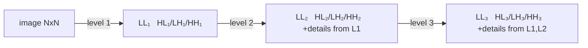
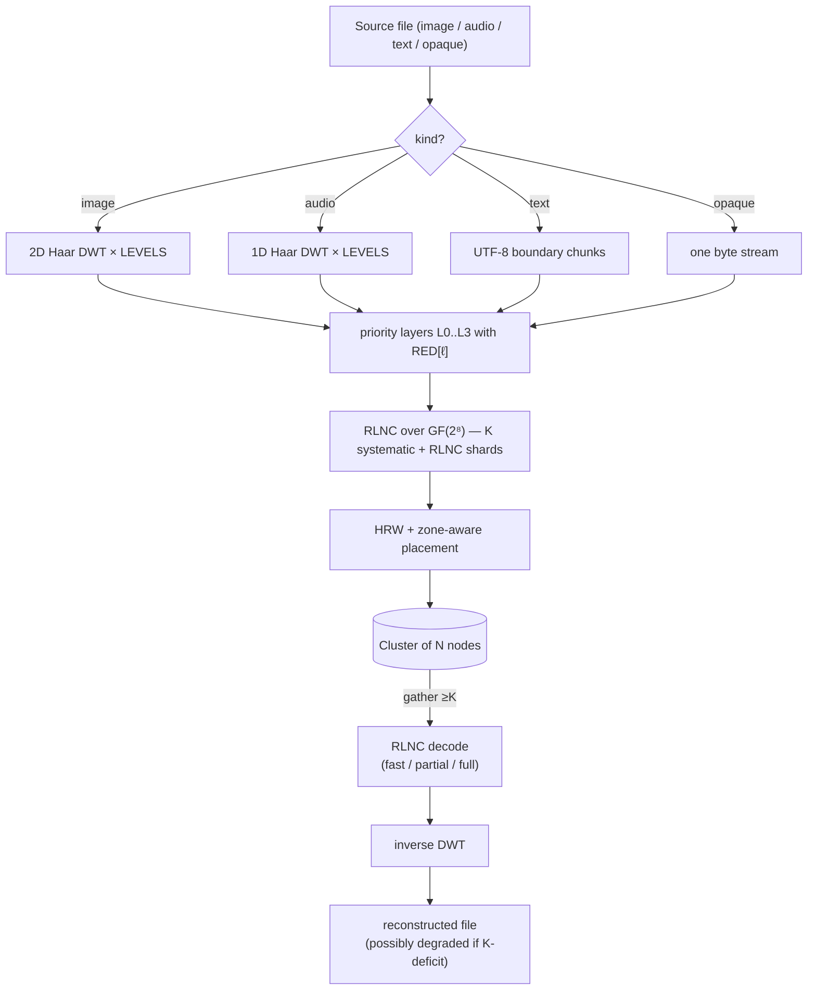

# Теория

> ⚠ **Translation may be stale.** This file was last synced before Stage 12-15 (versioning + deletion, HNSW-backed semantic search, /spotlight ROI, streaming /holo, /diff, /similar, auto-repair-on-read, background scrub, typed RPC layer with timeouts + NoLiveNodes panic-fix, per-folder inline upload). The English source under [../](../) is the canon for any new feature; the [Unreleased] block of [../../CHANGELOG.md](../../CHANGELOG.md) lists every delta this translation does not yet cover.

Математические основы holofs. Каждый раздел содержит формальные
определения, соответствующие формулы, интуицию и ссылки на литературу.

> Математическая нотация: GitHub отрисовывает `$…$` и `$$…$$` через KaTeX.
> Диаграммы — это блоки Mermaid (также нативно на GitHub).

## Содержание

1. [Поле Галуа GF(2⁸)](#1-galois-field-gf28)
2. [Random Linear Network Coding (RLNC)](#2-random-linear-network-coding-rlnc)
3. [Дискретное вейвлет-преобразование Haar](#3-haar-discrete-wavelet-transform)
4. [Приоритетные слои и голографическая деградация](#4-priority-layers-and-holographic-degradation)
5. [Highest Random Weight (rendezvous) hashing](#5-highest-random-weight-rendezvous-hashing)
6. [Zone-aware placement](#6-zone-aware-placement)
7. [Адресация по содержимому и Merkle-деревья](#7-content-addressing-and-merkle-trees)
8. [Shamir secret sharing ↔ RLNC](#8-shamir-secret-sharing--rlnc)
9. [Bottom-K MinHash](#9-bottom-k-minhash)
10. [Перцептуальное хэширование на DWT-LL](#10-perceptual-hashing-on-dwt-ll)
11. [Repair / regenerating codes](#11-repair--regenerating-codes)

---

## 1. Поле Галуа GF(2⁸)

Мы рассматриваем каждый байт как элемент конечного поля

$$
\mathrm{GF}(2^8) \;=\; \mathrm{GF}(2)[x] \;/\; \langle\, x^8 + x^4 + x^3 + x^2 + 1 \rangle,
$$

то есть полиномы над $\mathbb{F}_2$ степени $< 8$, приведённые по модулю
полинома Rijndael / AES $p(x) = \texttt{0x11d}$. Сложение — побитовый XOR:

$$
a \oplus b = (a_7 \oplus b_7,\, a_6 \oplus b_6,\, \dots,\, a_0 \oplus b_0).
$$

Умножение — это умножение полиномов по модулю $p(x)$. Мы реализуем его
через таблицы дискретного логарифма относительно генератора $\alpha = \texttt{0x02}$:

$$
a \cdot b \;=\; \alpha^{\log_\alpha a + \log_\alpha b} \quad \text{for } a, b \neq 0,
$$

$$
a^{-1} \;=\; \alpha^{255 - \log_\alpha a}.
$$

Каждое умножение — это два обращения к таблице + одно сложение. Таблица
`exp` продублирована до длины 512, чтобы `log[a] + log[b]` никогда не
переполнялась, устраняя modulo на горячем пути.

**Почему именно GF(2⁸).** Помещается в байт, имеет 255 ненулевых элементов
(достаточно различных коэффициентов для RLNC), а 8-битные табличные
обращения дружелюбны к кешу. GF(2¹⁶) даёт меньшую вероятность линейной
зависимости, но удваивает память.

**Реализация.** [`holofs-core::gf`](../crates/holofs-core/src/gf.rs).

**Ссылки.**

- Lin & Costello, *Error Control Coding* (2-е изд., 2004), §2.6.
- Joan Daemen & Vincent Rijmen, *The Design of Rijndael* (2002).

---

## 2. Random Linear Network Coding (RLNC)

Слой данных разбивается на $K$ символов $s_0, s_1, \ldots, s_{K-1}$ (каждый
символ — это байт-вектор длины `sym_len`). *Shard* — это пара
$(\mathbf{c}, \mathbf{p})$, где вектор коэффициентов
$\mathbf{c} = (c_0, \ldots, c_{K-1}) \in \mathrm{GF}(2^8)^K$, а payload —

$$
\mathbf{p} \;=\; \bigoplus_{i=0}^{K-1} c_i \cdot s_i.
$$

XOR / умножение — побайтовое над $\mathrm{GF}(2^8)$.

### Декодирование

Имея $K$ shard'ов $\{(\mathbf{c}^{(j)}, \mathbf{p}^{(j)})\}_{j=0}^{K-1}$,
получаем линейную систему

$$
\underbrace{\begin{pmatrix} \mathbf{c}^{(0)} \\ \mathbf{c}^{(1)} \\ \vdots \\ \mathbf{c}^{(K-1)} \end{pmatrix}}_{C}
\;
\underbrace{\begin{pmatrix} s_0 \\ s_1 \\ \vdots \\ s_{K-1} \end{pmatrix}}_{S}
\;=\;
\underbrace{\begin{pmatrix} \mathbf{p}^{(0)} \\ \mathbf{p}^{(1)} \\ \vdots \\ \mathbf{p}^{(K-1)} \end{pmatrix}}_{P}
$$

Если $C$ обратима, восстанавливаем $S = C^{-1} P$ методом Гаусса–Жордана
за $O(K^3)$ операций поля + $O(K^2 \cdot \texttt{sym\_len})$ для обратной
подстановки.

### Вероятность линейной независимости

При $n$ shard'ах, выбранных равномерно случайно из $\mathrm{GF}(2^8)^K$,
вероятность того, что какие-либо $K$ *не* линейно независимы
(декодирование терпит неудачу), ограничена

$$
P(\text{dependent}) \;\leq\; \frac{K}{2^8 - 1} \;\approx\; \frac{K}{255}.
$$

Для нашего $K = 16$ это даёт ≈ 6.3 %, что легко компенсируется отправкой
$n > K$ shard'ов.

### Систематические shard'ы

В holofs первые $\min(n, K)$ shard'ов детерминистически
**систематические**: $\mathbf{c}^{(i)} = \mathbf{e}_i$ (стандартный базис),
поэтому payload — это буквально сырой символ $s_i$. Это даёт два огромных
выигрыша:

1. **Быстрый путь.** Когда все $K$ систематических shard'ов доступны,
   декодирование — это memcpy:
   $\hat S = (\mathbf{p}^{(0)} \,|\, \mathbf{p}^{(1)} \,|\, \cdots)$.
   Без гауссова исключения, без GF-умножений.

2. **Частичное восстановление.** Когда отсутствуют какие-то систематические
   shard'ы, задача сводится к решению меньшей системы $r \times r$ (где
   $r$ — число неизвестных) — намного дешевле полного $K \times K$.

Оставшиеся $n - K$ shard'ов — чистый RLNC: случайные коэффициенты,
используются как «страховка» на случай гибели систематических shard'ов.

**Реализация.** [`holofs-core::rlnc`](../crates/holofs-core/src/rlnc.rs).

**Ссылки.**

- Rudolf Ahlswede, Ning Cai, Shuo-Yen R. Li, Raymond W. Yeung,
  ["Network Information Flow"](https://doi.org/10.1109/18.850663),
  IEEE Trans. Inf. Theory, 2000.
- Tracey Ho et al., ["A Random Linear Network Coding Approach to
  Multicast"](https://doi.org/10.1109/TIT.2006.881746),
  IEEE Trans. Inf. Theory, 2006.
- Christina Fragouli, Jean-Yves Le Boudec, Jörg Widmer,
  ["Network coding: an instant primer"](https://doi.org/10.1145/1198255.1198262),
  SIGCOMM CCR, 2006.

---

## 3. Дискретное вейвлет-преобразование Haar

### 1D Haar-шаг

Для сигнала длины $2n$ $(x_0, x_1, \ldots, x_{2n-1})$ шаг Haar порождает
*аппроксимирующие* коэффициенты $\mathbf{a}$ и *детализирующие*
коэффициенты $\mathbf{d}$:

$$
a_k \;=\; \frac{x_{2k} + x_{2k+1}}{\sqrt{2}}, \qquad
d_k \;=\; \frac{x_{2k} - x_{2k+1}}{\sqrt{2}}.
$$

$\mathbf{a}$ захватывает низкочастотное содержимое (среднее),
$\mathbf{d}$ — высокочастотное (разность). Нормализация $1/\sqrt{2}$
делает преобразование ортонормированным — энергия сохраняется:

$$
\sum_i x_i^2 \;=\; \sum_k a_k^2 + \sum_k d_k^2.
$$

### Многоуровневая пирамида

Применяя шаг Haar рекурсивно только к $\mathbf{a}$, получаем
мультиразрешающую пирамиду. После $L$ уровней сигнал разлагается на
$L+1$ полос: одну грубую LL-полосу (размера $2n / 2^L$) и $L$
детализирующих полос убывающего разрешения.

### 2D Haar (тензорное произведение)

Для изображений мы применяем 1D Haar ко всем строкам, затем ко всем
столбцам. Один уровень порождает четыре под-полосы:

| Sub-band | Что захватывает                       |
|----------|---------------------------------------|
| **LL**   | низкая частота (грубая структура)     |
| **LH**   | горизонтальная деталь (вертикальные края) |
| **HL**   | вертикальная деталь (горизонтальные края) |
| **HH**   | диагональная деталь (углы, текстура)  |

Рекурсия только в LL даёт стандартную вейвлет-пирамиду:

### Обратное преобразование

Haar точно обратимо: $x_{2k} = (a_k + d_k)/\sqrt{2}$,
$x_{2k+1} = (a_k - d_k)/\sqrt{2}$. Мы можем восстановить исходный
сигнал из полного набора коэффициентов $\{a, d\}$.

### Почему именно Haar

- Простейший ортогональный вейвлет — реализация ~30 строк.
- Линейная фаза (без пространственного сдвига).
- Для демонстраций priority-деградации более резкие вейвлеты (Daubechies-4,
  CDF 9/7) дали бы лучший PSNR на бит, но то же качественное поведение.
  Мы остаёмся простыми, чтобы математика оставалась доступной.

**Реализация.** [`holofs-core::transform`](../crates/holofs-core/src/transform.rs).

**Ссылки.**

- Stéphane Mallat, *A Wavelet Tour of Signal Processing*
  (3-е изд., Academic Press, 2008) — §7 (ортонормированные вейвлет-базисы).
- Alfréd Haar, "Zur Theorie der orthogonalen Funktionensysteme",
  *Mathematische Annalen*, 1910 (оригинальная статья).

---

## 4. Приоритетные слои и голографическая деградация

DWT-подполосы несут информацию неравной важности. Визуально:

- Потеря LL ⇒ потеря изображения целиком (это и есть thumbnail).
- Потеря HH₁ ⇒ потеря самой тонкой текстуры, часто незаметно.

Мы кодируем каждую полосу с различной избыточностью RLNC:

$$
\mathrm{RED}[\ell] \;\in\; \{\,4.0,\, 2.5,\, 1.6,\, 1.15\,\} \quad \text{for } \ell = 0, 1, 2, 3,
$$

так что слой 0 (LL) хранится с $\lceil K \cdot 4.0 \rceil = 64$ shard'ами,
а слой 3 (самая тонкая деталь) получает $\lceil K \cdot 1.15 \rceil = 18$.

### Кривая деградации

Если доля $f$ node отказывает, вероятность того, что у слоя $\ell$ всё
ещё $\geq K$ живых shard'ов, приблизительно равна

$$
P_\ell(f) \;=\; \sum_{k=K}^{n_\ell} \binom{n_\ell}{k} (1-f)^k\, f^{n_\ell - k}
$$

(биномиальное; игнорируем HRW-кластеризацию для приближения). С ростом
$\ell$ $n_\ell$ уменьшается, поэтому слои отказывают **по порядку от
высокой частоты к низкой** — именно как голографическая пластина, которую
разрезали: изображение остаётся узнаваемым, просто более размытым.

### Эмпирическое демо

На Kodak kodim23 (Monte-Carlo, 5000 испытаний на процент kill,
40 node / 4 зоны / K = 16):

| kill % | полное изображение | до L2 | до L1 | только до L0 | мертво |
|-------:|-------------------:|------:|------:|-------------:|-------:|
|   10 % |             42.8 % | 57.2 % |  0.0 % |        0.0 % |  0.0 % |
|   25 % |              0.2 % | 96.5 % |  3.3 % |        0.0 % |  0.0 % |
|   50 % |              0.0 % |  0.0 % | 78.6 % |       21.4 % |  0.0 % |
|   75 % |              0.0 % |  0.0 % |  0.0 % |       12.1 % | 87.9 % |

**Ссылки.**

- Andres Albanese, Johannes Blömer, Jeff Edmonds, Michael Luby, Madhu
  Sudan, ["Priority Encoding Transmission"](https://doi.org/10.1109/18.556657),
  IEEE Trans. Inf. Theory, 1996. Оригинальная priority-coding схема,
  концептуально идентичная нашей, но применённая к multicast-видео.
- Catherine Taylor, Jean-Yves Le Boudec, ["Holographic data storage with
  wavelet codecs"](https://www.epfl.ch/labs/lca/wp-content/uploads/2018/12/wavelet-codecs.pdf)
  (лекционные заметки, EPFL 2009) — ясное изложение DWT + erasure coding.

---

## 5. Highest Random Weight (rendezvous) hashing

Имея ключ $k$ (идентификатор shard) и множество node $\{N_1, \ldots, N_m\}$,
HRW выбирает node, максимизирующую хэш:

$$
\mathrm{place}(k) \;=\; \arg\max_{i \in [m]} \;\; h(k,\, N_i).
$$

Мы используем [SplitMix64](https://prng.di.unimi.it/splitmix64.c) над
кортежем
$(\text{object\_id},\, \text{channel},\, \text{layer},\, \text{shard\_idx},\, \text{node\_id})$
как $h$.

### Теорема минимального возмущения

Удаление одной node из кластера перемещает ровно те shard'ы, которые
сопоставлялись этой node — остальные остаются. Формально, если $N_j$
уходит, то для любого ключа $k$, где $\mathrm{place}(k) = N_j$, новое
размещение

$$
\mathrm{place}'(k) \;=\; \arg\max_{i \neq j} \;\; h(k, N_i),
$$

независимо от всех остальных node. Это свойство делает HRW правильным
примитивом для content-addressed хранилища с churn — consistent hashing
имеет похожие свойства, но с O(log n) дополнительных hop на кольце.

### Балансировка нагрузки

Для $m$ идентичных node и равномерно случайных ключей ожидаемая доля
ключей на любой одной node — ровно $1/m$, с дисперсией
$\frac{1}{m}(1 - \frac{1}{m})$ — как у равномерного бросания.

**Реализация.** [`holofs-model::placement`](../crates/holofs-model/src/placement.rs).

**Ссылки.**

- David G. Thaler, Chinya V. Ravishankar,
  ["Using Name-Based Mappings to Increase Hit
  Rates"](https://doi.org/10.1109/90.664265),
  IEEE/ACM Trans. Networking, 1998.
- Karger et al., ["Consistent Hashing and Random Trees"](https://doi.org/10.1145/258533.258660),
  STOC 1997 — альтернативная схема; HRW проще, когда вам просто нужно
  «выбрать одну из $m$».

---

## 6. Zone-aware placement

В реальных кластерах есть корреляции отказов: целая стойка или AZ может
исчезнуть вместе. Мы накладываем *quota*-ограничение поверх HRW: для
каждой пары (channel, layer) ни одна зона не может содержать больше
$\lceil n_\ell / z \rceil$ shard'ов (где $z$ — число зон с живыми node).

### Алгоритм

Для каждого $\mathrm{shard\_idx} = 0, 1, \ldots, n_\ell - 1$:

1. Оценить каждую живую node по $h(\text{key}, \text{node})$.
2. Отсортировать по убыванию.
3. Идти по списку; взять первую node, чья **зона не превысила квоту**.

Детерминированный порядок поддерживает стабильность размещения:
удаление одной node сдвигает только shard'ы, которые были на ней, и
только в ту же зону (если возможно). Добавление node перераспределяет
только $\sim 1/m$ нагрузки.

### Выживание при отказе зоны

При $z$ зонах и $n_\ell$ shard'ах на слой потеря одной целой зоны
оставляет

$$
n_\ell^{\text{alive}} \;\geq\; n_\ell \cdot \frac{z - 1}{z}
$$

живых shard'ов. Для $n_\ell = 64$, $z = 4$, $K = 16$: теряется 16
shard'ов (четверть), остаётся 48 — намного выше порога $K$.

В нашем 4-зонном демо **любой** отказ одной зоны оставляет объект
декодируемым вплоть до L2 (только самая тонкая деталь L3 опускается ниже
порога).

**Реализация.** `place_layer_zone_aware` в
[`holofs-model::placement`](../crates/holofs-model/src/placement.rs).

**Ссылки.**

- Sage A. Weil et al., ["CRUSH: Controlled, Scalable, Decentralized
  Placement of Replicated Data"](https://doi.org/10.1145/1188455.1188582),
  SC '06 — вдохновение; CRUSH делает то же самое с взвешенным
  иерархическим хэшированием для Ceph.

---

## 7. Адресация по содержимому и Merkle-деревья

Каждый shard имеет SHA-256-хэш своих байтов `(coeffs || payload)` (с
доменным префиксом `holofs-shard-v1`). Хэши shard'ов — листья Merkle-дерева;
корень фиксируется в manifest объекта.

### CID объекта

Content IDentifier объекта —

$$
\mathrm{CID} \;=\; \mathrm{SHA256}(\,\texttt{holofs-data-v1} \,\|\, \text{channels} \,\|\, \text{params}\,).
$$

Это **детерминировано из содержимого**: два клиента, кодирующие один и
тот же файл с одними параметрами, получают один и тот же CID. Два файла
изображений, которые ресайзятся к одним и тем же байтам холста (например,
lossless PNG vs BMP одного источника), дают один и тот же CID —
кросс-форматный dedup получается бесплатно.

### Почему Merkle-дерево, а не просто один корневой хэш

- Проверяемый repair: регенерирующая node может доказать, что произвела
  новый shard, чей хэш есть в `shard_hashes`, даже если Merkle-корень
  с тех пор обновили.
- Audit-стриминг: клиент, скачивающий shard'ы, может проверять каждый
  shard против manifest по мере прибытия, отвергая повреждённые shard'ы
  до декодирования.

**Реализации.** [`holofs-core::hash`](../crates/holofs-core/src/hash.rs) (FIPS
180-4 SHA-256, проверено по векторам NIST) и
[`holofs-core::merkle`](../crates/holofs-core/src/merkle.rs).

**Ссылки.**

- Ralph C. Merkle, "Protocols for Public Key Cryptosystems",
  *IEEE S&P*, 1980 — оригинальное дерево.
- FIPS PUB 180-4, *Secure Hash Standard* (NIST, 2015).
- IPFS Specifications, [Content Identifiers](https://github.com/multiformats/cid).

---

## 8. Shamir secret sharing ↔ RLNC

Схема Shamir $(K, N)$ распределяет секрет $s$ как $N$ значений
случайного многочлена степени $K - 1$ над конечным полем:

$$
f(x) \;=\; s + r_1 x + r_2 x^2 + \cdots + r_{K-1} x^{K-1}, \quad r_i \stackrel{\$}{\leftarrow} \mathbb{F}.
$$

Каждая сторона $i \in [N]$ получает $(x_i, f(x_i))$. Любые $K$ долей
реконструируют $f$ (и значит $s$) через интерполяцию Лагранжа; $K - 1$
долей ничего не открывают про $s$ (теоретико-информационная безопасность).

### Эквивалентность с RLNC

Вектор коэффициентов $\mathbf{c}^{(j)} = (1, x_j, x_j^2, \ldots, x_j^{K-1})$
делает каждую долю Shamir специальным RLNC-shard. Матрица реконструкции —
определитель Vandermonde, всегда ненулевой для различных $x_j$.

В holofs мы не используем Vandermonde-Shamir напрямую; мы используем
**случайные** векторы коэффициентов. Гарантия безопасности немного слабее
(любые $K - 1$ shard'ов утекают равномерное распределение по пространству
секретов — так же как Shamir в худшем случае, но не для всех выборов
коэффициентов). Для случаев использования key-escrow это приемлемо.

### holofs escrow

`holofs-analytics::escrow` строится на `holofs-core::rlnc::encode_layer_with_k`
с пользовательски выбранными $K, N$. Shard'ы сериализуются как файлы
`.holoshare`, распространяемые людям / устройствам. Workflow escrow —
*pure-client*: ничего не хранится на кластере.

**Ссылки.**

- Adi Shamir, ["How to Share a Secret"](https://doi.org/10.1145/359168.359176),
  Comm. ACM, 1979.
- Hugo Krawczyk, ["Secret Sharing Made Short"](https://link.springer.com/chapter/10.1007/3-540-48329-2_12),
  CRYPTO 1993 — подход encrypted-then-shared для очень больших секретов;
  вне области v0, но естественный следующий шаг.

---

## 9. Bottom-K MinHash

Имея два документа $A, B$, представленных как множества $n$-shingle
(подстрок длины $n$), Jaccard similarity —

$$
J(A, B) \;=\; \frac{|A \cap B|}{|A \cup B|} \;\in\; [0, 1].
$$

Вычисление $|A \cap B|$ напрямую требует $|A| + |B|$ памяти. MinHash
даёт несмещённый оценщик с фиксированной памятью $k$:

1. Хэшируем каждый shingle фиксированным хэшем $h$.
2. Сохраняем $k$ наименьших различных значений хэша:
   $A_k = \{h(s) : s \in A\}_{(1..k)}$.
3. Оцениваем Jaccard как

$$
\hat J(A, B) \;=\; \frac{|A_k \cap B_k|}{k}.
$$

Этот оценщик имеет дисперсию

$$
\mathrm{Var}(\hat J) \;=\; \frac{J(1 - J)}{k},
$$

поэтому для $k = 64$ среднеквадратичное отклонение $\leq 1/16 \approx 6\%$ —
достаточно, чтобы надёжно различать «near-duplicate» (J > 0.8) от
«unrelated» (J < 0.1).

### Использование в holofs

`holofs-analytics::shingle` вычисляет 64-значный MinHash на 5-байтовых
shingle во время PUT и сохраняет его в `manifest.text_minhash`. Во время
поиска мы вычисляем Jaccard попарно — без I/O, без декомпрессии.

**Обнаруживаемые различия.** Идентичные файлы: $J = 1.0$. Маленькие
правки (опечатки, переупорядочение абзацев): обычно $J \geq 0.85$.
Включение подстроки (один документ скопирован в другой):
$J \in [0.2, 0.7]$ в зависимости от соотношения длин. Несвязанные:
$J \approx 0$.

**Ссылки.**

- Andrei Z. Broder, ["On the resemblance and containment of
  documents"](https://doi.org/10.1109/SEQUEN.1997.666900),
  SEQUENCES '97 — оригинальный MinHash.
- Edith Cohen, ["Min-Wise Independent Permutations"](https://doi.org/10.1145/276698.276781),
  STOC 1998 — формальный анализ.
- Sergei Vassilvitskii, Sanjeev Arora et al., *Mining of Massive
  Datasets* (3-е изд., 2020), §3 — практический праймер.

---

## 10. Перцептуальное хэширование на DWT-LL

LL-полоса изображения $W \times H$ после $L$ уровней DWT — это
низкочастотная аппроксимация $W/2^L \times H/2^L$ — именно тот thumbnail,
который используется классическими перцептуальными хэшами (pHash
использует DCT, dHash использует разности пикселей).

В holofs **первые $K$ систематических shard'ов слоя 0** буквально
содержат пиксели LL (как float-32 wavelet-коэффициенты, сериализованные
в байты). Мы вычисляем 16-байтовый отпечаток как

$$
\mathrm{fp}_i \;=\; \mathrm{mean}(\mathrm{payload}(\mathrm{shard}_i)), \quad i = 0, 1, \ldots, K - 1.
$$

Для нашего $K = 16$ это даёт сетку $4 \times 4$ средних яркостей —
классический вариант dHash. Расстояние — L₁:

$$
d(\mathrm{fp}, \mathrm{fp}') \;=\; \sum_{i=0}^{15} |\mathrm{fp}_i - \mathrm{fp}'_i| \;\in\; [0,\, 16 \cdot 255].
$$

Сходство в % — $100 \cdot (1 - d / 4080)$. Идентичное содержимое → 0.
Визуально похожее → $d \lesssim 200$. Случайные изображения →
$d \gtrsim 1500$.

**Важно**: мы вычисляем этот отпечаток **без декомпрессии объекта** —
только читая систематические shard'ы слоя 0. Для поиска по тысячам
объектов это O(K) байтов на объект.

**Ссылки.**

- Christoph Zauner, *Implementation and Benchmarking of Perceptual
  Image Hash Functions*, MSc thesis, Univ. Applied Sciences Hagenberg,
  2010 — сравнение aHash / dHash / pHash.
- Marr & Hildreth, ["Theory of edge detection"](https://www.jstor.org/stable/35407),
  Proc. Royal Society B, 1980 — мотивация coarse-to-fine видения.

---

## 11. Repair / regenerating codes

Когда node $v$ исчезает (или добавляется новая node), нам нужно
восстановить её shard'ы на замене. Два варианта:

**(a) Полная реконструкция.** Скачать $K$ shard'ов, декодировать полный
объект, пересчитать недостающие shard'ы. Стоимость: $K \cdot \texttt{sym\_len}$
байтов скачано, плюс $K^3$ GF-операций для Gauss + $K \cdot \texttt{sym\_len}$
для перекодирования каждого потерянного shard.

**(b) RLNC-регенерация** (что делает holofs). Скачать $d$ shard'ов
($K \leq d \leq n$), смешать их как

$$
\mathbf{c}^{\text{new}} = \sum_{j=1}^d \alpha_j \mathbf{c}^{(j)}, \qquad
\mathbf{p}^{\text{new}} = \sum_{j=1}^d \alpha_j \mathbf{p}^{(j)}
$$

со случайными $\alpha_j$. Результат — новый валидный RLNC-shard *в той же
линейной оболочке* — без необходимости полностью декодировать и
перекодировать.

Стоимость: те же скачанные байты ($d \cdot \texttt{sym\_len}$ для $d = K$),
**без гауссова исключения**, только GF mac-операции. Эмпирически ~9× меньше
GF-умножений.

Это помещает holofs в семейство *Minimum Bandwidth Regenerating*
(MBR) кодов — см. Dimakis et al. для нижних границ и компромисса с
*Minimum Storage Regenerating* (MSR).

**Ссылки.**

- Alexandros G. Dimakis, Brighten Godfrey, Yunnan Wu, Martin J.
  Wainwright, Kannan Ramchandran, ["Network Coding for Distributed
  Storage Systems"](https://doi.org/10.1109/TIT.2010.2054295),
  IEEE Trans. Inf. Theory, 2010 — заложили область.
- Anwitaman Datta, Frédérique Oggier, ["An Overview of Codes Tailor-Made
  for Better Repairability in Networked Distributed Storage
  Systems"](https://doi.org/10.1145/2723772.2723778), ACM SIGACT News, 2013.

---

## Собираем всё вместе

Полный конвейер encode → store → recover:

Каждая ячейка соответствует разделу выше; для перехода от теории прямо
к коду используйте ссылки *Реализация* в каждом разделе.
