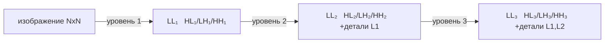
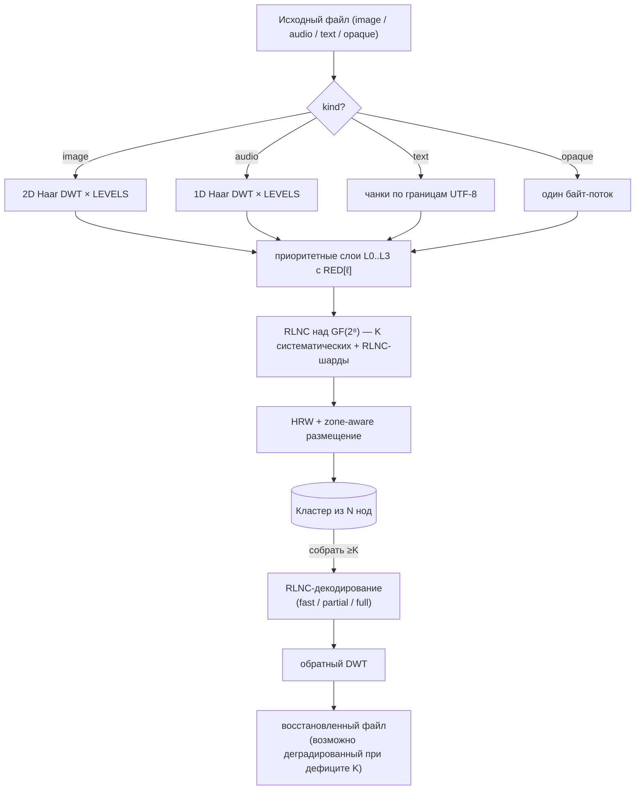

# Теория

Математические основы holofs. Каждый раздел содержит формальные
определения, релевантные формулы, интуицию и ссылки на литературу.

> Матнотация: GitHub рендерит `$…$` и `$$…$$` через KaTeX. Диаграммы —
> блоки Mermaid (тоже нативно на GitHub).

## Содержание

1. [Поле Галуа GF(2⁸)](#1-поле-галуа-gf2)
2. [Random Linear Network Coding (RLNC)](#2-random-linear-network-coding-rlnc)
3. [Дискретное вейвлет-преобразование Хаара](#3-дискретное-вейвлет-преобразование-хаара)
4. [Приоритетные слои и голографическая деградация](#4-приоритетные-слои-и-голографическая-деградация)
5. [Highest Random Weight (rendezvous) хеширование](#5-highest-random-weight-rendezvous-хеширование)
6. [Zone-aware размещение](#6-zone-aware-размещение)
7. [Content addressing и Merkle-деревья](#7-content-addressing-и-merkle-деревья)
8. [Схема разделения секрета Шамира ↔ RLNC](#8-схема-разделения-секрета-шамира--rlnc)
9. [Bottom-K MinHash](#9-bottom-k-minhash)
10. [Перцептуальное хеширование по DWT-LL](#10-перцептуальное-хеширование-по-dwt-ll)
11. [Repair / regenerating codes](#11-repair--regenerating-codes)

---

## 1. Поле Галуа GF(2⁸)

Мы трактуем каждый байт как элемент конечного поля

$$
\mathrm{GF}(2^8) \;=\; \mathrm{GF}(2)[x] \;/\; \langle\, x^8 + x^4 + x^3 + x^2 + 1 \rangle,
$$

то есть многочлены над $\mathbb{F}_2$ степени $< 8$, приведённые по
модулю полинома Rijndael / AES $p(x) = \texttt{0x11d}$. Сложение —
побитовый XOR:

$$
a \oplus b = (a_7 \oplus b_7,\, a_6 \oplus b_6,\, \dots,\, a_0 \oplus b_0).
$$

Умножение — полиномиальное умножение mod $p(x)$. Реализовано через
таблицы дискретного логарифма относительно генератора
$\alpha = \texttt{0x02}$:

$$
a \cdot b \;=\; \alpha^{\log_\alpha a + \log_\alpha b} \quad \text{для } a, b \neq 0,
$$

$$
a^{-1} \;=\; \alpha^{255 - \log_\alpha a}.
$$

Каждое умножение — два табличных поиска + одно сложение. Таблица `exp`
задублирована до длины 512, чтобы `log[a] + log[b]` никогда не
переполнялся, — это убирает modulo с горячего пути.

**Почему GF(2⁸).** Оно помещается в байт, имеет 255 ненулевых элементов
(достаточно для различных коэффициентов RLNC), а 8-битные табличные
поиски дружат с кэшом. GF(2¹⁶) даёт меньшую вероятность линейной
зависимости, но удваивает память.

**Реализация.** [`holofs-core::gf`](../../crates/holofs-core/src/gf.rs).

**Литература.**

- Lin & Costello, *Error Control Coding* (2-е изд., 2004), §2.6.
- Joan Daemen & Vincent Rijmen, *The Design of Rijndael* (2002).

---

## 2. Random Linear Network Coding (RLNC)

Слой данных разбивается на $K$ символов $s_0, s_1, \ldots, s_{K-1}$
(каждый символ — байт-вектор длины `sym_len`). *Шард* — пара
$(\mathbf{c}, \mathbf{p})$, где вектор коэффициентов
$\mathbf{c} = (c_0, \ldots, c_{K-1}) \in \mathrm{GF}(2^8)^K$, а payload
задан как

$$
\mathbf{p} \;=\; \bigoplus_{i=0}^{K-1} c_i \cdot s_i.
$$

XOR / умножение — побайтово над $\mathrm{GF}(2^8)$.

### Декодирование

Имея $K$ шардов $\{(\mathbf{c}^{(j)}, \mathbf{p}^{(j)})\}_{j=0}^{K-1}$,
получаем линейную систему

$$
\underbrace{\begin{pmatrix} \mathbf{c}^{(0)} \\ \mathbf{c}^{(1)} \\ \vdots \\ \mathbf{c}^{(K-1)} \end{pmatrix}}_{C}
\;
\underbrace{\begin{pmatrix} s_0 \\ s_1 \\ \vdots \\ s_{K-1} \end{pmatrix}}_{S}
\;=\;
\underbrace{\begin{pmatrix} \mathbf{p}^{(0)} \\ \mathbf{p}^{(1)} \\ \vdots \\ \mathbf{p}^{(K-1)} \end{pmatrix}}_{P}
$$

Если $C$ обратима, восстанавливаем $S = C^{-1} P$ через
Gauss–Jordan-исключение за $O(K^3)$ полевых операций +
$O(K^2 \cdot \texttt{sym\_len})$ на обратную подстановку.

### Вероятность линейной независимости

При $n$ случайных шардах, вытянутых равномерно из $\mathrm{GF}(2^8)^K$,
вероятность того, что какие-то $K$ окажутся *линейно зависимыми*
(декодирование провалится), ограничена сверху величиной

$$
P(\text{зависимы}) \;\leq\; \frac{K}{2^8 - 1} \;\approx\; \frac{K}{255}.
$$

При нашем $K = 16$ это ≈ 6.3 %, что легко компенсируется отправкой
$n > K$ шардов.

### Систематические шарды

В holofs первые $\min(n, K)$ шардов — детерминированно
**систематические**: $\mathbf{c}^{(i)} = \mathbf{e}_i$ (стандартный
базис), так что payload — буквально исходный символ $s_i$. Это даёт две
огромные победы:

1. **Быстрый путь.** Когда доступны все $K$ систематических шардов,
   декодирование — просто memcpy:
   $\hat S = (\mathbf{p}^{(0)} \,|\, \mathbf{p}^{(1)} \,|\, \cdots)$.
   Никаких Гауссовых исключений, никаких GF-умножений.

2. **Частичное восстановление.** Когда часть систематических шардов
   отсутствует, задача сводится к решению меньшей $r \times r$-системы
   (где $r$ — число неизвестных) — куда дешевле, чем полная
   $K \times K$.

Оставшиеся $n - K$ шардов — чистый RLNC: случайные коэффициенты,
работают «страховкой» на случай гибели систематических шардов.

**Реализация.** [`holofs-core::rlnc`](../../crates/holofs-core/src/rlnc.rs).

**Литература.**

- Rudolf Ahlswede, Ning Cai, Shuo-Yen R. Li, Raymond W. Yeung,
  ["Network Information Flow"](https://doi.org/10.1109/18.850663),
  IEEE Trans. Inf. Theory, 2000.
- Tracey Ho et al., ["A Random Linear Network Coding Approach to
  Multicast"](https://doi.org/10.1109/TIT.2006.881746),
  IEEE Trans. Inf. Theory, 2006.
- Christina Fragouli, Jean-Yves Le Boudec, Jörg Widmer,
  ["Network coding: an instant primer"](https://doi.org/10.1145/1198255.1198262),
  SIGCOMM CCR, 2006.

---

## 3. Дискретное вейвлет-преобразование Хаара

### Одномерный шаг Хаара

Для сигнала длины $2n$ $(x_0, x_1, \ldots, x_{2n-1})$ шаг Хаара
производит *аппроксимирующие* коэффициенты $\mathbf{a}$ и
*детализирующие* $\mathbf{d}$:

$$
a_k \;=\; \frac{x_{2k} + x_{2k+1}}{\sqrt{2}}, \qquad
d_k \;=\; \frac{x_{2k} - x_{2k+1}}{\sqrt{2}}.
$$

$\mathbf{a}$ ловит низкочастотное содержимое (среднее), $\mathbf{d}$ —
высокочастотное (разность). Нормализация $1/\sqrt{2}$ делает
преобразование ортонормальным — энергия сохраняется:

$$
\sum_i x_i^2 \;=\; \sum_k a_k^2 + \sum_k d_k^2.
$$

### Многоуровневая пирамида

Применение шага Хаара рекурсивно только к $\mathbf{a}$ даёт
пирамиду с многомасштабным разрешением. После $L$ уровней сигнал
раскладывается на $L+1$ полос: одна грубая LL-полоса (размер
$2n / 2^L$) и $L$ полос детализации убывающего разрешения.

### 2D Haar (тензорное произведение)

Для изображений применяем 1D-Хаара сначала ко всем строкам, потом ко
всем столбцам. Один уровень даёт четыре суб-полосы:

| Суб-полоса | Что ловит                              |
|------------|----------------------------------------|
| **LL**     | низкая частота (грубая структура)      |
| **LH**     | горизонтальная детализация (вертикальные края) |
| **HL**     | вертикальная детализация (горизонтальные края) |
| **HH**     | диагональная детализация (углы, текстура) |

Рекурсия только по LL даёт стандартную вейвлет-пирамиду:

### Обратное преобразование

Хаар точно обратим: $x_{2k} = (a_k + d_k)/\sqrt{2}$,
$x_{2k+1} = (a_k - d_k)/\sqrt{2}$. Мы можем восстановить исходный
сигнал из полного набора коэффициентов $\{a, d\}$.

### Почему именно Хаар

- Самый простой ортогональный вейвлет — реализация ~30 строк.
- Linear-phase (без пространственного сдвига).
- Для демо приоритетной деградации более резкие вейвлеты
  (Daubechies-4, CDF 9/7) дали бы лучший PSNR на бит, но такое же
  качественное поведение. Мы держим математику простой ради
  доступности.

**Реализация.** [`holofs-core::transform`](../../crates/holofs-core/src/transform.rs).

**Литература.**

- Stéphane Mallat, *A Wavelet Tour of Signal Processing*
  (3-е изд., Academic Press, 2008) — §7 (ортонормальные вейвлет-базисы).
- Alfréd Haar, "Zur Theorie der orthogonalen Funktionensysteme",
  *Mathematische Annalen*, 1910 (оригинальная статья).

---

## 4. Приоритетные слои и голографическая деградация

DWT-суб-полосы несут информацию неравной важности. Визуально:

- Потеря LL ⇒ потеря изображения полностью (это миниатюра).
- Потеря HH₁ ⇒ потеря самой тонкой текстуры, часто незаметно.

Мы кодируем каждую полосу с разной избыточностью RLNC:

$$
\mathrm{RED}[\ell] \;\in\; \{\,4.0,\, 2.5,\, 1.6,\, 1.15\,\} \quad \text{для } \ell = 0, 1, 2, 3,
$$

так что слой 0 (LL) хранится с
$\lfloor K \cdot 4.0 + 0.5 \rfloor = 64$ шардами, а слой 3 (самая
тонкая детализация) получает $\lfloor K \cdot 1.15 + 0.5 \rfloor = 18$.
Код использует округление банкира (`f32::round`), а не потолок — поэтому
`K · 1.15 = 18.4` даёт $18$, а не $19$.

### Кривая деградации

Если доля $f$ нод отказала, вероятность того, что слой $\ell$ всё ещё
имеет $\geq K$ живых шардов, приближается как

$$
P_\ell(f) \;=\; \sum_{k=K}^{n_\ell} \binom{n_\ell}{k} (1-f)^k\, f^{n_\ell - k}
$$

(биномиальное; игнорируем HRW-кластеризацию для приближения). С ростом
$\ell$ $n_\ell$ уменьшается, поэтому слои отказывают **в порядке от
высокой частоты к низкой** — ровно как визуально ведёт себя
разрезанная голографическая пластина: изображение остаётся
узнаваемым, только более размытым.

### Эмпирическое демо

На Kodak kodim23 (Monte-Carlo, 5000 попыток на процент отказа,
40 нод / 4 зоны / K = 16):

| kill % | полная картинка | до L2  | до L1  | только L0 | мертво |
|-------:|----------------:|-------:|-------:|----------:|-------:|
|   10 % |         42.8 % | 57.2 % |  0.0 % |     0.0 % |  0.0 % |
|   25 % |          0.2 % | 96.5 % |  3.3 % |     0.0 % |  0.0 % |
|   50 % |          0.0 % |  0.0 % | 78.6 % |    21.4 % |  0.0 % |
|   75 % |          0.0 % |  0.0 % |  0.0 % |    12.1 % | 87.9 % |

**Литература.**

- Andres Albanese, Johannes Blömer, Jeff Edmonds, Michael Luby, Madhu
  Sudan, ["Priority Encoding Transmission"](https://doi.org/10.1109/18.556657),
  IEEE Trans. Inf. Theory, 1996. Оригинальная схема приоритетного
  кодирования, концептуально идентичная нашей, но применена к
  multicast-видео.
- Catherine Taylor, Jean-Yves Le Boudec, ["Holographic data storage with
  wavelet codecs"](https://www.epfl.ch/labs/lca/wp-content/uploads/2018/12/wavelet-codecs.pdf)
  (лекционные заметки, EPFL 2009) — ясный разбор DWT + erasure-coding.

---

## 5. Highest Random Weight (rendezvous) хеширование

Для ключа $k$ (идентификатор шарда) и множества нод
$\{N_1, \ldots, N_m\}$ HRW выбирает ноду, максимизирующую хэш:

$$
\mathrm{place}(k) \;=\; \arg\max_{i \in [m]} \;\; h(k,\, N_i).
$$

Мы используем [SplitMix64](https://prng.di.unimi.it/splitmix64.c) над
кортежом
$(\text{object\_id},\, \text{channel},\, \text{layer},\, \text{shard\_idx},\, \text{node\_id})$
как $h$.

### Теорема минимального нарушения

Удаление одной ноды из кластера перемещает ровно те шарды, которые на
неё маппились, — остальные остаются на месте. Формально: если $N_j$
уходит, для любого ключа $k$ с $\mathrm{place}(k) = N_j$ новое
размещение — это

$$
\mathrm{place}'(k) \;=\; \arg\max_{i \neq j} \;\; h(k, N_i),
$$

независимо от всех остальных нод. Это свойство делает HRW правильным
примитивом для content-addressed storage с churn'ом — consistent
hashing имеет схожие свойства, но с O(log n) лишних hops на кольце.

### Балансировка нагрузки

Для $m$ идентичных нод и равномерно случайных ключей ожидаемая доля
ключей на любой одной ноде равна ровно $1/m$, с дисперсией
$\frac{1}{m}(1 - \frac{1}{m})$ — как для равномерного броска.

**Реализация.** [`holofs-model::placement`](../../crates/holofs-model/src/placement.rs).

**Литература.**

- David G. Thaler, Chinya V. Ravishankar,
  ["Using Name-Based Mappings to Increase Hit
  Rates"](https://doi.org/10.1109/90.664265),
  IEEE/ACM Trans. Networking, 1998.
- Karger et al., ["Consistent Hashing and Random Trees"](https://doi.org/10.1145/258533.258660),
  STOC 1997 — альтернативная схема; HRW проще, когда просто нужно
  «выбрать одну из $m$».

---

## 6. Zone-aware размещение

У реальных кластеров есть корреляции отказов: целая стойка или AZ
могут пропасть вместе. Мы накладываем поверх HRW *квоту*: для каждой
пары (channel, layer) ни одна зона не может держать больше
$\lceil n_\ell / z \rceil$ шардов (где $z$ — число зон с живыми
нодами).

### Алгоритм

Для каждого $\mathrm{shard\_idx} = 0, 1, \ldots, n_\ell - 1$:

1. Оцениваем каждую живую ноду по $h(\text{key}, \text{node})$.
2. Сортируем по убыванию.
3. Идём вниз по списку; берём первую ноду, чья **зона не превысила
   свою квоту**.

Детерминированный порядок сохраняет размещение стабильным: удаление
одной ноды сдвигает только те шарды, что были на ней, и только в ту же
зону (если возможно). Добавление ноды перераспределяет только
$\sim 1/m$ нагрузки.

### Выживание при отказе зоны

При $z$ зонах и $n_\ell$ шардах на слой потеря одной зоны оставляет

$$
n_\ell^{\text{alive}} \;\geq\; n_\ell \cdot \frac{z - 1}{z}
$$

живых шардов. Для $n_\ell = 64$, $z = 4$, $K = 16$: теряем 16 шардов
(четверть), остаётся 48 — намного выше порога $K$.

В нашем 4-зонном демо **любой** отказ одной зоны оставляет объект
декодируемым до L2 (только самая тонкая L3-детализация опускается ниже
порога).

**Реализация.** `place_layer_zone_aware` в
[`holofs-model::placement`](../../crates/holofs-model/src/placement.rs).

**Литература.**

- Sage A. Weil et al., ["CRUSH: Controlled, Scalable, Decentralized
  Placement of Replicated Data"](https://doi.org/10.1145/1188455.1188582),
  SC '06 — вдохновение; CRUSH делает ту же идею с взвешенным
  иерархическим хешированием для Ceph.

---

## 7. Content addressing и Merkle-деревья

У каждого шарда есть SHA-256 хэш байтов `(coeffs || payload)` (с
доменным префиксом `holofs-shard-v1`). Хэши шардов — листья
Merkle-дерева; корень фиксируется в манифесте объекта.

### CID объекта

Content IDentifier объекта — это

$$
\mathrm{CID} \;=\; \mathrm{SHA256}(\,\texttt{holofs-data-v1} \,\|\, \text{channels} \,\|\, \text{params}\,).
$$

Он **детерминирован по содержимому**: два клиента, кодирующие один и
тот же файл с одинаковыми параметрами, получают одинаковый CID. Два
файла изображений, которые ресайзятся в одни и те же байты канвы
(например, lossless PNG vs BMP того же источника), дают тот же CID —
кросс-форматная дедупликация получается бесплатно.

### Почему Merkle-дерево, а не просто один корневой хэш

- Верифицируемый repair: регенерирующая нода может доказать, что
  произвела новый шард, чей хэш находится в `shard_hashes`, даже
  когда Merkle-корень с тех пор обновился.
- Auditable streaming: клиент, скачивающий шарды, может сверять
  каждый шард с манифестом по мере прихода, отбрасывая испорченные
  шарды до декодирования.

### Защита от second-preimage

Наивное Merkle-дерево — хэш-от-пар-хэшей без domain-разделения —
уязвимо к second-preimage-атакам: атакующий, который может подобрать
лист $L$ такой, что $H(L)$ равен хэшу внутреннего узла $H(a \| b)$,
может подменить $L$ на весь поддерево, не изменив корня. holofs
блокирует это двумя способами:

1. **Domain-теги.** Листья хэшируются как
   $H(\texttt{holofs-merkle-leaf-v1} \| \text{shard\_hash})$;
   внутренние узлы — как
   $H(\texttt{holofs-merkle-node-v1} \| a \| b)$. Домены не могут
   пересечься.
2. **Микширование числа листьев.** Корень финализуется как
   $H(\texttt{holofs-merkle-root-v1} \| \text{leaf\_count} \| \text{tree\_root})$,
   так что дублирование последнего листа для допаддинга до степени
   двойки (классическая канонизационная неоднозначность) ловится
   счётчиком.

**Реализации.** [`holofs-core::hash`](../../crates/holofs-core/src/hash.rs)
(FIPS 180-4 SHA-256, проверено на NIST-векторах) и
[`holofs-core::merkle`](../../crates/holofs-core/src/merkle.rs).

**Литература.**

- Ralph C. Merkle, "Protocols for Public Key Cryptosystems",
  *IEEE S&P*, 1980 — оригинальное дерево.
- FIPS PUB 180-4, *Secure Hash Standard* (NIST, 2015).
- IPFS Specifications, [Content Identifiers](https://github.com/multiformats/cid).

---

## 8. Схема разделения секрета Шамира ↔ RLNC

$(K, N)$-схема Шамира распределяет секрет $s$ как $N$ значений
случайного полинома степени $K - 1$ над конечным полем:

$$
f(x) \;=\; s + r_1 x + r_2 x^2 + \cdots + r_{K-1} x^{K-1}, \quad r_i \stackrel{\$}{\leftarrow} \mathbb{F}.
$$

Каждая сторона $i \in [N]$ получает $(x_i, f(x_i))$. Любые $K$ долей
реконструируют $f$ (и тем самым $s$) через интерполяцию Лагранжа;
$K - 1$ долей не раскрывают ничего о $s$ (теоретико-информационная
безопасность).

### Эквивалентность с RLNC

Вектор коэффициентов
$\mathbf{c}^{(j)} = (1, x_j, x_j^2, \ldots, x_j^{K-1})$ делает каждую
Шамировскую долю специальным RLNC-шардом. Матрица реконструкции —
определитель Вандермонда, всегда ненулевой для различных $x_j$.

В holofs мы не используем Vandermonde-Шамира напрямую; используем
**случайные** векторы коэффициентов. Гарантия безопасности чуть слабее
(любые $K - 1$ шардов утекают равномерное распределение по
пространству секрета — как у Шамира в худшем случае, но не для всех
выборов коэффициентов). Для сценариев key-escrow это приемлемо.

### holofs-escrow

`holofs-analytics::escrow` строится на
`holofs-core::rlnc::encode_layer_with_k` с выбираемыми пользователем
$K, N$. Шарды сериализуются в файлы `.holoshare`, распространяемые
людям / устройствам. Escrow-workflow *чисто клиентский*: на кластере
ничего не хранится.

**Литература.**

- Adi Shamir, ["How to Share a Secret"](https://doi.org/10.1145/359168.359176),
  Comm. ACM, 1979.
- Hugo Krawczyk, ["Secret Sharing Made Short"](https://link.springer.com/chapter/10.1007/3-540-48329-2_12),
  CRYPTO 1993 — подход encrypted-then-shared для очень больших
  секретов; вне области рассмотрения v0, но естественный следующий
  шаг.

---

## 9. Bottom-K MinHash

Для двух документов $A, B$, представленных как множества
$n$-шинглов (подстрок длины $n$), Jaccard-подобие есть

$$
J(A, B) \;=\; \frac{|A \cap B|}{|A \cup B|} \;\in\; [0, 1].
$$

Вычисление $|A \cap B|$ напрямую требует $|A| + |B|$ памяти. MinHash
даёт несмещённую оценку с фиксированной памятью $k$:

1. Хешируем каждый шингл фиксированным хэшом $h$.
2. Оставляем $k$ наименьших различных хэш-значений:
   $A_k = \{h(s) : s \in A\}_{(1..k)}$.
3. Оцениваем Jaccard как

$$
\hat J(A, B) \;=\; \frac{|A_k \cap B_k|}{k}.
$$

У этой оценки дисперсия

$$
\mathrm{Var}(\hat J) \;=\; \frac{J(1 - J)}{k},
$$

так что при $k = 64$ стандартное отклонение $\leq 1/16 \approx 6\%$ —
достаточно, чтобы надёжно отличить «почти-дубликат» ($J > 0.8$) от
«не связано» ($J < 0.1$).

### Использование в holofs

`holofs-analytics::shingle` вычисляет 64-значный MinHash на
5-байтовых шинглах во время PUT и сохраняет его в
`manifest.text_minhash`. При поиске мы считаем Jaccard попарно — без
I/O, без декомпрессии.

**Обнаруживаемые различия.** Идентичные файлы: $J = 1.0$. Мелкие
правки (опечатки, перестановка абзацев): обычно $J \geq 0.85$.
Включение подстроки (один документ скопирован в другой):
$J \in [0.2, 0.7]$ в зависимости от отношения длин. Не связано:
$J \approx 0$.

**Литература.**

- Andrei Z. Broder, ["On the resemblance and containment of
  documents"](https://doi.org/10.1109/SEQUEN.1997.666900),
  SEQUENCES '97 — оригинальный MinHash.
- Edith Cohen, ["Min-Wise Independent Permutations"](https://doi.org/10.1145/276698.276781),
  STOC 1998 — формальный анализ.
- Sergei Vassilvitskii, Sanjeev Arora et al., *Mining of Massive
  Datasets* (3-е изд., 2020), §3 — практический ввод.

---

## 10. Перцептуальное хеширование по DWT-LL

LL-полоса изображения $W \times H$ после $L$ уровней DWT — это
$W/2^L \times H/2^L$ низкочастотная аппроксимация, ровно та миниатюра,
которую используют классические перцептуальные хэши (pHash использует
DCT, dHash — пиксельные разности).

В holofs **первые $K$ систематических шардов слоя 0** буквально
содержат LL-пиксели (как float-32 вейвлет-коэффициенты, серилизованные
в байты). Мы вычисляем поканальный fingerprint из средних байт

$$
\mathrm{fp}_i^{(c)} \;=\; \mathrm{clamp}_{0..255}\bigl(\mathrm{mean}(\mathrm{payload}(\mathrm{shard}_i^{(c)}))\bigr),
\quad i = 0, \ldots, K - 1.
$$

Для нашего $K = 16$ каждый канал даёт $4 \times 4$-сетку средних
яркостей — классический вариант dHash. Сохранённый fingerprint
конкатенирует три канала:
$[\mathrm{R}_{0..15}\,|\,\mathrm{G}_{0..15}\,|\,\mathrm{B}_{0..15}]$
— 48 байт для 3-канальных изображений; audio и другие 1-канальные
виды используют только первые 16.

**Поверх fingerprint живут две метрики расстояния:**

- `/api/fingerprint/<name>` отдаёт прямое L₁ по байтам каналов,
  $d = \sum_{c, i} |\mathrm{fp}_i^{(c)} - \mathrm{fp}_i^{'(c)}|
  \in [0,\, 48 \cdot 255]$ — годится для проверки точного совпадения.
- `/similar/<name>` считает dHash-биты — по одному биту на каждое
  сравнение соседних плиток внутри полосы каждого канала, всего
  $3 \times 15 = 45$ бит — и выдаёт похожесть как
  $1 - \mathrm{hamming} / 45$. dHash плавно деградирует под
  геометрическими флипами и хроматическими сдвигами, где сырой L₁
  насыщается.

**Важно**: обе метрики вычисляются **без декомпрессии объекта** —
только читая систематические шарды слоя 0. Для поиска по тысячам
объектов это $O(K)$ байт на объект.

**Литература.**

- Christoph Zauner, *Implementation and Benchmarking of Perceptual
  Image Hash Functions*, магистерская, Univ. Applied Sciences
  Hagenberg, 2010 — сравнение aHash / dHash / pHash.
- Marr & Hildreth, ["Theory of edge detection"](https://www.jstor.org/stable/35407),
  Proc. Royal Society B, 1980 — мотивация coarse-to-fine зрения.

---

## 11. Repair / regenerating codes

Когда нода $v$ пропадает (или добавляется новая), нужно восстановить
её шарды на замене. Два варианта:

**(a) Полная реконструкция.** Скачать $K$ шардов, декодировать
полный объект, пересчитать недостающие шарды. Стоимость:
$K \cdot \texttt{sym\_len}$ скачанных байт, плюс $K^3$ GF-операций на
Гаусса + $K \cdot \texttt{sym\_len}$ на пересборку каждого
потерянного шарда.

**(b) RLNC-регенерация** (что делает holofs). Скачать $d$ шардов
($K \leq d \leq n$), смешать их как

$$
\mathbf{c}^{\text{new}} = \sum_{j=1}^d \alpha_j \mathbf{c}^{(j)}, \qquad
\mathbf{p}^{\text{new}} = \sum_{j=1}^d \alpha_j \mathbf{p}^{(j)}
$$

со случайными $\alpha_j$. Результат — новый валидный RLNC-шард *в той
же линейной оболочке* — не нужно полностью декодировать и
перекодировать.

Стоимость: те же скачанные байты ($d \cdot \texttt{sym\_len}$ при
$d = K$), **никаких Гауссовых исключений**, только GF-mac-операции.
Эмпирически ~9× меньше GF-умножений.

Это помещает holofs в семейство *Minimum Bandwidth Regenerating*
(MBR) кодов — см. Dimakis et al. для нижних границ и trade-off с
*Minimum Storage Regenerating* (MSR).

**Литература.**

- Alexandros G. Dimakis, Brighten Godfrey, Yunnan Wu, Martin J.
  Wainwright, Kannan Ramchandran, ["Network Coding for Distributed
  Storage Systems"](https://doi.org/10.1109/TIT.2010.2054295),
  IEEE Trans. Inf. Theory, 2010 — заложило область.
- Anwitaman Datta, Frédérique Oggier, ["An Overview of Codes Tailor-Made
  for Better Repairability in Networked Distributed Storage
  Systems"](https://doi.org/10.1145/2723772.2723778), ACM SIGACT News, 2013.

---

## Складываем всё вместе

Полный конвейер encode → store → recover:

Каждый блок соответствует одному из разделов выше; ссылки на
*Реализацию* в каждом разделе позволяют переходить от теории напрямую
к коду.
