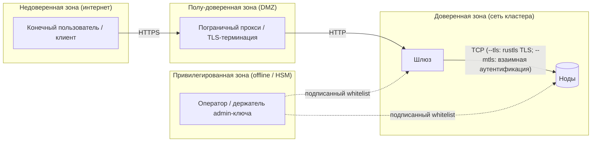

# Модель угроз

Этот документ перечисляет **противников**, **активы**, **предположения
о доверии** и **меры защиты** для развёртывания holofs. Используется
таксономия STRIDE ([Howard & LeBlanc 2003](https://learn.microsoft.com/en-us/azure/security/develop/threat-modeling-tool-threats))
для классификации угроз и линза [LINDDUN](https://linddun.org/) для
вопросов конфиденциальности.

## Содержание

1. [Область и активы](#1-область-и-активы)
2. [Границы доверия](#2-границы-доверия)
3. [Каталог противников](#3-каталог-противников)
4. [STRIDE-анализ](#4-stride-анализ)
5. [Анализ конфиденциальности (LINDDUN)](#5-анализ-конфиденциальности-linddun)
6. [Не-цели и явные ограничения](#6-не-цели-и-явные-ограничения)
7. [Реестр остаточных рисков](#7-реестр-остаточных-рисков)

---

## 1. Область и активы

### 1.1. В области рассмотрения

Рассматриваемая система — кластер holofs, описанный в
[architecture.md](./architecture.md):

- HTTP-шлюз (бинарь `holofs-web`, axum + Leptos SSR).
- Демоны нод (бинарь `holofs-node`), 1..N на хост.
- Сетевой протокол между ними (см. [api.md §2](./api.md#2-wire-protocol-tcp)).
- Состояние на диске (шарды, манифесты, каталог, whitelist).
- Подписанный whitelist + материалы идентификации Ed25519.

### 1.2. Вне области рассмотрения

- Ядро операционной системы и гипервизор.
- TLS-терминирующий обратный прокси (если используется снаружи).
- Браузер / клиентское приложение пользователя.
- Побочные каналы, возникающие из-за общих CPU-кэшей с соседями
  (защита: выделенные ноды для чувствительных развёртываний).
- Физические атаки на носители данных.

### 1.3. Защищаемые активы

| Актив                                | Конфиденциальность | Целостность | Доступность |
|--------------------------------------|:------------------:|:-----------:|:-----------:|
| Полезная нагрузка объекта            | ●                  | ●           | ●           |
| Метаданные объекта (имя, kind)       | ◐                  | ●           | ●           |
| Каталог (объект → манифест)          |                    | ●           | ●           |
| Whitelist + admin pubkey             |                    | ●           | ●           |
| Ed25519-секреты нод                  | ●                  | ●           |             |
| Данные о здоровье / живости кластера |                    | ●           | ◐           |

Легенда: ● критично, ◐ умеренно.

---

## 2. Границы доверия

| Граница             | Аутентификация                       | Шифрование        | Замечания по укреплению |
|---------------------|--------------------------------------|-------------------|-------------------------|
| Пользователь → Edge | На уровне приложения (cookies, JWT)  | TLS 1.3           | Вне области рассмотрения |
| Edge → Шлюз         | Сейчас нет (планируется: mTLS)       | Нет / mTLS        | Привязывать шлюз к приватному VLAN |
| Шлюз ↔ Нода         | Challenge-response Ed25519 (+ опциональный mTLS) | Plain TCP или rustls TLS через `--tls` | Nonce сетевого протокола + подписанный handshake; `--mtls` добавляет проверку X.509-сертификатов |
| Оператор → Кластер  | Admin Ed25519 подписывает whitelist  | Вне полосы        | Admin-ключ держать offline / в HSM |

---

## 3. Каталог противников

| Противник                  | Позиция                                | Цель                                | Возможности   |
|----------------------------|----------------------------------------|-------------------------------------|---------------|
| **Внешний анонимный**      | Публичный интернет                     | Чтение / удаление объектов, DoS     | Сеть + L7     |
| **Скомпрометированный клиент** | Валидная HTTP-сессия                | Кража данных других пользователей   | L7            |
| **Сетевой наблюдатель**    | На пути между шлюзом и нодами          | Чтение трафика, воспроизведение, MITM | L3 / L4     |
| **Скомпрометированная нода** | Владеет валидным ключом ноды         | Отдавать неверные данные, отказывать в аудите | Сетевой протокол |
| **Sybil-нода**             | Ключа нет, пытается присоединиться     | Испортить размещение / дедупликацию | Сетевой протокол |
| **Скомпрометированный оператор** | Владеет admin-ключом             | Полный контроль над кластером       | Полные        |
| **Инсайдер (чтение)**      | Доступ к ФС хоста одной ноды           | Прочитать шарды / метаданные        | OS shell      |
| **Принуждение / судебное требование** | Юридическое давление на операторов | Восстановить конкретный объект | Юридические |

Наибольшего внимания заслуживает **скомпрометированная нода**: полностью
аутентифицированный участник, ведущий себя выборочно. Большинство мер
защиты в этом документе нацелены именно на него.

---

## 4. STRIDE-анализ

### 4.1. Spoofing (подмена)

| # | Угроза                                                  | Мера защиты |
|---|---------------------------------------------------------|-------------|
| S1 | Атакующий выдаёт себя за ноду, чтобы получать шарды    | Ed25519 challenge (`AuthChallenge`) — шлюз проверяет подпись pubkey'ем из whitelist до того, как доверяет любому ответу. См. [api.md §2 handshake](./api.md#authentication-handshake). |
| S2 | Атакующий выдаёт себя за шлюз перед нодой              | Запуск с `--mtls`: нода отвергает любой TLS-handshake, чей клиентский сертификат не подписан общим CA. Без `--mtls` — работа только внутри приватного VLAN. |
| S3 | Поддельное обновление whitelist                        | Whitelist подписан admin Ed25519-ключом; ноды отвергают неподписанные или неверно подписанные обновления. |
| S4 | Воспроизведение перехваченного ответа                  | Nonce на каждый запрос в `AuthChallenge` привязывает подписи к свежему челленджу. Сетевые фреймы за пределами handshake anti-replay nonce пока не несут — см. [§7](#7-реестр-остаточных-рисков). |

### 4.2. Tampering (искажение)

| # | Угроза                                                  | Мера защиты |
|---|---------------------------------------------------------|-------------|
| T1 | Нода возвращает искажённую полезную нагрузку шарда     | Идентичность каждого шарда — `SHA-256(coeffs ‖ payload)`. Шлюз пересчитывает; несовпадение отклоняется и учитывается в `reputation`. |
| T2 | Нода возвращает другой шард вместо запрошенного        | Манифест перечисляет `shard_hashes[c][l][idx]`; шлюз проверяет, что хэш совпадает с ожидаемым. |
| T3 | Порча данных на диске (bitrot)                         | Имена файлов шардов *являются* их хэшами — сканирование при старте и фоновая задача `Audit` обнаруживают несовпадения и запускают RLNC-починку. |
| T4 | Модификация файла каталога                             | Записи в каталог — `write-tmp+fsync+rename`. Merkle-корень в каждом манифесте перекрёстно проверяет все шарды; изменённые записи каталога проявляются как ошибки декодирования. |
| T5 | MITM меняет байты в проводе                            | Запуск с `--tls`: rustls (TLS 1.2/1.3 через провайдер `ring`) аутентифицирует сервер и шифрует каждый фрейм. Проверка хэша шарда остаётся защитой в глубину внутри TLS-туннеля. |

### 4.3. Repudiation (отказ от действий)

| # | Угроза                                                  | Мера защиты |
|---|---------------------------------------------------------|-------------|
| R1 | Нода отрицает, что отдала неверный ответ               | Оценка репутации обновляется на серверной стороне из проверяемых несовпадений хэшей; операционная панель отображает per-node `audit_fail_total`. |
| R2 | Оператор отрицает admin-действие                       | Обновления whitelist несут Ed25519-подпись администратора; *закоммиченный* файл whitelist и есть аудит-трейл. |

### 4.4. Information disclosure (утечка информации)

| # | Угроза                                                  | Мера защиты |
|---|---------------------------------------------------------|-------------|
| I1 | Одна нода, читая «свои» шарды, раскрывает открытый текст | Отдельный шард — `coeffs · chunks` над GF(2⁸), случайная линейная комбинация чанков. Восстановление открытого текста из менее чем `K` независимых шардов требует решения недоопределённой линейной системы — теоретико-информационно невозможно **для одного случайного шарда**. |
| I2 | Противник собирает ≥ K шардов одного объекта           | RLNC над публичным GF(2⁸) — **не** схема шифрования. Любые K линейно независимых шардов реконструируют полезную нагрузку. Защита: **шифрование на диске (at-rest) на каждой ноде** и **разнообразие размещения** — при `RendezvousZoneAware` K шардов охватывают ≥ K разных нод в ≥ ⌈K/zone_count⌉ зонах, поэтому их чтение требует компрометации всех этих нод. |
| I3 | Утечка метаданных: имя + kind + размер                 | Манифест хранит имя объекта и content type в открытом виде. Чувствительные развёртывания должны хэшировать или псевдонимизировать имена до загрузки. |
| I4 | Побочные каналы (кэш, тайминги сети)                   | В версии 0.1 не защищено — используйте выделенные CPU / сеть для чувствительных развёртываний. |
| I5 | Утечка резервных копий                                 | Бэкапы наследуют ту же угрозу: они должны шифроваться на диске (`restic --pass-file`, S3 SSE-KMS). |
| I6 | Утечка holoshare                                       | Отдельный файл `.holoshare` — одна доля из `(k,n)` Shamir-через-RLNC разделения. Обладание меньшим чем `k` числом безопасно с теоретико-информационной точки зрения (см. [theory.md §8](./theory.md#8-shamir-via-rlnc-key-escrow)). |

### 4.5. Denial of service (отказ в обслуживании)

| # | Угроза                                                  | Мера защиты |
|---|---------------------------------------------------------|-------------|
| D1 | Флуд загрузок в шлюз                                   | Шлюз должен работать за обратным прокси с rate-limit. Размер сетевого фрейма ограничен `MAX_FRAME = 64 MiB` на каждой ноде. |
| D2 | Отдельная нода отказывает в запросах                   | RLNC даёт избыточность ≥ K-of-N на слой. Auto-repair-on-read и фоновый scrub обнаруживают и воссоздают шарды на живых нодах. |
| D3 | Скоординированное падение половины кластера            | Margin рассчитан на **одну любую зону + разрозненные одиночные отказы** (см. [theory.md §3](./theory.md#3-priority-layers)). Более крупные простои деградируют плавно: L3 (косметическая детализация) теряется первым, затем L2, L1. |
| D4 | Нода-«спящий» принимает put, но не возвращает get      | Задача аудита выпускает случайные `Audit(shard_hash)` — не отвечающая или отдающая неверный результат нода теряет репутацию и перестаёт выбираться при размещении. Изменение: `MissingShard` теперь трактуется как нейтральный результат (без штрафа репутации) — это устраняет обратную связь по коллизиям дедупликации, из-за которой ранее исправные ноды выпадали из live-набора. |
| D5 | Slow-loris по TCP                                      | Бюджет `tokio::time::timeout` на один RPC (`HOLOFS_RPC_TIMEOUT_MS`, по умолчанию 8 с; `0` отключает). RPC по таймауту помечает потоковое соединение как отравленное и делает одну повторную попытку на свежем сокете через `is_likely_transient`. Ограничивает видимую пользователю задержку 8 с + один retry вместо 60–75 с TCP-таймаута ОС. |
| D6 | Исчерпание памяти огромным фреймом                     | Фреймы > `MAX_FRAME` отвергаются до аллокации. |
| D7 | Одновременное падение всех нод (гонка загрузки, деплой на весь флот) | `placement::place` возвращает `Result<_, NoLiveNodes>` вместо panic; шлюз отдаёт чистый `503 ServiceUnavailable` (`GatewayError::ClusterDegraded`) вместо аварии. Раньше один не типизированный `assert!` в `place_shard` мог уронить процесс шлюза из-за одного PUT во время отказа флота. |
| D8 | Флуд конкурентных запросов исчерпывает axum-runtime    | Ведра маршрутов MEDIUM (лимит по умолчанию 64) и LONG (лимит 8) держат `tokio::sync::Semaphore`. При переполнении middleware немедленно возвращает `503 Service Unavailable` (вместо накопления задач в runtime). Настраивается через `HOLOFS_MEDIUM_CONCURRENCY` / `HOLOFS_LONG_CONCURRENCY`. Отказы учитываются в `holofs_backpressure_rejected_total{bucket}`. |
| D9 | Медленный обработчик забивает очередь задач axum      | Дедлайны по ведру (SHORT 10 с / MEDIUM 60 с / LONG 5 мин) обеспечиваются middleware `tokio::time::timeout`. Превышение → `504 Gateway Timeout`; `holofs_handler_timeouts_total{bucket}` инкрементируется. Streaming-эндпоинты + MCP намеренно без бюджета. |
| D10 | Тихая гибель фонового цикла из-за паники             | Каждый долгоживущий цикл (monitor / auditor / scrub / reputation-persist) запускается внутри `supervised_spawn`, который ловит паники через `JoinError` и перезапускает с экспоненциальным backoff (1 → 30 с). Перезапуски учитываются в `holofs_supervised_task_restarts_total{task}`. |

### 4.6. Elevation of privilege (повышение привилегий)

| # | Угроза                                                  | Мера защиты |
|---|---------------------------------------------------------|-------------|
| E1 | Sybil: атакующий поднимает N фальшивых нод для поглощения данных | Ноды присоединяются только если их pubkey есть в whitelist, подписанном администратором. Генерация валидных ключей не помогает — они должны быть приняты. |
| E2 | Скомпрометированный шлюз получает доступ ко всему      | У шлюза нет admin-ключа; он не может создавать новые записи whitelist. Компрометация затрагивает вход/выход и свежесть каталога, но не может подорвать корень доверия. |
| E3 | Компрометация admin-ключа                              | Это полная компрометация. Защита: держать admin-ключ offline (HSM / бумажная резервная копия), ротировать по процедуре dual-control. |
| E4 | Повышение привилегий внутри контейнера                 | Контейнер работает под `uid 10001`, `readOnlyRootFilesystem: true`, `capabilities.drop: [ALL]`. |
| E5 | Path traversal в именах объектов                       | Имена объектов хранятся только в каталоге; пути на диске content-addressed (`<hex2>/<hex62>.shard`). Имя объекта никогда не попадает в файловую систему. |
| E6 | Неаутентифицированный вызов убивает ноды / запускает cluster-wide GC | `POST /admin/node` (kill/revive) и `POST /api/gc` требуют `Authorization: Bearer $HOLOFS_ADMIN_TOKEN`, когда переменная окружения задана. Отсутствует → 401, неверный → 401, env не задана → **403 (surface disabled)** — безопасно по умолчанию. Dev-override `HOLOFS_ADMIN_UNAUTHENTICATED=1` снова открывает эндпоинты и логирует WARN при старте. Отказы разбиты по причине в `holofs_admin_auth_failures_total{outcome}`. |

---

## 5. Анализ конфиденциальности (LINDDUN)

Holofs — **не** приватная файловая система по замыслу; она ставит на
первое место durability, дедупликацию и устойчивость. Ниже —
поверхности, которые операторы должны учитывать.

| Категория LINDDUN     | Опасение                                  | Действие оператора |
|-----------------------|-------------------------------------------|--------------------|
| **L**inkability       | MinHash-скетчи раскрывают схожесть текста; перцептуальные хэши связывают почти-дубликаты изображений. | Отключать analytics-эндпоинты (`/similar`, `/diff`) для приватных tenant'ов. |
| **I**dentifiability   | Имена объектов хранятся дословно.         | Хэшировать / псевдонимизировать имена на стороне клиента. |
| **N**on-repudiation   | Аудит-логи идентифицируют ноды, отдающие контент. | Приемлемо в контексте доверенных операций. |
| **D**etectability     | Существование объекта выводимо из `/api/stats`. | Только аутентифицированный `/api/stats`. |
| **D**isclosure        | См. §4.4 — I1–I6.                          | at-rest encryption. |
| **U**nawareness       | Дедупликация означает, что *чужая* загрузка может дать тот же `data_cid`. | Однопользовательские развёртывания там, где это важно. |
| **N**oncompliance     | GDPR "right to erasure" — `DELETE /<name>` шлёт `Purge` всем нодам; но **шарды могли попасть в оффсайт-бэкапы**. | Документируйте retention бэкапов; предоставляйте `holofs-admin shred` для forensic-erasure. |

---

## 6. Не-цели и явные ограничения

Следующее в holofs 0.1 **не** предоставляется и требует внешних контролей,
если это нужно:

1. **End-to-end шифрование.** Полезные нагрузки хранятся закодированными,
   но не зашифрованными. Нода с ≥ K шардами одного объекта может его
   реконструировать. Операторы должны классифицировать holofs как
   «data-in-clear» на диске.
2. **Изоляция арендаторов.** Нет пер-user неймспейса; все объекты
   разделяют один каталог. Multi-tenant развёртывания должны стоять за
   авторизующим прокси.
3. **Tamper-evident audit log.** Репутация отслеживает плохое поведение
   нод, но не производит подписанный append-only лог.
4. **Криптографический anti-replay на сетевых фреймах.** Nonce несёт
   только `AuthChallenge`. Добавление per-session keying — план на потом.
5. **Квантовая устойчивость.** Ed25519 и SHA-256 — pre-quantum. Миграция
   на PQ — предмет отдельной оценки.

---

## 7. Реестр остаточных рисков

| Риск                                                | Серьёзность | Вероятность | Компенсирующий контроль |
|-----------------------------------------------------|:-----------:|:-----------:|-------------------------|
| Трафик в проводе в открытом виде на общем LAN       | Низкая      | Низкая      | Смягчается `--tls` (rustls TLS 1.2/1.3). Операторы, не устанавливающие `--tls`, должны ограничиться приватным VLAN. |
| Компрометация admin-ключа                           | Критическая | Низкая      | Offline-хранение; квартальные учения по ротации |
| Replay сетевого фрейма (не handshake)               | Средняя     | Низкая      | Привязка по хэшу ограничивает ущерб целостностью, а не конфиденциальностью |
| Атаки по побочным каналам на общий CPU              | Средняя     | Низкая      | Выделенные ноды для чувствительных нагрузок |
| Утечка бэкапов                                      | Высокая     | Средняя     | Шифрование бэкапов (`restic`, SSE-KMS) |
| GDPR-erasure неполная из-за бэкапов                 | Средняя     | Средняя     | Документированная retention-политика + раскрытие клиенту |
| Компрометация оператора через supply chain          | Высокая     | Низкая      | Воспроизводимые сборки + подписанные релизы |

За каждым риском закреплён владелец (`@holofs/security`) и планируется
меры на релиз. Отслеживание — через GitHub issues с меткой `security`.
