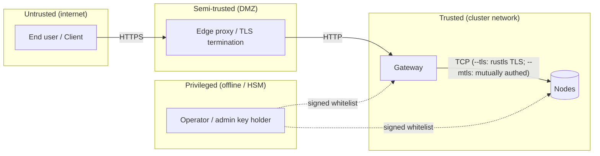

# Модель угроз

> ⚠ **Translation may be stale.** This file was last synced before Stage 12-15 (versioning + deletion, HNSW-backed semantic search, /spotlight ROI, streaming /holo, /diff, /similar, auto-repair-on-read, background scrub, typed RPC layer with timeouts + NoLiveNodes panic-fix, per-folder inline upload). The English source under [../](../) is the canon for any new feature; the [Unreleased] block of [../../CHANGELOG.md](../../CHANGELOG.md) lists every delta this translation does not yet cover.

Этот документ перечисляет **противников**, **активы**, **предположения
о доверии** и **меры защиты** для развёртывания holofs. Используется
таксономия STRIDE ([Howard & LeBlanc 2003](https://learn.microsoft.com/en-us/azure/security/develop/threat-modeling-tool-threats))
для классификации угроз и линза [LINDDUN](https://linddun.org/) для
вопросов конфиденциальности.

## Содержание

1. [Область и активы](#1-scope-and-assets)
2. [Границы доверия](#2-trust-boundaries)
3. [Каталог противников](#3-adversary-catalogue)
4. [STRIDE-анализ](#4-stride-analysis)
5. [Privacy (LINDDUN)-анализ](#5-privacy-linddun-analysis)
6. [Не-цели и явные ограничения](#6-non-goals-and-explicit-limitations)
7. [Реестр остаточных рисков](#7-residual-risk-register)

---

## 1. Область и активы

### 1.1. В области

Рассматриваемая система — кластер holofs, описанный в
[architecture.md](./architecture.md):

- HTTP gateway (бинарник `holofs-web`, axum + Leptos SSR).
- Демоны node (бинарник `holofs-node`), 1..N на хост.
- Проводной протокол между ними (см. [api.md §2](./api.md#2-wire-protocol-tcp)).
- Состояние на диске (shard'ы, manifest'ы, catalog, whitelist).
- Подписанный whitelist + материал идентификации Ed25519.

### 1.2. Вне области

- Ядро операционной системы и гипервизор.
- TLS-терминирующий обратный прокси (если используется внешний).
- Браузер / клиентское приложение пользователя.
- Сторонние каналы, возникающие из разделяемых CPU-кешей с
  со-арендаторами (мера защиты: выделенные node для чувствительных
  развёртываний).
- Физические атаки на носители хранения.

### 1.3. Активы для защиты

| Актив                          | Конфиденциальность | Целостность | Доступность |
|--------------------------------|:--------------:|:---------:|:------------:|
| Payload объекта                | ●              | ●         | ●            |
| Метаданные объекта (имя, kind) | ◐              | ●         | ●            |
| Catalog (object → manifest)    |                | ●         | ●            |
| Whitelist + admin pubkey       |                | ●         | ●            |
| Секретные ключи Ed25519 для node | ●            | ●         |              |
| Данные о здоровье / живучести кластера |        | ●         | ◐            |

Легенда: ● критично, ◐ умеренно.

---

## 2. Границы доверия

| Граница            | Аутентификация                  | Шифрование      | Заметки по харденингу |
|--------------------|---------------------------------|-----------------|-----------------------|
| User → Edge        | На уровне приложения (cookies, JWT) | TLS 1.3     | Вне области           |
| Edge → Gateway     | Сегодня нет (план: mTLS)        | Нет / mTLS      | Привяжите gateway к приватному VLAN |
| Gateway ↔ Node     | Ed25519 challenge-response (+ опциональный mTLS) | Plain TCP или rustls TLS через `--tls` (Stage 6) | Wire-protocol nonce + подписанный handshake; `--mtls` добавляет проверку X.509-сертификата |
| Operator → Cluster | Admin Ed25519 подписывает whitelist | Out-of-band | Держите admin-ключ offline / HSM |

---

## 3. Каталог противников

| Противник                  | Позиция                             | Цель                              | Возможности    |
|----------------------------|-------------------------------------|-----------------------------------|----------------|
| **Внешний анонимный**      | Публичный интернет                  | Чтение / удаление объектов, DoS   | Сеть + L7      |
| **Скомпрометированный клиент** | Имеет валидную HTTP-сессию       | Эксфильтрация данных других пользователей | L7         |
| **Сетевой наблюдатель**    | На пути между gateway/nodes         | Чтение трафика, replay, MITM      | L3 / L4        |
| **Скомпрометированный node** | Имеет валидный ключ node          | Отдавать неверные данные, отказываться от audit | Проводной протокол |
| **Sybil-node**             | Не имеет ключа, но пытается присоединиться | Загрязнить placement / dedup | Проводной протокол |
| **Скомпрометированный оператор** | Имеет admin-ключ              | Полный контроль над кластером     | Полные         |
| **Внутреннее чтение**      | Чтение файловой системы на одном хосте node | Чтение shard'ов / метаданных | OS shell    |
| **Принуждение / повестка** | Юридическое принуждение операторов  | Восстановить конкретный объект    | Юридические    |

Противник, заслуживающий наибольших усилий по моделированию, —
**скомпрометированный node**: полностью аутентифицированный peer,
ведущий себя избирательно неправильно. Большинство мер защиты в этом
документе нацелены на него.

---

## 4. STRIDE-анализ

### 4.1. Spoofing

| # | Угроза                                              | Мера защиты |
|---|-----------------------------------------------------|-------------|
| S1 | Атакующий выдаёт себя за node, чтобы получать shard'ы | Ed25519 challenge (`AuthChallenge`) — gateway проверяет подпись pubkey из whitelist перед тем, как доверять любому ответу. См. [api.md §2 handshake](./api.md#authentication-handshake). |
| S2 | Атакующий выдаёт себя за gateway перед node          | Запускайте с `--mtls`: node отказывает в любом TLS-handshake, клиентский сертификат которого не подписан общим CA. Без `--mtls` опирайтесь на развёртывание в приватный VLAN. |
| S3 | Подделанное обновление whitelist                    | Whitelist подписан admin Ed25519-ключом; node отказывают в неподписанных или неправильно подписанных обновлениях. |
| S4 | Replay захваченного ответа                          | Per-request nonce в `AuthChallenge` гарантирует, что подписи привязываются к свежему вызову. Wire frames пока не несут replay-nonce для не-handshake сообщений — см. [§7](#7-residual-risk-register). |

### 4.2. Tampering

| # | Угроза                                              | Мера защиты |
|---|-----------------------------------------------------|-------------|
| T1 | Node возвращает повреждённый payload shard         | Идентичность каждого shard — `SHA-256(coeffs ‖ payload)`. Gateway пересчитывает; несовпадение отвергается и учитывается против `reputation`. |
| T2 | Node возвращает другой shard, чем запрошено        | Manifest перечисляет `shard_hashes[c][l][idx]`; gateway проверяет, что хэш соответствует ожидаемой записи. |
| T3 | Порча на диске (bitrot)                            | Имена shard-файлов *являются* их хэшами — startup-скан и фоновая задача `Audit` обнаруживают несовпадения и запускают RLNC repair. |
| T4 | Модификация catalog-файла                          | Записи catalog — `write-tmp+fsync+rename`. Merkle-корень в каждом manifest перекрёстно проверяет все shard'ы; перевернутые записи catalog проявляются как сбои декодирования. |
| T5 | MITM модифицирует wire-байты                       | Запускайте с `--tls`: rustls (TLS 1.2/1.3 через провайдер `ring`) аутентифицирует сервер и шифрует каждый фрейм. Проверка хэша shard остаётся defence-in-depth проверкой внутри TLS-туннеля. |

### 4.3. Repudiation

| # | Угроза                                              | Мера защиты |
|---|-----------------------------------------------------|-------------|
| R1 | Node отрицает выдачу неправильного ответа          | Reputation score обновляется на стороне сервера из аудитопригодных хэш-несовпадений; ops-дашборд записывает `audit_fail_total` для каждой node. |
| R2 | Оператор отрицает admin-действие                    | Обновления whitelist несут Ed25519-подпись администратора; *закоммиченный* файл whitelist — это audit trail. |

### 4.4. Information disclosure

| # | Угроза                                              | Мера защиты |
|---|-----------------------------------------------------|-------------|
| I1 | Одна node, читающая «свои» shard'ы, раскрывает plaintext | Отдельный shard — это `coeffs · chunks` над GF(2⁸), случайная линейная комбинация chunk'ов. Восстановление plaintext из меньше чем `K` независимых shard'ов требует решения недоопределённой линейной системы — теоретико-информационно неосуществимо **для одного случайного shard**. |
| I2 | Противник собирает ≥ K shard'ов одного объекта      | RLNC над публичным GF(2⁸) **не** является схемой шифрования. Любые K линейно независимых shard'ов реконструируют payload. Меры защиты: **шифрование at-rest на каждой node** (планируется Stage 7) и **разнообразие размещения** — при `RendezvousZoneAware` K shard'ов охватывают ≥ K разных node в ≥ ⌈K/zone_count⌉ зонах, поэтому их чтение требует компрометации стольких же. |
| I3 | Утечка метаданных: имя + kind + размер              | Manifest хранит имя объекта и content type в plaintext. Чувствительные развёртывания должны хэшировать или псевдонимизировать имена до загрузки. |
| I4 | Сторонние каналы (cache, network timing)            | В 0.1 не смягчается — используйте выделенные CPU / сеть для чувствительных развёртываний. |
| I5 | Утечка резервной копии                              | Резервные копии наследуют ту же угрозу: они должны быть зашифрованы at rest (`restic --pass-file`, S3 SSE-KMS). |
| I6 | Утечка holoshare                                    | Отдельный файл `.holoshare` — одна доля Shamir-via-RLNC разбиения `(k,n)`. Обладание меньше чем `k` теоретико-информационно безопасно (см. [theory.md §8](./theory.md#8-shamir-via-rlnc-key-escrow)). |

### 4.5. Denial of service

| # | Угроза                                              | Мера защиты |
|---|-----------------------------------------------------|-------------|
| D1 | Затопление gateway аплоадами                       | Gateway должен работать за rate-limiting обратным прокси. Размер wire-frame ограничен `MAX_FRAME = 64 MiB` на каждой node. |
| D2 | Одна node отказывает в запросах                    | RLNC имеет ≥ K-of-N избыточность на слой. Задача repair обнаруживает и воскрешает shard'ы на живые node. |
| D3 | Скоординированный отказ половины кластера          | Margin рассчитан на **любую одну зону + рассеянные одиночные отказы** (см. [theory.md §3](./theory.md#3-priority-layers)). Большие отказы деградируют постепенно: сначала теряется L3 (косметическая деталь), затем L2, L1. |
| D4 | «Спящая» node принимает put'ы, но никогда не возвращает get'ы | Задача audit отправляет случайные пробы `Audit(shard_hash)` — нереспонсивная или неправильно отвечающая node теряет reputation и перестаёт выбираться для placement. |
| D5 | Slow-loris по TCP                                  | Tokio I/O-таймауты на каждое чтение фрейма; конфигурируется через `HOLOFS_WIRE_TIMEOUT`. |
| D6 | Исчерпание памяти через огромный фрейм             | Фреймы > `MAX_FRAME` отвергаются до выделения. |

### 4.6. Elevation of privilege

| # | Угроза                                              | Мера защиты |
|---|-----------------------------------------------------|-------------|
| E1 | Sybil: атакующий поднимает N фейковых node, чтобы поглотить данные | Node присоединяются только если их pubkey появляется в admin-подписанном whitelist. Генерация валидных ключей не помогает — их должны допустить. |
| E2 | Скомпрометированный gateway получает доступ ко всему | У gateway нет admin-ключа; он не может создавать новые записи whitelist. Компрометация влияет на ingress/egress и свежесть catalog, но не может подорвать корень доверия. |
| E3 | Скомпрометированный admin-ключ                     | Это тотальная компрометация. Мера защиты: держать admin-ключ offline (HSM / бумажный бекап), ротировать через процедуру dual-control. |
| E4 | Эскалация привилегий внутри контейнера             | Контейнер работает под `uid 10001`, `readOnlyRootFilesystem: true`, `capabilities.drop: [ALL]`. |
| E5 | Path traversal в именах объектов                   | Имена объектов хранятся только в catalog; пути на диске адресуются по содержимому (`<hex2>/<hex62>.shard`). Имя объекта никогда не доходит до файловой системы. |

---

## 5. Privacy (LINDDUN)-анализ

Holofs **не** является privacy-preserving файловой системой по дизайну —
она приоритизирует долговечность, dedup и устойчивость. Ниже —
поверхности, которые операторы должны учитывать.

| Категория LINDDUN  | Опасение                                  | Действие оператора |
|--------------------|-------------------------------------------|-------------------|
| **L**inkability    | MinHash-скетчи раскрывают сходство текстов; перцептуальные хэши связывают near-duplicate изображения. | Отключите analytics-endpoint'ы (`/similar`, `/diff`) для privacy-чувствительных арендаторов. |
| **I**dentifiability | Имена объектов хранятся буквально.       | Хэшируйте / псевдонимизируйте имена на стороне клиента. |
| **N**on-repudiation | Audit-логи идентифицируют node, отдающие контент. | Приемлемо в доверенных ops-контекстах. |
| **D**etectability  | Существование объекта выводимо из `/api/stats`. | Только аутентифицированный `/api/stats`. |
| **D**isclosure     | См. §4.4 — I1–I6.                        | At-rest шифрование Stage 7. |
| **U**nawareness    | Dedup означает, что аплоад *другого арендатора* может породить тот же `data_cid`. | Только однотенантные развёртывания, когда это важно. |
| **N**oncompliance  | GDPR «право на стирание» — `DELETE /<name>` отправляет `Purge` всем node; но **shard'ы могли быть резервно скопированы off-site**. | Документируйте политику хранения резервных копий; экспонируйте `holofs-admin shred` для стирания forensic-grade. |

---

## 6. Не-цели и явные ограничения

Следующее **не** предоставляется holofs 0.1 и требует внешнего контроля
при необходимости:

1. **Сквозное шифрование.** Payload'ы хранятся закодированными, но не
   зашифрованными. Node с ≥ K shard'ов одного объекта может его
   реконструировать. Операторы должны классифицировать holofs как
   «data-in-clear» at rest.
2. **Изоляция арендаторов.** Нет per-user namespace; все объекты
   делят один catalog. Multi-tenant развёртывания должны быть фронтируемы
   авторизующим прокси.
3. **Tamper-evident audit log.** Reputation отслеживает плохое поведение
   node, но не производит подписанный append-only лог.
4. **Криптографический anti-replay на wire frames.** Только
   `AuthChallenge` несёт nonce. Stage 7 добавляет per-session keying.
5. **Квантовая стойкость.** Ed25519 и SHA-256 — pre-quantum. Stage 8
   оценивает миграцию на PQ.

---

## 7. Реестр остаточных рисков

| Риск                                                | Серьёзность | Вероятность | Компенсирующий контроль |
|-----------------------------------------------------|:-----------:|:-----------:|-------------------------|
| Wire-трафик в открытом виде в общем LAN             | Низкая      | Низкая      | Смягчается `--tls` (rustls TLS 1.2/1.3, Stage 6). Операторы, не устанавливающие `--tls`, должны ограничиться приватным VLAN. |
| Компрометация admin-ключа                           | Критическая | Низкая      | Offline-хранение; квартальная учебная ротация |
| Replay wire-frame (не-handshake)                    | Средняя     | Низкая      | Привязка хэша ограничивает ущерб целостностью, не конфиденциальностью |
| Атаки по сторонним каналам на разделяемый CPU       | Средняя     | Низкая      | Выделенные node для чувствительных нагрузок |
| Утечка резервной копии                              | Высокая     | Средняя     | Шифровать резервные копии (`restic`, SSE-KMS) |
| Неполное GDPR-стирание из-за бекапов                | Средняя     | Средняя     | Документированная политика хранения + раскрытие клиентам |
| Компрометация оператора через supply chain          | Высокая     | Низкая      | Воспроизводимые сборки + подписанные релизы (Stage 8) |

У каждого риска есть владелец (`@holofs/security`) и плановый релиз с
мерой защиты. Отслеживайте через GitHub issues с меткой `security`.
