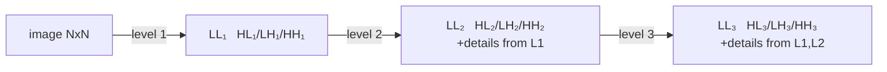
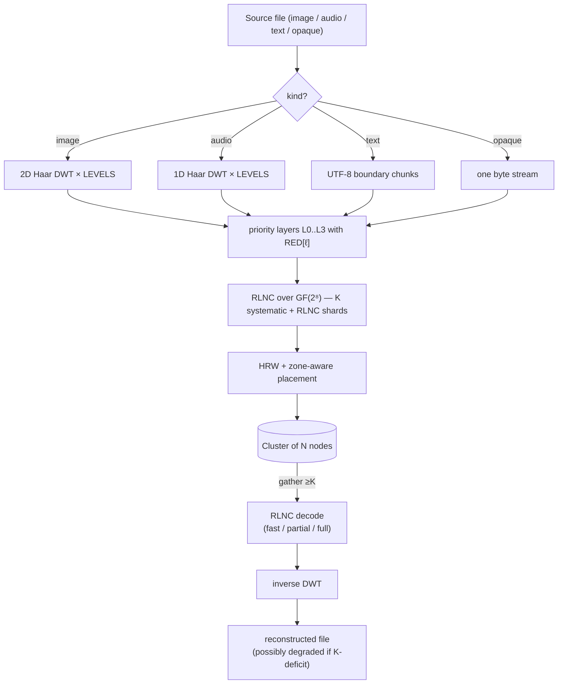

# Theory

Mathematical foundations of holofs. Each section has formal definitions,
relevant formulas, intuition, and references to the literature.

> Math notation: GitHub renders `$…$` and `$$…$$` via KaTeX. Diagrams are
> Mermaid blocks (also native on GitHub).

## Contents

1. [Galois field GF(2⁸)](#1-galois-field-gf2)
2. [Random Linear Network Coding (RLNC)](#2-random-linear-network-coding-rlnc)
3. [Haar Discrete Wavelet Transform](#3-haar-discrete-wavelet-transform)
4. [Priority layers and holographic degradation](#4-priority-layers-and-holographic-degradation)
5. [Highest Random Weight (rendezvous) hashing](#5-highest-random-weight-rendezvous-hashing)
6. [Zone-aware placement](#6-zone-aware-placement)
7. [Content addressing and Merkle trees](#7-content-addressing-and-merkle-trees)
8. [Shamir secret sharing ↔ RLNC](#8-shamir-secret-sharing--rlnc)
9. [Bottom-K MinHash](#9-bottom-k-minhash)
10. [Perceptual hashing on DWT-LL](#10-perceptual-hashing-on-dwt-ll)
11. [Repair / regenerating codes](#11-repair--regenerating-codes)

---

## 1. Galois field GF(2⁸)

We treat each byte as an element of the finite field

$$
\mathrm{GF}(2^8) \;=\; \mathrm{GF}(2)[x] \;/\; \langle\, x^8 + x^4 + x^3 + x^2 + 1 \rangle,
$$

i.e. polynomials over $\mathbb{F}_2$ with degree $< 8$, reduced modulo the
Rijndael / AES polynomial $p(x) = \texttt{0x11d}$. Addition is bitwise XOR:

$$
a \oplus b = (a_7 \oplus b_7,\, a_6 \oplus b_6,\, \dots,\, a_0 \oplus b_0).
$$

Multiplication is polynomial multiplication mod $p(x)$. We implement it via
discrete-log tables relative to the generator $\alpha = \texttt{0x02}$:

$$
a \cdot b \;=\; \alpha^{\log_\alpha a + \log_\alpha b} \quad \text{for } a, b \neq 0,
$$

$$
a^{-1} \;=\; \alpha^{255 - \log_\alpha a}.
$$

Each multiplication is two table lookups + one addition. The `exp` table is
duplicated to length 512 so that `log[a] + log[b]` never wraps, eliminating
the modulo in the hot path.

**Why GF(2⁸).** It fits in a byte, has 255 non-zero elements (plenty of
distinct coefficients for RLNC), and 8-bit table lookups are cache-friendly.
GF(2¹⁶) gives lower linear-dependence probability but doubles memory.

**Implementation.** [`holofs-core::gf`](../crates/holofs-core/src/gf.rs).

**References.**

- Lin & Costello, *Error Control Coding* (2nd ed., 2004), §2.6.
- Joan Daemen & Vincent Rijmen, *The Design of Rijndael* (2002).

---

## 2. Random Linear Network Coding (RLNC)

A layer of data is split into $K$ symbols $s_0, s_1, \ldots, s_{K-1}$ (each
symbol is a byte vector of length `sym_len`). A *shard* is a pair
$(\mathbf{c}, \mathbf{p})$ where the coefficient vector
$\mathbf{c} = (c_0, \ldots, c_{K-1}) \in \mathrm{GF}(2^8)^K$ and the payload is

$$
\mathbf{p} \;=\; \bigoplus_{i=0}^{K-1} c_i \cdot s_i.
$$

The XOR / multiplication is per-byte over $\mathrm{GF}(2^8)$.

### Decoding

Given $K$ shards $\{(\mathbf{c}^{(j)}, \mathbf{p}^{(j)})\}_{j=0}^{K-1}$ we
have the linear system

$$
\underbrace{\begin{pmatrix} \mathbf{c}^{(0)} \\ \mathbf{c}^{(1)} \\ \vdots \\ \mathbf{c}^{(K-1)} \end{pmatrix}}_{C}
\;
\underbrace{\begin{pmatrix} s_0 \\ s_1 \\ \vdots \\ s_{K-1} \end{pmatrix}}_{S}
\;=\;
\underbrace{\begin{pmatrix} \mathbf{p}^{(0)} \\ \mathbf{p}^{(1)} \\ \vdots \\ \mathbf{p}^{(K-1)} \end{pmatrix}}_{P}
$$

If $C$ is invertible we recover $S = C^{-1} P$ via Gauss–Jordan elimination
in $O(K^3)$ field operations + $O(K^2 \cdot \texttt{sym\_len})$ for back-substitution.

### Linear-independence probability

With $n$ random shards drawn uniformly from $\mathrm{GF}(2^8)^K$, the
probability that any $K$ are *not* linearly independent (decoding fails) is
bounded by

$$
P(\text{dependent}) \;\leq\; \frac{K}{2^8 - 1} \;\approx\; \frac{K}{255}.
$$

For our $K = 16$ this gives ≈ 6.3 %, easily compensated by sending
$n > K$ shards.

### Systematic shards

In holofs, the first $\min(n, K)$ shards are deterministically
**systematic**: $\mathbf{c}^{(i)} = \mathbf{e}_i$ (standard basis), so the
payload is literally the raw symbol $s_i$. This yields two enormous wins:

1. **Fast path.** When all $K$ systematic shards are available, decoding is
   a memcpy: $\hat S = (\mathbf{p}^{(0)} \,|\, \mathbf{p}^{(1)} \,|\, \cdots)$.
   No Gaussian elimination, no GF multiplications.

2. **Partial recovery.** When some systematic shards are missing, the
   problem reduces to solving a smaller $r \times r$ system (where $r$ is
   the number of unknowns) — much cheaper than full $K \times K$.

The remaining $n - K$ shards are pure RLNC: random coefficients, used as
"insurance" for cases where systematic shards die.

**Implementation.** [`holofs-core::rlnc`](../crates/holofs-core/src/rlnc.rs).

**References.**

- Rudolf Ahlswede, Ning Cai, Shuo-Yen R. Li, Raymond W. Yeung,
  ["Network Information Flow"](https://doi.org/10.1109/18.850663),
  IEEE Trans. Inf. Theory, 2000.
- Tracey Ho et al., ["A Random Linear Network Coding Approach to
  Multicast"](https://doi.org/10.1109/TIT.2006.881746),
  IEEE Trans. Inf. Theory, 2006.
- Christina Fragouli, Jean-Yves Le Boudec, Jörg Widmer,
  ["Network coding: an instant primer"](https://doi.org/10.1145/1198255.1198262),
  SIGCOMM CCR, 2006.

---

## 3. Haar Discrete Wavelet Transform

### 1D Haar step

Given a length-$2n$ signal $(x_0, x_1, \ldots, x_{2n-1})$, the Haar step
produces *approximation* coefficients $\mathbf{a}$ and *detail* coefficients
$\mathbf{d}$:

$$
a_k \;=\; \frac{x_{2k} + x_{2k+1}}{\sqrt{2}}, \qquad
d_k \;=\; \frac{x_{2k} - x_{2k+1}}{\sqrt{2}}.
$$

$\mathbf{a}$ captures low-frequency content (average), $\mathbf{d}$ the
high-frequency content (difference). The normalisation $1/\sqrt{2}$ makes
the transform orthonormal — energy is preserved:

$$
\sum_i x_i^2 \;=\; \sum_k a_k^2 + \sum_k d_k^2.
$$

### Multi-level pyramid

Applying the Haar step recursively to $\mathbf{a}$ alone gives a multi-
resolution pyramid. After $L$ levels the signal is decomposed into
$L+1$ bands: one coarse LL band (size $2n / 2^L$) and $L$ detail bands of
decreasing resolution.

### 2D Haar (tensor product)

For images we apply the 1D Haar to all rows then to all columns. One level
produces four sub-bands:

| Sub-band | Captures                              |
|----------|---------------------------------------|
| **LL**   | low-frequency (coarse structure)      |
| **LH**   | horizontal detail (vertical edges)    |
| **HL**   | vertical detail (horizontal edges)    |
| **HH**   | diagonal detail (corners, texture)    |

Recursing into LL alone yields the standard wavelet pyramid:

### Inverse

Haar is exactly invertible: $x_{2k} = (a_k + d_k)/\sqrt{2}$,
$x_{2k+1} = (a_k - d_k)/\sqrt{2}$. We can recover the original signal
from the full set of $\{a, d\}$ coefficients.

### Why Haar specifically

- Simplest orthogonal wavelet — implementation is ~30 lines.
- Linear-phase (no spatial shift).
- For demos of priority degradation, sharper wavelets (Daubechies-4,
  CDF 9/7) would give better PSNR per bit but the same qualitative
  behaviour. We stay simple to keep the math accessible.

**Implementation.** [`holofs-core::transform`](../crates/holofs-core/src/transform.rs).

**References.**

- Stéphane Mallat, *A Wavelet Tour of Signal Processing*
  (3rd ed., Academic Press, 2008) — §7 (orthonormal wavelet bases).
- Alfréd Haar, "Zur Theorie der orthogonalen Funktionensysteme",
  *Mathematische Annalen*, 1910 (the original paper).

---

## 4. Priority layers and holographic degradation

The DWT sub-bands carry information of unequal importance. Visually:

- Losing LL ⇒ losing the picture entirely (this is the thumbnail).
- Losing HH₁ ⇒ losing the finest texture, often imperceptible.

We encode each band with a different RLNC redundancy:

$$
\mathrm{RED}[\ell] \;\in\; \{\,4.0,\, 2.5,\, 1.6,\, 1.15\,\} \quad \text{for } \ell = 0, 1, 2, 3,
$$

so layer 0 (LL) is stored with $\lfloor K \cdot 4.0 + 0.5 \rfloor = 64$
shards, while layer 3 (finest detail) gets
$\lfloor K \cdot 1.15 + 0.5 \rfloor = 18$. The code uses banker-style
rounding (`f32::round`), not ceiling — so `K · 1.15 = 18.4` rounds to
$18$, not $19$.

### Degradation curve

If a fraction $f$ of nodes fail, the probability that layer $\ell$ still
has $\geq K$ alive shards is approximately

$$
P_\ell(f) \;=\; \sum_{k=K}^{n_\ell} \binom{n_\ell}{k} (1-f)^k\, f^{n_\ell - k}
$$

(binomial; ignoring HRW clustering for the approximation). For
$\ell$ increasing, $n_\ell$ decreases, so the layers fail **in order from
high frequency to low** — exactly the visual behaviour of a holographic
plate that has been cut: the image stays recognisable, just blurrier.

### Empirical demo

On Kodak kodim23 (Monte-Carlo, 5000 trials per kill percentage,
40 nodes / 4 zones / K = 16):

| kill % | full picture | up to L2 | up to L1 | up to L0 only | dead |
|-------:|-------------:|---------:|---------:|--------------:|-----:|
|   10 % |       42.8 % |   57.2 % |    0.0 % |         0.0 % | 0.0 % |
|   25 % |        0.2 % |   96.5 % |    3.3 % |         0.0 % | 0.0 % |
|   50 % |        0.0 % |    0.0 % |   78.6 % |        21.4 % | 0.0 % |
|   75 % |        0.0 % |    0.0 % |    0.0 % |        12.1 % | 87.9 % |

**References.**

- Andres Albanese, Johannes Blömer, Jeff Edmonds, Michael Luby, Madhu
  Sudan, ["Priority Encoding Transmission"](https://doi.org/10.1109/18.556657),
  IEEE Trans. Inf. Theory, 1996. Original priority-coding scheme,
  conceptually identical to ours but applied to multicast video.
- Catherine Taylor, Jean-Yves Le Boudec, ["Holographic data storage with
  wavelet codecs"](https://www.epfl.ch/labs/lca/wp-content/uploads/2018/12/wavelet-codecs.pdf)
  (lecture notes, EPFL 2009) — clear treatment of DWT + erasure coding.

---

## 5. Highest Random Weight (rendezvous) hashing

Given a key $k$ (shard identifier) and a set of nodes $\{N_1, \ldots, N_m\}$,
HRW picks the node maximising a hash:

$$
\mathrm{place}(k) \;=\; \arg\max_{i \in [m]} \;\; h(k,\, N_i).
$$

We use [SplitMix64](https://prng.di.unimi.it/splitmix64.c) over a
$(\text{object\_id},\, \text{channel},\, \text{layer},\, \text{shard\_idx},\, \text{node\_id})$
tuple as $h$.

### Minimal disruption theorem

Removing one node from the cluster moves exactly the shards that mapped to
that node — others stay. Formally, if $N_j$ leaves, then for any key $k$
where $\mathrm{place}(k) = N_j$, the new placement is

$$
\mathrm{place}'(k) \;=\; \arg\max_{i \neq j} \;\; h(k, N_i),
$$

independent of all other nodes. This is the property that makes HRW the
right primitive for content-addressed storage with churn — consistent
hashing has similar properties but with O(log n) extra hops on a ring.

### Load balance

For $m$ identical nodes and uniformly random keys, the expected fraction
of keys on any single node is exactly $1/m$, with variance
$\frac{1}{m}(1 - \frac{1}{m})$ — same as a uniform throw.

**Implementation.** [`holofs-model::placement`](../crates/holofs-model/src/placement.rs).

**References.**

- David G. Thaler, Chinya V. Ravishankar,
  ["Using Name-Based Mappings to Increase Hit
  Rates"](https://doi.org/10.1109/90.664265),
  IEEE/ACM Trans. Networking, 1998.
- Karger et al., ["Consistent Hashing and Random Trees"](https://doi.org/10.1145/258533.258660),
  STOC 1997 — the alternative scheme; HRW is simpler when you just
  need "pick one of $m$".

---

## 6. Zone-aware placement

Real clusters have failure correlations: a whole rack or AZ can disappear
together. We layer a *quota* constraint on top of HRW: for each
(channel, layer) pair, no single zone may host more than
$\lceil n_\ell / z \rceil$ shards (where $z$ is the number of zones with
live nodes).

### Algorithm

For each $\mathrm{shard\_idx} = 0, 1, \ldots, n_\ell - 1$:

1. Score every live node by $h(\text{key}, \text{node})$.
2. Sort descending.
3. Walk down the list; take the first node whose **zone has not exceeded
   its quota**.

The deterministic ordering keeps placement stable: removing one node
shifts only shards that were on it, and only into the same zone (if
possible). Adding a node redistributes only $\sim 1/m$ of the load.

### Survival under zone failure

With $z$ zones and $n_\ell$ shards per layer, losing one whole zone leaves

$$
n_\ell^{\text{alive}} \;\geq\; n_\ell \cdot \frac{z - 1}{z}
$$

shards alive. For $n_\ell = 64$, $z = 4$, $K = 16$: lose 16 shards
(one quarter), keep 48 — well above the threshold of $K$.

In our 4-zone demo, **any** single-zone failure leaves the object
decodable down to L2 (only the finest L3 detail drops below threshold).

**Implementation.** `place_layer_zone_aware` in
[`holofs-model::placement`](../crates/holofs-model/src/placement.rs).

**References.**

- Sage A. Weil et al., ["CRUSH: Controlled, Scalable, Decentralized
  Placement of Replicated Data"](https://doi.org/10.1145/1188455.1188582),
  SC '06 — the inspiration; CRUSH does the same idea with weighted
  hierarchical hashing for Ceph.

---

## 7. Content addressing and Merkle trees

Every shard has a SHA-256 hash of its `(coeffs || payload)` bytes (with a
domain prefix `holofs-shard-v1`). The shard hashes are leaves of a
Merkle tree; the root is committed to the object manifest.

### Object CID

The Content IDentifier of an object is

$$
\mathrm{CID} \;=\; \mathrm{SHA256}(\,\texttt{holofs-data-v1} \,\|\, \text{channels} \,\|\, \text{params}\,).
$$

This is **deterministic from content**: two clients encoding the same
file with the same parameters produce the same CID. Two image files
that resize to the same canvas bytes (e.g. lossless PNG vs BMP of the
same source) produce the same CID — cross-format dedup falls out for
free.

### Why a Merkle tree, not just one root hash

- Verifiable repair: a regenerating node can prove it produced a new
  shard whose hash is in `shard_hashes`, even when the Merkle root has
  since been updated.
- Auditable streaming: a client downloading shards can verify each shard
  against the manifest as it arrives, rejecting corrupt shards before
  decoding.

**Implementations.** [`holofs-core::hash`](../crates/holofs-core/src/hash.rs) (FIPS
180-4 SHA-256, NIST-vector verified) and
[`holofs-core::merkle`](../crates/holofs-core/src/merkle.rs).

**References.**

- Ralph C. Merkle, "Protocols for Public Key Cryptosystems",
  *IEEE S&P*, 1980 — the original tree.
- FIPS PUB 180-4, *Secure Hash Standard* (NIST, 2015).
- IPFS Specifications, [Content Identifiers](https://github.com/multiformats/cid).

---

## 8. Shamir secret sharing ↔ RLNC

A $(K, N)$ Shamir scheme distributes a secret $s$ as $N$ evaluations of a
random polynomial of degree $K - 1$ over a finite field:

$$
f(x) \;=\; s + r_1 x + r_2 x^2 + \cdots + r_{K-1} x^{K-1}, \quad r_i \stackrel{\$}{\leftarrow} \mathbb{F}.
$$

Each party $i \in [N]$ receives $(x_i, f(x_i))$. Any $K$ shares reconstruct
$f$ (and hence $s$) via Lagrange interpolation; $K - 1$ shares reveal
nothing about $s$ (information-theoretic security).

### Equivalence to RLNC

The coefficient vector $\mathbf{c}^{(j)} = (1, x_j, x_j^2, \ldots, x_j^{K-1})$
makes each Shamir share a special RLNC shard. The reconstruction
matrix is a Vandermonde determinant, always non-zero for distinct $x_j$.

In holofs we don't use Vandermonde-Shamir directly; we use **random**
coefficient vectors. The security guarantee is slightly weaker (any
$K - 1$ shards leak a uniform pdf over the secret space — same as
Shamir in the worst case, but not for all coefficient choices). For
key-escrow use cases this is acceptable.

### holofs escrow

`holofs-analytics::escrow` builds on `holofs-core::rlnc::encode_layer_with_k`
with user-chosen $K, N$. Shards are serialised as `.holoshare` files
distributable to humans / devices. The escrow workflow is *pure-client*:
nothing is stored on the cluster.

**References.**

- Adi Shamir, ["How to Share a Secret"](https://doi.org/10.1145/359168.359176),
  Comm. ACM, 1979.
- Hugo Krawczyk, ["Secret Sharing Made Short"](https://link.springer.com/chapter/10.1007/3-540-48329-2_12),
  CRYPTO 1993 — encrypted-then-shared approach for very large secrets;
  out of scope for v0 but a natural next step.

---

## 9. Bottom-K MinHash

Given two documents $A, B$ represented as sets of $n$-shingles
(substrings of length $n$), the Jaccard similarity is

$$
J(A, B) \;=\; \frac{|A \cap B|}{|A \cup B|} \;\in\; [0, 1].
$$

Computing $|A \cap B|$ directly requires $|A| + |B|$ memory. MinHash gives
an unbiased estimator with fixed memory $k$:

1. Hash every shingle with a fixed hash $h$.
2. Keep the $k$ smallest distinct hash values: $A_k = \{h(s) : s \in A\}_{(1..k)}$.
3. Estimate Jaccard as

$$
\hat J(A, B) \;=\; \frac{|A_k \cap B_k|}{k}.
$$

This estimator has variance

$$
\mathrm{Var}(\hat J) \;=\; \frac{J(1 - J)}{k},
$$

so for $k = 64$ the standard deviation is $\leq 1/16 \approx 6\%$ —
enough to discriminate "near-duplicate" (J > 0.8) from "unrelated"
(J < 0.1) reliably.

### holofs use

`holofs-analytics::shingle` computes a 64-value MinHash on 5-byte shingles
at PUT time and stores it in `manifest.text_minhash`. At search time, we
compute Jaccard pairwise — no I/O, no decompression.

**Detected differences.** Identical files: $J = 1.0$. Small edits
(typos, paragraph reordering): typically $J \geq 0.85$. Substring
inclusion (one document copied into another): $J \in [0.2, 0.7]$
depending on length ratio. Unrelated: $J \approx 0$.

**References.**

- Andrei Z. Broder, ["On the resemblance and containment of
  documents"](https://doi.org/10.1109/SEQUEN.1997.666900),
  SEQUENCES '97 — original MinHash.
- Edith Cohen, ["Min-Wise Independent Permutations"](https://doi.org/10.1145/276698.276781),
  STOC 1998 — formal analysis.
- Sergei Vassilvitskii, Sanjeev Arora et al., *Mining of Massive
  Datasets* (3rd ed., 2020), §3 — practical primer.

---

## 10. Perceptual hashing on DWT-LL

The LL band of a $W \times H$ image after $L$ levels of DWT is a
$W/2^L \times H/2^L$ low-pass approximation — exactly the thumbnail
used by classical perceptual hashes (pHash uses DCT, dHash uses pixel
differences).

In holofs, **the first $K$ systematic shards of layer 0** literally
contain the LL pixels (as float-32 wavelet coefficients, byte-serialised).
We compute a per-channel byte-mean fingerprint

$$
\mathrm{fp}_i^{(c)} \;=\; \mathrm{clamp}_{0..255}\bigl(\mathrm{mean}(\mathrm{payload}(\mathrm{shard}_i^{(c)}))\bigr),
\quad i = 0, \ldots, K - 1.
$$

For our $K = 16$ each channel yields a $4 \times 4$ grid of mean
luminances — a classical dHash variant. The stored fingerprint
concatenates the three channels: $[\mathrm{R}_{0..15}\,|\,\mathrm{G}_{0..15}\,|\,\mathrm{B}_{0..15}]$
for 48 bytes on 3-channel images; audio and other 1-channel kinds use
only the first 16.

**Two distance metrics live on top of this fingerprint:**

- `/api/fingerprint/<name>` exposes a straight L₁ over the raw
  channel bytes,
  $d = \sum_{c, i} |\mathrm{fp}_i^{(c)} - \mathrm{fp}_i^{'(c)}|
  \in [0,\, 48 \cdot 255]$, useful for exact-equality checks.
- `/similar/<name>` derives dHash bits — one bit per adjacent-tile
  comparison within each channel strip, giving $3 \times 15 = 45$
  bits — and reports similarity as $1 - \mathrm{hamming} / 45$. dHash
  degrades gracefully under geometric flips and chroma divergence,
  where raw L₁ saturates.

**Importantly**: both metrics are computed **without decompressing the
object** — just by reading the systematic shards of layer 0. For a search
across thousands of objects this is $O(K)$ bytes per object.

**References.**

- Christoph Zauner, *Implementation and Benchmarking of Perceptual
  Image Hash Functions*, MSc thesis, Univ. Applied Sciences Hagenberg,
  2010 — comparison of aHash / dHash / pHash.
- Marr & Hildreth, ["Theory of edge detection"](https://www.jstor.org/stable/35407),
  Proc. Royal Society B, 1980 — coarse-to-fine vision motivation.

---

## 11. Repair / regenerating codes

When a node $v$ disappears (or a new node is added), we need to restore
its shards on a replacement. Two options:

**(a) Full reconstruction.** Download $K$ shards, decode the full object,
recompute the missing shards. Cost: $K \cdot \texttt{sym\_len}$ bytes
downloaded, plus $K^3$ GF operations for Gauss + $K \cdot \texttt{sym\_len}$
for re-encoding each lost shard.

**(b) RLNC regeneration** (what holofs does). Download $d$ shards
($K \leq d \leq n$), mix them as

$$
\mathbf{c}^{\text{new}} = \sum_{j=1}^d \alpha_j \mathbf{c}^{(j)}, \qquad
\mathbf{p}^{\text{new}} = \sum_{j=1}^d \alpha_j \mathbf{p}^{(j)}
$$

with random $\alpha_j$. The result is a new valid RLNC shard *in the same
linear span* — no need to fully decode and re-encode.

Cost: same bytes downloaded ($d \cdot \texttt{sym\_len}$ for $d = K$),
**no Gaussian elimination**, just GF mac operations. Empirically ~9× fewer
GF multiplications.

This places holofs in the family of *Minimum Bandwidth Regenerating*
(MBR) codes — see Dimakis et al. for the lower bounds and the trade-off
with *Minimum Storage Regenerating* (MSR).

**References.**

- Alexandros G. Dimakis, Brighten Godfrey, Yunnan Wu, Martin J.
  Wainwright, Kannan Ramchandran, ["Network Coding for Distributed
  Storage Systems"](https://doi.org/10.1109/TIT.2010.2054295),
  IEEE Trans. Inf. Theory, 2010 — established the field.
- Anwitaman Datta, Frédérique Oggier, ["An Overview of Codes Tailor-Made
  for Better Repairability in Networked Distributed Storage
  Systems"](https://doi.org/10.1145/2723772.2723778), ACM SIGACT News, 2013.

---

## Putting it all together

The full encode → store → recover pipeline:

Each box maps to a section above; refer to the per-section *Implementation*
links to navigate from theory directly to code.
