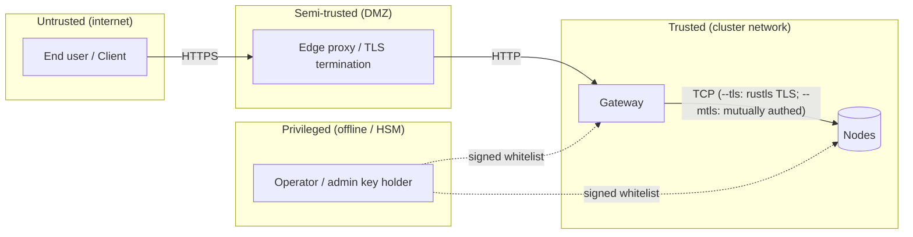

# Threat Model

This document enumerates the **adversaries**, **assets**, **trust
assumptions**, and **mitigations** for a holofs deployment. It uses the
STRIDE taxonomy ([Howard & LeBlanc 2003](https://learn.microsoft.com/en-us/azure/security/develop/threat-modeling-tool-threats))
to classify threats and the [LINDDUN](https://linddun.org/) lens for
privacy concerns.

## Contents

1. [Scope and assets](#1-scope-and-assets)
2. [Trust boundaries](#2-trust-boundaries)
3. [Adversary catalogue](#3-adversary-catalogue)
4. [STRIDE analysis](#4-stride-analysis)
5. [Privacy (LINDDUN) analysis](#5-privacy-linddun-analysis)
6. [Non-goals and explicit limitations](#6-non-goals-and-explicit-limitations)
7. [Residual risk register](#7-residual-risk-register)

---

## 1. Scope and assets

### 1.1. In scope

The system under consideration is a holofs cluster as described in
[architecture.md](./architecture.md):

- HTTP gateway (binary `holofs-web`, axum + Leptos SSR).
- Node daemons (binary `holofs-node`), 1..N per host.
- The wire protocol between them (see [api.md §2](./api.md#2-wire-protocol-tcp)).
- On-disk state (shards, manifests, catalog, whitelist).
- The signed whitelist + Ed25519 identity material.

### 1.2. Out of scope

- The operating system kernel and hypervisor.
- The TLS-terminating reverse proxy (if used externally).
- The user's browser / client application.
- Side channels arising from shared CPU caches with co-tenants
  (mitigation: dedicated nodes for sensitive deployments).
- Physical attacks on the storage media.

### 1.3. Assets to protect

| Asset                          | Confidentiality | Integrity | Availability |
|--------------------------------|:--------------:|:---------:|:------------:|
| Object payload                 | ●              | ●         | ●            |
| Object metadata (name, kind)   | ◐              | ●         | ●            |
| Catalog (object → manifest)    |                | ●         | ●            |
| Whitelist + admin pubkey       |                | ●         | ●            |
| Per-node Ed25519 secret keys   | ●              | ●         |              |
| Cluster health / liveness data |                | ●         | ◐            |

Legend: ● critical, ◐ moderate.

---

## 2. Trust boundaries

| Boundary           | Authentication                  | Encryption      | Hardening notes |
|--------------------|---------------------------------|-----------------|-----------------|
| User → Edge        | Application-level (cookies, JWT) | TLS 1.3         | Out of scope    |
| Edge → Gateway     | None today (planned: mTLS)      | None / mTLS     | Bind gateway to private VLAN |
| Gateway ↔ Node     | Ed25519 challenge-response (+ optional mTLS) | Plain TCP, or rustls TLS via `--tls` (Stage 6) | Wire-protocol nonce + signed handshake; `--mtls` adds X.509 cert verification |
| Operator → Cluster | Admin Ed25519 signs whitelist   | Out-of-band     | Keep admin key offline / HSM |

---

## 3. Adversary catalogue

| Adversary                  | Position                            | Goal                              | Capability      |
|----------------------------|-------------------------------------|-----------------------------------|----------------|
| **External anonymous**     | Public internet                     | Read / delete objects, DoS        | Network + L7   |
| **Compromised client**     | Holds valid HTTP session            | Exfiltrate other users' data      | L7             |
| **Network observer**       | On-path between gateway/nodes       | Read traffic, replay, MITM        | L3 / L4        |
| **Compromised node**       | Holds valid node key                | Serve wrong data, refuse audit    | Wire protocol  |
| **Sybil node**             | Owns no key but attempts to join    | Pollute placement / dedup         | Wire protocol  |
| **Compromised operator**   | Has admin key                       | Full cluster control              | Full           |
| **Insider read**           | Filesystem read on one node host    | Read shards / metadata            | OS shell       |
| **Coercion / subpoena**    | Legal compulsion against operators  | Recover specific object           | Legal          |

The adversary that warrants the most modeling effort is the **compromised
node**: a fully authenticated peer that misbehaves selectively. Most
mitigations in this document target it.

---

## 4. STRIDE analysis

### 4.1. Spoofing

| # | Threat                                              | Mitigation |
|---|-----------------------------------------------------|------------|
| S1 | Attacker impersonates a node to receive shards     | Ed25519 challenge (`AuthChallenge`) — gateway verifies signature with whitelist pubkey before trusting any response. See [api.md §2 handshake](./api.md#authentication-handshake). |
| S2 | Attacker impersonates the gateway to a node        | Run with `--mtls`: the node refuses any TLS handshake whose client certificate is not signed by the shared CA. Without `--mtls`, fall back to private-VLAN deployment. |
| S3 | Forged whitelist update                            | Whitelist is signed with admin Ed25519 key; nodes refuse unsigned or wrong-signature updates. |
| S4 | Replay of a captured response                      | Per-request nonce in `AuthChallenge` ensures signatures bind to a fresh challenge. Wire frames carry no replay nonce yet for non-handshake messages — see [§7](#7-residual-risk-register). |

### 4.2. Tampering

| # | Threat                                              | Mitigation |
|---|-----------------------------------------------------|------------|
| T1 | Node returns corrupt shard payload                 | Each shard's identity is `SHA-256(coeffs ‖ payload)`. Gateway recomputes; mismatch is rejected and counts against `reputation`. |
| T2 | Node returns a different shard than requested      | Manifest lists `shard_hashes[c][l][idx]`; gateway verifies hash matches the expected entry. |
| T3 | On-disk corruption (bitrot)                        | Shard filenames *are* their hashes — startup scan and the background `Audit` task detect mismatches and trigger RLNC repair. |
| T4 | Modification of catalog file                       | Catalog writes are `write-tmp+fsync+rename`. The Merkle root in each manifest cross-checks all shards; flipped catalog entries surface as decode failures. |
| T5 | MITM modifies wire bytes                           | Run with `--tls`: rustls (TLS 1.2/1.3 via the `ring` provider) authenticates the server and encrypts every frame. Shard-hash verification remains a defence-in-depth check inside the TLS tunnel. |

### 4.3. Repudiation

| # | Threat                                              | Mitigation |
|---|-----------------------------------------------------|------------|
| R1 | Node denies serving a wrong answer                 | Reputation score is updated server-side from auditable hash mismatches; ops dashboard records per-node `audit_fail_total`. |
| R2 | Operator denies admin action                       | Whitelist updates carry the admin's Ed25519 signature; the *committed* whitelist file is the audit trail. |

### 4.4. Information disclosure

| # | Threat                                              | Mitigation |
|---|-----------------------------------------------------|------------|
| I1 | Single node reading "its" shards reveals plaintext | An individual shard is `coeffs · chunks` over GF(2⁸), a random linear combination of chunks. Recovering plaintext from fewer than `K` independent shards requires solving an underdetermined linear system — information-theoretically infeasible **for a single random shard**. |
| I2 | Adversary collects ≥ K shards of one object        | RLNC over public GF(2⁸) is **not** an encryption scheme. Any K linearly independent shards reconstruct payload. Mitigation: **at-rest encryption per node** (planned Stage 7) and **placement diversity** — under `RendezvousZoneAware`, K shards span ≥ K different nodes in ≥ ⌈K/zone_count⌉ zones, so reading them requires compromising that many. |
| I3 | Metadata leak: name + kind + size                  | Manifest stores object name and content type in plaintext. Sensitive deployments should hash or pseudonymise names before upload. |
| I4 | Side channels (cache, network timing)              | Not mitigated in 0.1 — use dedicated CPUs / network for sensitive deployments. |
| I5 | Backup leak                                        | Backups inherit the same threat: they must be encrypted at rest (`restic --pass-file`, S3 SSE-KMS). |
| I6 | Holoshare leak                                     | An individual `.holoshare` file is one share of a `(k,n)` Shamir-via-RLNC split. Possessing fewer than `k` is information-theoretic safe (see [theory.md §8](./theory.md#8-shamir-via-rlnc-key-escrow)). |

### 4.5. Denial of service

| # | Threat                                              | Mitigation |
|---|-----------------------------------------------------|------------|
| D1 | Flood gateway with uploads                         | Gateway must run behind a rate-limiting reverse proxy. Wire-frame size is capped at `MAX_FRAME = 64 MiB` on every node. |
| D2 | Single node refuses requests                       | RLNC has ≥ K-of-N redundancy per layer. Auto-repair-on-read (Stage 14.3) + background scrub (Stage 15.x) detect and resurrect shards onto live nodes. |
| D3 | Coordinated half-cluster outage                    | Margin is sized for **any one zone + scattered single failures** (see [theory.md §3](./theory.md#3-priority-layers)). Larger outages degrade gracefully: L3 (cosmetic detail) lost first, then L2, L1. |
| D4 | "Sleeper" node accepts puts but never returns gets | Audit task issues random `Audit(shard_hash)` probes — a non-responsive or wrong-answering node drops reputation and stops being chosen for placement. Stage 14.x change: `MissingShard` is treated as neutral (no reputation hit), to avoid a dedup-collision feedback loop that previously kicked healthy nodes out of the live set. |
| D5 | Slow-loris on TCP                                  | Per-RPC `tokio::time::timeout` budget (`HOLOFS_RPC_TIMEOUT_MS`, default 8 s, `0` disables). A timed-out RPC poisons the pooled stream and retries once on a fresh socket via `is_likely_transient`. Caps user-visible latency at 8 s + one retry instead of the OS-level 60-75 s TCP timeout. |
| D6 | Memory exhaustion via huge frame                   | Frames > `MAX_FRAME` are rejected before allocation. |
| D7 | All nodes simultaneously dark (e.g. boot race, fleet-wide deploy) | Stage 15.x: `placement::place` returns `Result<_, NoLiveNodes>` instead of asserting; gateway surfaces a clean `503 ServiceUnavailable` (`GatewayError::ClusterDegraded`) instead of panicking. Previously a single un-typed `assert!` in `place_shard` could crash the gateway process via a single PUT during a fleet outage. |
| D8 | Concurrent-request flood exhausts axum runtime     | **v0.6.0 N3** — MEDIUM (default cap 64) and LONG (default cap 8) route buckets carry a `tokio::sync::Semaphore` guard. On saturation the middleware returns `503 Service Unavailable` immediately (rather than piling tasks onto the runtime). Configurable via `HOLOFS_MEDIUM_CONCURRENCY` / `HOLOFS_LONG_CONCURRENCY`. Rejections count toward `holofs_backpressure_rejected_total{bucket}`. |
| D9 | Slow handler ties up the axum task queue          | **v0.6.0 N7** — per-bucket deadlines (SHORT 10 s / MEDIUM 60 s / LONG 5 min) enforced by a `tokio::time::timeout` middleware. Elapsed → `504 Gateway Timeout`; `holofs_handler_timeouts_total{bucket}` bumped. Streaming endpoints + MCP intentionally unbudgeted. |
| D10 | Silent kill of a background loop by panic         | **v0.6.0 N2** — every long-running loop (monitor / auditor / scrub / reputation-persist) is spawned inside `supervised_spawn`, which catches panics via `JoinError` and restarts with exponential backoff (1 → 30 s). Restarts count toward `holofs_supervised_task_restarts_total{task}`. |

### 4.6. Elevation of privilege

| # | Threat                                              | Mitigation |
|---|-----------------------------------------------------|------------|
| E1 | Sybil: attacker spawns N fake nodes to absorb data | Nodes are joined only if their pubkey appears in the admin-signed whitelist. Generating valid keys does not help — they must be admitted. |
| E2 | Compromised gateway accesses everything            | Gateway has no admin key; it cannot mint new whitelist entries. Compromise affects ingress/egress and catalog freshness but cannot subvert the trust root. |
| E3 | Compromised admin key                              | This is total compromise. Mitigation: keep admin key offline (HSM / paper backup), rotate via dual-control procedure. |
| E4 | Privilege escalation inside container              | Container runs as `uid 10001`, `readOnlyRootFilesystem: true`, `capabilities.drop: [ALL]`. |
| E5 | Path traversal in object names                     | Object names are stored in catalog only; on-disk paths are content-addressed (`<hex2>/<hex62>.shard`). Object name never reaches the filesystem. |
| E6 | Unauthenticated caller kills nodes / triggers full-cluster GC | **v0.6.0 N6** — `POST /admin/node` (kill/revive) and `POST /api/gc` require `Authorization: Bearer $HOLOFS_ADMIN_TOKEN` when the env var is set. Missing → 401, wrong → 401, env unset → **403 (surface disabled)** as safe-by-default. Dev override `HOLOFS_ADMIN_UNAUTHENTICATED=1` re-opens the endpoints and logs a WARN at boot. Rejections split by reason in `holofs_admin_auth_failures_total{outcome}`. |

---

## 5. Privacy (LINDDUN) analysis

Holofs is **not** a privacy-preserving filesystem by design — it
prioritises durability, dedup, and resilience. The following are surfaces
operators must consider.

| LINDDUN category   | Concern                                  | Operator action |
|--------------------|------------------------------------------|-----------------|
| **L**inkability    | MinHash sketches reveal text similarity; perceptual hashes link near-duplicate images. | Disable analytics endpoints (`/similar`, `/diff`) for privacy-sensitive tenants. |
| **I**dentifiability | Object names are stored verbatim.       | Hash / pseudonymise names client-side. |
| **N**on-repudiation | Audit logs identify nodes serving content. | Acceptable in trusted ops contexts. |
| **D**etectability  | Existence of an object is inferable from `/api/stats`. | Authenticated `/api/stats` only. |
| **D**isclosure     | See §4.4 — I1–I6.                       | Stage 7 at-rest encryption. |
| **U**nawareness    | Dedup means *another tenant's* upload may produce the same `data_cid`. | Single-tenant deployments only when this matters. |
| **N**oncompliance  | GDPR "right to erasure" — `DELETE /<name>` issues `Purge` to all nodes; but **shards may have been backed up off-site**. | Document backup retention; expose `holofs-admin shred` for forensic-grade erasure. |

---

## 6. Non-goals and explicit limitations

The following are **not** offered by holofs 0.1 and require external
controls if needed:

1. **End-to-end encryption.** Payloads are stored encoded but not
   encrypted. A node with ≥ K shards of one object can reconstruct it.
   Operators must classify holofs as "data-in-clear" at rest.
2. **Tenant isolation.** There is no per-user namespace; all objects
   share a single catalog. Multi-tenant deployments must front holofs
   with an authorising proxy.
3. **Tamper-evident audit log.** Reputation tracks node misbehavior but
   does not produce a signed, append-only log.
4. **Cryptographic anti-replay on wire frames.** Only the `AuthChallenge`
   carries a nonce. Stage 7 adds per-session keying.
5. **Quantum resistance.** Ed25519 and SHA-256 are pre-quantum. Stage 8
   evaluates PQ migration.

---

## 7. Residual risk register

| Risk                                                | Severity | Likelihood | Compensating control |
|-----------------------------------------------------|:--------:|:----------:|----------------------|
| Wire traffic in cleartext on shared LAN             | Low      | Low        | Mitigated by `--tls` (rustls TLS 1.2/1.3, Stage 6). Operators that do not set `--tls` should restrict to a private VLAN. |
| Compromise of admin key                             | Critical | Low        | Offline storage; quarterly rotation drill |
| Wire-frame replay (non-handshake)                   | Medium   | Low        | Hash binding limits damage to integrity, not confidentiality |
| Side-channel attacks on shared CPU                  | Medium   | Low        | Dedicated nodes for sensitive workloads |
| Backup leak                                         | High     | Medium     | Encrypt backups (`restic`, SSE-KMS) |
| GDPR erasure incomplete due to backups              | Medium   | Medium     | Documented retention policy + customer disclosure |
| Operator compromise via supply chain                | High     | Low        | Reproducible builds + signed releases (Stage 8) |

Each risk has an owner (`@holofs/security`) and a planned mitigation
release. Track via GitHub issues with label `security`.
